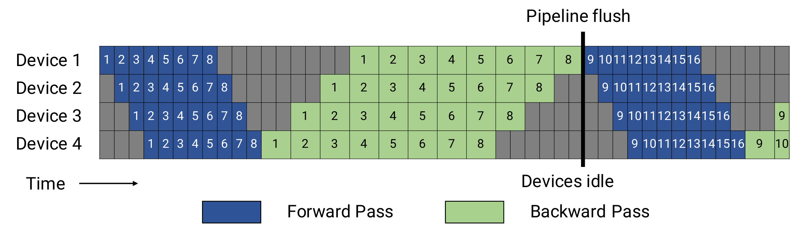
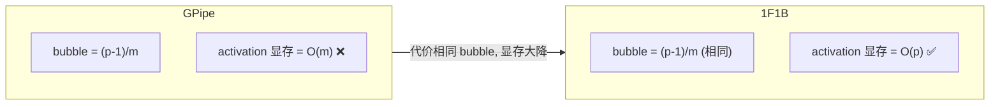

# 01 · GPipe 与 1F1B

> 本篇承接总览，介绍 PP 调度的前两代：GPipe（先完成全部 forward，再统一做 backward）和 1F1B / PipeDream-Flush（forward 与 backward 交错执行）。两者的 bubble 完全相同，但 1F1B 把 activation 显存从 $O(m)$ 降到 $O(p)$，这是 PP 能够用于大模型训练的根本前提。

论文：Huang et al., *GPipe*, 2018, [arXiv:1811.06965](https://arxiv.org/abs/1811.06965)；Narayanan et al., *PipeDream / Memory-Efficient Pipeline-Parallel (1F1B-Flush)*, 2020-2021, [arXiv:2006.09503](https://arxiv.org/abs/2006.09503)。代码：`schedules.py`。

---

## 1. GPipe：all-forward-then-all-backward

GPipe 把 batch 切成 $m$ 个 micro-batch，先把全部 $m$ 个 micro-batch 的 forward 依次跑完，再统一执行全部 backward：

```
p=4 stage, m=4 micro-batch  (F_i=micro-batch i 的 forward, B_i=backward)
时间 →
s0  F1 F2 F3 F4 .  .  .  B4 B3 B2 B1
s1  .  F1 F2 F3 F4 .  B4 B3 B2 B1 .
s2  .  .  F1 F2 F3 F4 B4 B3 B2 B1 . .       ← 中间大段 bubble
s3  .  .  .  F1 F2 F3 F4 B4 B3 B2 B1
              ↑全部forward完  ↑才开始backward
```

- bubble：流水线头部需要填充 $p-1$ 格、尾部需要排空 $p-1$ 格，bubble fraction 为 $(p-1)/(m+p-1)$（见 README 第 2 节）。
- 更严重的问题是 activation 显存为 $O(m)$：backward 依赖 forward 的中间 activation，而 GPipe 在做完所有 forward 之后才开始 backward，因此 $m$ 个 micro-batch 的 activation 必须同时驻留在显存中。压缩 bubble 需要较大的 $m$，而 $m$ 越大显存占用越高，bubble 与显存在这里直接冲突。GPipe 用 activation recompute 来缓解，但并没有从根本上解决这个问题。



> 图：GPipe / all-forward-then-all-backward 的调度（Megatron 论文画法，比 ASCII 更精确）。每个 device 先跑完所有 micro-batch 的 forward，再统一 backward；末尾 backward 期间前面 stage 的大段空闲就是 bubble。注意 backward 格子约为 forward 的 2 倍宽（$t_b \approx 2 t_f$），这也是真实 bubble 略大于「格数比」的原因。（Narayanan et al. 2021, Fig 3；[arXiv:2104.04473](https://arxiv.org/abs/2104.04473)）

## 2. 1F1B：尽早 backward，尽早释放 activation

PipeDream-Flush（即 1F1B）的观察是：一个 micro-batch 完成 forward 之后，不必等待其它 micro-batch，可以尽快执行它的 backward，随后立即释放它的 activation。稳态下每个 stage 严格按照一次 forward、一次 backward 的节奏交替执行（1 Forward 1 Backward，1F1B 由此得名）：

```
p=4, m=8。每个 stage 经历 warmup → 1F1B steady → cooldown
时间 →
s0 F1 F2 F3 F4 B1 F5 B2 F6 B3 F7 B4 F8 B5 B6 B7 B8
s1  . F1 F2 F3 B1 F4 B2 F5 B3 F6 B4 F7 B5 F8 B6 B7 B8
s2  .  . F1 F2 B1 F3 B2 F4 B3 F5 B4 F6 B5 F7 B6 F8 B7 B8
s3  .  .  . F1 B1 F2 B2 F3 B3 F4 B4 F5 B5 F6 B6 F7 B7 F8 B8
       warmup↑   ↑──────── steady: F/B 交替 ────────↑  ↑cooldown
```

- warmup：stage $r$ 先连续执行 $p-1-r$ 个 forward，把流水线填充到自己所在的位置。Megatron 中对应 `num_warmup_microbatches = pipeline_parallel_size - pipeline_parallel_rank - 1`（[[megatron-lm:megatron/core/pipeline_parallel/schedules.py#L884]]）。stage 0 的 warmup 最长（$p-1$ 个），最后一个 stage 的 warmup 为 0。
- steady state：每收到一个新的 forward 输入就执行一次 forward，同时执行一个较早 micro-batch 的 backward，forward 与 backward 在每个 stage 上严格 1:1 交替。
- cooldown：forward 全部结束后，把剩余的 backward 依次排空。

关键的收益在于显存降为 $O(p)$：稳态下，每个 stage 同时在途的 micro-batch 数量等于它的 warmup 数加 1，不超过 $p$，因此最多只需要保存 $p$ 个（而不是 $m$ 个）micro-batch 的 activation。stage 0 保存得最多（$p$ 个），最后一个 stage 最少（1 个），activation 显存沿 stage 逐级递减（03 详细讨论）。

bubble 保持不变：1F1B 的填充与排空格数和 GPipe 完全一样，bubble fraction 仍然是 $(p-1)/(m+p-1)$。


> 图：**上半** = 默认 1F1B（PipeDream-Flush）—— warmup 填满后进入 forward/backward 严格交替的稳态，backward 尽早做、activation 尽早释放，bubble 与 GPipe 相同但显存降到 $O(p)$。**下半** = interleaved 1F1B（每 device 2 个 chunk，bubble 更小，见 [02](./02_interleaved_zerobubble_dualpipe.md)）。对比 GPipe 图可见：1F1B 把 backward 提前穿插进了 forward 之间，而非全推到尾部。（Narayanan et al. 2021, Fig 4；[arXiv:2104.04473](https://arxiv.org/abs/2104.04473)）



> 概括来说：1F1B 并不节省时间（bubble 与 GPipe 相同），它节省的是显存。但正是显存的下降使 $m$ 可以取得更大（从而间接压缩 bubble），也让 PP 能够承载更大的模型，因此 1F1B 是所有现代 PP 调度的基线。

## 3. Megatron 的 1F1B 实现

`forward_backward_pipelining_without_interleaving`（`schedules.py`）的结构与 warmup、steady（1F1B）、cooldown 三段严格对应：

```python
# 1. warmup: 只 forward，把流水线填满（schedules.py:1484 附近）
recv_forward(...)                         # 第一个 stage 从上游收 activation
for k in range(num_warmup_microbatches):
    output = forward_step(...)            # 算 forward
    send_forward(output)                  # 发给下游 stage
    input = recv_forward(...)             # 为下一个 forward 收输入
    # 把 input 暂存进 input_tensors 队列（backward 要用）

# 2. steady state: 1F1B 交替（num_microbatches_remaining 次）
for k in range(num_microbatches_remaining):
    output = forward_step(...)            # 1 个 forward
    send_forward_recv_backward(...)       # 发 forward 输出, 同时收下游回来的 backward 梯度
    grad_in = backward_step(...)          # 1 个 backward（最早那个 micro-batch）
    send_backward_recv_forward(...)       # 发 backward 梯度给上游, 同时收下一个 forward 输入

# 3. cooldown: 把剩余 backward 排空（schedules.py 末尾）
for k in range(num_warmup_microbatches):
    grad_in = backward_step(...)
    send_backward(grad_in)
```

几个工程要点：
- `send_forward_recv_backward` 与 `send_backward_recv_forward` 把「发送本 stage 的输出」和「接收下游或上游的反向输入」合并为一次 P2P 调用（`p2p_communication.py`），既减少同步点，也便于 overlap。
- `input_tensors` 与 `output_tensors` 是两个队列：warmup 期间把每次 forward 的输入和输出依次入队，steady 与 cooldown 阶段的 backward 按 FIFO 顺序取出对应的 activation，这正对应 1F1B「最早 forward 的 micro-batch 最先做 backward」的顺序。
- `deallocate_output_tensor`（[[megatron-lm:megatron/core/pipeline_parallel/schedules.py#L157]]）在 backward 用完后立即释放 activation 的存储，从实现上保证了 $O(p)$ 的显存上界。
- 当 `num_warmup_microbatches >= total` 时调度退化（[[megatron-lm:megatron/core/pipeline_parallel/schedules.py#L903]]）：micro-batch 数量太少时整个过程只有 warmup 而没有稳态，此时等价于 GPipe。

## 4. warmup 数与显存

各 stage 的 warmup 数（$p-1-\mathrm{rank}$）直接决定它的峰值 activation：

| stage | warmup 数 | 在途 micro-batch（峰值 activation） |
|---|---|---|
| 0 (first) | $p-1$ | $p$ |
| 1 | $p-2$ | $p-1$ |
| … | … | … |
| $p-1$ (last) | 0 | 1 |

因此 first stage 的显存压力最大，这也是实际部署中常给 first stage 少分配一些层、或者对它多做 recompute 的原因（03 详细讨论）。Megatron 还提供了 `num_microbatches_with_partial_activation_checkpoints` 等参数，可以按 micro-batch 粒度控制 recompute。

## 5. 无流水线的退化情况

当 PP 大小为 1 时不存在流水线，对应 `forward_backward_no_pipelining`（[[megatron-lm:megatron/core/pipeline_parallel/schedules.py#L634]]）。此时仍然可能有多个 micro-batch（gradient accumulation）：循环 $m$ 次「forward + backward」，梯度累加进 `main_grad`（[01 · Megatron DDP：连续 buffer、bucket、grad-ready hook 与 overlap](../01_dp/01_ddp_and_overlap.md)），最后一次迭代再触发 DP 通信。这可以看作单 stage 的 GPipe——因为只有一个 stage，所以不存在 bubble。它与 1F1B 共用 `forward_step`、`backward_step` 以及 `combined_1f1b_schedule_for_no_pipelining`（[[megatron-lm:megatron/core/pipeline_parallel/schedules.py#L706]]）。

---

## 参考

- Huang et al., *GPipe: Efficient Training of Giant Neural Networks using Pipeline Parallelism*, 2018. [arXiv:1811.06965](https://arxiv.org/abs/1811.06965)
- Narayanan et al., *Memory-Efficient Pipeline-Parallel DNN Training (PipeDream-2BW / Flush)*, 2021. [arXiv:2006.09503](https://arxiv.org/abs/2006.09503)
- Megatron `schedules.py:{634,856,1131}`, `p2p_communication.py`。

读完 GPipe 到 1F1B 的显存突破，很自然会追问：bubble 本身还能不能进一步压下去？下一篇[02 · Interleaved 1F1B、Zero Bubble 与 DualPipe](./02_interleaved_zerobubble_dualpipe.md)就是回答这个问题——interleaved 把 bubble 降到 $1/v$，zero-bubble 通过拆分 backward 填充空泡把 bubble 逼近 0，DualPipe 再用双向流水加全 overlap 走得更远。
