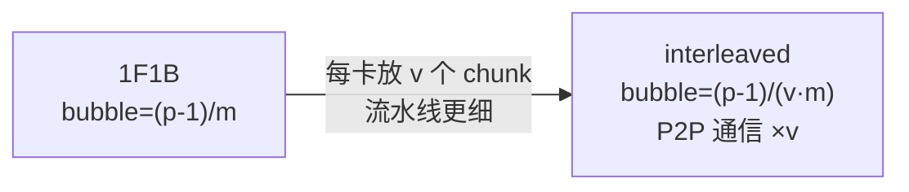
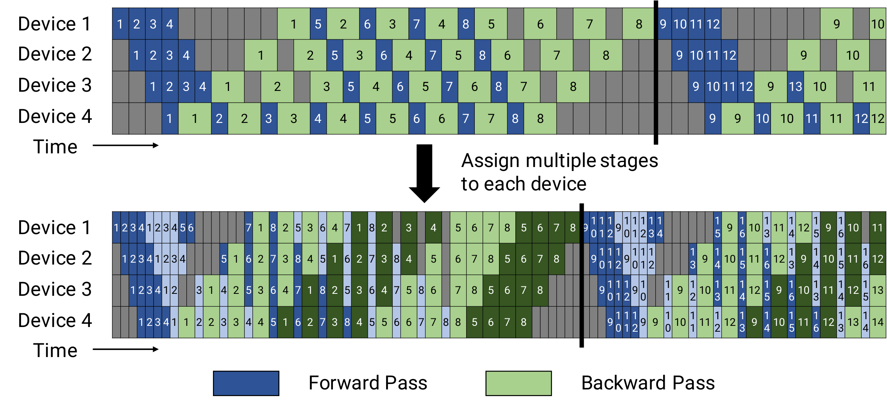
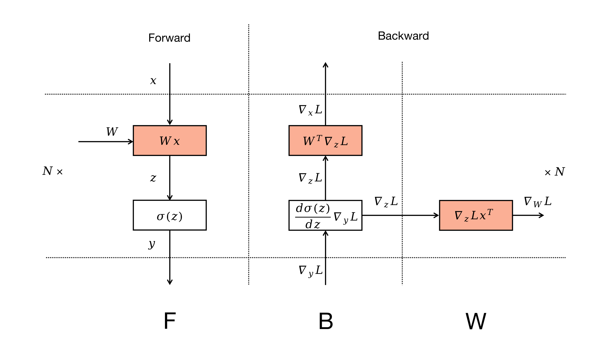
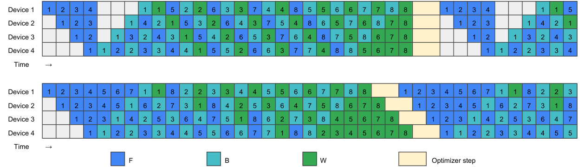
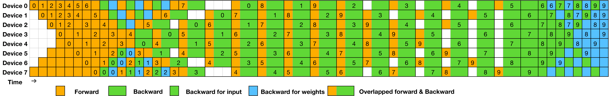
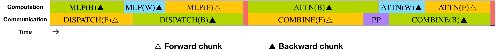
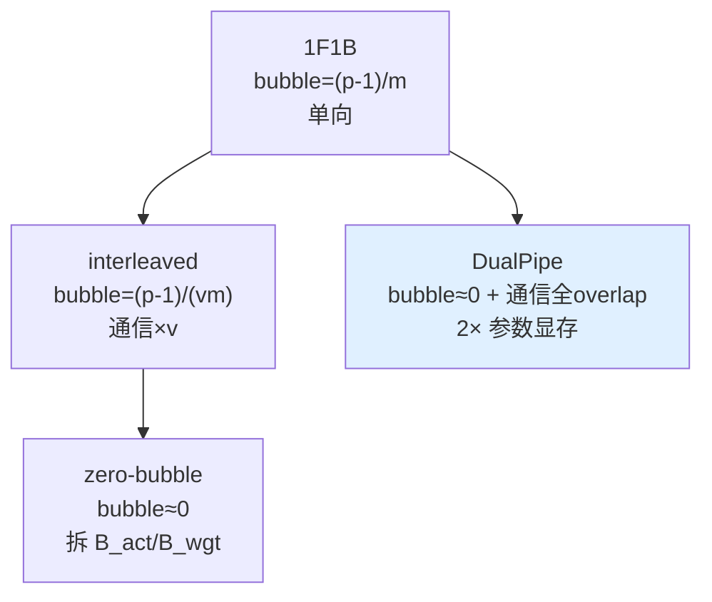

# 02 · Interleaved 1F1B、Zero Bubble 与 DualPipe

> 1F1B 解决了显存问题，但 bubble 仍然是 $(p-1)/(m+p-1)$。本篇介绍三种进一步压缩 bubble 的技术，阅读前需要对 1F1B 的 warmup、稳态与 cooldown 结构有基本了解（见上一篇）：
> 1. Interleaved 1F1B（Virtual Pipeline）：把流水线切得更细，bubble 降为原来的 $1/v$；
> 2. Zero Bubble：把 backward 拆成两部分，用不在依赖链上的权重梯度计算填充空泡；
> 3. DualPipe：双向流水加计算、通信全 overlap，bubble 接近于 0（DeepSeek-V3）。

---

## 1. Interleaved 1F1B / Virtual Pipeline (VPP)

论文：Narayanan et al., *Efficient Large-Scale Language Model Training on GPU Clusters Using Megatron-LM*, 2021, [arXiv:2104.04473](https://arxiv.org/abs/2104.04473)。代码：`schedules.py:forward_backward_pipelining_with_interleaving`。

核心思路是不再让每张卡存放连续的一大段层，而是存放 $v$ 个不连续的小 chunk（称为 model chunk 或 virtual stage）。以 $p=4, v=2, L=16$ 为例：

```
传统 1F1B (v=1):  s0=[L0-3]  s1=[L4-7]  s2=[L8-11]  s3=[L12-15]
interleaved (v=2): s0=[L0-1, L8-9]  s1=[L2-3, L10-11]  s2=[L4-5, L12-13]  s3=[L6-7, L14-15]
                       chunk0  chunk1   ← 每卡 2 个不连续 chunk
```

此时流水线在逻辑上有 $p \cdot v$ 个虚拟 stage。一个 micro-batch 完整走完要穿过 $p \cdot v$ 个 chunk，每个 chunk 更小，单次 forward 和 backward 的时间也更短。填充与排空的绝对时间并没有变化（仍然是 $p-1$ 个物理 stage 之间的传递），但相对于更密集的计算，bubble 的占比降为原来的 $1/v$：

$$
\text{bubble fraction (interleaved)} = (p-1)\,/\,(v \cdot m)
$$





> 图：**上** = 默认 1F1B（每 device 一段连续层）；**下** = interleaved 1F1B（每 device 2 个不连续 chunk）。下半的 forward/backward 格子更细、更密，warmup/cooldown 的绝对时间不变，但相对于更密集的计算，bubble 缩到 $1/v$。代价是 micro-batch 每穿过一个 chunk 边界就要一次 P2P，通信次数 ×v。（Narayanan et al. 2021, Fig 4；[arXiv:2104.04473](https://arxiv.org/abs/2104.04473)）

代价主要有两个：
- P2P 通信次数变为原来的 $v$ 倍：每个 micro-batch 需要在 stage 之间传递 $p \cdot v$ 次而不是 $p$ 次，因此 interleaved 依赖高带宽的 stage 间链路，或者配合 P2P overlap 使用（03 讨论）。
- 调度明显更复杂：warmup 数量变为 `(p-rank-1)*2 + (v-1)*microbatch_group_size`（[[megatron-lm:megatron/core/pipeline_parallel/schedules.py#L891]]），实现上还需要追踪每个 micro-batch 当前处于哪个 chunk。

Megatron 的 warmup 计算（[[megatron-lm:megatron/core/pipeline_parallel/schedules.py#L884-L897]]）：
```python
# 非 interleaved (1F1B)
num_warmup = pipeline_parallel_size - pipeline_parallel_rank - 1
# interleaved
num_warmup = (pipeline_parallel_size - pipeline_parallel_rank - 1) * 2
num_warmup += (num_model_chunks - 1) * microbatch_group_size_per_vp_stage
```

此外还有显存代价：interleaved 的流水线更长，在途的 micro-batch 更多，峰值 activation 略有上升。总体上看，这是用显存和通信的小幅增加换取 bubble 的下降。VPP 是目前大规模训练的主力方案，也是 Megatron 大模型的默认配置。

## 2. Zero Bubble：拆分 backward 填充空泡

论文：Qi et al., *Zero Bubble Pipeline Parallelism*, 2023, [arXiv:2401.10241](https://arxiv.org/abs/2401.10241)（ICLR 2024）。

Zero Bubble 的核心观察是：一次 backward 实际上完成了两件依赖关系完全不同的计算：

$$
B = B_{\text{act}} + B_{\text{wgt}}
$$

其中 $B_{\text{act}}$ 计算 input 的梯度 $dX$，下游 stage 立刻需要它；$B_{\text{wgt}}$ 计算 weight 的梯度 $dW$，只在 optimizer.step 前需要，没有其他计算等它。



> 图：Zero Bubble 论文把一层的 backward 显式拆成两个节点 —— $B$（对 input 的梯度，喂给上游、在依赖链上）与 $W$（对 weight 的梯度，只汇入本层参数、不在任何 micro-batch 的依赖链上）。传统调度把二者绑死；ZB 的全部技巧就是把「自由的」$W$ 拿去填空泡。（Qi et al. 2024, Fig 1；[arXiv:2401.10241](https://arxiv.org/abs/2401.10241)）

传统调度把 $B_{\text{act}}$ 和 $B_{\text{wgt}}$ 绑定在一起执行。Zero Bubble 则将二者拆开：$B_{\text{act}}$ 仍然按照依赖关系尽快执行（上游 stage 在等待它），而 $B_{\text{wgt}}$ 是自由的，可以推迟到任何 stage 空闲（即 bubble）的时刻执行。用 $B_{\text{wgt}}$ 填充 warmup 和 cooldown 的空泡，理论上可以把 bubble 降到 0。

```
普通 1F1B 的 cooldown:    s0  .  .  .  B B B B      ← 大段空泡
zero bubble:              s0 W W W B B B B          ← 空泡被 W(=B_wgt) 填上
                              ↑把别的 micro-batch 的权重梯度计算塞进来
```

ZB 论文给出了两档调度方案：
- ZB-H1：手工设计的调度，bubble 约为 1F1B 的三分之一，不增加显存。
- ZB-H2：进一步优化并绕过 optimizer 的同步点（用一次 post-update 验证替代全局 grad sync），bubble 接近于 0，但需要额外的显存保存被延后的 $B_{\text{wgt}}$ 中间量。



> 图：ZB-H1（上）与 ZB-H2（下）的手工调度。$F$/$B$/$W$ 三色格子，原本 warmup/cooldown 的空泡被 $W$（权重梯度计算）填上。ZB-H2 通过更早启动 $W$、并用 post-validation 绕开 optimizer 的全局同步点，把 bubble 压到近 0（代价是更多 in-flight 的延后 $W$ 中间量）。（Qi et al. 2024, Fig 3；[arXiv:2401.10241](https://arxiv.org/abs/2401.10241)）

与 Megatron 的关系：Megatron 的 `delay_wgrad_compute`（见 [DP](../01_dp/README.md)）和 `backward_dw()`（例如 [[megatron-lm:megatron/core/transformer/mlp.py#L374]] 中的 `linear_fc2.backward_dw()`）提供的正是「把 wgrad 计算从 dgrad 中拆出来、延后执行」的基础设施，这是实现 zero-bubble 类调度的前提。`schedules.py` 的较新版本中也包含了对应的 split-backward 调度变体。

> 从 infra 的角度直观理解：bubble 的本质是依赖链上的等待，而 $B_{\text{wgt}}$ 不在任何 micro-batch 的依赖链上，因此天然适合用来填补这些等待。Zero Bubble 做的事情就是把计算重新排序，让每个时刻都有可以自由调度的计算可做。

## 3. DualPipe：双向流水与全 overlap

论文/代码：DeepSeek-V3 Technical Report, 2024, [arXiv:2412.19437](https://arxiv.org/abs/2412.19437)；开源实现 [github.com/deepseek-ai/DualPipe](https://github.com/deepseek-ai/DualPipe)。

DualPipe 面向 MoE 大模型设计（这类模型的跨机 all-to-all 通信开销很大），同时解决 bubble 和通信两个问题，依靠两个想法：

（1）双向（bidirectional）流水：同时从流水线两端送入 micro-batch，一半从 stage $0 \to p-1$ 正向流动，另一半从 $p-1 \to 0$ 反向流动。为此每个 device 同时持有正向那一路的某个 chunk 和反向那一路的对称 chunk 两份参数，这样任一时刻它都能在正向 micro-batch 空闲时去计算反向 micro-batch，两个方向的流水线互相填充对方的 bubble。



> 图：DualPipe 在 8 个 PP rank、20 个 micro-batch 上的双向调度。橙色/其它色分别是从两端进入的两路 micro-batch，它们在时间轴上交错咬合，几乎不留空泡（对角的 warmup/cooldown 被对向流填满）。（DeepSeek-AI 2024, Fig 5；[arXiv:2412.19437](https://arxiv.org/abs/2412.19437)）

代价是每张卡需要保存两份参数（正反两路各一份 stage 副本），参数显存翻倍。DeepSeek-V3 通过 EP 和 ZeRO 已经把参数切得很碎，因此这个代价在整体显存预算中是可以接受的。

（2）计算与通信的全 overlap：DualPipe 把一对 forward 和 backward chunk 的执行拆成四个组件——`attention`、`MLP/MoE 计算`、`dispatch all-to-all`、`combine all-to-all`——并精细编排 warp 和 SM 资源，使 MoE 的跨机 all-to-all 完全隐藏在另一路 chunk 的计算之后：



> 图：DualPipe 一对 forward+backward chunk 的计算-通信 overlap。同一 device 上，一路 chunk 的 dispatch/combine all-to-all（通信）与另一路 chunk 的 attention / MLP（计算）在时间上重叠，且 backward 进一步拆成 $B$（激活梯度）与 $W$（权重梯度）以便填充 —— transformer block 边界故意不对齐，就是为了让通信和计算错峰咬合。（DeepSeek-AI 2024, Fig 4；[arXiv:2412.19437](https://arxiv.org/abs/2412.19437)）

这正是 [EP](../05_ep/README.md) 一章中 EP all-to-all overlap 在 PP 层面的体现。可以把 DualPipe 理解为 zero-bubble 的双向版本再加上 MoE 通信的全 overlap，它是目前在 bubble 和通信两方面都做到最优的方案之一。



## 4. 四代调度对比表

| 调度 | bubble fraction | activation 显存 | P2P 通信 | 额外代价 | 典型场景 |
|---|---|---|---|---|---|
| GPipe | $(p-1)/(m+p-1)$ | **$O(m)$** | $p$ | 大显存 | 已淘汰 |
| 1F1B | $(p-1)/(m+p-1)$ | $O(p)$ | $p$ | — | 基线 |
| Interleaved (VPP) | $(p-1)/(v \cdot m)$ | $O(p)$~略升 | **$p \cdot v$** | 通信×v、调度复杂 | 大规模 dense（Megatron 默认）|
| Zero Bubble | **≈0** (ZB-H2) | $O(p)$~升 | $p$ | 存延后 wgrad、绕开 grad sync | bubble 敏感 |
| DualPipe | **≈0** + 通信 overlap | $O(p)$ | 双向 | **2× 参数** | MoE 大模型（DeepSeek-V3）|

选型建议：dense 模型使用 interleaved 1F1B（成熟稳定，是 Megatron 的一等公民）；需要进一步压缩 bubble 时考虑 zero-bubble；MoE 模型且跨机 all-to-all 开销大时使用 DualPipe。

---

## 参考文献

- Narayanan et al., *Efficient Large-Scale LM Training (interleaved 1F1B)*, 2021. [arXiv:2104.04473](https://arxiv.org/abs/2104.04473)
- Qi et al., *Zero Bubble Pipeline Parallelism*, 2024. [arXiv:2401.10241](https://arxiv.org/abs/2401.10241)
- DeepSeek-AI, *DeepSeek-V3 Technical Report*, 2024. [arXiv:2412.19437](https://arxiv.org/abs/2412.19437)；DualPipe 代码 [github.com/deepseek-ai/DualPipe](https://github.com/deepseek-ai/DualPipe)
- Megatron [[megatron-lm:megatron/core/pipeline_parallel/schedules.py#L891]]（interleaved warmup）, [[megatron-lm:megatron/core/transformer/mlp.py#L374]]（`backward_dw`，split-backward 基础）。

调度算法讲完之后，剩下的问题就是怎么把它们真正落到工程实现里：activation 显存要怎么管理、P2P 通信要怎么和计算 overlap、以及 PP 要怎么和其它并行方式协同工作。这些正是下一篇[03 · 显存、通信 overlap 与并行协同](./03_overlap_and_memory.md)要讲的内容，包括 combined-1F1B 怎么把 PP 通信和 DP/EP 通信叠在一起，以及 bubble、显存、通信三者的总体权衡。
