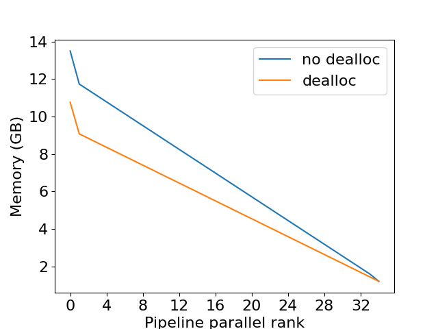
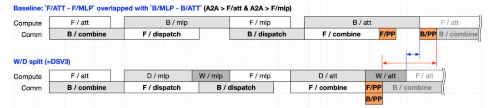
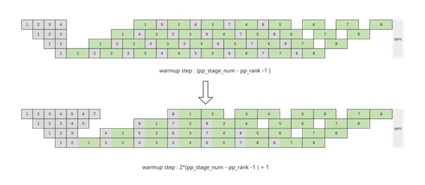
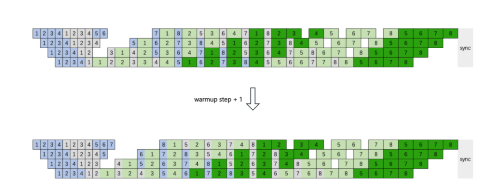
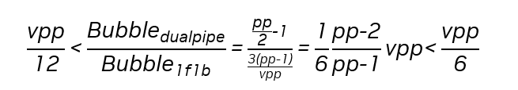
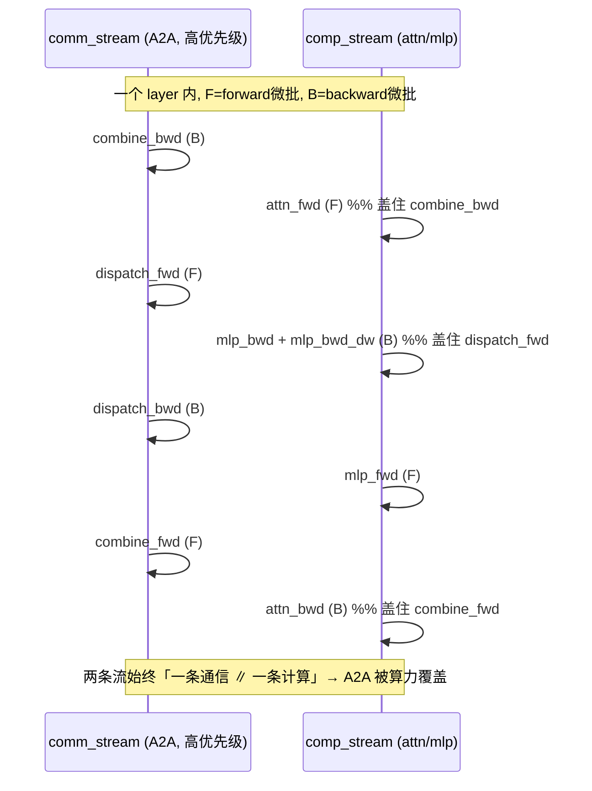

# 03 · 显存、通信 overlap 与并行协同

> 前两篇介绍了 PP 的调度算法与 bubble。本篇讨论三个工程层面的问题，读完之后 PP 一章就完整了：
> 1. activation 显存为什么逐 stage 不均，以及相应的处理方法（recompute、stage 切分）；
> 2. P2P 通信如何 overlap，combined-1F1B 如何把 PP 通信和 DP、EP 通信叠加在一起；
> 3. PP 与 TP、DP、CP、EP 的协同，以及 bubble、显存、通信三者的总体权衡。

代码：`schedules.py`, `p2p_communication.py`, `combined_1f1b.py`。

---

## 1. activation 显存的逐 stage 不均

在 1F1B 调度下，stage $r$ 的峰值需要保存 $p - r$ 个 micro-batch 的 activation（见 [`01` 第 4 节](./01_gpipe_1f1b.md)）：

```
stage0: 存 p 个 micro-batch 的 activation  ← 最多
stage1: 存 p-1 个
...
stage p-1: 存 1 个                          ← 最少
```



> 图：各 PP rank 的峰值 activation 显存 —— 从 first stage 到 last stage 逐级递减（在途 micro-batch 数从 $p$ 降到 $1$）。这解释了为什么 first stage 最容易 OOM，也是「不均匀切层 + 对前几个 stage 多做 recompute」的动机。（Korthikanti et al. 2022, Fig 9；[arXiv:2205.05198](https://arxiv.org/abs/2205.05198)）

这导致显存占用严重不均：first stage 可能 OOM，而 last stage 却很空闲。常见的处理方法有三种：

1. 不均匀切层：让 first stage 分配更少的层（`pipeline_parallel_layer_layout`，[[megatron-lm:megatron/core/transformer/pipeline_parallel_layer_layout.py]]）。embedding 通常也放在 first 或 last stage，会进一步加重这两端的负担，切层时需要一并计入。
2. activation recompute：对 first stage 多做 recompute（forward 不保存中间 activation，backward 时重新计算）。Megatron 提供 `recompute_granularity` 和 `num_microbatches_with_partial_activation_checkpoints` 等参数，后者按 micro-batch 粒度只对最早入队的几个 micro-batch 做 recompute，恰好覆盖显存压力最大的那几个。
3. 用 interleaved 的 chunk 均摊：VPP 让每张卡持有不同深度的 chunk，embedding 和 loss 带来的不均会被摊薄。

> 这与 [03 · Sequence Parallelism：用 AG 与 RS 替换 all-reduce](../02_tp_sp/03_sequence_parallel.md) 介绍的 SP 以及 [CP](../04_cp/README.md) 是互补关系：SP 和 CP 降低单个 activation 的大小，PP recompute 降低 activation 的驻留份数。大模型训练通常把三者叠加使用。

## 2. P2P 通信与 overlap

PP 在 stage 之间只传输一个 micro-batch 的 stage 边界 activation（forward）和对应的梯度（backward），使用点对点的 `send`/`recv`（`p2p_communication.py`），数据量远小于 TP 的 all-reduce。但它位于 critical path 上（下游 stage 必须等上游传完才能开始计算），因此仍然需要 overlap：

- 融合收发：`send_forward_recv_backward` 和 `send_backward_recv_forward`（见 [`01` 第 3 节](./01_gpipe_1f1b.md)）把一次发送和一次接收合并为一次调用，减少同步次数。
- `overlap_p2p_comm` 使用异步 P2P，让 stage 边界的传输与本 stage 的计算 overlap（见 [[megatron-lm:megatron/core/pipeline_parallel/schedules.py#L1518]] 的 `overlap_p2p_comm_warmup_flush`）。interleaved 调度下 P2P 次数变为 $v$ 倍，overlap 更加关键。
- stage 间传输的数据量为 `[s/TP/CP, b, h]`（SP 和 CP 下 seq 维已被切分），dtype 为 bf16。与 TP 每层多次 all-reduce 相比，PP 的 P2P 是低频的小包通信，因此 PP 可以跨机部署（IB 网络即可承受），而 TP 不行。

## 3. combined-1F1B 与 EP A2A overlap

### 3.1 动机

MoE 每层 forward 需要执行两次跨卡 all-to-all：dispatch（把 token 按 router 结果发送给持有对应 expert 的 rank）和 combine（把 expert 输出收回到原 rank），backward 阶段同样各有一次。在 DeepSeek-V3 量级下 EP 往往跨机部署，A2A 的字节量和延迟都非常大：Megatron 的 MoE 文档指出「EP All-to-All 未优化时能吃掉 30–40% 的训练时间」（[[megatron-lm:megatron/core/transformer/moe/README.md]]），DeepSeek-V3 论文报告的占比则高达约 50%；当 EP 通信量超过 NVLink 带宽时，它会直接拉低 MFU。

> 本节的讲法与配图主要参考 NVIDIA 开发者博客 [*1F1B MoE A2A Computing Overlap*](https://developer.nvidia.cn/blog/1f1b-moe-a2a-computing-overlap)（NVIDIA × 小红书 Agi Infra 团队），Megatron 源码作为逐行印证。

隐藏 A2A 开销有两条路径：一是把 A2A 本身做快（DeepEP，已合入 Megatron，见 [EP](../05_ep/README.md)）；二是把 A2A 与计算 overlap，这是本节的主题。overlap 又可以分为两个层次：

- microbatch 内 overlap（minimax-01、tutel、AMPipe 等）：只有当计算时间长于通信时间时才藏得住；跨机 A2A 常常比 expert MLP 的计算还要久，此时这种 overlap 就会失效。
- microbatch 间 overlap：用另一个 microbatch 的计算来遮盖当前 microbatch 的 A2A。DualPipe（见 [02 第 3 节](./02_interleaved_zerobubble_dualpipe.md)）是这一路线的代表，但它调度复杂、需要重构框架，并且需要两份参数。博客的关键观察是：DualPipe 的真正价值在于创造了 cross-microbatch overlap 的机会，而 1F1B 的稳态本身就天然提供同样的机会，因此可以在 1F1B 上以低得多的复杂度获得近似的收益。

前面 §2 介绍的 `overlap_p2p_comm` 隐藏的是 PP stage 边界的 P2P 通信，而本节的 combined-1F1B 隐藏的是层内的 EP all-to-all，两者是不同层面的 overlap，可以叠加。combined-1F1B 由 `overlap_moe_expert_parallel_comm=True` 开启（CLI 参数 `--overlap-moe-expert-parallel-comm`，[[megatron-lm:megatron/core/model_parallel_config.py#L262]]），实现集中在 [[megatron-lm:megatron/core/pipeline_parallel/combined_1f1b.py]] 和 [[megatron-lm:megatron/core/models/common/model_chunk_schedule_plan.py]]。

核心思路可以用一句话概括：1F1B 稳态下，同一时刻总有一个 microbatch 在做 forward、另一个在做 backward，这两个 microbatch 的数据完全独立，因此可以把 forward microbatch 的 A2A（通信）与 backward microbatch 的 attn、MLP（计算）放到两条 CUDA stream 上真正并行，反之亦然。官方文档把这种做法描述为「merging FWD-BWD passes of adjacent microbatches」。

### 3.2 把一层拆成可调度的节点

先交代基础结构：要实现交错执行，必须先把「一层」从一个黑盒的 forward 拆成可以单独下发、单独等待的节点。Megatron 通过 `build_schedule_plan`（[[megatron-lm:megatron/core/models/gpt/gpt_model.py#L771]]，目前只支持 `GPTModel`）把每个 transformer 或 MoE layer 拆成一个 `TransformerLayerSchedulePlan`（[[megatron-lm:megatron/core/models/common/model_chunk_schedule_plan.py#L30]]），其中包含 5 个节点：

| 节点 | 内容 | 跑在哪条 stream |
|---|---|---|
| `attn` | attention → LayerNorm → router → dispatch preprocess | **comp_stream**（计算）|
| `moe_dispatch` | dispatch all-to-all | **comm_stream**（通信）|
| `mlp` | expert grouped GEMM（或 dense MLP）| **comp_stream** |
| `moe_combine` | combine all-to-all | **comm_stream** |
| `mtp_post_process` | MTP 的 output/loss（无 MTP 时为空）| comp_stream |

每个节点是一个 `ScheduleNode`（[[megatron-lm:megatron/core/pipeline_parallel/utils.py#L144]]），它绑定一对 `forward_func` 和 `backward_func` 以及一条 stream，并用共享的 CUDA `event` 管理跨 stream 的依赖。两条 stream 由 `set_streams` 创建（[[megatron-lm:megatron/core/pipeline_parallel/utils.py#L336]]）：`get_comp_stream()` 是计算流，`get_comm_stream()` 是 A2A 通信流；当 `high_priority_a2a_comm_stream=True`（[[megatron-lm:megatron/core/transformer/transformer_config.py#L632]]）时，通信流以 CUDA high-priority 创建，可以优先占用链路。

### 3.3 `run(f_layer, b_layer)` 的双流交错

真正的编排发生在 `TransformerLayerSchedulePlan.run(f_layer, b_layer, ...)`（[[megatron-lm:megatron/core/models/common/model_chunk_schedule_plan.py#L230]]）中。它同时推进 forward microbatch 的第 L 层和 backward microbatch 的第 L 层，两条 stream 上的节点按如下顺序交错执行（以下是源码 docstring 的原文）：

```
comm_stream:  combine_bwd │ dispatch_fwd → dispatch_bwd      │ combine_fwd
comp_stream:  attn_fwd    │ mlp_bwd → mlp_bwd_dw → mlp_fwd    │ attn_bwd
              └─①─┘        └─────────── ② ───────────┘        └─③─┘
```

下面是对照源码整理的下发顺序（节选自 `run`，`b_*` 表示 backward microbatch、`f_*` 表示 forward microbatch）：

```python
# ① backward 的 combine A2A(comm) ∥ forward 的 attn 计算(comp)
b_grad  = b_layer.moe_combine.backward(b_grad)      # comm_stream
f_input = f_layer.attn.forward(f_input)             # comp_stream

# ② forward 的 dispatch A2A(comm) ∥ backward 的 mlp 计算(comp)
b_grad  = b_layer.mlp.backward(b_grad)              # comp: 先算 dgrad(B)
f_input = f_layer.moe_dispatch.forward(f_input)     # comm: forward 的 dispatch A2A
b_layer.mlp.backward_dw()                           # comp: 再补权重梯度(W)
b_grad  = b_layer.moe_dispatch.backward(b_grad)     # comm: backward 的 dispatch A2A

# ③ forward 的 combine A2A(comm) ∥ backward 的 attn 计算(comp)
f_input = f_layer.mlp.forward(f_input)              # comp
f_input = f_layer.moe_combine.forward(f_input)      # comm
b_grad  = b_layer.attn.backward(b_grad)             # comp
b_layer.attn.backward_dw()   # 延后到最后, 好与 PP 的 P2P overlap（非末层时）
```

这段编排有两个要点，都与前文直接呼应：

1. 每一步都是一条流在通信、另一条流在计算：forward microbatch 的 `dispatch` 和 `combine` A2A 被 backward microbatch 的 `mlp`、`attn` 计算遮盖，反之亦然。这就是「把 A2A 藏进计算」的具体实现。
2. backward 被拆成 $B$（dgrad）和 $W$（wgrad）两部分：`mlp.backward()` 先计算下游需要的 dgrad，`mlp.backward_dw()` 单独补算权重梯度；`attn.backward_dw()` 更是延后到最后，以便与 stage 间的 P2P overlap。这正是 [`02` 第 2 节](./02_interleaved_zerobubble_dualpipe.md) 中 zero-bubble 的 $B$、$W$ 拆分，由 `delay_wgrad_compute=True`（[[megatron-lm:megatron/core/model_parallel_config.py#L267]]）提供，因此官方要求 `--overlap-moe-expert-parallel-comm` 必须与 `--delay-wgrad-compute` 一起使用。

为什么必须拆分 `dw`：当 A2A 的耗时超过计算时，仅靠 `F/attn` 和 `F/mlp` 无法遮盖 `B/dispatch` 与 `B/combine`。而 `dispatch` 和 `combine` 的 backward 只依赖 `dx`、不依赖 `dw`，因此把 `dw` 从 backward 中拆出来延后执行，就可以让 `B/dispatch`、`B/combine` 提前发出，再用 `F/mlp` 和一部分 `W/mlp` 去遮盖它们，使计算流的 kernel 排得更满：



> 图：拆分 `dw` 前后的 overlap 对比。拆分后 `B/dispatch`、`B/combine` 得以提前，被 `F/mlp`（及部分 `W/mlp`）覆盖，计算流被填得更密、总时长下降。（NVIDIA / 小红书 Agi Infra 博客 *基于 1F1B 的 MoE A2A 通信计算 Overlap*，Fig；本地镜像 `./assets/moe_a2a_dw_split_overlap.png`）

### 3.4 调度入口与额外的 warmup microbatch

`combined_1f1b.py` 按 PP 形态提供两个整段调度，`schedules.py` 根据 `overlap_moe_expert_parallel_comm` 进行派发：

| 场景 | 调度函数 | 派发点 |
|---|---|---|
| **PP = 1**（无流水，仅 grad accumulation） | `combined_1f1b_schedule_for_no_pipelining`（[[megatron-lm:megatron/core/pipeline_parallel/combined_1f1b.py#L35]]）| [[megatron-lm:megatron/core/pipeline_parallel/schedules.py#L705]] |
| **interleaved / VPP** | `combined_1f1b_schedule_for_interleaved_pipelining`（[[megatron-lm:megatron/core/pipeline_parallel/combined_1f1b.py#L138]]）| [[megatron-lm:megatron/core/pipeline_parallel/schedules.py#L1427]] |

需要注意：标准 1F1B（`forward_backward_pipelining_without_interleaving`）路径不使用 combined-1F1B，因此要启用 EP A2A overlap，必须满足 `PP=1` 或开启 VPP（这也与 §2 中「VPP 增加 overlap 机会」的说法一致）。

两种方案的时序如下（沿用博客的画法）：普通 1F1B 方案通过把最后一个 PP stage 的 warmup 加一，消除稳态中 F 与 B 之间的数据依赖，从而让相邻 microbatch 的 A2A 与计算 overlap；缺点是 warmup 变长、activation 显存上升。



> 图：普通 1F1B 上实现相邻 microbatch 的 A2A/计算 overlap（warmup +1 解依赖）。（NVIDIA / 小红书 Agi Infra 博客 *基于 1F1B 的 MoE A2A 通信计算 Overlap*；本地镜像 `./assets/moe_a2a_conventional_1f1b.png`）

interleaved 1F1B（Megatron 采用的方案）把第一个 microbatch 的 fprop 移入 warmup（同样加一），在稳态获得 overlap 机会；同时 F 与 B 交替地分配和释放 activation，峰值显存基本持平，bubble 率与原 interleaved 1F1B 一致。这是它优于普通 1F1B 方案的关键。



> 图：interleaved 1F1B 方案的相邻 microbatch overlap，F/B 交替使峰值 activation 显存基本不涨。（NVIDIA / 小红书 Agi Infra 博客 *基于 1F1B 的 MoE A2A 通信计算 Overlap*；本地镜像 `./assets/moe_a2a_interleaved_1f1b.png`）

PP=1 时的调度（[[megatron-lm:megatron/core/pipeline_parallel/combined_1f1b.py#L35]] 的 docstring）最能直观说明「相邻 microbatch 的 F/B 合并」：

```
Phase 0:  mb0 forward                              # 头：单独 forward，无可 overlap 的对象
Phase 1:  mb0 backward  +  mb1 forward             # 从这里起，每步 = 一个 B 微批 ∥ 一个 F 微批
Phase 2:  mb1 backward  +  mb2 forward
   ...                                             # F 的 A2A 藏进 B 的计算，反之亦然
Phase k:  mb(k-1) backward + mbk forward
last:     最后一个 microbatch backward             # 尾：单独 backward
```

在 VPP 下，为了保证每个 1F1B step 中 F 和 B 属于相互独立的 microbatch，warmup 会多排一个 forward（[[megatron-lm:megatron/core/pipeline_parallel/schedules.py#L896]]：`num_warmup_microbatches += 1`）。多出的这个在途 microbatch 是实现 overlap 的必要代价，会略微增加 activation 显存。

### 3.5 `CUDA_DEVICE_MAX_CONNECTIONS` 的取值

这里有一个容易配置错误、且与 [04 · TP/SP 的通信-计算 overlap 与工程优化](../02_tp_sp/04_overlap_and_optimizations.md) 形成鲜明对照的问题：

- TP 的 async overlap 要求 `CUDA_DEVICE_MAX_CONNECTIONS=1`，即强制使用单个硬件队列，保证先发出的通信 kernel 一定先启动（见 [04 · TP/SP 的通信-计算 overlap 与工程优化](../02_tp_sp/04_overlap_and_optimizations.md)）。
- combined-1F1B 的 EP A2A overlap 则要求 `CUDA_DEVICE_MAX_CONNECTIONS > 1`（[[megatron-lm:megatron/core/transformer/moe/README.md]] 明确列出的 requirement），因为它依赖 comp_stream 与 comm_stream（高优先级）在不同的硬件队列上真正并发执行；如果只有一个队列，两条流会被串行化，overlap 将直接失效。

这正是 01 文档中预告的「`MAX_CONNECTIONS=1` 与某些需要多队列并发的优化相互冲突」的具体体现：纯 TP 训练应设为 1，以 EP A2A overlap 为主的 MoE 训练应设为大于 1（通常同时配置 `high_priority_a2a_comm_stream=True`，让 A2A 能够抢占链路）。两种配置不能同时达到最优，需要按模型形态取舍。

### 3.6 开启条件与约束

`overlap_moe_expert_parallel_comm` 有一系列硬性约束（由 [[megatron-lm:megatron/core/transformer/transformer_config.py#L2416]] 中的校验逻辑保证），手写配置时容易遗漏：

- 必须开启 EP：`expert_model_parallel_size > 1`，且 token dispatcher 为 `alltoall` 或 `flex`（`transformer_config.py:2429/2433`）。
- 只支持 bf16 和 fp16（`:2451`），模型必须是 `GPTModel`（`build_schedule_plan` 目前只在 GPTModel 上实现）。
- 必须关闭整层 recompute：full activation recomputation 与该特性互斥（`:2437-2446`），因为 schedule plan 需要把每层拆成可以交错的节点，而整层 checkpoint 会破坏这个结构。
- `delay_wgrad_compute` 必须同时开启（`:2471`，用于提供 $B$、$W$ 拆分）；不能与 `moe_shared_expert_overlap` 同时开启（`:2455`，两者竞争同一批 overlap 窗口）；MTP 层数只能为 1（`:2458`）。
- CLI 组合为 `--overlap-moe-expert-parallel-comm --delay-wgrad-compute`，并把 `CUDA_DEVICE_MAX_CONNECTIONS` 设为大于 1（允许多个硬件队列，见 3.5；注意这与纯 TP 训练设为 1 相反）。

### 3.7 与 DualPipe / zero-bubble 的关系

把三者放在一起对比，关系就清楚了：

- zero-bubble（见 [02](./02_interleaved_zerobubble_dualpipe.md)）贡献了 $B$、$W$ 拆分，combined-1F1B 直接复用它来重新安排计算。
- combined-1F1B 在单向 1F1B 的稳态中，通过「相邻 microbatch 的 F/B 合并加 comp、comm 双流」把 EP A2A 藏进计算。它是 Megatron 的一等公民，成熟可用。
- DualPipe（见 [02 第 3 节](./02_interleaved_zerobubble_dualpipe.md)）在此基础上再增加双向流水（两个方向互相填充 bubble），代价是两倍的参数显存。

换句话说，combined-1F1B 相当于 DualPipe「计算-通信全 overlap」那一半思想在 Megatron 中的单向工程化实现。对大多数 MoE 训练来说，它已经能把 EP A2A 那 30–50% 的开销大部分隐藏掉，而不必付出 DualPipe 双份参数的代价。

博客给出的定量对比（记时间 $B = 2F = 2W$、$F\&B = B$）：

| | DualPipe | 1F1B with A2A overlap |
|---|---|---|
| PP bubble 开销 | $(\mathrm{PP}/2 - 1)\cdot(F\&B + B - 3W)$ | $(\mathrm{PP} - 1)\cdot(F + B)/\mathrm{vpp}$ |
| 参数显存 | **2×** | **1×** |
| activation 显存 | $\mathrm{PP}+1$ | $\mathrm{PP} + (\mathrm{PP}-1)/\mathrm{vpp}$ |
| PP bubble（简化） | $(\mathrm{PP}/2 - 1)\cdot F$ | $3\cdot(\mathrm{PP} - 1)/\mathrm{vpp}\cdot F$ |



> 图：两方案 bubble 开销之比随 VPP 的变化，交叉点约在 **vpp ≈ 8**。常见配置（GPT-175B PP8/VPP8、Mixtral-8×22B PP4/VPP14 等）大多落在「两者 bubble 相当」的区间。（NVIDIA / 小红书 Agi Infra 博客 *基于 1F1B 的 MoE A2A 通信计算 Overlap*；本地镜像 `./assets/moe_a2a_dualpipe_vs_1f1b_bubble.png`）

结论是：由于 VPP 通常大于等于 PP，1F1B-overlap 的 bubble 与 DualPipe 相当，activation 显存更低，并且不需要第二份参数。这就是 Megatron 选择它作为一等公民、而不是直接实现 DualPipe 的原因。



## 4. 与 TP / DP / CP / EP 的协同

```
world = DP × CP × TP × PP   (× EP 在 MoE 里复用)
rank 排布(常见): TP 最内(NVLink) → CP → PP → DP 最外(IB)
```

| 组合 | 关键交互 |
|---|---|
| **PP × TP** | TP 在 stage 内、机内 NVLink；PP 跨机。stage 边界传的是 TP/SP 切过的 `[s/TP/CP, b, h]`。两者通信时间错峰（TP 在 layer 内、PP 在 stage 边界）|
| **PP × DP** | 每个 stage 是独立 DP 组；DDP 的 grad 通信在「最后一个 micro-batch 的 backward 完成后」触发（不是每个 micro-batch），所以 DP 通信落在 cooldown 之后；非 first stage 关 bucketing（[01 · Megatron DDP：连续 buffer、bucket、grad-ready hook 与 overlap](../01_dp/01_ddp_and_overlap.md)，[[megatron-lm:megatron/core/distributed/distributed_data_parallel.py#L105]]）|
| **PP × VPP** | VPP 是 PP 的细化（[`02`](./02_interleaved_zerobubble_dualpipe.md)）；`microbatch_group_size_per_vp_stage` 控制每个 virtual stage 连续处理几个 micro-batch |
| **PP × EP** | combined-1F1B / DualPipe 把 EP all-to-all overlap 进 PP（第 3 节）|
| **PP × CP** | 正交；中间 stage 的 batch 非 metadata 字段为 None，CP 切分跳过（[04 · Megatron-LM 实现](../04_cp/04_megatron_cp_integration.md)）|
| **embedding/loss** | input/output embedding 在 first/last stage，weight-tying 要跨 PP first↔last all-reduce 同步梯度（`finalize_model_grads`）；loss 只在 last stage 算 |

## 5. bubble、显存与通信的权衡

PP 的所有设计都可以看作在 bubble、activation 显存和通信三者之间做权衡：

| 旋钮 | bubble | activation 显存 | 通信 |
|---|---|---|---|
| ↑ micro-batch 数 $m$ | ↓ | ↑(GPipe) / 不变(1F1B) | 不变 |
| ↑ PP stage 数 $p$ | ↑ | ↓(每 stage 层少) | ↑(更多 stage 边界)|
| 1F1B（vs GPipe） | = | **↓↓ $O(m) \to O(p)$** | = |
| ↑ virtual chunks $v$ | **↓ $1/v$** | ↑略 | **↑ ×v** |
| zero-bubble | **↓↓ →0** | ↑(延后 wgrad) | = |
| DualPipe | **→0** | =（但 2×参数）| overlap 掉 |
| combined-1F1B（EP A2A overlap）| =（用 1F1B/VPP 的 bubble）| ↑略（+1 warmup microbatch）| **EP A2A 被计算盖住** |
| recompute | = | **↓↓** | =（多算 1 次 fwd）|

实际配置建议：
- dense 大模型：`1F1B + interleaved(v=2~4) + 适度 recompute`，`m ≥ 4p`。
- MoE 大模型：`DualPipe / combined-1F1B`，把 EP all-to-all overlap 进流水。
- 显存紧张的 first stage：采用不均匀切层并配合 partial recompute。

---

## 参考

- Korthikanti et al., *Reducing Activation Recomputation*, 2022. [arXiv:2205.05198](https://arxiv.org/abs/2205.05198)（recompute + SP，与 PP 显存互补）
- NVIDIA Developer Blog, *1F1B MoE A2A Computing Overlap*（NVIDIA × 小红书 Agi Infra），[developer.nvidia.cn/blog/1f1b-moe-a2a-computing-overlap](https://developer.nvidia.cn/blog/1f1b-moe-a2a-computing-overlap) —— 第 3 节的讲法与配图来源。
- Megatron combined-1F1B 实现：[[megatron-lm:megatron/core/pipeline_parallel/combined_1f1b.py#L35,L138,L281]]（三个调度入口）、[[megatron-lm:megatron/core/pipeline_parallel/utils.py#L144,L336]]（`ScheduleNode` / `set_streams`）、[[megatron-lm:megatron/core/models/common/model_chunk_schedule_plan.py#L30,L230]]（层节点拆分 + `run` 双流交错）、[[megatron-lm:megatron/core/pipeline_parallel/schedules.py#L705,L896,L1427]]（派发与 warmup +1）、[[megatron-lm:megatron/core/transformer/moe/README.md]]（EP A2A overlap 指南）、config [[megatron-lm:megatron/core/model_parallel_config.py#L262,L267]] / [[megatron-lm:megatron/core/transformer/transformer_config.py#L632,L2416]]。
- Megatron [[megatron-lm:megatron/core/pipeline_parallel/schedules.py]]、[[megatron-lm:megatron/core/pipeline_parallel/p2p_communication.py]]、[[megatron-lm:megatron/core/transformer/pipeline_parallel_layer_layout.py]]。

讲完这些工程细节，最好的验证方式就是自己动手跑一遍：完成 [[atlas:docs/parallel/03_pp/pp_lab.ipynb]]，用真实的 P2P 通信把 MLP 按层切成 stage，亲手实现 GPipe 和 1F1B，与单进程 reference 逐元素对齐，并打印 pipeline 时序、量化 bubble。
