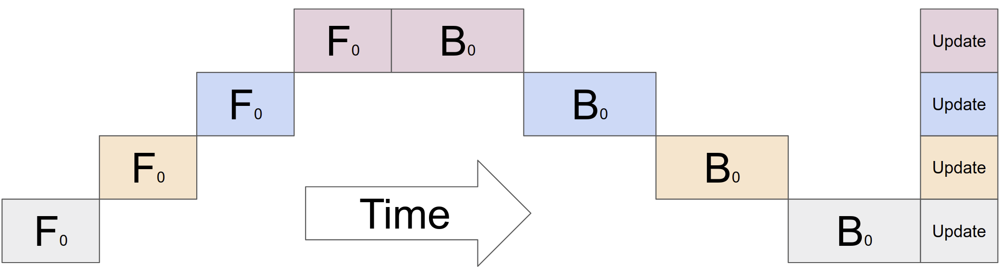
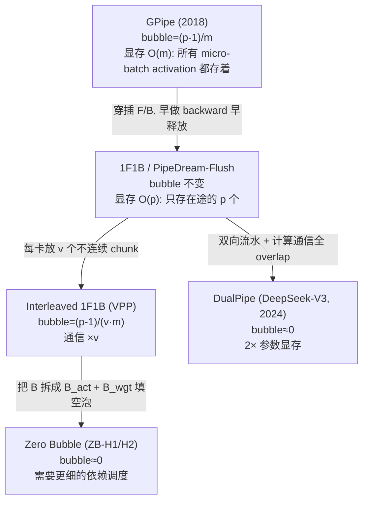

# Pipeline Parallelism (PP)

> 本篇是 pipeline parallelism（PP）一章的总览。PP 把模型按层切到不同的卡上，让一个 batch 以 micro-batch 流水的形式依次穿过各 stage；随之而来的核心问题是 bubble（流水线空泡）、activation 显存与通信三者之间的权衡。本文沿着调度算法的演化脉络——GPipe、1F1B、interleaved（VPP）、zero-bubble、DualPipe——逐步展开，每一步都给出 pipeline 时序图、bubble 与显存公式，并对齐 Megatron 代码与原始论文。

## 前置知识

- 了解「按层切分模型、micro-batch 流水」的基本动机即可；bubble、activation 峰值等概念会在文中定义。
- 知道 DP 的梯度规约与 grad accumulation 的语义会有帮助，见 [Data Parallelism（DP）、ZeRO 与 FSDP](../01_dp/README.md)。

---

## 1. 从切层到 micro-batch 流水

PP 把模型的 $L$ 层切成 $p$ 段（stage），每张卡负责其中一段。一个 batch 的 forward 必须按顺序依次穿过 stage $0, 1, \dots, p-1$，backward 则沿反方向传回。如果整个 batch 一次性走完：

```
stage0: [F............][B............]
stage1:        [F............][B............]
                                              ← 同一时刻只有 1 个 stage 在工作！
```

问题在于：任意时刻只有一个 stage 在计算，其余 $p-1$ 个都在等待，设备利用率只有 $1/p$。PP 的基本解法是把 batch 切成 $m$ 个 micro-batch，让它们像流水线一样在 stage 之间错位流动，使多个 stage 能够同时工作。



> 图：朴素模型并行（不切 micro-batch）的严重欠利用 —— 同一时刻只有一个 device 在算，其余全在空等。这就是为什么必须引入 micro-batch 流水。（Huang et al. 2018, GPipe Fig 2b；[arXiv:1811.06965](https://arxiv.org/abs/1811.06965)）

## 2. bubble：填充与排空的代价

把 batch 切成 micro-batch 流水执行之后，流水线在头部填充和尾部排空阶段仍然无法打满。下面是 GPipe 把 mini-batch 切成 micro-batch 后的流水时序，灰色 `Bubble` 区就是各 stage 的空等：


> 图：GPipe 把 batch 切成 4 个 micro-batch（$F_{i,j}$ = device $i$ 上 micro-batch $j$ 的 forward，$B$ 同理）在 4 个 device 上流水。头部填充 + 尾部排空构成 `Bubble`（灰色）。（Huang et al. 2018, GPipe Fig 2c；[arXiv:1811.06965](https://arxiv.org/abs/1811.06965)）

bubble 来自流水线的头部（warmup）和尾部（cooldown）：第一个 micro-batch 要经过 $p-1$ 步传递才能填满流水线，最后一个 micro-batch 同样需要 $p-1$ 步排空。bubble 占整个迭代墙钟时间的比例（bubble fraction）可以用下式计算，GPipe 与 1F1B 完全相同：

$$
\frac{\text{bubble}}{\text{total wall-clock time}} = \frac{p - 1}{m + p - 1} \approx \frac{p - 1}{m}
$$

一个约定：正文和具体数值计算一律使用精确式 $(p-1)/(m+p-1)$；近似式 $(p-1)/m$ 是 Megatron 论文的紧凑写法（mermaid 示意图中为了简洁也用它），interleaved 写作 $(p-1)/(v \cdot m)$。两者在 `m ≫ p` 时数值趋同，interleaved 的精确式是 $(p-1)/(v \cdot m + p - 1)$。

- $m$（micro-batch 数）越大，bubble 占比越小，所以 PP 通常搭配较大的 $m$（即 global batch / micro-batch size）。
- $p$ 越大，bubble 越大，因此 PP 维度不宜开得过大，否则 bubble 会抵消流水带来的收益。
- 经验法则：`m ≈ 4p` 时 bubble ≈ 20%，`m ≈ 8p` 时降到 ≈ 12%。所以「micro-batch 数是 PP stage 数的若干倍」是 PP 能用的前提。

这是 PP 的第一个权衡：增大 $m$ 可以压缩 bubble，但 $m$ 同时受 global batch size 上限和 activation 显存的约束——在 GPipe 调度下，$m$ 个 micro-batch 的 activation 需要同时驻留显存（详见 01）。

## 3. 调度家族图



这四次演进各自对应一个关键想法，后文会逐一展开：

1. 1F1B（01）：一个 stage 完成某个 micro-batch 的 forward 之后，尽早执行对应的 backward 并释放其 activation，显存从 $O(m)$ 降到 $O(p)$，bubble 保持不变。这是 PP 能够用于大模型训练的关键。
2. Interleaved / Virtual Pipeline（02）：每张卡不再存放连续的一段层，而是存放 $v$ 个不连续的小 chunk（例如 stage 0 放第 0、8、16… 层）。流水线因此变得更细，bubble 降到 $(p-1)/(v \cdot m)$，代价是 P2P 通信次数变为原来的 $v$ 倍。
3. Zero Bubble（02）：backward 实际上包含两部分计算——输入梯度 $B_{\mathrm{act}}$（上游 stage 依赖它）和权重梯度 $B_{\mathrm{wgt}}$（没有其他计算依赖它，可以延后）。把 $B_{\mathrm{wgt}}$ 安排进 bubble 时段执行，理论上可以把 bubble 降到 0。
4. DualPipe（02）：从流水线两端同时送入 micro-batch（双向流水），并把 forward/backward 的计算与 P2P、all-to-all 通信完全 overlap，bubble 接近于 0，代价是每张卡需要保存两份参数。

## 4. Megatron 的调度入口

Megatron 用工厂函数 `get_forward_backward_func`（[[megatron-lm:megatron/core/pipeline_parallel/schedules.py#L48]]）按配置选择调度实现：

```python
# schedules.py:148
if pipeline_model_parallel_size > 1:
    if virtual_pipeline_model_parallel_size is not None:
        forward_backward_func = forward_backward_pipelining_with_interleaving      # interleaved 1F1B
    else:
        forward_backward_func = forward_backward_pipelining_without_interleaving   # 标准 1F1B
else:
    forward_backward_func = forward_backward_no_pipelining                         # 单 stage(GPipe式)
```

| 配置 | 选中的调度 | 文档 |
|---|---|---|
| `pp_size == 1` | `forward_backward_no_pipelining` | 01（无流水，仅 grad accumulation） |
| `pp_size > 1`, `vpp_size is None` | `forward_backward_pipelining_without_interleaving`（1F1B） | 01 |
| `pp_size > 1`, `vpp_size = v` | `forward_backward_pipelining_with_interleaving`（interleaved） | 02 |

zero-bubble 与 DualPipe 在更新的 Megatron 代码和 DeepSeek 的开源实现中以变体或独立 schedule 的形式出现，02 会讨论它们的原理并给出引用。

## 5. PP 在整个并行体系里的位置

```
world = DP × CP × TP × PP    ;  PP 放在 TP 外、DP 内（通信少、跨机友好）
```

| 耦合 | 要点 | 文档 |
|---|---|---|
| **PP × TP** | TP 在 stage 内切每层（通信大、放 NVLink 域）；PP 跨 stage 只传 stage 边界的 activation（P2P，量小、跨机友好） | 03 |
| **PP × DP** | 每个 PP stage 是独立 DP 组；DDP bucketing 在非 first stage 调整（[01 · Megatron DDP：连续 buffer、bucket、grad-ready hook 与 overlap](../01_dp/01_ddp_and_overlap.md)） | 03 |
| **PP × VPP** | virtual pipeline 是 PP 的「细化」，每卡多个 model chunk | 02 |
| **PP × EP** | MoE 的 all-to-all 与 PP 的 P2P 可 overlap（combined-1F1B / DualPipe 的核心） | 03, [EP](../05_ep/README.md) |
| **PP × CP** | 正交；中间 stage 的 batch CP 切分跳过（[04 · Megatron 工程落地](../04_cp/04_megatron_cp_integration.md)） | 03 |

## 6. PP vs TP：什么时候用 PP

| | TP | PP |
|---|---|---|
| 切什么 | 单层内的矩阵 | 层（深度）|
| 通信 | 每层多次 all-reduce（大）| stage 边界 P2P（小）|
| 通信频率 | 极高 | 低（每 micro-batch 一次）|
| 部署位置 | NVLink 域内（≤8） | 跨机（IB 也能扛）|
| 主要代价 | 通信带宽 | bubble + activation 显存 |
| 扩展性 | 受 NVLink 域限制 | 受 bubble（需大 $m$）限制 |

典型的组合方式是 `TP=8`（机内 NVLink）× `PP=跨机` × `DP=最外`：TP 把高频通信限制在机内，PP 用开销较小的 P2P 通信跨机扩展层数，DP 在最外层扩展 batch。

---

## 7. 一组贯穿全文的数字

$$
\begin{aligned}
&L = 80,\quad p = 8 \;\Rightarrow\; 10 \text{ layers per stage},\qquad m = 32 \\
&\text{GPipe bubble} = \frac{p - 1}{m + p - 1} = \frac{7}{39} = 17.9\% \\
&\text{1F1B bubble} = \frac{p - 1}{m + p - 1} = \frac{7}{39} = 17.9\% \\
&\text{interleaved } (v = 2)\text{:}\quad \frac{p - 1}{v m + p - 1} = \frac{7}{71} \approx 9.9\% \;\left(\approx \frac{p - 1}{v m} = 10.9\%\right)
\end{aligned}
$$

这里需要记住的是：GPipe 和 1F1B 的 bubble 完全相同，1F1B 的价值全部体现在显存上（从 $O(m)$ 降到 $O(p)$）；真正降低 bubble 的是 interleaved（代价是 P2P 通信次数 ×2），zero-bubble 和 DualPipe 则进一步把它推向 0。

---

## 这组文档怎么读

| 文件 | 内容 | 对应代码 / 论文 |
|---|---|---|
| `README.md`（本文） | PP 全景：micro-batch、bubble 的来源、调度家族图、bubble/显存/通信三角、并行维度 | [[megatron-lm:megatron/core/pipeline_parallel/schedules.py#L48]] |
| [01 · GPipe 与 1F1B](./01_gpipe_1f1b.md) | GPipe 的 fill-drain bubble；1F1B 如何在 bubble 不变的前提下把 activation 显存从 $O(m)$ 降到 $O(p)$；warmup/steady/cooldown；Megatron `without_interleaving` 逐段 | GPipe, PipeDream-Flush, [[megatron-lm:megatron/core/pipeline_parallel/schedules.py#L884]] |
| [02 · Interleaved 1F1B、Zero Bubble 与 DualPipe](./02_interleaved_zerobubble_dualpipe.md) | interleaved 1F1B（virtual pipeline 把 bubble 降为 $1/v$）；zero-bubble（把 backward 拆成 $B_{\mathrm{act}}$ 与 $B_{\mathrm{wgt}}$ 填充空泡）；DualPipe（双向流水与全 overlap，DeepSeek-V3） | Megatron-interleaved, ZB, DualPipe |
| [03 · 显存、通信 overlap 与并行协同](./03_overlap_and_memory.md) | activation 显存逐 stage 不均、recompute、P2P overlap、combined-1F1B（PP 通信与 DP/EP overlap）、和 TP/DP/CP/EP 的协同、bubble-显存-通信权衡总表 | `combined_1f1b.py`, `p2p_communication.py` |
| [[atlas:docs/parallel/03_pp/pp_lab.ipynb]] | 纯 torch 手写 GPipe 与 1F1B，用真实 P2P（gloo）把 MLP 按层切成 stage 流水跑通前反向，逐元素对齐单进程 reference，并打印 pipeline 时序、量化 bubble | —— |

建议的阅读顺序：先读本文建立 bubble 的整体图景，再读 01 了解 GPipe 到 1F1B 的显存改进，然后读 02 看 bubble 如何被一步步压缩，接着读 03 了解工程上的 overlap 与三者权衡，最后在 lab 中亲手把 1F1B 流水跑起来。

## 参考代码

参考代码（commit `e03878b5f`）与论文：

- [[megatron-lm:megatron/core/pipeline_parallel/schedules.py]] —— `get_forward_backward_func`、1F1B（`without_interleaving`）、interleaved（`with_interleaving`）、warmup 计算
- [[megatron-lm:megatron/core/pipeline_parallel/p2p_communication.py]] / [[megatron-lm:megatron/core/pipeline_parallel/combined_1f1b.py]] —— P2P send/recv 与「计算-通信 overlap」调度
- 论文：GPipe / PipeDream-1F1B / Megatron interleaved / Zero Bubble / DualPipe（每篇在对应文档给出链接）

---

读完这篇，下一个自然的问题是：1F1B 具体是怎么在不改变 bubble 的前提下把显存降下来的？这正是下一篇[01 · GPipe 与 1F1B](./01_gpipe_1f1b.md)要回答的问题——从 GPipe 的 fill-drain 讲起，看 1F1B 怎么用「尽早 backward」降低 activation 显存，并对照 Megatron 的 warmup、steady、cooldown 三段实现。
