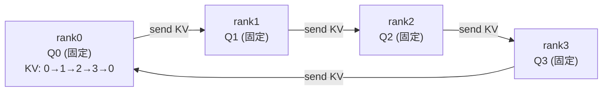
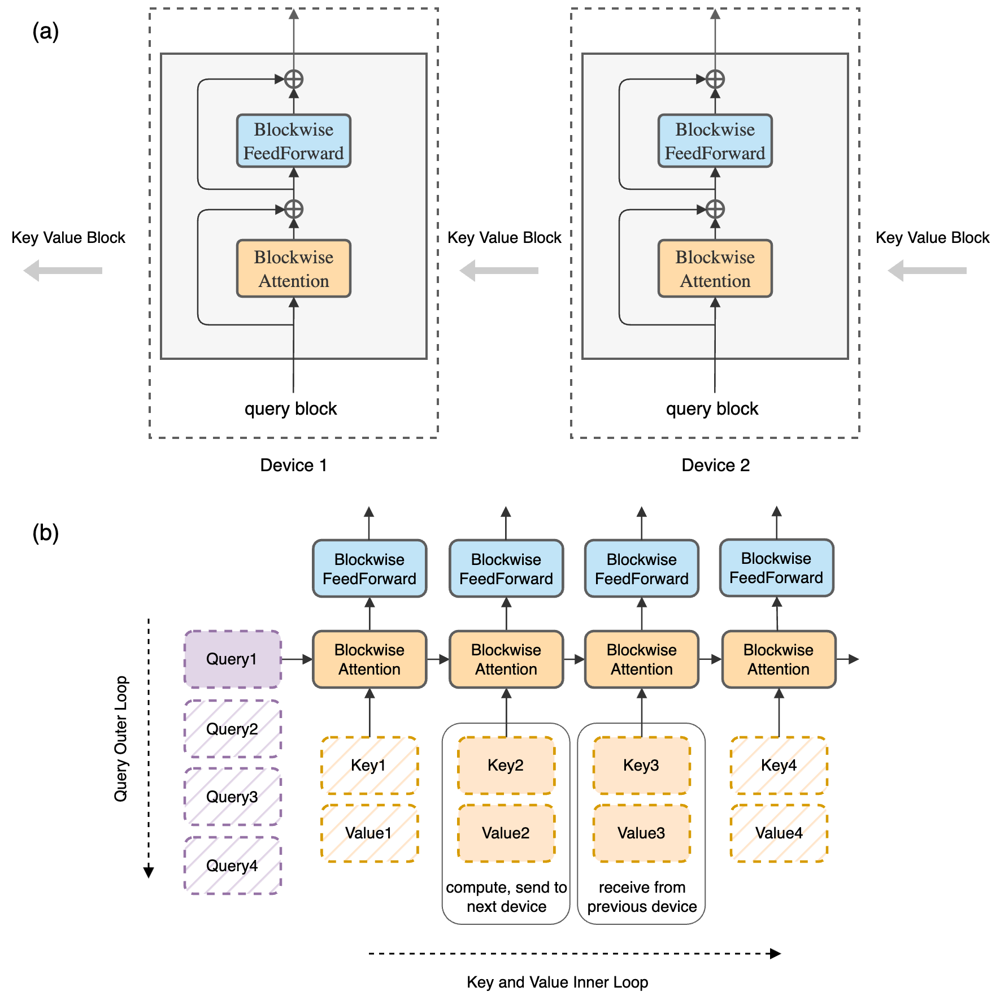

# 01 · Ring Attention

Ring Attention 是 CP 的算法核心，它回答的是「序列被切开后如何把 attention 算对」这个问题。它建立在两个基础之上：

1. FlashAttention 的 online softmax：可以把 KV 分块、逐块累加 attention，而不必一次性持有完整的 $[s, s]$；
2. 环形 P2P：每张卡的 KV chunk 沿一个逻辑环传给下一张卡，转过一圈后，每个 query 就见过了所有 KV。

> 论文：Liu et al., *Ring Attention with Blockwise Transformers for Near-Infinite Context*, 2023, [arXiv:2310.01889](https://arxiv.org/abs/2310.01889)；其计算算子源自 *Blockwise Parallel Transformer* [arXiv:2305.19370](https://arxiv.org/abs/2305.19370) 和 FlashAttention [arXiv:2205.14135](https://arxiv.org/abs/2205.14135)。

---

## 1. online softmax 回顾

标准 attention 的计算是 $O = \mathrm{softmax}(QK^{\top} / \sqrt{d})\, V$。softmax 需要全局的 max 和 sum(exp)，看起来必须先拿到完整的 $QK^{\top}$。但 FlashAttention 证明这一步可以流式完成：把 KV 切成块 $K^{(1)}, V^{(1)}, K^{(2)}, V^{(2)}, \dots$，维护三个 running 状态 $(m, l, O)$：

```
m  = 当前见过的最大 logit（running max）
l  = 当前的 exp 之和（running sum，已按 m 缩放）
O  = 当前的加权 V 累加（已按 m, l 缩放）
```

每来一个新块 $K^{(j)}, V^{(j)}$，按如下方式更新：

$$
\begin{aligned}
S_j   &= Q K^{(j)\top} / \sqrt{d} \\
m_{\text{new}} &= \max(m,\ \mathrm{rowmax}(S_j)) \\
p_j   &= \exp(S_j - m_{\text{new}}) \\
\alpha &= \exp(m - m_{\text{new}}) \\
l     &= \alpha\, l + \mathrm{rowsum}(p_j) \\
O     &= \alpha\, O + p_j V^{(j)} \\
m     &= m_{\text{new}}
\end{aligned}
$$

这里 $S_j$ 的 shape 是 $[s_q, \text{block}]$；$p_j$ 重新以 $m_{\text{new}}$ 为基准，$\alpha$ 是旧状态的缩放因子，用来修正之前用旧 max 算的部分。

所有块处理完后，$O = O / l$ 即为正确结果。这个累加过程有两个关键性质：对块的处理顺序不敏感（只要每块都被处理一次），且每一步只需要当前块的 $K^{(j)}, V^{(j)}$。正是这两点使「KV 分散在不同卡上、轮流到达」成为可能。

## 2. 跨卡环形轮转

CP=N 时，rank $i$ 初始持有 $Q_i, K_i, V_i$（第 $i$ 段 token 的 QKV）。每个 rank 固定自己的 $Q_i$，让 KV 沿环流动：





> 图：Ring Attention 的主机环（原论文示意）。每个 host 固定持有自己的 query 块，KV 块沿环流转；配合 blockwise 前馈，attention 与 KV 的 P2P 传输在时间上重叠。（Liu et al. 2023, Fig 2；[arXiv:2310.01889](https://arxiv.org/abs/2310.01889)）

算法如下（每个 rank $i$）：

```
kv = (K_i, V_i)                       # 起始持有自己的 KV
m, l, O = init                        # online softmax 状态
for step in range(N):                 # 转一圈
    # ① 把当前 kv 发给下一个 rank，同时从上一个 rank 收下一块（async P2P）
    next_kv = isend/irecv(kv) along ring        # 与 ② overlap
    # ② 用当前 kv 更新 online softmax（这块 KV 来自 rank (i-step) % N）
    O, m, l = flash_update(Q_i, kv.K, kv.V, O, m, l, causal_mask_for(i, src_rank))
    kv = wait(next_kv)
O = O / l
```

转 $N$ 步后，rank $i$ 的 $Q_i$ 已经与所有 rank 的 KV 各计算过一次，得到完整的 attention 输出。这一设计的核心优势是通信与计算的 overlap：第 `step` 步在计算 attention 时，下一块 KV 正在 P2P 传输途中。这是 ring 相对于 all-gather 的根本优势，`cp_comm_type="p2p"` 的注释（[[megatron-lm:megatron/core/transformer/transformer_config.py#L897]]）也明确强调了 "P2P is async and can be overlapped"。

## 3. causal mask 的处理

causal 条件下，query $i$ 只能 attend 到 $j \le i$ 的 key。在 ring 中，rank $i$ 收到来自 rank $\text{src}$ 的 KV 块时，需要根据 $\text{src}$ 与 $i$ 的关系决定 mask 方式：

| $\text{src}$ vs $i$（按原始 token 顺序） | mask |
|---|---|
| $\text{src} < i$（KV 全在 query 之前） | 全 attend（no mask） |
| $\text{src} = i$（自己这块） | 下三角 causal mask |
| $\text{src} > i$（KV 全在 query 之后） | 全跳过（不算，省一半计算） |

因此在朴素的顺序切分下，rank $i$ 只需计算 $i+1$ 块（位于其后的块全部跳过）。这也解释了 README 第 4 节提到的负载不均：rank 0 只算 1 块，rank $N-1$ 要算 $N$ 块，工作量从 $O(1)$ 到 $O(N)$ 线性递增，而 ring 的每一步都要等待最慢的那张卡。

把 CP=4 的整个过程展开成一张 trace 表会更直观。表中第 `step` 行表示该步每个 rank 正在处理的 KV 块来源（`—` 表示因 causal 跳过，不算但通信照常轮转）：

| step | rank0 算的 KV 块 | rank1 | rank2 | rank3 |
|---|---|---|---|---|
| 0 | KV0（causal 块） | KV1（causal 块） | KV2（causal 块） | KV3（causal 块） |
| 1 | —（KV3 在自己之后） | KV0（全 attend） | KV1（全 attend） | KV2（全 attend） |
| 2 | —（KV2） | —（KV3） | KV0（全 attend） | KV1（全 attend） |
| 3 | —（KV1） | —（KV2） | —（KV3） | KV0（全 attend） |
| 每 rank 计算块数 | 1 | 2 | 3 | 4 |

可以看到两个事实：通信步数与 mask 无关（KV 必须转满一圈，因为下一步的接收方可能还需要它），而计算量逐 rank 线性递增——causal 节省了一半计算，但省得不均。zigzag 要修的就是最后一行。

## 4. 负载均衡

要先明确一点：这一节的问题是 ring（以及一切按 seq 切的 CP）特有的——causal 下每个 chunk 的计算量取决于它在序列中的位置，越靠后的 chunk 要 attend 的 KV 越多。Ulysses 按 head 切则没有这个问题，各 rank 拿到的是完全同构的一份工作量（见 02 第 3 节）。对 ring 来说，目前有两种主流修正方案（Megatron 采用 zigzag，见 [[megatron-lm:megatron/core/utils.py#L2308]]）：

**zigzag（load-balanced，Megatron 默认）**：把序列切成 $2N$ 块，rank $i$ 取 chunk $i$ 和 chunk $2N-1-i$（一前一后）。这样每个 rank 都持有一个「轻」块（靠前）和一个「重」块（靠后），总工作量大致为常数。

```
CP=2, 序列分 4 块 [c0 c1 c2 c3]:
  GPU0 ← (c0, c3)    # c0 几乎不算, c3 算很多 → 平均
  GPU1 ← (c1, c2)    # c1 算少, c2 算中等 → 平均
```

**striped attention**（[arXiv:2311.09431](https://arxiv.org/abs/2311.09431)）：用条带方式交错分配 token（rank $i$ 拿 $i, i+N, i+2N, \dots$），使每个块内部都是近似满的 causal，均衡效果更好，对 ring 也更友好。

两种方案还有一个共同的前提：切分对象是一条完整的 causal 序列，「前半轻、后半重」的对称性才成立。当序列是 packed 的、内部装着多条文档时，对整条做一次 zigzag 并不能保证每个 rank 在每条文档内部拿到对称的轻重块——这个缺陷及其修正（per-document sharding 等）留到 [03](./03_long_ctx_load_balance.md) 第 4 节讨论。

> 对工程实现的影响：zigzag/striped 之后，rank 持有的 token 不再连续，RoPE position、attention mask、KV 块到达时的 mask 逻辑都要按真实 position 重新计算。这是 CP 实现中容易出错的部分；TE 把这部分封装在 kernel 内部，Megatron 只负责传入正确的 `cu_seqlens` 和切分结果（见 04）。

## 5. backward

ring 的 backward 与 forward 结构对称：forward 把 KV 沿环正向传递，backward 把 KV 和对应的梯度 $dK, dV$ 沿环传递，每个 rank 累加它对经过的 KV 块的梯度贡献。

- forward 保存的不是完整的 attention matrix（那是 $O(s^2)$），而是 FlashAttention 风格的 $(O, m, l)$ 统计量和输入；backward 时重算 $S_j$（recompute），用 $O(s)$ 的显存换 $O(s^2)$ 的重算。
- $dQ_i$ 在 rank $i$ 本地累加（Q 不移动）；$dK_j, dV_j$ 需要回到 KV 原属的 rank，因此梯度同样沿环传一圈进行累加。
- 这再次体现了 CP 在梯度行为上与 DP 的相似性：每个 KV 块的梯度汇聚了所有 attend 到它的 query 的贡献。

## 6. 显存与通信分析

沿用 README 第 8 节的数值示例：`s=128K, cp=8, heads=64, d=128, bf16`，每卡持有 `s/cp=16K` 个 token：

| 量 | 单卡（无 CP） | Ring CP=8 |
|---|---|---|
| Q/K/V 存储 | `[128K,64,128]×3` ≈ 6 GB | `[16K,64,128]×3` ≈ 768 MB |
| attention 中间（flash） | $O(s)$ per head | $O(s / \mathrm{cp})$ per head |
| attention 计算 | $O(s^2)$ = 基准 | $O(s^2 / \mathrm{cp})$ /卡（causal+均衡后） |
| KV 通信 | 0 | 每卡转一圈 ≈ `(cp-1)` × KV块；可 overlap |

通信能否被完全隐藏，取决于是否满足「attention compute 时间 ≥ KV chunk P2P 时间」。把两边都估算一下（沿用上面的数值，每步 KV chunk 为 `[16K, 64, 128]` 的 K+V，bf16）。先看通信：每步每卡要收发的 KV 是 `2 × 16K × 64 × 128 × 2 B ≈ 512 MB`，在 400 Gbps（约 50 GB/s）的 IB 上大约需要 10 ms，在 NVLink（按约 450 GB/s 有效带宽）上只要约 1 ms。再看计算：每卡每一步要对一块 KV 做 `[16K, 16K]` 规模的 attention，FLOPs 约为 `4 × 16K² × 64 × 128 ≈ 8.6 TFLOP`（未计 causal 折扣），在 H100 上（bf16 峰值约 1000 TFLOPS，按 50% 利用率估算）大约需要 17 ms。

把两个数字放在一起，结论就很直观了：机内 NVLink 场景通信远小于计算，overlap 几乎完美；跨机 IB 场景通信与计算同量级，只能部分隐藏——这正是 02 第 4 节 `a2a+p2p` 分层方案的动机。更一般的规律是：序列越长、head_dim 越大，compute 随 $s^2 d$ 增长而通信只随 $sd$ 增长，compute 会越来越占优，overlap 也就越来越充分，这是 ring 适合超长序列的根本原因。反过来，当 $s$ 不够大时，P2P 的开销会暴露出来，此时 Ulysses（02）次数更少、延迟更低的 a2a 反而更划算。

## 7. 与 FlashAttention 的关系

可以把 Ring Attention 理解为：将 FlashAttention 的外层 KV-block 循环，从单卡上的 SRAM 块循环扩展为跨卡的环形循环。两者共用 online softmax 算子；FlashAttention 解决的是单卡 attention 显存超限的问题，Ring 解决的是多卡协作计算一个超长 attention 的问题。在 Megatron + TE 中，CP 每一步的本地计算就是调用一次带正确 mask 的 FlashAttention，因此 CP 天然继承 FlashAttention 的全部算子优化。参见本仓库 [FlashAttention](../../attention/fa/README.md)。

---

## 参考文献

- Liu, Zaharia, Abbeel, *Ring Attention with Blockwise Transformers for Near-Infinite Context*, 2023. [arXiv:2310.01889](https://arxiv.org/abs/2310.01889)
- Liu, Abbeel, *Blockwise Parallel Transformer for Large Context Models*, 2023. [arXiv:2305.19370](https://arxiv.org/abs/2305.19370)
- Brandon et al., *Striped Attention: Faster Ring Attention for Causal Transformers*, 2023. [arXiv:2311.09431](https://arxiv.org/abs/2311.09431)
- Dao et al., *FlashAttention*, 2022. [arXiv:2205.14135](https://arxiv.org/abs/2205.14135)

Ring 靠搬动 KV 解决了问题，但这不是唯一的思路。下一篇[02 · DeepSpeed-Ulysses](./02_ulysses_a2a.md)会讲另一条路：与其搬 KV，不如用两次 all-to-all 把「seq 切」变成「head 切」，让每张卡在本地就能算出完整的 attention。
