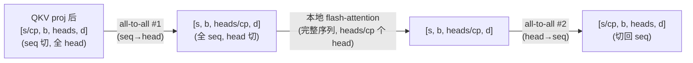
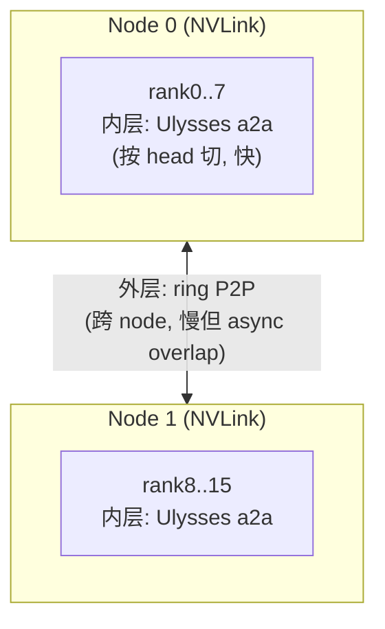

# 02 · DeepSpeed-Ulysses

Ring（01）的思路是序列切开之后把 KV 沿环搬动。Ulysses 走另一条路：attention 在 head 维上天然并行（不同 head 之间互不影响），因此在计算 attention 时，可以把数据从「按 seq 切」转成「按 head 切」，每张卡在本地计算完整序列、部分 head 的 attention，算完再切回去。两次转换都通过 all-to-all 完成。

> 论文：Jacobs et al., *DeepSpeed Ulysses: System Optimizations for Enabling Training of Extreme Long Sequence Transformer Models*, 2023, [arXiv:2309.14509](https://arxiv.org/abs/2309.14509)。
> 对应 Megatron：`cp_comm_type="a2a"`（[[megatron-lm:megatron/core/transformer/transformer_config.py#L899]]），底层 all-to-all 原语见 `mappings.py:420 _AllToAll`。

---

## 1. attention 沿 head 维并行

attention 对每个 head 独立计算 $\mathrm{softmax}(Q_h K_h^{\top}) V_h$，head 之间没有任何依赖。由此可以得出两个阶段的自然 layout：

- **在 QKV projection / MLP 阶段**，数据按 sequence 切（每卡 $s/\mathrm{cp}$ 个 token、全部 head）。这是 CP 的自然 layout，激活按 seq 切可以节省显存。
- **在 attention core 阶段**，数据按 head 切（每卡持有全部 $s$ 个 token、$h/\mathrm{cp}$ 个 head）。这样每卡手里有所负责 head 的全部 token，可以在本地计算完整序列的 attention。

两个阶段的 layout 不同，中间用 all-to-all 转换：




> 图：DeepSpeed-Ulysses 的系统设计。attention 前一次 all-to-all 把 seq-partitioned 的 QKV 聚成 head-partitioned（每卡拿到全序列、$h/\mathrm{cp}$ 个 head），attention 后一次 all-to-all 再切回 seq-partitioned。两次 a2a 恰好互为逆变换。（Jacobs et al. 2023, Fig 2；[arXiv:2309.14509](https://arxiv.org/abs/2309.14509)）

## 2. all-to-all 的转置与重分布

all-to-all 本质上是一次分布式转置。以第一次 a2a（seq→head）为例：

```
输入 (每卡):  [s/cp, heads, d]        每卡有 s/cp 个 token 的全部 head
输出 (每卡):  [s,    heads/cp, d]     每卡有全部 token 的 heads/cp 个 head
```

实现上把 head 维切成 $\mathrm{cp}$ 份，各发一份给对应的 rank，同时收齐所有 rank 发来的同一组 head。写成具体的 split/concat 维度（rank `r` 的视角，省略 batch 维）：

```
发送:  本地 [s/cp, heads, d]  →  沿 head 维 split 成 cp 份 [s/cp, heads/cp, d]
       第 j 份发给 rank j
接收:  从所有 rank j 收 [s/cp, heads/cp, d]（第 r 组 head 的第 j 段 token）
       沿 seq 维 concat 成 [s, heads/cp, d]
```

即「发送按 head 切、接收按 seq 拼」，一次集合通信完成两个维度的转置。`mappings.py:562 all_to_all_sp2hp` 是这一变换的 SP 版本（$[n/\mathrm{TP}, H] \to [n, H/\mathrm{TP}]$），CP 下的 Ulysses 是 head 维上的同构操作；第二次 a2a（head→seq）则是第一次的逆变换（发送按 seq 切、接收按 head 拼）。在 autograd 层面，a2a 的 backward 是把 input/output split 互换后的另一次 a2a（见第 5 节），这与「all-gather 的反向是 reduce-scatter」的对称性一脉相承。

这里选择 all-to-all 而不是 all-gather，原因在显存。all-gather 会让每张卡都拿到完整的 $[s, \mathrm{heads}, d]$，KV 全量复制，显存退回单卡水平；all-to-all 只做重分布、不做复制，每卡始终只持有 $1/\mathrm{cp}$ 的数据量。这也是 `cp_comm_type="all_gather"`（gather 完整 KV）通常更费显存、且 "cannot be overlapped"（[[megatron-lm:megatron/core/transformer/transformer_config.py#L898]]）的原因：all_gather 路径实现最简单但代价最高，仅在序列较短、KV 较小时使用。

## 3. 复杂度对比与 head 数约束

| | Ring (`p2p`) | Ulysses (`a2a`) |
|---|---|---|
| 通信次数/层 | $\mathrm{cp}-1$ 次 P2P（forward）| 2 次 all-to-all（forward）|
| 单卡通信量 | $O(s \cdot d \cdot \mathrm{heads})$（KV 转一圈）| $O(s \cdot d \cdot \mathrm{heads} / \mathrm{cp}) \times 2 \approx$ 与 ring 同阶，但**常数小、可合并**|
| 能否 overlap | ✅（P2P async 藏进 compute）| ❌（a2a 是 barrier，attention 必须等它）|
| 本地 attention | flash，$O(s^2/\mathrm{cp})$ /卡 | flash，$O(s^2)$ 在 $\mathrm{heads}/\mathrm{cp}$ 个 head 上 |
| 负载均衡 | causal 下按 seq 切，各 chunk 计算量随位置递增，需要 zigzag 配对修正（01 第 4 节） | 按 head 切，各 rank 拿到完全同构的一份，天然均衡、无需修正 |
| **约束** | 无 | **`cp ≤ num_heads` 且 `num_heads % cp == 0`** |

负载均衡这一行值得展开。按 head 切时，不同 head 的 attention 是完全同构的计算——每个 head 的 query-key 对数、Q/K/V/O 字节量、kernel 调用结构都相同，等宽切分后各 CP rank 拿到的是数学上严格相等的一份工作量；causal 带来的计算量差异发生在每个 head 内部、由单卡完整承担，天然被摊平。zigzag 要修的「位置越靠后算得越多」问题，只在按 seq 切的世界里存在。按 head 切对 FlashAttention 也更友好：FA 的吞吐对每次调用的 head 数减少不敏感，却对 sequence block 变短很敏感（Q_len 不足一个 tile 仍按整块计费），所以同样切成 $\mathrm{cp}$ 份，head 维切出的是 $\mathrm{cp}$ 个效率无损的同构 chunk，seq 维切出的则是成本递增且越切越短的 chunk。这个对比是长文负载均衡的重要背景，[03](./03_long_ctx_load_balance.md) 第 4 节会结合 Libra 的实测展开。

head 数约束是 Ulysses 的硬限制：要把 head 切到 $\mathrm{cp}$ 张卡，head 数必须不小于 cp 且能整除。GQA/MQA 下这个约束更紧：Q 的 head 数虽然够，但 KV 的 head 数很少（甚至只有 1 个），按 KV head 切分时 `cp ≤ num_kv_heads` 往往先触顶——这也是 Ulysses 类方案在长上下文 GQA 模型上常只开很小 cp 的原因。Ring 没有这个约束，因此超大 CP（CP > heads）必须使用 ring 或分层方案。

通信量可以精确写出来。以第一次 a2a 为例，每个 rank 把自己 $[s/\mathrm{cp}, \mathrm{heads}, d]$ 的 Q/K/V 各保留 $1/\mathrm{cp}$，把其余 $(\mathrm{cp}-1)/\mathrm{cp}$ 发出去，因此单卡单张量的发送量是

$$
V_{\mathrm{a2a}} = (s/\mathrm{cp}) \cdot \mathrm{heads} \cdot d \cdot (\mathrm{cp}-1)/\mathrm{cp} \approx s \cdot \mathrm{heads} \cdot d / \mathrm{cp}
$$

（$\mathrm{cp}$ 较大时取近似。）forward 一共 4 次这样的传输（Q/K/V 各一次进 attention 前，输出 O 一次切回），backward 结构对称再来 4 次。对比 ring：每卡 KV 转一圈的总量约 $2 \cdot s/\mathrm{cp} \cdot h_{\mathrm{kv}} \cdot d \cdot (\mathrm{cp}-1) \approx 2 \cdot s \cdot h_{\mathrm{kv}} \cdot d$，两者同阶；区别全在通信模式——ring 是 $\mathrm{cp}-1$ 次小量 P2P（可以 overlap），Ulysses 是少量大块 a2a（延迟低但不能 overlap）。因此选择取决于序列是否长到 compute 能够盖住 P2P：长序列选 ring，中短序列选 Ulysses。

## 4. `a2a+p2p` 分层 CP

大规模训练中，CP group 往往跨多个 node（例如 CP=16 = 2 node × 8 卡），而带宽是分层的：node 内 NVLink（约 900 GB/s），node 间 IB（约 100–400 GB/s）。`cp_comm_type="a2a+p2p"`（`transformer_config.py`，配合 `hierarchical_context_parallel_sizes`，`parallel_state.py:554/967`）正是按照这一分层结构设计的：

```
hierarchical_context_parallel_sizes = [8, 2]   # 内层 a2a 跨 8 卡(NVLink), 外层 p2p 跨 2 node(IB)
```



- **内层（node 内）使用 a2a**：NVLink 带宽高，a2a 的 barrier 代价小、延迟低。
- **外层（node 间）使用 p2p ring**：IB 带宽较低，但 ring 能把跨机 KV 传输 overlap 进 attention compute，隐藏慢链路的开销。

这是大规模长上下文训练（如 DeepSeek）中的常见配置：把昂贵的跨机通信交给可 overlap 的 ring，把廉价的机内通信交给低延迟的 a2a。[[megatron-lm:megatron/core/parallel_state.py#L967]] 的 `hierarchical_context_parallel_sizes` 断言 `np.prod(...) == context_parallel_size`，即各层 size 的乘积必须等于总 CP size。

## 5. backward

Ulysses 的 backward 非常直接：两次 all-to-all 都是线性算子，其反向就是 split 维互换后的另一次 all-to-all（`mappings.py:466 _AllToAll.backward`；这与 MoE dispatch 的对称性完全同构，见 [03 · Combine 与 forward / backward 对称性](../05_ep/03_combine_and_backward.md)）。本地 attention 的反向就是普通的 flash-attention backward。因此只要把 a2a 写成一个 autograd 原语（forward 重分布、backward 反向重分布），整条 Ulysses 反向链路会由 autograd 自动给出，这一点会在 lab 中实际验证。

---

## 参考文献

- Jacobs et al., *DeepSpeed Ulysses*, 2023. [arXiv:2309.14509](https://arxiv.org/abs/2309.14509)
- Megatron `cp_comm_type` 与分层 CP：[[megatron-lm:megatron/core/transformer/transformer_config.py#L891]], [[megatron-lm:megatron/core/parallel_state.py#L553-L973]]。
- all-to-all 原语：[[megatron-lm:megatron/core/tensor_parallel/mappings.py#L420]]。

Ring 和 Ulysses 都默认 batch 内序列等长、CP size 固定。当数据变成变长的（SFT、RL、多模态），静态 CP 会在显存、计算、通信上同时制造浪费。下一篇[03 · 长文负载均衡](./03_long_ctx_load_balance.md)会系统调研围绕这个问题的一批工作（ChunkFlow / WLB-LLM / Skrull / FlexSP / DCP / Libra 等），并按「不均衡发生在哪个维度」——CP group 内、CP group 间、PP 维——重新组织它们的思想与算法。
