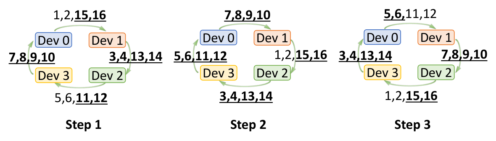
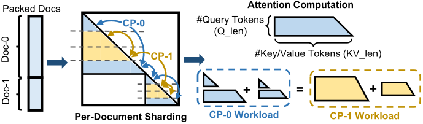
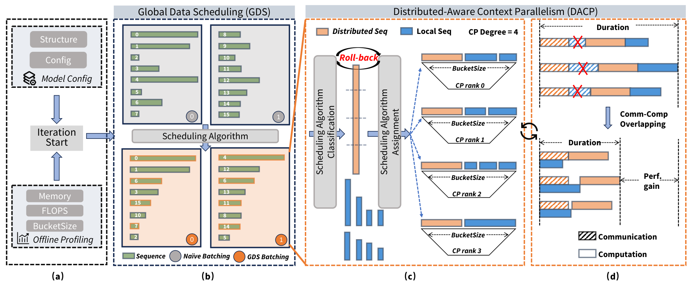
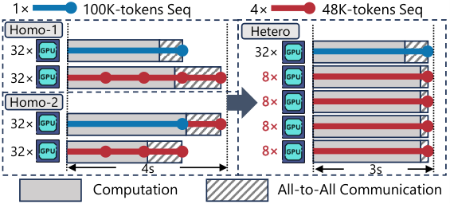
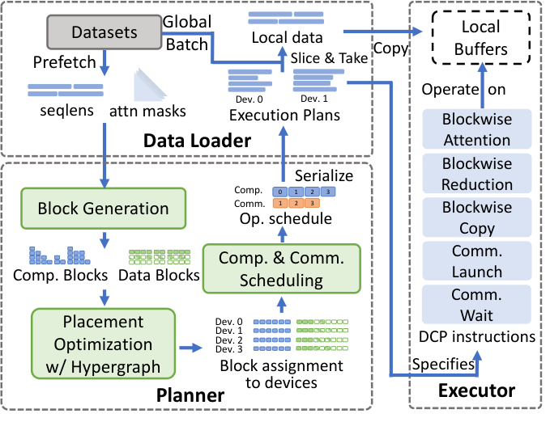
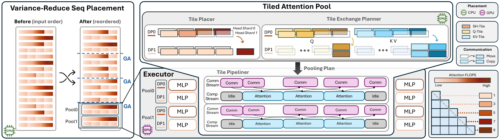

# 03 · Dynamic CP

01 和 02 介绍的 Ring 与 Ulysses 解决了「等长序列如何切到多卡」的问题，但它们都建立在一个很少被明说的假设上：batch 里的每一条序列都一样长，而且整个训练过程使用同一个固定的 CP size。这个假设在 pretrain 语料上大致成立——语料经过清洗和截断后长度本来就整齐。可是一旦来到长上下文 SFT、RL rollout、多模态训练，假设就被彻底打破了：这些场景的序列长度呈极端的长尾分布，短的几百 token、长的几十万 token 混在同一个 batch 里，固定的 CP size 会在显存、计算、通信三个维度上同时制造浪费。围绕「如何让 CP 适应变长输入」，2025 年前后集中出现了一批工作，习惯上统称为 dynamic CP。本篇对这些工作做一次系统的调研与归类：先把问题精确地界定清楚，再抽出它们共同面对的调度问题骨架，然后按「改动的到底是数据、是调度、是并行度、还是计算放置」分成四条路线，每条路线抓住最关键的一两个技术点讲透，次要的工程修饰从简。本篇以思想和算法为主，刻意不深入具体代码；Megatron 里的对应实现留到下一篇。

本篇调研的工作如下，后文会按技术路线而不是按这个清单的顺序来讲：

- ChunkFlow（Alibaba + 中科院计算所，[arXiv:2503.02356](https://arxiv.org/abs/2503.02356)）
- WLB-LLM（Meta + UCSD，[arXiv:2503.17924](https://arxiv.org/abs/2503.17924)）
- Skrull（中科院计算所 + Alibaba，[arXiv:2505.19609](https://arxiv.org/abs/2505.19609)）
- FlexSP（PKU + ByteDance，[arXiv:2412.01523](https://arxiv.org/abs/2412.01523)）
- NVIDIA Dynamic-CP（[NVIDIA Technical Blog, 2026](https://developer.nvidia.com/blog/speeding-up-variable-length-training-with-dynamic-context-parallelism-and-nvidia-megatron-core/)）
- DCP（HKU + AWS，SOSP 2025，[arXiv:2510.10620](https://arxiv.org/abs/2510.10620)）
- Libra（UCAS + Alibaba + NUS，[arXiv:2607.23250](https://arxiv.org/abs/2607.23250)）

---

## 1. 静态 CP 失效的原因

### 1.1 序列长度是长尾分布的

几乎所有 dynamic CP 的论文都以同一份观察开篇：真实训练数据的序列长度极度不均匀。这里列几个有代表性的数字，帮助建立直观感受。Llama 3 官方 SFT 数据中，长上下文样本只占 0.11%，其余 99.89% 的样本平均长度不足 1K（ChunkFlow 和 DCP 都引用了这组数字）。LMSysChat1M 里超过 99% 的序列短于 4K，但最长的一条接近 300K（ChunkFlow）。Libra 报告的生产语料更夸张：中位长度只有 644 token，尾部却接近 1M。

长度分布的不均本身还不是问题，真正的问题是它与静态 CP 的配置方式发生了冲突。静态 CP 的 CP size 必须按 batch 内最长的那条序列来定，否则那条序列就会 OOM。于是占绝大多数的短序列也被迫切到 `cp` 张卡上，白白承担它们本不需要的 CP 通信。这个浪费有多大？FlexSP 给出了一组实测：GPT-7B、64×A100 的机器上，SP 开到 64 时 All-to-All 通信占单步总时间的 16.4%–54.4%，而 SP 只开 8 时占比只有 5.7%–8.1%；但反过来，32K 以上的序列在 SP≤8 时直接 OOM，128K 的序列需要 SP≥32 才放得下。也就是说，短序列想要小 group 省通信，长序列却需要大 group 防 OOM，任何单一的固定配置都必然牺牲一头。这个矛盾是 dynamic CP 的第一推动力。

### 1.2 计算与显存不可同时均衡

在往下讲之前，需要先把变长训练的代价模型写清楚——后面所有工作的目标函数都建立在它之上。对一条长度为 $s$ 的序列，逐层来看，activation 显存随长度线性增长：

$$
M(s) = \alpha \cdot s + \beta
$$

而计算量是在线性项之上再叠加 attention 的二次项：

$$
F(s) = c_1 \cdot s + c_2 \cdot s^2
$$

以 Skrull 给出的逐层公式为例：$F(s) = (20h^2 + 4h\,h_{kv})\,s + 4h\,s^2$，其中 $h$ 是 hidden size，$h_{kv}$ 是 KV 的 hidden 维。线性项来自 QKV projection、MLP、LayerNorm 这些逐 token 的算子，二次项来自 attention 的 $QK^{\top}$ 与 $PV$（这里没有计入 causal mask 带来的 1/2 系数，作为上界估计已经足够）。用 Qwen2.5-0.5B 实测拟合一下就能感受两项的悬殊：序列从 4K 增长到 32K（8 倍）时，计算量增长约 30 倍，而显存只增长约 4 倍。

sequence packing（把多条文档拼成定长序列的做法，Megatron 里的两代形态见 [README 第 4 节](./README.md)）让事情变得更微妙。把若干条文档（长度记为 $\ell_1, \dots, \ell_k$）pack 成一条定长序列之后，文档之间有 attention mask 隔开、互不 attend，因此一条 packed 序列的 attention 工作量是

$$
W_{\text{attn}} \propto \sum_{j=1}^{k} \ell_j^2
$$

而不是 $(\sum_j \ell_j)^2$。这个差别带来一个经常被忽视的结论：**等长 packing 只均衡了显存和线性算子，并没有均衡 attention**。Libra 给出的例子很说明问题：一条 40K 的文档独占一条 packed 序列，十条 4K 的文档拼成另一条等长的 packed 序列，两者 token 数完全相同，但前者的 attention FLOPs 约为后者的 10 倍。换句话说，显存随 token 数线性增长、计算随长度平方增长，这两个目标在数学上就不可能同时完美均衡。这是贯穿所有 dynamic CP 工作的基本张力——每个系统都必须做出选择：优先均衡哪一个，对另一个留多少容差。

### 1.3 不均衡被同步结构放大

单个 worker 的负载不均本身并不可怕，可怕的是分布式训练的同步语义会把局部的慢放大成全局的等待。不均衡会沿三个并行维度显现出来。

先看 CP 维。01 第 4 节介绍的 zigzag 切分只对「单条 causal 序列」是均衡的：它假设切分对象是一条从头到尾的序列，前半轻后半重，一前一后配对正好拉平。但 packed 序列里装着多条文档，对整条序列做一次 zigzag，并不能保证每个 rank 在每一条文档内部都拿到对称的轻重块，CP group 内各 worker 的 attention 工作量依然参差不齐。

再看 DP 维。梯度同步是集合通信，组的完成时间等于组内最慢者的时间，所以各 DP replica 分到的 attention 工作量不同，就直接转化为 gradient sync 时的互相等待。Libra 报告了一个很有冲击力的数字：Qwen3-Turbo、1M packed 序列、CP=16 的配置下，DP 从 1 扩到 16（16 卡扩到 256 卡），吞吐只提升了 4.42 倍，扩展效率仅 27.6%——瓶颈不在通信带宽，而在每个 replica 分到的计算本来就不一样多。

最后是 PP 维。micro-batch 之间工作量不等，会直接变成 pipeline 里的 bubble。ChunkFlow 估算过一个例子：4 条变长序列、PP=4 的配置，直接套标准 1F1B 调度，bubble 占单步时间的比例高达 57.14%，而同配置下等长序列的理论值只有 42.8%。而且 PP 是生产者-消费者结构，整条流水线的 critical path 由最重的那个 micro-batch 决定，它会把前两级维度上的不均衡进一步放大。

除了长度，还有一类更隐蔽的不均来自 mask 本身。静态 CP 的 zigzag placement 是为 causal mask 设计的；当 workload 使用 sliding-window、blockwise、shared-question 这类结构化 mask（在 RLHF、ICL 场景越来越常见）时，ring 的固定通信模式会与 mask 形状脱节，传输大量接收方根本用不到的 KV block。DCP 论文给了一个量化的例子：在 shared question mask、4 设备 ring 的配置下，48 个 KV block 的传输里有 38 个是冗余的。



> 图：shared question mask（一个问题配多个答案）下，4 设备 ring 在三个 step 里的 KV block 传输情况，下划线粗体标出的是接收方用不到的冗余 block——48 次传输中 38 次冗余，而且 device 3 分到的计算远多于其它设备。静态 ring 的通信模式与 mask 形状完全解耦，这是它处理稀疏 mask 时低效的根本原因。（Jiang et al. 2025, Fig 7b；[arXiv:2510.10620](https://arxiv.org/abs/2510.10620)）

## 2. 统一视角：一个带约束的调度问题

把七项工作摆在一起看，它们解的其实是同一个问题。用最优化的语言写出来，就是：

$$
\min_{\text{placement}} \ \max_{r \in \text{ranks}} \ T_r
\qquad \text{s.t.} \quad M_r \le M_{\text{cap}},\ \forall r
$$

目标是最小化「最慢那张卡」的单步时间（也就是 makespan，因为同步训练里大家都等最慢者），约束是每张卡的显存 $M_r$ 不超过单卡容量 $M_{\text{cap}}$。各家工作真正的分歧不在目标，而在于 placement 这个决策变量被允许动到什么程度。归纳下来，一共有四个可以动的旋钮，粒度从粗到细依次是：

1. **数据怎么组织**：packing 怎么做、要不要把长序列切成等长的 chunk。这是 ChunkFlow 和 WLB-LLM 的主战场，改动发生在样本进入模型之前。
2. **数据怎么调度**：batch 里的每条序列分给哪个 DP rank、进哪个 micro-batch、值不值得切分。Skrull 走的就是这条路，数据本身不动，只动它的分配方式。
3. **每条序列用多大的并行度**：把 CP/SP size 从全局常量变成逐样本或逐 micro-batch 的决策变量。FlexSP、NVIDIA Dynamic-CP 和 Megatron 的 hybrid CP 属于这一类。
4. **计算放在哪里**：不再以整条序列为分配单位，而是把 attention 的计算切成细粒度的 block 或 tile，逐个决定放在哪张卡上执行。DCP 和 Libra 走到了这一层，改动已经深入 attention 算子的内部。

这四个旋钮的粒度依次变细，也意味着对训练框架的侵入依次加深：前两条路线基本不碰 attention 的实现，第三条要动通信组的组织方式，第四条则要重写 attention 的执行路径。粒度越细，理论上能达到的均衡上限越高，工程代价也越大——这个 trade-off 会在 §7 的横向比较里看得更清楚。

| 工作 | 主旋钮 | 决策粒度 | 求解方法 | 通信模式 | 并行配置 |
|---|---|---|---|---|---|
| ChunkFlow | 数据重组 | chunk（等长） | bin-packing 启发式 | 不变 | 静态 |
| WLB-LLM | 数据重组 + 切分 | document | 贪心 min-max | 不变 | 静态 |
| Skrull | 数据调度 | 序列 | 启发式 + roll-back | 不变 | 静态 |
| FlexSP | 动态并行度 | 序列 | MILP（SCIP） | 不变（a2a） | 每 micro-batch 异构 group |
| NVIDIA Dynamic-CP | 动态并行度 | packed 序列 | cost model + 启发式 + simulator | 不变 | per-microbatch cp_size |
| DCP | 计算放置 | attention block | hypergraph partitioning | 重写为任意 P2P | 静态，placement 每步重算 |
| Libra | 计算放置 | attention tile | LPT + 通信感知贪心 | pool 内 P2P | 静态，pool 有界 |

在分路线展开之前，还有三个贯穿所有工作的共性值得先点出来，因为它们解释了「为什么这些系统能落地」而不只是纸面算法。第一，cost model 是所有工作的共同地基：每个系统都要先用序列长度估算每条样本的计算、显存和通信代价，也就是 §1.2 那组公式，差别只在精度——ChunkFlow 最粗，直接假设执行时间正比于长度；WLB-LLM 和 Libra 用 $\sum \ell_j^2$ 刻画文档级的 attention 工作量；FlexSP 和 Skrull 最细，拟合完整的 $\alpha W + \beta$ 模型并区分链路带宽。第二，求解全部放在 CPU 上异步完成：调度算法都跑在 data loader 或 sampler 侧的 CPU 进程里，与 GPU 训练流水线式地 overlap，做到对训练循环近乎零开销。第三，通信组预建、运行时选用：凡是动并行度的路线，都在初始化时把各种大小（通常取 2 的幂）的子 group 全部建好，运行时只按调度结果取用，每张卡最多属于 $\log_2 N$ 个组，数量完全可控。

最后还需要留意各工作在数学等价性上的差别，这直接关系到能不能放心用。只改变 micro-batch 划分与执行顺序的调度（Skrull、FlexSP、NVIDIA Dynamic-CP）保持每个 optimizer step 的样本多重集不变，数学上与原训练严格等价。WLB-LLM 会把超长文档推迟到后续的 step，改变了 step 的样本多重集。DCP 和 Libra 的 tile 级迁移改变了 attention 内部的归约次序，不保证 bitwise 等价，但两边的实验都表明收敛不受影响。

## 3. 路线一：重组数据

第一条路线的思路最朴素：既然变长的输入难算，那就先把输入数据重新组织成「好算」的形状，并行策略本身一概不动。具体又分两种做法——ChunkFlow 把数据变成等长的调度单元，从根上绕开负载建模；WLB-LLM 则接受变长，但按真实 workload 而不是 token 数来 packing。

### 3.1 ChunkFlow：等长 chunk 与 state-aware 调度

ChunkFlow 的出发点是一个务实的观察：与其费力为变长序列建立精确的负载模型，不如干脆把 batch 重组成一批大小一致的 **chunk**——短序列合并进一个 chunk，长序列切成多个 chunk，每个 chunk 都不超过预设的 `ChunkSize`。这样做带来两个直接的好处：pipeline 的调度单元全部等长，bubble 问题退化回等长情形；显存峰值由 `ChunkSize` 决定，与数据集里那条最长的序列彻底脱钩——后一点尤为重要，因为它意味着不再需要为 0.01% 的极端长序列去配置整个集群的并行度。


> 图：16 条变长序列（上方彩条）被重组成 7 个近似等长的 chunk：Sequence 6 太长，被切成 chunk 4–7（称为 dependent chunk）；其余短序列经过 bin packing 合并进 chunk 1–3（称为 standalone chunk）。（Yuan, Xu et al. 2025, Fig 4；[arXiv:2503.02356](https://arxiv.org/abs/2503.02356)）

chunk 的构造过程是一个经典的 bin packing 问题：长序列直接按 `ChunkSize` 均切，短序列用递增试探的贪心装桶（bin 容量是 `ChunkSize`，目标是桶数最少），batch 规模下求解代价可以忽略。

真正体现设计功力的是长序列切出来的那些 chunk。由于 causal attention 的第 $i$ 个 chunk 需要 attend 前 $i-1$ 个 chunk 的 KV，这些 chunk 之间存在因果依赖，ChunkFlow 把它们称为 dependent chunk，并用一个 `StateStore` 在 chunk 之间传递 KV tensor 和它的梯度。如果按依赖顺序朴素地执行，activation 会随原序列长度线性堆积，等长 chunk 带来的显存收益就被抵消了。于是 ChunkFlow 设计了 **state-aware scheduling**——本质上是一种沿序列维的选择性重计算：只保留最后 $K$ 个 chunk 的 activation（$K$ 是超参，默认取 1），更早的 chunk 在 backward 阶段重新 forward 一遍：

```
Algorithm: StateAwareChunkScheduling(一条长序列的 N 个 dependent chunk, K)
if N <= K:  依次 forward 全部 chunk，再逆序 backward              # 常规做法
else:
    # 阶段一：全量 forward 一遍，但只保留最后 K 个 chunk 的 activation
    for chunk in 升序:
        loss = forward(chunk, StateStore)      # 从 StateStore 读前序 chunk 的 KV
        if chunk.idx >= K: 保留 loss 和 activation
        else:                丢弃 activation（KV 已留在 StateStore）
    # 阶段二：最后 K 个 chunk 逆序 backward（梯度沿 StateStore 回传）
    for loss in reversed(保留的 losses): backward(loss)
    # 阶段三：前 N-K 个 chunk 重新 forward，并立即 backward
    for chunk in 前 N-K 个 (升序): loss = forward(chunk, StateStore); backward(loss)
```

这套调度把峰值显存压到 $K \times \text{ChunkSize}$ 的 activation 加上整条长序列的 KV（GQA 下 KV head 很少，这部分开销可控），$K$ 就是显存与重算开销之间的旋钮。把 chunk 作为调度单元嵌入标准 1F1B，就得到 state-aware 1F1B：§1.3 那个 4 条变长序列的例子，bubble 占比从 57.14% 降到 47.8%。实验在 Qwen2.5-7B 到 72B、32K/256K context 上进行，相对各自最优配置的 Megatron-LM 取得最高 4.53 倍的端到端加速；收益来自短序列合并提高算力利用率、bubble 降低、以及 256K 下免于 full recompute 三者的叠加。

### 3.2 WLB-LLM：workload-aware packing 与 per-document sharding

WLB-LLM 来自 Meta 内部一个 8K GPU、128K context 的生产训练任务，论文开篇实测发现最慢的 GPU 比其余 GPU 慢 1.44 倍。它的分析把 §1.2 的代价模型又推进了一步：一个 micro-batch 的总延迟可以拆成两部分——attention 的二次项，和其余所有算子（GEMM、element-wise、集合通信）的线性项，后者经过实测确实随 token 数线性增长。这个分解带来一个关键洞察：**只要打破「packed 序列必须等于固定 context 窗口」的约束，就可以用多条短文档累加的线性项，去匹配一条超长文档的二次项**，让每个 GPU 拿到的不再是等数量的 token，而是等延迟的工作量。WLB-LLM 保持 4D 并行配置完全不变，只在数据侧的两个层级动手。

PP 级做的是 workload-aware 变长 packing。目标仍然是 min-max 各 micro-batch 的总延迟，只是约束从「等长」换成了「不超显存」：

```
min  max_j  Σ_i [ W_a(x_ij · d_i) + W_l(x_ij · d_i) ]   # W_a 是二次的 attention 项，W_l 是线性项
s.t. 每个 doc 恰好进入一个 micro-batch；
     Σ_i x_ij · d_i ≤ L_max        # 只受显存限制，允许超过 context window
```

这个 ILP 是 NP-hard 的，实际系统用一个极轻的贪心来逼近：文档按长度降序，逐条放进当前总工作量最小的 micro-batch，放不下就放进当前长度最小的，每 batch 的求解只要 20ms。另外还有一个配合的小机制：长度接近整个窗口的 outlier 文档先进入 FIFO 等待队列，攒满一批后每个 micro-batch 恰好分一条——这既保证了 outlier 之间的均衡，又避免了跨 batch 大窗口 repack 对数据随机性的破坏（论文实测后者会让 loss 升高 1.6%，得不偿失）。

CP 级做的是 per-document sharding。想法是对 packed 序列里的**每一条文档单独**做 zigzag 切分：每条文档内部切成 $2 \cdot cp$ 块，worker $i$ 对每条文档都拿第 $i$ 块和第 $2cp-1-i$ 块。这样一来，每个 worker 在 token 数（线性项）和 attention 工作量（二次项）两个维度上都严格均衡，而不再像整条序列 zigzag 那样只在期望上均衡。文档长度不能被 $2cp$ 整除时，余数部分 round-robin 分给各 worker，可以实现零 padding。



> 图：对 packed docs 逐文档做对称切分的示意。左侧 CP-0 拿到的若干梯形和三角形块（浅色）与右侧 CP-1 的块（深色）面积相等——梯形的面积正是 causal 下的 query-key 对数，也就是每个 worker 的 attention 工作量，两者严格相同。（Wang, Cai, Xie et al. 2025, Fig 9；[arXiv:2503.17924](https://arxiv.org/abs/2503.17924)）

值得注意的是，WLB-LLM 还揭示了一个有普遍意义的张力：**负载均衡和 kernel 效率会打架**。per-doc sharding 把 CP 不均完全消除了，但它产生的大量短 chunk 会伤害 attention kernel 本身的效率——FlashAttention 的 tile 是 128，Q_len 不足 128 的块仍按 128 计费；Hopper 上要 Q_len ≥ 256 才能用上 TMA multicast。它的应对是运行时逐 micro-batch 在 per-seq 和 per-doc 两种切法之间选自适应：分别估算两种切法下 kernel 的等效 FLOPs（短 chunk 按 tile 向上取整计入浪费），取预测延迟更低者，实测比任何单一策略都好 3.4%–7.5%。「最均衡的切法不一定最快」这个结论，后面 Libra 还会从另一个角度再次印证。最终在 7B–70B、64K/128K 的实验上，WLB-LLM 平均加速 1.23 倍，128K 上 1.30 倍。

## 4. 路线二：调度数据

Skrull 与路线一共享「并行配置固定不变」的前提，但它连数据本身也不重组，而是把问题彻底看作一个调度问题：哪条序列进哪个 micro-batch，哪条序列值得被切分。它最关键的一个想法是：把 micro-batch 内的序列分成两类——distributed sequence 走正常的 CP 切分，保住长序列的处理能力；local sequence 完整放在单个 CP rank 上，彻底免除 CP 通信。两类序列在同一个 CP group 里处理，不需要额外的 GPU，而且由于两者之间没有数据依赖，distributed 序列的 CP 通信可以和 local 序列的计算天然 overlap。这个组件叫 DACP（Distributed-Aware CP），它的形式化直接体现了 §1.2 的张力。设 BucketSize $C$ 是每个 rank 能容纳的 token 数（显存约束的 token 化表达），$N$ 是 CP size，则：

```
min  max_j Time_j
Time_j = max( T_comm(V), T_comp(Local_j) ) + T_comp(Dist)
       # max 这一项就是 local 序列的计算与 distributed 序列的通信在做 overlap
约束: 每条序列要么整体分给某个 rank（local），要么被切分（distributed）；
      Σ local 长度 + Σ distributed 长度/N ≤ C      （每个 rank 的显存）
```

求解采用一个由三条原则指导的轻量启发式：尽量避免切分、优先均衡计算、显存不足时用 roll-back 兜底。伪代码如下：

```
Algorithm: DACP(序列长度 S[1..K] 升序, BucketSize C, CP size N)
RB[j] ← C;  L[j] ← 0          # 每个 rank 的剩余显存额度 / 累计计算负载
for i in 1..K:                 # 短序列先放
    t ← argmin(L)              # 原则 2: 优先把序列放到计算最轻的 rank
    if RB[t] >= S[i]: 把序列 i 作为 local 放入 t; 更新 RB,L; continue
    t ← argmax(RB)             # 原则 1: 实在不行，放到显存最宽裕的 rank
    if RB[t] >= S[i]: 同上; continue
    t ← argmin(RB)
    if RB[t] >= S[i]/N: 把序列 i 标记为 distributed; 所有 rank 更新 RB,L; continue
    RollBack(t): 把 t 里一条已放置的 local 序列改为 distributed, 释放显存   # 原则 3
    重放序列 i
```

在 DACP 之上还有一层 GDS（Global Data Scheduling），负责在 global batch 粒度做分配：先在 DP rank 之间按 FLOPs 做 bin packing 粗均衡，再把每个 rank 分到的序列切成 micro-batch，切的时候让长短序列交错搭配——长序列被均匀摊到各个 micro-batch，每个 micro-batch 内部长短兼有，恰好为 DACP 的 overlap 创造条件。整个调度只改变梯度累加的划分与顺序，global batch 的内容和 optimizer step 的语义都不变，因此与标准训练数学等价。



> 图：Skrull 的四段流程——offline profiling 拟合代价模型的 $\alpha/\beta$ 系数；GDS 把 global batch 切成各 DP rank 的 micro-batch 列表；DACP 在 micro-batch 内做 local/distributed 分类和 roll-back；执行阶段 local 序列的计算与 distributed 序列的通信 overlap。（Xu et al. 2025, Fig 2；[arXiv:2505.19609](https://arxiv.org/abs/2505.19609)）

Skrull 基于 DeepSpeed（ZeRO-2）实现，在 Qwen2.5-0.5B/7B 上相对 DeepSpeed 平均加速 3.76 倍、最高 7.54 倍。它的局限也来自设计本身：收益大小取决于 BucketSize 与长度分布的相对关系——当数据的主长度超过 BucketSize 时（比如大模型配上双峰分布的数据），可调度的空间会明显变小。

## 5. 路线三：动态并行度

前两条路线都接受「所有序列共享同一个并行配置」这个前提，在数据侧想办法。路线三更进了一步：把 CP/SP size 本身变成逐样本（或逐 micro-batch）的决策变量——长序列用大 group 防 OOM，短序列用小 group 甚至干脆不切，把 §1.1 那个「大小不可兼得」的矛盾直接消解掉。

### 5.1 FlexSP：异构 SP group 与 time-balanced 分配

FlexSP 面对的场景是每个训练 step 要处理若干条未 packing 的变长序列。同质方案必须选一个能装下最长序列的 SP size，让所有序列共用；FlexSP 则允许同一个 batch 内并存不同 degree 的异构 SP group（Ulysses 风格，见 02），让它们并发执行。一张图就能说明收益的来源：



> 图：64 卡处理 1 条 100K + 4 条 48K 序列的三种方案。Homo-1/Homo-2 用同质的 SP=32 group，4 条 48K 序列的 All-to-All（斜线部分）高达 1.2s，总耗时 4s；Hetero 用 1 个 SP=32 group 处理 100K、4 个 SP=8 group 各处理一条 48K，通信降到 0.2s，总耗时 3s。（Wang et al. 2025, Fig 1；[arXiv:2412.01523](https://arxiv.org/abs/2412.01523)）

不过这里有个容易踩的坑：既然短序列该用小 group，那朴素地把每条序列分给「能装下它的最小 group」不就行了？答案是不行——长尾分布下短序列的数量远远多于长序列，小 group 会瞬间过载，大家还是要排队等它。所以 FlexSP 把问题形式化为 min-max 各 group 完成时间的优化（论文称之为 time-balanced assignment）：枚举若干个虚拟 SP group（degree 只取 2 的幂，候选很少），决策变量是 group 启用向量和序列分配矩阵：

```
min  C                                          # 最小化最慢 group 的时间 (makespan)
s.t. Time({s_k, A_kp}; d_p) ≤ C,     ∀p         # 各 group 的执行时间（由 cost model 给出）
     Memory({s_k, A_kp}; d_p) ≤ E,   ∀p         # 单卡显存
     Σ_p d_p · m_p ≤ N                          # 总卡数
     Σ_p A_kp = 1, ∀k                           # 每条序列恰好分给一个 group
```

其中的 cost model 值得看一眼，它是异构 group 收益的真正来源：计算项按 $(1/d_p)\sum(\alpha_1 s_k^2 + \alpha_2 s_k)$ 建模，attention 的二次项和其余算子的线性项分开；通信项按 $(1/(d_p v_p))\sum \alpha_3 s_k$ 建模，$v_p$ 是 group 内部的实测带宽——正是这个带宽参数把节点内 NVLink 和跨节点 IB 区分开来，让 solver 能算出「把短序列塞进机内小 group」到底省多少时间。

这个 MILP 用 SCIP 求解，单次 5–15 秒，通过「每个 GPU 节点跑一个 solver 服务、与训练流水线式 overlap」藏进训练时间；序列条数太多时先按长度做 bucketing 压缩问题规模。运行时的组切换依靠初始化时预建的 NCCL group pool，degree 都是 2 的幂，每张卡最多属于 $\log_2 N$ 个组。实验在 GPT-7B/13B/30B、192K/384K context 上进行，相对 Megatron-LM 最高加速 1.98 倍；消融显示 batch 内异构 group 相对「每 batch 自适应的同质策略」仍有最高 1.42 倍的独立收益——说明「异构」本身是有价值的，而不只是「自适应」。它的局限是只实现了 Ulysses 风格的 SP。

### 5.2 NVIDIA Dynamic-CP：per-microbatch 的 cp_size 选择

NVIDIA 在 Megatron Core 中落地的 Dynamic-CP 与 FlexSP 思想同源，但面向的是 packed 数据和完整的 PP×DP 调度，取舍上更偏生产可用。它把数据布局从 BSHD 改为 THD：变长序列 packing 之后 batch 维塌成 token 维，每条 packed 序列里装着不固定数量的原始序列，于是 num_micro_batches 也随 iteration 变化，不再是那个熟悉的常量。调度要做的决策是：每个 micro-batch 用多大的 cp_size——候选值取 2 的幂，对应的通信组全部预建。

一个自然的问题是：为什么偏偏选 CP 这一维来做动态化，而不是 TP 或 PP？博客给出的理由很实际——改 TP 或 PP 的度需要重新分布权重、重构 pipeline graph，代价很高；而改 CP 只需要重新切分序列分片、重组 attention 的通信组，是四种并行里切换成本最低的一维。

调度算法在 workload 和 memory 两个目标之间交替逼近，这正是 §1.2 那个基本张力在算法层面的直接反映：

```
1. cost model 按序列长度估计每个 sample 的执行时间
2. workload 目标：让端到端时间跨 DP rank 相等 ⇒ 各 rank 每个 micro-batch 的 workload 配额满足
       W_1·(m_1·V + p − 1) = W_2·(m_2·V + p − 1)
   （m_i 是 DP rank i 的 micro-batch 数，V 是 VPP stage 数，p 是 PP stage 数——
     PP 气泡也被均摊进了配额）
3. 交替逼近：先把 workload 超出配额的 sample 分给更大的 cp_size（重样本切得更碎）；
   workload 大致均衡之后，memory 成为主导约束，转而挑选计算最轻的 sample 去填剩余的位置
4. 用一个 simulator 把候选方案放进 PP schedule 里仿真，选出端到端时间最短且不超显存的方案
```

工程上的设计同样务实：构造调度方案所需的序列长度元数据通过集群内分布式探测加一次轻量 all-gather 获得，solver 在 data sampler 里异步执行，与训练 iteration 完全 overlap；对 Megatron Core 的侵入被压缩到一个 data iterator 的 wrapper，加上 `PackedSeqParams` 扩展两个字段（cp_size 和 cp_group）。这条线的代码形态其实就是 Megatron 已有的 hybrid CP，04 篇会逐行对应。实验在 Llama-13B、PP=8、CP=8 的配置上进行：长度方差大的 GitHub 数据集加速 1.48 倍，方差小的 CommonCrawl 1.25 倍；在工业界数千卡环境中端到端提升超过 35%。

## 6. 路线四：重划分计算

前三条路线的分配单位都是「整条（或整段）序列」，通信模式仍然是 ring 或 a2a 的固定形态。路线四再往下走一层，它的理论基础是：attention 是一个 parameter-free 算子，给定 Q/K/V、mask 和执行元数据之后，任何一张卡都能执行它的任意一块。既然如此，就不必以序列为单位做分配，可以把 attention 的计算切成细粒度的 block 或 tile，逐个决定放在哪张卡上；通信模式也不再是预设的拓扑，而是由 placement 导出——只有真正需要某块 KV 的卡才去收它。这是收益上限最高、侵入也最深的一条路线。

### 6.1 DCP：block 级 hypergraph 重划分

DCP（SOSP 2025；要提醒的是，它与 §5.2 的 NVIDIA Dynamic-CP 只是同名，是完全独立的两套工作）把 input dynamism 明确拆成两个维度：序列长度的方差，和 attention pattern（mask）的方差，§1.3 末尾那张冗余通信的图就是后者的例子。DCP 用一个统一的抽象同时处理两者——把 attention 的数据和计算都切成 block，每个 block 独立地分配到设备上：

- **data block** 是某条序列的 Q/K/V/O 沿 head 和 sequence 维切出的连续切片。同一批 token 的 Q、KV、O data block 必须放在同一台设备上——换句话说，data block 的放置决定了 token 的归属。
- **computation block** 是一对 (Q block, KV block) 之间的 attention，它的结果贡献到某个 O block。只有 mask 非全零的块对才会生成 computation block——稀疏 mask 下大量根本不存在的计算就这样被天然剔除了。当多个 computation block 贡献同一个 O block 时，用 online softmax 的 rescale-and-sum 做 reduction。

在这套抽象下，以前见过的所有方案都成了特例：DP 是「序列不切的 placement」，zigzag CP 是「对称两块的 placement」，「长序列走 CP、短序列走 DP」的混合方案也只是另一种 placement。而 DCP 每个 iteration 都把这个 placement 重新求解一遍。求解分两步走。

第一步用 hypergraph partitioning 求 placement。超图的顶点包括全部 computation block（顶点的权是它的 FLOPs）和全部 data block（权是它的字节数）；每个 data block 引出一条 hyperedge，把所有「消费它或接受它贡献」的 computation block 连在一起。目标函数是最小化被 cut 的通信量，约束是每个分区的计算量不超过均值的 $(1+\varepsilon)$ 倍、数据量严格不超过均值（显存必须硬均衡）：

$$
\min \sum_{e} s_e (\lambda_e - 1)
\qquad \text{s.t.} \quad
\text{comp}(P_i) \le (1+\varepsilon)\cdot\overline{\text{comp}},\ \ \text{data}(P_i) \le \overline{\text{data}}
$$

其中 $\lambda_e$ 表示 hyperedge $e$ 跨越的分区数；$\varepsilon$ 是一个很有用的旋钮，它显式地控制「允许多少计算不均」与「产生多少通信」之间的交换。放置按「机器 × 卡」分层求解，先在机器间最小化跨机通信，再在机器内部细分——这与 02 第 4 节分层 CP 利用带宽层级的思路一脉相承。这个问题是 NP-hard 的，直接交给现成的 solver KaHyPar。

第二步是 computation & communication scheduling，目标是把通信藏进计算。每台设备上的 computation block 被分成若干个 division，让第 $i$ 个 division 的计算与第 $i+1$ 个 division 的通信 overlap。精确求解是多维指派问题，实际用贪心：

```
per_div_limit[d1][d2] = 设备对 (d1←d2) 的总通信量 / T        # T 是 division 数
division 0:     放入所有输入都在本地、无需通信的 block
division 1..T-2: 反复挑当前计算负载最小的设备，逐个排入它的剩余 block——
                 如果排入某个 block 会让任一设备对超过 per_div_limit，就把它推迟到下一个 division
division T-1:   放入所有剩余 block（不再限制通信）
最后:           output block 在其它设备上的，统一做 output transfer
```

执行侧是一个 block-centric 的 executor，把调度结果翻译成一串指令（fused attention、online-softmax reduction、buffer 拷贝、异步 P2P 的发起与等待）顺序执行；planning 本身完全异步，不同 iteration 的规划分摊到各机器的 CPU core 上并行完成，对训练循环零开销。



> 图：DCP 的三大模块。Data Loader prefetch 每个 batch 的 seqlens 和 attn masks，做 block generation；Planner 先经 hypergraph partitioning 得到 block→device 的放置，再做 comp/comm scheduling，把结果序列化成每台设备的 execution plan；Executor 按 plan 执行 block 指令。（Jiang et al. 2025, Fig 8；[arXiv:2510.10620](https://arxiv.org/abs/2510.10620)）

实验在 GPT-8B、TP4×CP16 的 A100 集群上进行：attention 单层 micro-benchmark 上，causal mask 加速 1.19–2.45 倍，稀疏 mask 加速 2.15–3.77 倍；端到端则温和得多，causal 0.94–1.16 倍、稀疏 mask 1.00–1.46 倍。论文对边界的坦诚值得记住：当 batch 里全是长序列、又使用 dense causal mask 时，DCP 没有优化空间，甚至因为调度算法的局限导致 overlap 变差而略逊于基线。这再次印证了那句话——动态化的收益，本质上来自数据分布的不均匀性本身。

### 6.2 Libra：有界的 sequence pool 与 tile 迁移

Libra 切入的角度比前面所有工作都更聚焦：等长 packing 之后仍然残余的 attention FLOPs skew，也就是 §1.2 那个 $\sum \ell_j^2$ 效应。在动手设计之前，它先形式化地回答了一个此前没人认真回答过的问题——**attention 到底应该在多大的范围内做均衡**？

答案来自大数定律。设单条 packed 序列的工作量是随机变量 $X$（均值 $\mu$、变异系数 $CV$），把 $P$ 个 DP replica 的序列聚成一个 pool 共同均衡，$D$ 为 GBS、共 $D/P$ 个 pool，那么集群最大归一化负载的期望近似为

$$
E[R] \approx 1 + \frac{CV}{\sqrt{P}}\sqrt{2\ln(D/P)}
$$

这个式子说明两件事。一方面，pool 越大均衡越好，但收益按 $1/\sqrt{P}$ 衰减，裸的大数定律在实用的 pool size 下收敛得太慢，必须靠主动的放置来补。另一方面，也是更重要的：既然不均衡只按 $1/\sqrt{P}$ 改善，就不值得为它付出「通信域随集群扩张」的代价——把整个集群做成一个 attention pool 的方案（如 DistCA）正好踩在这个坑上，通信会跨越低带宽的机间链路，而且 pool 越大越容易撞上设备运行时抖动的 worst case（Libra 实测 256 张同型号 GPU 跑同一份输入，最慢与最快平均差 7%——FLOPs 均衡并不等于时间均衡）。Libra 由此提出 **bounded sequence pool**：pool 的大小 $P$ 固定（实验选 8），DP 扩展时增加 pool 的数量而不是 pool 的大小，把每次 attention 交换的通信域 bound 在局部性域内，从而支撑 weak scaling。

在这个有界 pool 的框架下，Libra 用两个组件把残余的不均衡压掉。第一个是 **VRSP（Variance-Reduced Sequence Placement）**，作用在 pool 之间：在一个 optimizer step 的 GBS 窗口内，用最经典的 LPT 贪心把重序列与轻序列互补地搭配起来，让每个 pool 的聚合 FLOPs 接近均值。注意它只改变 packed 序列到 pool 的映射，既不碰 packing 本身，也不改变这个 step 的样本多重集：

```
Algorithm: VRSP(packed sequences, pool size P)
F_i ← Σ_j ℓ_ij²            # 每条 packed 序列的 attention 工作量 proxy
按 F_i 降序排序，逐个放入当前最轻的未满 pool；pool 放满 P 条即移出候选
```

第二个组件是 **TAP（Tiled Attention Pooling）**，作用在 pool 内部。它把 core attention 沿 sequence 和 head 两个维度切成 tile 作为最小放置单元，每个 tile 的 FLOPs 按精确的 causal query-key 对数计费，然后用一个通信感知的贪心把 tile 逐个放到 pool 内的 worker 上：在不超软负载上限的候选 worker 里，优先选通信增量最小的——所谓通信增量小，是指目的地已经驻留了这个 tile 需要的 KV（不用重复传输），或者目的地本来就是 Q 的归属 worker（省去 Q dispatch 和 output return）。这里选择沿 head 维切分而不是 sequence 维，原因和 WLB-LLM 的 kernel 效率观察相通：等宽的 head chunk 在字节量和执行结构上完全一致，而 sequence 维的 fixed-token chunk 沿 causal 序会越来越贵；实测 FlashAttention 的吞吐对每次调用的 head 数减少不敏感，却对 sequence block 变短很敏感。最后，tile 迁移引入的 dispatch 和 return 通信沿 head 维切片、与 FlashAttention 计算流水 overlap。



> 图：Libra 的执行流程——VRSP 在 GBS 窗口内重排序列，让各 pool 的负载相近；Tile Placer / Exchange Planner 在 pool 内做 FLOPs 感知、通信感知的 tile 放置；Executor Pipeliner 沿 head 维切片，做通信-计算流水。（Wang et al. 2026, Fig 6；[arXiv:2607.23250](https://arxiv.org/abs/2607.23250)）

在生产的 256K/1M 数据集、Qwen3-Turbo 上，Libra 把 DP=16 的扩展效率从 Ulysses 的 27.6% 提升到 70.3%（1M），端到端加速 1.79 倍（256K）/ 2.54 倍（1M）；attention 的 straggler latency 均值降低 65.6%，最坏步加速约 3 倍。论文里有一组对照很能说明粒度的重要性：WLB-LLM 能把均值均衡好，但最坏情况与 Ulysses 几乎持平——因为不可分裂的 outlier 文档卡住了最慢的一步；Libra 正是为了击穿这个下界，才把分配粒度细化到 tile。在落地方面，Libra 是这批工作里生产验证最充分的一个：已在 Qwen 系列 32K–1M、数千 GPU 规模上部署，累计数十万 GPU 小时无正确性事故。它的局限同样明确：只处理 dense causal attention；pool 通信随 $P$ 陡增的硬约束仍在；tile 迁移改变了归约次序，不保证 bitwise 等价。

## 7. 横向比较与选型

七项工作讲完了，把它们放回 §2 的框架里，可以提炼出几条跨工作的规律。

| 维度 | 观察 |
|---|---|
| cost model 精度 | ChunkFlow（时间 ∝ 长度）< WLB-LLM / Libra（$\sum \ell_j^2$）< FlexSP / Skrull（完整的 $\alpha W+\beta$，区分链路带宽）。模型越准，均衡的上限越高，但 profiling 成本和硬件耦合也越重 |
| 求解开销 | 全部做到了与 GPU 训练 overlap：贪心类 20ms 级（WLB-LLM）、纯 CPU 近零（Skrull）、MILP 5–15s（FlexSP）、hypergraph < 10s/batch（DCP）、LPT $O(D\log D)$（Libra） |
| 数学等价性 | 完全等价：Skrull / FlexSP / Dynamic-CP（只改执行划分）；改变 step 样本多重集：WLB-LLM 的 outlier delay；数值次序变化：DCP / Libra 的 tile 迁移 |
| 侵入面 | 数据侧（ChunkFlow / WLB-LLM / Skrull）→ 调度 + 通信组（FlexSP / Dynamic-CP）→ attention 执行重写（DCP / Libra），收益上限与侵入深度同向递增 |
| 落地成熟度 | 生产级：NVIDIA Dynamic-CP（Megatron Core）、Libra（Qwen 生产集群）；研究原型：FlexSP（Hetu-Galvatron 开源）、DCP；内部系统：WLB-LLM、ChunkFlow、Skrull |

组合关系上，数据侧路线与动态并行度路线基本正交——完全可以先做 workload-aware packing，再对每个 micro-batch 选择 cp_size，两者的收益能够叠加。DCP 与 Libra 都深入 attention 内部，直接组合的意义不大，但思想上是互补的：DCP 强在处理任意形状的 mask，Libra 强在给出了均衡范围的理论界，并且经过了大规模生产验证。最后还要重复一遍那个共同的前提：所有这些机制的收益都来自数据分布的不均匀性，在长度齐整的 pretrain 语料上，它们多半只剩下开销。

---

## 参考文献

- Yuan, Xu, Shen et al., *Efficient Long Context Fine-Tuning with Chunk Flow*, 2025. [arXiv:2503.02356](https://arxiv.org/abs/2503.02356)
- Wang, Cai, Xie et al., *WLB-LLM: Workload-Balanced 4D Parallelism for Large Language Model Training*, 2025. [arXiv:2503.17924](https://arxiv.org/abs/2503.17924)
- Xu, Shen, Wei et al., *Skrull: Towards Efficient Long Context Fine-Tuning through Dynamic Data Scheduling*, 2025. [arXiv:2505.19609](https://arxiv.org/abs/2505.19609)
- Wang, Wang, Zhu et al., *FlexSP: Accelerating Large Language Model Training via Flexible Sequence Parallelism*, 2025. [arXiv:2412.01523](https://arxiv.org/abs/2412.01523)
- NVIDIA, *Speeding Up Variable-Length Training with Dynamic Context Parallelism and NVIDIA Megatron Core*, 2026. [NVIDIA Technical Blog](https://developer.nvidia.com/blog/speeding-up-variable-length-training-with-dynamic-context-parallelism-and-nvidia-megatron-core/)
- Jiang, Cai, Tian et al., *DCP: Addressing Input Dynamism in Long-Context Training via Dynamic Context Parallelism*, SOSP 2025. [arXiv:2510.10620](https://arxiv.org/abs/2510.10620)
- Wang, Yuan, Yang et al., *Libra: Taming Attention Workload Skew in Long-Context LLM Training with Bounded Sequence Pool*, 2026. [arXiv:2607.23250](https://arxiv.org/abs/2607.23250)

算法层面的四条路线已经理清，接下来的问题是这些思想在真实框架里长什么样。下一篇[04 · Megatron 工程落地](./04_megatron_cp_integration.md)会回到代码：zigzag/THD/hybrid 三条 batch 切分路径、`PackedSeqParams` 如何携带 per-microbatch 的 CP 组、`BalancedCPScheduler` 的调度算法，以及它们与 §5.2 路线的对应关系。
