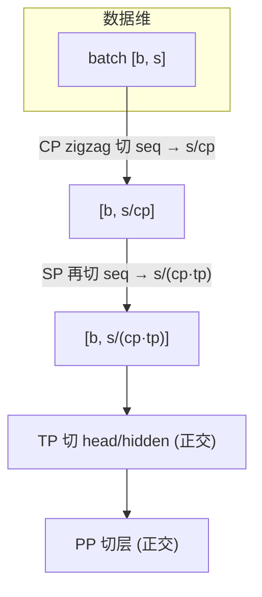

# 04 · Megatron 工程落地

前三篇讲的是算法，本篇把 ring、Ulysses 与 dynamic CP 接回真实的训练框架，逐行对应 Megatron-LM（pin 在 commit `e03878b5f`）的实现。回答四个工程问题：

1. batch 如何按 CP rank 切分（pretrain 的 zigzag、SFT 的 packed THD、hybrid CP 三条路径）；
2. CP process group 如何构造（常规、分层、hybrid 三类组）；
3. `cp_group` / `cp_comm_type` / `PackedSeqParams` 如何传给实际执行计算的 TransformerEngine；
4. dynamic CP 在 Megatron 里的形态（hybrid CP），以及与 SP/TP/PP 的协同。

一个容易忽视但很重要的事实先放在前面：Megatron core 自身并不实现 ring/a2a 的 attention 算子。native `DotProductAttention` 直接断言 `context_parallel_size == 1`（[[megatron-lm:megatron/core/transformer/dot_product_attention.py#L57]]），CP 的实际 attention 计算全部委托给 TransformerEngine 的 `DotProductAttention`。Megatron 负责的是围绕它的四件事：**切数据、建组、传参、调度**。本篇按这四件事组织。

---

## 1. batch 切分：三条路径

入口是 `get_batch_on_this_cp_rank`（[[megatron-lm:megatron/core/utils.py#L2369-L2417]]），它按 batch 里携带的元数据走三条路径：

```python
# utils.py:2404-2417（简化）
if batch.get("cu_seqlens") is not None:          # packed 序列（SFT 或 hybrid CP）
    if is_hybrid_cp:
        if batch['local_cp_size'].item() > 1:    # 本条样本需要多个 CP rank
            hybrid_cp_group = hybrid_cp_group_func(group_size=batch['local_cp_size'].item())
            batch = get_pretrain_batch_on_this_cp_rank(batch, cp_group=hybrid_cp_group)
            batch["hybrid_cp_group"] = hybrid_cp_group
    else:
        batch = get_sft_batch_on_this_cp_rank(batch, cp_group=cp_group)
else:                                            # 纯 pretrain
    batch = get_pretrain_batch_on_this_cp_rank(batch, cp_group=cp_group)
```

分支条件值得记住：`cu_seqlens` 是否存在区分 packed 与 pretrain；`is_hybrid_cp` 再区分 SFT 与 hybrid。hybrid 分支的关键是每条 sub-sample 自带一个 `local_cp_size`（这条序列实际要切到几张卡，由调度器决定，见第 7 节），运行时按它取出预建的对应大小的 CP 子组，再把该组写回 batch 供 attention 使用。

### 1.1 pretrain：zigzag 切分

`get_pretrain_batch_on_this_cp_rank`（[[megatron-lm:megatron/core/utils.py#L2308-L2366]]）就是 README 第 3 节介绍的 zigzag，完整实现只有几行：

```python
# utils.py:2352-2364
val = val.view(*val.shape[0:seq_dim], 2 * cp_size, val.shape[seq_dim] // (2 * cp_size), ...)
index = torch.zeros(2, dtype=torch.int64, device=val.device)
index[0].fill_(cp_rank)                            # 前半的第 r 块
index[1].fill_(2 * cp_size - cp_rank - 1)          # 后半的对称块
val = val.index_select(seq_dim, index)
val = val.view(*val.shape[0:seq_dim], -1, ...)
```

这段实现虽然短，有三个细节值得展开。

第一个细节写在 docstring 里（[[megatron-lm:megatron/core/utils.py#L2311-L2318]]），它把动机讲得很明白：causal mask 下越靠后的 chunk 计算量越大，所以把序列切成 $2\,\mathrm{cp}$ 块之后按 $(\mathrm{chunk}_r,\ \mathrm{chunk}_{2\mathrm{cp}-1-r})$ 配对，保证每个 rank 都拿到一轻一重两块，工作量大致拉平。

第二个细节是哪些字段会被切。`METADATA_KEYS`（`cu_seqlens`、`max_seqlen`、`local_cp_size`、`hybrid_cp_group` 等，[[megatron-lm:megatron/core/utils.py#L2340-L2346]]）是元数据，不做切分；而 **`position_ids` 不在元数据之列，会和 tokens 一起被 zigzag 切**。这一点很重要：它意味着 position 信息全程跟着 token 走，与第 5 节 RoPE 的切法天然一致，使用者不需要再手动对齐。

第三个细节是关于对齐的硬性要求：序列长度必须满足 `seq_length % (2 * cp_size) == 0`，断言在 `megatron/training/arguments.py:1286-1289`。另外注意 `attention_mask` 的 seq 维是 dim 2 而不是 dim 1（utils.py:2352），写类似切分代码时容易搞错。

### 1.2 SFT（packed THD）：逐 sub-sequence 均衡

packed 序列内含多条变长 sub-sequence（由 `cu_seqlens` 标出边界），不能对整条序列做 zigzag。`get_sft_batch_on_this_cp_rank`（[[megatron-lm:megatron/core/utils.py#L2256-L2305]]）把均衡逻辑委托给 TE：

```python
# utils.py:2293-2304
index = tex.thd_get_partitioned_indices(
    cu_seqlens_for_te, total_tokens, cp_size, cp_rank,
)
SEQUENCE_KEYS = ('tokens', 'labels', 'loss_mask', 'position_ids')
for key in SEQUENCE_KEYS:
    if batch.get(key) is not None:
        batch[key] = batch[key].index_select(1, index)
```

TE 的 `thd_get_partitioned_indices` 在每条 sub-sequence 内部计算负载均衡的 token 划分（等价于 per-sub-sequence 的 zigzag，与 03 篇 WLB-LLM 的 per-document sharding 思想一致），返回本 rank 的 token 下标；Megatron 只对四个 sequence 维字段做 `index_select`，元数据原样保留给 TE kernel 消费。注意 `total_tokens` 的取法（utils.py:2296-2297 的注释）：PP 中间 stage 没有 `tokens`，用 `labels` 的长度兜底——这是 CP×PP 兼容的第一处细节。

### 1.3 与 PP 的交互

CP 切分对 PP 中间 stage 是透明的：`get_batch_on_this_tp_rank` 会把中间 stage 的 `tokens/labels/loss_mask/position_ids` 置 None、只保留 THD 元数据（[[megatron-lm:megatron/core/utils.py#L2112-L2123]]）；两条切分路径的循环都对 `val is None` 直接跳过（[[megatron-lm:megatron/core/utils.py#L2338-L2351]] 的注释专门说明这一点）。入口侧，非 SFT 的中间 stage 在 `pretrain_gpt.py:91-92` 直接返回 None，根本不会走到 CP 切分。

## 2. CP process group 的构造

### 2.1 常规 CP 组：rank 顺序中的位置

`initialize_model_parallel` 的默认 rank 顺序是 `order="tp-cp-ep-dp-pp"`（[[megatron-lm:megatron/core/parallel_state.py#L561]]），`RankGenerator`（parallel_state.py:446-521）按此顺序做正交分解。**CP 紧邻 TP** 意味着同一 CP 组的 rank 是 TP 组之外最相邻的 rank——CP 通信（KV 传输或 a2a）因此落在机内高速链路上，这是 Megatron 对 CP 通信昂贵这一事实的默认应对。CP 组的创建在 [[megatron-lm:megatron/core/parallel_state.py#L953-L966]]，逐组调 `create_group`。

### 2.2 分层 CP 组：`hierarchical_context_parallel_sizes`

02 第 4 节讲的 `a2a+p2p` 分层 CP 依赖两级组。`hierarchical_context_parallel_sizes`（如 `[8, 2]`）先断言各层 size 乘积等于总 CP size（[[megatron-lm:megatron/core/parallel_state.py#L967-L980]]），再交给 `create_hierarchical_groups`（[[megatron-lm:megatron/core/parallel_state.py#L359-L418]]）建组。该函数用 einops rearrange `(l s u) -> (l u) s` 实现「内层连续、外层跨步」的层级结构，docstring（368-379）给了 16 GPU、`[2,2,4]` 的完整例子：level-1 是相邻 rank 组（NVLink 域，跑 a2a），更高层是跨步组（IB 域，跑 p2p ring）。

### 2.3 hybrid CP 组：预建 2 的幂子组

hybrid CP 需要「运行时按任意 2 的幂大小取子组」，组全部在初始化时预建（[[megatron-lm:megatron/core/parallel_state.py#L922-L932]] → `create_hybrid_dp_cp_groups`，[[megatron-lm:megatron/core/parallel_state.py#L421-L443]]）：

```python
# parallel_state.py:430-437
group_sizes = [2**i for i in range(int(log2(len(ranks))))][1:]   # 2, 4, ..., dp_cp_size/2
for group_size in group_sizes:
    for i in range(0, len(ranks), group_size):
        group = create_group(ranks[i : i + group_size], ...)
```

对每个 dp-cp 组建出所有 2 的幂大小的连续子组，返回 `{group_size: group}` 字典；`get_hybrid_data_context_parallel_groups`（[[megatron-lm:megatron/core/parallel_state.py#L1526-L1535]]）按 group_size 查表，等于整个 DP×CP 组时直接返回 `_DATA_PARALLEL_GROUP_WITH_CP`。这正是 03 篇 §5「通信组预建、运行时选用」原则在 Megatron 里的形态。

### 2.4 DP×CP 联合组：梯度规约域

CP 各 rank 持有同一份权重、处理同一样本的不同 token 段，权重梯度必须像 DP 一样求和。`get_data_parallel_group(with_context_parallel=True)`（[[megatron-lm:megatron/core/parallel_state.py#L1467-L1482]]）返回的就是 DP×CP 的正交并组（`get_ranks('dp-cp')` 生成）。从优化器视角看，CP 相当于把 DP 的「不同样本」换成「同一样本的不同 token 段」，因此 Megatron 中许多地方把 `dp_cp_group` 当作一个整体（如 [[megatron-lm:megatron/core/tensor_parallel/layers.py#L1119]] 的 `metadata['dp_cp_group']`）。这个组同时也是 hybrid CP 调度器眼中的「总 GPU 池」。

## 3. 向 TransformerEngine 传参

### 3.1 静态路径：`cp_group` + `cp_comm_type` + 独立 CUDA stream

`Attention.__init__` 收 `cp_comm_type` 并透传给 core attention builder（attention.py:290, 363-371）；`pg_collection` 必须含 `tp` 与 `cp`（断言在 attention.py:320-325）。逐层配置在 `transformer_layer.py:347-355`：`cp_comm_type` 为 list 时按 `layer_number - 1` 索引，允许前几层用 a2a、后几层用 p2p 分别调优。

真正的交接发生在 `TEDotProductAttention`（[[megatron-lm:megatron/core/extensions/transformer_engine.py#L1583-L1881]]）的 `__init__`（1669-1695）：

```python
# transformer_engine.py:1671-1681（简化）
if self.config.context_parallel_size > 1:
    if getattr(TEDotProductAttention, "cp_stream") is None:
        TEDotProductAttention.cp_stream = torch.cuda.Stream()   # 类级共享的独立 stream
    extra_kwargs["cp_group"] = pg_collection.cp
    extra_kwargs["cp_global_ranks"] = torch.distributed.get_process_group_ranks(pg_collection.cp)
    extra_kwargs["cp_stream"] = TEDotProductAttention.cp_stream
```

这段代码里有三个要点。其一，`cp_stream` 是 p2p ring 通信与 attention 计算 overlap 的关键：KV 的 P2P 收发都在这条独立的 stream 上异步进行——01 第 2 节讲的 overlap 机制，落到工程上就是它。其二，`cp_comm_type` 为 None 时 TE 默认使用 `"p2p"`；而 `"a2a+p2p"` 要求 TE ≥ 1.12，并且会把 `cp_group` 替换为 `get_hierarchical_context_parallel_groups()` 返回的两级组（transformer_engine.py:1690-1693）。其三，判断 CP 是否启用用的是 `config.context_parallel_size > 1`，而不是 group 是否非空——1669-1670 行的注释解释了原因：encoder 可以单独关掉 CP，此时 group 存在但不该启用。

### 3.2 动态路径：per-microbatch 切换 CP 组

hybrid/dynamic CP 下，每条 sub-sample 可以带着自己的 CP 组进来。`TEDotProductAttention.forward` 的开头（[[megatron-lm:megatron/core/extensions/transformer_engine.py#L1792-L1810]]）会逐 microbatch 覆盖 TE 的 CP 组：

```python
# transformer_engine.py:1794-1808（简化）
if packed_seq_params.cp_group is not None:
    self.cp_group = packed_seq_params.cp_group
    super().set_context_parallel_group(self.cp_group, get_process_group_ranks(self.cp_group),
                                       cp_stream, self.cp_comm_type)
elif packed_seq_params.local_cp_size is not None:
    assert packed_seq_params.local_cp_size == 1   # 无 cp_group 时只能是 1
    super().set_context_parallel_group(None, None, None, self.cp_comm_type)
```

把整条链路串起来看：调度器决定本条序列切到几张卡，把对应的预建组写进 `PackedSeqParams.cp_group`，forward 时 TE 的现场组随即被替换。值得注意的是，「调度器 → batch 元数据 → TE kernel」这条链路只通过 `PackedSeqParams` 这一个数据类发生耦合，各环节的改动互不外溢，这是 Megatron dynamic CP 设计里最干净的一笔。另外有一个 THD 相关的细节：packed 场景下 mask type 会被改写为 `padding_causal`（transformer_engine.py:1844-1851），因为 cuDNN kernel 要求 packed 输入走 padding 路径。

## 4. `PackedSeqParams`：变长场景的元信息载体

`PackedSeqParams`（[[megatron-lm:megatron/core/packed_seq_params.py]]）是给 TE attention 和 fused RoPE kernel 的 THD 参数包，字段（packed_seq_params.py:16-26）与含义：

| 字段 | 含义 |
|---|---|
| `qkv_format` | `'sbhd'` 或 `'thd'` |
| `cu_seqlens_q` / `cu_seqlens_kv` | packed batch 的累计长度边界（int32, `[b+1]`） |
| `cu_seqlens_*_padded` | 含 padding 的累计长度，CP 切分对齐用 |
| `max_seqlen_q` / `max_seqlen_kv` | pack 内最长 sub-sequence，TE 预分配 workspace 用 |
| `local_cp_size` | hybrid CP 本条序列实际使用的 CP 度数 |
| `cp_group` | dynamic/hybrid CP 组，逐 microbatch 覆盖 TE 的 CP 组（第 3.2 节） |
| `seq_idx` | `__post_init__` 由 `cu_seqlens` 预计算的逐 token 序列 id |

有一个 CP 特有的坑写在 `__post_init__` 的注释里（[[megatron-lm:megatron/core/packed_seq_params.py#L52-L58]]）：CP 切分后 `cu_seqlens_padded` 可能非严格单调（相邻 sub-sequence 的 padded 边界在本 rank 上重合），`diff` 会出现负值，所以生成 `seq_idx` 时必须 `clamp(min=0)`。调试 packed + CP 的 position 问题时，这是第一个要检查的地方。

## 5. RoPE 在 zigzag 切分下的对齐

CP 切分后 rank 持有的 token 不连续，而 rotary embedding 依赖绝对 position，因此 position embedding 必须用与 batch 完全相同的 zigzag 切法来切。`get_pos_emb_on_this_cp_rank`（[[megatron-lm:megatron/core/models/common/embeddings/rope_utils.py#L48-L70]]）与第 1.1 节的 batch 切分逐行同构：

```python
# rope_utils.py:62-69
cp_idx = torch.tensor([cp_rank, (2 * cp_size - cp_rank - 1)], ...)
pos_emb = pos_emb.view(*pre, 2 * cp_size, -1, *post)
pos_emb = pos_emb.index_select(seq_dim, cp_idx)
```

调用点在 `RotaryEmbedding.forward`（rotary_pos_embedding.py:204，注意条件是 `not packed_seq`——packed 场景不走这里）。THD packed 走另一路：`_apply_rotary_pos_emb_thd`（rope_utils.py:189-265）按 `seqlens // cp_size` 逐条拆分 sub-sequence，对每条调 `_get_thd_freqs_on_this_cp_rank`（rope_utils.py:140-186）——它对本 rank 持有的前半段 `freqs[cp_rank*seg : ...]` 和镜像后半段 `freqs[full-(cp_rank+1)*seg : ...]` 各取一段再 cat，这正是 zigzag 在 freqs 上的体现。fused kernel 路径则把 `cp_size`/`cp_rank` 直接传给 TE 的 `fused_apply_rotary_pos_emb_thd`（rope_utils.py:315-322）。

**如果 token 切分与 RoPE 切分用了不同的规则（例如一个 zigzag、一个连续），loss 会悄悄算错而不报任何错**——这是 CP 实现中最经典的一类 bug，检查清单第 1 条就是为它准备的。

## 6. `cp_comm_type`：四种通信模式的语义

`cp_comm_type`（[[megatron-lm:megatron/core/transformer/transformer_config.py#L891-L905]]）的注释是四种模式的官方语义，与 01/02 的算法分析一一对应：

| 值 | 语义（注释原文要点） | 对应算法 |
|---|---|---|
| `"p2p"` | ring 拓扑交换 KV chunk；P2P 是 async 的，可以 overlap | Ring（01） |
| `"all_gather"` | attention 前 all-gather 出完整 KV；不 async，不能 overlap | 最简实现，显存代价最高 |
| `"a2a"` | 类 DeepSpeed-Ulysses，head 散布到 CP group，gather 完整 QKV | Ulysses（02） |
| `"a2a+p2p"` | 分层实现：低层 CP 组内 a2a（NVLink），高层组间 p2p（IB） | 分层 CP（02 §4） |

list 形式的长度必须等于 `num_layers`（校验在 transformer_config.py:2500-2509）；选择 `a2a+p2p` 时必须同时给出 `--hierarchical-context-parallel-sizes`（arguments.py:578-583）。

这里还有一个容易望文生义的地方值得澄清。Megatron 自己有一个 `_AllToAll` 原语（[[megatron-lm:megatron/core/tensor_parallel/mappings.py#L420-L480]]，它的 backward 是 split 互换后的另一次 a2a），但**它并不服务于 LLM attention 的 CP 路径**——`cp_comm_type="a2a"` 完全在 TE 内部实现，Megatron 只负责把字符串和 group 传下去。Megatron 这个 `_AllToAll` 的真实用户是 MoE 的 token dispatcher，以及 Mamba/SSM 的 CP（`mamba_context_parallel.py` 里 Ulysses 式的 seq↔hidden 换维）。读代码时不要被名字误导。

## 7. Hybrid CP：dynamic CP 的 Megatron 形态

03 篇 §5.2 介绍了 NVIDIA Dynamic-CP 的调度思想，它在 Megatron 里的对应实现就是 hybrid CP，代码分布在 `megatron/core/pipeline_parallel/hybrid_cp_schedule.py` 和 `megatron/core/datasets/data_schedule.py` 两个文件里。两者的关系值得先交代清楚：hybrid CP 的调度粒度是 per-sub-sample，即每条序列各自决定一个 CP size，求解用轻量启发式；NVIDIA 博客里的 Dynamic-CP 则是 per-microbatch 粒度，用 cost model 加 simulator 更精细地处理 PP 气泡。粒度不同，但共享的骨架完全一致——**预建 2 的幂子组（第 2.3 节），由调度器写入 `local_cp_size` 与 `cp_group`，TE 逐 microbatch 换组（第 3.2 节）**。本节的三个小节分别对应这条链路上的调度、数据搬运和训练循环。

### 7.1 `BalancedCPScheduler`：调度算法

调度器 `BalancedCPScheduler`（[[megatron-lm:megatron/core/pipeline_parallel/hybrid_cp_schedule.py#L14-L474]]）由几个核心函数组成，逐个来看。

`get_total_workload`（27-41）负责估算一条序列的代价，公式就是 $\mathrm{seq\_length}^2\,/\,\mathrm{cp\_size}$——这正是 03 篇 §1.2 那个「attention 二次项按 CP 均摊」的模型，代码注释里也明确说了这不是一个精确的 FLOPs 计算器，只是调度用的 proxy。

`gpus_needed`（43-53）回答「这条序列需要切到几张卡」：$\max\big(1,\ 2^{\lceil \log_2(\mathrm{seq\_len}\,/\,\mathrm{max\_seq\_len\_per\_rank})\rceil}\big)$。其中 `max_seqlen_per_dp_cp_rank` 是配置项，表示每 rank 最多能消化的序列长度；算出的 CP 度数向上取 2 的幂，以便对齐预建好的通信子组。

`make_buckets_equal`（55-102）按 `gpus_needed` 的取值把序列分桶：有几种取值就开几个 bucket，每个 bucket 的目标工作量定为总工作量除以桶数，然后顺序扫描序列，超过目标的 1.1 倍就关闭当前桶、开下一个。

`next_hdp_group`（104-454）是主循环，它的 docstring（113-132）把流程写成了五步：先分桶；然后每条序列优先放进已有的同 size 组（选当前负载最低的那个），放不下才开新组；确定组之后，把序列派给组内所有 GPU 并累加各自的估算负载；当 CP size 降档、且各 GPU 负载满足 `max-min ≤ 5%·max` 时提前收工；最后还有两个修补步骤——`trim_overload` 反向摘除最近放入的序列以减少 slack，`fill_empty_gpus` 把空闲的 GPU 并入已有小组（GPU 必须连续分配）。值得一提的是 263-278 行有一大段 TODO 注释，作者坦承降 CP size 时的均衡检查仍不完善——这也提醒我们，这个调度器是启发式而不是最优解。

最外层的 `get_groups_and_subsamples`（456-474）先把所有序列按长度降序排序，然后循环调用 `next_hdp_group` 直到分完为止。

### 7.2 数据侧与训练循环

调度结果要变成各 rank 手里的数据，靠的是 `HybridCPDataLoaderWrapper`（`megatron/core/datasets/data_schedule.py`，scheduler 在 45-47 行实例化，`__next__` 在 267-301 行）。它每走一步做三件事：先 all-gather 收集各 DP rank 的 sub-sample 长度，然后跑一遍调度，最后用 `all_to_all_single` 把 sub-sample 重路由到目标 DP×CP rank（`reroute_samples_to_hdp_ranks`，136-243）。这里有个省通信的细节写在 144-146 行的注释里：同一个 DP 组内的各 CP rank 数据本来就相同，所以重路由只需要在对应的 CP rank 之间传一份，不必全量交换。

训练循环是 `hybrid_context_parallel_forward_backward`（[[megatron-lm:megatron/core/pipeline_parallel/hybrid_cp_schedule.py#L477-L660]]，`schedules.py:722-739` 在 no-pipelining 路径下按 `config.hybrid_context_parallel` 分发到它）。它的结构是：每个 group 内逐 sub-sample 做 forward/backward，group 结束时在 DP×CP 组上做一次 barrier。这个 barrier 不是可有可无的——docstring（494-509）专门给了一个不加 barrier 会死锁的例子：CP6 的组占 GPU 0-5、CP2 的组占 GPU 6-7，此时若再来一个 CP4 的组需要 GPU 4-7，GPU 6-7 会先完成自己的任务并提前进入下一个组的集合通信，从而与 GPU 4-5 永久错开。异构组并发执行时的这类同步问题，与 03 篇 FlexSP 做 time-balanced assignment 要解决的问题，其实是同一件事的两个侧面。最后，`_get_new_data_iterator`（539-550）把「有多少个 rank 共享这条序列」写进 `sample["local_cp_size"]`，供第 1 节的 batch 切分消费——调度器和切分逻辑之间就靠这个字段衔接。

### 7.3 使用约束

hybrid CP 目前的限制全部以断言形式列在 `megatron/training/arguments.py:1389-1394`：不支持 PP、不支持 CUDA graph、不支持 Megatron FSDP，要求 `dataloader_type='single'` 和 `calculate_per_token_loss`。另外 MLA 尚不支持 hybrid CP（`megatron/core/transformer/multi_latent_attention.py:677-678`）。

## 8. 与 SP / TP / PP 的协同



| 耦合 | 要点 | 代码 |
|---|---|---|
| **CP × SP** | 都切 seq。padding 对齐 `tp·cp·2`（`*2` 给 zigzag）；只有 CP 无 SP 时对齐 `cp·2` | [[megatron-lm:megatron/core/models/multimodal/context_parallel.py#L53-L62]] |
| **CP × DP** | 权重梯度在 `dp-cp` 并组上 all-reduce | [[megatron-lm:megatron/core/parallel_state.py#L1467-L1482]] |
| **CP × TP** | 正交（CP 切 seq，TP 切 head）。但 Ulysses 的 a2a 也按 head 切，与 TP 共同消耗 head 数：`cp ≤ heads/tp` 且整除 | 02 第 3 节 |
| **CP × PP** | 中间 stage 的 batch 非 metadata 字段为 None，CP 切分自动跳过 | [[megatron-lm:megatron/core/utils.py#L2338-L2351]] |

多模态场景的另一个细节：CP > 1 且有 padding（或 packed）时，`get_packed_seq_params` 要求给出 `cu_seqlens_*_padded` 并把 `qkv_format` 改为 `'thd'`（[[megatron-lm:megatron/core/models/multimodal/context_parallel.py#L96-L106]]，注释说明 CP with padding mask 必须走 THD）。

## 9. 工程检查清单

手写或调试 CP 相关代码时，按下面的清单逐项检查：

1. token 切分与 RoPE 切分必须使用同一套 zigzag（第 1.1 与第 5 节）；`position_ids` 会随 tokens 一起被切，不要重复手动切。
2. mask 要按真实 position 计算：zigzag 后 rank 持有不连续的 token，ring 每一步收到 KV 块时的 causal mask 取决于源块的真实 position 区间（01 第 3 节）。
3. padding 对齐 `tp·cp·2`（第 8 节）；pretrain 场景断言 `seq_length % (2·cp) == 0`。
4. 梯度规约域是 `dp-cp` 并组，不要只在 dp 上做 all-reduce。
5. 使用 Ulysses 时检查 `cp ≤ num_heads/tp` 且整除；不满足时改用 ring 或分层方案。
6. packed + CP 下调试 position 问题，先查 `PackedSeqParams.__post_init__` 的 clamp 与 `cu_seqlens_padded` 的单调性（第 4 节）。
7. hybrid CP 下确认 `local_cp_size` 对应的组已预建（2 的幂），且训练循环在 group 间有 barrier（第 7.2 节的死锁例子）。

---

## 参考文献

- Megatron-LM CP 实现（commit `e03878b5f`）：[[megatron-lm:megatron/core/utils.py#L2256-L2417]]、[[megatron-lm:megatron/core/pipeline_parallel/hybrid_cp_schedule.py]]、[[megatron-lm:megatron/core/parallel_state.py#L359-L443]]、[[megatron-lm:megatron/core/extensions/transformer_engine.py#L1583-L1881]]、[[megatron-lm:megatron/core/models/common/embeddings/rope_utils.py#L48-L265]]。
- TransformerEngine `DotProductAttention`：ring / a2a / 分层 CP kernel 的真正实现。
- 算法见 [01](./01_ring_attention.md) / [02](./02_ulysses_a2a.md)，dynamic CP 的工作谱系见 [03](./03_dynamic_cp.md)。

把算法、工作谱系和工程实现都过了一遍之后，最好的检验方式是自己动手：完成 [[atlas:docs/parallel/04_cp/cp_lab.ipynb|CP lab]]，手写 ring attention（online softmax + 真实 P2P）与 Ulysses（all-to-all）两条路径，逐元素对齐 full attention，并跑通 zigzag 负载均衡切分。
