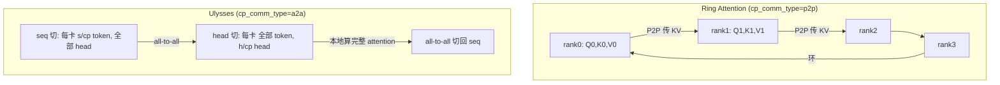
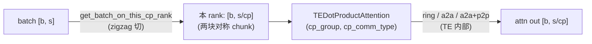

# Context Parallelism (CP)

本章讨论 Context Parallelism（CP）：当序列长度增长到单卡无法容纳时，如何把 sequence 维切到多张卡上，并保证 attention 在序列被切开的情况下仍然算对、通信与计算能够 overlap。本文先介绍 Ring 与 Ulysses 两大算法家族；之后的 01/02 两篇分别深入两者，03 以负载均衡为线索调研长上下文训练（变长序列）下的一批工作，04 落到 Megatron 的工程实现；算法依赖的定义与公式会在正文中完整给出。

## 前置知识

- 熟悉 self-attention 的 Q/K/V 计算与 softmax；可先读 [Attention 基础](../../attention/00_attention_basics.md)。
- 了解 TP 的基本通信方式，见 [Tensor Parallelism (TP) 与 Sequence Parallelism (SP)](../02_tp_sp/README.md)。

---

## 1. 为什么需要 CP

TP 切 hidden、PP 切层、DP 切 batch，但三者都没有切 sequence。当 context 从 4K 增长到 128K 甚至 1M 时，会出现两个问题：

- **activation 显存随 $s$ 线性增长**：每层要保存 $[s, b, h]$ 的若干份激活，$s$ 大到一定程度后单卡放不下。SP 能把它降到 $1/\mathrm{TP}$，但 TP 通常只有 8，并不够。
- **attention 的算力和显存随 $s^2$ 增长**：$QK^{\top}$ 是 $[s, s]$，FlashAttention 把显存压到 $O(s)$，但算力仍是 $O(s^2)$。单卡计算 1M token 的 attention 既慢，中间量也可能放不下。

CP 的思路是把 sequence 维 $s$ 切到 $\mathrm{cp}$ 张卡，每卡只持有 $s/\mathrm{cp}$ 个 token 的 Q/K/V 和激活。难点在于 attention 是全局的：第 `i` 个 token 要 attend 到所有 `≤ i` 的 token（causal），而那些 token 的 K/V 分散在其它卡上。因此 CP 的全部工程设计都在回答同一个问题：

> 序列被切开后，如何让每个 query 拿到它需要的所有 KV，同时不把通信变成瓶颈、不让显存退回 $O(s^2)$？

Ring 与 Ulysses 给出了两种不同的答案。

## 2. Ring 与 Ulysses 两种算法



| 维度 | **Ring** (`p2p`) | **Ulysses** (`a2a`) |
|---|---|---|
| 核心操作 | KV chunk 沿环 P2P 传递，每步算一块 attention，online softmax 累加 | 两次 all-to-all：把「seq 切」转成「head 切」，本地算完整 attention，再切回 |
| 通信量/卡 | $O(s/\mathrm{cp} \cdot \mathrm{cp}) = O(s)$（每卡转一圈 KV），但可与 compute overlap | $O(s \cdot h/\mathrm{cp})$（两次 a2a），不可 overlap，但延迟低、次数少 |
| 通信模式 | P2P（ring），async，**能藏进 attention 计算** | all-to-all，集合通信，同步 |
| head 数约束 | 无 | **CP ≤ num_heads**（要按 head 切，且要整除）|
| 计算复杂度 | 全 flash-attention，$O(s^2/\mathrm{cp})$ /卡 | 本地完整 attention $O(s^2)$/卡（但只在 $h/\mathrm{cp}$ 个 head 上）|
| 适合 | 超长序列、CP 很大、跨机 | 中等序列、CP ≤ heads、对延迟敏感 |
| 论文 | Ring Attention [arXiv:2310.01889](https://arxiv.org/abs/2310.01889) | DeepSpeed-Ulysses [arXiv:2309.14509](https://arxiv.org/abs/2309.14509) |

一句话概括：Ring 搬动 KV、保留 head（适合任意 head 数和超长序列）；Ulysses 搬动 head、保留完整 KV（实现简单、延迟低，但 CP 不能超过 head 数）。Megatron 还提供 `a2a+p2p` 分层模式：node 内用 a2a（NVLink 带宽高），node 间用 p2p ring（跨 IB），兼顾两者长处（详见 02 第 4 节）。

两种算法的原始示意图放在一起看最为直观：


> 图（Ring）：每个 host 固定持有自己那块 query，KV 块沿主机环逐跳传递；每收到一块就用 blockwise/online-softmax 累加一次 attention，转一圈即见过全部 KV。通信（KV P2P）与计算（blockwise attention）天然重叠。（Liu et al. 2023, Fig 2；[arXiv:2310.01889](https://arxiv.org/abs/2310.01889)）


> 图（Ulysses）：QKV projection 阶段按 sequence 切（每卡 $s/\mathrm{cp}$ token、全部 head）；进 attention core 前用 all-to-all 转成按 head 切（每卡全部 token、$h/\mathrm{cp}$ head），本地算完整序列的 attention，再用一次 all-to-all 切回 sequence。两次 a2a 是分布式转置，全程每卡只持 $1/\mathrm{cp}$ 数据、不复制。（Jacobs et al. 2023, Fig 2；[arXiv:2309.14509](https://arxiv.org/abs/2309.14509)）

## 3. causal mask 下的负载均衡（zigzag）

Megatron 的 `get_pretrain_batch_on_this_cp_rank`（[[megatron-lm:megatron/core/utils.py#L2308]]）把序列切成 $2\mathrm{cp}$ 个 chunk，每个 rank 取一前一后两块：

```python
# 把 seq 维 reshape 成 [2*cp, s/(2*cp)]，rank r 取 chunk[r] 和 chunk[2*cp-1-r]
index[0] = cp_rank                 # 前半的第 r 块
index[1] = 2 * cp_size - cp_rank - 1   # 后半的对称块
val = val.index_select(seq_dim, index)
```

以 CP=2 为例（注释见 [[megatron-lm:megatron/core/utils.py#L2317]]）：4 个 chunk 分配为 `(chunk0, chunk3) → GPU0`、`(chunk1, chunk2) → GPU1`。这样每个 rank 都同时持有「轻」块和「重」块，工作量大致相等。这就是文献中的 zigzag / load-balanced CP（Striped Attention 是另一种等价思路，[arXiv:2311.09431](https://arxiv.org/abs/2311.09431)）。

> zigzag 是「按 seq 切」的 CP（ring 家族）特有的修正：causal 下每个 chunk 的计算量跟它在序列中的位置挂钩，一前一后配对才能拉平。Ulysses 按 head 切，各 rank 拿到的是完全同构的一份工作量，天然均衡，不需要这类修正（详见 02 第 3 节）。另外 zigzag 的配对成立有一个前提——切分对象是一条完整的 causal 序列；packed 序列里装着多条文档时，对整条做一次 zigzag 并不能保证每条文档内部均衡，这是 03 篇反复出现的出发点。

> 需要特别注意：CP 下 rank r 持有的 token 不是连续的一段，而是两块对称的 chunk。这会影响 RoPE 的 position id 计算、loss mask，以及与 PP/SP 切分的协调（详见 04）。

## 4. sequence packing：变长数据怎么进模型

01 到 03 会反复用到 sequence packing 这个概念，它是现代训练组织数据的基本事实，先在这里讲清楚，后面长文负载均衡的讨论才不会悬空。

真实语料的序列长度是长尾分布的（具体数字见 03 篇 §1.1）。最朴素的对齐方式是按 batch 内最长序列 padding：99% 短于 4K 的语料里混进一条 300K，整个 batch 都得按 300K 做 attention，算力大量烧在 pad token 上。sequence packing 的做法是把多条文档首尾相接，填满一条定长序列，padding 降到接近零。但拼接本身破坏了两个不变量，必须配套修复：

1. **attention 不能跨文档**：mask 从整条序列的下三角变成 block-diagonal，每条文档只在自己内部做 causal attention；
2. **position id 逐文档重计**：每条文档从 0 重新计数，否则 RoPE 会把拼接位置当成真实的远距离依赖。

Megatron 里先后有两代做法，刚好对应两种数据布局：

- **BSHD 路径（pretrain 默认）**：GPT 数据集本来就把多条文档拼满 `seq_length`，文档边界由 eod token 标出；打开 `--reset-attention-mask` / `--reset-position-ids`（[[megatron-lm:megatron/training/arguments.py#L2945-L2950]]）后，dataloader 在 eod 处重置 attention mask 与 position id（`get_ltor_masks_and_position_ids`，[[megatron-lm:megatron/training/utils/common_utils.py#L337]]）。数据保持 `[b, s]` 的稠密布局，mask 是显式构造的。
- **THD 路径（SFT 与长上下文）**：变长序列直接拼成一条 token 流，batch 维塌成 `total_tokens`，用 `cu_seqlens` 记录每条 sub-sequence 的边界，交给 TE / FlashAttention 的 varlen kernel——block-diagonal mask 不再显式物化，而由边界信息在 kernel 内隐式实现。THD 布局与 `PackedSeqParams` 的细节见 [TP/SP 章](../02_tp_sp/README.md) 对 packed 格式的说明；Megatron 的 SFT dataset 就走这条路：逐条 conversation pack 进同一序列、position 逐条重计，并断言不再使用 `reset_position_ids`（[[megatron-lm:megatron/training/datasets/sft_dataset.py#L124]]）。

所以「packing 是不是现在 Megatron 训练的标准做法」的答案是肯定的，而且从来都是：pretrain 从 GPT 时代起就是「拼满定长序列、在 eod 处 reset mask」，SFT 与长上下文场景则换成了更彻底的 THD varlen 形态，03 篇会看到的 Megatron-LM Dynamic CP 同样以 packed THD 为前提。真正新的问题不在 packing 本身，而在 **packed 之后 CP 怎么切**：zigzag（§3）假设切分对象是一条从头到尾的 causal 序列，packed 序列里却装着多条文档；而且一条 packed 序列的 attention 工作量正比于各文档长度的平方和 $\sum_j \ell_j^2$，而不是 $(\sum_j \ell_j)^2$——「等 token 数」不再等于「等计算量」。这两个张力正是 03 篇长文负载均衡的全部出发点。

## 5. Megatron 的 CP 集成

有一个容易忽视但很重要的事实：Megatron core 自身并不实现 ring/a2a attention kernel。`DotProductAttention`（native）直接断言 `context_parallel_size == 1`（[[megatron-lm:megatron/core/transformer/dot_product_attention.py#L57]]），CP 的实际 attention 计算由 TransformerEngine 的 `TEDotProductAttention` 完成（其内部实现了 ring / a2a / 分层三种方式）。Megatron 负责的是以下五件事：

1. **切分**：`get_batch_on_this_cp_rank` 把 batch 按 zigzag 切到各 CP rank（[[megatron-lm:megatron/core/utils.py#L2369]]）。
2. **传参**：通过 `pg_collection.cp`（[[megatron-lm:megatron/core/transformer/attention.py#L1237]]）把 `cp_group` 和 `cp_comm_type` 传给 TE；变长/packed 场景使用 `PackedSeqParams`（携带 `cu_seqlens`、`cp_group`）。
3. **配置**：`cp_comm_type`（[[megatron-lm:megatron/core/transformer/transformer_config.py#L891]]）选择 p2p / all_gather / a2a / a2a+p2p，可以逐层取不同值。
4. **group 构造**：[[megatron-lm:megatron/core/parallel_state.py#L553]] 建立 CP group；`hierarchical_context_parallel_sizes` 建立分层 CP 的子 group。
5. **RoPE / position**：由于 token 不连续，rotary embedding 要按 zigzag 后的真实 position 计算（`rope_utils.py` 中有 CP 分支）。



## 6. CP 在整个并行体系里的位置

```
world = DP × CP × TP × PP
```

有几个耦合点需要记住（04 会逐一展开）：

- **CP 与 DP 共享梯度规约域**：参数梯度在 `data_parallel_group(with_context_parallel=True)` 上 all-reduce（`parallel_state.py:914, 1467`）。因为 CP 各 rank 持有同一份权重、处理同一个样本的不同 token 段，它们的权重梯度要像 DP 一样求和。也就是说，CP 在梯度同步上的行为与 DP 一致，但在 forward 上切的是 sequence。
- **CP 与 SP 都切 sequence**：SP 在 TP 区外切 seq（$s/\mathrm{TP}$），CP 也切 seq（$s/\mathrm{CP}$）。两者叠加时 token 被切成 $s/(\mathrm{TP}\cdot\mathrm{CP})$，padding 要对齐到 `tp·cp·2`（[[megatron-lm:megatron/core/models/multimodal/context_parallel.py#L55]]，其中 `*2` 是为 zigzag 预留的）。
- **CP 与 TP 正交**：TP 切 head/hidden，CP 切 seq，两者可以同时开启。需要注意的是，Ulysses 的 a2a 同样按 head 切，会与 TP 的 head 切分共同消耗可用的 head 数（02 第 3 节）。
- **CP 与 PP**：PP 切层，中间 stage 的 batch 里非 metadata 字段为 None，CP 切分会自动跳过（[[megatron-lm:megatron/core/utils.py#L2350]]）。

## 7. 贯穿全文的数值示例

```
s = 128K            sequence length
h = 8192, heads=64, head_dim=128
cp = 8              context parallel size
b = 1
```

- 每卡持有 `s/cp = 16K` 个 token 的 Q/K/V。
- Ring：每卡的 KV chunk 为 `[16K, 64, 128]` bf16，约 256 MB（K+V），沿环传 `cp-1=7` 步，每一步与上一步的 attention compute overlap。
- Ulysses：a2a 把 `[16K, 64, 128]` 重排成 `[128K, 8, 128]`（每卡 8 个 head 的全序列），本地在 8 个 head 上计算 `128K²` 规模的 flash-attention。约束 CP=8 ≤ heads=64 满足。
- zigzag：每卡持有的不是连续的 16K，而是 chunk `r` 和 chunk `15-r`（共 `2*cp=16` 块，每块 8K）。

---

## 章节导览

| 文件 | 内容 | 对应代码 / 论文 |
|---|---|---|
| `README.md`（本文） | 为什么需要 CP、两大家族（Ring vs Ulysses）总览、zigzag 负载均衡、sequence packing 与变长数据的组织、Megatron 的接入方式、与 TP/SP/DP/PP 的耦合 | `utils.py`, `transformer_config.py` |
| [01 · Ring Attention](./01_ring_attention.md) | Ring Attention 深入：blockwise online softmax、KV 沿环 P2P、causal 负载不均与 zigzag/striped 修正、通信-计算 overlap、显存分析 | Ring Attention / Blockwise / Striped 论文 |
| [02 · DeepSpeed-Ulysses](./02_ulysses_a2a.md) | DeepSpeed-Ulysses：用 all-to-all 在 sequence 切分与 head 切分之间转换、复杂度对比、head 数约束、`a2a+p2p` 分层 CP | Ulysses 论文，`mappings.py::_AllToAll` |
| [03 · 长文负载均衡](./03_long_ctx_load_balance.md) | 长上下文训练的负载均衡：不均衡的三个维度（CP group 内 / CP group 间 / PP 维）、代价模型与 packing 的 Σℓ² 效应、按维度归类的七个工作（Libra、Skrull、WLB-LLM、FlexSP、Megatron-LM Dynamic CP、DCP、ChunkFlow），Ulysses 按 head 切的均衡优势与 ring 的 zigzag 家族 | 七篇论文/博客的算法与伪代码 |
| [04 · Megatron-LM 实现](./04_megatron_cp_integration.md) | Megatron 工程落地：`get_batch_on_this_cp_rank` 三条切分路径、CP group 构造（常规/分层/hybrid）、TE 传参与 per-microbatch 换组、RoPE 的 CP 处理、hybrid CP 调度器、与 SP/TP/PP 的协同 | [[megatron-lm:megatron/core/utils.py#L2308]], `attention.py`, `hybrid_cp_schedule.py` |
| [[atlas:docs/parallel/04_cp/cp_lab.ipynb]] | 纯 torch 手写 ring attention（online softmax + 真实 P2P）和 Ulysses（all-to-all）两条路径，CPU/gloo 本地多进程，逐元素对齐 full attention，并演示 zigzag 负载均衡 | —— |

建议按顺序阅读：本文先建立整体图景，01 深入 ring 这条路径（CP 的算法核心），02 介绍实现更直接的 Ulysses，03 跳出单一算法、以负载均衡的维度为线索调研长上下文训练的一批工作，04 落到 Megatron 的工程细节（含 dynamic CP 的代码对应），最后通过 lab 亲手实现两条路径。

## 参考代码

参考代码：[[megatron-lm:]]：

- [[megatron-lm:megatron/core/utils.py#L2308]] —— `get_pretrain_batch_on_this_cp_rank`：CP 的 zigzag 负载均衡切分
- [[megatron-lm:megatron/core/transformer/transformer_config.py#L891]] —— `cp_comm_type`（p2p / all_gather / a2a / a2a+p2p）
- [[megatron-lm:megatron/core/transformer/dot_product_attention.py#L57]] —— native attention 断言 `CP==1`：CP 的 ring/a2a 实现下沉到 TransformerEngine
- [[megatron-lm:megatron/core/transformer/attention.py#L1237]] —— `cp_group=self.pg_collection.cp` 传给 TE attention
- [[megatron-lm:megatron/core/packed_seq_params.py]] —— `PackedSeqParams` 携带 `cp_group` / `cu_seqlens`
- [[megatron-lm:megatron/core/pipeline_parallel/hybrid_cp_schedule.py]] —— 变长序列的 balanced/dynamic CP 调度
- [[megatron-lm:megatron/core/parallel_state.py#L553]] —— CP group 与 `hierarchical_context_parallel_sizes`

---

讲完这些背景，接下来自然要深入 Ring 这条作为 CP 算法核心的路径：下一篇[01 · Ring Attention](./01_ring_attention.md)会把 online softmax 的累加过程、KV 的环形 P2P、causal 负载均衡和通信-计算 overlap 一次讲清楚。
