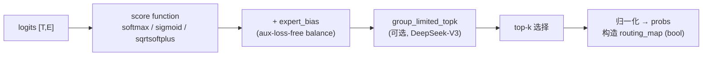

# 01 · Router 与 Dispatch 前的 Preprocess

> 本篇承接上一篇的全景介绍，展开 forward 通路的第一段：从 `hidden_states` 到 `routing_map` / `probs`，再到 dispatch 所需的全部 metadata（`input_splits` / `output_splits` / `tokens_per_expert`）。这一段几乎全部是本地计算加上少量小张量的 D2H 拷贝，没有大张量通信，但它决定了后面 all-to-all 的所有 shape，也藏着 MoE 训练中最隐蔽的性能问题——CPU-GPU 同步点。
>
> 代码锚点：`router.py`、`moe_utils.py`、`token_dispatcher.py::preprocess`。

---

## 1. Router 的两步：gating 与 routing

`TopKRouter`（[[megatron-lm:megatron/core/transformer/moe/router.py#L138]]）的 docstring 对命名约定有清楚的说明，这里先列出来，全文沿用：

```
logits      router gating 网络的原始输出          [T, E]
scores      过 score function 后、用于选 expert 和算 aux loss 的分数   [T, E]
probs       top-k 权重，用于 combine 时加权求和      [T, E] (稀疏) 或 [T, topk]
routing_map token↔expert 的 bool mask              [T, E]
```

其中 $T =$ `num_tokens`（$= S/\mathrm{TP} \times B$），$E =$ `num_moe_experts`。

### 1.1 gating：一个 fp32 的小 linear

`Router.gating`（[[megatron-lm:megatron/core/transformer/moe/router.py#L86-L108]]）：

```python
logits = router_gating_linear(input, self.weight, self.bias, router_dtype)
```

infra 上值得注意的三点：

1. **router 权重是 fp32**（[[megatron-lm:megatron/core/transformer/moe/router.py#L60-L62]]，`weight`: $[E, H]$）。即使模型主体使用 bf16，gating 也强制走高精度，因为 top-k 的边界对噪声极其敏感——两个 logits 差几个 ULP 就可能换一个 expert，进而改变整个 dispatch 的 layout。`moe_router_dtype` 可设 `fp32`/`fp64`（[[megatron-lm:megatron/core/transformer/moe/router.py#L103-L106]]）。
2. `router_gating_linear`（[[megatron-lm:megatron/core/transformer/moe/moe_utils.py#L1320]]）背后是自定义 autograd `RouterGatingLinearFunction`（[[megatron-lm:megatron/core/transformer/moe/moe_utils.py#L1237]]），其目的是在 forward 中用 fp32 计算 matmul，同时避免把 fp32 中间激活长期保留在显存里，backward 时再重算或转换，以节省显存。
3. gating 没有 TP 切分——`weight` 以 $[E, H]$ 的形式完整复制在每个 rank 上，因为 $E$ 不大（几百量级），而各 rank 本来就持有完整 hidden 维的输入，logits 在本地即可算全。

### 1.2 routing：score function、top-k 与负载均衡


> 图：MoE routing 的经典示意（Switch Transformer）。router 对每个 token 算一组 gate 分数，把 token 送到得分最高的 expert FFN（Switch 是 top-1，DeepSeek 等是 top-k）。下面的 `routing_map` / `probs` 正是这张图里「哪个 token 去哪些 expert、各占多少权重」的张量化表示。（Fedus et al. 2021, Fig 2；[arXiv:2101.03961](https://arxiv.org/abs/2101.03961)）

核心是 `topk_routing_with_score_function`（[[megatron-lm:megatron/core/transformer/moe/moe_utils.py#L672]]），可以拆成四步：



先明确输入输出的 shape 和语义，再逐步展开。`logits` $[T, E]$ 是上一步 gating 的输出——**第 $t$ 行第 $e$ 列是 token $t$ 对 expert $e$ 的原始打分**，未经任何归一化。routing 要从这个 $[T, E]$ 矩阵产出两样东西：

- `routing_map` $[T, E]$ bool —— 每行恰好 `topk` 个 True，标记 token 选了哪几个 expert（**离散选择**，不可导）。
- `probs` $[T, E]$ 稀疏 —— 被选中位置上是归一化后的权重，combine 时加权求和用（**连续权重**，可导）。

中间量 `scores = score_function(logits)`，**选 expert 和算 aux loss 都基于它**。三个 score function 的本质差异在于「沿哪个维度归一化」：

```python
# topk_routing_with_score_function, moe_utils.py:793-818（精简）
if score_function == "softmax":
    if use_pre_softmax:                       # 先归一化、再选
        scores = softmax(logits, dim=-1)      # 沿 E 维：E 个 expert 争一个 token，每行和=1
        probs, idx = topk(scores, topk, dim=1)
    else:                                     # 先选、再归一化（默认）
        scores, idx = topk(logits, topk, dim=1)   # 直接在原始 logits 上选 top-k
        probs = softmax(scores, dim=-1)       # 只对选中的 k 个分数归一化 → 和=1
elif score_function == "sigmoid":             # DeepSeek-V3
    scores = sigmoid(logits.float())          # 逐元素：每个 (t,e) 独立打分，expert 之间不竞争
    scores, idx = topk(scores, topk, dim=1)
    probs = scores / (scores.sum(-1, keepdim=True) + eps)   # topk>1 才归一化
# 最后：把 idx 处置 True 得 routing_map；把 probs scatter 回 [T,E] 得 routing_probs（:836-837）
```

两个高频混淆点：

- **softmax 沿 `dim=-1`（expert 维）作用**，是 token 内部「$E$ 个 expert 竞争」；sigmoid 则是逐元素的，expert 之间没有竞争，各自独立判断「要不要这个 token」。sigmoid 的数值更平、对 top-k 边界更鲁棒，所以 DeepSeek-V3 采用它，再依靠后面的求和归一化把 $k$ 个权重凑成和为 1。
- `use_pre_softmax`：先 softmax 再 top-k（probs 取自全 $E$ 归一化，$k$ 个权重之和 < 1），还是先 top-k 再 softmax（只对 $k$ 个归一化，和 = 1）。两种顺序的数值不同，是复现其他实现配置时容易出错的地方。

逐项说明：

- **score function**（`score_function ∈ {softmax, sigmoid, sqrtsoftplus}`）。DeepSeek-V3 用 `sigmoid`：每个 expert 独立打分，不做 token 维上的归一化竞争，配合后面的归一化更稳定。`use_pre_softmax` 控制是先 softmax 再 top-k，还是先 top-k 再归一化。
- **expert_bias**（[[megatron-lm:megatron/core/transformer/moe/router.py#L173-L194]]，`enable_expert_bias`）：这是 DeepSeek-V3 提出的 **aux-loss-free load balancing**。实现上维护一个 per-expert 的 `expert_bias`，**只在选择 top-k 时加到分数上，不进入 probs**。代码把这一区分表达得很明确（[[megatron-lm:megatron/core/transformer/moe/moe_utils.py#L805-L808]]）：

  ```python
  scores_for_routing = scores + expert_bias        # 只用来选谁
  _, top_indices = compute_topk(scores_for_routing, topk)
  scores = torch.gather(scores, dim=1, index=top_indices)  # probs 仍取自「无 bias」的 scores
  ```

  也就是说，bias 改变的是选择哪些 expert，而加权用的权重仍然取自原始 score，因此它只是调整路由，不影响前向数值。训练中根据每个 expert 实际收到的 token 数动态增减 bias（`get_updated_expert_bias`, [[megatron-lm:megatron/core/transformer/moe/moe_utils.py#L1079]]）：过载的 expert 调低 bias，欠载的调高，从而在不向 loss 引入额外扰动项的情况下把负载拉平（与 §2 的 aux loss 是两条互补的路线）。`local_tokens_per_expert` buffer（[[megatron-lm:megatron/core/transformer/moe/router.py#L175]]）负责累计这一统计。
- **group_limited_topk**（[[megatron-lm:megatron/core/transformer/moe/moe_utils.py#L579]]）：见下节。
- **归一化**：选出的 top-k 个分数归一化成和为 1（或乘 `scaling_factor`），得到 `probs`；同时把 top-k 的位置在 $[T, E]$ 上置 True 得到 `routing_map`。

### 1.3 group-limited routing 与 all-to-all 扇出

`group_limited_topk`（[[megatron-lm:megatron/core/transformer/moe/moe_utils.py#L579-L634]]）从 infra 视角看是最重要的 routing 变体，因为它**直接决定跨机通信量**：

```python
# 1. E 个 expert 分成 num_groups 组
# 2. 每组的代表分 = 组内 top-(topk/group_topk) 分数之和
group_scores = scores.view(T, num_groups, -1).topk(topk // group_topk, dim=-1)[0].sum(dim=-1)
# 3. 每个 token 只保留 group_topk 个组，其余 mask 成 -inf
group_idx = torch.topk(group_scores, k=group_topk, dim=-1)[1]
# 4. 在保留的组内再选 top-k 个 expert
masked_scores = scores.masked_fill(~score_mask.bool(), float('-inf'))
probs, top_indices = torch.topk(masked_scores, k=topk, dim=-1)
```

两种典型用法（docstring [[megatron-lm:megatron/core/transformer/moe/moe_utils.py#L595-L602]]）：

- **device-limited**：`num_groups = EP`，每 token 的 expert 限制在少数几个 device 上（DeepSeek-V2）。
- **node-limited**：`num_groups = EP group 里的 node 数`，每 token 的 expert 限制在 ≤ `group_topk` 个 node 上（DeepSeek-V3，通常 `group_topk=4`）。

> **为什么 infra 关心它**：没有 group 限制时，top-8 的 8 个 expert 可能散落在 8 个不同的 node 上，dispatch 需要向 8 个 node 发送数据；加了 node 限制后最多发往 4 个 node，跨机 RDMA 流量减少约一半。DeepEP 的「asymmetric-domain bandwidth forwarding」（NVLink 到 RDMA 的转发，见 MoE 章 [06 · DeepEP：V1 (legacy/NVSHMEM) 与 V2 (elastic/NCCL Gin)](../../moe/06_deepep.md)）正是针对这种 node-limited 模式做的优化。

---

## 2. aux loss：定义、梯度与反向注入

负载均衡的另一条路线（与 §1.2 的 expert_bias 互补）是经典的 auxiliary load balancing loss（`switch_load_balancing_loss_func`, [[megatron-lm:megatron/core/transformer/moe/moe_utils.py#L56]]）和 z-loss（`z_loss_func`, [[megatron-lm:megatron/core/transformer/moe/moe_utils.py#L146]]）。本节先给出这两个 loss 的定义，再介绍 infra 上一个精巧的「梯度注入」设计。

### 2.1 aux loss 的定义与梯度

为什么需要 aux loss：top-k 是离散选择，「token $t$ 该不该选 expert $e$」这一步不可导（见 §7）。如果放任不管，router 会塌缩到只使用少数几个 expert（富者愈富），其余 expert 几乎收不到 token，算力被浪费。aux loss 是一个**可导的负载均衡 surrogate**：用连续的 `probs` 替代不可导的 token 计数，惩罚概率质量的过度集中。

`switch_load_balancing_loss_func` 的定义（docstring 给了完整推导，[[megatron-lm:megatron/core/transformer/moe/moe_utils.py#L70-L95]]）：

$$
L_{\text{aux}} = \alpha \cdot E \cdot \sum_{i=1}^{E} f_i P_i
$$

$$
f_i = \frac{1}{T \cdot \mathrm{topk}} \sum_t \mathrm{routing\_map}[t, i], \qquad
P_i = \frac{1}{T} \sum_t \mathrm{probs}[t, i]
$$

其中 $f_i$ 是 expert $i$ 实际分到的 token 比例（离散计数，不可导），$P_i$ 是 router 给 expert $i$ 的平均概率（连续，可导）。直观地说，$f_i$ 是「真实负载」，$P_i$ 是「router 想给的负载」。点积 $\sum_i f_i P_i$ 在完全均衡（每个 $f_i = P_i = 1/E$）时取最小值 $1/E$，分布越偏斜值越大。关键在于梯度只流经可导的 $P_i$（即 `probs`），而把 $f_i$ 当作**常数权重**：

$$
\frac{\partial L_{\text{aux}}}{\partial\ \mathrm{probs}[t, i]} = \alpha \cdot E \cdot f_i / T
$$

也就是说，某个 expert 如果已经过载（$f_i$ 较大），它对应的 `probs` 就会受到更大的正梯度而被压低，下一步分到的 token 随之减少；欠载的 expert 则相反。$\alpha =$ `moe_aux_loss_coeff`。

代码实现是这个定义式的等价变形（[[megatron-lm:megatron/core/transformer/moe/moe_utils.py#L139-L143]]）：

```python
aux_loss = sum(probs.sum(dim=0) * tokens_per_expert) \
           * (num_experts * coeff / (topk * total_num_tokens**2))
#          └── Σ_i (Σ_t probs[t,i]) · n_i ──┘   ×  E·α / (topk·T²)
# 把 f_i 的 1/(T·topk) 与 P_i 的 1/T 两个归一化常数合并提到括号外 → 与上面定义式等价
```

`tokens_per_expert` $= n_i =$ `routing_map.sum(0)`（§3 还会用到）是 detach 的整型计数，**不带梯度**；梯度全部经 `probs.sum(0)` 这一项回到 router。

**z-loss**（`z_loss_func`, [[megatron-lm:megatron/core/transformer/moe/moe_utils.py#L146]]，出自 ST-MoE）是另一个正则项，约束 logits 的规模不要过大：

$$
L_z = \beta \cdot \frac{1}{T} \sum_t \bigl( \operatorname{logsumexp}_e\, \mathrm{logits}[t, e] \bigr)^2
$$

$\operatorname{logsumexp}_e(\mathrm{logits})$ 正是 softmax 分母的对数；惩罚它的平方相当于把 logits 的整体尺度往下压，防止 router 输出过大、softmax 饱和。

这两个 loss 都是标量。剩下的问题是它们如何参与 backward，这正是下面 autoscaler 机制要解决的。

### 2.2 MoEAuxLossAutoScaler：将旁路 loss 的梯度注入主图

`MoEAuxLossAutoScaler`（[[megatron-lm:megatron/core/transformer/moe/moe_utils.py#L246]]）是个 autograd.Function：

```python
class MoEAuxLossAutoScaler(torch.autograd.Function):
    @staticmethod
    def forward(ctx, output, aux_loss):
        ctx.save_for_backward(aux_loss)
        return output                     # forward 透传，不改变数值

    @staticmethod
    def backward(ctx, grad_output):
        (aux_loss,) = ctx.saved_tensors
        aux_loss_grad = torch.ones_like(aux_loss) * scale
        return grad_output, aux_loss_grad # 给 aux_loss 注入梯度
```

它的机制是：forward 时把 router 的某个输出张量在这个 function 里「过一遍」（数值不变），同时把 `aux_loss` 标量挂进来。backward 时，主 loss 的梯度照常透传给 `output`，而 `aux_loss` 被人为赋予一个 `ones * scale` 的梯度，于是 aux loss 的梯度会自动沿着 router 的计算图回传，**无需手动把 aux loss 加到 total loss 上，也无需第二次 backward**。`scale` 由 grad scaler 和 token 数决定（`set_loss_scale`, [[megatron-lm:megatron/core/transformer/moe/moe_utils.py#L286]]）。

这是 MoE 训练中把旁路 loss 的梯度注入主计算图的标准技巧。看代码时如果不了解 autoscaler，很容易误以为 aux loss 没有生效。

---

## 3. Token dropping 与 capacity

routing 完成后得到 `routing_map` $[T, E]$，每列（每个 expert）上 True 的数量就是该 expert 在本 rank 收到的 token 数。**这个数是数据相关的，各 expert 互不相等。**处理这种不均衡有两条路线：

### 3.1 dropless

dropless 是默认选项，也是训练的主流做法：不丢弃任何 token，`num_out_tokens` $= T \times \mathrm{topk}$（固定，[[megatron-lm:megatron/core/transformer/moe/token_dispatcher.py#L530]]）。每个 expert 收到多少 token 就计算多少，由 grouped GEMM 处理变长输入。优点是不损失信息；代价是 GEMM 的 $M$ 维是动态的，且必须 padding 到对齐边界（见 MoE 章 [05 · Grouped GEMM 与 Expert 计算](../../moe/05_grouped_gemm.md)）。

### 3.2 drop-and-pad

`moe_pad_expert_input_to_capacity=True` 时（`token_dispatcher.py:425, 491`），给每个 expert 一个固定 `capacity`：

```python
capacity = get_capacity(num_tokens = T*topk, num_experts=E, capacity_factor=f)   # moe_utils.py:203
# 每个 expert 固定 capacity 个槽位：超出的 token 丢弃，不足的 padding
num_out_tokens = capacity * E
```

`get_capacity`（[[megatron-lm:megatron/core/transformer/moe/moe_utils.py#L203]]）的计算是 `ceil(num_tokens / num_experts * capacity_factor)` 再向上对齐。drop-and-pad 最大的价值在于**所有 shape 在 CPU 侧都是静态可知的**，因此不需要 D2H sync，也可以被 CUDA graph 捕获（`permute` 里 `drop_and_pad` 分支用 `argsort` 取固定 `capacity` 个，[[megatron-lm:megatron/core/transformer/moe/moe_utils.py#L386-L407]]）。

> 两者的取舍是：dropless 精度更好，但存在动态 shape 和 sync 开销；drop-and-pad 对 CUDA graph 和推理更友好，但会丢弃 token。训练多采用 dropless，推理 decode 多采用 capacity/masked 方式。

---

## 4. Preprocess：从 routing_map 计算通信 metadata

这是 `MoEAlltoAllTokenDispatcher.preprocess`（[[megatron-lm:megatron/core/transformer/moe/token_dispatcher.py#L475-L596]]）所做的事情，也是最容易被忽略、却对性能影响最大的一段。它的目标是从 `routing_map` $[T, E]$ 算出 all-to-all 需要的 `input_splits` / `output_splits`，以及每个 local expert 的 token 数。

```python
# [E] 本 rank 发出token给global expert的接受情况
num_local_tokens_per_expert = routing_map.sum(dim=0).long()              # :517

# [EP] 本 rank 发给每个 EP rank 的 token 数
#   = 把 E 个 expert 按 (ep_size, num_local_experts) 分块后按 expert 维求和
self.input_splits = num_local_tokens_per_expert.reshape(
    self.ep_size, self.num_local_experts).sum(axis=1)                    # :537

# 跨 rank 收集全局分布，得到「本 rank 会从每个 EP rank 收到多少」
num_global_tokens_per_expert = gather_from_sequence_parallel_region(
    num_local_tokens_per_expert, group=self.tp_ep_group) ...             # :544
self.output_splits = num_global_tokens_per_rank[self.tp_rank]            # :560
num_tokens_per_local_expert = num_global_tokens_per_local_expert.sum(dim=(0,1))  # :566
```

ASCII 直观图（EP=2，每 rank 2 个 local expert，E=4）：

```
rank0 的 routing_map.sum(0)  →  num_local_tokens_per_expert = [e0:30, e1:10, e2:5, e3:25]
                                          │            │
       发给 rank0 的 (e0,e1)  ───────────┘            └────── 发给 rank1 的 (e2,e3)
       input_splits[0] = 30+10 = 40                    input_splits[1] = 5+25 = 30

       input_splits  = [40, 30]      # 本 rank 发出去的拆分
       output_splits = [..,..]       # all-gather 后才知道：本 rank 会收到多少（来自各 rank）
```

`input_splits` 在本地就能算出来，但 **`output_splits` 必须等一次小的 all-gather**（`gather_from_sequence_parallel_region`）拿到全局分布之后才能确定，因为「本 rank 会收到多少」取决于其他 rank 发过来多少。这就引出下一个关键问题。

---

## 5. CPU-GPU sync point

all-to-all（variable split）需要把 `input_splits` / `output_splits` 以 **CPU int list** 的形式传给 NCCL，但这些值是在 GPU 上算出来的，因此必须做一次 device 到 host 的拷贝并同步，CPU 才能拿到具体数值。这个 sync 会打断 GPU 的异步流水，是 MoE 训练中常见的性能瓶颈。

Megatron 用一套「sync point 调度」把这个同步推迟到**最晚必要的时刻**，并放到独立 stream 上和主计算 overlap。看 [[megatron-lm:megatron/core/transformer/moe/token_dispatcher.py#L436-L444]]：

```python
self.cuda_sync_point = "no_sync"
self.cuda_sync_point_priority = {
    "before_permutation_1": 0,   # 最早
    "before_ep_alltoall":   1,
    "before_permutation_2": 2,
    "before_finish":        3,
    "no_sync":              4,   # 最晚 / 不需要
}
self.cuda_dtoh_point = "before_permutation_1"   # D2H 拷贝发起点
```

逻辑（`_maybe_update_cuda_sync_point` `:882`、`_maybe_dtoh_and_synchronize` `:893`）：

- **dropless 静态 shape**：`num_out_tokens` $= T \times \mathrm{topk}$ 在 CPU 侧已知，唯一需要 sync 的是 all-to-all 的 splits，因此 sync point 设到 `before_ep_alltoall`（`:570`）——也就是尽量避免同步，必须同步时也推迟到 A2A 之前的最后一刻。
- **token dropping / quantization padding**：`num_out_tokens` 是动态的，必须更早 sync（`before_permutation_1`, `:526`）。
- D2H 拷贝在专门的 `cuda_dtoh_stream`（`:450`）上发起，`record_stream` 后让主 stream 继续运行，到 sync point 才 `event.synchronize()`（`:926-930`），这样 D2H 的延迟就被主计算掩盖了。

> **要点**：`input_splits/output_splits/num_out_tokens/num_global_tokens_per_local_expert` 这几个小张量的 D2H 是 MoE 训练中真实存在的串行点。Megatron 的策略是批量拷贝、推迟同步、再用侧 stream 做 overlap。DeepEP 在 `dispatch` 里也有同样的问题——它内部会让 **CPU 等待 GPU 的信号**来拿到接收 token 数（见 [02 · Dispatch：permute、all-to-all、buffer 分配](./02_dispatch.md) 与 MoE 章 [06 · DeepEP：V1 (legacy/NVSHMEM) 与 V2 (elastic/NCCL Gin)](../../moe/06_deepep.md)），这正是 DeepEP normal 模式「不兼容 CUDA graph，除非用 `num_worst_tokens`」的原因。

---

## 6. DeepEP 路径下的 routing：topk indices

走 `MoEFlexTokenDispatcher` + DeepEP 时，routing 的产物形式不同。`_DeepepManager.setup_metadata`（[[megatron-lm:megatron/core/transformer/moe/token_dispatcher.py#L1218-L1228]]）：

```python
# DeepEP 要的是 [T, topk] 的稠密 indices，而不是 [T, E] 的 bool map
self.token_probs, self.token_indices = torch.topk(probs, self.router_topk, dim=-1)
if self.capacity_factor is not None:          # 被 drop 的 token 用 -1 标记
    mask = self.token_probs == 0
    self.token_indices = self.token_indices.masked_fill(mask, -1)
```

- `token_indices` $[T, \mathrm{topk}]$，dtype `int64`（`deep_ep.topk_idx_t`），`-1` 表示「不选任何 expert」（被 drop 的 token）。
- `token_probs` $[T, \mathrm{topk}]$，DeepEP 只接受 **fp32 probs**（[[megatron-lm:megatron/core/transformer/moe/token_dispatcher.py#L1236-L1242]] 会强制 `.float()`）。

这个 $[T, \mathrm{topk}]$ 的 `topk_idx` 正是 DeepEP `get_dispatch_layout(topk_idx, num_experts)` 的输入（[[deepep:deep_ep/buffers/legacy.py#L293]]）——DeepEP 在 GPU kernel 里自己算 `num_tokens_per_rank / num_tokens_per_expert / is_token_in_rank`，把第 4、5 节那套 metadata 计算下沉到了通信库里。这是 flex 路径相对原生 A2A 的一个简化点：Megatron 不再需要自己计算 splits。

---

## 7. 本段的 forward / backward 小结

| 子步骤 | forward | backward |
|---|---|---|
| gating linear | fp32 matmul $x W_g^{\top}$ | `RouterGatingLinearFunction.backward`，可能重算 |
| score + top-k | 不可导的 top-k 选择（选哪些 expert）+ 可导的归一化（probs 的值） | 梯度只流经被选中的 top-k 位置的 `probs`；选择本身不回传梯度 |
| aux loss | 算标量 aux_loss，过 `MoEAuxLossAutoScaler`（数值透传） | autoscaler 注入 `ones*scale` 梯度，aux loss 沿 router 图回传 |
| preprocess (splits) | GPU 算 splits + D2H sync | 纯 metadata，无梯度 |

注意：**top-k 的「选择」是不可导的**，梯度不会告诉 router「应该选别的 expert」。router 的学习完全依赖两个信号：一是被选中 expert 的 `probs` 权重梯度，二是 aux loss 和 expert_bias 提供的负载均衡信号。这是 MoE router 训练不稳定的根源，也是各种 score function 与 balancing 技巧存在的原因。

---

讲完 router 怎么产出 `routing_map` 和通信所需的 metadata，接下来的问题自然是：这些 token 具体是怎么被搬到目标 rank 上的？请看 [02 · Dispatch：permute、all-to-all、buffer 分配](./02_dispatch.md)，里面会展开 permute 的两次重排、all-to-all 的真实通信过程，以及 DeepEP 的 fused dispatch 如何把这一切打包成一个 kernel。
