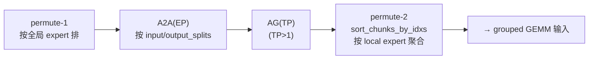
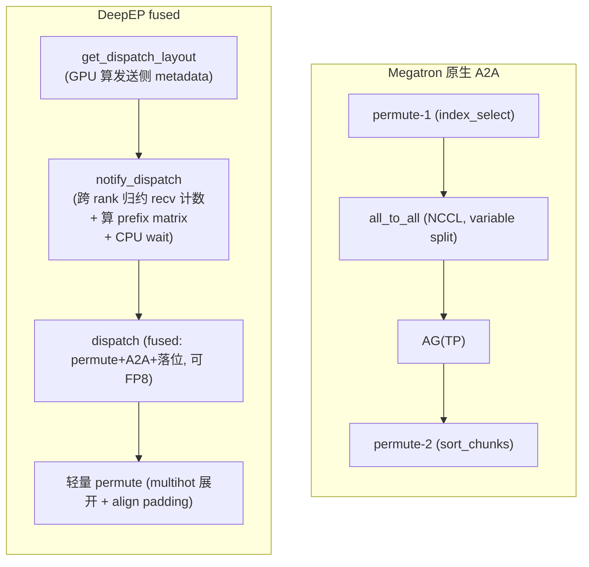

# 02 · Dispatch：permute、all-to-all、buffer 分配

上一篇讲完了 router 怎么从 `hidden_states` 算出 `routing_map` 和 `probs`，以及 dispatch 前那些容易被忽略的 metadata 预处理。这一篇接着往下走，也是整组文档里最核心的一段：每个 token 选了 top-k 个 expert，这些 expert 分散在不同的 EP rank 上，dispatch 要做的事就是把 token 高效地搬到对应的 rank，并在接收端按 expert 连续排好，为 grouped GEMM 准备好输入。

要讲清楚这件事，我们走两条主线。第一条是 Megatron 原生的 A2A dispatcher，用 `permute` 加 `torch.distributed` 的 `all_to_all` 显式拼出整个流程，逻辑完全透明，是理解 dispatch 语义最好的教材。第二条是 DeepEP 的 fused dispatch，它把 permute、all-to-all 和接收端落位这三件事融合进一个 GPU kernel，只需要调用两三个 API 就能拿到结果。这一篇重点讲清楚这两条路径各自要解决什么问题、数据是怎么流动的；DeepEP 内部具体怎么用 channel、prefix matrix 这些机制去实现 fused dispatch，留给 [MoE 一章的 DeepEP 内部机制](../../moe/06_deepep.md)去展开。

---

## 1. Dispatch 的目标 layout

先明确终点，再看怎么走到。Dispatch 的输出必须是：**接收端本 rank 上，所有发给 local expert 0 的 token 连续排在最前、然后是 expert 1 的、……**，形成一个可以直接喂给 m-grouped GEMM 的 buffer：

```
接收端 rank 上 dispatch 之后的 token buffer（按 local expert 连续）:

  ┌──────────────┬──────────┬───────────────────┬─────┐
  │  expert 0    │ expert 1 │     expert 2       │ ... │
  │  (n0 tokens) │ (n1)     │     (n2)           │     │
  └──────────────┴──────────┴───────────────────┴─────┘
  └─────────────────── 沿 M(token) 维拼接 ───────────────┘
        每段长度 = num_recv_tokens_per_expert_list[i]（运行时才知道）
```

注意两个「运行时才知道」：
- 每段长度 $n_i$ 数据相关，各 rank、各 expert 都不同；
- 总长度 $= \sum_i n_i$（本 rank 所有 local expert 收到的 token 总数），也得通信后才知道（这正是 [01 · Router 与 Dispatch 前的 Preprocess](./01_router_and_preprocess.md) 讲的 sync point 来源）。

---

## 2. 主线一：Megatron 原生 A2A dispatcher

`MoEAlltoAllTokenDispatcher` 的 workflow 写在类 docstring（[[megatron-lm:megatron/core/transformer/moe/token_dispatcher.py#L357-L366]]）：

```
(1) preprocess          : 算 metadata（见 01）
(2) dispatch_preprocess : permute-1（按 expert 排本地 token）
(3) token_dispatch      : A2A(EP)
(4) dispatch_postprocess: AG(TP) → sort_chunk（num_local_experts>1 时）= permute-2
(5) combine_preprocess  : sort_chunk → RS(TP)
(6) token_combine       : A2A(EP)
(7) combine_postprocess : unpermute
```

本篇关注 (2)(3)(4)。

### 2.1 Permutation-1：按 expert 把本地 token 排序

`dispatch_preprocess`（[[megatron-lm:megatron/core/transformer/moe/token_dispatcher.py#L598-L653]]）调用 `permute`（[[megatron-lm:megatron/core/transformer/moe/moe_utils.py#L299]]）。它的作用：把 $[T, H]$ 的 token，按 `routing_map` $[T, E]$ 展开重排成「同一个 expert 的 token 挨在一起」。

实现是 argsort-based（[[megatron-lm:megatron/core/transformer/moe/moe_utils.py#L413-L427]]）：

```python
# routing_map: [T, E] bool → 转置 [E, T]，flatten 后 argsort
routing_map = routing_map.bool().T.contiguous()          # [E, T]
flat_sorted = routing_map.reshape(-1).argsort(descending=True, stable=True)
flat_sorted = flat_sorted[:num_out_tokens]               # 只取真正被选中的
sorted_indices = flat_sorted % num_tokens                # 还原成原 token 下标
permuted_input = tokens.index_select(0, sorted_indices)  # 真正的重排
```

关键点：
- 一个 token 选了 top-k 个 expert，所以它在 permute 后会**出现 $k$ 次**（$[E, T]$ 里它所在的 $k$ 列各有一个 True）。`num_out_tokens = T * topk`（dropless）。
- `sorted_indices` 就是「permuted 行 → 原始行」的映射，**保存下来给 combine 做逆变换**（`reversed_local_input_permutation_mapping`, `:642`）。
- 这里把 token 按 **全局 expert id** 排序，于是同一 EP rank 的 expert 们天然连续 → 接着按 `input_splits` 切块就能直接 all-to-all。

ASCII（T=3, E=4, topk=2）：

```
routing_map (token→expert):       permute 后 (按 expert 分组):
  t0 → {e0, e2}                      e0: [t0, t1]
  t1 → {e0, e3}            ──►       e1: []
  t2 → {e1, e2}                      e2: [t0, t2]
                                     e3: [t1]
  sorted_indices = [0,1, , 0,2, 1]   permuted = tokens[sorted_indices]
```

probs 也跟着 permute（`permuted_probs`, `:646`），保证 combine 时权重和 token 对得上。

### 2.2 Token dispatch：variable-split all-to-all

`token_dispatch`（[[megatron-lm:megatron/core/transformer/moe/token_dispatcher.py#L655-L699]]）：

```python
global_input_tokens = all_to_all(
    self.ep_group,
    permutated_local_input_tokens,
    self.output_splits,     # 我从每个 rank 收多少
    self.input_splits,      # 我发给每个 rank 多少
)
```

这是一个 **variable-size all-to-all**（NCCL 的 `ncclSend/ncclRecv` 拼出来）。permute-1 已经把 token 按 expert（→ 按目标 rank）排好，所以本 rank 的发送 buffer 天然按 `input_splits` 切成 EP 段，第 j 段直接发给 rank j。接收端按 `output_splits` 收，落进 `global_input_tokens`。

probs 同样要 all-to-all 一次（`:691`），这样接收端知道每个 token 的权重。Megatron 这里还做了一个 overlap 技巧：把 shared expert 的 fc1 GEMM 插在 tokens A2A 和 probs A2A 之间（`:685-697`），盖住 probs 的小通信。

### 2.3 Permutation-2：跨 local expert 再排一次

A2A 之后，本 rank 收到的 token 是按「源 rank」分段的，但每个源 rank 段里可能混着发给本 rank 上多个 local expert 的 token。如果本 rank 有多个 local expert（`num_local_experts > 1`），就还要再排一次，把同一 local expert 的 token 聚到一起。

`dispatch_postprocess`（[[megatron-lm:megatron/core/transformer/moe/token_dispatcher.py#L701-L767]]）：

1. 若 `TP > 1`：先 `gather_from_sequence_parallel_region` 在 TP 维 all-gather token（`:719`，因为 expert 权重被 TP 切了，每个 TP rank 需要完整 token）。
2. `sort_chunks_by_idxs`（[[megatron-lm:megatron/core/transformer/moe/moe_utils.py#L534]]）做 permute-2：

```python
# 把 [tp*ep, num_local_experts] 的 chunk 按「先 local expert、再 rank」重排
global_input_tokens, global_probs = sort_chunks_by_idxs(
    global_input_tokens,
    self.num_global_tokens_per_local_expert.ravel(),  # 每个 chunk 的大小
    self.sort_input_by_local_experts,                 # chunk 的目标顺序
    probs=global_probs)
```

`sort_input_by_local_experts`（[[megatron-lm:megatron/core/transformer/moe/token_dispatcher.py#L415]]）是预计算的 chunk 重排索引。`sort_chunks_by_idxs` 内部就是 `torch.split` + 按索引 `torch.cat`（[[megatron-lm:megatron/core/transformer/moe/moe_utils.py#L569-L573]]）。permute-2 之后，buffer 就是第 1 节画的「按 local expert 连续」的目标 layout，`tokens_per_expert` 给到 grouped GEMM。



> 为什么要两次 permute？因为有两个正交的「分组维度」：permute-1 解决「按目标 **rank** 分组以便 all-to-all」，permute-2 解决「在本 rank 内按 **local expert** 分组以便 grouped GEMM」。当 `num_local_experts == 1` 时 permute-2 可省略（每个 rank 就一个 expert，A2A 后已经天然聚好）。

---

## 3. 主线二：DeepEP fused dispatch

`MoEFlexTokenDispatcher` 把上面 permute-1 + A2A 这一段交给 DeepEP 的 fused kernel。`_DeepepManager.dispatch`（[[megatron-lm:megatron/core/transformer/moe/token_dispatcher.py#L1230-L1259]]）：

```python
hidden_states, dispatched_indices, dispatched_probs, num_tokens_per_expert, handle = \
    fused_dispatch(hidden_states, self.token_indices, self.token_probs,
                   self.num_experts, self.group, async_finish, allocate_on_comm_stream)
```

`fused_dispatch`（[[megatron-lm:megatron/core/transformer/moe/fused_a2a.py#L214]]）是对 `FusedDispatch` autograd.Function（[[megatron-lm:megatron/core/transformer/moe/fused_a2a.py#L71]]）的封装，后者内部调 DeepEP 的 `Buffer.get_dispatch_layout` + `Buffer.dispatch`。

### 3.1 DeepEP 的两步 API

**Step A —— `get_dispatch_layout`**（[[deepep:deep_ep/buffers/legacy.py#L293]]，[[megatron-lm:megatron/core/transformer/moe/fused_a2a.py#L91-L103]]）：

```python
num_tokens_per_rank, num_tokens_per_rdma_rank, num_tokens_per_expert, is_token_in_rank, event = \
    buffer.get_dispatch_layout(topk_idx, num_experts, ...)
```

它在 GPU kernel（[[deepep:csrc/kernels/legacy/layout.cu]]）里从 `topk_idx` $[T, \mathrm{topk}]$ 算出：

| 返回 | shape | 含义 |
|---|---|---|
| `num_tokens_per_rank` | `[num_ranks]` int | 本 rank 要发给每个 rank 多少 token |
| `num_tokens_per_rdma_rank` | `[num_rdma_ranks]` int | 内层 internode：发给每个 RDMA rank 多少（intranode 为 None） |
| `num_tokens_per_expert` | `[num_experts]` int | 本 rank 要发给每个 expert 多少 token |
| `is_token_in_rank` | `[T, num_ranks]` bool | token t 是否要发给 rank r（一个 token 可发给多个 rank） |

这正是 [01 · Router 与 Dispatch 前的 Preprocess](./01_router_and_preprocess.md) 第 4 节 Megatron 手算的那套 metadata，DeepEP 把它下沉到 kernel 里一把算完。

**Step B —— `dispatch`**（[[deepep:deep_ep/buffers/legacy.py#L322]]，[[megatron-lm:megatron/core/transformer/moe/fused_a2a.py#L108-L126]]）：

```python
recv_x, recv_topk_idx, recv_topk_weights, num_recv_tokens_per_expert_list, handle, event = \
    buffer.dispatch(x, topk_idx=..., topk_weights=...,
                    num_tokens_per_rank=..., is_token_in_rank=..., num_tokens_per_expert=...,
                    expert_alignment=..., async_finish=..., allocate_on_comm_stream=...)
```

返回里最关键的是：
- `recv_x`：接收到的 token，**已经是按 expert 连续排好的目标 layout**（DeepEP 在接收端 kernel 里直接把每个 token 写到它所属 expert 的段内）。
- `num_recv_tokens_per_expert_list`：Python list `[num_local_experts]`，每个 local expert 收到的 token 数，**已对齐到 `expert_alignment`**（这个数直接喂给 [grouped GEMM](../../moe/05_grouped_gemm.md)）。
- `handle`：combine 要用的逆变换信息（下节详解）。

也就是说：**DeepEP 的 dispatch 一步顶 Megatron 原生路径的 permute-1 + A2A + permute-2**。Megatron flex 路径里只在拿到 `recv_x` 后再做一次轻量的 `permute`（`get_permuted_hidden_states_by_experts`, [[megatron-lm:megatron/core/transformer/moe/token_dispatcher.py#L1348]]）把 multihot 展开 + 按 `align_size` padding，并不重新通信。

但「一步」只是 Python API 层面给人的错觉。`buffer.dispatch` 内部其实是两个 kernel 加一次 CPU 握手：先跑一个叫 `notify_dispatch` 的小 kernel，把各 rank 的 token 计数交换、归约成「我会收到多少」，并顺带算出接收端的落位地址簿；CPU 拿到这个数之后才能分配出 `recv_x` 这块显存，然后才能启动真正搬运 token 的 dispatch kernel。`get_dispatch_layout` 只算出了本 rank 发送侧的视角，也就是我要发给谁多少；而接收侧「我总共会收到多少」是一次跨 rank 的归约，正是 `notify_dispatch` 要做的事，也是下面要讲的那次 CPU 等待的来源。这一步具体是怎么实现的，比如 channel 怎么切、prefix matrix 这本地址簿怎么算，留给 [MoE 一章的 DeepEP 内部机制](../../moe/06_deepep.md)去展开，这里先记住它存在、且是不可避免的一次同步。

### 3.2 expert_alignment：dispatch 直接吐对齐好的 layout

`dispatch(expert_alignment=...)`（[[deepep:deep_ep/buffers/legacy.py#L353]]）：把每个 local expert 收到的 token 数向上对齐到 `expert_alignment`（典型 128，对齐 GEMM 的 $M$ tile）。这意味着 **DeepEP 在通信落位阶段就把 grouped GEMM 要的 M 对齐做掉了**，接收 buffer 每段起点都对齐，省掉一次额外的 pad/copy。这是 dispatch↔GEMM「layout 契约」的具体体现。

### 3.3 FP8 dispatch：通信即压缩

`dispatch` 的 `x` 可以是 tuple（[[deepep:deep_ep/buffers/legacy.py#L340-L343]]）：

```
x = (x_fp8, x_scales)
  x_fp8    : [T, H]        torch.float8_e4m3fn     # 量化后的 token
  x_scales : [T, H//128]   torch.float            # per-128-channel 的 scale
```

dispatch 直接搬 FP8 数据，跨机带宽减半（H=7168 时 BF16→FP8 省 ≈28MB/批）。接收端拿到的也是 `(recv_x_fp8, recv_scales)`，可以直接喂给 DeepGEMM 的 FP8 grouped GEMM，也就是说 dispatch 和 GEMM 全程都不需要解量化。combine 反过来用 BF16，因为输出对精度更敏感。这就是 DeepSeek 「FP8 dispatch / BF16 combine」这套配置的由来。

---

## 4. DeepEP 内部怎么实现这一切：概览

上面已经把 DeepEP fused dispatch 在 API 层面要给出什么、要用什么讲清楚了。它内部具体怎么做到，值得单独用一整篇来讲，这里先给一个概览，方便建立整体印象，细节留给 [MoE 一章的 DeepEP 内部机制](../../moe/06_deepep.md)。

`buffer.dispatch` 背后其实是一个叫 `notify_dispatch` 的小 kernel 先做一次跨 rank 的计数归约，算出接收端的落位地址（专业说法是 prefix matrix，可以理解成一本记录着「谁的数据该写到 `recv_x` 哪个偏移」的地址簿），CPU 拿到这个总数之后再分配显存、启动真正搬数据的 kernel。搬数据这一步会把 token 流切成若干个 channel 并行处理，用少量 SM 就能把 NVLink 带宽打满。跨机场景下还要多一层转发：训练和 prefill 场景为了省 RDMA 带宽，会先把数据打到远端节点里编号相同的那张卡，再在节点内用 NVLink 扇出给真正需要的卡；decode 场景因为延迟比带宽更重要，直接砍掉这一层转发，一步 RDMA 打到目标卡。

这里面有一个贯穿始终的事实值得先记住：因为接收端要收多少 token 是运行时才能知道的，dispatch 里天然存在一次 CPU 等待，CPU 必须等 GPU 把归约结果写回才能分配缓冲区，这也是 normal 模式默认不兼容 CUDA graph 的根本原因。DeepEP 的示意图把这次等待画得很直观：


逃生方式是 `dispatch(num_worst_tokens=...)`：按最坏情况的 token 数静态分配显存，跳过这次同步，从而兼容 CUDA graph，但目前只有单机内的场景支持。这个要不要等、怎么才能不等的问题，也是本仓库这个版本的 DeepEP 里 V1 和 V2 两套实现分别给出不同答案的地方，在 [MoE 一章的 DeepEP 内部机制](../../moe/06_deepep.md)里会展开讲清楚。

---

## 5. 两条路径对照



| 维度 | Megatron 原生 A2A | DeepEP fused |
|---|---|---|
| permute | 显式 `index_select`（独立 kernel + 显存往返） | 融合进通信 kernel，token 边发边落位 |
| metadata | Megatron 手算 splits（含 D2H） | `get_dispatch_layout` 算发送侧 + `notify_dispatch` 跨 rank 归约出 recv 计数（含 CPU wait） |
| FP8 dispatch | 不支持 | 原生支持 `(x_fp8, scales)` |
| SM 占用 | 通信走默认 NCCL | 可控 SM（`set_num_sms`），少量 SM 打满带宽 |
| 接收 layout | permute-2 后才对齐 | dispatch 直接吐 `expert_alignment` 对齐的 layout |
| CUDA graph | drop-and-pad 时可 | `num_worst_tokens`/low-latency 时可 |
| 跨机转发 | 依赖 NCCL 拓扑 | 显式 NVLink↔RDMA 两级转发 |

---

## 6. backward 预告

dispatch 的反向是 combine。`FusedDispatch.backward`（[[megatron-lm:megatron/core/transformer/moe/fused_a2a.py#L141-L162]]）直接调 `buffer.combine`，复用 forward 存下的 `handle`（同一本地址簿，逆向用）。`grad_recv_x` 经 combine 被 reduce 回原 token 位置，得到 `grad_x`。完整对称性见 [03 · Combine 与 forward / backward 对称性](./03_combine_and_backward.md)。

---

讲完 dispatch 怎么把 token 搬到目标 rank，下一篇接着讲 combine：expert 算完之后，combine 怎么把结果送回原 token、原位置，以及为什么 dispatch 的反向正好就是 combine，见 [03 · Combine 与 forward / backward 对称性](./03_combine_and_backward.md)。至于 dispatch 吐出的 buffer 具体怎么喂给 grouped GEMM、DeepEP 内部的 channel 和 prefix matrix 又是怎么实现的，可以看 [MoE 架构](../../moe/README.md)一章里的 [grouped GEMM](../../moe/05_grouped_gemm.md) 和 [DeepEP 内部机制](../../moe/06_deepep.md)。
