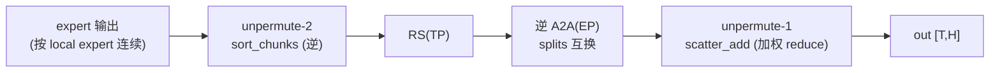
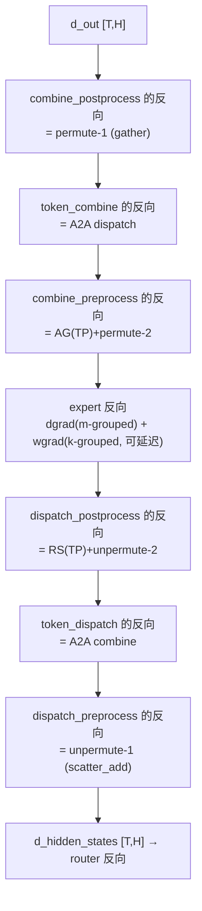

# 03 · Combine 与 forward / backward 对称性

> 上一篇讲了 dispatch，本篇讲它的逆操作 combine。expert 计算完成后得到每个 (token, expert) 对的输出，combine 要把它们**送回 token 原来的 rank、原来的位置，并把同一 token 的 top-k 个 expert 输出加权求和**。本篇先讲 combine 的两段（unpermute 与逆向 all-to-all），再把整条链路的反向完整串一遍——这是把 MoE infra 各部分连成整体的关键一节。
>
> 代码锚点：[[megatron-lm:megatron/core/transformer/moe/token_dispatcher.py]]（combine_preprocess / token_combine / combine_postprocess）、[[megatron-lm:megatron/core/transformer/moe/fused_a2a.py]]（autograd 交叉绑定）、[[deepep:deep_ep/buffers/legacy.py]] 的 `combine`。

---

## 1. Combine 是 dispatch 的精确逆操作

回顾一下 dispatch 做了什么（见 [02 · Dispatch：permute、all-to-all、buffer 分配](./02_dispatch.md)）：

```
dispatch:  token (原 rank, 原序)  ──permute──►  按 expert 排  ──A2A──►  expert 所在 rank
```

combine 沿相反方向走一遍，并额外多做一次 reduce：

```
combine:   expert 输出  ──逆A2A──►  回原 rank  ──unpermute──►  原序  ──加权求和──►  每 token 一个输出
```

为什么需要「加权求和」？因为一个 token 选了 top-k 个 expert，dispatch 时被复制成 $k$ 份发出去，combine 时要把这 $k$ 份用 router 的 `probs` 加权合并回一份。形式上：

$$
\mathrm{out}[t] = \sum_{e \in \text{top-}k(t)} \mathrm{probs}[t, e]\; \mathrm{expert}_e(x[t])
$$

---

## 2. Megatron 原生路径的 combine

对应 `MoEAlltoAllTokenDispatcher` 的 (5)(6)(7) 步。

### 2.1 combine_preprocess：unpermute-2 与 reduce-scatter

`combine_preprocess`（[[megatron-lm:megatron/core/transformer/moe/token_dispatcher.py#L769-L808]]）是 dispatch_postprocess 的逆：

```python
# unpermute-2: 把「按 local expert 聚合」的顺序，还原回「按源 rank 分段」的顺序
hidden_states, _ = sort_chunks_by_idxs(
    hidden_states,
    self.num_global_tokens_per_local_expert.T.ravel(),  # 注意 .T，逆向
    self.restore_output_by_local_experts)               # token_dispatcher.py:419 预算的逆索引
# TP>1: reduce_scatter（dispatch 时是 all_gather 的逆）
if self.tp_size > 1:
    hidden_states = reduce_scatter_to_sequence_parallel_region(...)
```

`restore_output_by_local_experts`（[[megatron-lm:megatron/core/transformer/moe/token_dispatcher.py#L419]]）与 dispatch 的 `sort_input_by_local_experts` 互为逆排列；TP 维上，dispatch 的 AllGather 与 combine 的 ReduceScatter 互为反向。

### 2.2 token_combine：逆向 all-to-all

`token_combine`（[[megatron-lm:megatron/core/transformer/moe/token_dispatcher.py#L810-L847]]）：

```python
permutated_local_input_tokens = all_to_all(
    self.ep_group,
    hidden_states,
    self.input_splits,    # ← 注意：和 dispatch 比，input/output splits 互换了
    self.output_splits,
)
```

dispatch 是 `all_to_all(..., output_splits, input_splits)`，combine 是 `all_to_all(..., input_splits, output_splits)`。**同一对 splits 交换位置就完成了逆向通信**——这就是 all-to-all 自带的转置性质，后面反向那节会反复用到。

### 2.3 combine_postprocess：unpermute-1 与加权 reduce

`combine_postprocess`（[[megatron-lm:megatron/core/transformer/moe/token_dispatcher.py#L849-L880]]）调 `unpermute`（[[megatron-lm:megatron/core/transformer/moe/moe_utils.py#L432]]）：

```python
output = unpermute(
    permutated_local_input_tokens,
    self.reversed_local_input_permutation_mapping,   # = dispatch 时存的 sorted_indices
    restore_shape=self.hidden_shape_before_permute,
    routing_map=self.routing_map)
```

`unpermute` 的核心是 **scatter_add**（[[megatron-lm:megatron/core/transformer/moe/moe_utils.py#L513-L530]]）：

```python
output_tokens = torch.zeros(restore_shape, ...)            # [T, H] 清零
# 同一个 token 的 k 份会 scatter 到同一行 → 自动累加 = top-k reduce
output_tokens.scatter_add_(0, sorted_indices.expand(-1, H), permuted_tokens)
```

注意：在 Megatron 的 TE 路径里，router 权重 `probs` 已经在 expert 的 **scaled SwiGLU** 处乘过了（MoE 章 [05 · Grouped GEMM 与 Expert 计算](../../moe/05_grouped_gemm.md) 第 4 节），因此这里的 `unpermute` 只做纯加法。不过 `unpermute` 也支持传入 `probs` 并在 scatter 之前相乘（[[megatron-lm:megatron/core/transformer/moe/moe_utils.py#L487-L511]]），具体取决于权重在哪一步施加。两种实现等价，只是数值施加的位置不同。



---

## 3. DeepEP 路径的 combine

`_DeepepManager.combine`（[[megatron-lm:megatron/core/transformer/moe/token_dispatcher.py#L1297-L1315]]）：

```python
hidden_states, _ = fused_combine(hidden_states, self.group, self.handle, ...)
```

调用链是 `fused_combine` 到 `FusedCombine`（[[megatron-lm:megatron/core/transformer/moe/fused_a2a.py#L165]]）再到 `buffer.combine`（[[deepep:deep_ep/buffers/legacy.py#L408]]）。DeepEP combine 的语义（[[deepep:deep_ep/buffers/legacy.py#L415-L417]]）是 **"Combine (reduce) tokens (addition without weights) from different ranks"**，即纯加法 reduce，权重已经在别处施加。它复用 dispatch 存下的 `handle`（即 prefix matrix 那份落位地址信息），按相反方向把每个 expert 输出 gather 回源 rank 并累加。

DeepEP combine 也支持通过 `topk_weights`（[[deepep:deep_ep/buffers/legacy.py#L425]]）做加权 reduce，通过 `bias`（[[deepep:deep_ep/buffers/legacy.py#L426]]）加最终偏置。combine 默认使用 BF16（不像 dispatch 使用 FP8），因为输出累加对精度更敏感。

> combine 复用 dispatch 的 handle 这一点很关键：dispatch 在 forward 时算好的 prefix matrix、`recv_src_idx`、`send_head`，combine 原样拿来做逆向 scatter。**同一份落位地址信息，正反向各用一次。**

---

## 4. 整条链路的反向

现在把 forward 的每一段与它的反向并排对照。

### 4.1 核心事实：dispatch 的反向就是 combine

dispatch 在数学上是一个**线性的 gather/scatter**（按 routing_map 把 token 复制并搬运，没有非线性）。线性算子 $y = P x$ 的反向是 $\mathrm{d}x = P^{\top} \mathrm{d}y$，而：

- dispatch 的 $P$ 表示「按 routing_map 把 token scatter 到各 expert」
- 它的转置 $P^{\top}$ 表示「把各 expert 位置上的梯度按同样的 map gather 并累加回原 token」，**这正是 combine**

所以不需要为 dispatch 单独写反向 kernel。看 `fused_a2a.py`：

```python
class FusedDispatch(torch.autograd.Function):
    @staticmethod
    def backward(ctx, grad_output, ...):
        grad_x, grad_token_probs, _ = buffer.combine(grad_output.contiguous(), ctx.handle, ...)
        return grad_x, ...                              # fused_a2a.py:151-162

class FusedCombine(torch.autograd.Function):
    @staticmethod
    def backward(ctx, grad_output, ...):
        grad_x, _, _, _, _, _ = buffer.dispatch(grad_output.contiguous(), handle=ctx.handle, ...)
        return grad_x, ...                              # fused_a2a.py:199-209
```

**dispatch.backward 就是 combine，combine.backward 就是 dispatch。** 两个 kernel 交叉绑定，复用同一个 handle。这也是 DeepEP 文档中 `dispatch_backward` 直接调用 `combine`、`combine_backward` 直接调用 `dispatch` 的原因（[[deepep:docs/legacy.md#L184-L222]]，`README.md` 的 V2 例子同理）。

### 4.2 完整对称表

| forward 段 | forward 算子 | backward 算子 | 代码锚点 |
|---|---|---|---|
| permute-1 | `index_select` (gather) | `scatter_add` (= unpermute) | `moe_utils.py:427 / 528` |
| A2A dispatch | `all_to_all(out_s, in_s)` | `all_to_all(in_s, out_s)` (splits 换) | `token_dispatcher.py:678 / 837` |
| AG (TP) | `all_gather` | `reduce_scatter` | `token_dispatcher.py:719 / 802` |
| permute-2 | `sort_chunks(sort_idx)` | `sort_chunks(restore_idx)` | `token_dispatcher.py:755 / 790` |
| **dispatch (fused)** | `buffer.dispatch` | `buffer.combine` | `fused_a2a.py:115 / 151` |
| grouped GEMM fc | m-grouped | dgrad(m-grouped)+wgrad(k-grouped) | [05 · Grouped GEMM 与 Expert 计算](../../moe/05_grouped_gemm.md) |
| **combine (fused)** | `buffer.combine` | `buffer.dispatch` | `fused_a2a.py:175 / 199` |
| unpermute-1 | `scatter_add` | `index_select` | `moe_utils.py:528 / 427` |

整体反向通路就是把第 1 节那张 forward 图整个镜像翻转：



> 其中的规律可以总结为：**forward 里每个 gather 的反向是 scatter，每个 all-to-all 的反向是 splits 互换的 all-to-all，每个 AllGather 的反向是 ReduceScatter；dispatch 和 combine 互为反向。**记住这条规律，任何 MoE+EP 实现的反向都可以据此推导出来。

---

## 5. 反向里的通信 overlap

反向的关键路径是 dgrad，因为要尽快把 `grad_hidden_states` 传给上游 attention。而 wgrad 是可以延迟计算的（MoE 章 [05 · Grouped GEMM 与 Expert 计算](../../moe/05_grouped_gemm.md) 第 5.3 节，`backward_dw`），可以把它塞进 EP all-to-all 反向通信的窗口里去算：当 dispatch/combine 反向的 all-to-all 占满网络带宽时，正好让 GPU 空出来的算力去算 wgrad。

这就是 `config.overlap_moe_expert_parallel_comm` / `overlap_dispatch_backward_with_experts_wgrad`（[[megatron-lm:megatron/core/transformer/moe/experts.py#L398]]、[[megatron-lm:megatron/core/transformer/moe/moe_layer.py#L714]]）这些 flag 的作用：把反向通信与 wgrad 计算在时间轴上重叠起来，掩盖通信延迟。

```
时间轴 →
关键路径:  dgrad ──► combine.bwd(A2A) ──► ... ──► dispatch.bwd(A2A) ──►
旁路:                └─ wgrad(k-grouped) ─┘     └─ wgrad ─┘   ← 填进通信气泡
```

---

## 6. 完整 forward 与 backward 的伪代码

最后，把本组文档前面的内容串成一段可读的伪代码（DeepEP/flex 路径，省略 TP）：

```python
# ===== forward =====
logits = x @ Wg.T                                   # 01 gating (fp32)
probs, routing_map = topk_with_score(logits, topk)  # 01 routing
topk_w, topk_idx = topk(probs, k)                   # 01 → DeepEP 格式

# dispatch (fused: layout + permute + A2A + 落位), 反向自动是 combine
recv_x, recv_idx, recv_w, n_per_expert, handle = buffer.dispatch(
        x, topk_idx, topk_w, num_experts, expert_alignment=128)   # 02

# expert: m-grouped GEMM, router 权重在 SwiGLU 处乘入
h  = m_grouped_gemm_contiguous(recv_x, W1, n_per_expert)          # MoE 05 fc1
h  = swiglu(h) * recv_w                                           # MoE 05 act + weight
y  = m_grouped_gemm_contiguous(h, W2, n_per_expert)               # MoE 05 fc2

# combine (fused: unpermute + 逆A2A + reduce), 反向自动是 dispatch
out = buffer.combine(y, handle)                                  # 本文

# ===== backward (autograd 自动) =====
# d_out → combine.bwd == dispatch        (fused_a2a.py:199)
# → expert dgrad (m-grouped) ; wgrad (k-grouped) 延迟到通信窗口
# → dispatch.bwd == combine              (fused_a2a.py:151)
# → unpermute scatter_add → router 反向（只有被选中 expert 的 probs 有梯度）
```

---

到这里，一层 MoE 的完整 forward 和 backward 就都串起来了。但故事还没结束：router 选完 expert 只是逻辑层面的分配，物理层面还有一件事要处理——热点 expert 怎么复制、token 怎么重路由，这是下一篇 [系统侧负载均衡：EPLB、LPLB、UltraEP 与 MoonEP](./04_system_load_balancing.md) 要讲的内容。如果想继续深入算子与 kernel 本身，可以转到 MoE 章的三篇专题：[05 · Grouped GEMM 与 Expert 计算](../../moe/05_grouped_gemm.md)、[06 · DeepEP：V1 (legacy/NVSHMEM) 与 V2 (elastic/NCCL Gin)](../../moe/06_deepep.md) 和 [07 · MegaMoE：把 MoE forward 融成单个 kernel](../../moe/07_megamoe.md)。
