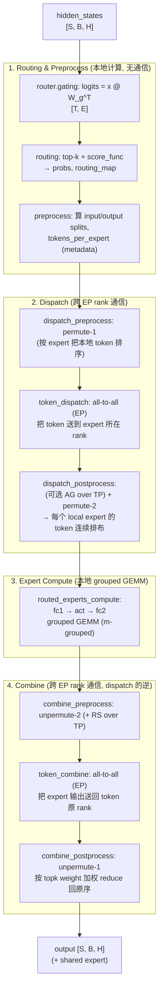
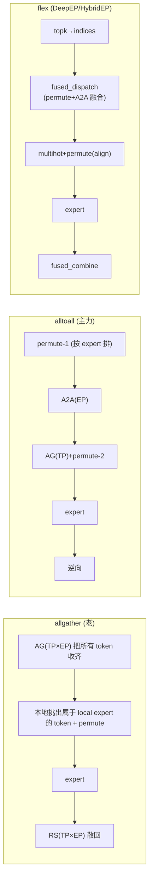

# Expert Parallelism (EP)

> 本篇是 EP 一章的总览。本文会先给出 MoE/EP 数据通路的完整定义（token 到 expert 的 dispatch/combine、各中间量的 shape、前反向对称性），再把整条 forward / backward 按工程实现逐段拆开，对齐到 Megatron-LM、DeepEP、DeepGEMM 的真实代码。

## 前置知识

- 熟悉 Transformer FFN 与 top-k routing 的基本想法；架构侧的定义（细粒度、LatentMoE、aux / aux-free / QB）见 [MoE](../../moe/README.md)。
- 了解 all-to-all 集合通信，参见 [集合通信：原语、算法、NCCL 实现与拓扑映射](../../hpc/04_collectives.md)。

---

## 1. MoE layer 的 forward 通路

先把整条链路画出来。下面是 Megatron `MoELayer.forward`（[[megatron-lm:megatron/core/transformer/moe/moe_layer.py#L598-L683]]）的四个 main step，注释里的步骤名直接对应 `MoETokenDispatcher` 的抽象方法。



整条链路可以概括为一句话：

> **一个 MoE layer 做的事情只有三步：先做一次「按 expert 重排 token 的 all-to-all」（dispatch），再做一次本地 grouped GEMM，最后做一次逆向 all-to-all 把结果加权送回（combine）。** 难点集中在第一段和第三段：dispatch 要在 token 数量动态、跨机带宽受限、还要 FP8 压缩的前提下高效完成；grouped GEMM 要在每个 expert 的 token 数不定、且必须按 GEMM tile 对齐的前提下充分利用算力。


> 图：DeepSeek-V3 的基础架构（右侧即 **DeepSeekMoE**）。每个 MoE layer 有少量**始终激活的 shared expert** 和大量**细粒度 routed expert**，router 为每个 token 选 top-k routed expert。本组文档分析的正是这条通路：token 如何被 router 选中，dispatch 到 expert 所在 rank，经过 grouped GEMM，再由 combine 加权送回。（DeepSeek-AI 2024, Fig 2；[arXiv:2412.19437](https://arxiv.org/abs/2412.19437)）

---

## 2. 三层抽象与三个代码库的分工

MoE+EP 的实现天然分三层，三个代码库恰好各管一层：

```
┌─────────────────────────────────────────────────────────────┐
│  Layer 0  模型逻辑 / 编排                                       │
│  Megatron MoELayer:  route → dispatch → expert → combine       │
│  (moe_layer.py, router.py)                                     │
├─────────────────────────────────────────────────────────────┤
│  Layer 1  Token routing 的「重排 + 通信」                       │
│  MoETokenDispatcher 抽象:                                       │
│    - MoEAllGatherTokenDispatcher   (AG + RS, 老路径)            │
│    - MoEAlltoAllTokenDispatcher    (原生 A2A + 两次 permute)    │
│    - MoEFlexTokenDispatcher        (调用 DeepEP / HybridEP)     │
│  (token_dispatcher.py, fused_a2a.py)                           │
│        │                                                       │
│        └── 把 permute + all-to-all 融合下沉到 ↓                 │
├─────────────────────────────────────────────────────────────┤
│  Layer 2a 通信 kernel        │  Layer 2b 计算 kernel            │
│  DeepEP                      │  DeepGEMM                        │
│  dispatch / combine          │  m_grouped_*_contiguous (训练)   │
│  normal & low-latency        │  m_grouped_*_masked     (decode) │
│  (deep_ep/, csrc/kernels/)   │  k_grouped_* (wgrad)             │
└─────────────────────────────────────────────────────────────┘
```

- **Megatron** 决定「token 怎么路由、metadata 怎么算、前反向怎么挂 autograd」。
- **DeepEP** 把「permute + all-to-all + 接收端按 expert 落位」做成一个 fused、低 SM 占用、支持 FP8 的通信原语。
- **DeepGEMM** 把一系列 shape 相同、token 数不同的 expert GEMM 做成一个 m-grouped kernel，由一个 tile scheduler 跨 group 调度。

这三者的接缝是本组文档反复强调的重点：**DeepEP dispatch 的输出 layout，必须正好是 DeepGEMM grouped GEMM 想要的输入 layout**（按 expert 连续、每段按 M tile 对齐）。这个「layout 契约」是整个 MoE infra 设计的核心。

---

## 3. 并行维度：EP / TP / ETP / DP 的耦合

MoE 训练里同时存在多种并行，token dispatcher 必须同时处理。先固定符号（与 [[megatron-lm:megatron/core/transformer/moe/token_dispatcher.py#L40-L48]] 一致）：

```
H   = hidden size
B   = micro batch size
S   = sequence length
TP  = tensor model parallel size
EP  = expert model parallel size
num_local_tokens  = S/TP * B          # 本 rank 持有的 token 数
num_global_tokens = num_local_tokens * TP * EP
E   = num_moe_experts (全局 expert 数)
num_local_experts = E / EP            # 本 rank 上的 expert 数
```

几个必须分清的并行域：

| 并行 | 切什么 | MoE 里的含义 |
|---|---|---|
| **EP** (Expert Parallel) | 把 $E$ 个 expert 切到 $\mathrm{EP}$ 个 rank，每 rank $E/\mathrm{EP}$ 个 | dispatch/combine 的 all-to-all 就发生在 EP group 内 |
| **TP** (Tensor Parallel) | 切每个 expert 的权重矩阵（fc1/fc2 的 hidden 维） | expert 内的 GEMM 被切；dispatch 后还需在 TP 维 all-gather token |
| **ETP** (Expert TP) | MoE 部分独立的 TP（可与 attention 的 TP 不同） | Megatron 用 `expt_tp_group`（[[megatron-lm:megatron/core/transformer/moe/token_dispatcher.py#L75]]） |
| **DP/CP** | 数据 / context 并行 | router 的 aux loss 需要跨 DP 同步统计 |

> 生产级 MoE（DeepSeek-V3 一类）倾向 **`ETP=1`**：expert 不再按 hidden 维切，dispatch 后也不再 AG。原因见 [Tensor Parallelism (TP) 与 Sequence Parallelism (SP)](../02_tp_sp/README.md) §7。Megatron 仍保留 ETP，是为了兼容 dense 时代的切法。

关键点：**routing 是在 token 维上做的稀疏选择，而 EP 是在 expert 维上做的切分**。一个 token 选中的 top-k 个 expert 可能分散在不同 EP rank 上，所以必须 all-to-all。Megatron 的 `MoEFlexTokenDispatcher` 把通信域定义为 TP×EP 的合并 group（[[megatron-lm:megatron/core/transformer/moe/token_dispatcher.py#L1395-L1472]]），用一个统一的 `routing_map: [num_local_tokens, world_size, num_local_experts]` 屏蔽 TP 和 EP 的差异，让 dispatch 逻辑与具体并行策略解耦。

> **DeepSeek-V3 风格的 group-limited routing**（`moe_utils.py:579 group_limited_topk`）正是为了控制 all-to-all 的扇出：把 expert 分组，每个 token 只能落到 `group_topk` 个组（相当于把目的地限制到少数几个 node），从而压低跨机流量。详见 [01 · Router 与 Dispatch 前的 Preprocess](./01_router_and_preprocess.md)。

---

## 4. 三种 token dispatcher 的取舍

Megatron 提供三种 dispatcher（[[megatron-lm:megatron/core/transformer/moe/moe_layer.py#L299-L322]] 按 `config.moe_token_dispatcher_type` 选择）：



- **allgather**（`MoEAllGatherTokenDispatcher`, [[megatron-lm:megatron/core/transformer/moe/token_dispatcher.py#L212]]）：实现最简单，但需要在 TP×EP 组内把全量 token 收发一遍，带宽浪费严重，目前已基本被取代。
- **alltoall**（`MoEAlltoAllTokenDispatcher`, [[megatron-lm:megatron/core/transformer/moe/token_dispatcher.py#L354]]）：当前训练的主力路径。它只发送每个 rank 真正需要的 token，通信量最优；代价是 split sizes 是运行时动态确定的，需要一次 D2H sync 才能让 CPU 拿到具体数值（见 [02 · Dispatch：permute、all-to-all、buffer 分配](./02_dispatch.md) 中关于 sync point 的讨论）。
- **flex**（`MoEFlexTokenDispatcher`, [[megatron-lm:megatron/core/transformer/moe/token_dispatcher.py#L1395]]）：把 permute+all-to-all 下沉给 DeepEP / HybridEP 的 fused kernel，少一次显存往返、SM 占用更低，且原生支持 FP8 dispatch。生产级大规模 EP（DeepSeek-V3 一类）采用这条路径。

后续文档以 **alltoall + flex(DeepEP)** 两条路径为主线展开，allgather 仅作对照。

---

## 5. forward / backward 的对称性

整条链路在 backward 时是严格镜像的，这是理解 MoE infra 最有效的一条线索。下面这张对称表会在后面每一段反复用到：

| forward 算子 | backward 算子 | 代码锚点 |
|---|---|---|
| `permute` (index_select) | `unpermute` (scatter_add) | `moe_utils.py:299 / 432` |
| `all_to_all(out_splits, in_splits)` | `all_to_all(in_splits, out_splits)`（splits 互换） | `token_dispatcher.py:678 / 837` |
| **dispatch** | **combine** | `fused_a2a.py:71 FusedDispatch.backward → buffer.combine` |
| **combine** | **dispatch** | `fused_a2a.py:165 FusedCombine.backward → buffer.dispatch` |
| grouped GEMM fc (m-grouped) | dgrad (m-grouped) + wgrad (k-grouped) | [05 · Grouped GEMM 与 Expert 计算](../../moe/05_grouped_gemm.md) |
| AllGather (TP) | ReduceScatter (TP) | `token_dispatcher.py` |

其中有一个核心事实值得单独强调：

> **MoE dispatch 的反向就是 combine，combine 的反向就是 dispatch。** 这不是巧合：dispatch 是「按 routing_map 把 token scatter 到各 expert」，是一个线性的 gather/scatter 操作；其转置（反向）正好是「把梯度按同样的 map 加回去」，也就是 combine。DeepEP 因此只需实现 dispatch / combine 两个 kernel，autograd 把它们交叉绑定即可（`fused_a2a.py:141-162, 192-209`）。

---

## 6. DeepSeek-V3 量级的示例数字

为了给后面出现的 shape 一个直观的参照，这里固定一组示例数字（接近 DeepSeek-V3 pretrain，引自 [[deepep:docs/legacy.md#L19]]）：

```
H = 7168            hidden
E = 256             routed experts (+1 shared)
top-k = 8           每 token 选 8 个 expert
EP = 8 / 16 / 32 …  expert parallel size
tokens/batch = 4096 每 rank
dispatch = FP8 (e4m3)   ；combine = BF16
```

由此可推出几个关键量级：

- 每 rank 输入 `4096 × 7168` BF16 ≈ 56 MB；FP8 dispatch 后 ≈ 28 MB + scale。
- 每个 token 要复制 8 份（top-k=8）发出去，因此 dispatch 的「逻辑发送量」约为 token 数的 8 倍；group-limited routing 把其中跨机的部分限制到至多 4 个 node。
- 接收端每个 local expert 收到的 token 数记录在 `num_recv_tokens_per_expert_list[i]` 中，只有运行时才知道，而且各 rank、各 expert 都不同——这是 grouped GEMM 必须支持 masked / 动态 $m$ 的根本原因。

---

## 这组文档怎么读

| 文件 | 内容 | 对应代码 |
|---|---|---|
| `README.md`（本文） | 全景 pipeline、术语、并行维度、整体数据流、代码映射表 | `moe_layer.py` |
| [01 · Router 与 Dispatch 前的 Preprocess](./01_router_and_preprocess.md) | router gating / top-k / group-limited routing / aux loss / `routing_map`；dispatch 前的 metadata 预处理（layout 计算）；前反向 | `router.py`, `moe_utils.py`, `token_dispatcher.py::preprocess` |
| [02 · Dispatch：permute、all-to-all、buffer 分配](./02_dispatch.md) | permute（permutation-1/2）、all-to-all、buffer 分配、CPU-GPU sync；两条路径：Megatron 原生 A2A dispatcher vs DeepEP fused dispatch | `token_dispatcher.py`, `fused_a2a.py`, `moe_utils.py::permute` |
| [03 · Combine 与 forward / backward 对称性](./03_combine_and_backward.md) | combine（reduce + unpermute）、整条链路的前反向对称性、`dispatch.bwd == combine` 这一核心事实 | `token_dispatcher.py`, `fused_a2a.py` |
| [04 · 系统侧负载均衡：EPLB、LPLB、UltraEP 与 MoonEP](./04_system_load_balancing.md) | EPLB/LPLB 的静态 placement 与动态 reroute，以及 UltraEP / MoonEP 的实时、zero-copy 路线 | [[eplb:]]、[[lplb:]]、[[ultraep:]]、[[moonep:]] |
| [[atlas:docs/parallel/05_ep/ep_lab.ipynb]] | 纯 torch 手写 MoE+EP 前反向，用 `torch.distributed` 的 `all_to_all` 在本地（CPU/gloo）模拟真实多机通信，可在 Mac 上跑 | —— |

> 算子/kernel 侧的三篇专题——expert 计算怎么落在 grouped GEMM 上、DeepEP dispatch/combine 通信 kernel 的内部机制、以及把整条链融合的 MegaMoE mega-kernel——已移至 MoE 章：[05 · Grouped GEMM 与 Expert 计算](../../moe/05_grouped_gemm.md)、[06 · DeepEP：V1 (legacy/NVSHMEM) 与 V2 (elastic/NCCL Gin)](../../moe/06_deepep.md)、[07 · MegaMoE：把 MoE forward 融成单个 kernel](../../moe/07_megamoe.md)。本章保留全流程逻辑，三篇专题承接本章 `02`/`03` 阅读。

建议顺序：先读完本文建立整体图景，再按 01 到 03 的顺序走通主链路（router/preprocess、dispatch、combine/backward），`04`（系统侧负载均衡）是进阶专题；expert 计算（grouped GEMM）、DeepEP 内部机制、MegaMoE 融合 kernel 三篇算子/kernel 专题见 MoE 章 `05`–`07`；最后做 lab 把每一段亲手实现一遍。

## 参考代码

代码事实以各项目固定 commit 的上游 GitHub permalink 为准；本地镜像只用于检索：

- [[megatron-lm:megatron/core/transformer/moe/|Megatron-LM MoE]] —— MoE layer、router、token dispatcher、grouped experts
- [[deepep:]] —— EP all-to-all 通信库（V1 legacy / V2 elastic）
- [[deepgemm:]] —— grouped GEMM kernel 库

---

下一篇：[01 · Router 与 Dispatch 前的 Preprocess](./01_router_and_preprocess.md) —— 从 logits 到 `routing_map`，以及 dispatch 之前那段容易被忽略的 metadata 预处理。
