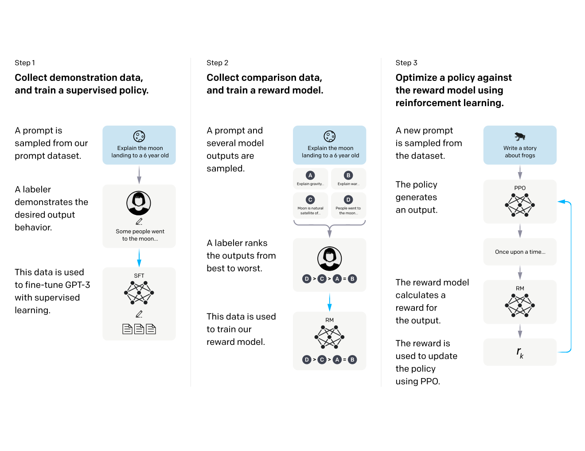
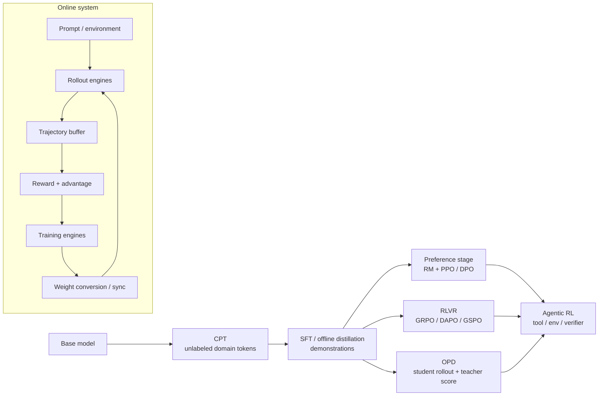

# 后训练：从训练目标到 rollout–train 系统

Post-Train 不是某一个 RL 算法，而是基础模型预训练之后，围绕「知识补齐、行为模仿、偏好对齐、可验证能力与 agent 行为」持续改变模型分布的一组训练阶段。本章沿两条线索展开：

1. **算法线**：CPT、SFT、preference optimization、PPO、GRPO/Dr.GRPO、DAPO、GSPO、CISPO、REINFORCE++、OPD 分别在优化什么；
2. **系统线**：这些目标如何落到 rollout、reward、log-prob、advantage、train、weight sync 构成的闭环上，以及如何处理长尾、训推不一致、权重重排和 agentic workload。

> 图：经典 RLHF 流程将 SFT、reward model 与 PPO 串成闭环；今天的 RLVR、GRPO 和 OPD 替换了其中部分组件，但「数据从哪里来、谁给学习信号、是否要在线 rollout」仍是最稳固的分类轴（Ouyang et al. 2022, Fig. 2；[arXiv:2203.02155](https://arxiv.org/abs/2203.02155)）。

## 前置知识

本章假设读者具备以下背景。其中强化学习部分会在算法篇从头定义，不要求预先学过。

- 知道自回归模型给定 token 序列 `tokens: [T]` 会产生 `logits: [T, V]`，并熟悉 softmax、cross entropy 与 autograd；可先读 [torch compute ops](../torch/02_compute_ops.md) 与 [autograd](../torch/03_autograd.md)。一个 step 从数据、loss 到权重更新的完整概念流水线，以及 pretrain / SFT / RL 三种模式如何共享同一套训练底座（loss mask 在三种模式下各自怎么组织），见 [训练全景：从数据到权重更新](../train/00_overview.md)。
- 知道 DP/TP/PP/CP 的语义；大模型训练与变长序列的并行细节见 [parallel](../parallel/README.md)。
- 知道 serving 中 prefill、decode、KV cache 和 continuous batching 的最小语义。若 serving 章尚未补齐，本文会在使用处给出最小定义。
- state/action/return/advantage、on-policy/off-policy 等强化学习概念会在算法篇重新定义，不要求预习。

## 全景图

在这张图里，算法这条线决定的是 `B → A → T` 这一段的数学，也就是拿到 reward 之后怎样算出 advantage、怎样构造 loss；infra 这条线决定的是整个环路能不能同时满足吞吐、显存、时延、staleness 和数值正确性这些工程约束。一个常见的误区是只比较不同算法的 policy loss，却忽略了 rollout policy、old log-prob、路由方式、权重版本和 loss mask 这些细节——而这些恰恰构成了 LLM RL 里最容易出问题、也最容易被忽视的另一半。

## 阅读顺序

下面这张表列出了本章所有文档的阅读顺序，以及每一篇具体回答的问题，可以按需查阅，也可以顺序通读。

| 顺序 | 文档 | 回答的问题 |
| --- | --- | --- |
| 1 | [算法 overview](algorithms/README.md) | 各训练阶段的数据、目标、loss、在线程度和模型组件有何差异？ |
| 2 | [CPT、SFT 与 preference learning](algorithms/01_cpt_sft_preference.md) | next-token loss 如何变成 domain adaptation、instruction tuning、RM/DPO？ |
| 3 | [PPO](algorithms/02_ppo.md) | actor/critic/reference/reward 四类模型为什么出现，GAE 和 clipped objective 如何衔接？ |
| 4 | [GRPO 家族](algorithms/03_grpo_family.md) | GRPO 怎样去掉 critic；Dr.GRPO、DAPO、GSPO、CISPO、REINFORCE++ 分别修了什么？ |
| 5 | [On-Policy Distillation](algorithms/04_opd.md) | OPD 为什么既像 distillation 又像 on-policy RL？sampled KL 与 V4 的 full-vocab / 多专家合并差在哪？ |
| 6 | [RL infra 总览](infra/README.md) | 算法张量如何映射到真实框架，系统瓶颈落在哪里？ |
| 7 | [框架映射](infra/01_framework_mapping.md) | slime 中 Sample、rollout、log-prob、advantage、loss 分别在哪一层？ |
| 8 | [rollout–train 架构](infra/02_rollout_train_architecture.md) | 同步闭环各阶段是什么，colocated 与 disaggregated 如何取舍？ |
| 9 | [async 与 partial rollout](infra/03_async_partial_rollout.md) | 如何系统性消除变长/工具调用造成的长尾 bubble？ |
| 10 | [训推一致性与 determinism](infra/04_consistency_determinism.md) | on-policy 为何会被两套 engine 悄悄破坏，R3 和 batch-invariant kernel 各解决哪一层？ |
| 11 | [权重转换与同步](infra/05_weight_sync.md) | Megatron shard 怎样变成 serving shard；NCCL、CUDA IPC、disk delta、Checkpoint Engine 如何选？ |
| 12 | [Agentic RL infra](infra/06_agentic_rl.md) | 多轮、tool/env、sandbox、branch/compact 如何变成 token-correct trajectory？ |

## 重点主线

在进入具体文档之前，先挑出几条会反复出现的主线，帮助建立一个整体的印象。

### 1. 长尾是系统性问题

同步 rollout 的 step 时间，近似等于这一批 trajectory 里耗时最长的那一条，也就是说它取决于分布的尾部而不是均值。长 CoT、tool 调用重试、sandbox 启动、judge 打分延迟这些因素叠加在一起，会共同形成一个很重的尾部分布。应对办法不是某一个单一手段，而是一整套层层递进的机制：continuous batching、over-provision、partial recycle、pipeline async，一直到 fully async，并且需要用 policy version、importance sampling 或者 loss mask 来管理这些手段带来的 staleness。

### 2. 相同权重不等于相同策略

训练和推理两套 engine，在 attention backend、reduction tree、量化方式、top-p 的支持程度、MoE top-k 的 tie-breaking 规则、动态 batch 这些细节上都可能不一样，而这些差异都会改变 token 的概率。要理清楚这个问题，可以把它拆成三层来看：

- **可复现性**：同一个 engine、同一份输入，能否重复得到相同的结果；
- **batch invariance**：结果是否独立于同一批次里的其他请求以及 batch 的形状；
- **train–rollout alignment**：训练和推理这两套 engine 算出的 log-prob 与 MoE route 是否一致。

### 3. 权重更新是在线数据面

每一个 RL step 都可能需要更新 actor 的权重，这件事不应该被当作偶尔发生一次的 checkpoint 保存来看待，更准确的理解是：它是一条从 training layout 经过 canonical names/layout 到 serving layout 的在线数据通路，而且更新频率很高。转换格式、gather 分片、跨机传输、加载进 serving engine、失效旧缓存，以及维护 version barrier，这些步骤全部处于关键路径上，任何一步慢下来都会拖慢整个训练循环。

### 4. Agentic RL 的训练对象是 trajectory

工具返回的 observation、环境输出的内容，以及重新渲染出来的 chat template，都不应该被自动当作模型自己生成的内容去计算梯度。一个可靠的系统必须保留模型实际采样时的 token ID 和 log-prob，用 `loss_mask` 明确标出哪些 token 属于 action、需要计算梯度，并且在出现分支、subagent 调用、context compaction 之后，依然能维持 reward 和 rollout 之间的对应关系不错乱。

## 代码事实来源与版本

本章的代码事实主要对齐两个上游仓库的固定版本：

- [[slime:]]：THUDM/slime，commit `41014d1f29e201137fdffce737bb8bac65bc5219`（2026-08-16）；Megatron training + SGLang rollout 的完整 RL loop；
- [[checkpoint-engine:]]：MoonshotAI/checkpoint-engine，commit `d1de07b3aacff34050d09c3efa093f9a2fcdcf73`（2026-08-12）；在线 serving weight update 的 parameter-server / broadcast / P2P 实现。

论文里的结论和工程实现会分开标注，这是因为 fully-async、delta sync、GLM-5 训练与推理逐层对齐这些方向仍在快速演进当中，不应该把某一个 commit 里观察到的支持情况，直接当作所有框架、所有模型、所有硬件都已经支持的结论。

## 术语约定

下面这张表统一了本章会反复用到的几个术语，后续文档默认使用这套约定。

| 术语 | 本章含义 |
| --- | --- |
| trajectory / rollout | 从 prompt 或 environment reset 开始，由 policy 采样得到的一段交互；可含多个 turn |
| rollout policy $\mu$ | 实际生成数据的分布；同步 on-policy 时希望它等于本 step 的 old policy $\pi_{\text{old}}$ |
| train policy $\pi_\theta$ | 当前反向传播所用 policy |
| reference policy $\pi_{\text{ref}}$ | 固定或慢更新的行为锚点，用于 KL regularization；不是 $\pi_{\text{old}}$ 的同义词 |
| reward $R$ | sequence/episode 或 token/process 级标量反馈 |
| advantage $\hat{A}_t$ | action 相对 baseline 的 credit；正值提高 action probability，负值降低 |
| staleness | trajectory 生成时权重版本落后于训练当前版本的程度 |
| colocated | training 与 rollout 复用同一批 GPU，通常分时占用/交换显存 |
| disaggregated | training 与 rollout 使用独立 GPU pool，可并行但需跨 pool 同步权重 |

---

讲完这些背景和主线，下一个自然的问题是：各个具体算法到底在优化什么？[算法 overview](algorithms/README.md) 会用一个统一的 weighted log-likelihood 视角，把本章提到的全部 post-training 方法放在同一个框架下比较。
