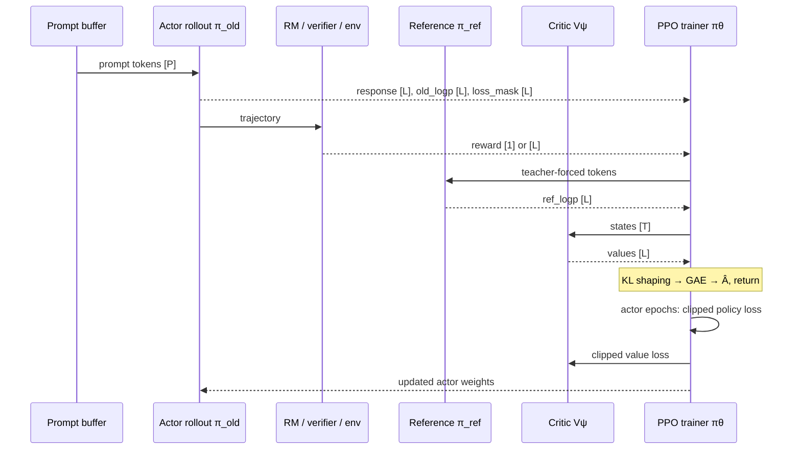

# PPO：从 sequence reward 到 clipped policy update

## 前置知识

本篇介绍 PPO：它把 sequence reward 转成 token 级 advantage，并用 clipped objective 限制每次更新的幅度。PPO 也是理解后续 GRPO 家族的基准。阅读前建议：

- 已读[算法 overview](README.md)，能区分 rollout $\mu$、old policy $\pi_{\mathrm{old}}$ 和 reference $\pi_{\mathrm{ref}}$。
- 知道 SFT 的 masked NLL；PPO 最终仍通过 $\log\pi_\theta(\text{action}\mid\text{state})$ 反向传播。

## 1. 把语言生成写成 MDP

要把 PPO 用到语言模型上，先要把整个生成过程写成一个 MDP。对一个 prompt $x$ 来说：

- state $s_t=(x, a_{<t})$ 是当前 token prefix；
- action $a_t$ 是从 vocabulary $V$ 选择的下一个 token；
- policy $\pi_\theta(a_t\mid s_t)$ 是 softmax 后的 token probability；
- episode 在 EOS、length cap 或 environment terminal 时结束；
- reward 可只在末尾给 $R_L$，也可由 process RM/environment 每步给 $r_t$。

在这套设定下，训练目标就是最大化 expected return $J(\theta)=\mathbb{E}_{\tau\sim\pi_\theta}[\sum_t \gamma^t r_t]$。但 action 是离散采样出来的，没法直接对它求导，因此要借助 score-function identity 这个技巧：

$$
\nabla_\theta J
=\mathbb E\left[\sum_t \hat A_t\nabla_\theta\log\pi_\theta(a_t\mid s_t)\right].
$$

这里的关键在于，采样这个操作本身不可微，但 $\log\pi_\theta$ 是可微的；reward 和 advantage 通常都会加上 stop-gradient，不参与求导。引入 baseline 不会改变这个梯度估计的期望值，只会降低它的方差。

## 2. PPO 的四类模型

PPO 之所以看起来比 SFT 复杂得多，一个直接的原因是它同时涉及四类模型，各自的更新方式和作用都不一样：

| 角色 | 是否更新 | 输出 | 作用 |
| --- | --- | --- | --- |
| actor $\pi_\theta$ | 是 | token logits | 生成与被优化的 policy |
| old actor $\pi_{\mathrm{old}}$ | 一个 rollout/update window 内冻结 | sampled token old log-prob | importance ratio / trust region |
| critic $V_\psi(s_t)$ | 是 | $[L]$ values | baseline 与 bootstrap，降低 advantage 方差 |
| reference $\pi_{\mathrm{ref}}$ | 通常冻结 | reference log-prob | 防止 policy 偏离 SFT 行为过远 |
| reward model/verifier/env | 通常冻结/外部 | scalar 或 process reward | 指定任务目标 |

$\pi_{\mathrm{old}}$ 和 $\pi_{\mathrm{ref}}$ 在训练刚开始时可能是同一份权重初始化出来的，但它们此后的生命周期完全不同：每次 rollout 开始前，old policy 都会同步成当前的 actor 权重；而 reference 往往在整个训练过程中保持不变。

## 3. Return、TD residual 与 GAE

critic 的任务是预测 $V_\psi(s_t)$，据此可以定义一步的 TD residual：

$$
\delta_t=r_t+\gamma V_\psi(s_{t+1})-V_\psi(s_t).
$$

Generalized Advantage Estimation：

$$
\hat A_t^{\mathrm{GAE}(\gamma,\lambda)}
=\sum_{l=0}^{L-t-1}(\gamma\lambda)^l\delta_{t+l},
\qquad
\hat G_t=\hat A_t+V_\psi(s_t).
$$

当 $\lambda=1$ 时，这个估计接近 Monte Carlo，bias 小但 variance 大；当 $\lambda=0$ 时，它接近一步 TD，情况正好相反。到达 terminal 状态之后，bootstrap value 要设为 0；但如果是因为 length truncation 而不是任务本身结束，是否要当作 terminal 来处理，必须按照 environment 的实际语义来判断，不能一概而论地把因为达到 max token 而被截断的情况都当作任务失败。

如果 task reward 只出现在最后一个 token 上，再叠加 reference KL shaping，就可以写成：

$$
r_t^{\mathrm{shaped}}
=-\beta\widehat{D}_{KL,t},\quad t<L;
\qquad
r_L^{\mathrm{shaped}}=R-\beta\widehat{D}_{KL,L}.
$$

slime 的 PPO 实现路径正是这样做的：逐 token 加上 `-kl_coef·KL`，再在最后一个 token 上加上 sequence reward，随后送入 batched GAE 计算，具体在 [[slime:slime/backends/megatron_utils/loss.py#L769-L781]]；考虑 CP 切分的 GAE 实现则在 [[slime:slime/utils/ppo_utils.py#L478-L607]]。

## 4. Clipped policy objective

既然 rollout 出来的 action 来自 $\pi_{\mathrm{old}}$，而当前 epoch 正在优化的是 $\pi_\theta$，两者之间的差距就需要用 token importance ratio 来衡量：

$$
r_t(\theta)=\exp[\ell_{\theta,t}-\ell_{\mathrm{old},t}]
=\frac{\pi_\theta(a_t\mid s_t)}{\pi_{\mathrm{old}}(a_t\mid s_t)}.
$$

PPO 要最大化的是下面这个 surrogate 目标：

$$
L^{CLIP}
=\mathbb E_t\left[
\min\left(r_t\hat A_t,
\operatorname{clip}(r_t,1-\epsilon,1+\epsilon)\hat A_t\right)
\right].
$$

工程实现里通常是最小化它的负值。这个 clip 操作起到的作用是：当 $\hat A>0$ 时，如果 ratio 已经把 action probability 提得太高，再继续提高带来的收益会被截断；当 $\hat A<0$ 时，同样的截断也发生在过度降低 probability 的方向上。需要注意的是，这个 clip 并不是一个硬约束——其他 batch 上的梯度仍然可能让整体的 KL 越变越大，所以还需要额外监控 KL、做 early stop，以及跟踪 clip fraction 这几个指标。

slime 里的做法是用 `ppo_kl=old_log_prob-new_log_prob` 存下 log-ratio 的负值，再用 `ratio=exp(-ppo_kl)` 算出真正的 ratio，代码见 [[slime:slime/utils/ppo_utils.py#L124-L148]]。这里需要留意一个命名上的细节：变量虽然叫 KL，但它实际计算的是 sampled action 上的 log-ratio，并不是完整 vocabulary 上的 KL 散度。

## 5. Critic loss、entropy 与总 loss

PPO 常用 clipped value loss：

$$
V^{clip}_t=V^{old}_t+\operatorname{clip}(V_t-V^{old}_t,-\epsilon_v,\epsilon_v),
$$

$$
L_V=\frac12\max[(V_t-\hat G_t)^2,(V^{clip}_t-\hat G_t)^2].
$$

slime 的具体实现见 [[slime:slime/backends/megatron_utils/loss.py#L1176-L1230]]。entropy bonus 写成 $-c_H H(\pi_\theta(\cdot\mid s_t))$，计算它需要完整的 vocabulary softmax，在 TP 切分的情况下不能只用 local vocabulary 算出来的结果凑数。slime 为此专门写了一个 vocab-parallel 的 log-prob/entropy custom autograd，在 [[slime:slime/utils/ppo_utils.py#L187-L336]]：先跨 TP 求出 global 的 max 和 sum，据此构造出 target log-prob，反向传播时再把梯度写回各自的 local logits。

把这些部分放在一起，概念上的总目标可以写成：

$$
\mathcal L=\mathcal L_{policy}+c_V\mathcal L_V-c_H\mathcal H+\beta\mathcal L_{KL}.
$$

actor 和 critic 可以是两个独立的模型，各自用不同的 optimizer、按不同的 step 更新，但这并不意味着它们一定要跑在不同的 GPU 上。

## 6. 一次 PPO iteration 的张量通路

下面这张时序图展示了一次 PPO iteration 里，数据在 actor、reward model、reference、critic 和 trainer 之间是怎样流动的。

要让这条通路真正可用，至少需要保存下面这些字段：`tokens`、`response_lengths`、`loss_masks`、`old/rollout_log_probs`、`rewards`、`values`、`ref_log_probs`、`policy_version`。如果只保存生成的文本而没有保存 action 的 log-prob，事后就没有办法可靠地重建出当时的 behavior probability。

## 7. PPO 在 slime 中的实现

slime 目前的 PPO 路径里，有几个值得注意的真实设计选择：

1. `--advantage-estimator ppo` 会令 `args.use_critic=True`：[[slime:slime/utils/arguments.py#L1904]]；
2. actor 与 critic 建立不同 training group，但 placement group 复用 actor GPU：[[slime:slime/ray/placement_group.py#L186-L224]]；
3. 主 loop 先异步启动 critic train/value，再把 value ref 交给 actor：[[slime:train.py#L61-L69]]；
4. critic 与 actor 同 GPU 时需要轮流 wake/offload，换来无需永久预留 critic GPU；
5. policy 与 value loss 使用同一 dispatch stack，但各自模型/role config 可有不同 checkpoint 与 LR。

需要强调的是，这些都属于资源层面的工程选择，并不是 PPO 数学本身提出的要求。如果集群规模足够大，完全可以把 actor、critic、RM、ref 这四类角色分别部署到独立的 GPU 上并行 pipeline，只要把 version 和数据依赖关系维护清楚就行。

## 8. 数值与系统陷阱

把上面的理论落到实际系统里，还有几类容易被忽略的陷阱。

### 8.1 rollout log-prob 与训练重算的 log-prob

如果 rollout engine 和 training engine 是两套不同的实现，即便用的是完全相同的权重，rollout 时算出来的 $\ell_{\mathrm{rollout}}$，和训练时用 teacher forcing 重算出来的 $\ell_{\mathrm{train}}$，也可能对不上。如果把后者当成 behavior log-prob 来用，会在不知不觉中破坏 on-policy 这个假设。这一点在[训推一致性](../infra/04_consistency_determinism.md)一篇里会展开讲。

### 8.2 top-p 与 support 的变化

如果 rollout 是从 nucleus $S_t$ 里采样出来的，那么真正的 behavior distribution 其实是在 $S_t$ 上重新归一化之后的 $\mu_{\text{top-}p}$，而不是原始的 $\pi$。要算出严格意义上的 ratio，需要保存下每一步的 nucleus 集合或者 rollout 时的 log-prob。slime 的做法是在 [[slime:slime/ray/rollout.py#L832-L846]] 保存下压平之后的 top-p token ids 和对应的 offsets，然后在训练侧计算 log-prob 时把这个 support 重新构造出来。

### 8.3 advantage whitening 的通信域

advantage whitening 时，应该只统计有效的 response token，而且要跨所有参与同一个 optimizer step 的 DP×CP ranks 做聚合。如果 padding 或者某些 CP rank 里没有有效 token、response 长度又参差不齐，这些因素都会改变算出来的 mean 和 std。如果每个 rank 只在本地做 whitening，实际上就是在让不同 rank 优化不完全相同的目标。

### 8.4 多 epoch 与 off-policy 程度

对同一批 rollout 数据反复做多个 mini-epoch，可以更充分地利用这些成本高昂的数据，但代价是 $\pi_\theta$ 会越来越偏离 $\pi_{\mathrm{old}}$，随之而来的是 ratio variance 和 clip fraction 一起上升。PPO 的 clip 机制解决的是有节制的数据复用问题，而不是让复用变得没有上限。

## 9. Critic-free 变体的兴起

对 LLM 的 outcome reward 来说，训练一个 critic 本身代价不小：需要额外维护一个同等规模的模型，value head 的精度又比较敏感，长序列上的 credit assignment 依然是个难题。数学、代码这类任务恰好可以对同一个 prompt 采样多条 response，用组内的 reward 直接当 baseline，绕开 critic，这也是 GRPO 这一系列方法看起来更简洁的原因。不过这不代表 critic-free 就总是更好：

- group size 小或 reward 稀疏时 baseline 噪声大；
- agent 长 horizon 有中间状态与不同 termination，critic/process value 仍可能有价值；
- PPO 对通用 learned reward、dense process reward 与复杂 environment 更自然。

## 参考

- Schulman et al., [PPO](https://arxiv.org/abs/1707.06347), 2017.
- Schulman et al., [GAE](https://arxiv.org/abs/1506.02438), 2015.
- Ouyang et al., [InstructGPT](https://arxiv.org/abs/2203.02155), 2022.

---

**下一篇**：接下来 [GRPO 家族](03_grpo_family.md) 会具体展开 critic-free RL 是怎么做的，以及 DAPO、GSPO、CISPO 分别在 baseline、ratio、clip 和 reducer 这几个环节上做了哪些不同的修正。
