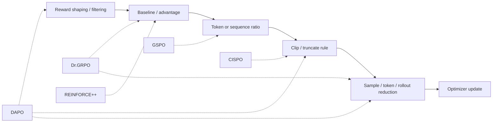
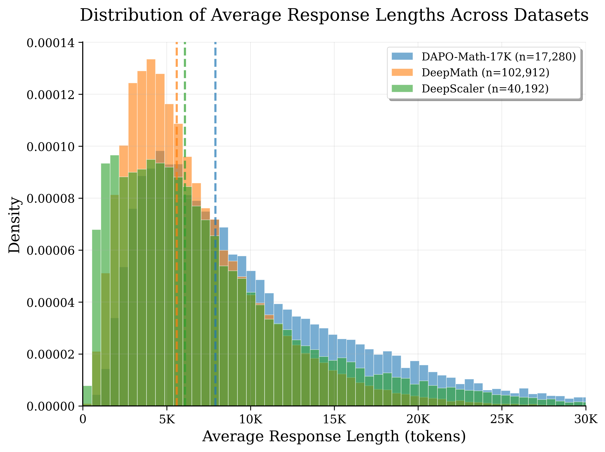

# GRPO 及其变种：baseline、ratio、clip 与 reducer

## 前置知识

本篇展开 GRPO 及其主要变种。它们之间的差别不在 policy gradient 本身，而在 baseline、ratio 粒度、clip 规则与 loss reducer 四个维度上。阅读前建议：

- 已读 [PPO](02_ppo.md)，知道 policy gradient、importance ratio 与 clipping。
- 知道 $G$ 条 response 共享同一个 prompt，reward 可以是 verifier 给出的 sequence scalar。

## 1. GRPO：用组内候选代替 critic

GRPO 的做法是：对同一个 prompt $x$，从 old policy 里采样出 $G$ 条 response $y_i$，分别得到 reward $R_i$。经典 GRPO 的 group advantage 定义为：

$$
\hat A_i=\frac{R_i-\bar R}{s_R+\varepsilon},\quad
\bar R=\frac1G\sum_jR_j,
$$

算出 $\hat A_i$ 之后，把它原样广播到这条 response 里每一个有效 token 上；policy objective 依然沿用逐 token 的 ratio 形式：

$$
\mathcal L_{GRPO}
=-\frac1G\sum_i\frac1{|y_i|}
\sum_t m_{i,t}\min[r_{i,t}\hat A_i,
\operatorname{clip}(r_{i,t},1-\epsilon,1+\epsilon)\hat A_i].
$$

原始论文里还可以额外对 reference 加一个 KL regularization 项。GRPO 相对 PPO 最大的改变是去掉了 critic 和 value loss，代价则是每个 prompt 需要多采样几条 response，credit 只能落在 outcome 这一级别，而且一旦组内所有 response 的 reward 完全相同，算出来的 $\hat A$ 就会变成 0，这一组数据实际上就白采样了。

slime 的 group normalization 实现在 [[slime:slime/ray/rollout.py#L722-L745]]：先减去 group mean，GRPO、GSPO、CISPO 可以选择性地再除以 std；训练侧则把这个 scalar reward 广播成 response-length 的 tensor，实现在 [[slime:slime/utils/ppo_utils.py#L361-L368]]。

## 2. GRPO 变种的改动轴



看完这张图就能明白，为什么不能简单地问“这个算法到底是 GRPO 还是 DAPO”这样的问题。一个实际的训练 recipe，完全可能同时用上 DAPO 的 dynamic sampling、GSPO 的 sequence ratio、OPD 的 teacher signal，再加上 rollout-level 的 reducer。因此更合适的做法是把 baseline、ratio、clip、reducer 这几个轴分别记录清楚，而不是笼统地给整个 recipe 安一个算法名字。

## 3. Dr.GRPO：去掉 std 与 length bias

Group std normalization 有一个副作用：两组样本即便 reward 的差距相同，只要 group variance 不同，算出来的 advantage scale 也会不一样；而且当一组内的 reward 几乎相同时，除以一个很小的 std 反而会放大噪声。Dr.GRPO（来自 Understanding R1-Zero-Like Training 这篇论文）针对这个问题提出了两处修正：

1. advantage 用 $R_i-\bar R$，不除 group std；
2. loss 用固定/全局 denominator，避免每条 response 先按自身长度平均造成 length bias。

举一个直观的例子：假设长、短两条 response 里都含有同一个坏模式。在 sample mean 的计算方式下，长 response 里每个 token 分到的权重更小，坏模式对总 loss 的贡献也就被稀释了；如果换成固定 max-length 或者 token/rollout 级别的 reducer，这种偏置就会被改变。需要提醒的是，具体用哪种 reducer 必须和论文或者配置对齐，仅仅“关闭 std 归一化”并不等同于完整实现了 Dr.GRPO 的修正。

在 slime 里，是否做 group std normalization 由 `--no-grpo-std-normalization` 这个参数控制；policy loss 还支持通过 `--custom-pg-loss-reducer-function-path` 自定义 reducer 函数，入口分别见 [[slime:docs/zh/get_started/customization.md#L20-L23]] 与 [[slime:slime/utils/arguments.py#L1081-L1089]]。

## 4. DAPO 的四项技术

DAPO 全称 Decoupled Clip and Dynamic sAmpling Policy Optimization，原论文里明确包含下面四项改动。

### 4.1 Clip-Higher

做法是把原本对称的 $\epsilon$ 拆分成一个较小的 $\epsilon_{\text{low}}$ 和一个更大的 $\epsilon_{\text{high}}$：

$$
\operatorname{clip}(r,1-\epsilon_{\text{low}},1+\epsilon_{\text{high}}).
$$

这样做的动机是：一个概率本来就很低的 exploration token，即便 ratio 乘上 `1.2`，实际提升的概率值仍然很小，被对称 clip 卡住并不划算。把上界调高，可以给那些带正 advantage 的低概率 action 更多提升空间，同时保留下界，避免概率被过快地压到接近零。slime 的 `compute_policy_loss` 支持传入独立的 `eps_clip` 和 `eps_clip_high`，实现见 [[slime:slime/utils/ppo_utils.py#L124-L148]]。

### 4.2 Dynamic Sampling

如果一组 `G` 条 response 全对或者全错，组内算出来的 advantage 就会全部为零，这一组数据实际上没有提供任何学习信号。DAPO 的做法是过采样，并且过滤掉 $\mathrm{std}(R)=0$ 的 group，一直采样到有效的 prompt 数达到 target batch 为止：

```text
submit N' > N groups
while accepted < N:
    first completed group -> verify reward
    if 0 < pass_count < G: accept
    else: submit replacement
```

slime 在 [[slime:slime/rollout/sglang_rollout.py#L393-L451]] 里用 `over_sampling_batch_size`、dynamic filter 和 first-completed loop 实现了这套逻辑，对应的 filter hook 位于 [[slime:slime/rollout/filter_hub/dynamic_sampling_filters.py]]。这既是一个算法层面的数据选择问题，同时也是一个系统调度问题，而且会和 partial rollout 共用同一套 over-provision 机制。

### 4.3 Token-level policy gradient loss

DAPO 用整个 batch 里所有有效 token 的总数作为 denominator：

$$
\mathcal L=-\frac{\sum_{i,t}m_{i,t}L_{i,t}}
{\sum_{i,t}m_{i,t}}.
$$

和“每条 sequence 先算 mean”的做法相比，这样一来长 response 拿到的总权重更大。论文认为这样处理，对 long-CoT 里出现的模式做强化或者惩罚会更直接；但这并不是一条放之四海而皆准的无偏原则，实践中仍然需要结合 length distribution 和 reward hacking 的监控数据一起看。

### 4.4 Overlong reward shaping

如果对超长输出做硬截断，可能会把一段本来推理正确、只是差一点没写完的 reasoning 直接判定为失败，这会给训练带来额外的 reward noise。DAPO 先尝试了 overlong filtering，后来又换成一种 soft punishment：当输出长度接近 max length 时，reward 线性地变得越来越负。这里的核心原则是，reward shaping 时必须把 environment 本身导致的失败，和纯粹因为 infrastructure 截断导致的失败区分开。



> 图：数学/代码/agent rollout 的 response length 呈显著长尾；这既影响 DAPO 的 token reducer/overlong reward，也决定 system step 的 straggler bubble（APRIL authors 2025；[arXiv:2509.18521](https://arxiv.org/abs/2509.18521)）。

## 5. GSPO：把 ratio 提升到 sequence level

GRPO 和 PPO 用的 token ratio 有一个问题：同一条 response 内部，不同 token 完全可能处于不同的 clip 状态，一些被截断了，另一些没有。GSPO 针对这一点，改为定义 sequence likelihood ratio 的几何平均：

$$
r_i^{seq}(\theta)
=\left(\frac{\pi_\theta(y_i\mid x)}{\pi_{old}(y_i\mid x)}\right)^{1/|y_i|}
=\exp\left(\frac1{|y_i|}\sum_t[\ell_{\theta,i,t}-\ell_{old,i,t}]\right).
$$

这样一来，同一条 response 里的每个 token 都共享相同的 ratio 和 clip 决策，优化的单位和 sequence-level 的 reward 更加一致，也减少了个别极端 token ratio 带来的干扰。这里的长度归一化（取 $1/|y_i|$ 次方）是为了避免原始的 sequence probability 随着长度增长而指数级缩小。

slime 的 `compute_gspo_kl` 会先对每个样本的 `old_logp-new_logp` 做 masked token mean，再把结果 expand 回原来的 local token shape，实现见 [[slime:slime/utils/ppo_utils.py#L95-L121]]；相应的 policy dispatch 逻辑在 [[slime:slime/backends/megatron_utils/loss.py#L992-L1033]]。

GSPO 论文里还提出了 routing replay，用来保证同一次训练的 forward 和 backward 里，MoE 的 expert route 是一致的。这一点要和跨 engine 的 R3 区分开，两者并不是同一回事：

- training routing replay：训练 log-prob forward 记录 route，policy backward 重放；
- rollout routing replay（R3）：SGLang rollout 记录 route，Megatron train forward/backward 都重放。

详见[训推一致性](../infra/04_consistency_determinism.md)。

## 6. CISPO：截断 IS 权重

PPO 做完 clip 之后，那些 ratio 超出区间、又恰好处于不利方向的 token，实际上拿到的梯度是零。CISPO 的解决办法是引入一个带 stop-gradient 的 truncated IS weight：

$$
\mathcal L_{CISPO}
=-\operatorname{sg}(\operatorname{clip}(r_t,1-\epsilon_l,1+\epsilon_h))
\hat A_t\log\pi_\theta(a_t\mid s_t).
$$

这里 ratio 依然会被 clip 用来控制数值的 scale，但梯度显式地通过 $\log\pi_\theta$ 传递，所以即便是被 clip 过的 token，也仍然会对参数更新有贡献，不会像 PPO 那样被完全截断掉梯度。slime 的实现和公式逐字对应，见 [[slime:slime/utils/ppo_utils.py#L151-L171]]；canonical 版本的 CISPO 通常会关闭 lower bound，代码注释里也提醒需要设置 `eps_clip>=1.0`。

## 7. REINFORCE++、RLOO 与 critic-free baseline

### REINFORCE++

先给 sequence reward 加上 token 级别的 KL penalty，再从后往前算出 discounted return：

$$
G_t=\sum_{l=t}^{L}\gamma^{l-t}r_l,
$$

接下来再做 whitening、clipping 这类稳定化处理，整个过程不需要 value model。slime 里考虑 CP 切分的 return 重建逻辑见 [[slime:slime/utils/ppo_utils.py#L371-L447]]。

### REINFORCE++ baseline / RLOO

group baseline 也可以用同一组里其他 $G-1$ 个候选的 reward 来构造：

$$
b_i=\frac1{G-1}\sum_{j\ne i}R_j,\qquad \hat A_i=R_i-b_i.
$$

这种 leave-one-out 的构造方式，好处是避免把样本自己的 reward 混进它自己的 baseline 里。不同开源实现在 whitening、KL 放置位置、clip 方式上的组合往往并不相同，因此不能只凭一个算法名字去反推它具体用的是哪个公式，还是要去看实现代码。

## 8. Off-policy correction：TIS、OPSM 与 staleness

无论是 async、partial rollout，还是对同一批数据反复训练多次，都会导致 $\mu\ne\pi_\theta$。最直接的修正办法是 sampled token 上的 importance sampling：

$$
w_t=\frac{\pi_\theta(a_t|s_t)}{\mu(a_t|s_t)},
\quad \bar w_t=\operatorname{clip}(w_t,w_{min},w_{max}).
$$

TIS，也就是 Truncated Importance Sampling，通过截断来限制 variance。OPSM 则更进一步，根据 sequence 的 divergence 和 advantage，有选择性地 mask 掉风险较高的 negative sequence；slime 的 OPSM 实现在 [[slime:slime/utils/ppo_utils.py#L54-L92]]。需要注意的是，这些技术全都依赖真实的 rollout log-prob，如果 train 和 rollout 之间 tokenizer、top-p support 或者 route 本身就不一致，那么 ratio 里混进去的其实是 engine mismatch，而不仅仅是 policy staleness 这么简单，单靠 off-policy correction 是修不好的。

## 9. 统一对比

把上面提到的方法放在一张表里做个对比：

| 方法 | baseline | ratio 粒度 | clipped token 是否继续有梯度 | 默认 reducer 关注 | 主要问题 |
| --- | --- | --- | --- | --- | --- |
| GRPO | group mean/std | token | PPO 饱和侧通常否 | sample mean | critic 成本 |
| Dr.GRPO | group mean，不除 std | token | 同 PPO | fixed/rollout | std 与 length bias |
| DAPO | group relative | token | 同 PPO | token mean | entropy、零梯度 group、长 CoT |
| GSPO | group relative | sequence geometric mean | sequence 统一 clip | sample/sequence | token ratio variance、MoE 稳定性 |
| CISPO | group relative | token | **是** | configurable | clip-induced token starvation |
| REINFORCE++ | return/whitening | 可不依赖 old ratio的纯 on-policy形式 | N/A 或配 PPO clip | token return | 无 critic的稳定 return |

## 10. 实践选择与消融

实践中比较稳妥的做法是，先建立一个可复现的 GRPO baseline，再根据观察到的具体症状逐项添加改动：

- zero-std group 多：dynamic sampling；
- entropy 快速塌缩且 up-clip 多：clip-higher；
- response length 强烈漂移：同时比较 sample/token/rollout reducer，不要只调 length reward；
- $\pi_{\mathrm{train}}/\mu$ extreme ratio 多：先查[一致性](../infra/04_consistency_determinism.md)，再考虑 GSPO/TIS/CISPO；
- MoE route mismatch：R3，而不是期望 sequence clip 修复根因；
- rollout 最慢样本拖住 step：这是 [Async RL 与 partial rollout](../infra/03_async_partial_rollout.md) 要解决的问题。

每一次消融实验，都应该同时报告 wall-clock 时间、sample/token 数量、有效 group 数，以及最终的指标表现，不然像 dynamic sampling 或者 partial rollout 这类会带来额外 generation 开销的改动，就没有办法在同一个基准上公平比较。

## 参考

- Shao et al., [DeepSeekMath / GRPO](https://arxiv.org/abs/2402.03300), 2024.
- Liu et al., [Understanding R1-Zero-Like Training / Dr.GRPO](https://arxiv.org/abs/2503.20783), 2025.
- Yu et al., [DAPO](https://arxiv.org/abs/2503.14476), 2025.
- Zheng et al., [GSPO](https://arxiv.org/abs/2507.18071), 2025.
- MiniMax team, [MiniMax-M1 / CISPO](https://arxiv.org/abs/2506.13585), 2025.
- Hu et al., [REINFORCE++](https://arxiv.org/abs/2501.03262), 2025.

---

**下一篇**：讲完 GRPO 家族这一整套变体，下一篇转向 [On-Policy Distillation](04_opd.md)，看它怎样用 student 自己的 rollout 加上 teacher 的 dense log-prob，把 imitation 和 online search 这两件事接到一起；DeepSeek-V4 又是怎样进一步用 multi-teacher 的 full-vocab OPD，替换掉原来的 mixed RL 方案的。
