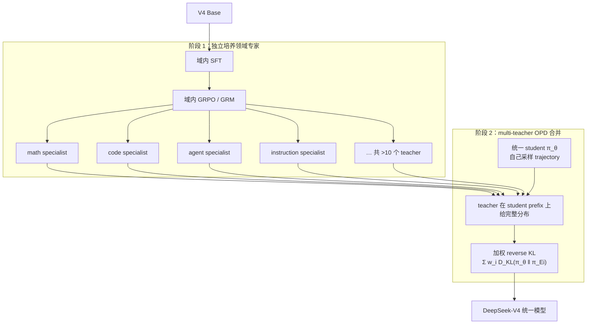
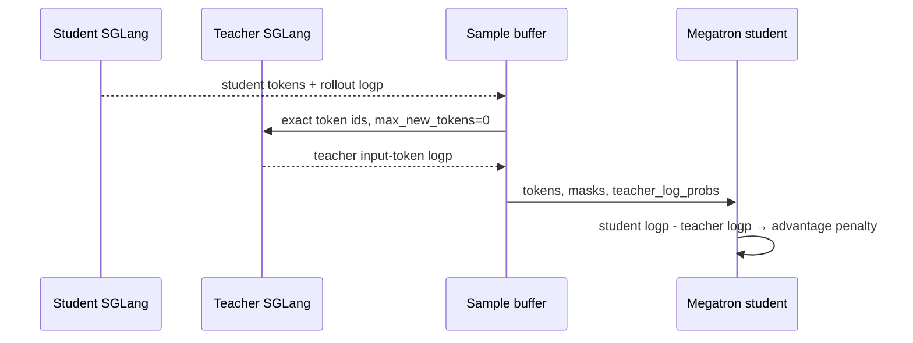

# On-Policy Distillation

## 前置知识

本篇介绍 On-Policy Distillation（OPD）：trajectory 由 student 自己采样，teacher 在 student 实际访问到的状态上给出评分。它因此同时具有 distillation 与 on-policy RL 的性质，也是 DeepSeek-V4 合并领域专家的手段。阅读前建议：

- 已读 [CPT/SFT](01_cpt_sft_preference.md)，知道 offline distillation 的 trajectory 来自 teacher/data。
- 已读 [PPO](02_ppo.md)，知道 on-policy 指实际 action 来自当前 behavior policy。
- 已读 [GRPO 家族](03_grpo_family.md)，知道 group-relative advantage 是 outcome RL 的一条主路。

## 1. 关键区别：trajectory 由谁生成

先固定一下记号：student 记为 $\pi_\theta$，teacher 记为 $\pi_T$（后面讲到 DeepSeek-V4 时，会同时出现一组领域 teacher $\{\pi_{E_i}\}$）。OPD 的做法是先让 **student** 自己对 prompt 采样出一条 trajectory：

$$
a_t\sim\pi_\theta(\cdot\mid h_t),
$$

teacher 要做的事情，只是在 student 实际走到过的那些状态 $h_t$ 上，给出一份 dense 的 next-token distribution 或者 log-prob。整个目标可以写成 reverse KL：

$$
D_{KL}(\pi_\theta(\cdot|h_t)\|\pi_T(\cdot|h_t))
=\mathbb E_{a\sim\pi_\theta}
[\log\pi_\theta(a|h_t)-\log\pi_T(a|h_t)].
$$

把它和其他几种相近的方法放在一起对比，会更容易看出区别：

| 方法 | prefix/action 来自 | teacher signal | distribution shift |
| --- | --- | --- | --- |
| SFT / hard offline distill | 固定 demonstration / teacher | chosen token | student 偏离数据后无覆盖 |
| full-logit offline distill | 固定 teacher trajectory | vocabulary distribution | 仍是 teacher state distribution |
| OPD | **student 当前 policy** | teacher 在 student state 上评分 | 每轮重新覆盖 student 会访问的状态 |
| RL | student/policy | scalar/process reward | on-policy，但 signal 通常稀疏 |

Thinking Machines 的 [On-Policy Distillation](https://thinkingmachines.ai/blog/on-policy-distillation/) 这篇博客把这一点讲得很清楚：offline distillation 是在 teacher 自己的状态分布上做对齐，student 一旦走出那片 teacher 覆盖到的支持集，就再也得不到任何监督信号了；而 OPD 反过来，让 student 自己往前走，teacher 只是跟在后面打分。DeepSeek-V4 的技术报告把同样的原理用到了另一个工程目标上：不是「大模型教小模型」这种经典设定，而是「多个已经各自做过 RL 的领域专家，一起教一个统一的 student」。

## 2. 两种 reverse-KL 估计

精确的 reverse KL 需要每个 token 位置上一份完整的 $V$ 维 teacher/student 分布。而 $V$ 常常超过 100k，再乘上序列长度和 teacher 个数，显存和传输量立刻就爆炸了。工程上因此分出了两条不同的路。

### 2.1 Sampled token KL

对 student **已经采样出来的** action，用一个 Monte Carlo 项来估计：

$$
\hat d_t=\ell_{student,t}-\ell_{teacher,t},
\quad a_t\sim\pi_\theta.
$$

单个 $\hat d_t$ 是可以为负的，只有它的期望——也就是 KL 本身——才保证非负。一种常见的实现方式是把它当作 token 级的 advantage penalty：

$$
\hat A'_t=\hat A_t-\lambda_{OPD}\hat d_t.
$$

当 task advantage $\hat A=0$ 时，这就是一个纯粹的 OPD 更新；如果 $\hat A$ 非零，它还可以和 GRPO、PPO、REINFORCE++ 这些方法组合起来用。slime 把 teacher 和 student 的 log-prob 差直接写进带 stop-gradient 的 advantage 里，再由 policy loss 反向传播——这正是 DeepSeek-V4 报告 §5.1.2 里提到的“prior works”路径，也就是把

$$
\texttt{sg}\Big[\log\frac{\pi_{E_i}(y_t\mid x,y_{<t})}{\pi_\theta(y_t\mid x,y_{<t})}\Big]
$$

塞进已有的 RL 框架里，当作 per-token advantage 使用。这样做省下的是 $[N, L, V]$ 这份完整 logits；付出的代价则是梯度方差更高，训练也更容易变得不稳定。

### 2.2 Full-vocabulary logit distillation

V4 的做法是在 student 自己的 trajectory 上，直接计算**完整词表**上的 reverse KL，而不是只在 sampled 的那个 token 上做估计。用完整分布算出来的梯度方差更低，也更能把 teacher 对次优 token、禁词、格式的先验一并迁移过来，而不只是回答“这个被采到的 token 好不好”这一个问题。代价是必须在系统层面解决一个问题：不能真的把 $N_{\text{teacher}} \cdot L \cdot |V|$ 那么大的一份 logits 张量物化出来，这一点在 §4.4 会展开讲。

这两条路的关系可以这样理解：sampled KL 是让 OPD 能跑起来的最小可行实现，也是 slime 目前开源出来的那一层；full-vocab KL 则是同一个目标在生产级规模下，把方差和保真度都做上去之后的版本。不能把 slime 的 `--use-opd` 直接等同于 V4 的完整方案。

## 3. 比 outcome RL 更密集的信号

一个 sequence-level 的 verifier 通常只给整条 response 打一个 scalar 分数，这个 credit 之后要被广播到成百上千个 token 上；而 teacher 会为 student 走到的每一个 prefix 都给出一份分布或者 log-prob 差，相当于形成了 $L$ 个 dense 信号。这使得 OPD 特别适合下面几种场景：

- 把已经过高计算量 RL 训练的强 teacher 行为迁移给一个较小的 student；
- **把多个领域 specialist 合并进一个统一 checkpoint**（这是 V4 的主要用法，见 §4）；
- personalization、continual adaptation 这类场景，同时降低纯 SFT 带来的 trajectory drift；
- task reward 本身稀疏，但 teacher 已经掌握了对应策略；
- 与 RL 的 task reward 混合使用，让 teacher 提供一份行为先验。

不过它并不能替代 exploration：student 终究只能在自己的 support 范围内访问状态，sampled-action 的 log-prob 也没办法告诉 student 一整条从未采样过的替代 trajectory 是什么样的。temperature、curriculum 和 base capability 这些因素依然重要。full-vocab 的做法能多告诉 student 一件事——“在这个 prefix 上，teacher 其实还看好哪些没被采样到的 token”，这是它相对 sampled KL 多出来的一份探索信号，但 prefix 本身仍然来自 student 自己。

## 4. DeepSeek-V4：用 OPD 合并领域专家

DeepSeek-V4 的技术报告（[arXiv:2606.19348](https://arxiv.org/abs/2606.19348)）在 §5 里把 post-training 分成了两段，并且明确宣布：相对 V3.2，混合 RL 阶段被整个换成了 OPD。RL 依然在起作用，但它的职责变了——它现在负责**培养 specialist**，而不再负责**把所有能力合并进同一个 policy**。



### 4.1 阶段 1：训练领域专家

每个目标领域（数学、代码、agent、instruction following 等）都单独走一遍下面这套流程：

1. 用高质量的域内数据做 SFT，先把格式和基本能力固定下来；
2. 再用 GRPO 继续训练，超参数贴近 DeepSeekMath / V3.2 的设置，其中 prompt 和 reward 都是**域条件**的。

报告里还提到了几件与 specialist 配套、但本身并不属于 OPD 的工作，它们共同决定了后面**teacher 集合会长成什么样**：

- **三档 reasoning effort**（Non-think / Think-High / Think-Max）：不同档位对应不同的 length penalty 和 context window，因此同一个领域也会训练出思考预算不同的多个 teacher。Think-Max 还会在 system prompt 里注入一条“必须穷尽分解”的指令。
- **Generative Reward Model（GRM）**：对于难以验证的任务，不使用标量 RM，而是用 rubric 数据，让 actor **同时充当 generator 和 judge**，并且对 GRM 本身也做一遍 RL。这样一来，specialist 的 reward 可以是一种生成式的评判，而不是一个冻结不变的 scalar head。
- **Interleaved thinking / Quick Instruction / 新 tool schema**：这些设计会影响 agent specialist 的 trajectory 形态，比如思考痕迹是否跨 user turn 保留、辅助任务是否复用 KV。在 OPD 合并阶段，student 必须能够在这些格式上被 teacher 正确评分，token identity 与 thinking/tool mask 的要求仍然适用，见 §6。

阶段 1 的产物是**一组物理上彼此独立的专家权重**，每一份都在自己的 reward 分布上被训练得很强。V3.2 式的 mixed RL 试图用一个合成 reward 同时优化所有领域，很容易互相干扰；V4 的做法则是把“变强”和“合并”这两件事拆开来做。

### 4.2 阶段 2：multi-teacher reverse KL

给定 $N$ 个专家 $\{\pi_{E_1},\dots,\pi_{E_N}\}$，V4 的 OPD 目标（对应报告里的式 (29)）是：

$$
\mathcal L_{\mathrm{OPD}}(\theta)=\sum_{i=1}^{N} w_i\cdot D_{\mathrm{KL}}\bigl(\pi_\theta\parallel\pi_{E_i}\bigr).
$$

这里有几个要点值得说明：

- 轨迹是从 **student $\pi_\theta$ 自己采样**出来的，因此始终保持 on-policy；
- $w_i$ 按照专家的相对重要性来赋权，实现上还会**根据当前的任务上下文选择应该对齐哪个 teacher**（数学题对齐数学专家，代码题对齐代码专家），而不是每个 token 都不加区分地混合全部 teacher；
- 这一阶段总共用到了**十个以上**、覆盖不同领域的 teacher，最终蒸馏成**一个**统一的 student。

报告里强调，这是一种**logits 级别的对齐**，目的是把物理上彼此分离的专家权重折进同一个统一的参数空间，从而避开两条已知会掉点的捷径：

- **weight merging**：直接对专家权重做平均或者拼接，这样做通常会破坏已经学到的域内行为；
- **mixed RL**：用一个混合 reward 同时拉动所有领域，会导致域与域之间的梯度相互冲突。

换句话说，OPD 合并的对象是“专家在 student 自己会走到的状态上会怎么说”，而不是“专家权重张量长什么样”。

### 4.3 V4 放弃 sampled-KL 的原因

报告对开源里常见的做法（也就是 slime 正在做的事情）说得很直白：把 full-vocab KL 简化成每个位置上一个 token-level 的估计，再塞进 policy loss 当作 advantage。这样做确实省资源，但会带来三个问题：

- 梯度方差高；
- 训练更容易不稳定；
- teacher 分布里那些没有被采样到的信号，全部都丢掉了。

因此 V4 **采用了 full-vocabulary logit distillation**：在 student 的每一个 prefix 上，都用完整的 $\pi_\theta(\cdot\mid h_t)$ 和 $\pi_{E_i}(\cdot\mid h_t)$ 来计算 reverse KL。这一决定把 §2 里的两条路径，从单纯的“实现细节”提升成了一个**算法层面的选择**：在合并十几个万亿参数级 teacher 的场景下，保真度显然比省下一次 unembed 计算更重要。

### 4.4 hidden-state 调度

§2 和后面 §8 的成本模型都指出，物化 `|V|>100k` 的 logits，哪怕只是把它落到磁盘上也不现实，更何况 teacher 的数目实际上没有上限，每一个还可能是万亿参数规模的 MoE。V4 §5.2.2 给出的系统答案是**不存 logits，只存最后一层 hidden，训练时当场过一遍 head**：

1. **Teacher 权重不常驻在训练 GPU 上**。所有 teacher 都放在集中式的分布式存储里，teacher 做 forward 时按需加载，并且用类似 ZeRO 的方式切分，减轻 I/O 和 DRAM 的压力。
2. **Teacher forward 只把 last-layer hidden 缓存**到一个集中的 buffer 里。训练 step 取出这份 hidden，过一遍对应 teacher 的 prediction head，**当场重建出完整的 logits**。重新计算一次 unembed，相比直接物化整个 $|V|$ 维张量代价小得多，却完全绕开了 logits 本身占用的显存。
3. **按 teacher index 给样本排序**。data dispatch 让同一个 mini-batch 里的样本尽量来自同一个 teacher，这样每个不同的 head 每个 mini-batch 只需要加载一次，任意时刻 GPU 上**最多同时驻留一个 teacher 的 head**。
4. **参数与 hidden 的 load/offload 全部异步**进行，不占用计算的关键路径。
5. **精确 KL 计算用专门写的 CUDA kernel**，既加快了计算速度，也压住了动态显存分配带来的开销。

把这套设计和开源实现的拓扑对照一下会更清楚：slime 的 SGLang teacher 走的是“远程 forward，只返回 sampled token 的 log-prob”这条路；V4 走的则是“集中存储加 hidden cache，再本地做 unembed，算出完整 KL”这条路。两者的目标是一致的，都是让 teacher 在 student 的 trajectory 上给出分布，但需要传输和物化的张量完全不同：一边是 $[L, H]$ 的 hidden，另一边是 $[L, V]$ 的 logits，还要再乘上 teacher 的个数。

### 4.5 配套的系统工程

报告把下面这些内容写在 post-training infra 部分，是因为 OPD 合并和超长上下文的 RL 共用同一套 rollout/train 系统：

- **Teacher/reference 也做 FP4 QAT**（覆盖 MoE expert 权重和 CSA indexer 的 QK 路径）。rollout 使用原生 FP4 权重，采样出来的分布才会贴近真实上线情况；否则 student 对齐的其实是“训练态的 teacher”，一旦上线又会遇到另一套量化带来的噪声。
- **可抢占、带 token 级 WAL 的生成服务**。在大集群里，抢占和硬件故障都很常见。每生成一个 token 就追加一条 WAL 记录；恢复时利用 WAL 加上保存下来的 KV 续接 decode。**不能把没完成的请求从头重新生成一遍**：因为短回答本来就更容易活过一次中断，重新采样会引入 length bias。如果 engine 的 batch 保持不变、结果又可复现，固定 sampler 的 seed 也能得到正确结果，但这样等于重做一遍 decode，不如直接用 WAL 划算。
- **百万 token 级别的上下文**：rollout 被拆成很轻的 metadata 和很重的 per-token 字段两部分。shuffle 和 packing 只需要看 metadata；那些重字段通过共享内存的 loader，按 mini-batch 取用完就释放。

这些工程细节都不改变 OPD 的数学，但它们决定了“十几个 teacher、百万级上下文”这套设定能不能真的按照 on-policy 的假设跑完。如果抢占破坏了 trajectory 的长度分布，表面上看起来像是算法本身不稳定，实际上是 rollout 的正确性被破坏了——这和[训推一致性](../infra/04_consistency_determinism.md)里讨论的是同一类问题。

## 5. slime 的 sampled-KL 实现

接下来回到可以对着代码读的实现。它对应的是 §2.1 里的 sampled KL，**并不是** V4 的 full-vocab 调度；不过拓扑选择、token identity 这些约束，以及和 estimator 正交叠加的关系，两边是共用的。

### 5.1 SGLang teacher



[[slime:slime/rollout/on_policy_distillation.py#L8-L29]] 把 student 生成的原始 token IDs 发给 teacher，并请求它返回 input 的 log-prob；`:32-65` 把结果裁剪到 response span，写入 `sample.teacher_log_probs`。这种做法的好处是 teacher 可以独立扩展，规模也可以比 student 更大；限制是两边的 tokenizer/vocabulary 必须兼容，而且 teacher serving 会增加网络和计算上的关键路径。相对 V4，这条路径**从不返回完整的 logits**，所以也没办法走 full-vocab KL 这条路。

### 5.2 Megatron teacher

另一种做法是把 teacher checkpoint 和 student/ref 一起载入训练进程，在训练的前向过程中直接算出 teacher 的 log-prob。好处是不需要把 teacher 的打分通过网络传过来，比较适合和 student 架构相同的情况；代价是会占用额外的 GPU 显存、增加切换成本，而且 teacher 的 parallel topology 会受训练 backend 的约束。V4 用“权重 offload 加按 teacher 打包”这套方案，把这条路径推到了十几个万亿参数级 MoE 的规模；而 slime 目前的 megatron teacher 仍然是“在进程内常驻一份”这种更简单的形式。

slime 初始化 teacher 的入口在 [[slime:slime/backends/megatron_utils/actor.py#L130-L137]]；这两种模式以及对应的参数说明见 [[slime:docs/zh/advanced/on-policy-distillation.md#L43-L86]]。

### 5.3 与 estimator 正交

slime 会先按照 `advantage_estimator` 算出 base advantage：GRPO/GSPO/CISPO 在 [[slime:slime/backends/megatron_utils/loss.py#L763-L768]]，PPO 在 `:769-781`，REINFORCE++ 在 `:783-804`；算完之后统一再调用一次 OPD：

```text
reverse_kl[t] = student_logp[t] - teacher_logp[t]
advantage[t] -= opd_kl_coef * reverse_kl[t]
```

对应源码见 [[slime:slime/backends/megatron_utils/loss.py#L663-L701]]，组合的入口在 `:809-816`。这说明 `--use-opd` 并不是另一个互斥的 advantage estimator，而是叠加在已有 estimator 之上的一层附加信号。V4 的 full-vocab KL 在公式上不需要经过 advantage 这一跳，可以直接作为 distillation loss 使用；但“student 采样、teacher 在同一个 prefix 上打分、可以和 task RL 并存”这一层正交关系，在两边都是成立的。

## 6. 正确性边界

### 6.1 Token identity

teacher 应该给 student **实际采样出来的那串 token ID** 打分。如果把 response 的文本重新 tokenize 一遍，很可能会产生另一串不同的 token，尤其是在 whitespace、special token、tool JSON，以及不同 chat template 的场景下更容易出问题。如果两个模型的 vocabulary mapping 本身就不同，那就没办法直接用 sampled token 的方式做 OPD，full-vocab 路径还需要额外处理词表投影的问题。

### 6.2 Teacher score 的 prefix

teacher 的输入必须包含和 student 生成时完全相同的 prompt/history。多模态场景下，还必须保证 image placeholder 和 processor 的处理方式一致。slime 的 SGLang teacher 路径直接把 `sample.tokens` 发送过去，多模态情况下还会附带 encoded image，见 [[slime:slime/rollout/on_policy_distillation.py#L8-L24]]。V4 里的 thinking/tool 特殊 token（比如 `<|DSML|>`、think 边界、Quick Instruction）也是同样的道理：student 采样出来的是什么格式，teacher 就必须按照同一个模板去打分。

### 6.3 Student log-prob 的选择

真正代表 student sampling distribution 的，是 rollout engine 算出来的 log-prob；如果用 training engine 重新计算一遍 log-prob，可能会出现数值上的偏差。目前的 loss 实现可以根据 `use_rollout_logprobs` 这个开关，选择用 rollout log-prob 还是 training log-prob，见 [[slime:slime/backends/megatron_utils/loss.py#L729-L732]]。具体选哪一个，必须和目标 estimator、以及一致性策略配套记录下来。full-vocab KL 比较的是训练引擎上的 $\pi_\theta$ 和当场重建出来的 $\pi_E$，两边都需要落在同一套数值栈上才有意义。

### 6.4 Teacher 不参与反向传播

teacher 应该是冻结的，它的 log-prob 或者 logits 只是数据，不参与训练；如果 teacher 和 student 在同一个进程里加载，需要显式禁用它的梯度，并妥善管理显存。student 这一侧的 reverse KL 会给 student 产生梯度，但 teacher 打分本身没有梯度。V4 里对 head 的重建同样只是为了算 KL，不会反过来更新 teacher。

### 6.5 Reward scale 与 teacher 路由

$\lambda_{OPD}$ 和 task advantage 的数量级，共同决定了最终的更新方向和幅度。至少应该分别记录 raw reward、base advantage、reverse-KL 的 mean/quantile，以及这两部分各自对梯度的贡献；只看合并之后的 loss，是没办法判断 teacher 信号是不是已经压过了 task reward 的。

如果用的是 multi-teacher 设定，还需要记录**每个 sample 具体用了哪个 teacher、对应的 $w_i$，以及该 teacher 的 tokenizer/checkpoint 版本**。V4 是按任务选择专家的；slime 如果要跟进这套设计，需要把 teacher id 写进 sample 的 metadata 里，而不是全局只配一个 `--opd-teacher-load`。

## 7. OPD、reference KL 与 SFT 混合的区别

- reference KL 常用来约束模型“不要偏离原来的 SFT policy 太远”，这里的 reference 未必比 student 更强；
- OPD 里的 teacher 才是目标行为的来源，通常希望 student 明确地向它靠拢；
- SFT mix 是在固定的 demonstration 上做 NLL；
- OPD 则是在 student 自己新生成的 prefix 上，持续获得 teacher 的信号；
- V4 的 OPD 还多了一层含义：它是在**合并已经做过 RL 的专家**，既不是一个安全锚，也不等同于“再做一遍 SFT”。

这几种机制完全可以同时存在：task RL advantage、KL-to-reference 这个安全锚、OPD-to-teacher 这个能力信号，再加上一小部分 pretraining/SFT 数据混合。这种情况下最好把每一项的 loss 和 reduction 方式都单独写清楚，避免多个 `kl_coef` 混在一起分不清各自的作用。V4 用 OPD **替换**的是 mixed RL，并没有禁止在 specialist 训练阶段内部继续使用 KL-to-ref。

## 8. Infra 成本模型

设一批数据有 $N$ 条、平均 response 长度为 $L$、词表大小为 $|V|$、teacher 数为 $K$，可以把几种方案的成本列在一张表里对比：

| 方案 | teacher 额外计算 | 需要传输/物化的张量 | 适用 |
| --- | --- | --- | --- |
| sampled token log-prob（slime SGLang） | 一次 teacher-forced forward | $[N, L]$ | 单 teacher、词表兼容、要复用 RL advantage |
| 进程内 teacher forward（slime Megatron） | 同 batch 再跑一份 teacher | 本机 log-prob，无远程 logits | 同结构、teacher 能塞进 training 拓扑 |
| 物化 full logits | $K$ 次 unembed | $[K, N, L, V]$，不可接受 | 不要走 |
| **hidden cache + on-the-fly head（V4）** | teacher backbone + 按 batch 重建 head | $[N, L, H]$ hidden + 一次 head | 多 teacher、full-vocab KL |

除此之外，这几种方案还有一些共同点值得留意：

- student rollout 本来就是 RL 必须付出的成本；teacher scoring 是 teacher-forced 的，通常比 teacher 自回归生成要便宜得多；
- remote teacher 可以做 batch 或者 continuous batch，与 student 的 rollout pipeline 并行；
- 涉及多 teacher/source 路由时，必须把 teacher id 和 tokenizer version 写进 sample metadata；
- 遇到超长序列时，不要把整条 trajectory 里那些很重的字段在 CPU 上复制成多份（这正是 V4 把 metadata 和 per-token 数据拆开处理的原因）。

所以，OPD 系统层面真正值得优化的重点是 teacher forward 的 batching、缓存 hidden 而不是 logits、actor/teacher 的 disaggregation、score 的传输方式，以及抢占场景下 trajectory 的完整性；而不是再去实现一套 autoregressive 的 teacher generation。

## 9. 选择建议

- **要把多个已经很强的领域专家合并成一个模型**：优先按照 V4 的两阶段做法——先在域内做 SFT+GRPO 训出 specialist，再用 multi-teacher OPD 合并，不要一上来就用 mixed RL 或者直接做 weight merge。
- **只有一个强 teacher、一个较小的 student，需要快速完成迁移**：sampled-KL OPD（也就是 slime / Tinker 这条路线）通常已经够用，也更容易接入现有的 GRPO 流程。
- **训练不稳定、teacher 分布本身很尖，或者需要把没被采样到的 token 上的偏好也迁移过来**：可以评估 full-vocab KL；系统层面按照 §4.4 准备 hidden cache，而不是直接存 logits。
- 如果 teacher 的 API 只给文本、不给 log-prob：那就只能做 hard distill/SFT，或者把 teacher 当作 judge 来用，这已经不是本文讨论的 OPD 了。
- 如果目标能力连 teacher 自己都不会：需要先用 RL 或者 environment search 把 specialist 训练出来，再考虑 OPD。
- 如果 tokenizer 不兼容：可以考虑 vocabulary mapping、完整分布投影，或者退回离线的文本蒸馏。
- 如果 agent trajectory 很长：teacher scoring 可以按 segment 或者 chunk 来做，但必须保持 prefix 语义和 action mask 的正确性；V4 还要求思考痕迹和 tool 边界在 student、teacher 两侧保持一致。

## 参考

- DeepSeek-AI, [DeepSeek-V4: Towards Highly Efficient Million-Token Context Intelligence](https://arxiv.org/abs/2606.19348), 2026. 尤其 §5.1.2 On-Policy Distillation 与 §5.2.2 Efficient Teacher Scheduling。
- Lu & Thinking Machines Lab, [On-Policy Distillation](https://thinkingmachines.ai/blog/on-policy-distillation/), 2025.
- Agarwal et al., [GKD: Generalized Knowledge Distillation](https://arxiv.org/abs/2306.13649), 2023.
- Gu et al., [MiniLLM](https://arxiv.org/abs/2306.08543), 2023.
- slime 官方实现说明：[[slime:docs/zh/advanced/on-policy-distillation.md#L1-L127]]。

---

**下一篇**：算法部分到这里告一段落，[RL infra 总览](../infra/README.md) 会把这一整套算法需要的张量，重新放回 rollout、reward、train、weight-sync 组成的系统里来看。
