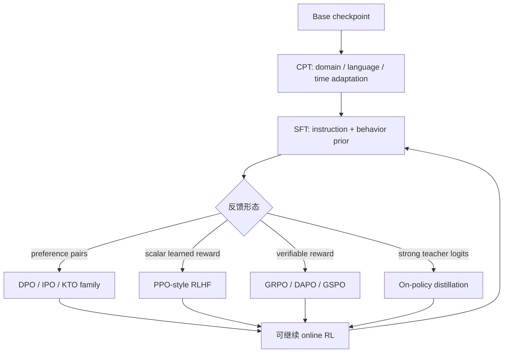
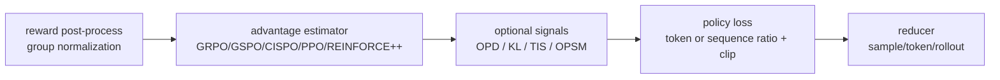
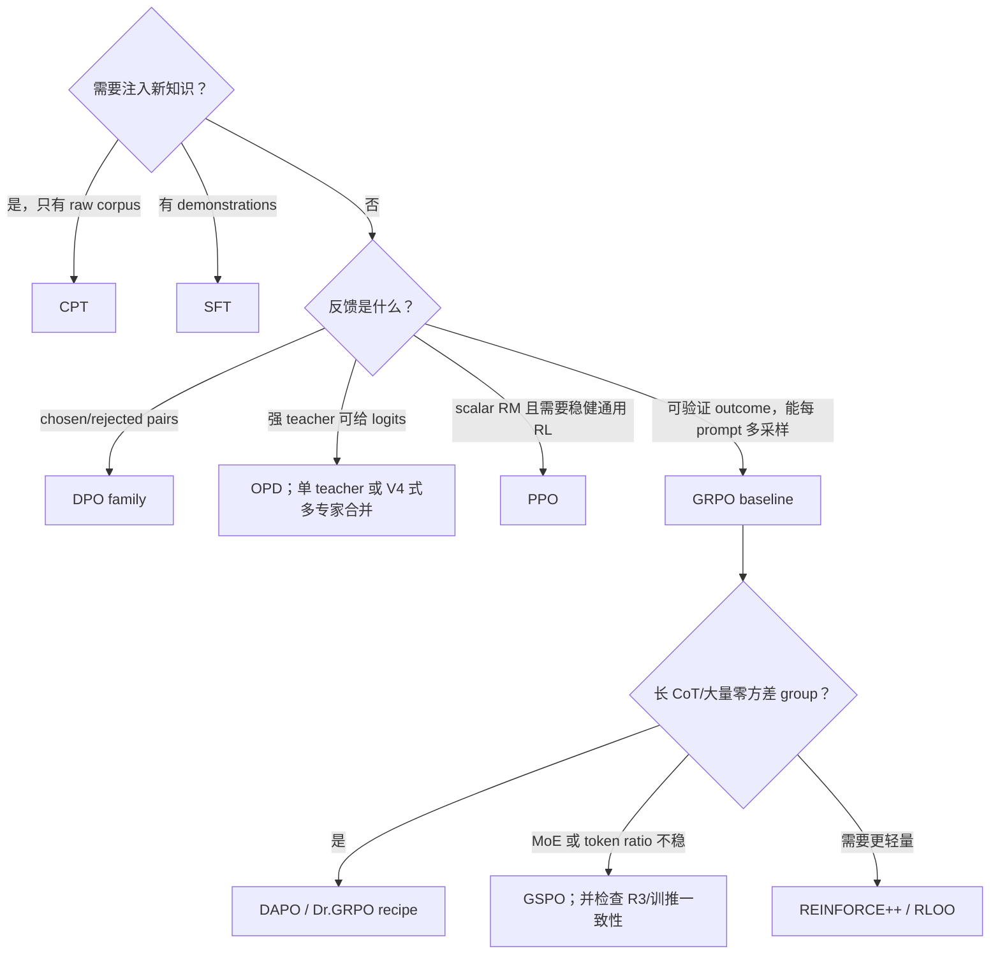

# 后训练算法：数据、目标与 credit assignment

## 前置知识

本篇是 post-train 算法部分的总览：先用一组统一符号把各训练阶段的 loss 写成同一种形式，再逐阶段比较数据来源、优化目标与工程要求。阅读前建议：

- 已读[本章全景](../README.md)，知道 rollout policy、train policy、reward、advantage 的含义。
- 熟悉 cross entropy 与 log-prob；公式中所有 sum 的 mask、归约维度和 denominator 会显式给出。

## 符号约定

为了让后面的公式不产生歧义，先固定住一组贯穿全文的符号。对一个 prompt $x$，其 response 记为 $y=(a_1,\dots,a_L)$：

- `tokens`：$[T]$，$T=P+L$，前 $P$ 个是 prompt，后 $L$ 个是 response；
- `logits`：$[T-1, V]$，第 $t$ 行预测下一个 token；
- `m`：$m\in\{0,1\}^{L}$，是 response 区域的 loss mask；tool observation、padding 或被丢弃片段取 0；
- $\ell_{\theta,t}=\log\pi_\theta(a_{t}\mid x,\ a_{<t})$；
- $R_i$ 是第 $i$ 条 response 的 sequence reward；$\hat{A}_{i,t}$ 是 token credit；
- $\mu$ 是实际 rollout distribution，$\pi_{\mathrm{old}}$ 是优化 epoch 开始时冻结的 behavior policy，$\pi_{\mathrm{ref}}$ 是长期 reference。

这三个 policy 在记号上很容易被混用，但语义并不相同：理想情况下，同步 rollout 满足 $\mu=\pi_{\mathrm{old}}$；但只要在同一批 rollout 上做了多个 mini-step 更新，很快就会出现 $\pi_\theta\neq\pi_{\mathrm{old}}$；到了异步生成的场景，rollout 用到的权重版本可能更旧，需要写成 $\mu=\pi_{k-s}$；而 KL anchor 比较的始终是 $\pi_\theta$ 与 $\pi_{\mathrm{ref}}$，不要把它和 $\pi_{\mathrm{old}}$ 弄混。

## 统一视角：weighted log-likelihood

大多数 post-training 的 loss，其实都可以看成同一种 masked weighted log-likelihood 的特例：

$$
\mathcal L(\theta)
=-\frac{1}{Z}\sum_{i,t}m_{i,t}\,w_{i,t}\,\log\pi_\theta(a_{i,t}\mid h_{i,t}).
$$

不同方法之间的差异，主要集中在下面四个地方：

1. $a_i$ 从离线数据来，还是由当前 student/policy 在线采样；
2. $w_{i,t}$ 恒为 1、来自 preference、teacher，还是来自 reward/advantage；
3. 是否用 $\pi_\theta/\mu$ 的 importance ratio 修正 distribution shift；
4. $Z$ 是 sample 数、有效 token 数、group 数，还是 rollout 数。

> 这个视角只是帮助理解的框架，不代表所有目标在数学上等价。例如 DPO 有 pairwise 的 $\log\sigma$，PPO 的 $\min/\mathrm{clip}$ 也不是简单常数权重；但它准确指出了工程数据通路最终必须产出哪些张量。

## 各训练阶段对比

下面这张表把目前常见的后训练阶段放在一起比较，覆盖数据来源、优化目标、credit 粒度、需要的额外模型，以及典型的 loss 形式。

| 方法 | 数据从哪里来 | 主要目标 | credit 粒度 | 额外模型/状态 | 典型 loss / 修正 | 在线 rollout |
| --- | --- | --- | --- | --- | --- | --- |
| CPT | domain raw text | 补知识/分布适配 | token | 无 | next-token NLL | 否 |
| SFT | 人工/teacher demonstration | 模仿目标回答与格式 | token，通常等权 | 无 | response-masked NLL | 否 |
| off-policy distillation | teacher 离线生成 | 模仿 teacher 覆盖到的轨迹 | token | teacher 仅生成数据 | hard NLL 或 forward KL | 否 |
| reward model | $(x, y^{+}, y^{-})$ preference | 学习可微 reward | pair / sequence | RM | Bradley–Terry pair loss | 否 |
| DPO/IPO 等 | preference pair | 直接提高 chosen 相对 rejected 概率 | pair → sequence | frozen $\pi_{\mathrm{ref}}$ | pairwise logistic / margin | 否 |
| PPO | $\pi_{\mathrm{old}}$ rollout + RM/verifier/env | 最大化 reward、限制 policy shift | GAE token advantage | actor、critic、ref、RM | clipped IS + value loss + KL | 是 |
| GRPO | 每 prompt 的 $G$ 条 rollout | 组内相对 reward，无 critic | sequence reward 广播到 token | actor、常有 ref/verifier | group baseline + token ratio clip | 是 |
| Dr.GRPO | 同 GRPO | 去除 group std 与 length bias | group/rollout | 同 GRPO | constant baseline + rollout-level reduction | 是 |
| DAPO | GRPO + over-sampling | 长 CoT 稳定性/有效 batch | token | actor + verifier | clip-higher、dynamic sampling、token reduction、overlong shaping | 是 |
| GSPO | group rollout | 用 sequence-level ratio 稳定更新 | sequence ratio × token grad | actor；MoE 可配 routing replay | geometric-mean sequence IS + clip | 是 |
| CISPO | group rollout | 截断 IS 权重但保留 clipped token 梯度 | token | actor | $\mathrm{sg}(\mathrm{clip}(r))\cdot\hat{A}\cdot\log\pi$ | 是 |
| REINFORCE++/RLOO | rollout group | critic-free policy gradient | return / leave-one-out baseline | actor、常有 ref | discounted return、whitening/baseline | 是 |
| OPD | **student 当前 policy** rollout | 向 teacher policy 靠近；V4 用来合并多个域专家 | dense token（sampled 或 full-vocab） | frozen teacher（可 >1） | reverse-KL：sampled advantage 或 full-vocab KL | 是 |
| Agentic RL | policy 与 tool/env 多轮交互 | episode success / process quality | masked action token、turn 或 episode | env/verifier/judge | 上述任一 estimator + trajectory mask | 是 |

## 训练阶段的组合与循环

上面这张图看起来像一条单向流水线，但实际的训练 recipe 常常会形成循环：RL 先找到一个更好的策略，再从这个策略采样出高质量的轨迹，然后用 rejection sampling 或者 SFT 把这些轨迹固化下来，接着再进入下一轮 RL。DeepSeek-V4 就是把这个循环拆成了两步：先在各个领域内做 SFT 加 GRPO，训练出若干个 specialist，再用 multi-teacher OPD 把这些 specialist 合并成一个统一模型，以此替代 V3.2 里原来的 mixed RL 方案；开源的 slime 则采用了另一种做法，把 sampled reverse-KL 叠加在 GRPO 或 PPO 之上，更适合从单个 teacher 做迁移的场景。CPT 也不一定只出现在最前面，它也可能在 SFT 之后再插入一次，只是这样做之后必须重新做一遍行为恢复和安全评测，确认模型没有退化。

## 四组容易混淆的概念

下面挑出几组经常被混着用、但含义其实并不相同的概念，逐一说清楚。

### Offline / on-policy / off-policy

- **offline** 只表示数据已经固定，不等价于一定错误；SFT/DPO 的目标本来就针对固定数据。
- **on-policy RL** 要求 credit 与更新对应生成这些 action 的 behavior policy。工程上应保存 rollout log-prob 和 `policy_version`，不能用“刚同步过一次权重”代替验证。
- **off-policy correction** 用 $r_t=\pi_\theta(a_t\mid h_t)/\mu(a_t\mid h_t)$、V-trace/TIS、mask 或 staleness bound 控制偏差；它降低偏差，但不会自动修复 tokenization、top-p support、MoE route 不一致这些问题。

### Sequence reward / token credit

verifier 往往只给整条 response 打一个分数 $R_i$，如果直接把这个分数原样广播给这条 response 里的每一个 token，也就是令 $\hat{A}_{i,t}=R_i-b$，本质上是一种 Monte Carlo 式的 credit 分配：做法简单，但方差很大。PPO 里的 critic 加 GAE、process reward、outcome-to-go，以及 turn-level reward，这些方法要回答的都是同一个问题：这条 trajectory 最终的结果，到底是哪一步动作导致的？

### Loss reduction

设两条 response 长度分别为 100 与 1000，来看三种常见 reduction 方式之间的差别：

- sample mean：先各自算 token mean，再对 2 条取 mean，每条 response 总权重相同；
- token mean：1100 个 token 等权，长 response 的总权重更大；
- rollout mean：agent fan-out 成多个 segment 时，先在同一个 `rollout_id` 内合并，避免分段数量多的 episode 被重复放大。

这几种 reduction 方式的选择并不只是一个无关紧要的实现细节，它们实际上在改变优化目标本身：DAPO 的 token-level policy gradient、Dr.GRPO 针对长度偏差的修正，以及 agent 场景下的 segment reducer，都是在这个层面上做文章。

### KL 的三个位置

KL 散度在后训练里会在三个不同的位置起作用，对应三种不同的实现方式：

1. **reward shaping**：$r_t \leftarrow r_t - \beta\,\mathrm{KL}_t$，再算 return/advantage；
2. **loss regularizer**：$\mathcal{L} \leftarrow \mathcal{L}_{\mathrm{pg}} + \beta\,\mathcal{L}_{\mathrm{KL}}$；
3. **OPD learning signal**：teacher reverse-KL。开源常见写法是用 sampled token 差改 advantage；DeepSeek-V4 用 full-vocab KL 当蒸馏目标。

这三处 KL 的梯度形式和作用的时间点都不一样，配置里如果只写了一个 `kl_coef`，并不意味着它们在起同样的作用，混用时需要格外小心。

## slime 中的实现分层

slime 在 [[slime:]] commit `41014d1f` 中把算法拆成三个正交层：

- group reward normalization 在 [[slime:slime/ray/rollout.py#L722-L745]]；
- estimator dispatch 与 OPD 叠加在 [[slime:slime/backends/megatron_utils/loss.py#L704-L816]]；
- PPO/GSPO/CISPO ratio 与 clip 在 [[slime:slime/utils/ppo_utils.py#L95-L171]]；
- SFT NLL 与统一 loss dispatch 在 [[slime:slime/backends/megatron_utils/loss.py#L1233-L1342]]；
- CLI 支持的 estimator 列表在 [[slime:slime/utils/arguments.py#L899-L955]]。

这也说明了 DAPO 并不是简单打开一个 `advantage_estimator=dapo` 开关就能获得的效果，而是由 asymmetric clip、dynamic filter、loss reducer 和 reward shaping 这几项配置组合出来的结果。

## 算法选择

在按照上面这张图选算法之前，更值得先确认三件事：reward 是否可靠、base policy 是否已经具备非零的成功率、rollout 能不能覆盖到希望模型学会的目标行为。如果 rollout 始终探索不到一条成功的 trajectory，这时候换一种 clip 公式通常帮助不大，更好的办法往往是先补一轮 CPT/SFT、设计 curriculum，或者重新设计 environment。

## 关键监控

下面这张表列出了训练过程中至少应该盯住的几类指标。

| 类别 | 至少记录 |
| --- | --- |
| reward | raw reward、group std/zero-std ratio、各 verifier 子项、train–eval gap |
| policy | entropy、response length、KL to ref、$\pi_{\mathrm{train}}/\mu$ ratio 分位数、clip fraction |
| optimization | pg/value loss、advantage mean/std、grad norm、explained variance |
| systems | rollout tokens/s、P50/P95/P99 latency、aborted/recycled tokens、queue age、policy staleness |
| correctness | rollout/train log-prob diff、weight version、top-p support、MoE route mismatch、loss-mask token count |

只看 mean reward 在上升，并不足以说明训练是健康的，因为 reward hacking、length drift、entropy collapse，以及 train 和 rollout 之间的 mismatch，完全可能在同一时间悄悄发生。

## 参考

- Ouyang et al., [Training language models to follow instructions with human feedback](https://arxiv.org/abs/2203.02155), 2022.
- Rafailov et al., [Direct Preference Optimization](https://arxiv.org/abs/2305.18290), 2023.
- Schulman et al., [Proximal Policy Optimization Algorithms](https://arxiv.org/abs/1707.06347), 2017.
- Shao et al., [DeepSeekMath / GRPO](https://arxiv.org/abs/2402.03300), 2024.
- Yu et al., [DAPO](https://arxiv.org/abs/2503.14476), 2025.
- Zheng et al., [GSPO](https://arxiv.org/abs/2507.18071), 2025.
- Lu & Thinking Machines Lab, [On-Policy Distillation](https://thinkingmachines.ai/blog/on-policy-distillation/), 2025.
- DeepSeek-AI, [DeepSeek-V4](https://arxiv.org/abs/2606.19348), 2026. §5.1.2 / §5.2.2：multi-teacher OPD 与 full-vocab teacher scheduling。

---

**下一篇**：[CPT、SFT 与 preference learning](01_cpt_sft_preference.md) 会从同样的 token NLL 出发，看数据从哪里来、怎样分布，如何让这同一个目标函数承载 CPT、SFT 和 preference learning 这几种截然不同的训练含义。
