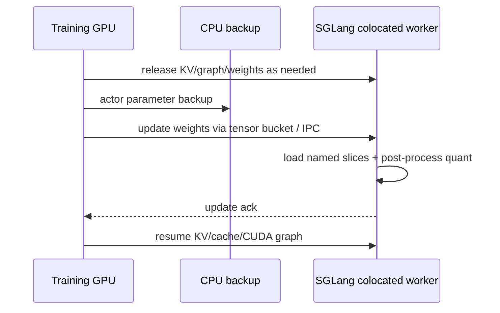
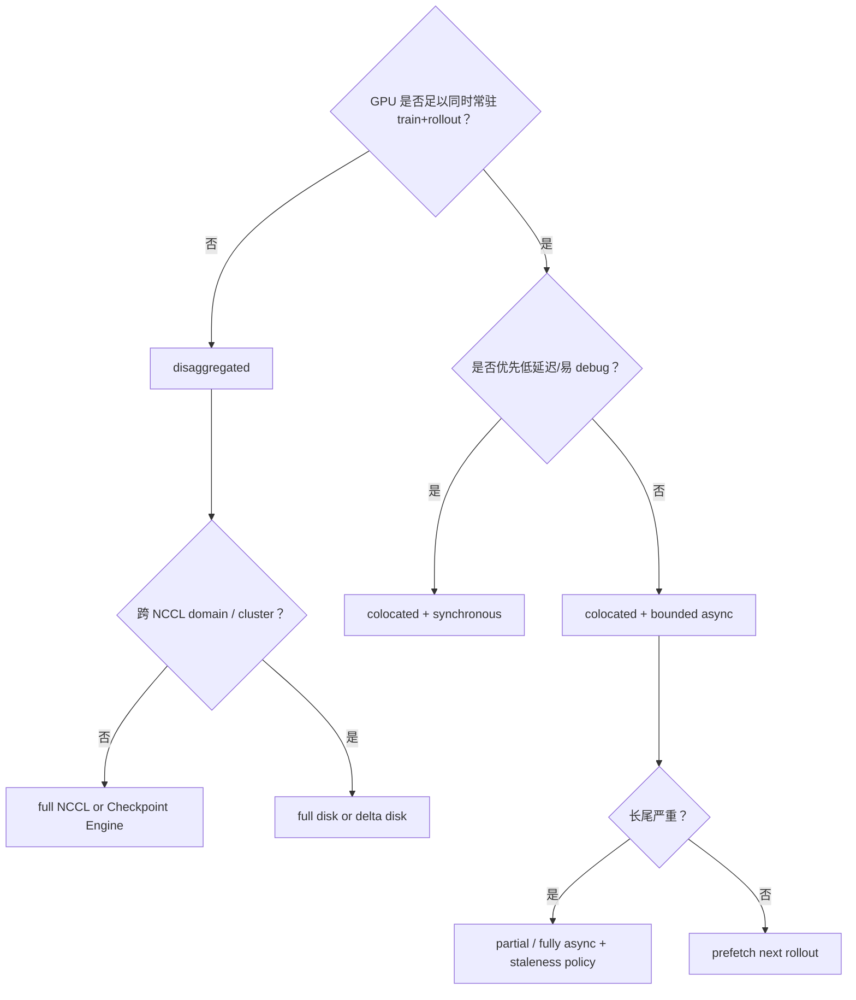

# Rollout–train 架构

## 前置知识

本篇比较 rollout 与 train 之间的三种时间关系（同步、有限异步、全异步），以及 colocated 与 disaggregated 两种资源布局，最后给出选择依据。阅读前建议：

- 已读[框架映射](01_framework_mapping.md)，知道 `RolloutManager` 与 training actor 的边界。
- 知道 prefill（处理完整 prompt）与 decode（逐 token 生成）是两种不同的 serving workload。

## 1. 三种时间关系

rollout 和 train 之间的时间关系，大致可以分成三种。

### 1.1 Fully synchronous

```text
rollout(batch k) ──barrier──> train(batch k) ──weight update──> rollout(batch k+1)
```

这种方式的优点是 policy version 非常清晰，也容易 debug；缺点是无论 `max latency` 还是 weight sync，都会阻塞整个训练流程。

### 1.2 Pipelined async

```text
rollout k ───────────────┐
                         ├─ train k
rollout k+1 (prefetch) ──┘       └─ drain before weight update
```

slime 的 `train_async.py` 会在训练第 k 批数据的同时，就启动第 k+1 批的 rollout，但在更新权重之前，仍然要把对应的 future drain 干净。它做到的是计算上的 overlap，但并不允许 trajectory 出现任意程度的 staleness。

### 1.3 Fully async

```text
prompt queue → long-lived rollout workers → completed buffer → trainer consumes
                  ↑                         ↓
              weight versions       bounded staleness / IS / replay policy
```

在这种模式下，rollout 和 train 只通过 buffer 或者 weight service 来协调。它的吞吐更高，也更能扛住长尾延迟，但代价是需要明确定义 staleness 的处理策略、replay 或者 drop 的规则、checkpoint 的恢复方式，以及 evaluation 的语义。

## 2. colocated vs disaggregated

把 colocated 和 disaggregated 这两种资源布局放在一起对比：

| 维度 | colocated | disaggregated |
| --- | --- | --- |
| GPU | train/rollout 复用同一 GPU pool | 独立 training 与 serving pool |
| weight path | CPU/GPU tensor、CUDA IPC、offload/onload | NCCL、shared FS full/delta、P2P/checkpoint service |
| memory | 需要轮流释放 actor/KV/cache | 两侧常驻，吞吐更稳定 |
| overlap | 受显存占用限制 | rollout/train 可并行 |
| hardware | 通常同型号/同 NCCL domain | 可不同型号/厂商（disk path） |
| correctness | swap 时 pause/flush | versioned update + remote barrier |
| failure domain | 训练/推理故障耦合 | serving 可独立重启/扩缩容 |

slime 的 placement layout 见 [[slime:slime/ray/placement_group.py#L100-L137]]：colocate 时取 `max(actor_gpus, rollout_gpus)`，disaggregate 时则把两者相加，并设置一个 rollout offset。actor 选择哪种 updater，在 [[slime:slime/backends/megatron_utils/actor.py#L151-L181]] 里可以看到：colocate 用 tensor/IPC，非 colocate 但能建 NCCL 用 distributed，只能走磁盘就用 full/delta updater。

## 3. colocated 的 offload/onload 流程

一个典型的 offload/onload 时序如下：



这样做的优点是不需要把完整的 HF checkpoint 写到磁盘上；缺点是训练和 inference 会互相争抢显存，而且对 Python 进程和 IPC 的生命周期管理要求很高。`--offload-rollout` 和 `--offload-train` 属于资源层面的选项，而不是算法层面的选项，使用时必须在更新权重之前确认没有正在进行中的 generation。

## 4. disaggregated 的 two-plane 设计

disaggregated 架构可以把系统拆分成 control plane 和 data plane 两部分：

- control：Ray actor、router registration、weight version、pause/continue、health/fault；
- data：token batches、log-probs、weights、KV transfer、checkpoint bytes。

训练用的数据可以走 Ray object store 或者 NIXL；权重数据则可以选择 NCCL direct、共享文件系统、object-store hook，或者 Checkpoint Engine 这几种方式。有一条原则必须遵守：不能让 control-plane 的 HTTP 通路去承担 GB 级别的 tensor 数据传输。

slime 的 external engine 文档给出了一份推荐矩阵：如果训练和 engine 之间能建立 NCCL 连接，就用 full+NCCL；如果不能建 NCCL 但共享文件系统，就用 full+disk；如果是跨集群或者模型特别大的场景，就用 delta+disk，具体见 [[slime:docs/zh/advanced/external-rollout-engines.md#L7-L18]]。

## 5. PD disaggregation 与 RL

prefill 和 decode 这两个阶段消耗的资源并不相同：长 prompt 或者 multi-turn 场景更吃 prefill 的 FLOPs 和 KV transfer，长 reasoning 场景则更吃 decode 的 step 数。SGLang 的 PD 方案把两者拆成了独立的 server group；slime 的 YAML 配置里，`worker_type: prefill/decode`、每组的 GPU 数量以及各种 override 参数，具体见 [[slime:docs/zh/advanced/pd-disaggregation.md#L31-L52]]。

在 RL 场景下用 PD disaggregation，还需要额外考虑几件事：

1. multi-turn 同一个 `session_id` 应 session-affinity 到能复用 prefix cache 的 worker；
2. weight update 必须同时更新 actor prefill/decode groups；
3. prefill 到 decode 的 KV transfer 失败时要能 abort/requeue，不把半条 trajectory 当作完成；
4. reward/verifier/tool-side model 可作为 frozen multi-model group，不参与 actor update。

## 6. placement 与并行维度

训练时用到的 DP/TP/PP/CP/EP，和 serving 时用到的 TP/PP/DP/EP，本质上是两套不同的 topology。一个可行的系统设计，至少需要记录清楚：

```text
training:  DP×TP×PP×CP×EP
rollout:   engine_count×TP_r×PP_r×DP_attn×EP_r
weight map: parameter name → source shard → target shard/rank
```

如果只按 rank 的编号顺序发送权重，一旦 TP/PP/EP 的配置发生变化，或者遇到 MoE expert replication、vocab padding、quantization 这些情况，就会在没有任何报错的情况下悄悄出错。map、metadata 和 bucket 这些细节，会放到专门讲权重同步的那一篇里展开。

## 7. failure/recovery 边界

把常见故障场景下，同步和 async 两种模式各自的处理方式列出来对比：

| 故障 | 同步处理 | async 处理 |
| --- | --- | --- |
| engine crash | step fail/restart then retry | health monitor 标记 in-flight aborted，buffer requeue/drop |
| weight update fail | stop before next rollout | version remains old；禁止消费标成 new version 的 sample |
| tool timeout | partial/abort sample | per-sample deadline，worker 不阻塞全 batch |
| trainer restart | checkpoint + rollout id | buffer 要持久化或接受丢弃；policy version chain 需可恢复 |
| network partition | global barrier timeout | stale queue 增长，需 backpressure / shed |

## 8. 选择决策

综合以上几节的内容，可以画出一张简单的决策流程图，帮助判断该往哪个方向走：



---

**下一篇**：接下来[async 与 partial rollout](03_async_partial_rollout.md)会专门分析长尾问题，解释为什么“多发一些请求、慢的直接取消”这种朴素做法，还需要配合 token-level 的 resume 机制和 off-policy 管理才能真正生效。
