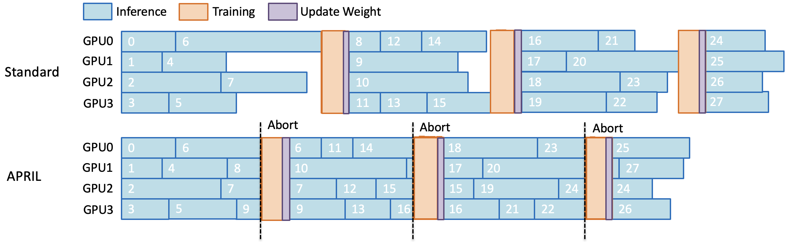
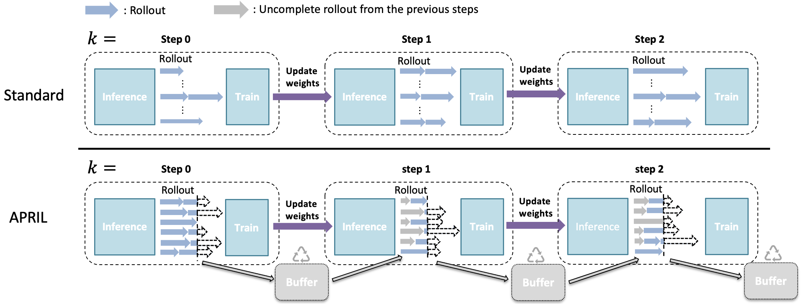

# Async RL 与 partial rollout

## 前置知识

同步 rollout 的 step 时间由最慢的一条 trajectory 决定，长尾请求会直接转化为 GPU 空转。本篇按从易到难的顺序介绍消除长尾 bubble 的系统手段：over-provision、partial rollout、bounded async 与 fully async，以及随之而来的 staleness 管理。阅读前建议：

- 已读[rollout–train 架构](02_rollout_train_architecture.md)。
- 知道 sequence reward、loss mask 与 behavior log-prob 是 trajectory 的一部分，而不是可随意重建的日志。

## 1. 长尾对吞吐的影响

一个同步 batch 的 rollout 时间，大致可以写成：

$$
T_{rollout}^{sync}=\max_{i\in\mathrm{batch}}T_i,
\qquad
\mathrm{utilization}\approx\frac{\sum_iT_i}{N\cdot\max_iT_i}.
$$

这里的 $T_i$ 并不只由 response 长度决定，还包括 prompt 的 prefill 时间、KV cache 的压力、router 排队时长、tool 或 environment 的延迟、sandbox 启动耗时，以及 remote RM 调用和重试。哪怕只有少数几条 long-CoT 或者 agent trajectory 特别慢，也足以让其余的 GPU 白白空转。



> 图：同步 RL 中快速请求完成后，worker 等待 batch 中慢请求，形成 bubble；APRIL 将 over-provision、active interruption 与 partial recycling 放在 scheduler 层处理，而非修改 inference kernel（Zhou et al. 2025；[arXiv:2509.18521](https://arxiv.org/abs/2509.18521)）。

## 2. 四级优化阶梯

把常见的优化手段按作用层级排一下：

| 层级 | 手段 | 是否改变数据分布 | 主要风险 |
| --- | --- | --- | --- |
| serving | continuous batching、prefix cache、PD、speculative decode | 否 | cache/version invalidation |
| batch scheduling | over-sampling、dynamic filter、first-completed | 过滤 group，改变有效 prompt mix | reward/length bias |
| partial | 中止未完成 generation，保留 prefix，下步 resume | 产生 off-policy prefix | stale action、mask、reward attribution |
| async | 跨 rollout 边界维护 in-flight pool | trajectory 与 train version 解耦 | staleness、replay、evaluation |

比较稳妥的顺序是先做 serving 和 queue 层面的优化，再考虑上 partial 或者 async，不然很难判断最终的收益，究竟是来自减少了 bubble，还是无意中改变了训练目标。

## 3. over-provision 与 active partial

如果目标 batch 需要 $N$ 条有效 group，一个常见做法是先多请求一些，提交 $N' > N$ 条：

```text
submit N' groups
while accepted < N:
    wait FIRST_COMPLETED
    if group passes reward/filter: accept
    else: drop and top-up
when accepted == N:
    abort unfinished requests
    recycle partial states into buffer
```

slime 的默认 rollout 已经这样做：

- `over_sampling_batch_size` 决定一次从 data source 取多少，默认回退为 `rollout_batch_size`：[[slime:slime/utils/arguments.py#L430-L440,L1980-L1985]]；
- `generate_rollout_async` 以 `asyncio.wait(... FIRST_COMPLETED)` 收集 group，动态 filter 后继续补足 target：[[slime:slime/rollout/sglang_rollout.py#L400-L444]]；
- 收到 target 后调用 `abort`，未完成 task 若启用 partial 就回收到 data buffer：[[slime:slime/rollout/sglang_rollout.py#L450-L470]]。

这也解释了为什么 DAPO 的 dynamic sampling 和 APRIL 的 partial 能够天然搭配使用：前者决定的是“哪些 group 算是有效的”，后者决定的是“那些还没跑完的算力该怎么不被浪费掉”。



> 图：APRIL 的 over-provision、active interruption 与 buffer recycle 调度；它位于 scheduler 层，可与 GRPO/DAPO/GSPO 及 kernel 优化组合（APRIL authors 2025；[arXiv:2509.18521](https://arxiv.org/abs/2509.18521)）。

## 4. partial rollout 的 token semantics

中止一个请求，并不等于简单地把它丢弃掉。一个可以被 resume 的 sample 状态，至少需要包含：

```text
tokens = prompt + response_prefix
response_length = len(response_prefix)
rollout_log_probs = logp(response_prefix)
loss_mask = [1] * prefix_len       # 或按 off-policy policy 置 0
status = ABORTED
metadata.start_rollout_id = k
policy_version = v_k
```

下一轮继续做 generation 时，`max_new_tokens` 必须减去已经生成的 `response_length`，再把新产生的 tokens 和 log-probs 追加进去。slime 的常规 path 在 [[slime:slime/rollout/sglang_rollout.py#L152-L173]] 负责这部分长度记账；`generate_and_rm` 在做 partial resume 时，可以先把已有的 off-policy span 的 mask 设为 0，对应 `:231-234`。

### 4.1 mask 策略

对已生成的 prefix 和新生成的 suffix，可以采取不同的 mask 策略：

| 策略 | 已生成 prefix | 新生成 suffix | 优点 | 代价 |
| --- | --- | --- | --- | --- |
| train all | 1 | 1 | 保留更多 signal | prefix 来自旧 policy，off-policy |
| mask off-policy | 0 | 1 | 只训练当前 policy suffix | 长 prefix 不贡献 credit；episode reward 仍需定义 |
| restart | 丢弃 prefix | 新 trajectory | 最接近 on-policy | 浪费已完成 token，长尾收益下降 |
| importance correct | 1×IS | 1 | 理论上利用全部 prefix | 需准确旧 logp、variance control |

slime 的 `--mask-offpolicy-in-partial-rollout` 只是把已有 response span 的 `loss_mask` 设为 0，它并不是一套完整的 off-policy correction 方案。使用时应该记录下 prefix 和 suffix 各自的 token 数量，以及真正参与梯度计算的 token 数量。

### 4.2 reward attribution

如果 verifier 的 reward 只在整条 response 结束时才产生，那么 partial 的 prefix 部分本身是没有独立 reward 的。常见的处理方式有：

- 只在 resume 完成后给整个 trajectory reward；
- segment-level reward / process reward；
- 把同一 episode 的多个 segment 用共同 `rollout_id` 聚合，避免 reward 重复放大；
- 对永远未完成/超时 segment 设 `remove_sample=True` 或明确 truncated reward。

需要注意的是，不能默认把“中止”当作任务失败来处理，很多时候它只是因为 scheduler 已经收集够了这一批数据。

## 5. streaming partial 与 SSE

普通的 HTTP 生成方式通常要等到完整的 JSON 返回才能拿到结果；如果 update 或者 abort 恰好发生在生成过程中，事后再去请求 `/abort_request` 才拿到的 partial text，很可能已经丢失了一部分状态。slime 的 streaming 实现则是在每个 SSE chunk 到达时就立刻写入 sample：

```text
chunk meta.output_token_logprobs
    ↓
sample.append_response_tokens(...)
    ↓
state.aborted? break
```

源码见 [[slime:slime/rollout/sglang_streaming_rollout.py#L93-L167]]。需要注意的是，SGLang 默认的 streaming output 是累积（cumulative）式的；如果打开了 incremental delta 模式，就不能再重复 append 了。

## 6. bounded async 与 fully async

### 6.1 bounded async

`train_async.py` 只让下一批 generation 和当前的训练做 overlap，并且在更新权重之前会把它 drain 干净。它的 staleness 上界大致相当于一个 in-flight 的 rollout，比较适合用来先验证性能收益和正确性。

### 6.2 fully async worker

slime 的 `fully_async_rollout.py` 建立了一个后台 thread 加 asyncio loop 的结构：

- 固定 `concurrency` 个 in-flight trajectory，跨 rollout boundary 不清空：`:76-105`；
- completed group 进入 output queue，queue size 形成 backpressure：`:128-169`；
- trainer 每轮只取目标数量，剩余 completed group 留给下一轮：`:211-266`；
- weight update abort 的 group requeue，当前实现从头重启而非 partial resume：`:186-206`，README 也明确这是 TODO。

这种做法比“每个 step 单独启动一个 async task”更能有效隐藏长尾延迟，但代价是不再严格满足 on-policy：queue 里的某些 group，完全可能是用一个更旧的 weight version 跑完的。

## 7. staleness 的控制手段

假设某个 sample 是由 version `v_s` 生成的，而 trainer 当前所在的 version 是 `v_t`，控制 staleness 大致有三种手段：

1. **hard bound**：只消费 `v_t-v_s≤K`；超龄 drop/requeue；
2. **weight barrier**：每次 update 前 pause/drain，牺牲 overlap 换 policy purity；
3. **algorithmic correction**：保存 `μ` log-prob，使用 TIS/IS/OPSM/CISPO/GSPO 等限制 ratio；

实践中通常把第 1 和第 3 种组合起来用。只是把版本信息记录下来却不去使用它，并不会自动降低 off-policy bias。

## 8. APRIL 的系统取舍

APRIL 的 README 里报告说，结合 over-provision、active interruption 和 intelligent recycling 这三项手段，在多个模型和算法上取得了 20–35% 的 rollout throughput 提升，对应论文是 [arXiv:2509.18521](https://arxiv.org/abs/2509.18521)。看到这类数字时，值得同时问几个问题：

- 是 tokens/s、samples/s 还是 end-to-end step/s；
- over-sampling 增加了多少总生成 token；
- partial prefix 是训练、mask 还是 restart；
- reward/filter 是否改变有效数据分布；
- 使用何种 inference engine、长度分布和 max response；
- 是否与 weight sync、PD、speculative decode overlap。

slime 目前自带的 partial path 提供的是一套可复用的接口，但 APRIL 论文里完整的 buffer 和 scheduler 优先级策略，并不应该被误认为是 slime 每个 commit 都内置的同一套算法。

## 9. metrics

至少应该记录下面这些指标：

```text
request:    p50/p95/p99 e2e, queue, prefill, decode latency
tail:       max/p95 length, straggler ratio, aborted groups
reuse:      partial prefix tokens, resumed suffix tokens, restart tokens
policy:     version age, ratio quantiles, masked off-policy fraction
quality:    effective groups, reward/std, validation, truncation rate
resource:   GPU busy, KV occupancy, queue depth/age, network bytes
```

如果开启 partial 之后 `samples/s` 提升了，但总的 token/s 和真正参与梯度计算的 token/s 反而下降了，那么这份“收益”很可能只是把原本昂贵的 token 藏进了 buffer 里，并没有真正省下计算量。

## 10. 实施顺序

把上面这些手段串起来，一个比较稳妥的落地顺序是：

1. 固定 seed/version，做 synchronous baseline；
2. 开 continuous batching/prefix cache/PD，确认 reward 与 logp 不变；
3. 开 over-sampling + dynamic filter，记录有效 group 与额外 token；
4. 开 streaming partial + mask-offpolicy，做 restart/mask/IS 三组消融；
5. 开 bounded async，限制 `K`、在 weight update 处 drain；
6. 最后切 fully async，定义 stale drop/replay、checkpoint buffer 与 eval snapshot。

---

**下一篇**：接下来[训推一致性与 determinism](04_consistency_determinism.md)会解释，为什么即便是同一个 checkpoint，在 SGLang、Megatron 和 MoE 这几套实现里跑出来，仍然可能对应着不完全相同的 policy。
