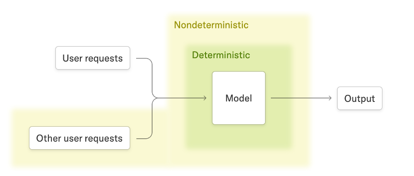
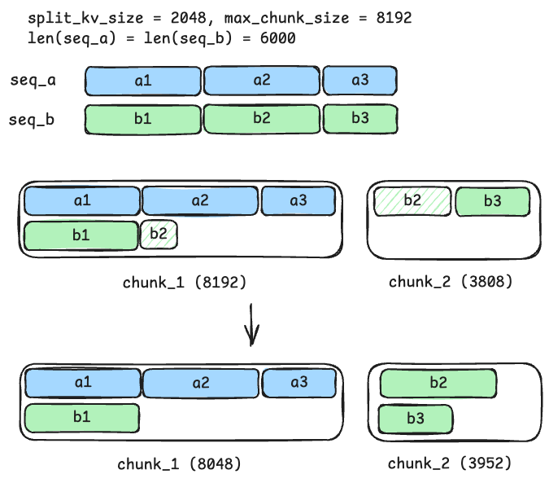
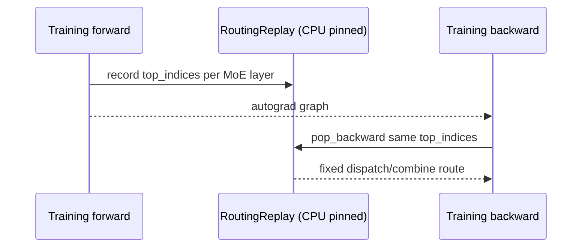
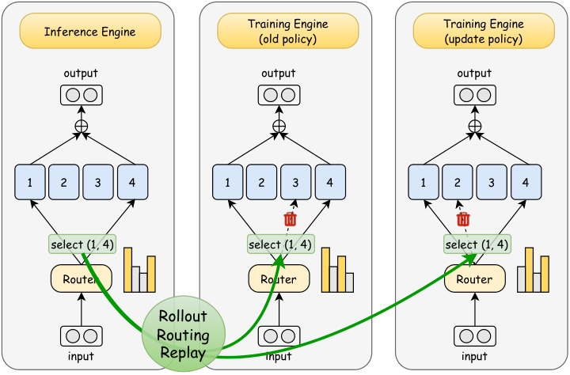

# 训推一致性与 determinism

## 前置知识

即使训练和推理使用完全相同的权重，两套 engine 也可能给出不同的 token probability。本篇把这个问题分成三个层面：单 engine 可复现性、batch invariance，以及 train–rollout 对齐，并介绍对应的工程修复（deterministic inference、routing replay 与 R3）。阅读前建议：

- 已读 [PPO：从 sequence reward 到 clipped policy update](../algorithms/02_ppo.md)、[async 与 partial rollout](03_async_partial_rollout.md)。
- 知道 floating-point reduction 非结合，dynamic batching 会改变 kernel 的 reduction partition。

## 1. 三个不同问题

训推一致性其实包含三个层次不同的问题，很容易被混为一谈。

### 1.1 Same-engine reproducibility

指的是固定 checkpoint、输入、seed、硬件和 batch 之后，重复运行能得到完全相同的 token、logits 和 loss。这个性质主要用在 debug 和科学实验上。

### 1.2 Batch invariance

指的是同一个 request，无论和哪些其他 request 组成一个 batch，最终结果都应该保持一致。也就是说，动态 batch 带来的 shape 变化，不应该改变 reduction 内部的加法顺序。

### 1.3 Train–rollout alignment

指的是 rollout engine `π_infer` 和 training engine `π_train`，在同一个 token prefix 上算出来的 log-prob、attention、quantization 和 MoE route 足够接近，这样保存下来的 behavior log-prob 和训练时用到的 ratio 才有意义。

这三层问题之间并不存在互相蕴含的关系：同一个 engine 内部具备 determinism，并不能保证两套不同的 engine 结果一致；一个 engine 满足 batch-invariant，也不能保证 Megatron 的 backward 和 SGLang 的 forward 算出来的结果是一致的。



> 图：不同 batch size 会改变 reduction splitting 和浮点累加顺序，造成即使相同 prompt 也出现不同输出；SGLang deterministic blog 将 batch-invariant operator 作为根本修复（LMSYS 2025；[blog](https://lmsys.org/blog/2025-09-22-sglang-deterministic/)）。

## 2. mismatch 对 RL 的影响

假设 rollout 保存下来的是 $\ell_\mu(a_t \mid h_t)$，训练时重新算出来的是 $\ell_\theta(a_t \mid h_t)$。PPO 和 GSPO 用到的是：

$$
\Delta_t=\ell_\theta-\ell_\mu,
\qquad r_t=e^{\Delta_t}.
$$

如果 $\ell_\mu$ 和 $\ell_\theta$ 之间的差异来自真实的 policy 更新，那这个 ratio 正是我们期望看到的 off-policy correction；但如果差异其实来自 kernel、reduction 或者 route 层面的 mismatch，这个 ratio 就会把纯粹的数值误差错当成 policy drift：

```text
true policy drift + engine mismatch + route mismatch + tokenizer/support mismatch
                         ↓
                 observed log-ratio / KL
```

这样一来，就会造成 clip fraction 升高、negative advantage 被过度 mask、entropy 或者 length 出现异常，严重时甚至导致 RL 训练整体崩溃。正确的排查顺序应该是先把误差来源拆分清楚，再决定用 GSPO、TIS 还是 OPSM 来应对。

## 3. Deterministic inference 的工程栈

SGLang 的 deterministic recipe 大致长这样（参考 [[slime:docs/zh/advanced/reproducibility.md#L3-L24]] 和 LMSYS 的博客）：

```bash
--sglang-enable-deterministic-inference
--sglang-attention-backend flashinfer   # 或支持的 deterministic backend
--deterministic-mode                    # Megatron
NCCL_ALGO=Ring
NVTE_ALLOW_NONDETERMINISTIC_ALGO=0
CUBLAS_WORKSPACE_CONFIG=:4096:8
```

除此之外，还需要固定 tokenizer、sampling seed、CUDA graph shape、attention split size、prefix cache 的语义，以及 collective 通信的 topology。仅仅把 temperature 设成 0 是不够的：dynamic batching 和 top-k 里的 tie-breaking 仍然可能带来变化；如果不是贪心采样，还需要用到 per-request 的 seeded sampler。



> 图：deterministic chunked prefill 让 chunk 边界对齐 fixed split-KV size，避免当前批其他序列决定截断点（LMSYS 2025；[blog](https://lmsys.org/blog/2025-09-22-sglang-deterministic/)）。

### 3.1 性能取舍

batch-invariant 的 reduction 和 attention 通常是要牺牲一些吞吐换来的；LMSYS 报告 Qwen3-8B 在 deterministic mode 下平均有大约 34.35% 的 slowdown，不过用上 CUDA graph 之后可以显著收回一部分开销。在生产环境的 RL 训练里，也不一定要全程打开这个模式：一种常见的做法是只在 debug 或者需要复现结果的场景下打开，正常的性能 run 则改用对齐过的 kernel，再配合 mismatch metrics 一起监控。

### 3.2 Megatron 侧

要做到完整的 bitwise reproduction，还需要用到 deterministic backward、指定 NCCL algorithm、固定 CUBLAS workspace、开启 NVTE deterministic algorithm，以及固定数据的读取顺序。slime 的 reproducibility 文档明确建议卸载 FA3，改用 deterministic mode 并配上相关的环境变量；不能只在 rollout server 一侧加上这些 flag 就完事。

## 4. Training routing replay

MoE 的 router 会对 token logits 做一次 top-k 的离散选择。即便 forward 和 backward 用的输入完全相同，`topk(sorted=False)`、tie-breaking 规则，以及并行执行顺序，仍然可能导致两次算出不同的 expert order。训练侧的 routing replay 要做的是，记录下 forward 阶段的 `top_indices`，backward 阶段直接复用这份记录：



[[slime:slime/utils/routing_replay.py#L78-L135]] 维护着每个 router 各自的 forward/backward cursor；`get_routing_replay_compute_topk` 在 `:168-213` 按不同 stage 做 record 或者 replay；`actor.py:476-489, 514-548` 则分别在 log-prob forward 和 policy backward 阶段设置好当前 stage，并负责清理资源。

需要强调的是，这解决的只是**训练内部** forward 和 backward 之间的一致性，并不能保证训练侧算出来的 route 和 rollout 侧的 route 是一致的。

## 5. R3：Rollout Routing Replay

R3 的做法是直接从 inference engine 里抓取 route，再拿到训练侧去 replay。论文里的核心观察是，MoE 场景下 `π_infer` 和 `π_train` 之间的差距，主要是被 routing distribution 上的差异放大出来的；R3 因此把 rollout 阶段的 expert 选择结果，当作 data-plane 的 metadata 一起送到训练侧。



> 图：R3 记录 inference routing，并在 training forward/backward 重放；右侧对比 route replay 前后的 policy discrepancy 与训练稳定性（Ma et al. 2025, Fig. 1；[arXiv:2510.11370](https://arxiv.org/abs/2510.11370)）。

### 5.1 slime data path

具体到 slime 里，这条数据路径是这样走的：

1. rollout payload 加 `return_routed_experts=True`；
2. SGLang 将每个 response token 的 `[layer,topk]` route 填入 `Sample.rollout_routed_experts`；
3. `RolloutManager` 转成 CPU tensor，并校验 `[tokens, num_layers, topk]` 与 MoE layers 非零：[[slime:slime/ray/rollout.py#L107-L142,L848-L852]]；
4. actor 按 training token/CP/PP layout pad/reorder：[[slime:slime/backends/megatron_utils/actor.py#L322-L351]]；
5. `RoutingReplay` 在 training forward 与 backward 两次消费相同 route。

### 5.2 shape 与 invalid cases

这里的 route metadata 并不是“每个 expert 被选中次数的直方图”，而是每个 token 各自的 ordered top-k indices。如果漏掉了某个 PP stage、某个 MoE layer 全零，或者 response 和 prompt 的 offset 对错了位，都会导致大量 token 被错误地 replay 成 expert 0。slime 的选择是在 conversion 这一步就直接拒绝这类异常数据，而不是让训练在错误数据上静默地跑下去。

### 5.3 R3 与 GSPO/TIS 的关系

把 R3 和另外两类相近的技术放在一起区分一下：

- GSPO sequence ratio 缓解 token-level ratio noise；R3 消除 MoE route source mismatch，两者正交；
- TIS/IS 修正 policy staleness/support mismatch；R3 修复 forward computation path，不能替代 behavior log-prob；
- route replay 可能增加 CPU pinned memory 与 route transport，但不需要额外 model forward。

## 6. Batch-invariant kernel 对齐层次

即便是 dense model，需要对齐的地方也不只是 MoE 这一层：

| 层 | 可能不一致 | 典型修复 |
| --- | --- | --- |
| RMSNorm/reduction | batch-dependent split/reduction | batch-invariant RMS / fixed reduction |
| GEMM/FP8 | tile/order、scale grouping | batch-invariant DeepGEMM、固定 block FP8 |
| attention | split-KV、chunk truncation | fixed split size、deterministic backend |
| sampling | multinomial batch order | seeded hash/Gumbel sampler |
| MoE top-k | tie/order/dispatch | ordered top-k、routing replay、R3 |
| collective | NCCL algorithm/order | Ring/fixed topology、deterministic mode |

slime 里 GLM-5 对齐路径的关键开关在 [[slime:slime/backends/megatron_utils/alignment/deepgemm_forward.py#L690-L721]] 和 [[slime:slime/backends/megatron_utils/alignment/deepgemm_moe_forward.py#L1090-L1135]]，环境变量的注入在 [[slime:slime/backends/megatron_utils/alignment/env.py#L32-L38]]。它的做法是从 Megatron 进程内部显式调用 SGLang/DeepGEMM 的 setter；仅仅设置好环境变量，并不能保证第三方进程已经真正启用了对应的 runtime mode。

## 7. Mismatch metrics 与 gate

针对同一份 rollout dump，可以按 response token 逐一比较下面这些指标：

```text
abs(logp_train - logp_rollout)       mean / p95 / max
sampled KL / low-variance KL         per token / per sequence
ratio quantiles                      0.01 / 0.5 / 0.99
fraction |Δlogp| > τ                 extreme token rate
MoE route mismatch                   set/order mismatch per layer
hidden/logit diff                    layerwise abs/max
```

slime 针对 GLM-5 的 deterministic e2e gate 在 [[slime:docs/zh/advanced/reproducibility.md#L53-L78]]：要求 `train_rollout_logprob_abs_diff < 1e-6`，并且要能做到 layerwise 的 hidden-state zero diff。换到自己的模型或者硬件上时，不应该直接照抄这个阈值，而是要先建立起自己的 BF16/FP8 baseline。

## 8. Debug matrix

遇到训推不一致的问题时，可以按下面这张表定位优先排查的方向：

| 现象 | 优先检查 |
| --- | --- |
| 同一 server 重跑 token 不同 | seed、dynamic batch、attention split、cache、sampling backend |
| dense train/rollout logp 有稳定小偏差 | dtype、RMS/GEMM/attention backend、vocab padding |
| MoE 偏差显著更大 | route set/order、EP dispatch/combine、top-k sort、R3 |
| forward logp 一致但 backward 发散 | training routing replay、dropout、deterministic backward、collective |
| async 开启后 ratio 变宽 | policy version/staleness、partial mask、TIS/OPSM |

## 9. 推荐开关顺序

把上面几节串起来，推荐按下面的顺序逐步打开各项开关：

1. 固定单 engine、batch=1、temperature=0/seed，验证 token；
2. 验证 batch-invariant inference；
3. 跨 engine 比较 dense logp；
4. MoE 开 training routing replay；
5. rollout route capture + R3；
6. 开 async/partial，并把 version/staleness 纳入 ratio 分析。

---

**下一篇**：接下来[权重转换与同步](05_weight_sync.md)会讨论，为什么哪怕两边“参数相同”，仍然需要处理 names、shards、dtype、quant 以及原子性的 reload 这些细节。
