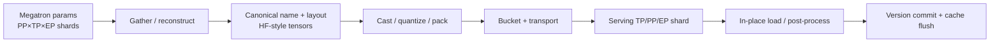
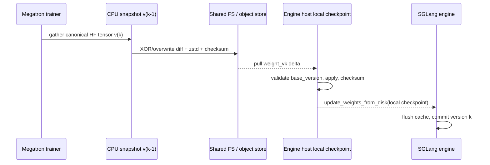
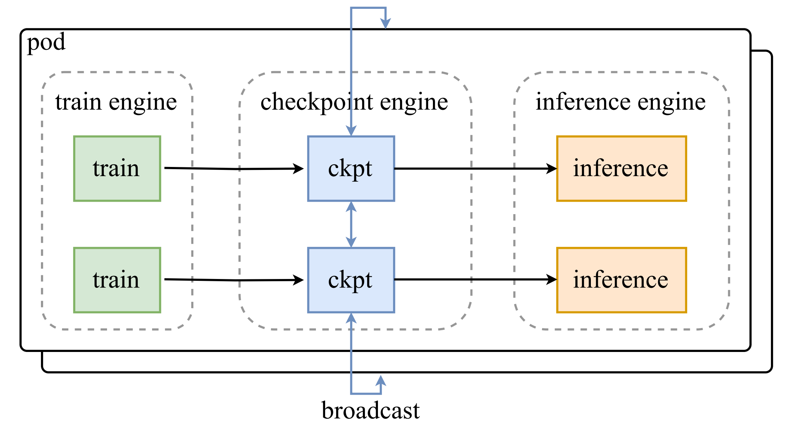
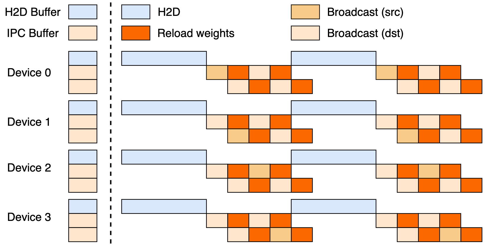
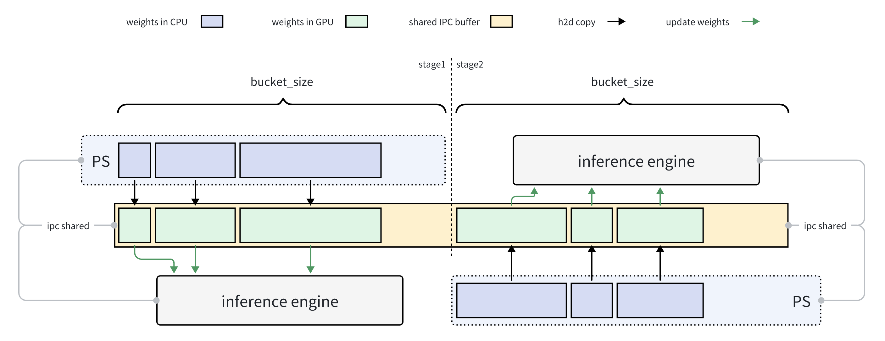

# 权重转换与同步

## 前置知识

RL 的每个 step 都可能需要把更新后的 actor 权重同步到 serving engine，这是一条高频的在线数据通路，而不是偶尔发生的 checkpoint save。本篇按 conversion、reshard、transport、atomic reload 四层展开，并比较 slime 自带的几种 updater 与 Moonshot Checkpoint Engine。阅读前建议：

- 已读 [rollout–train 架构](02_rollout_train_architecture.md)，能区分 colocated/disaggregated。
- 熟悉 TP/PP/EP shard 与 [DP distributed optimizer](../../parallel/01_dp/02_zero_and_distributed_optimizer.md)。

## 1. 权重更新与 checkpoint save 的区别

在 RL 训练里，每一个 step，或者每隔几个 step，就需要把 actor 的最新权重同步给 rollout engines。完整的路径大致是这样的：



这张图里的每一条箭头，都可能是出错的地方：

- training 与 serving parameter name 不同；QKV/gate-up 可能 fused/split；
- training TP/PP/EP 与 serving topology 不同；
- vocab embedding 有 padding，MoE experts 可能 replicated/reordered；
- BF16 training → FP8/INT4 serving 需要 scale/packing；
- request 不能看到 half-updated layers；KV/CUDA graph/cache 需要 invalidation；
- async system 还需把 weight version 绑定到 trajectory。

所以“传权重”这件事，至少要拆解成 **conversion、reshard、transport、atomic reload** 这四个层次来看待。

## 2. Source/target layout metadata

建议给每个 logical tensor 都维护下面这些信息：

```text
canonical_name
global_shape, dtype
source: pp_stage, tp_dim/range, ep_expert_ids, replica group
transform: transpose / concat / split / permute / quantize
target: engine, rank, local_name, local_shape, target_dtype
version, checksum
```

### 2.1 non-expert tensor

举一个例子，一个 column-parallel 的 QKV weight 形状是 `[3H,H]`，如果训练时用的是 TP=8，每个 rank 上持有的是 `[3H/8,H]`；换到 serving 侧用 TP=4，就需要先沿正确的维度把它 gather 回 global 形状，再重新切成 `[3H/4,H]`。如果 serving 端把 Q、K、V 按不同的 GQA shape 分开存储，还需要按 head group 做进一步的 split 或 permute。

### 2.2 MoE tensor

expert weight 会同时受到 TP 和 EP 两种切分方式的影响。source rank 往往只拥有一部分 global expert IDs，而 serving 侧可能启用了不同的 expert parallel 配置、redundant expert，或者完全不同的 expert placement。如果只是简单地按 `rank→rank` 做 broadcast，很容易把 expert 放错位置。slime 为此专门写了 [[slime:slime/backends/megatron_utils/update_weight/expert_routing.py]]，按 source 到 target 的 expert transfer bundle 和 buffer size 来规划传输，buffer 上限的校验见 `L227–L265`。

### 2.3 replicated tensor

LayerNorm、router bias 这类参数，往往在多个 TP rank 上是完全复制的。同步的时候要么只选其中一个 rank 作为 source，要么显式验证这些副本是否相等；否则既会浪费带宽，也可能因为不同副本之间出现了 drift，导致 source 选择不确定。

## 3. slime 的 updater 选择矩阵

slime 的 actor 会根据 mode、transport 和 topology 来选择用哪一个 updater 类，具体逻辑在 [[slime:slime/backends/megatron_utils/actor.py#L151-L181]]：

| 条件 | updater | 数据面 |
| --- | --- | --- |
| colocated + full | `UpdateWeightFromTensor` | flatten tensor + CUDA IPC / multiprocessing serializer |
| disaggregated + full + NCCL | `UpdateWeightFromDistributed` | Megatron→HF chunk + NCCL group to SGLang |
| full + disk | `UpdateWeightFromDisk` | 写完整 HF checkpoint + hot reload |
| delta + disk | `UpdateWeightFromDiskDelta` | CPU snapshot diff + compressed safetensors delta + local apply/reload |

### 3.1 共通 conversion iterator

无论用哪个 updater，都会遍历一遍 named parameters/buffers：先处理 non-expert 部分的 TP gather，再处理 expert 部分的 EP gather，把 Megatron 的 layout 转换成 HF 风格的 `(name,tensor)` chunk。[[slime:slime/backends/megatron_utils/update_weight/hf_weight_iterator_direct.py#L24-L94]] 就是这个 iterator，bucket 的打包逻辑在 `:135-160`，上限由 `--update-weight-buffer-size` 控制。

这里的要点是：**conversion 应该尽量在 source shard 一侧流式完成**，而不是先在某一张 GPU 或者某一台机器的 CPU 上，把整个可能达到 1T 参数的模型都物化出来。bucket 的大小本质上是在显存、带宽和并发度之间做的一个折中，同时它也是错误隔离的最小单位。

## 4. Colocated：tensor flatten + CUDA IPC

`UpdateWeightFromTensor` 会把同一 dtype 的 named tensors flatten 成一段连续的 `uint8` storage，附带上 `(name,shape,dtype,offset)` 这样的 metadata；训练侧的 rank 通过 IPC serializer，把这段 device storage 的 handle 交给同机 colocated 的 SGLang 进程。核心的发送逻辑见 [[slime:slime/backends/megatron_utils/update_weight/update_weight_from_tensor.py#L359-L424]]，大致分成这几步：

1. 按 dtype 或 multi-dtype bucket 组织；
2. 构造 flat tensor 与 metadata；
3. training ranks `gather_object` IPC serialized handles 到 engine source rank；
4. engine `update_weights_from_tensor(load_format=flattened_bucket)` 建视图并 load；
5. refs 完成前 source tensor 必须保持 alive。

### 性质

- IPC 这种方式通常不会真正复制底层的 GPU storage，传输的 metadata 和 handle 只是控制数据；
- inference 侧的 `load_weights` 会不会把数据 copy 到最终的 parameter，这一点由 engine 自己决定；无论如何，在收到 ack 之前，训练侧都不能释放 source tensor；
- 这种方式只适用于同一台机器上、可以共享 CUDA IPC 的 colocated 进程之间；
- 在这种场景下做 delta encoding 没有任何收益，所以 slime 直接禁止了 delta 加 colocate 这种组合，见 [[megatron-lm:megatron/training/arguments.py#L2054-L2068]]。

## 5. Disaggregated direct NCCL

`UpdateWeightFromDistributed` 会为训练和 rollout 之间专门建立一个 weight-update 的 process group，再按 bucket 把已经转换好的 HF tensors 发送给 engines。类的入口见 [[slime:slime/backends/megatron_utils/update_weight/update_weight_from_distributed.py#L23-L103]]；non-expert chunk 的逐参数 conversion 和 bucket 逻辑在 `:156-202`；远端调用的 RPC `update_weights_from_distributed` 则在 `:326-350`。

优势：

- 不写磁盘，延迟低；
- bucket 可限制 peak memory，并让 conversion/communication overlap；
- target engine 可按 name 切本地 shard。

限制：

- training 与 rollout 要能建立 compatible NCCL group，网络/硬件/driver 约束强；
- process group lifecycle 与失败恢复复杂；engine 扩缩容需重建 group；
- 全量传输 byte cost 约为 actor size × rollout replicas（具体 collective 可减少 source read，但 wire 仍大）。

## 6. Full update from disk

这种方式下，训练端会写出一份完整的 HF checkpoint，目录形如 `weight_v000123/`，engine 侧调用原生的 `update_weights_from_disk` 做热加载。如果配置了 local checkpoint 目录，每台 host 会先从共享文件系统 pull 一份到本地 NVMe，再由各个 rank 从本地读取，避免每个 rank 都去重复访问共享存储。

它的优势是和具体环境、硬件解耦，产出的文件也便于审计，失败后还可以直接重试；缺点是每次更新都要写出完整的 actor，对大模型或者高频更新的 RL 训练来说，代价相当高昂。完整流程见 [[slime:docs/zh/advanced/external-rollout-engines.md#L58-L80]]。

原子性要求：

1. 写临时目录/文件并 fsync；
2. index/manifest 最后 commit；
3. object-store mount 用 post-write/pre-read hook 强制 visibility；
4. 所有 hosts 校验完成后才 reload/发布 version；
5. 失败不移动 current version pointer。

## 7. Delta weight sync

slime 的 delta path 主要面向 disaggregated 或者共享文件系统的场景：



### 7.1 Seed invariant

第一次调用并不会发送 delta，而是从 `--hf-checkpoint` 捕获一份 CPU baseline，同时让所有 engine 都物化出同一个 base。不能随便从当前 Megatron GPU 上的权重去做 seed，因为 Megatron 到 HF 的 round-trip 转换过程中，可能会裁掉一些用于 padding 的 vocab 行；snapshot 和 engine 的 base 必须做到逐字节对应。源码见 [[slime:slime/backends/megatron_utils/update_weight/update_weight_from_disk_delta.py#L82-L125]]。

### 7.2 编码

- XOR：`diff = new ^ old`，没有变化的 byte 会变成零，因此非常适合 zstd 压缩；但它有一个特性，apply 两次会把结果还原回去，所以必须精确匹配 base 和 version，并且只能 apply 一次；
- overwrite：直接编码发生变化的位置和新的 byte 值，传输量更大一些，但它是幂等的，重复 apply 也不会出问题。

代码 `:223-252` 会在一个线程池里完成 diff 和压缩，并更新 snapshot；它用 pinned CPU buffer，把 GPU 到 CPU 的拷贝和 CPU 上的 diff/compress 这两步接成一条 pipeline，实现见 `:199-273`。

### 7.3 发布与完整性

delta 最终还是会被包装成一个 canonical 的 HF directory：每个 writer 产出一个 `model-xxxxx.safetensors` 文件，index metadata 里记录着 `version/base_version/encoding/compression/checksum`，对应 `:127-168`。engine 所在的 host，只有在逐个 tensor 的 checksum 都校验通过、并且 base version 也对得上的情况下，才会报告更新成功。详细约束见 [[slime:docs/zh/advanced/delta-weight-sync.md#L27-L59]]。

### 7.4 适用条件

优化器的更新通常会让绝大多数 parameter 的字节每个 step 都发生变化，所以“changed byte density”未必真的很低；不过 XOR 编码利用的是高位不变、低位变化这种模式，仍然可能获得不错的压缩率。实践中必须实测 `density`、`wire_bytes`、压缩用的 CPU 时间，以及 apply/reload 的耗时。如果变化的模式接近随机（比如某些 low precision 或者量化更新的场景），delta 反而可能不如直接走 full NCCL 划算。

## 8. Moonshot Checkpoint Engine

Checkpoint Engine 的 `ParameterServer` 和 inference engine 部署在同一台机器上，维护着一份 CPU pinned 的 checkpoint 引用，对外提供两种更新方式：

- **Broadcast**：同步更新大量 inference instances，默认最快；
- **P2P**：动态新增/重启少量 instances 时，通过 Mooncake transfer engine 从已有 instances/parameter servers 定向传权重，避免打扰全部 workers。



> 图：Checkpoint Engine 把 checkpoint/训练来源、parameter servers 和多个 inference engines 解耦，用 broadcast 或 P2P 执行在线 update（MoonshotAI 2025；[[checkpoint-engine:README.md#L13-L28]]）。

### 8.1 Register 与 metadata plan

`ParameterServer.register_checkpoint` 可以接受 safetensors 文件或者 named tensors，把它们注册成 CPU/pinned memory buffer；如果是 `/dev/shm` 上的 safetensors，还可以用 `cudaHostRegister` 做 in-place pin，但源码里明确警告过，这个过程会把原文件移除掉，见 [[checkpoint-engine:checkpoint_engine/ps.py#L305-L378]]。这是一个**具有破坏性的 API**，使用之前必须先把原文件持久化保存好。

`gather_metas` 会跨所有 rank 收集 `(name,shape,dtype,ptr,size,device UUID,RDMA device)` 这些信息，见 [[checkpoint-engine:checkpoint_engine/ps.py#L462-L525]]。这份 metadata 允许 source 和 target 的 topology 不同，并据此生成 H2D 的 bucket。

### 8.2 Broadcast pipeline

README 把整个更新过程拆成了 H2D、broadcast、reload 三个阶段，对应源码里的 `_update_per_bucket`，具体展开是：

1. 按全局最小 free memory 与最大 tensor 自动选 bucket，内存足时保留额外 H2D buffer：[[checkpoint-engine:checkpoint_engine/ps.py#L632-L682]]；
2. 分配 `2×bucket_size` double buffer，并导出 CUDA/NPU/XPU IPC handle：`:804-849`；
3. owner rank H2D copy，broadcast 到 parameter server ranks；
4. inference worker 通过 ZMQ 得到当前 buffer slice 的 `(name,dtype,shape,offset)`，直接建 view/load：`:851-905`；
5. 两次 `None` handshake 先释放 IPC resources，再做 engine post-hook：`:907-936`。



> 图：double buffer 让通信与 inference-side copy/reload overlap；内存不足时退化为 serial path（MoonshotAI 2025；[[checkpoint-engine:README.md#L20-L37]]）。README `:227-230` 同时说明论文中的完美三阶段 overlap 尚未完整实现，不能把概念图当作当前所有硬件上的实测 pipeline。

### 8.3 CUDA IPC handoff

inference worker 侧的 `update_weights_from_ipc` 大致是这样一套流程：先 attach 导出的 `uint8` buffer，再按照 metadata 建出 typed views，交给 `model.load_weights` 加载，然后释放 handle，最后调用 `process_weights_after_loading`，见 [[checkpoint-engine:checkpoint_engine/worker.py#L39-L130,L168-L230]]。主模型和 MTP/drafter 都可以用这套流程同步更新。

IPC handle 的生命周期必须完整覆盖 consumer 加载数据的整个过程；即便走到异常路径，也必须记得 detach。ParameterServer 用 context manager 来管理这件事，测试用例里也专门验证了无论成功还是失败，handle 都会被正确释放。

### 8.4 P2P 更新与 topology-aware assignment

如果调用时传入了 `ranks` 参数，就不会做全员 broadcast，而是改用 Mooncake 的 RDMA P2P。`_assign_receiver_ranks` 会按照 RDMA device 分组，轮转分配 bucket，尽量让 sender 和 receiver 的 NIC 都并行用起来，见 [[checkpoint-engine:checkpoint_engine/ps.py#L108-L163]]；真正执行 remote read 的逻辑在 `_copy_to_buffer:684-714`。这种方式适合只新增少量 replica 的场景，不适合作为每个 step 都要刷新全集群 policy 的默认路径。



> 图：Checkpoint Engine 用双 buffer 让 update、copy 与 inference-side load 尽量重叠；bucket 越大吞吐越高但 peak memory 越大（MoonshotAI/checkpoint-engine, `figures/overlap-update-and-copy.png`）。

### 8.5 性能与限制

项目 README 目前报告的数字是：Kimi-K2 这样 1T 规模的模型，在数千张 GPU 上大约 20 秒完成一次更新；公开表格里给出的另一个数据点是，在 256 张 H20、TP16 的配置下，Kimi-K2 FP8 的 broadcast 大约需要 16.04 秒（[[checkpoint-engine:README.md#L45-L61]]）。不过这些数字会因为 model dtype、每个 rank 传输的字节数、bucket 大小、NUMA/H2D 拓扑、网络条件，以及 engine 版本而有很大差异，不能直接照搬到自己的场景。

Checkpoint Engine 目前已经集成了 vLLM 和 SGLang；broadcast 支持 CUDA、NPU、XPU 这几种硬件，P2P 则依赖 Mooncake，其中 XPU 目前还没有 Level Zero 的 P2P backend。FP8 的热更新可能还需要额外的 engine patch 或者 post-processing，见 `README.md:155-161, 227-230`。

## 9. slime 与 Checkpoint Engine 的分工

把 slime 自带的能力和 Checkpoint Engine 放在一起对比，可以看出它们其实不是互斥关系，而是各有侧重：

| 需求 | slime native | Checkpoint Engine |
| --- | --- | --- |
| colocated actor→SGLang | tensor flatten + IPC | parameter server broadcast + IPC worker |
| disaggregated same NCCL domain | direct full NCCL | broadcast service，可解耦 lifecycle |
| cross-cluster/shared FS | full/delta disk | 当前重点不是 disk delta |
| dynamic add/recover replicas | rebuild/update groups | P2P targeted ranks 是核心能力 |
| canonical artifact/checksum chain | disk paths 强 | CPU registered checkpoint/metas，侧重在线服务 |
| huge serving fleet fanout | engine RPC groups | broadcast optimized for many instances |

一个可行的生产设计，是让 slime 的训练侧负责产出 canonical 的 named tensors 或者 checkpoint，再交给 Checkpoint Engine 去管理 fanout；也可以保留 slime 的 delta path 用来处理跨 region 的同步，而在每个 region 内部用 checkpoint service 去更新各个 replica。

## 10. Quantization 与派生权重

从 BF16 转到 FP8 或者 INT4，并不只是简单的类型转换：可能还涉及 per-block scale、weight transpose、packing、MoE 的 group layout，以及 MTP/draft weight 的处理。常见的策略有：

1. training 直接 QAT-compatible representation，sync 已量化 tensor；
2. source-side quantize，减少 wire bytes但占 training GPU；
3. target-side quantize，wire 大但 engine-native；
4. background conversion + double-buffer version，overlap 下一步 train。

无论选用哪种策略，都需要对 logical 或者 physical representation 做 checksum，并挑选一些小 tensor 或者特定 layer，用 `check_weight_update_equal` 去验证。只比较一个 scalar mean 是不够的，它没办法捕捉到 transpose 或者 reshard 过程中出现的错位。

## 11. 正确性与性能 checklist

最后给出一份上线前值得检查的 checklist。

### 正确性

- canonical names 数量、global shapes 与 numel 总和匹配；
- TP/PP/EP shard ranges 无 gap/overlap；replicas equality 明确；
- quant scale/packed tensor/MTP 一并更新；
- update 前 pause/abort，后 flush KV/cache/CUDA graph；
- version/base/checksum 原子提交；
- 随机抽 layer 比较 exact/allclose，并跑 train–rollout log-prob gate。

### 性能

- 分别计 conversion、gather、H2D/D2H、wire、apply、reload、flush；
- bucket size sweep，同时看 peak memory；
- NUMA bind 与 NIC/RDMA topology；
- overlap timeline，而不只看 total；
- `bytes transferred / model bytes / replicas`，识别重复传输；
- update interval 带来的 staleness 与吞吐共同报告。

---

**下一篇**：接下来[Agentic RL infra](06_agentic_rl.md)会讨论怎样把 tool 和 environment 参与的多轮交互，转成 token-correct、可以正确归约、又能异步执行的 trajectory。
