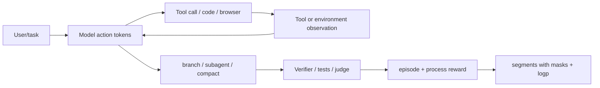
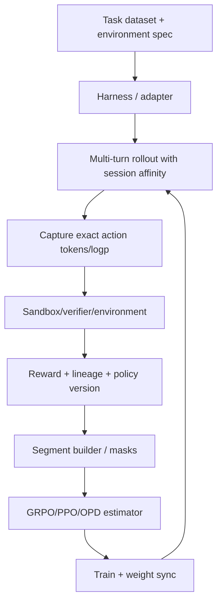

# Agentic RL infra

## 前置知识

本篇讨论 agentic RL 的系统侧：多轮工具调用、sandbox、branch 与 context compaction 如何被整理成 token 级正确、可归约、可异步执行的 trajectory。阅读前建议：

- 已读 [框架映射](01_framework_mapping.md) 与 [async 与 partial rollout](03_async_partial_rollout.md)。
- 知道 `loss_mask` 只让模型 action token 产生梯度。

## 1. Agentic RL 与单轮 RL 的差异

单轮 RL 可以近似为「prompt、response、reward」三步；agentic RL 则是：



系统必须同时处理：

- 不同 turn 的 prompt token 由 chat template 重新渲染；
- observation 可能很长、异步、失败或带安全边界；
- 一个 session 可 fork 多条候选/subagent；
- context compaction 会改变 token prefix；
- reward 往往 episode-level，credit 却只应给 model action；
- agent wall time 与 token length 都 heavy-tail。

## 2. 最小 trajectory contract

对每个可训练 segment，保存：

```text
session_id / rollout_id / turn_index
prompt_ids or full tokens
action token ids + action log-probs
loss_mask: action=1, observation/template=0
finish_reason / status / truncation
tool calls, tool result references, environment state hash
episode reward, process/turn reward, verifier metadata
policy_version, sampling params/seed
```

不要只保存 `messages`：response text 重新 tokenization 会破坏 action log-prob 对齐。slime adapter contract 明确是“message history in，sampled tokens out”，[[slime:docs/zh/get_started/agent.md#L29-L55]]。

## 3. slime 的 agent stack

### 3.1 protocol adapters

`AnthropicAdapter` 与 `OpenAIAdapter` 把 wire protocol 转成统一 session：

1. translate messages/tools；
2. 用 tokenizer 渲染 prompt IDs；
3. 调 SGLang `/generate`，`return_logprob=True`；
4. 解析 tool/reasoning output；
5. 记录 `TurnRecord(prompt_ids, output_ids, output_log_probs, finish_reason)`；
6. session 结束后交给 `TrajectoryManager` linearize。

[[slime:slime/agent/adapters/common.py#L318-L391]] 是 shared turn pipeline；`:442-518` 负责 exact token IDs 与 log-prob request，取消时发送 `/abort_request` 释放 KV。

### 3.2 TrajectoryManager 的 routing tree

session 不是线性 list，而是一棵 message tree：[[slime:slime/agent/trajectory.py#L46-L109]]。每个 generated assistant node 关联 `TurnRecord`，system/user/tool 是 routing-only node。

record turn 时先按 message equality 找 mount point，再处理 assistant rewrite：`trajectory.py:283-305, 352-419`。这样相同前缀的多个 branch 可以共享 context，但每个生成 response 只在合适的 leaf 上训练。

### 3.3 token drift 与 fork/realign

TITO、chat-template 重渲染或 whitespace 会造成新 prompt token 与已保存 builder 不一致。slime 分类：

- CLEAN：旧 tokens 是新 prompt exact prefix，append tail；
- REALIGN：短漂移发生在最近 response，覆写为 loss=0 context；
- FORK：漂移太早/太长，关闭旧 builder，开新 branch。

定义与实现 [[slime:slime/agent/trajectory.py#L130-L191]]；`_SampleBuilder.append_turn` 在 `:193-229` 追加 prompt（mask=0）与 action（mask=1）。这比“把所有重渲染文本再 tokenize 后当答案”安全得多。

### 3.4 segment emission

`get_trajectory` 把每个 routing leaf linearize 成 `list[Sample]`，同一 session 可有多个 segments，并将 reward、metadata 写回：[[slime:slime/agent/trajectory.py#L307-L344]]。每个 sample 默认沿用/生成同一 `rollout_id`，训练 side 会按 rollout 聚合 denominator。

## 4. loss mask 与 credit assignment

一个多轮示例：

```text
[user] solve task                         000000
[assistant] call search("...")             111111
[tool] result: ...                         000000
[assistant] reason + final                   111111111
[environment] tests passed                 000000
```

episode reward `R` 可广播给 action tokens，但必须明确：

- response action token 训练；tool result 不训练；
- failed/aborted segment 是否 `remove_sample`；
- subagent/main-agent 是否共享 reward，是否按 segment 分摊；
- compact 前 frozen chain 是否只作为 context，还是保留 action signal；
- process reward 是否按 turn/token 生成。

若一次 prompt 返回 `K` 个 segments，默认把同一个 `R` 复制 K 次会放大该 episode。推荐以 `rollout_id` 聚合，或明确 `R/K` 分配，并在 reducer 记录 `rollout_mask_sums`。

## 5. session affinity 与 serving

同一 agent session 的每轮 prompt 包含大量共同 prefix。router 应以稳定 `session_id` 做 consistent hashing，让多轮请求尽量落到同一 worker，复用 radix/prefix cache；slime SGLang generate 在 [[slime:slime/rollout/sglang_rollout.py#L196-L200]] 发送 `X-SMG-Routing-Key`，agent 文档也建议 `router_policy=consistent_hashing`。

### 5.1 PD 与 multi-model

agentic workload 常同时需要：actor、reference/teacher、reward/judge、tool-side model。SGLang config 可描述：

- actor prefill/decode groups；
- frozen reference/reward model（`update_weights: false`）；
- heterogeneous TP/PP、不同 memory fraction；
- external engine 与独立生命周期。

不要把每个 tool result 都发到 actor GPU；tool/env 可在 CPU、sandbox cluster 或 external service，返回引用/observation，再由 prompt builder 拼进下一轮。

### 5.2 session KV 与 weight update

更新 actor weight 时，旧 KV cache 对应旧 model version，不能继续无标记使用。安全策略：pause session、flush actor KV、versioned resume；或者允许旧 session 完成并将新 weight 只路由给新 session，但必须在 sample metadata 记录 version。

## 6. Sandbox 与 tool execution

coding agent RL 常把每条 task 放入独立 sandbox：

```text
boot sandbox → mount task → agent tool loop
    → collect git diff / trace / token segments
    → apply diff to clean sandbox
    → run tests/verifier
    → reward + finish_session
```

slime coding-agent example 将 sandbox contract、harness lifecycle、SWE task 与 adapter 分层：[[slime:examples/coding_agent_rl/generate.py#L1-L15]]；per-sample 生成有 wall-clock guard、sandbox retry、clean evaluation 与 adapter finish：`:182-283`。

### 安全/可重复性边界

- sandbox user、network、filesystem 与 host GPU 权限隔离；
- tool command、stdout/stderr、exit code、time budget 写 metadata；
- reward evaluator 在干净 workspace 应用 diff，避免 agent 直接污染 grader；
- tool output 大时只保存 content hash + object-store URI，训练 prompt 保留可复现 slice；
- 任何外部 API 要记录版本/时间/seed，否则 replay 不可重现。

## 7. Multi-agent、fan-out 与 branch

一个主 agent 可以 spawn subagent；每个 branch 产生 action tokens，但最终可能共享 task reward。slime custom generate 支持返回 `list[Sample]`，要求 sibling `rollout_id` 相同；文档示例在 [[slime:docs/zh/get_started/customization.md#L87-L117]]。

推荐保存 lineage：

```text
episode_id
parent_segment_id
branch_id / agent_role
turn_range
context_snapshot_hash
reward attribution mode
```

训练 batch 可按 `rollout_id` 做 group/denominator；分析则按 `parent_segment_id` 看哪个 subagent strategy 提高成功率。

## 8. Long-horizon context management

context compaction、summary、retrieval 会改变 prefix。三种方式：

| 方式 | token/logp | 适用 |
| --- | --- | --- |
| exact replay | 保留完整 history/token IDs | 短/中 session，最高 fidelity |
| loss-masked compact | compact summary 作为 prompt=0，后续 action=1 | 长 session，summary 不训练 |
| fork/replace | 漂移超阈值后新 builder | TITO/模板改写严重 |

slime `_SampleBuilder` 的 `REALIGN/FORK` 逻辑可把短 drift mask 掉；过长 drift 直接 fork，避免把错误历史当作 action signal。context cap 必须将 truncation 原因写入 metadata，区分 infra cap 与 environment failure。

## 9. Agentic async/partial

agent 任务的长尾来自 tool latency/sandbox/test，不只来自 decode。适配策略：

1. per-sample asyncio，不要在 rollout task 里同步阻塞 subprocess；
2. `asyncio.timeout` 与 tool-level deadline；
3. sandbox boot pool 与 concurrency cap，避免启动风暴；
4. aborted session 的 trajectory state 可持久化，下一轮继续同 session 或安全 restart；
5. fully async queue 需按 episode priority/age 防止长任务饿死短任务；
6. partial prefix 是否保留取决于 tool state 是否可恢复：decode prefix 可 resume，外部 side effect 不一定幂等。

slime fully-async worker 对 ABORTED group 当前默认 requeue restart；coding-agent 示例则在异常/timeout 中显式 `_abort_result`，设置 zero loss mask 与 `remove_sample`，源码 [[slime:examples/coding_agent_rl/generate.py#L316-L333]]。二者语义不同，接入时要选择“可 resume”还是“安全丢弃”。

## 10. Agent metrics

```text
task: success/pass@k, verifier score, reward components
trajectory: turns, action tokens, tool calls, branches, compactions
latency: time-to-first-action, tool wait, sandbox boot, evaluator, e2e p50/p95/p99
quality: invalid tool call, retry, hallucinated observation, loop/repetition
training: per-turn loss, action-mask tokens, segment/episode denominator
infra: queue age, session affinity hit, KV reuse, partial/resume/restart tokens
```

必须同时报告 token-level 与 wall-clock：agent 可能用更少 rollout steps 但每步更慢，或成功率提升来自更多 retry/tool budget。

## 11. Agentic RL recipe



先做单 agent、单 tool、短 horizon deterministic gate；再加入 branch/compact；最后才切 external sandbox、PD、fully async 和多 agent。每增加一层都保存可 replay 的 trajectory dump。

## 参考

- slime [[slime:docs/zh/get_started/agent.md#L1-L73|Agentic RL training roadmap]]。
- slime [[slime:docs/zh/get_started/customization.md#L32-L47|customization guide]]。
- slime `TrajectoryManager`：[[slime:slime/agent/trajectory.py#L1-L344]]。
- OpenAI, [SWE-bench](https://arxiv.org/abs/2310.06770), 2024；Jain et al., [R2E-Gym](https://arxiv.org/abs/2504.07164), 2025。

---

**下一篇**：回到[本章总览](../README.md)，再按[框架映射](01_framework_mapping.md)、[训推一致性](04_consistency_determinism.md)、[权重同步](05_weight_sync.md) 的顺序阅读代码实现。
