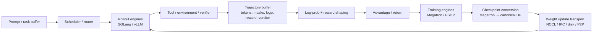
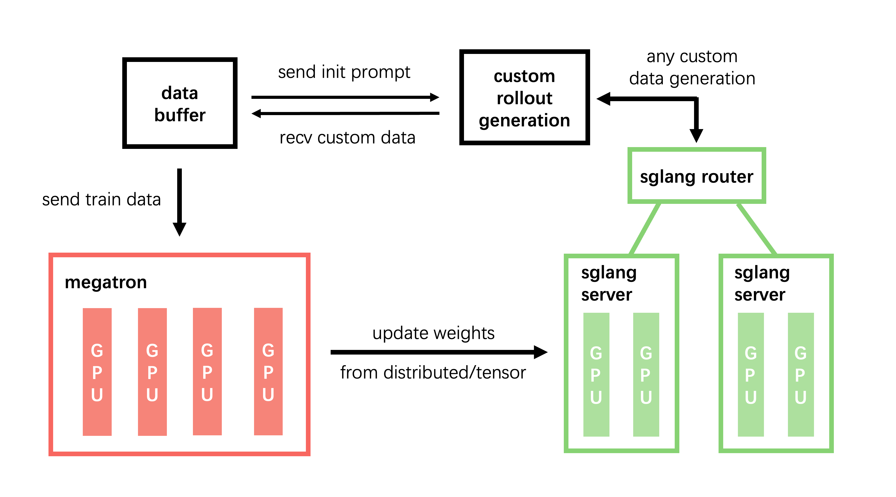

# RL infra 总览

## 前置知识

本部分讨论 post-train 的系统侧：算法需要的张量如何在真实框架之间流动，以及长尾、训推不一致、权重同步和 agentic workload 分别落在系统的哪一层。阅读前建议：

- 已读[算法 overview](../algorithms/README.md) 与 [PPO：从 sequence reward 到 clipped policy update](../algorithms/02_ppo.md)，知道训练侧需要哪些 log-prob、reward、advantage 与 mask。
- 熟悉 [大规模训练的并行策略 —— 总览](../../parallel/README.md) 的基本通信语义。

## 最小闭环

理解这套系统时，容易陷入的一个误区是把它想象成“一个 trainer 调用一个 inference API”这么简单；更准确的抽象方式，是把它看成四种各自有生命周期的数据在系统里流转：

> 图：slime 将 Megatron training、SGLang rollout/router 与 Data Buffer 放在同一条 RL dataflow 上；本文后续各篇分别展开这三个大块及其边界（THUDM/slime, commit `41014d1f`；原图见 [[slime:imgs/arch.png]]）。

| 数据 | 最小字段 | 生命周期/一致性要求 |
| --- | --- | --- |
| prompt | `prompt`, `index`, `group_index`, `session_id` | scheduler 可重试；deterministic seed 与 index 稳定 |
| action trajectory | `tokens`, `response_length`, `loss_mask`, `rollout_log_probs` | token identity 不可丢；partial 可 append/recycle |
| learning signal | `reward`, `raw_reward`, `advantages`, `returns`, `ref/teacher_log_probs` | 明确 denominator、normalization 与 stop-gradient |
| model state | `policy_version`、route metadata、weight checksum | update/rollback/replay 时可审计 |

## 章节地图

下面这张表列出了本章各篇文档分别关注的重点，可以按需查阅。

| 文档 | 重点 |
| --- | --- |
| [框架映射](01_framework_mapping.md) | slime/Ray/SGLang/Megatron 的对象、函数与张量边界 |
| [rollout–train 架构](02_rollout_train_architecture.md) | synchronous / async、colocated / disaggregated、PD 与资源布局 |
| [async 与 partial rollout](03_async_partial_rollout.md) | long-tail、over-provision、partial recycle、fully async、staleness |
| [训推一致性与 determinism](04_consistency_determinism.md) | rollout routing replay、GSPO training replay、batch-invariant kernels、bitwise reproducibility |
| [权重转换与同步](05_weight_sync.md) | Megatron→HF→serving reshard；slime full/delta；Checkpoint Engine broadcast/P2P/IPC |
| [Agentic RL infra](06_agentic_rl.md) | multi-turn、session affinity、tool/env、sandbox、trajectory split 与 agent metrics |

## 系统级不变量

在具体展开各个子系统之前，先列出几条贯穿始终、不能违反的系统级不变量。

### I. 每条 action 都能追溯到 policy version

`tokens`、`rollout_log_probs`、`sampling_params`、`sampling_seed`、`weight_version` 这几项需要一起记录下来。如果没有明确的 version 信息，所谓的“on-policy”其实只是一个未经验证的假设。

### II. 每个 loss token 都有来源和 mask

response 或者 action token 的 mask 应该为 1；prompt、tool result、padding，以及被 filter 或者 abort 掉的无效 token，mask 应该为 0。当一条轨迹被拆分成多个 segment 时，这些 sibling segment 需要共享同一个 `rollout_id`，防止同一个 episode 的 reward 被重复计数。

### III. 每次 weight update 有原子边界

不能在处理一个 request 的过程中，只切换其中一部分 layer 的权重；正确的做法是暂停或者中止当前请求，或者依赖 engine 自身支持的 version barrier，等权重更新完成、KV cache 也被 flush 之后，再放行新的 generation。

### IV. 通信 topology 与计算 topology 分开描述

训练时用的 TP/PP/CP/EP 切分方式，和 serving 时用的 TP/PP/DP 并不是一回事。权重同步实际上需要维护 names、shard ranges、dtype、quant metadata 和 target topology 这些信息，而不能简单地用一个 `state_dict.copy_()` 就蒙混过去。

## 性能模型

一个同步 step 的 wall time，可以粗略地写成：

$$
T_{step}\approx T_{prompt}+\max_iT_{rollout,i}+T_{reward}+T_{train}+T_{sync}.
$$

一旦这个 step 时间被少数几条特别慢的 trajectory 拖成长尾分布，比较合理的优化顺序通常是：

1. 降低 $\max_i T_{\text{rollout},i}$（continuous batching、partial、APRIL、async）；
2. overlap $T_{\text{train}}$ 与下一批 rollout；
3. 降低 $T_{\text{sync}}$（bucket/IPC/delta/P2P）；
4. 最后再调 kernel throughput。

## 代码版本

本章引用的 commit：

- slime `41014d1f29e201137fdffce737bb8bac65bc5219`；
- checkpoint-engine `d1de07b3aacff34050d09c3efa093f9a2fcdcf73`。

这些源码镜像只用于本地核对代码事实，本文只会修改站点上的文档内容，不会改动参考仓库本身。

---

**下一篇**：接下来[框架映射](01_framework_mapping.md)会从 `train.py` 和 `RolloutManager` 这两个入口出发，一层一层追踪一个 rollout sample 究竟是怎样变成 Megatron 里的一个 loss 的。
