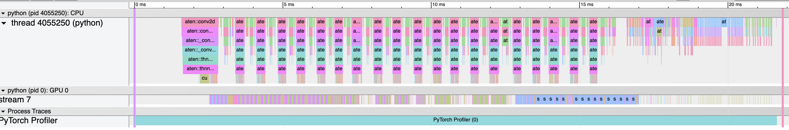
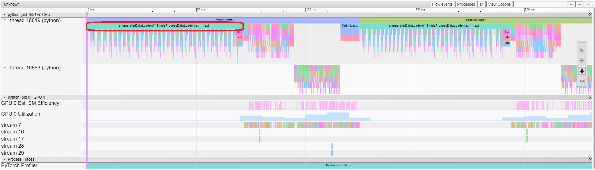
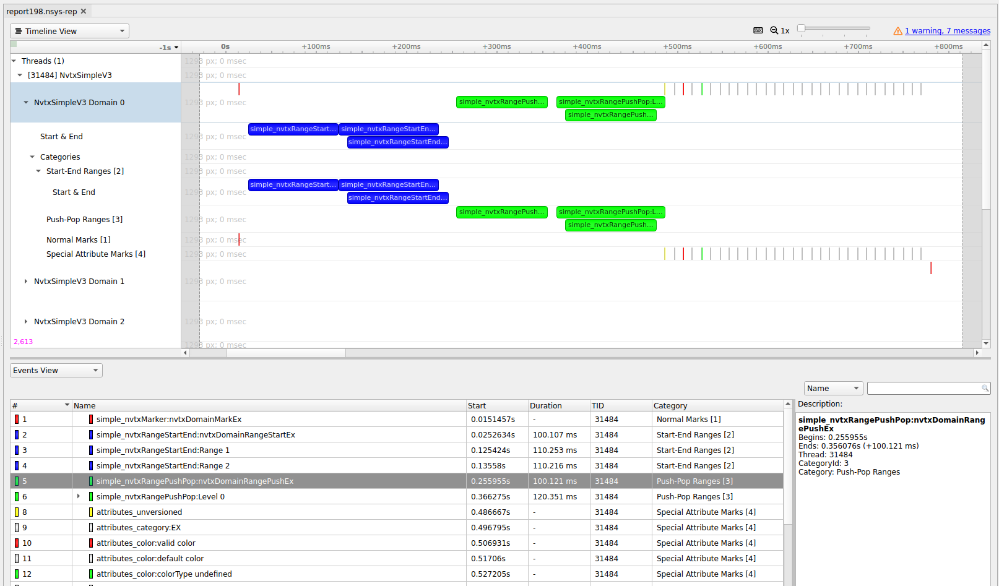
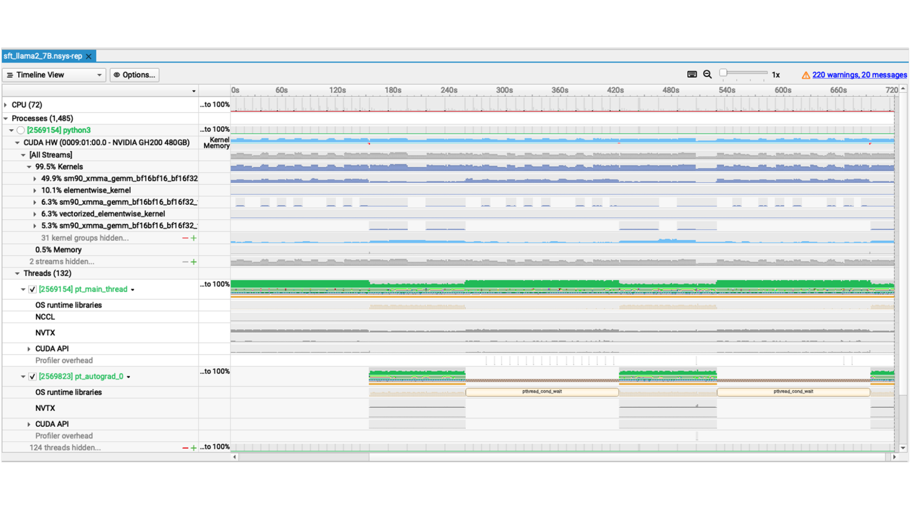
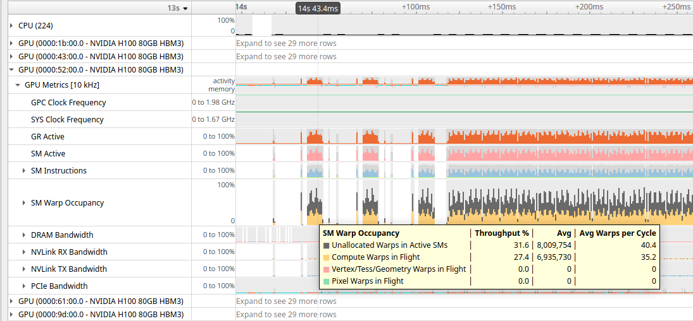

# 01 · 时间线 tracing：torch.profiler 与 Nsight Systems

> 读这篇之前，最好先看过 [`README`](./README.md) §0 里的时间线三问，也知道 CUDA kernel 是异步执行的——CPU 只负责把 kernel 推进队列就返回，真正的耗时发生在 GPU 自己的时间线上（见 [05 · CUDA 执行模型：stream / event / 显存分配 / AMP](../torch/05_cuda_streams_memory_amp.md) §1）。
>
> 本篇讲「时间」这个观测维度上的两件工具。它们读的是同一条 CPU/GPU 时间线，区别只在于放大倍数：torch.profiler 站在框架语义这一层，回答「哪个 op 花了多少时间」；Nsight Systems（nsys）站在系统这一层，回答「整条时间线上 CPU 和 GPU 到底谁在等谁」。实际排查时总是先用 torch.profiler 切第一刀——只需要在训练脚本里加十几行代码；需要看系统级的排队情况时，再在同一套「框窗口、打语义、读时间线」的方法论下换到 nsys。所以本篇把两件工具放在一起讲：§1–§6 是 torch.profiler，§7 是两者的分工对照，§8–§13 是 nsys。

---

## 1. 三层打点流水线

`torch.profiler` 并不是一个单一组件，而是一条事件采集流水线。理解它分了哪几层，才能明白每个参数具体控制的是哪一层、为什么有的参数开销特别大：

```
你的代码          model(x) → aten::mm → cudaLaunchKernel → GPU 执行
                     │            │             │              │
打点层   ┌───────────┼────────────┼─────────────┼──────────────┤
         │  RecordFunction 回调   │   CUPTI 回调  │  CUPTI activity
         │  (python/op/autograd   │  (runtime API │  (kernel/memcpy
         │   入口出口时间戳)      │   时间戳)     │   开始/结束)
         └───────────┼────────────┴─────────────┴──────────────┘
                     ▼
收集层        Kineto（进程内 buffer，按 correlation id 关联）
                     ▼
输出层        chrome trace JSON / TensorBoard / key_averages 表
```

先看 CPU 侧的事件是怎么来的：每个 aten op（以及 autograd 节点、`record_function` 区间）进出的时候，RecordFunction 机制会打一个时间戳，生成一条 `cpu_op` 事件；`ProfilerActivity.CPU` 控制的就是这一层。GPU 侧则不同，是由 CUPTI（CUDA Profiling Tools Interface）拦截 CUDA runtime API 的调用（比如 `cudaLaunchKernel`），从而回收 GPU 上 kernel、memcpy 真实执行区间的时间戳；`ProfilerActivity.CUDA` 控制的是这一层。两侧事件之间的关联，靠的是 correlation id / external id：CPU 侧的 `aten::mm` 事件与 GPU 侧的 GEMM kernel 事件通过它们串联起来——所以在 trace 里点一个 op，能看到它 launch 出的 kernel；在 key_averages 表里，一个 op 也能有对应的「Self CUDA」列。值得注意的是，`ProfilerActivity.CUDA` 在没有 GPU 的机器上没有意义（CUPTI 无东西可拦），CPU-only 环境只需要用 `CPU` activity。

正因为有这层关联，torch.profiler 相比其他工具的独特价值在于**语义**：它知道每个 kernel 是哪个 aten op 发出来的、input shape 是什么、来自哪一行 Python 代码——这些是 nsys（见 §7）默认给不了的信息。代价则是打点本身有开销，而且观测窗不能开得太大（详见 §6）。

## 2. 用法与参数

```python
import torch
from torch.profiler import profile, ProfilerActivity, schedule, tensorboard_trace_handler

with profile(
    activities=[ProfilerActivity.CPU, ProfilerActivity.CUDA],
    schedule=schedule(wait=1, warmup=1, active=3, repeat=1),   # 只录稳定态的几步
    on_trace_ready=tensorboard_trace_handler("./log"),          # 每个窗口结束自动落盘
    record_shapes=True,        # 记录每个 op 的 input shape
    profile_memory=True,       # 记录每个 op 的显存分配/释放
    with_stack=True,           # 记录 python 调用栈（贵，定位代码行时再开）
) as prof:
    for step in range(10):
        train_step()
        prof.step()            # 每个 iteration 必须调一次,驱动 schedule 状态机
```

下面是完整签名（torch 2.9，[[pytorch:torch/profiler/profiler.py]]）以及每个参数具体作用在哪一层：

| 参数 | 默认 | 作用 | 开销 |
|---|---|---|---|
| `activities` | `None`（=CPU+有 GPU 时加 CUDA） | 采集哪些层的事件（§1） | CUDA 层有 CUPTI 开销 |
| `schedule` | 全程 RECORD | `(step) -> ProfilerAction`，见 §2.1 | —— |
| `on_trace_ready` | `None` | 窗口结束时的回调（落盘/上传） | —— |
| `record_shapes` | `False` | op 事件附带 input dims / dtype / stride | 中（且会临时持有 tensor 引用） |
| `profile_memory` | `False` | op 事件附带显存 alloc/free 字节数 | 中 |
| `with_stack` | `False` | 附带 python 栈（trace 里可下钻到代码行） | **高** |
| `with_flops` | `False` | 用公式估 op 的 FLOPs（**只覆盖 matmul 和 2D 卷积**；会隐式打开 `record_shapes`） | 低~中 |
| `with_modules` | `False` | 按 `nn.Module` 层级聚合（**仅 TorchScript 模型，eager 不生效**） | 中 |
| `execution_trace_observer` | `None` | 额外导出 Execution Trace（Chakra 格式，给离线回放/仿真用） | 高 |
| `experimental_config` | `None` | 调 CUPTI 行为（如 `profiler_measure_per_kernel`），一般不动 | —— |

另外两个参数不用太关心：`use_cuda` 已经废弃；`acc_events` 是内部去重开关，日常也不需要碰。

### 2.1 `schedule`：只录该录的窗口

长训练绝不能全程开着 profiler，那样 trace 文件会爆掉，开销也会污染稳态数据。`schedule(wait, warmup, active, repeat)` 描述的是一个状态机，每个 step 会且仅会处于其中一个状态（下面是在 torch 2.9 上，用 `wait=2, warmup=1, active=2, repeat=2` 实测出来的状态序列）：

```
step:        0      1      2       3       4                5~6    7       8       9
状态:      NONE → NONE → WARMUP → RECORD → RECORD_AND_SAVE → NONE → WARMUP → RECORD → RECORD_AND_SAVE
           └── wait=2 ──┘└warmup┘└──── active=2 ────┘      └── 第二轮 repeat ──▶
```

四个参数分别控制：`wait` 是 profiler 完全不启动的步数，用来跳过初始化、cudnn benchmark、compile warmup 这些不代表稳态的阶段；`warmup` 是 profiler 已经启动但记录结果会被丢弃的步数，目的是让 CUPTI 自身预热，避免第一段 trace 失真（如果把 `warmup` 设成 0，会收到「can skew profiler results」的警告）；`active` 是真正被记录的步数，窗口内的最后一步会被标记为 `RECORD_AND_SAVE`，触发一次 `on_trace_ready`；`repeat` 则控制整个循环重复几轮，`0` 表示无限循环。另外还有一个 `skip_first` 参数，会在最前面再插入一段 NONE 状态，日常基本用不到。

Megatron 的具体取法是（[[megatron-lm:megatron/training/training.py#L3356-L3363]]）：`wait=max(profile_step_start-1, 0)`、`warmup=1`、`active=profile_step_end - profile_step_start`、`repeat=1`。在默认参数下（`profile_step_start=10, profile_step_end=12`，见 [[megatron-lm:megatron/training/config/common_config.py#L35-L38]]），这套配置的效果就是：跳过前 9 步，第 10 步用来热身，真正录下的是第 11、12 两步。

### 2.2 `on_trace_ready`：窗口结束时做什么

常见的 handler 有两种。第一种是内置的 `tensorboard_trace_handler("./log")`，它会把结果落盘为 `{hostname}_{pid}.{timestamp}.pt.trace.json`（这是 2.9 实测的命名规则）——虽然名字里带着 TensorBoard，那只是历史遗留，产物其实就是标准的 chrome trace，直接拖进 Perfetto 就能看（详见 §3.2/§3.3）。第二种是自定义函数，比如 Megatron 用它来给每个 rank 生成独立的 chrome trace 文件（[[megatron-lm:megatron/training/training.py#L3352-L3355]]）：

```python
def trace_handler(p):   # 精简自 megatron/training/training.py:3352-3355
    profile_dir = Path(f"{args.tensorboard_dir}/../torch_profile")
    profile_dir.mkdir(parents=True, exist_ok=True)
    p.export_chrome_trace(f"{profile_dir}/rank-{torch.distributed.get_rank()}.json.gz")
```

`export_chrome_trace(path)` 和 handler 之间有一个容易踩的区别：前者可以随时手动调用一次，但在 kineto 启用的情况下，它只会导出 schedule 的最后一个 cycle；后者由 schedule 在每个窗口结束时自动触发，每个 cycle 各产生一个文件。另外，文件名以 `.gz` 结尾时会自动完成 gzip 压缩。

## 3. 输出怎么读

### 3.1 `key_averages` 表

```python
print(prof.key_averages().table(sort_by="self_cuda_time_total", row_limit=20))
print(prof.key_averages(group_by_input_shape=True).table(sort_by="self_cuda_time_total"))
```

表格里各列的含义如下（2.9 实测输出，CPU-only 环境下没有 CUDA 相关列）：

| 列 | 含义 |
|---|---|
| `Self CPU %` / `Self CPU` | 该 op **自身**在 CPU 上的耗时（不含子 op）及占比 |
| `CPU total` | 含子 op 的 CPU 总耗时（`aten::linear` 的 total 包含它调用的 `aten::addmm`） |
| `Self CUDA` / `CUDA total` | 该 op 发起的 kernel 在 GPU 上的耗时（self/total 同理）——**排序一般按它** |
| `CPU time avg` | 单次平均 CPU 耗时 |
| `# of Calls` | 调用次数；次数 × avg 对不上总耗时说明耗时分布不均（值得进一步分析） |
| `Input Shapes` | `group_by_input_shape=True` 时出现，同一 op 按 shape 分行——**变长 shape 触发慢 kernel / 重编译一眼可见** |

来看一个真实的最小例子（2.9 CPU 实测，跑的是 `nn.Sequential(Linear(512,1024), ReLU, Linear(1024,512))`，共 5 步）：

```
----------------------  ------------  ------------  ------------  ------------  ------------  ------------
                  Name    Self CPU %      Self CPU   CPU total %     CPU total  CPU time avg    # of Calls
----------------------  ------------  ------------  ------------  ------------  ------------  ------------
           aten::addmm        83.10%      69.986ms        86.78%      73.085ms       7.308ms            10
            aten::relu         4.52%       3.807ms         7.89%      6.642ms       1.328ms             5
       ...
           aten::linear         1.62%       1.363ms        92.11%      77.574ms       7.757ms            10
----------------------  ------------  ------------  ------------  ------------  ------------  ------------
Self CPU time total: 84.216ms
```

读这张表的方法是：`aten::linear` 的 Self CPU 只有 1.36ms，但它的 CPU total 却高达 77.6ms——这说明它只是一层壳，真正干活的是 `aten::addmm`（Self 高达 69.99ms）。因此，正确的读法是先看 Self 列找到真正耗时的叶子节点，再看 total 列把耗时归因到对应的业务模块。

### 3.2 chrome trace

`prof.export_chrome_trace("trace.json")` 导出的是标准 chrome trace 格式，可以用 [ui.perfetto.dev](https://ui.perfetto.dev)（推荐，打开大文件不会卡）或 `chrome://tracing` 打开。文件的结构是（2.9 实测）：顶层有一个 `traceEvents` 数组，外加 `deviceProperties`（记录 GPU 型号、SM 数等信息），事件本身按 `cat` 字段分类：

| `cat` | 内容 | 在时间线上的位置 |
|---|---|---|
| `cpu_op` | aten op 区间，`args` 里有 `External id`、`Input Dims`、`Input type`、`Input Strides`（`record_shapes` 时） | CPU 行 |
| `python_function` | python 栈帧（`with_stack=True` 时） | CPU 行，可下钻到代码行 |
| `cuda_runtime` | `cudaLaunchKernel` / `cudaMemcpyAsync` 等 runtime API 调用 | CPU 行 |
| `kernel` | GPU 上 kernel 的真实执行区间 | **GPU 行** |
| `gpu_memcpy` | H2D / D2H 拷贝 | GPU 行 |
| `gpu_user_annotation` | NVTX / `record_function` 区间投影到 GPU 行 | GPU 行 |

一个真实的 `cpu_op` 事件长这样（实测所得，注意 `External id` 就是前面提到的关联键，`Input Dims` 来自 `record_shapes`）：

```json
{"ph": "X", "cat": "cpu_op", "name": "aten::linear", "pid": ..., "tid": ...,
 "ts": 4160777884626.9, "dur": 21233.9,
 "args": {"External id": 1, "Input Dims": [[64, 512], [1024, 512], [1024]],
          "Input type": ["float", "float", "float"], ...}}
```



> 图：一份真实 chrome trace 的三层结构——上方 CPU 线程行是嵌套的 `aten::*` op（`aten::conv2d` 套着子 op），下方 `GPU 0 / stream 7` 行是 kernel 的真实执行区间，最底是 profiler 进程条（PyTorch 官方 Profiler Recipe；[pytorch.org/tutorials](https://pytorch.org/tutorials/recipes/recipes/profiler_recipe.html)）。在 Perfetto 里打开时，CPU launch 事件与 GPU kernel 之间的**箭头连线**来自 kineto 写出的 flow 事件：链接名 `ac2g`（async CPU→GPU，把 `cuda_runtime` 的 launch 连到 kernel）和 `fwdbwd`（forward op 连到它的 backward op）——后一条让「点 fwd op 找到对应 bwd op」成为一键操作。

GPU 行（Perfetto 里通常标记为 `stream N`）上的每个 `kernel` 事件，会通过 correlation id 挂回发起它的 `cuda_runtime` 事件，再进一步挂回对应的 `cpu_op`——这种三层点选互跳的能力，正是 torch.profiler trace 相比纯 nsys 的最大优势。

### 3.3 TensorBoard 插件与大规模分析

历史上，`pip install torch-tb-profiler` 提供的 TensorBoard 插件曾是官方推荐的查看方式，它有 Overview / Operator / Kernel / Trace / Memory / Distributed 六个视图，其中 Distributed 视图能直接对比多个 rank 的 step 时间。但这条路线已经被废弃：pytorch/tutorials 在 2026 年 6 月删除了整个 tensorboard profiler 教程，kineto 仓库的 tb_plugin 目录也在移除流程中。因此，本仓库把默认的查看方式定为 Perfetto / chrome://tracing（见 §3.2），这样不会损失任何信息；只有在存量环境里偶尔碰到这个插件时，认得它是什么即可。

如果 trace 文件多到需要批量分析——比如从几百个 rank 的 trace 里找 straggler、统计通信占比的分布——官方给出的继任工具是 HTA（Holistic Trace Analysis），它的输入就是 kineto trace，具体可参考 PyTorch 博客文章「Trace Analysis for the Masses」。

## 4. 五类典型瓶颈

拿到 trace 之后，可以按固定顺序过一遍，这个顺序正好对应 [`README`](./README.md) §0.1 提出的时间线三问：

| # | trace 上的长相 | 诊断 | 治法 |
|---|---|---|---|
| 1 | GPU 行大片空洞，CPU 行密密麻麻小事件 | **launch-bound / CPU-bound**：GPU 喂不饱 | 减 python 开销；`torch.compile` 或 CUDA Graph（[07 · CUDA Graph：把一串 kernel 压成一次 replay](../torch/07_cuda_graph.md)、[`08`](../torch/08_compile_profiler.md)）；dataloader 加 worker / pin memory |
| 2 | 某个 kernel 又长又密，GPU 行饱满 | **kernel-bound**：计算/访存瓶颈在个别 kernel | 融合（compile）、换实现（SDPA→FlashAttention）、降精度；要进一步确认用 ncu（[`03`](./03_nsight_compute.md)） |
| 3 | `ncclDevKernel_*` 与计算 kernel 在**同一条 stream 上串行排队** | **通信没 overlap** | 检查 async collective / stream 设计（[04 · torch.distributed：通信原语、process group、DeviceMesh](../torch/04_distributed.md) §3）；nsys 看得更清（§10） |
| 4 | GPU 行被周期性「拉断」，断点处 CPU 行有 `cudaStreamSynchronize` / `cudaMemcpy` | **同步点**：`.item()` / `.cpu()` / `print(tensor)` / data-dependent 控制流 | 删掉或批量化同步；把标量留在 GPU |
| 5 | 每个 step 开头一段 H2D memcpy，GPU 空等 | **数据加载在关键路径上** | `pin_memory` + `non_blocking=True`、prefetch 到下一轮、检查 NUMA |

这里有两个实用的判读技巧。第一是先整体后局部：先把时间线缩放到「一个 step 刚好一屏」，看 fwd/bwd/opt 三段的时间比例是否符合预期（比如 bwd 的 FLOPs 大约是 fwd 的 2 倍，时间上大致也应该如此），比例不对的地方再放大细看。第二是善用对称性做免费的 sanity check：反向是前向的镜像（[大规模训练的并行策略 —— 总览](../parallel/README.md) 主线一），所以 bwd 段应该能看到与 fwd 段对称的通信 kernel（比如 `nccl:all_gather` 对应 `nccl:reduce_scatter`）——如果这里缺了、多了，或者时长差了一个量级，都值得进一步分析。

第 1 类瓶颈（CPU-bound）里最典型的一种，可以先看图建立直观印象：



> 图：CPU 线程行上 `enumerate(DataLoader)#...__next__` 拉出一条长 bar（红圈处），同期 GPU 的 `stream 7` 与 `GPU 0 Utilization` 行大面积空白——**GPU 在等 CPU 取数据**，每个 step 的开头都重演一次。这就是「dataloader 在关键路径上」在 trace 上的标准长相（PyTorch 官方教程的 TensorBoard 插件 Trace 视图；插件本身已废弃，见 §3.3，但这种瓶颈形态在 Perfetto 里完全一样地呈现）。

## 5. 分布式训练

分布式场景下有几条经验值得记住。首先，每个 rank 应该各用一个 profiler 实例、产出一份独立的 trace 文件，`on_trace_ready` 的 handler 里务必把 rank 写进文件名（参考 §2.2 里 Megatron 的写法），否则不同 rank 的文件会互相覆盖。其次，通常只需要录少数 rank：`--profile-ranks`（[[megatron-lm:megatron/training/config/common_config.py#L53]]）配合 Megatron 的实现，在非目标 rank 上 profiler 对象干脆不会被创建（[[megatron-lm:megatron/training/training.py#L3341-L3344]]），因此是零开销；多机任务通常的做法是录 `rank 0` 加每个 DP 组一个代表 rank。

多 rank trace 的对齐读法也值得说一下：把同一 step 里不同 rank 的 trace 拖进同一个 Perfetto 窗口（或者用 TensorBoard 的 Distributed 视图），看各 rank 的 step 边界是否对齐——如果不对齐，就是出现了 straggler，那个慢的 rank 会决定所有人的 step 时间，因为其他 rank 的通信都在等它。

另外，在变长场景下（比如 MoE 的 dispatch 之后 expert 输入的 shape 会逐 step 变化，或者推理服务里 batch 会逐 request 变化）值得打开 `record_shapes`：配合 `group_by_input_shape`，能直接看到 shape 的分布，把慢 shape 暴露出来。

## 6. 开销与坑

从经验值来看，纯粹的 `activities` 采集开销大约是百分之几；`record_shapes` / `profile_memory` 各会再增加几个百分点；`with_stack` 的开销可以达到 10% 以上，而且会显著增大 trace 文件，因此只应该在定位具体代码行时才打开。此外，`ProfilerActivity.CUDA` 用到的 CUPTI 缓冲区在长时间窗口下会占用相当可观的内存。

必须记住的一条纪律是要跳过 warmup：第一段 trace 里通常混杂着 cudnn benchmark、lazy module 初始化、compile 编译这些一次性开销，并不代表训练的稳态——这正是 `schedule` 里 `wait`/`warmup` 这两个参数存在的理由。另一个容易踩的坑是忘记调用 `prof.step()`：如果不调，schedule 状态机就不会前进，结果要么什么都录不到，要么录出一整段没有意义的数据；`prof.step()` 的调用点应该放在「一个 iteration 结束」的地方，而不是 dataloader 每取一个 batch 就调一次。

trace 文件体积也是个实际问题：`record_shapes + with_stack` 同时打开的情况下，大模型训练的一步 active 就可能产生几百 MB 的 JSON，所以需要控制 `active` 的步数，并且只录少数 rank。如果场景涉及 CUDA Graph 或 `torch.compile`，需要注意 graph replay 期间 CPU 侧几乎不会有 op 事件（这正是它优化的目标），判读的重心因此会完全转移到 GPU 行的 kernel 序列上；此时用 nsys（见 §8）往往会更顺手。最后，profiler 本身并不需要额外的同步：如果为了「测得更准」而在 loop 里插入 `torch.cuda.synchronize()`，反而会改变被测系统本身的行为（也就是观测者效应）——想测 wall time 应该用普通的计时或事件，profiler 关心的始终是相对分布。

---

## 7. 从 op 级到系统级

到这里，torch.profiler 的工作流已经完整了：用 `schedule` 框住稳态窗口，用 `key_averages` 找出 top op，在 Perfetto 里按时间线三问去读，再按 §4 的五类瓶颈对号入座。剩下的问题是：什么时候这件工具不够用，该换 nsys？

两者读的其实是同一个系统，但分工很明确：

| | torch.profiler | nsys |
|---|---|---|
| 视角 | 单进程，op 语义（shape/stack/module） | **整机**：所有进程、线程、GPU、copy engine |
| GPU 事实来源 | CUPTI | CUPTI（同一层，所以 kernel 区间一致） |
| 额外覆盖 | python 栈、aten 语义 | **CUDA API 调用、OS runtime（锁/IO/调度）、CPU sampling、GPU 硬件指标采样、MPI/UCX** |
| 开销 | 中（RecordFunction 打点） | **低**（百分之几），适合长窗口 |
| 典型观测窗 | 1~几个 step | 秒级~分钟级 |
| 输出 | chrome trace / TensorBoard | `.nsys-rep`（GUI / stats / sqlite） |

经验法则是：先用 torch.profiler 锁定「哪类 op、哪个方向」出了问题，需要看系统级的排队情况（比如 overlap、等待、异常尖刺、多进程互相影响）时，再上 nsys。nsys 本身并不理解 aten 语义，默认只能看到 kernel 名和 CUDA API，这个缺口需要靠 NVTX 来补（§9）。

这里有一个常见的误会值得先破一下：`--trace` 的可选值里并没有 `nccl`（2025.5 实测，`-t` 接受的是 `cuda, cuda-hw, nvtx, cublas, cudnn, cusolver, cusparse, mpi, oshmem, ucx, osrt, python-gil, ...`）。NCCL 通信在 nsys 里的呈现方式是：GPU 行上的 `ncclDevKernel_*` kernel（比如 `ncclDevKernel_AllReduce_Sum_bf16`），加上 CPU 行的 NCCL API/代理线程（在 `osrt` 里可见）。要把它和 aten 层的 `nccl:all_reduce` 对应起来，需要靠 NVTX 标注（§9）或者 torch.profiler 的关联机制（见 §1）。

## 8. 框住观测窗

```bash
nsys profile \
  -o step_trace --force-overwrite true \
  -t cuda,nvtx,osrt,cudnn,cublas \      # 采集哪些 API 族;-s none 关闭 CPU sampling
  -c cudaProfilerApi --capture-range-end=stop \   # 只在 cudaProfilerStart/Stop 之间录
  python train.py
```

关键参数如下（2025.5 实测帮助文本）：

| 参数 | 作用 |
|---|---|
| `-t, --trace` | 采集的 API 族：`cuda`（runtime API + kernel + memcpy）、`nvtx`、`osrt`（系统调用/锁/调度）、`cudnn`/`cublas`、`mpi`、`ucx`、`python-gil` 等；`none` 全关。**默认是 `cuda,nvtx,osrt,opengl`——纯训练任务务必显式收窄**（谁也不想 trace 里混进 opengl） |
| `-c, --capture-range` | `none`（全程）/ **`cudaProfilerApi`**（只在 `cudaProfilerStart()`~`cudaProfilerStop()` 之间录）/ `nvtx`（以 `--nvtx-capture` 指定的 NVTX range 为窗口）/ `hotkey` |
| `--capture-range-end` | range 结束时的动作：`stop`（停止采集，**目标进程继续跑**）/ `stop-shutdown`（**默认**，停止并关闭 session）/ `repeat[:N]`（多轮采集）。Megatron 模板显式用 `stop`——录完两步训练继续 |
| `-s, --sample` | CPU 调用栈采样：`process-tree`（默认）/ `system-wide`（需 root）/ `none`（关掉可显著降开销、绕开容器 perf 权限问题） |
| `--cpuctxsw` | 线程上下文切换跟踪（看线程是不是被抢占了）；`--sample` 非 none 时与之联动 |
| `--gpu-metrics-devices` | `all` / `cuda-visible` / `none`（默认）：按固定频率（默认 10kHz）采样 SM Active、warp occupancy、时钟、DRAM/NVLink/PCIe 带宽——**看「整体喂没喂饱」最直接的一行** |
| `--delay` / `--duration` | 启动 N 秒后才开始录 / 只录 M 秒（`-y`/`-d`；到期默认终止被 profile 进程） |
| `-o` / `--force-overwrite` | 输出名（自动加 `.nsys-rep`，支持 `%q{ENV_VAR}`/`%p` 等占位符）/ 覆盖旧文件 |

> 有一个容易混淆的地方：`-c` 在 nsys 里是 capture-range，但在 ncu（见 [`03`](./03_nsight_compute.md)）里却是 launch-count——两个工具用同一个字母，含义完全不同，写脚本时要留意。

Megatron 的标准工作流走的正是 capture-range 这套打法（命令模板直接写在配置项的 docstring 里，见 [[megatron-lm:megatron/training/config/common_config.py#L28-L33]]）：

```bash
nsys profile -s none -t nvtx,cuda -o <out> --force-overwrite true \
  --capture-range=cudaProfilerApi --capture-range-end=stop \
  torchrun ... pretrain_gpt.py --profile --profile-step-start 10 --profile-step-end 12
```

训练进程跑到第 10 步时会调用 `cudaProfilerStart()` 并进入 `emit_nvtx` 上下文（[[megatron-lm:megatron/training/training.py#L3410-L3412]]），到第 12 步结束再调用 `cudaProfilerStop()`（[[megatron-lm:megatron/training/training.py#L2933-L2935]]）。这样一来，在几千卡的集群上，只有套了 nsys 的那几个 rank、只在那两步内，才会产生记录，最终产物是一个恰好覆盖稳定态两步的 rep 文件。这套「命令行框窗口 + 代码里打开始/结束」的组合，就是 nsys 在大规模训练里的正确打开方式。

## 9. NVTX 语义层

nsys 本身并不认识你的模型结构，NVTX 就是为了解决这个问题而存在的：它允许用户态代码往 timeline 上打区间标记（`nvtxRangePush/Pop` 成对出现，形成嵌套区间；另外还有跨线程的 `nvtxRangeStart/End` 和瞬时的 `nvtxMark`），nsys 会把这些标记显示成对应线程行上的嵌套色块。



> 图：NVTX 行在 nsys timeline 里的三种形态——push/pop 嵌套区间（绿）、start/end 区间（蓝）、mark（竖线），下方 Events View 可逐条检索（Nsight Systems User Guide, "NVTX Trace"；[docs.nvidia.com](https://docs.nvidia.com/nsight-systems/UserGuide/index.html)）。

标注的打法大致有四种，由粗到细：

```python
# ① 手动区间：给业务段打标（fwd / bwd / optimizer / dataloader）
with torch.cuda.nvtx.range("optimizer_step"):
    optimizer.step()

# ② 全自动：把所有 aten op 变成 NVTX 区间（Megatron 的 nsys 模式就用它）
with torch.autograd.profiler.emit_nvtx(record_shapes=True):   # training.py:3412
    train_step()

# ③ 框架级常驻标注 + 动态开关（Megatron 的做法）
nvtx_range_push(suffix="self_attention")   # megatron/core/utils.py:2456
...                                        # 平时是空操作,--nvtx-ranges 才生效
nvtx_range_pop(suffix="self_attention")    # transformer_layer.py:651/664 等处
```

```bash
# ④ 不改代码：nsys 自带的 PyTorch 集成,自动给 torch 函数/autograd 节点打 NVTX
nsys profile --pytorch=functions-trace-shapes,autograd-nvtx ... python train.py
#   取值: autograd-nvtx / autograd-shapes-nvtx / functions-trace / functions-trace-shapes / none
```

其中第③种设计值得借鉴：标注点常驻在代码里（比如 `transformer_layer.py` 里的 `self_attention`、`mlp` 等区间），但由一个全局开关统一控制（`configure_nvtx_profiling`，见 [[megatron-lm:megatron/core/utils.py#L2432-L2439]]），只在 profile 窗口内才打开（[[megatron-lm:megatron/training/training.py#L3406-L3407]] 打开、`:2924-2926` 关闭）——这样标注的生产成本只在真正需要时才会被支付。NVTX 本身的开销很低（profiler 不附着时基本可以常驻），但有两条纪律要遵守：被标注的代码段如果短于大约 1 微秒就不要打标（标记本身的扰动占比会过大）；同时打开的嵌套 range 最好控制在几十个以内。

## 10. 读 timeline

用 GUI 打开（Nsight Systems，本机装一个，把 rep 文件 `scp` 回来看即可；需要注意 GUI 版本要不低于生成 rep 文件的 CLI 版本，新 CLI 配旧 GUI 是最常见的打不开的原因），行结构从上到下大致是这样：

```
进程 PID
 ├─ 线程行 ×N        CPU sampling 调用栈、osrt 事件（锁/IO/yield）
 ├─ NVTX 行          你的区间标注（嵌套色块）
 ├─ CUDA API 行      cudaLaunchKernel / cudaMemcpyAsync / cudaStreamSynchronize 的调用区间
 └─ GPU ×N
     ├─ CUDA HW · Kernel 行   各 stream 上 kernel 的执行区间（含 ncclDevKernel_*）
     ├─ CUDA HW · Memory 行   H2D / D2H memcpy、memset
     └─ GPU Metrics 采样行    SM Active/occupancy/带宽（--gpu-metrics-devices 开启时）
```

一张真实的生产 trace 长这样：



> 图：NeMo 训练 Llama2-7B（SFT, GH200）的 12 分钟 nsys timeline。最上是 CPU(72) 利用率行；中间 CUDA HW 的 kernel 行按名称聚合（`sm90_xmma_gemm_bf16bf16...` 占 49.9% GPU 时间——cuBLAS 的 Hopper GEMM，是典型的 compute-bound 大头）；下方 `pt_main_thread` / `pt_autograd_0` 线程行里能看到 OS runtime（`pthread_cond_wait` = CPU 在等 GPU）、NCCL、NVTX、CUDA API 各行（NVIDIA 2025, [Profiling LLM Training Workflows on Grace Hopper](https://developer.nvidia.com/blog/profiling-llm-training-workflows-on-nvidia-grace-hopper/)）。

对照 [`README`](./README.md) 提出的三个问题，看看它们在 nsys 里具体是什么样子。第一个问题是 GPU 有没有空转，对应 Kernel 行上的空洞：放大空洞看当时 CPU 在做什么——是 `cudaLaunchKernel` 风暴（说明 launch-bound），还是 `osrt` 行显示在等锁、等读盘（说明是 dataloader 慢），还是干脆卡在 python 里绕圈子（配合 sampling 栈能看出来）。第二个问题是 GPU 在跑什么，可以把 Kernel 行按 duration 排序（用 `nsys stats`，见 §11）：同一个 kernel 反复出现且间隙很小，说明状态健康；间隙大，则是 launch 跟不上的前兆。第三个问题是该并行的部分有没有真正并行，需要看多条 stream 的 kernel 行在时间上是否重叠——如果 TP 的 all-reduce 和下一个 GEMM 是串行的，或者 EP 的 `ncclDevKernel_AllToAll` 独占了整条时间线，就说明 overlap 没有做成（可以对照 [大规模训练的并行策略 —— 总览](../parallel/README.md) 的第二条主线）。



> 图：`--gpu-metrics-devices=all` 打开的 GPU Metrics [10 kHz] 采样行（H100）：GR Active / SM Active / SM Warp Occupancy / DRAM、NVLink、PCIe 带宽逐条成行——「整卡喂没喂饱」不必逐 kernel 数，看这几行的占空比就有数（Nsight Systems User Guide；[docs.nvidia.com](https://docs.nvidia.com/nsight-systems/UserGuide/index.html)）。

除了这三问之外，nsys 还有三个独有的能力值得一提。第一是发现周期性尖刺：把窗口拉到几十秒，step 时间里出现的毛刺就会一目了然，checkpoint 写盘（体现在 osrt 行的 write/fsync）、python GC、日志、eval 轮次，全都会现出原形，这是 torch.profiler 的小窗口看不到的。第二是判断通信等待的归属：比如 `ncclDevKernel_AllReduce` 在 GPU 上跑了 8ms，这到底是真的花了 8ms 搬数据，还是在等某个慢 rank 入局？可以看各 rank 的 kernel 起始时刻是否对齐（需要多份 rep 对比），或者结合 `--gpu-metrics` 行看这段期间 NVLink 带宽是否被打满。第三是定位 CPU 侧的根因：结合 `--cpuctxsw` 和 sampling，可以回答「CPU 为什么没喂上」——是线程被抢占、GIL 竞争（用 `-t python-gil`），还是页错误风暴。

## 11. stats 与 sqlite

如果服务器上没有 GUI，或者需要做批量/CI 分析，可以用命令行工具：

```bash
nsys stats step_trace.nsys-rep                          # 默认出 cuda_gpu_kern_sum
nsys stats -r cuda_gpu_trace,nvtx_kern_sum step_trace.nsys-rep
nsys stats --filter-nvtx "optimizer_step" step_trace.nsys-rep   # 只统计该 NVTX 区间内的事件
nsys export --type sqlite -o step.sqlite step_trace.nsys-rep    # 导成 sqlite 自己查
```

常用的 report 有（2025.5 内置，实测 `--help-reports`）：

| report | 内容 |
|---|---|
| `cuda_gpu_kern_sum`（默认） | kernel 按名称聚合：次数、总/平均时长——等价于 torch.profiler 的 kernel 视图 |
| `cuda_gpu_trace` | kernel 按时间顺序全量列出 |
| `cuda_api_sum` | CUDA API 调用聚合（`cudaLaunchKernel` 总次数/耗时——launch-bound 的量化证据） |
| `nvtx_kern_sum` | **按 NVTX 区间聚合 kernel 时间**——「fwd 段和 bwd 段各花多少」这种问题一句话能出答案 |
| `nvtx_pushpop_sum/trace` | NVTX 区间自身的统计/明细 |
| `cuda_gpu_mem_time_sum` | memcpy/memset 聚合（H2D 总量、带宽） |
| `osrt_sum` | 系统调用聚合（找 IO/锁的开销） |

sqlite 导出后是标准 schema（包含 `CUPTI_ACTIVITY_KIND_KERNEL`、`CUPTI_ACTIVITY_KIND_RUNTIME`、`NVTX_EVENTS` 等表），写几十行 SQL 或者 pandas 就能做「每个 step 的通信占比」这类定制统计，很适合用来做回归监控。这里有两个使用细节需要留意：stats 报表其实是从 sqlite 导出后生成的，如果同目录下还没有 `.sqlite` 文件，会自动先导出一份，大的 rep 文件首次运行会比较慢；另外，各类 sum 报表里的 `Time(%)` 列表示的是占所列条目总时间的百分比，而不是 wall time 的占比，不能直接当成「占 step 时间的比例」来用。

## 12. 多卡与多机

单机多卡的场景比较简单，直接 `nsys profile torchrun --nproc_per_node=8 ...` 即可——nsys 会跟踪整个进程树，所有 rank 都进同一个 rep 文件，按 PID/GPU 分行，天然对齐到同一个时钟。如果只想录目标 rank，也可以参考 `--profile-ranks` 的思路，给 torchrun 包一层过滤。

多机场景下，通常做法是每台机器各自起一个 nsys（一般只挑少数节点），各自产出一份 rep；输出名可以用 `-o .../run_%q{SLURM_PROCID}_%p` 这类占位符来区分不同 rank。GUI 支持同时打开多份 rep 做时间线对比；分析 straggler 时，重点是对齐各 rank 在同一个 step 里通信 kernel 的起点。

容器环境下需要注意：CPU sampling 依赖 perf events，容器里经常会被 seccomp 或权限挡住——遇到报错就加上 `-s none`（这样只会丢失 CPU 调用栈采样，kernel 和 NVTX 都还在），或者给容器补上相应的权限。

## 13. 开销与坑

纯粹开 `cuda+nvtx` 的开销大约是百分之几，可以放心录到分钟级；而 `osrt`、`cuda-hw`、sampling、`--cudabacktrace` 这些则会逐项加量（文档里对后面几项都明确标注了 "may cause significant runtime overhead"）。官方建议单次采集不要超过 5 分钟——长任务应该用窗口参数去切，而不是硬录全程。

窗口纪律必须严格遵守：再低的开销，架不住全程去录。要用 capture-range、delay、duration 这些参数，把窗口精确框在「有代表性的几十秒」里。另外要注意文件版本兼容性：`.qdrep` 是旧版格式（2021.4 起改成了 `.nsys-rep`，旧文件可以被新版 GUI 自动转换，但反过来不行）——GUI 版本必须不低于生成它的 CLI 版本。最后，不要和 torch.profiler 同时开：两套 CUPTI 订阅会互相放大开销，甚至发生冲突，同一个观测窗口只应该开一套。

## 14. 小结

本篇的两件工具做的是同一件事：把一段时间内的系统行为变成一张可以对齐、可以过滤、可以统计的时间线。它们的工作流也是同构的——框住观测窗（torch.profiler 用 `schedule`，nsys 用 capture-range），打上语义（RecordFunction 自带 aten 语义，nsys 靠 NVTX 补），按时间线三问去读，再做量化统计（`key_averages` 对 `nsys stats`）。区别只在放大倍数：torch.profiler 在框架语义层切第一刀，nsys 在系统层看排队与等待。它们都回答不了的两类问题——「显存被谁占了」和「这个 kernel 为什么只能跑这么快」——分别交给 [`02`](./02_memory_profiling.md) 和 [`03`](./03_nsight_compute.md)。

---

下一篇：[02 · 显存 profiling：allocator 模型、snapshot 与 OOM 排查](./02_memory_profiling.md)。时间维度的问题告一段落之后，接下来是显存侧一个对称的问题：OOM 到底是真的不够、碎片化，还是泄漏？下一篇会先把 allocator 的 segment/block 模型讲清楚，再用 snapshot 加 memory_viz，把「显存被谁占了」变成一个可以回答的问题。
