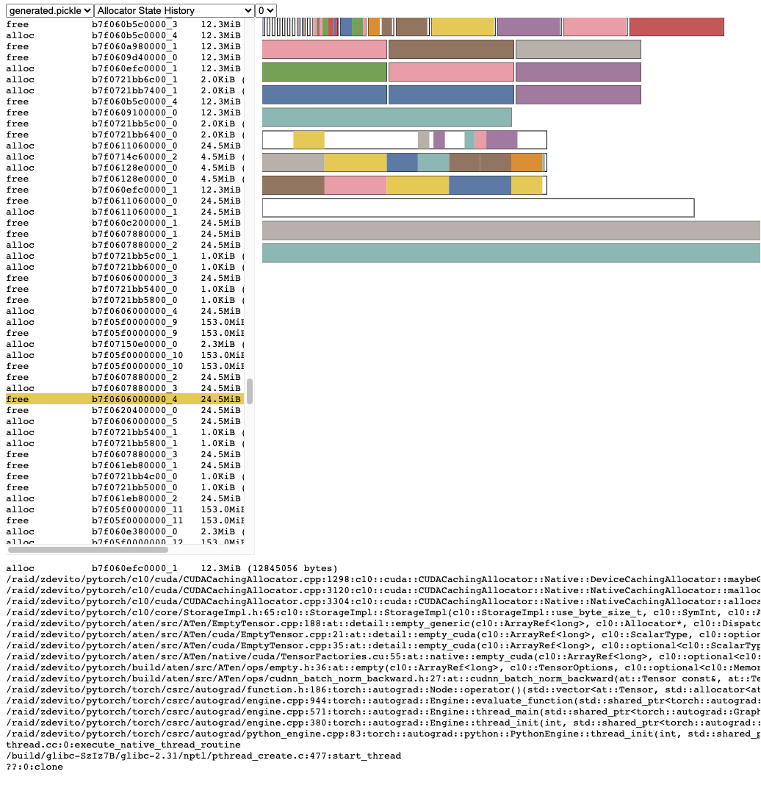
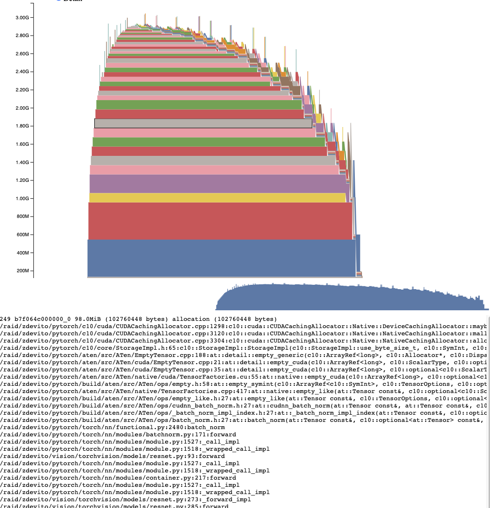
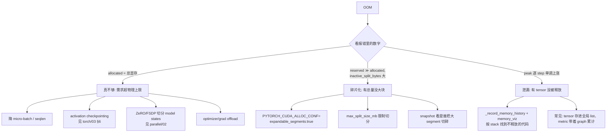

# 02 · 显存 profiling：allocator 模型、snapshot 与 OOM 排查

> 读这篇之前最好先看过 [05 · CUDA 执行模型：stream / event / 显存分配 / AMP](../torch/05_cuda_streams_memory_amp.md) §4，那里讲了 caching allocator 的基本行为，也就是 `allocated` 和 `reserved` 的区别，以及 `empty_cache` 到底做了什么。本文要做的是把这个基本行为展开成一套可测量、可判读的完整模型，并在此基础上给出 OOM 的标准排查流程。时间维度的工具，也就是 torch.profiler 和 nsys，都在 [`01`](./01_timeline_tracing.md) 里讲过；本文只专注显存这一个维度。

---

## 1. 显存的构成（定义式）

在讨论「显存不够」之前，需要先把这笔账算清楚。训练时一张卡上的显存构成可以写成这样一个式子：

$$
\underbrace{\text{params} + \text{grads} + \text{optimizer states}}_{\text{model states}} + \underbrace{\text{activations} + \text{temp workspace}}_{\text{batch / seq dependent}} + \text{allocator fragmentation}
$$

以混合精度加 Adam 为例（这是 Megatron 里的经典口径：`bf16` 参数/梯度加 `fp32` master 权重和两个动量），每个参数会占用 4+4+4+2+2 = 16 字节：fp32 master copy 占 4 字节、fp32 momentum 占 4 字节、fp32 variance 占 4 字节、bf16 param 占 2 字节、bf16 grad 占 2 字节。对一个 7B 模型来说，仅仅 model states 这一项就要占约 112GB，这正是 ZeRO/FSDP 要把它们切分到 DP 组内的动机（详见 [Data Parallelism (DP) / ZeRO / FSDP —— Infra 视角深入](../parallel/01_dp/README.md)）。

激活值大致等于层数乘以每层保存的 saved tensors，会随 batch 和 seqlen 线性增长，是 profiling 时真正的变量；它的精确构成，也就是每一层具体保存了什么，可以参考 [03 · autograd：引擎、自定义 Function、hooks、checkpoint](../torch/03_autograd.md) §6（gradient checkpointing 正是用重新计算去换这部分显存）。

推理场景的账则不太一样：大头变成了 weights 加 KV cache（公式是 $2 \times \text{layers} \times \text{kv heads} \times \text{head dim} \times \text{seqlen} \times \text{batch} \times \text{dtype size}$），vLLM/SGLang 的「显存水位」管理也是围绕 KV cache 展开的。不过本文介绍的测量工具对训练和推理两种场景都通用。

## 2. caching allocator 的可测量模型

[05 · CUDA 执行模型：stream / event / 显存分配 / AMP](../torch/05_cuda_streams_memory_amp.md) §4 给过一句简化的说法：「不直接 cudaMalloc，free 的显存进缓存池复用」。要真正读懂测量出来的数字，还需要再精确一层，看清 allocator 的三级结构：

```
cudaMalloc 的粒度 = segment（向驱动要的大块, 2MB 起, 按需扩大）
  └─ segment 内部按需切分成 block（你拿到的每个 tensor storage 就是一个 block）
       ├─  ≤ 1MB 的请求走 small pool（segment 固定 2MB）
       └─  > 1MB 的请求走 large pool（segment ≥ 请求大小, 按需求 cudaMalloc）

一个 segment 内部:  [ block(用) | block(空闲) | block(用) | block(空闲,inactive_split) ]
                                      空闲 block 只有「整段空闲的 segment」才能还给驱动
```

这个结构在官方的可视化工具里有直观的对应（§3 会讲怎么生成这种图）：



> 图：memory_viz 的 Allocator State History 视图——左侧是 alloc/free 事件流（带地址与大小），右侧每一行是一个 segment（一次 `cudaMalloc`）被切分成的彩色 block 与空闲块（白色）；底部是选中事件的完整分配栈（`CUDACachingAllocator` → `aten::empty` → …）。「大 segment 里卡着小空洞」这类碎片现场在这张图上一眼可见（PyTorch 2.9 文档 Understanding CUDA Memory Usage；[pytorch.org/docs](https://pytorch.org/docs/2.9/torch_cuda_memory.html)）。

有四个量必须分清楚，它们是 `torch.cuda.memory_stats()` 返回的字段名（2.9 核实）：

| 量 | 字段 | 定义 |
|---|---|---|
| **allocated** | `allocated_bytes.all.current` | 你的 tensor 实际占用的字节（block 级求和） |
| **reserved** | `reserved_bytes.all.current` | allocator 向驱动 `cudaMalloc` 的总量（segment 级求和）——**`nvidia-smi` 看到的就是它** |
| **active** | `active_bytes.all.current` | 当前活跃的 block 字节数（allocated 的近似同义，含非 split 的整块） |
| **inactive_split** | `inactive_split_bytes.all.current` | **因切分而无法归还/复用的空闲碎片**——碎片化的精确度量 |

有了这几个字段，碎片化就有了一个明确的定义式，而不只是一种感觉：

$$
\text{fragmentation} \approx \text{reserved} - \text{allocated}
$$

其中「硬伤」部分是 `inactive_split_bytes`：空闲 block 躺在「还有别的 block 在用」的 segment 里，既还不了驱动，装新请求又可能嫌小。

另外还有几个排查时很有用的计数字段：`num_device_alloc`（真实发生的 `cudaMalloc` 次数，如果它突然飙升，说明缓存没有命中）、`num_alloc_retries`（分配失败后重试的次数，大于 0 说明已经在 OOM 边缘挣扎过）、`num_ooms`（累计的 OOM 次数）、`num_sync_all_streams`（allocator 被迫做同步的次数）。

如果想要人类可读的版本，直接 `print(torch.cuda.memory_summary())` 即可：表头先给出 `CUDA OOMs: x | cudaMalloc retries: y` 两个计数，主体按 Allocated / Active / Requested / GPU reserved / Non-releasable 五行（各自还带 large/small pool 两行细分）乘以 Cur / Peak / Tot Alloc / Tot Freed 四列展开——`Requested` 与 `Allocated` 之间的差是 rounding 造成的损耗，`Non-releasable` 其实就是前面说的 inactive_split。日常巡检其实只需要两个动作：用 `memory_summary()` 看结构、用 `max_memory_allocated()` 看峰值（测峰值前记得先 `reset_peak_memory_stats()` 清零一次，再重新跑一个 step）。

> 一个常见的误读是把 `nvidia-smi` 显示的数字当成模型实际占用的显存——比如它显示 78GB，并不等于模型真的占了 78GB，那其实是 reserved（含缓存池）。同样也别指望 `torch.cuda.empty_cache()` 能解决 OOM：它只会把完全空闲的 segment 还给驱动（并带来一次同步），对「allocated 真的太多」这种情况无能为力；它能救的只有碎片化这一种情况，而且效果通常也不如后面 §5 会介绍的 `expandable_segments` 优雅。

## 3. 时间维度：snapshot + memory_viz

§2 里的这些 API 回答的是「现在占用了多少」；要回答「峰值时刻究竟是谁占着」，就需要一份带历史的快照了。整个工作流分三步：

```python
# ① 训练开始前：开启分配历史记录（每个 alloc/free 记 stack trace）
torch.cuda.memory._record_memory_history(max_entries=100_000)   # 默认不限(2^63-1), 生产上给个上限

# ② 训练中 / OOM 后 / 任意关心时刻：dump 快照
torch.cuda.memory._dump_snapshot("snapshot.pickle")             # pickle: 所有 segment/block 状态 + 事件历史

# ③ 浏览器打开 https://pytorch.org/memory_viz, 把 pickle 拖进去
```

memory_viz 是一个纯本地的 JS 应用（snapshot 不会上传到任何地方），提供两个核心视图。第一个是 Active Memory Timeline：每个存活的 tensor 对应一条色带，随时间堆叠展示，峰值点可以直接点选，下方会列出该分配的完整 python/C++ 混合调用栈——这样一来，「峰值是谁贡献的」就从靠猜变成了可以直接查：



> 图：ResNet 训练的 Active Memory Timeline——每个存活 tensor 一条色带，峰值 ~3GB 处点选一个 98MiB 的分配，下方展开它的完整调用栈（`resnet.py: forward` → `batch_norm` → `aten::empty_like` → `CUDACachingAllocator`）（PyTorch 2.9 文档 Understanding CUDA Memory Usage；[pytorch.org/docs](https://pytorch.org/docs/2.9/torch_cuda_memory.html)）。

第二个视图是 Allocator State History，也就是 segment/block 级别的状态回放（§2 里那张配图用的就是这个视图），可以看到 split、coalesce、free 的完整过程，用来判断碎片化的成因——比如可能会发现「一个 1.9GB 的 segment 里躺着一个 300MB 的空洞，新请求要 2GB 却塞不进去」这种具体情况。

如果服务器上没有浏览器，可以用 torch 自带的 CLI 代替：`python -m torch.cuda._memory_viz <stats|trace|segments|memory|compare|trace_plot|segment_plot> snapshot.pickle`（其中 `trace_plot`/`segment_plot` 会直接出图，`compare` 用来对比两份 snapshot，在回归定位「哪次改动吃掉了显存」时很好用）。

Megatron 的集成走的就是这套路子（[[megatron-lm:megatron/training/training.py#L2597-L2603]]）：开启 `--record-memory-history` 之后，每隔 `log_interval` 步会在 last rank 上调用一次 `torch.cuda.memory._snapshot()`，再 pickle 到 `--memory-snapshot-path`（默认是 `snapshot.pickle`，见 [[megatron-lm:megatron/training/config/common_config.py#L56-L59]]）。之所以只在 last rank 上 dump，是因为各 rank 的显存行为通常是对称的，一份就足够代表；而在不对称的情况下（比如 PP 末段因为要算 loss 相关激活而多存了一些），last rank 又恰好是最满的那个，同样能代表最坏情况。

## 4. OOM 排查决策树

`torch.cuda.OutOfMemoryError` 抛出时，异常信息里会直接带上 allocated、reserved 等数字。按这三个数可以做一次快速分诊：



这三种情况的判别量全部来自 §2/§3 介绍的工具，这也正是把它们模型化的意义所在：OOM 从一件「加机器或者砍 batch」的玄学事情，变成了一道可以按图索骥的查表题。

## 5. `PYTORCH_CUDA_ALLOC_CONF` 关键项

这是一个用逗号分隔的环境变量，用来控制 allocator 的行为：

| 项 | 作用 | 什么时候用 |
|---|---|---|
| `expandable_segments:true` | segment 改为「预留一大片虚拟地址、物理页按需映射」（每 stream 一条可增长 segment，替代每次定长 cudaMalloc）——空闲虚拟空间不构成碎片 | **变长序列 / MoE 等分配尺寸多变的训练几乎标配**；对碎片化 OOM 是一等解 |
| `max_split_size_mb:<N>` | 禁止把大于 N MB 的空闲 block 切开给小请求（默认不限） | 大请求间歇出现、被小请求切碎大块时 |
| `garbage_collection_threshold:<0~1>` | 显存用量超过总容量该比例时，allocator 主动优先回收最旧的未用 block（默认 1.0 = 不主动收），避免被动触发昂贵的 sync-and-reclaim | 峰值周期性顶满、能接受偶发同步开销时 |

> 需要提醒的是，这几项都是 `native` backend 才有的开关（在 `backend:cudaMallocAsync` 下会被忽略，而且该 backend 部分 `memory_stats` 统计恒为 0）。`garbage_collection_threshold` 的回收伴随着 stream 同步，可能会让 step 时间出现抖动——这种抖动可以用 [`01`](./01_timeline_tracing.md) 里的 nsys 直接看到。`expandable_segments` 改变了 segment 的生命周期语义，在多任务共卡或者混部场景下，建议先在测试环境验证过再上生产。

## 6. 常见坑

- **`max_memory_allocated` 不归零**：峰值统计是从进程启动开始累计的，测单个 step 之前记得先调 `reset_peak_memory_stats()`。
- **激活峰值出现在 fwd 末 / bwd 初**：这是 saved tensors 全都还活着、梯度又刚开始回流的交界点——想看 snapshot 就应该看这个时刻，而不是 step 结束的时候。
- **多进程共卡**：`nvidia-smi` 是全卡口径，会包含别的进程占用；`memory_stats` 才是本进程口径。共卡场景下调试，先确认清楚是不是别人占用的显存。
- **NCCL 等绕过 allocator 的分配不可见**：前面提到的所有工具（`memory_stats` / snapshot / memory_viz）只看得到 PyTorch allocator 管理的显存；NCCL 通信 buffer 等直接走 CUDA API 分配的部分不在其中——如果账对不上，可以用 `torch.cuda.device_memory_used(idx)`（整卡口径）减去 `memory_reserved()`，差值就是 allocator 之外的部分。
- **`profile_memory` 与 snapshot 的分工不同**：[`01`](./01_timeline_tracing.md) 里的 `profile_memory=True` 给出的是「每个 op 分配/释放了多少」，是时间线视角；snapshot 给出的是「每个时刻谁还活着」，是状态视角。定位峰值构成用后者，定位异常分配行为用前者更合适。相关的 `export_memory_timeline`（按 PARAMETER/ACTIVATION/GRADIENT 等类别分解的显存时间线）要求 `record_shapes + profile_memory + with_stack` 三者同时打开，否则会直接抛出 `ValueError`。
- **私有 pool**：CUDA Graph capture（见 [07 · CUDA Graph：把一串 kernel 压成一次 replay](../torch/07_cuda_graph.md)）要求 capture 期间的分配进入私有 mempool（`torch.cuda.graph_pool_handle()`），这部分在 stats 里会被单独列出，不要误当成泄漏。

## 7. 小结

显存 profiling 的全部内容，其实就是一个构成式（§1，知道理论上该有多少）加一个三级模型（segment/block/pool，知道测出来的数字对应什么）加一条工作流（`_record_memory_history` → `_dump_snapshot` → memory_viz，知道峰值究竟是谁占的）加一棵决策树（OOM 三分诊）。时间和显存这两个维度合起来看，单卡层面的问题基本就能闭环；多卡、系统级的问题，则要交给 nsys 来处理。

---

下一篇：[03 · Nsight Compute（ncu）：kernel 级微架构分析](./03_nsight_compute.md)。时间和显存两个维度都闭环之后，还剩最后一个问题：某个已经被锁定的 kernel，到底为什么只能跑这么快？下一篇会把它放到 roofline 图上，看看它是被算力、带宽还是 occupancy 卡住。
