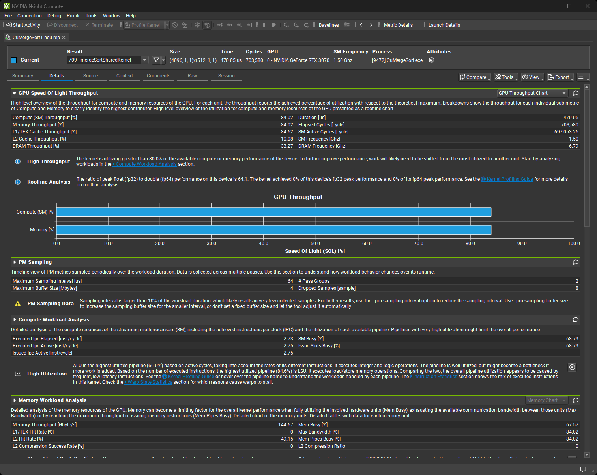
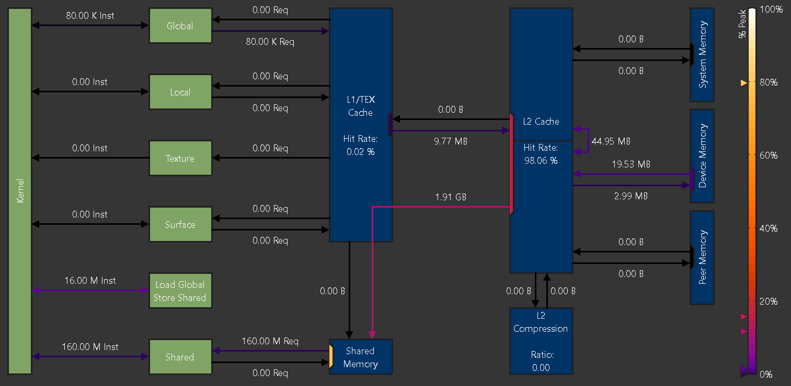
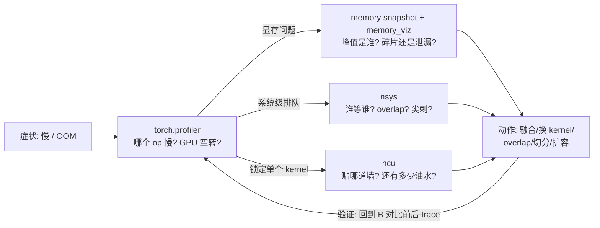

# 03 · Nsight Compute（ncu）：kernel 级微架构分析

> 读这篇之前最好先读过 [00 · Roofline model：性能上界的两道天花板](../hpc/00_roofline_model.md)，理解 roofline 的两道天花板、arithmetic intensity 和 ridge point 这几个概念——ncu 的 SpeedOfLight 分析，本质上就是那套理论对应的实测仪器。也建议先用过 [`01`](./01_timeline_tracing.md) 里的 torch.profiler 或 nsys 把目标 kernel 锁定下来，因为 ncu 从来不是排查流程里第一个上场的工具。

---

## 1. ncu 的定位：从「哪个慢」到「为什么慢」

时间线工具能走到的终点，正是 ncu 的起点。torch.profiler 或者 nsys 能告诉你，比如 `flash_fwd_kernel` 占了整个 step 的 18%，`ncclDevKernel_AllToAll` 占了 22%——但它们说不出的是：这个 kernel 到底打到了硬件能力的百分之几十？它是被算力卡住、被带宽卡住，还是被 launch/occupancy 卡住？如果换一个实现（甚至自己写一个 Triton kernel），还能挤出多少性能？

ncu 的做法是把目标 kernel 单独重放（replay）若干遍，每一遍收集一组硬件性能计数器，最终汇总出数百项微架构指标，包括 SM 各 pipe 的利用率、每一级存储的流量、warp 停顿的原因、occupancy 等等。代价是开销巨大：目标 kernel 会被拖慢几十倍，而且 replay 期间还要反复保存和恢复显存状态，所以观测窗必须收窄到「一个 kernel 的几次 launch」这么小。

它和 [00 · Roofline model：性能上界的两道天花板](../hpc/00_roofline_model.md) 的对应关系是很直接的：roofline 说「性能 $=\min(\pi, \beta \cdot I)$」，而 ncu 的 SpeedOfLight（SOL）分析，做的正是分别实测这两个比值——`Compute (SM) Throughput` 表示打到算力天花板的百分比，`Memory Throughput` 表示打到带宽天花板的百分比。哪个数字高，瓶颈就在哪道墙；如果两个都低，问题多半出在 latency、occupancy 或者 launch 上。

## 2. 标准工作流

```bash
# ① 已知 top kernel 名（来自 torch.profiler / nsys）
# ② 只 profile 它:名字过滤 + 跳过前面的 launch + 只采 3 次
ncu -k "regex:flash_fwd" -s 20 -c 3 --set detailed -o flash_prof python repro.py
# ③ 本地 GUI 打开 flash_prof.ncu-rep,或直接命令行看 SOL:
ncu -k "regex:flash_fwd" -s 20 -c 3 --section SpeedOfLight python repro.py
```

| 参数 | 作用 | 备注 |
|---|---|---|
| `-k, --kernel-name` | 按名字过滤（`regex:` 前缀用正则） | 必用，否则每个 kernel 都被 replay |
| `-s, --launch-skip` | 跳过前 N 次匹配的 launch | 跳过 warmup 的 kernel |
| `-c, --launch-count` | 只采 N 次 | 几次就够看趋势 |
| `--set` | `basic`（默认）/ `detailed` / `full` | 见 §3 |
| `--section` | 只收某个 section（可多个） | 精细控制开销 |
| `--metrics` | 只收指定 metric | 进阶，见 §4 |
| `--replay-mode` | `kernel`（默认：重放单个 kernel）/ `application`（整个应用重放，适合 kernel 间有强依赖时） | kernel 模式会保存/恢复显存 |
| `--target-processes` | `all`（默认，含子进程） | torchrun 下无需额外配置 |
| `-o, --export` / `--page` | 输出 `.ncu-rep` / 命令行打印哪页（`details`/`raw`） | rep 可拷回本地用 `ncu-ui` 打开 |

读报告最好按固定顺序来，这个顺序对应的正是 roofline 的判读逻辑。第一步看 SOL 两面墙，也就是 `Compute (SM) Throughput` 与 `Memory Throughput`（两者都是占峰值的百分比）：如果 compute 高（超过 70%~80%），说明是贴着 $\pi$ 跑的 compute-bound，优化空间在算法或者精度层面，而不在工程层面（一个参考例子是 DeepGEMM 在 H800 上的 FP8 GEMM 打到了 1550 TFLOPS，就属于这种 kernel，详见 [00 · Roofline model：性能上界的两道天花板](../hpc/00_roofline_model.md) §2）；如果 memory 高，说明是贴着 $\beta$ 跑的 memory-bound，想更快就只能减少 HBM 流量，比如做融合、改布局、提高 cache 命中率；如果两个都低（低于 50%），说明是 latency-bound：occupancy 不够、warp 停顿严重、launch 太碎，需要进入第二、三步继续排查。第二步是 Memory Workload Analysis，看 HBM（`dram__bytes`）、L2、shared memory 各级的流量和命中率——如果算术强度 $I$ 低得反常，往往说明存在冗余流量，比如访存不连续，或者没有复用。第三步是 Compute Workload Analysis，看各执行 pipe 的利用率分布——如果 tensor core pipe 的占比很低，说明 GEMM 没有真正走到 tensor core，可能是 shape 没对齐，也可能是 dtype 不对，或者这个 kernel 本身就是 elementwise 的。第四步是 Occupancy 加 Warp State Stats，看理论和实测的 occupancy、限制 occupancy 的因素（比如 register 用太多、shared memory 占太多、block 太小），以及 warp stall 的首要原因（`long_scoreboard` 代表在等显存，`barrier` 代表在等同步，`wait` 代表在等依赖）。



> 图：ncu 报告的 Details 页。最上 SOL section：这个 kernel 的 Compute (SM) 与 Memory Throughput 都打到 84%，下分 L1/L2/DRAM 各级吞吐，并自动给出 "High Throughput" 判语与下一步指引；再往下是 Compute / Memory Workload Analysis 等 section（Nsight Compute User Guide, quick-start 示例；[docs.nvidia.com](https://docs.nvidia.com/nsight-compute/NsightCompute/index.html)）。

## 3. section 体系（ncu 2025.3 实测）

`--set` 其实就是几个 section 的打包（用 `ncu --list-sets` 可以实测确认）：

| set | 包含的 section（摘要） | metric 数量级 | 用途 |
|---|---|---|---|
| `basic`（默认） | LaunchStats, Occupancy, **SpeedOfLight**, WorkloadDistribution | ~200 | 第一遍扫 |
| `detailed` | basic + **ComputeWorkloadAnalysis, MemoryWorkloadAnalysis**, SourceCounters, **SpeedOfLight_RooflineChart** | ~900 | 定位到墙之后的下钻 |
| `full` | detailed + InstructionStats, WarpStateStats, SchedulerStats, **各级 roofline（fp64/fp32/fp16/tensor）**, Nvlink_Tables, PmSampling | ~7800 | 写 kernel 时的全面体检 |
| `roofline` | 只收各级 roofline 相关 section | ~6600 | 只要那张图时 |

需要注意 basic 并不包含 roofline 图——要看 roofline 至少需要 `--set detailed`，或者单独指定 `--section SpeedOfLight_RooflineChart`。`full` 接近 8000 个 metric，意味着要跑几十个 replay pass，大 kernel 上会非常慢，建议先用 `-k`/`-s`/`-c` 收窄目标之后再开大 set。

`SpeedOfLight_RooflineChart` 就是 [00 · Roofline model：性能上界的两道天花板](../hpc/00_roofline_model.md) 那张图的实测版本：横轴是 arithmetic intensity，纵轴是实测性能，一个点落在哪道「屋顶」下面一目了然；`full` set 里的 `SpeedOfLight_HierarchicalTensorRooflineChart` 还专门为 tensor core 画了一条屋顶线。


> 图：`SpeedOfLight_RooflineChart` 的实际长相：横轴 arithmetic intensity（FLOP/byte）、纵轴性能（FLOP/s），标注出 Memory Bandwidth Boundary（斜屋顶）、Peak Performance Boundary（平屋顶）与 Ridge Point，蓝点是该 kernel 的实测值——落在左下、远低于任何一道屋顶，典型的 latency-bound（Nsight Compute Profiling Guide；[docs.nvidia.com](https://docs.nvidia.com/nsight-compute/ProfilingGuide/index.html)）。这张图的读法与 [00 · Roofline model：性能上界的两道天花板](../hpc/00_roofline_model.md) 的理论版一一对应。



> 图：Memory Workload Analysis 的内存层级流向图（A100）：Kernel 的访存指令按 Global/Local/Texture/Surface/Shared 分类，经 L1/TEX → L2 → Device Memory（HBM）逐级标注流量与命中率——哪一级流量异常放大（如 L2 命中率极低、DRAM 流量远超理论值）就是冗余访存的现场（Nsight Compute Profiling Guide；[docs.nvidia.com](https://docs.nvidia.com/nsight-compute/ProfilingGuide/index.html)）。

## 4. 关键 metric 字典

在用 `--metrics` 自由组合指标时会用到下面这些（名字带 `.avg.pct_of_peak_sustained_elapsed` 后缀的都是「占峰值百分比」口径）：

| metric | 含义 |
|---|---|
| `sm__throughput.avg.pct_of_peak_sustained_elapsed` | SOL 的 compute 列：SM 综合利用率 |
| `gpu__compute_memory_throughput.avg.pct_of_peak_sustained_elapsed` | SOL 的 memory 列：存储系统综合利用率 |
| `dram__bytes.sum` | HBM 实际流量（算实测 I = FLOPs / 这个值） |
| `lts__t_sector_hit_rate.pct` | L2 cache 命中率 |
| `sm__pipe_tensor_op_hmma_cycles_active.avg.pct_of_peak_sustained_elapsed` | tensor core pipe 活跃占比——GEMM 吃没吃到 tensor core（Ampere/Ada 的 `hmma`；Hopper 的 wgmma 另有 `sm__inst_executed_pipe_tensor_op_gmma` 等，按架构查 `ncu --query-metrics`） |
| `sm__warps_active.avg.pct_of_peak_sustained_active` | 实测 occupancy |
| `smsp__warp_issue_stalled_<reason>_per_warp_active.pct` | 各类 warp 停顿占比（`long_scoreboard`/`barrier`/`short_scoreboard`/`wait`...） |
| `launch__registers_per_thread` / `launch__shared_mem_per_block_static` | 资源占用（occupancy 限制因素的源头） |

## 5. 权限、开销与坑

最常见的报错是 `ERR_NVGPUCTRPERM`——GPU 硬件性能计数器默认只对管理员开放，这是 2018 年 GPU 侧信道攻击披露之后引入的安全策略（Linux 驱动 418.43+ 起生效，由 `NVreg_RestrictProfilingToAdminUsers` 控制）。解决方向包括：用 root 或者 `CAP_SYS_ADMIN` 权限运行（R565+ 版本可以用更细粒度的 `CAP_PERFMON`），或者让管理员放开该模块参数；需要提醒的是容器里光加 sudo 没用，要用 `--cap-add=SYS_ADMIN`，或者在宿主机上放开权限。这本质上是一个环境策略问题，不是工具的 bug。

replay 本身也有副作用需要注意：kernel replay 会把请求的 metric 拆成多个 pass，第一个 pass 会保存 kernel 可访问的全部显存，之后每个 pass 之前再恢复被写过的那部分——这个过程对被测程序是有侵入性的：如果 kernel 本身有副作用（比如原子累加、状态推进），结果可能会失真；而如果 kernel 与 host 存在运行时依赖，在 kernel replay 模式下会直接挂起（因为重放时没有 host 响应），这类情况需要换成 `--replay-mode application`；涉及多进程 NCCL 通信的 kernel，还需要额外加上 `--communicator tcp|shmem` 和 `--lockstep-kernel-launch` 才能正常推进。总的原则是：在专用机器或者容器里跑 ncu，不要在生产训练任务上顺手用它。

窗口纪律同样重要：如果不设置 `-k/-s/-c` 就直接 `ncu python train.py`，相当于给每个 kernel 都做一次 replay，可能几个小时都跑不完一步训练。开销的直觉大致是这样：官方示例里默认的 section 集对单个 kernel 需要 48 个 pass，而只收 2 个 metric 只需要 4 个 pass——也就是说，metric 的数量直接决定了重放的次数，永远应该先锁定目标再出手。

另外，PyTorch 里的 kernel 名字有个坑：aten op 和 CUDA kernel 不是一一对应的关系（一个 op 可能会发出多个 kernel），而且 cuBLAS/cuDNN 的 kernel 名和 aten 名完全不一样，比如 §2 图里的 `sm90_xmma_gemm_bf16bf16_bf16f32_*`。正确的做法是从 torch.profiler 的 trace 里拿到真实的 kernel 名，再喂给 `-k`，而不是靠 aten 名去猜。

最后一条坑：tuning 的结论需要有 roofline 兜底。ncu 报告说「memory 打到 70%」，并不等于「还能再快 30%」——应该先把该 kernel 的理论 $I$ 算出来（参考 [00 · Roofline model：性能上界的两道天花板](../hpc/00_roofline_model.md) §3 里四类算子的公式），看它在 roofline 上本该站在哪个位置；如果理论上已经到顶了，那 ncu 数字再难看，也不值得再去动它。

## 6. 判读案例（概念性，对照 roofline 四类算子）

| kernel 类型 | 典型 SOL 长相 | 结论与动作 |
|---|---|---|
| 大 GEMM（QKV/FFN proj、grouped GEMM） | compute 80%+，tensor pipe 高 | 贴着 $\pi$，健康的 compute-bound；再快只能靠 FP8/更优 tile（DeepGEMM 级别），工程上别折腾 |
| decode 的 GEMV / 小 batch GEMM | memory 80%+，compute 个位数 | 贴着 $\beta$（权重整块过 HBM，$I \approx O(1)$）；优化方向是减权重流量：量化、投机解码、增大 batch |
| elementwise / norm 串 | memory 高、kernel 又多又短 | 每个都贴 $\beta$ 但总流量被放大 N 倍——**融合**（`torch.compile` 或手写 Triton），把中间结果留在寄存器/SMEM |
| 自写 Triton kernel | 两面墙都 <50%，stall=long_scoreboard，occupancy 低 | latency-bound：加大 block/调 `num_warps` 与 `num_stages`、检查访存 coalescing——ncu 的 WarpStateStats 与 MemoryWorkloadAnalysis 直接指出改哪 |

## 7. 小结：三件工具的闭环

回到 [`README`](./README.md) 那句话——排查问题的关键是选对观测维度。完整的闭环大致是这样：



最后要强调一条纪律：优化完成之后必须回到 profiler 复测，把优化前后两份 trace 放在一起对比（同一个窗口、同一个 rank、同样多的 step 数），确认时间确实是从预期的地方省出来的。凭感觉做性能工作，是不配叫 profiling 的。

---

本章到这里就结束了。可以回到 [`README`](./README.md) 复习一下工具速查表；如果想横向延伸阅读，可以看 [08 · torch.compile / profiler](../torch/08_compile_profiler.md)（定位到瓶颈之后的两套「打包加速」手段：compile 与 CUDA Graph），或者 [00 · Roofline model：性能上界的两道天花板](../hpc/00_roofline_model.md)（所有「该不该优化」这类判断背后的理论底座）。
