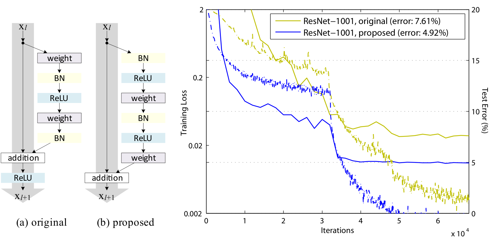
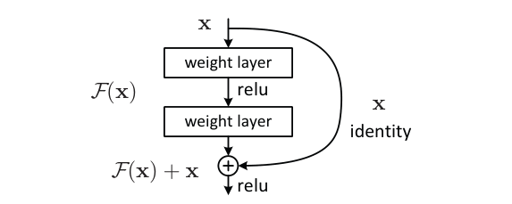
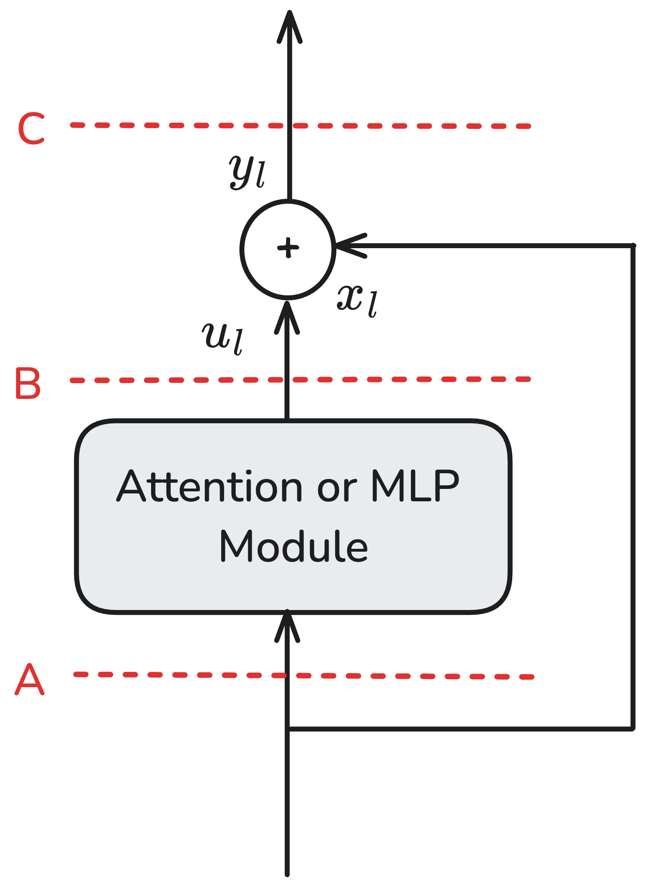
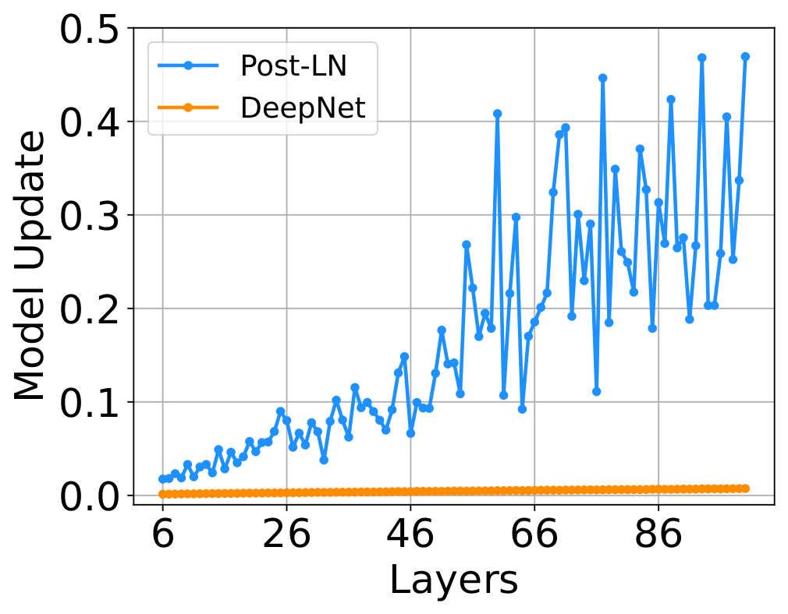
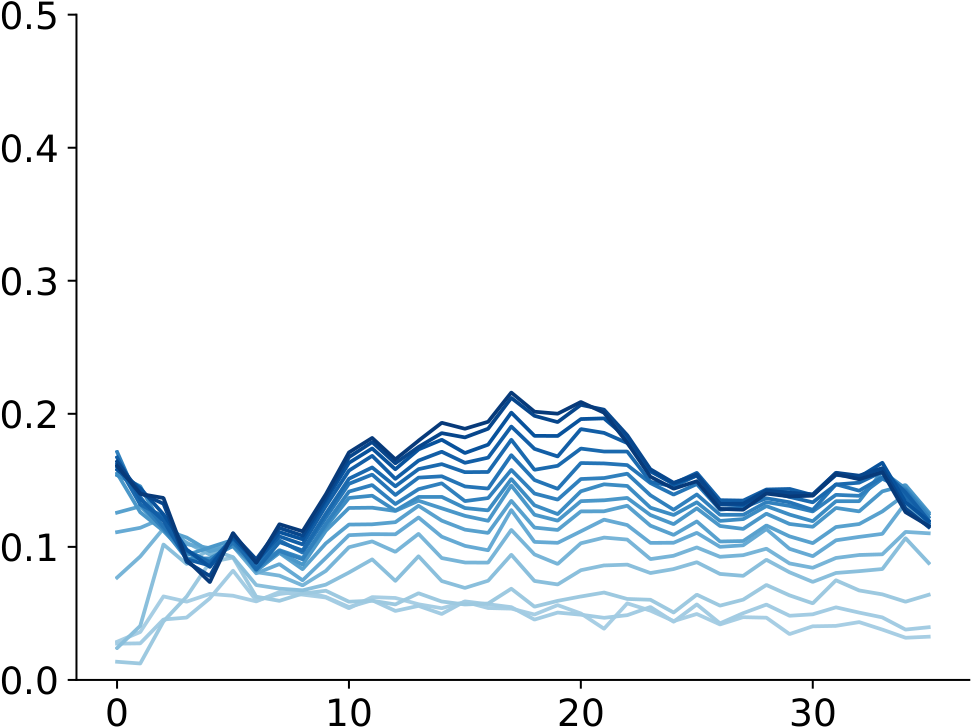
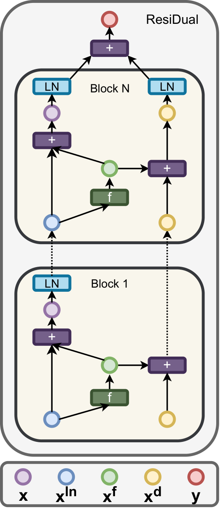

# 00 · Identity Skip 与 Norm 放置

> 这一篇是整章的定义层：后面 HC、mHC、AttnRes 每一次「我们改了 $\mathcal{A}$」的说法，都要挂在这里给出的四个量上——残差更新式、identity mapping、hidden state 幅值随深度怎么增长、Norm 切在哪条路径上。
>
> 上一篇：[Residual —— 深度方向的信息通道](./README.md)讲了两条改进方向。下一篇：[01 · Hyper-Connections 与 mHC](./01_hyper_connections.md)。

---

## 1. 一层 Transformer 的 residual 更新式

先把 shape 说清楚。decoder-only 一层处理一个 token 的 hidden（batch / seq 维隐去）：

| 符号 | shape | 语义 |
|---|---|---|
| $\mathbf{h}_l \in \mathbb{R}^{d}$ | `[d]`（实现里常是 `[B, S, d]`） | 进入第 $l$ 层的 residual stream |
| $f_l$ | $\mathbb{R}^{d}\to\mathbb{R}^{d}$ | 一个 sublayer：self-attn 或 MLP（内部可含自己的 Norm） |
| $\mathbf{h}_1$ | `[d]` | token embedding（AttnRes 论文把 embedding 标成 $\mathbf{h}_1$） |

本章把 attention 和 MLP 各算一层（和 AttnRes / mHC 一致），一个「Transformer block」等于两次残差更新。$L$ 层网络因此有 $2L$ 次 add。

标准残差更新写作：

$$
\mathbf{h}_{l+1} = \mathbf{h}_l + f_l(\mathbf{h}_l)
\quad\text{i.e.}\quad
\mathbf{h}_{l} = \mathbf{h}_{1} + \sum_{i=1}^{l-1} f_i(\mathbf{h}_i)
$$

这个更新式有几个值得留意的性质。它作用的维度是沿 hidden 维逐元素加，token 之间、batch 之间都不耦合，所以在 TP 下是本地操作；开了 SP 之后激活变成 `[S/TP, B, d]`，仍然是本地操作、零通信（见[序列并行如何用 AG+RS 替换 all-reduce](../parallel/02_tp_sp/03_sequence_parallel.md)）。它的可导性也很干净：add 对两路输入都是恒等 Jacobian，反向传播里 $\partial\mathcal{L}/\partial\mathbf{h}_l$ 会自动带上一路「不经过 $f$」的梯度。至于拷贝这件事则要小心：PyTorch 的 `out = x + y` 会物化一份新张量，实现里常写成 `x.add_(y)` 或者 fused 的 `residual + RMSNorm` kernel，否则每一层都多一次 HBM 往返。这也是框架 bug 高发点——如果 in-place 加完之后还被 autograd 当作输入使用，会破坏计算图。


> 图：Vaswani et al. 2017 的经典结构图。每个 Multi-Head Attention / FFN 旁边都有一条绕过去的箭头，汇入 Add & Norm。这就是 Post-LN 残差：先加再归一化。今天几乎所有 decoder-only LLM 仍保留「绕过去再加」这一笔，分歧只在 Norm 切在加之前还是加之后、以及「加」是不是还是等权。（Vaswani et al. 2017, Fig 1；[arXiv:1706.03762](https://arxiv.org/abs/1706.03762)）

---

## 2. Identity Mapping 与增量爆炸

### 2.1 梯度路径

把残差展开 $L$ 层，反向传播对中间 hidden 的梯度是

$$
\frac{\partial\mathcal{L}}{\partial\mathbf{h}_l}
= \frac{\partial\mathcal{L}}{\partial\mathbf{h}_L}
\left(\prod_{j=l}^{L-1}\bigl(I + \tfrac{\partial f_j}{\partial\mathbf{h}_j}\bigr)\right)
$$

这个乘积里永远留着一项 $I$：无论 $f_j$ 的 Jacobian 多么病态，总有一条不经过任何变换的梯度路径存在。He et al. 2016 把这条路径叫做 identity mapping——浅层的信号原样映射到深层，不乘权重、不经过非线性。



> 图：左 (a) 是原版 ResNet unit，add 之后还有 ReLU，identity 路径被非线性切断。左 (b) 是 pre-activation：BN/ReLU 全部进残差分支，shortcut 变成干净的 $\mathbf{x}_{l+1}=\mathbf{x}_l+\mathcal{F}$。右图显示，在 1001 层 ResNet 上，pre-activation 把 test error 从 7.61% 打到 4.92%。Transformer 的 Pre-LN 正是这个思想换了一套 Norm。（He et al. 2016, Fig 1；[arXiv:1603.05027](https://arxiv.org/abs/1603.05027)）

ResNet 自己的 building block 出现得更早：



> 图：何恺明 2015 年的 residual block。左边是 identity shortcut，右边是要学习的残差 $\mathcal{F}$。公式 $\mathbf{x}+\mathcal{F}(\mathbf{x})$ 从那一年起就没换过，LLM 换的只是 $\mathcal{F}$ 的内容（从卷积换成 attention/MLP）以及 shortcut 上要不要夹一层 Norm。（He et al. 2015, Fig 2；[arXiv:1512.03385](https://arxiv.org/abs/1512.03385)）

### 2.2 增量爆炸：苏剑林的视角

「没有残差就训不深」常常被简单归结为梯度消失或爆炸。苏剑林在[《为什么需要残差？一个来自 DeepNet 的视角》](https://kexue.fm/archives/8994)里补上了第三件事，也就是增量爆炸（这个说法来自 DeepNet 对「模型更新量」的分析）：即便用初始化和 Normalization 把前向方差、反向梯度都压住了，无残差的深层网络在训练初期，每一步参数更新引起的输出改变量仍会随深度指数级增长。残差把这条更新量压成可缩放的量级，前向、反向、增量这三件事才能同时稳住。

DeepNet 的实证对应是：把同一输入在训练前后的层输出差画出来，不稳定的 Post-LN 在前几步就会出现「输出漂移」并爆掉；一旦稳住之后，这条曲线就是平的。§5 会把 DeepNorm 的具体公式放下来，[`01`](./01_hyper_connections.md)也会用到这个概念。

判断一段「残差技巧」讲的是哪一件事时，可以回头看它动的是上面三件事里的哪一个——梯度路径、前向幅值，还是更新增量。HC 动的是前向幅值的守恒；AttnRes 动的是「等权累加导致的幅值 $O(L)$ 增长」。

---

## 3. Pre-LN 与 Post-LN

### 3.1 Post-LN 与 Pre-LN 的定义式

把一层写成 sublayer $F$（attn 或 MLP）加一次 Norm，有两种经典的切法：

| 名称 | 前向 | identity 路径上有没有 Norm |
|---|---|---|
| **Post-LN**（原版 Transformer） | $\mathbf{x}_{l+1}=\mathrm{LN}(\mathbf{x}_l+F(\mathbf{x}_l))$ | 有。每过一层，shortcut 被 LN 重新缩放 |
| **Pre-LN**（GPT-2 起的默认） | $\mathbf{x}_{l+1}=\mathbf{x}_l+F(\mathrm{LN}(\mathbf{x}_l))$ | 没有。$\mathbf{x}_l$ 原样加到出口；最后在 lm_head 前再 LN 一次 |


> 图：(a) Post-LN：Attention / FFN 的输出先和 shortcut 相加，再进 LayerNorm，Norm 切在主干上。(b) Pre-LN：主干是一条不被 Norm 打断的灰箭头，LN 只出现在进 Attention / FFN 之前。这就是「identity 路径干不干净」的几何含义。（Xiong et al. 2020, Fig 1；[arXiv:2002.04745](https://arxiv.org/abs/2002.04745)）

现代 LLM 把 `LayerNorm` 换成了 `RMSNorm`（没有减均值，只有 RMS 缩放加可学习增益），但放置规则不变。Llama / Qwen / DeepSeek-V3 一层的伪代码是：

```
# Pre-RMSNorm, serial
h = h + attn(rms_norm(h))
h = h + mlp(rms_norm(h))
```

DeepSeek-V3 的 HuggingFace 实现就是这个骨架：先 `residual = hidden_states`，再经过 `input_layernorm` → attn → `residual + hidden_states`，MLP 部分同理。

### 3.2 训练稳定性与有效深度

| | Post-LN | Pre-LN |
|---|---|---|
| 梯度 | 每层 LN 削弱 shortcut，深了容易梯度消失，强依赖 warmup | shortcut 梯度恒为 1，几乎不需要为残差调 warmup |
| 前向幅值 | 每层 LN 把 hidden 拉回 $O(1)$ | 等权累加，$\|\mathbf{h}_l\|$ 随深度按 $O(\sqrt{l})$ 到 $O(l)$ 涨（「PreNorm 稀释」） |
| 最终质量（同设置训稳时） | 往往更好 | 往往略差 |
| 谁在用 | 原版 Transformer、BERT、早期 T5 | GPT-2 起的绝大多数 decoder-only |

苏剑林在[《为什么 Pre Norm 的效果不如 Post Norm？》](https://kexue.fm/archives/9009)里把「质量差」这件事解释为深度缩水：Pre-LN 的梯度更偏向浅层 shortcut，网络等价于「变宽、变浅」；知乎上[唐翔昊的回答](https://www.zhihu.com/question/519668254/answer/2371885202)用「Pre-Norm 的深度有水分」表达的是同一件事。AttnRes 论文把这件事量化成 PreNorm dilution：等权累加让 hidden 幅值随 $L$ 无界增长，单层的贡献就这样被埋掉了——这也是「剪掉一批深层，评测几乎不掉」这一现象背后的结构性原因。

Xiong et al. 2020 还有一条相关的实验观察：Pre-LN 底层的梯度大于顶层，这和「过度依赖 shortcut」其实是同一件事。

---

## 4. Peri-LN：sublayer 出口再做一次 Norm

Pre-LN 训得稳、Post-LN 效果好，自然会有人想把两种切法叠在一起。Kim et al. 2025 把「LN 包住整个 sublayer（入口加出口），残差加在包外面」这种做法命名为 Peri-LN：

$$
\mathbf{x}_{l+1}
= \mathbf{x}_l + \mathrm{LN}_{\mathrm{out}}\bigl(F(\mathrm{LN}_{\mathrm{in}}(\mathbf{x}_l))\bigr)
$$

identity 路径仍然是干净的（加之前的主干不被 LN 改动），但 $F$ 的输出幅值被出口的 LN 卡住了，因此能缓解 PreNorm 稀释。



> 图：一个 residual block 上标出 LN 可能出现的位置。Post-LN 切在 add 之后（主干被 Norm）；Pre-LN 切在进 Attention/MLP 之前（主干干净）；Peri-LN 在 sublayer 两端都切一刀，add 仍在最外面。Gemma 2/3、OLMo 2 的开源实现属于这一家族，只是「出口 LN 在不在 residual 里面」的细节有所不同。（Kim et al. 2025, Fig 1；[arXiv:2502.02732](https://arxiv.org/abs/2502.02732)）

落地时要注意，不要把下面三个名字混成一个实现：

| 实现 | 公式（一个 sublayer） | 代表模型 |
|---|---|---|
| Pre-RMSNorm | `x + F(RMSNorm(x))` | Llama 3、Qwen 3、DeepSeek-V3、Kimi K2 |
| Peri-LN / sandwich | `x + RMSNorm(F(RMSNorm(x)))` | **Gemma 2、Gemma 3**（attn 前后都 RMSNorm） |
| Post-norm-inside | `x + RMSNorm(F(x))`，另加 QK-Norm | **OLMo 2** |
| Post-norm-outside | `RMSNorm(x + F(x))` | 原版 Transformer；**Grok-1** 更接近这一族 |

OLMo 2 还在 attention 内部对 Q/K 做了 RMSNorm（QK-Norm），目的是稳住 softmax 的 logit 尺度，而不是改动残差拓扑；Gemma 2 用 softcap 做类似的事。它们经常和 Peri-LN 一起出现，但属于 attention 数值稳定性的范畴，不算是对 $\mathcal{A}$ 的改法。

---

## 5. 单流残差的其他变体：DeepNorm、LayerScale、ReZero、Parallel Residual、ResiDual

这一节里的方法都不加宽残差流，也不沿深度做 softmax，只是在系数或双路结构上做调整。它们是 2020 到 2023 年间的主流补丁，2025 年之后逐渐被 HC / AttnRes 部分取代，但仍然出现在论文对比和部分视觉、翻译模型里。

### 5.1 DeepNorm：放大 skip、缩小残差分支

DeepNet（Wang et al., 2022, [arXiv:2203.00555](https://arxiv.org/abs/2203.00555)）的更新是 Post-LN 形状：

$$
\mathbf{x}_{l+1} = \mathrm{LN}\bigl(\alpha\,\mathbf{x}_l + F(\mathbf{x}_l)\bigr)
$$

其中 $\alpha>1$ 用来放大 identity，残差分支里 Value、输出投影、FFN 两层线性的初始化再乘上 $\beta<1$。encoder-only、decoder-only、encoder-decoder 各有一套 $(\alpha,\beta)$ 的闭式解（随深度 $N$ 走 $N^{1/4}$ 一类的指数关系）。论文用这套方法把 Transformer 训到了 1000 层。



> 图：DeepNet 把「同输入下，训练一步引起的层输出改变」当作稳定性指标。不稳定的 Post-LN 这条曲线会随深度上扬（对应增量爆炸）；DeepNorm 把它压成了近乎常数。苏剑林[《训练 1000 层的 Transformer》](https://kexue.fm/archives/8978)的解读就是从这张图出发的。（Wang et al. 2022；[arXiv:2203.00555](https://arxiv.org/abs/2203.00555)）

主流 LLM 并没有把 DeepNorm 做成默认选项，大家最终选了更简单的 Pre-RMSNorm。它留下的遗产是「放大 skip、缩小残差 init」这条原则——ReZero、LayerScale、HC 里把 $\alpha$ 初始化接近 0，都是同一个方向的延续。

### 5.2 LayerScale、ReZero、SkipInit、Fixup

这几种方法都是在残差分支上乘一个小初始化的标量或对角矩阵：

$$
\mathbf{x}_{l+1} = \mathbf{x}_l + \lambda_l \odot F(\mathbf{x}_l)
\quad\text{or}\quad
\mathbf{x}_{l+1} = \mathbf{x}_l + \alpha_l\, F(\mathbf{x}_l)
$$

| 名字 | $\lambda/\alpha$ | 还去不去 Norm | 代表 |
|---|---|---|---|
| **ReZero**（Bachlechner et al., 2020） | 标量，init = 0 | 可以去掉 LN | 小模型实验 |
| **SkipInit** | 标量，init 接近 0 | 常保留 | 与 ReZero 几乎同时 |
| **Fixup** | 用特殊初始化代替 LN | 去 Norm | 2019，CNN/Transformer 都试过 |
| **LayerScale**（CaiT, Touvron et al., 2021, [arXiv:2103.17239](https://arxiv.org/abs/2103.17239)） | 每通道对角 $\lambda$，init $\varepsilon\sim 10^{-4}$ | 保留 Pre-LN | ViT / CaiT；少数 LLM 消融 |



> 图：LayerScale 把「残差分支先不要说话」做成每通道的 $\lambda$。训练初期网络接近恒等，深度加上去也不炸；这和 DeepNorm 缩小 $\beta$、HC 把动态门 $\alpha$ 初始化很小，属于同一类思路：先保证 identity，再慢慢打开残差。（Touvron et al. 2021；[arXiv:2103.17239](https://arxiv.org/abs/2103.17239)）

苏剑林在[《浅谈 Transformer 的初始化、参数化与标准化》](https://kexue.fm/archives/8620)里主张：$\alpha_t$ 的地位和其他参数不对等，不宜用同样大的学习率；一种可行的做法是让 $\alpha$ 以很小的步长走到 1 再冻结。

### 5.3 Parallel Residual：attn 和 MLP 读同一份 x

PaLM、GPT-J、GPT-NeoX 把串行的两拍收成一拍：

$$
\mathbf{x}_{l+1} = \mathbf{x}_l + \mathrm{Attn}(\mathrm{LN}(\mathbf{x}_l)) + \mathrm{MLP}(\mathrm{LN}(\mathbf{x}_l))
$$

在系统层面，这样两路可以并行计算，QKV 投影和 MLP up 能够 fuse 成一次更大的 GEMM，并且共用一份 LN。代价是表达能力上的：MLP 看不到 attn 这一层刚写出的增量，等效深度又会缩水一截。目前用这种方式的模型有 PaLM、GPT-J、GPT-NeoX、部分 Cohere；Llama 2 之后的开源主流回到了串行结构。HC 论文把「串行 / 并行」解释成 $n=2$ 时连接矩阵的两种极限情况（见[`01`](./01_hyper_connections.md)）。

### 5.4 ResiDual：Pre-LN 与 Post-LN 各走一路

Xie et al., 2023, [arXiv:2304.14802](https://arxiv.org/abs/2304.14802) 的做法是维持两路状态：一路像 Pre-LN 那样保留干净的 identity（保证梯度下界），一路像 Post-LN 那样经过 LN 保持表示的多样性（避免 representation collapse）。最后在栈顶把两路加起来。



> 图：每个 block 吃进 $(x^{ln}, x^d)$ 两路。$f(x^{ln})$ 既加回 LN 主干，也累加进从不归一化的 $x^d$；栈顶再把两路合成 $y$。这是「单流不够用」的早期答案——还没加宽成 $n$ 路，先复制成 Pre/Post 各一条。SiameseNorm 后来把两路做成参数共享。（Xie et al. 2023；[arXiv:2304.14802](https://arxiv.org/abs/2304.14802)）

在机器翻译实验上，ResiDual 优于纯 Pre-LN 和纯 Post-LN，但没有进入 Llama / DeepSeek / Qwen 的默认配置。它更像是 Peri-LN 与双流 HC 之间的一个过渡形态。

---

## 6. 单流残差的通用形式

读完这一篇，可以把上面的默认方案和它的各种补丁收成一张统一的图：

```
x  ──►  [可选 LN] ──► F (attn 或 MLP) ──► [可选 LN] ──► ×λ  ──►  +  ──► x'
 ▲                                                      │
 └────────────────── α · identity ──────────────────────┘
```

在这套记号下：$\alpha=1,\lambda=1$，LN 只在 $F$ 前，就是 Llama 族的 Pre-RMSNorm；$\alpha=1,\lambda=1$，LN 在 $F$ 前后都有，就是 Gemma 的 Peri-LN；$\alpha>1,\lambda=\beta\cdot\mathrm{init}$ 是 DeepNorm；$\alpha=1,\lambda=\varepsilon\approx 0$ 是 LayerScale / ReZero；两路 $F$ 读同一个 $x$ 是 parallel residual；两路状态各走 Pre/Post 是 ResiDual。

这套单流菜单解决不了两件事，而这两件事正好对应后两篇的主题：一是残差流的宽度固定为 $d$，一层写进去的信息必须和历史挤在同一个向量里，解决办法是加宽成 $n$ 路（见[`01`](./01_hyper_connections.md)）；二是聚合权重固定为 1，早期层的信息无法被选择性地取回，解决办法是沿深度做 attention（见[`02`](./02_attention_residual.md)）。

下一篇：[01 · Hyper-Connections 与 mHC](./01_hyper_connections.md)，把残差流从 1 路加宽到 $n$ 路，再看 mHC 怎样用双随机矩阵把 identity 找回来，以及 DeepSeek-V4 如何落地。
