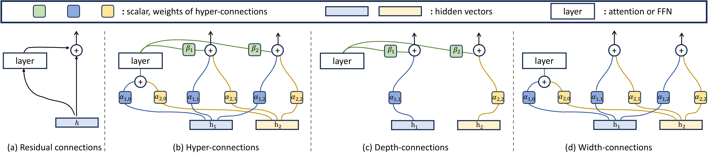
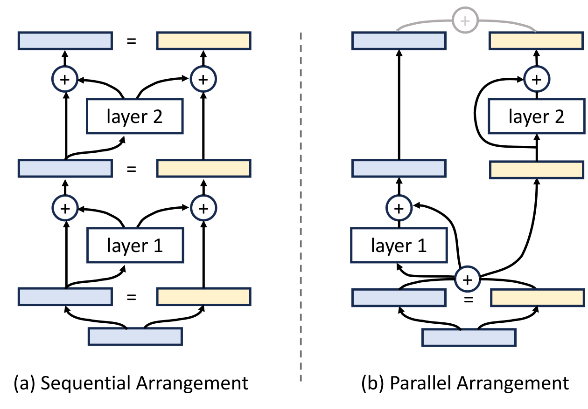
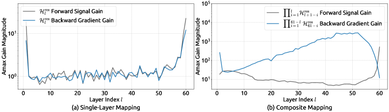
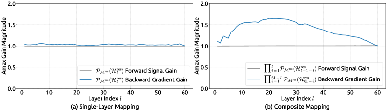
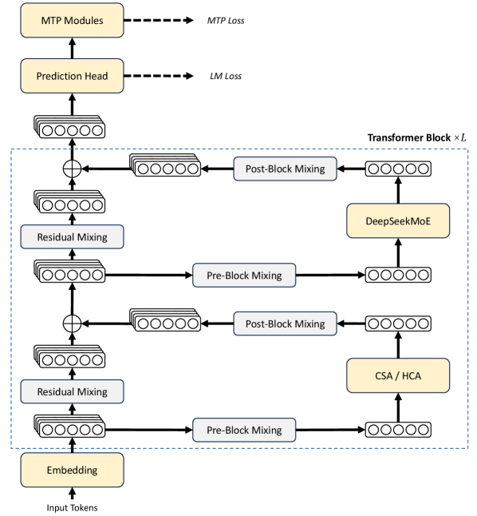

# 01 · Hyper-Connections 与 mHC

> 这一篇讲的是第一条改进方向：不改「只看上一层状态」这个递推关系，而是改状态有多宽、层与层之间怎么混合。ByteDance Seed 的 Hyper-Connections（HC，ICLR 2025）先把残差流从 $d$ 扩成 $n\times d$；DeepSeek 的 mHC 再把混合矩阵投影到双随机流形上，把被 HC 丢掉的 identity mapping 找回来。DeepSeek-V4 已经用 `hc_mult=4` 的 mHC 替换了 V3 的普通 residual。
>
> 上一篇：[00 · Identity Skip 与 Norm 放置](./00_identity_skip_and_norm.md)。下一篇：[02 · Attention Residuals](./02_attention_residual.md)。

论文：

- Zhu et al., *Hyper-Connections*, ICLR 2025. [arXiv:2409.19606](https://arxiv.org/abs/2409.19606)
- Xie et al., *mHC: Manifold-Constrained Hyper-Connections*, 2025. [arXiv:2512.24880](https://arxiv.org/abs/2512.24880)
- DeepSeek-AI, *DeepSeek-V4*, 2026, §2.2. [arXiv:2606.19348](https://arxiv.org/abs/2606.19348)

---

## 1. 单流残差的权衡

[`00`](./00_identity_skip_and_norm.md)里讲过 Pre-LN / Post-LN 之间的权衡：把 identity 做强一些（Pre-LN、$\alpha$ 大），梯度会更稳，但表示会塌缩、深度「有水分」；把残差分支做强一些（Post-LN、$\alpha$ 小），每一层更「足秤」，但梯度路径会被 LN 削弱。

HC 想问的问题是：这个系数能不能按输入、按深度自己学出来，并且不要只学一个标量，而是让网络同时保留多种「层怎么排」的模式？它的做法是把 hidden 复制成 $n$ 份，在这 $n$ 路之间做可学习的混合。当 $n=1$ 且权重被冻结时，Pre-LN 和 Post-LN 都是 HC 的特例（论文 §3.1）。

---

## 2. Hyper-Connections：depth-connection × width-connection

### 2.1 三个映射：pre、post、res

先看一张图，再看对应的公式：

> 图：(a) 标准残差：一份 $h$ 绕过 `layer` 再加回来。(b) Hyper-connections：两份 hidden $h_1,h_2$ 经 $\alpha$ 混进 layer，layer 出口经 $\beta$ 再和各路 $\alpha$ 加权写回，形成横向交换加纵向加权的结构。(c) 只留深度方向的加权（广义残差）。(d) 只留宽度方向的交换。完整的 HC 是 (c) 加 (d) 的组合。（Zhu et al. 2025, Fig 2；[arXiv:2409.19606](https://arxiv.org/abs/2409.19606)）

把输入扩成 $n$ 路（论文里叫 expansion rate，DeepSeek 写作 $n_{\mathrm{hc}}$ 或 `hc_mult`）：

$$
\mathbf{x}_l = \begin{bmatrix}\mathbf{x}_{l,0}^\top \\ \vdots \\ \mathbf{x}_{l,n-1}^\top\end{bmatrix}
\in \mathbb{R}^{n\times C}
\qquad\text{impl. shape: }[B,S,n,C]
$$

一层里有三个线性映射，它们都不会碰到 $F$ 内部的 FLOPs：

| 映射 | shape | 语义 |
|---|---|---|
| $\mathcal{H}_l^{\mathrm{pre}}\in\mathbb{R}^{1\times n}$ | 读 | 从 $nC$ 流聚合成 $C$ 维，作为 $F$ 的输入 |
| $\mathcal{H}_l^{\mathrm{post}}\in\mathbb{R}^{1\times n}$ | 写 | 把 $F$ 的 $C$ 维输出铺回 $n$ 路 |
| $\mathcal{H}_l^{\mathrm{res}}\in\mathbb{R}^{n\times n}$ | 混 | 残差流内部的混合（论文消融里增益最大的就是它） |

一层的完整更新是：

$$
\mathbf{x}_{l+1}
= \mathcal{H}_l^{\mathrm{res}}\,\mathbf{x}_l
+ \mathcal{H}_l^{\mathrm{post}\,\top}\,
  F\bigl(\mathcal{H}_l^{\mathrm{pre}}\,\mathbf{x}_l,\,\mathcal{W}_l\bigr)
$$

当 $n=1,\mathcal{H}^{\mathrm{res}}=1,\mathcal{H}^{\mathrm{pre}}=\mathcal{H}^{\mathrm{post}}=1$ 时，这个式子就退回到标准残差 $\mathbf{x}+F(\mathbf{x})$。

### 2.2 静态 HC 与动态 HC（DHC）

每个映射由全局偏置（static）和输入相关项（dynamic）两部分组成。HC 原文的写法是：

$$
\begin{aligned}
\tilde{\mathbf{x}}_l &= \mathrm{RMSNorm}(\mathbf{x}_l)\\
\mathcal{H}_l^{\mathrm{pre}}
  &= \alpha_l^{\mathrm{pre}}\tanh(\theta_l^{\mathrm{pre}}\tilde{\mathbf{x}}_l^\top)+\mathbf{b}_l^{\mathrm{pre}}
\end{aligned}
$$

$\mathcal{H}^{\mathrm{post}}$ 和 $\mathcal{H}^{\mathrm{res}}$ 的结构与此同构。$\alpha$ 的初始化很小，所以训练初期接近 static。带 tanh 的动态项就是 DHC；去掉动态项就是 SHC。论文的主结果用的是 DHC ×4（expansion $n=4$）。

额外的参数量是每层 $O(nC+n^2)$，相对 $C\sim 4\mathrm{k}{-}7\mathrm{k}$ 可以忽略；真正贵的不是 FLOPs，而是 $n$ 倍的激活 I/O（见 §5）。

### 2.3 串行 vs 并行：连接矩阵的两种极限

> 图：(a) Sequential：layer 2 必须等 layer 1 写完，这就是普通 Transformer 的 attn→MLP 顺序。(b) Parallel：两路从同一输入分叉再在顶上相加，对应 PaLM / GPT-J 的 parallel residual。HC 的观点是，这两种排列都只是 $n=2$ 连接矩阵的特殊点，网络可以学到中间态，甚至按 token 在两种排列之间切换。（Zhu et al. 2025, Fig 4；[arXiv:2409.19606](https://arxiv.org/abs/2409.19606)）

### 2.4 已知使用 HC 的模型

公开写进论文的结果是 OLMo-1B/7B 与 OLMoE-1B-7B 上的 DHC ×4（500B token）：相对 residual baseline，C4 验证集 loss 大约有 1.8× 的数据效率提升，下游 HellaSwag / ARC-Challenge 全程领先。视觉任务上 ViT-Large 也有增益，但多个 epoch 之后收益会收窄。

至于 ByteDance Seed 是否把 HC 写进了 Doubao 生产模型，目前没有技术报告确认。能确定「HC 进入生产」的是它的约束版本，也就是 mHC 在 DeepSeek-V4 上的应用。

---

## 3. 规模化后的问题：identity 丢失与 I/O 上涨

把递推展开 $L$ 层：

$$
\mathbf{x}_L
= \Big(\prod_{i=1}^{L-l}\mathcal{H}_{L-i}^{\mathrm{res}}\Big)\mathbf{x}_l
+ \sum_{i=l}^{L-1}
  \Big(\prod_{j=1}^{L-1-i}\mathcal{H}_{L-j}^{\mathrm{res}}\Big)
  \mathcal{H}_i^{\mathrm{post}\,\top} F(\cdots)
$$

在标准残差里，浅层到深层的这一项就是 $\mathbf{x}_l$ 自己，也就是 identity。到了 HC 里，它变成了复合矩阵 $\prod \mathcal{H}^{\mathrm{res}}$。一旦映射没有约束，行和、列和就可能远离 1，前向信号和反向梯度都可能被放大或掐死；双随机性也不是封闭的，复合之后情况会更离谱。

mHC 在 27B 规模上量过这件事：复合映射的 Amax Gain Magnitude 峰值可以到 3000（相对理想值 1），训练在大约 12k step 出现 loss spike，并伴随 grad norm 同步爆炸。

> 图：横轴把每个 Transformer block 拆成 Attention、FFN 两层。(a) 单层 $\mathcal{H}_l^{\mathrm{res}}$ 的行和/列和已经在偏离 1；(b) 复合映射 $\prod\mathcal{H}^{\mathrm{res}}$ 的前向增益与反向增益完全脱钩，量级失控。这就是「加宽了，但 identity 没了」的实验证据。（Xie et al. 2025, Fig 3；[arXiv:2512.24880](https://arxiv.org/abs/2512.24880)）

I/O 账本也能说明问题（mHC 论文 Table 2，每 token、不含 $F$ 内部）：

| | 读 | 写 |
|---|---|---|
| 标准 residual merge | $2C$ | $C$ |
| HC（算三个 $\mathcal{H}$ + 三次乘 + merge） | $(5n+1)C+n^2+2n$ | $(3n+1)C+n^2+2n$ |

$n=4$ 时，残差相关的 HBM 流量大约是原来的一个数量级。激活还要留给 backward，PP 阶段之间也要传 $n$ 倍的 hidden。FLOPs 上看起来几乎免费，但墙钟时间不是。

---

## 4. mHC：把 H^res 投影到 Birkhoff polytope

### 4.1 选择流形：双随机矩阵

把 $\mathcal{H}^{\mathrm{res}}$ 固定为 $I$ 最稳，但这样 $n$ 路之间就不能交换，加宽也就没有意义了。mHC 选择的流形是双随机矩阵（Birkhoff polytope）：非负、行和等于列和等于 1：

$$
\mathcal{M}^{\mathrm{res}}
=\bigl\{
  H\in\mathbb{R}^{n\times n}
  \;\big|\;
  H\mathbf{1}=\mathbf{1},\;
  \mathbf{1}^\top H=\mathbf{1}^\top,\;
  H\ge 0
\bigr\}
$$

这个流形有三条用得上的性质。第一，谱范数 $\|H\|_2\le 1$，也就是单步非扩张，能压住爆炸。第二，乘法封闭：双随机矩阵乘双随机矩阵仍然是双随机矩阵，所以 $\prod_i H_i$ 始终留在流形上，任意深度的 identity 均值都能守恒。第三，从几何上看，Birkhoff polytope 是置换矩阵的凸包，$H\mathbf{x}$ 是各路的凸组合，反复乘只会把流慢慢搅匀，而不会放大某一路。

当 $n=1$ 时，双随机条件退化成标量 $1$，就是原来的 identity。$\mathcal{H}^{\mathrm{pre}}$ 和 $\mathcal{H}^{\mathrm{post}}$ 则另外用 sigmoid 卡成非负（post 再乘 2），避免正负系数互相对消。

### 4.2 参数化与 Sinkhorn-Knopp

mHC 先把 $n\times C$ flatten 成 $\vec{\mathbf{x}}_l\in\mathbb{R}^{nC}$，再线性地出三张未约束的映射，最后再做投影：

$$
\begin{aligned}
\mathcal{H}_l^{\mathrm{pre}} &= \sigma(\tilde H_l^{\mathrm{pre}})\\
\mathcal{H}_l^{\mathrm{post}} &= 2\sigma(\tilde H_l^{\mathrm{post}})\\
\mathcal{H}_l^{\mathrm{res}} &= \mathrm{SinkhornKnopp}(\tilde H_l^{\mathrm{res}})
\end{aligned}
$$

Sinkhorn–Knopp（1967）的做法是：先 $\mathbf{M}^{(0)}=\exp(\tilde H)$ 保证矩阵为正，再交替做行归一化和列归一化：

$$
\mathbf{M}^{(t)} = \mathcal{T}_r\bigl(\mathcal{T}_c(\mathbf{M}^{(t-1)})\bigr)
$$

当 $t_{\max}\to\infty$ 时会收敛到一个双随机矩阵。DeepSeek 取 $t_{\max}=20$（V4 的 `hc_sinkhorn_iters=20`）。反向传播沿着迭代重新计算中间量，整段 sinkhorn 融合进一个 kernel 里。

> 图：与上一张 HC 的 Fig 3 是同一指标。加上 $\mathcal{P}_{\mathcal{M}^{\mathrm{res}}}$ 之后，单层和复合映射的前向/反向增益都不再出现 3000 倍那种尖峰。27B 上 HC 的 loss spike 消失了，mHC 可以继续 scale。（Xie et al. 2025, Fig 7；[arXiv:2512.24880](https://arxiv.org/abs/2512.24880)）

### 4.3 Infra：fusion、重计算、DualPipe

mHC 论文把 $n=4$ 时的墙钟开销压到了 +6.7%（相对已经做过 overlap 的 DualPipe 1F1B stage），主要靠三件事。第一是 kernel fusion：多数用 fused CUDA kernel，把 RMSNorm 的除范数操作挪到 matmul 之后（代数上等价），`pre/post/res` 三个系数一次算完，`post` 与 `res` 再和应用残差的操作 merge 在一起，把这段的读操作从 $(3n+1)C$ 降到 $(n+1)C$；混合精度上 hidden 用 BF16，系数用 FP32，投影用 TF32。第二是 selective recomputation：中间的 $\mathcal{H}$ 和层间 hidden 大多重算，不对 $F$ 内部的大 GEMM 做 checkpoint。第三是在 DualPipe 里做 overlap：$n$ 倍的 PP 通信量靠调整 1F1B 的通信槽位，和计算重叠起来。DeepSeek-V4 技术报告 §3.4.2 把同一套优化又写了一遍。

数值上还有一个坑：mHC 里有一个输出维只有 $n^2+2n$（$n=4$ 时等于 24）的小 GEMM，小 batch 时 Tensor Core 用不上，V4 专门写了确定性累加，以免非结合的浮点加法把实验结果打飘。

---

## 5. DeepSeek-V4：mHC 进入生产

> 图：V4 相对 V3 的三件套之一，就是图中的 Residual Mixing、Pre-Block Mixing、Post-Block Mixing——也就是每个 Attention、每个 MoE 外面都包了一套 mHC。残差流画成一叠圆，表示 $n$ 路；$F$ 仍然吃 $C$ 维输入。MTP 模块挂在最后，和残差拓扑是正交的关系。（DeepSeek-AI 2026, Fig 2；[arXiv:2606.19348](https://arxiv.org/abs/2606.19348)）

技术报告 §2.2 的公式与 mHC 论文同构，只是符号换成了 $\mathrm{hc}$：

$$
\mathbf{x}_{\ell+1}
= H^{\mathrm{res}}\mathbf{x}_\ell
+ H^{\mathrm{post}}\,F(H^{\mathrm{pre}}\mathbf{x}_\ell)
$$

HuggingFace `transformers` 的 V4 实现把这一点写进了配置（文档见 [`deepseek_v4`](https://huggingface.co/docs/transformers/main/en/model_doc/deepseek_v4)）：

| 配置 | 默认 | 含义 |
|---|---|---|
| `hc_mult` | **4** | 残差流扩张倍数 $n_{\mathrm{hc}}$，始终开启 |
| `hc_sinkhorn_iters` | **20** | Sinkhorn 迭代步数 |
| 模块 | `attn_hc` / `ffn_hc` | 每个 sublayer 一套 `(pre, post, comb)`，`comb` 即双随机 $\mathcal{H}^{\mathrm{res}}$ |
| 出口 | `DeepseekV4HyperHead` | 在最终 RMSNorm 前把 $n$ 路收成一路 |

两档模型用的是同一套 mHC，只是宽度和深度不同：

| | V4-Flash | V4-Pro |
|---|---|---|
| 总参 / 激活 | 284B / 13B | 1.6T / 49B |
| Transformer 层 | 43 | 61 |
| hidden $C$ | 4096 | 7168 |
| 残差 | mHC $n=4$ | 同左 |

在优化器的选择上，mHC 的 static bias 和 gating $\alpha$ 仍走 AdamW，其余矩阵走 Muon——这再一次呼应了苏剑林「$\alpha$ 和其他参数不对等」的观点。

mHC 论文自己做的规模实验是 3B / 9B / 27B MoE（V3 骨架），结果 mHC 全面优于 residual 和无约束的 HC；BBH / DROP / GSM8K 大约提升 7 分这一档，说明约束本身不只是防止爆炸，也改善了表示质量。V4 是把同一机制推到了 1.6T 参数的规模。

---

## 6. 相关工作及与第二条方向的关系

除了 HC 和 mHC，还有几条相关的工作值得一提。Frac-Connections（Zhu et al., 2025，HC 作者的后续工作）把连接做成分数阶或者更稀疏的混合，用来降低 $n^2$ 的成本。MUDDFormer（Xiao et al., 2025, [arXiv:2502.12170](https://arxiv.org/abs/2502.12170)）沿深度对 Q/K/V/residual 四路分别做动态稠密聚合，既加宽了「读历史」的带宽，又把 HC「只看上一层 $n$ 流」的做法扩展成了深度维上的 all-to-all；实验里 MUDDPythia-2.8B 的效果约等于 Pythia-6.9B。它和 AttnRes 共享「读历史」这一条方向，细节见[`02`](./02_attention_residual.md)。

AttnRes 论文还提供了一个统一的形式化视角：标准残差和 (m)HC 都是深度方向的线性 attention（混合系数不经过 softmax 竞争），而 AttnRes 换成了 softmax。mHC 加宽的是「当前状态」，AttnRes 加的是「对过去每一层的随机访问」。DeepSeek-V4 没有用 AttnRes，Kimi K3 也没有用 mHC——2026 年的这两个生产模型，各自只走了其中一条方向。

下一篇：[02 · Attention Residuals](./02_attention_residual.md)，把等权累加换成沿深度的 softmax，看 Kimi K3 怎样用 Block AttnRes 把 $O(Ld)$ 压到 $O(Nd)$。
