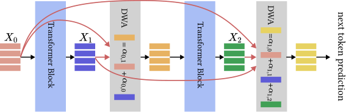
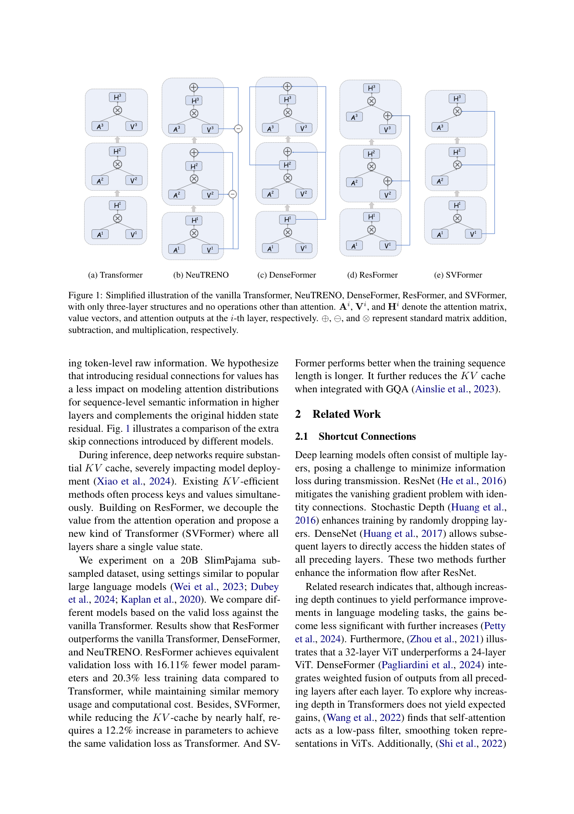
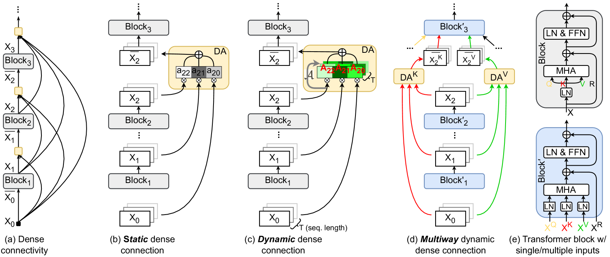
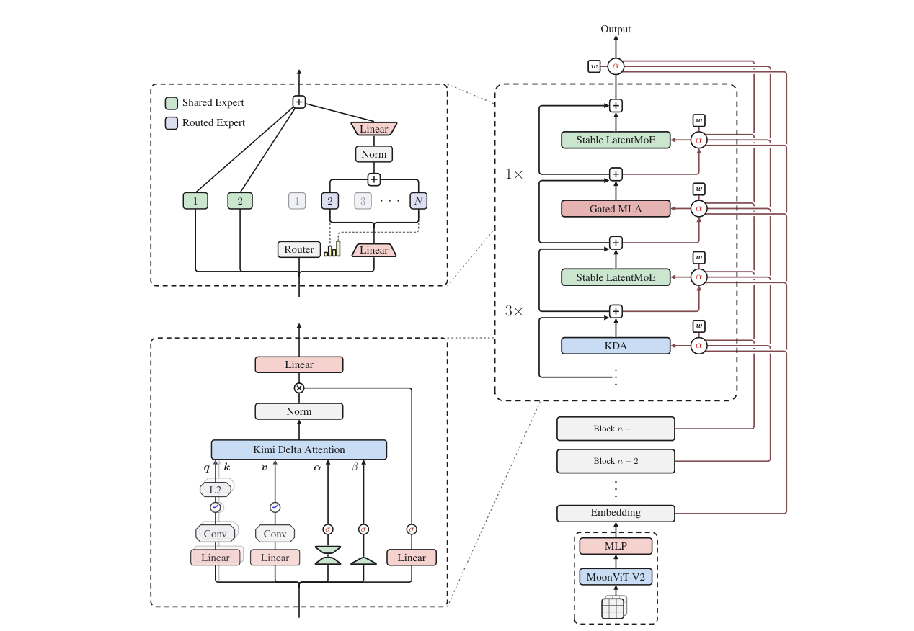
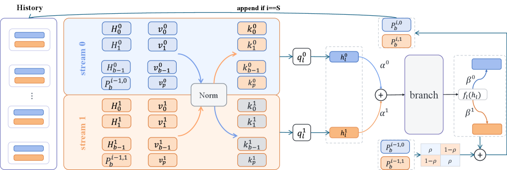

# 02 · Attention Residuals：深度维的 softmax 聚合

> 这一篇讲的是第二条改进方向：残差流可以仍然只有 1 路，但每一层不再只看「已经被加总过的 $\mathbf{h}_{l-1}$」，而是对更早各层的输出做一次内容相关的加权。DenseFormer 先用了静态标量；Value Residual 把 skip 接到了 V 上；MUDDFormer 对 Q/K/V/residual 四路分别做动态聚合；Kimi 的 AttnRes 把权重升级成 softmax，并在 Kimi K3 里用 Block AttnRes 落地。
>
> 苏剑林是 AttnRes 的共同作者。他在科学空间写了多年关于 Pre/Post-LN 与「深度有水分」的文章，这篇论文把那条思路又往前推了一步：深度维也应该从 linear 走到 softmax。
>
> 上一篇：[01 · Hyper-Connections 与 mHC](./01_hyper_connections.md)。回到总览：[Residual —— 深度方向的信息通道](./README.md)。

论文 / 博客：

- Pagliardini et al., *DenseFormer*, 2024. [arXiv:2402.02622](https://arxiv.org/abs/2402.02622)
- Zhou et al., *Value Residual Learning*, 2024. [arXiv:2410.17897](https://arxiv.org/abs/2410.17897)
- Xiao et al., *MUDDFormer*, 2025. [arXiv:2502.12170](https://arxiv.org/abs/2502.12170)
- Kimi Team, *Attention Residuals*, 2026. [arXiv:2603.15031](https://arxiv.org/abs/2603.15031)；代码 [MoonshotAI/Attention-Residuals](https://github.com/MoonshotAI/Attention-Residuals)
- Kimi Team, *Kimi K3*, 2026, §2.2. [arXiv:2607.24653](https://arxiv.org/abs/2607.24653)
- 苏剑林：[为什么 Pre Norm 不如 Post Norm](https://kexue.fm/archives/9009)、[为什么需要残差](https://kexue.fm/archives/8994)；知乎[唐翔昊：Pre-Norm 的深度有水分](https://www.zhihu.com/question/519668254/answer/2371885202)
- Dual Attention Residuals, 2026. [arXiv:2607.18730](https://arxiv.org/abs/2607.18730)

---

## 1. PreNorm 稀释

标准 Pre-LN 残差展开之后是

$$
\mathbf{h}_l = \mathbf{h}_1 + \sum_{i=1}^{l-1} f_i(\mathbf{h}_i)
$$

每一项前面的系数都是 1。当 $L$ 变大时会出现几个连锁的后果：首先，$\|\mathbf{h}_l\|$ 按 $O(L)$ 增长（这是 AttnRes 论文的陈述；更紧的随机分析常常给出 $O(\sqrt{L})$，但量级都随深度增长）；其次，新加入的一层 $f_{l-1}$ 相对已经堆起来的和，占比只有 $1/L$，这就是所谓的 PreNorm dilution；再往下推，深层想要被看见，就只能把自己的输出写得越来越大，而早期层的信息一旦进了这个和，就再也没法被单独取回。这一连锁反应还有一个经验现象作为佐证：剪掉一批深层，下游表现几乎不掉——因为那些层在等权求和里本来就没有发出多大的声音。

苏剑林和唐翔昊把同一件事说成「Pre-Norm 的深度有水分」：梯度偏向 shortcut，等效深度小于名义层数。AttnRes 的贡献是给这件事一个可学习的、输入相关的对策，而不是继续调 $\alpha,\lambda$ 这类系数。

Highway 网络（Srivastava et al., 2015）把更新改成了

$$
\mathbf{h}_l = (1-\mathbf{g}_l)\odot\mathbf{h}_{l-1} + \mathbf{g}_l\odot f_{l-1}(\mathbf{h}_{l-1})
$$

系数是可学的，但仍然只看 $\mathbf{h}_{l-1}$ 这一个压缩态。所有「门控残差」类的方法都过不了这一关：历史一旦被加总，就不可逆了。

---

## 2. DenseFormer、Value Residual、MUDDFormer：能看见历史的早期方案

### 2.1 DenseFormer：Depth Weighted Averaging

DenseFormer 让每个 block 直接读取所有更早 block 的输出，用训练出来的静态标量做 Depth Weighted Averaging（DWA）：

$$
\bar{\mathbf{x}}_l = \sum_{i\le l} a_{l i}\, \mathbf{x}_i
\qquad a_{l i}\ \text{token-independent}
$$

> 图：每个 block 出口经过一次 DWA，把 $\{x_0,\ldots,x_l\}$ 收成下一层的输入。权重是层对之间的标量，不是 attention。它比 DenseNet 式的拼接便宜，也比「只在最后一层做一次 depth-wise attention」（ElNokrashy et al., 2022）更密。（Pagliardini et al. 2024, Fig 1；[arXiv:2402.02622](https://arxiv.org/abs/2402.02622)）

AttnRes 在 16 层的消融实验里把 DenseFormer 和 PreNorm baseline 放在一起对比，val loss 分别是 1.767 和 1.766，几乎没有增益。这说明能看见历史还不够，权重必须随输入变化才行。

### 2.2 Value Residual（ResFormer）：skip 接到 V 上

Zhou et al. 2024 观察到：深层 attention 的分布会越来越集中，token 级别的细节在 V 上会流失。ResFormer 的做法是在标准 hidden residual 之外，再给 value 加一条从第 1 层到当前层的残差：

$$
\mathbf{V}'_l = \mathbf{V}_l + \mathbf{V}_1
\quad\text{(or a learnable coefficient)}
$$

当前层的 softmax($Q_l K_l^\top$) 同时作用在 $\mathbf{V}_l$ 和 $\mathbf{V}_1$ 上。SVFormer 走得更极端，所有层共用 $\mathbf{V}_1$，KV cache 近乎减半。

> 图：(a) 标准 Transformer 只有 hidden skip。(b) NeuTRENO 在 V 上做差分修正。中间各图是 DenseFormer 一类的 hidden 稠密连接。ResFormer 的额外 skip 画在 V 流上：第 1 层的 value 直接加进后续层的 attention。这是「跨层读历史」落在 attention 内部、而不是落在 residual add 上的代表。（Zhou et al. 2024, Fig 1；[arXiv:2410.17897](https://arxiv.org/abs/2410.17897)）

公开的实验规模在数百 M 到约 20B token 之间，没有进入 2025 到 2026 年的一线开源 LLM。它和 AttnRes 的差别在于：ResFormer 跨层传递的是 V，AttnRes 跨层传递的是整段 hidden，并且权重是 softmax。

### 2.3 MUDDFormer：四路动态稠密连接

MUDD 是 Multiway Dynamic Dense 的缩写。每个 Transformer block 的 Q、K、V、residual 四路输入各自对所有更早层做一次动态（token 相关）的聚合，再送进当前层。

> 图：(a) DenseNet 式每层看见所有前驱。(b) 静态标量 DWA（DenseFormer）。(c) 权重随 hidden、随位置变化。(d) 对 K、V 分开做 DA。(e) 当前 block 分别吃 $X^Q,X^K,X^V,X^R$，每路都有自己的 LN。相对 HC 而言：HC 只混合「上一层的 $n$ 流」，MUDD 是深度维的 all-to-all；相对 AttnRes 而言：MUDD 的权重不是单一 softmax 头，而是四路各自一套。（Xiao et al. 2025, Fig 1；[arXiv:2502.12170](https://arxiv.org/abs/2502.12170)）

实验数字很有说服力：MUDDPythia-2.8B 匹配 Pythia-6.9B 的困惑度和下游表现，0-shot 大约 2.4× compute、5-shot 大约 4.2×；而参数只增加 0.23%、算力只增加 0.4%。不过仍然是研究规模，没有公开的 100B 以上生产模型宣布采用。

---

## 3. Attention Residuals：深度维上的 softmax

### 3.1 时间–深度对偶

AttnRes 的出发点写得很直接：残差沿深度的角色，等价于 RNN 沿时间的角色——两者都是把历史压进一个状态。序列维上，Transformer 用 attention 替换掉了 RNN；深度维上，可以做同一件事：

$$
\mathbf{h}_l
= \sum_{i=0}^{l-1} \alpha_{i\to l}\,\mathbf{v}_i
\qquad
\sum_{i}\alpha_{i\to l}=1
$$

标准残差是 $\alpha_{i\to l}\equiv 1$（在实现里直接用 add，不做归一化）。AttnRes 用的是 softmax 核：

$$
\phi(\mathbf{q},\mathbf{k})=\exp\bigl(\mathbf{q}^\top\mathrm{RMSNorm}(\mathbf{k})\bigr)
\qquad
\alpha_{i\to l}
=\frac{\phi(\mathbf{q}_l,\mathbf{k}_i)}{\sum_j\phi(\mathbf{q}_l,\mathbf{k}_j)}
$$

每一层有一个可学习的 pseudo-query $\mathbf{q}_l=\mathbf{w}_l\in\mathbb{R}^{d}$（它和该层 $F$ 的前向解耦，所以同一块里的权重可以并行计算）。Key 和 Value 定义为：

$$
\mathbf{k}_i=\mathbf{v}_i
=
\begin{cases}
\mathbf{h}_1 & i=0\quad\text{token embedding}\\
f_i(\mathbf{h}_i) & 1\le i\le l-1
\end{cases}
$$

RMSNorm 放在 $\phi$ 里的目的是不让幅值大的层独占 softmax。算术复杂度是 $O(L^2 d)$，$L<100$ 时不算什么问题；真正贵的是 $O(Ld)$ 的历史激活——在普通训练里这些激活本来就要为 backward 保留，但一旦开启 recompute 或者 PP，就必须显式地保活并跨 stage 传递。

### 3.2 Block AttnRes：从 O(Ld) 到 O(Nd)

把 $L$ 层切成 $N$ 个 block，块内仍用普通求和收成一个 $\mathbf{b}_n=\sum_{j\in\mathcal{B}_n}f_j(\mathbf{h}_j)$，块间只对 $\{\mathbf{b}_0=\mathbf{h}_1,\mathbf{b}_1,\ldots,\mathbf{b}_{n-1}\}$（再加上当前块的部分和）做 Full AttnRes。当 $N=L$ 时退回 Full AttnRes；当 $N=1$ 时退回标准残差（embedding 单独作为 $\mathbf{b}_0$）。实验发现 $N\approx 8$ 就能收回 Full 版本的绝大部分收益，这一点在跨规模的实验里都成立。

Kimi Linear 48B 的消融实验（AttnRes 论文）给出的数字是：Full 1.737、Block 1.746、mHC-lite 1.747、baseline 1.766。Block 版本每层的 I/O 大约是 $5.5d$，而 mHC 大约是 $34d$。

### 3.3 旧的残差形式都是深度方向的线性 attention

论文 §6 把 residual、Highway、(m)HC 都写成对历史的结构化线性混合（也就是系数不经过 softmax 竞争）。AttnRes 是同一张表里唯一把这个核换成 softmax 的方法。团队回忆里苏剑林的原话大意是：单纯做一个「层间 attention」并不新鲜，难的是要把它做成 residual 的替代品，同时还要够快（参见[虎嗅对该报告的转述](https://www.huxiu.com/article/4843241.html)）。

---

## 4. Infra：PP 缓存、两阶段推理与 SP

### 4.1 训练：cross-stage cache

在 interleaved PP 里，朴素的做法是每个 virtual stage 把已经攒下的全部 block 表示再传一遍，通信量是

$$
\mathrm{Comm}_{naive}=\frac{C(C-1)}{2}N_p\,d
\qquad C=PV
$$

但物理 stage 在多个 virtual stage 上其实是同一批 GPU，所以先到的 $\mathbf{b}$ 可以留在本地；之后每次 transition 只需要传增量的 block，通信量就降到了 $O(P)$ 而不是 $O(C)$，在稳态的 1F1B 里可以和计算重叠。反向传播用的是同一套办法。

Kimi K3 §5.2.2 还补充了一点：block 表示只在块边界物化一次；AttnRes 会对整段做 checkpoint，backward 保存的激活量和标准残差是一样大的。

### 4.2 推理：两阶段与 online softmax

由于伪 query 和 $F$ 是解耦的，一块里的 inter-block attention 可以先批量算完（这是 Phase 1，读缓存的 $\{\mathbf{b}_0,\ldots,\mathbf{b}_{n-1}\}$），再和块内部分和用 online softmax 合成（这是 Phase 2）。这和 FlashAttention 的 online softmax 其实是同一个递推关系，只是「块」从序列维换成了深度维（见[IO-awareness、online softmax 与 tiling](../attention/fa/01_io_awareness_online_softmax.md)）。

Kimi K3 在 kernel 层面的做法是：prefill 阶段，block 表示走 SP，不在每个 TP rank 上复制一份，AttnRes 插在 reduce-scatter 与 all-gather 之间，每个 token 的 block 表示只落在一张卡上；decode 阶段，inter-block kernel 丢到 side stream 上和主计算重叠，intra-block 与 RMSNorm 融合进前面的 TP all-reduce。

论文声称，典型推理负载下延迟增加不到 2%；48B 训练的额外开销大约是 4%。

---

## 5. Kimi K3：AttnRes 进入生产

Kimi K3（2.8T / 104B act / 1M context）把 AttnRes 和 KDA、Stable LatentMoE 并列为三大结构。深度维上的做法可以概括为：每一层对 embedding、当前块、以及更早各块做选择性检索，而不再做顺序累加。

> 图：每个大 block 里有 3 个 KDA 加 1 个 Gated MLA，每个 attention 后面跟着一个 Stable LatentMoE（16/896 expert）。右侧的 $\alpha$ 与 $w$ 就是 Block AttnRes：pseudo-query $w$ 对 embedding 和前序 block 输出打分。视觉输入从 MoonViT-V2 进入 embedding。K3 把层划成 8 个 12 层的 block（最后一块不足时再加上 embedding，一共 9 个来源）。（Kimi Team 2026, Fig 2；[arXiv:2607.24653](https://arxiv.org/abs/2607.24653)）

这和 Kimi Linear 48B 实验的关系是：AttnRes 论文先在 Moonlight / DeepSeek-V3 骨架（KDA:MLA = 3:1 加 MoE）上只改动残差，训练 1.4T token，确认了 dilution 被压住、梯度沿深度更均匀、下游全面胜出；K3 把同一套 Block AttnRes 扩展到了 2.8T 规模，并写进了百万 token 上下文的训练和推理栈。

K3 相对 K2 大约有 2.5× 的 scaling efficiency 提升，AttnRes 是其中的一个因素，而不是全部——还有 KDA、LatentMoE、数据和 RL 的贡献。

---

## 6. Dual Attention Residuals：两条方向结合

DAR（2026, [arXiv:2607.18730](https://arxiv.org/abs/2607.18730)）明确指出：历史检索（DenseFormer / AttnRes）和多流残差（HC / mHC / MUDD / Frac-Connections）此前一直是分开做的。DAR 在 AttnRes 的深度 attention 上再加上多流结构，用 $\rho$ 矩阵在各流之间做凸混合。

> 图：stream 0/1 各自有自己的历史 $H$ 与部分和 $P$。中间先融合 $h_l=\alpha^0 h_l^0+\alpha^1 h_l^1$，经过分支 $f_l$ 之后再按 $\beta$ 写回；底部的门控矩阵 $\begin{pmatrix}\rho&1-\rho\\1-\rho&\rho\end{pmatrix}$ 是 $n=2$ 时一种极简的双随机混合，可以看出 mHC 与 AttnRes 已经开始朝彼此靠近。（2026, Fig 1；[arXiv:2607.18730](https://arxiv.org/abs/2607.18730)）

训练曲线上 DAR 优于 AttnRes、AttnRes 又优于 baseline，但目前仍是研究规模。2026 年的一线开源模型（V4、K3）还没有公开「两条方向同时开启」的配置。

---

## 7. 轴 2 方法对照表

| 方法 | 看见哪些历史 | 权重 | 流的条数 | 生产采用 |
|---|---|---|---|---|
| Pre-LN residual | 只有 $\mathbf{h}_{l-1}$ | 固定 1 | 1 | Llama / Qwen / DS-V3 / Kimi K2 |
| Highway | 只有 $\mathbf{h}_{l-1}$ | 门控、输入相关 | 1 | 几乎不用于现代 LLM |
| DenseFormer | 所有更早 hidden | 静态标量 | 1 | 无 |
| Value Residual | 第 1 层的 $\mathbf{V}$ | 固定或可学标量 | 1（在 V 上） | 无 |
| MUDDFormer | 所有更早 hidden，Q/K/V/R 分开 | 动态、按 token | 4 路读 | 无（2.8B 级实验） |
| HC / mHC | 只有上一层的 $n$ 流 | 动态线性混合（mHC 双随机） | $n$（V4 用 4） | **DeepSeek-V4** |
| **Full / Block AttnRes** | 所有更早层 / $N$ 个 block | softmax，pseudo-query | 1 | **Kimi K3**（Block, $N\approx 8$） |
| DAR | block 历史 × 多流 | softmax + 流间混合 | ≥2 | 无 |

选型时可以凭这样的直觉：如果需要加宽「当前状态」，并且能接受 $n$ 倍的激活与 PP 通信，选 mHC（DeepSeek 已经把开销压到了 +6.7%）；如果需要随机访问过去的各层，又不想把 hidden 扩大 $n$ 倍，选 Block AttnRes（通信从 $O(Ld)$ 降到 $O(Nd)$，K3 选了 $N=8$）。这两条方向本身是正交的，把它们叠在一起的证据目前只有 DAR 这种小规模曲线。

下一篇：回到[Residual —— 深度方向的信息通道](./README.md)的对照表，或者去[Attention 总览](../attention/README.md)看 $F$ 内部的 attention 算子。残差改的是层间拓扑，不会替代 FlashAttention / MLA / KDA 这些机制。
