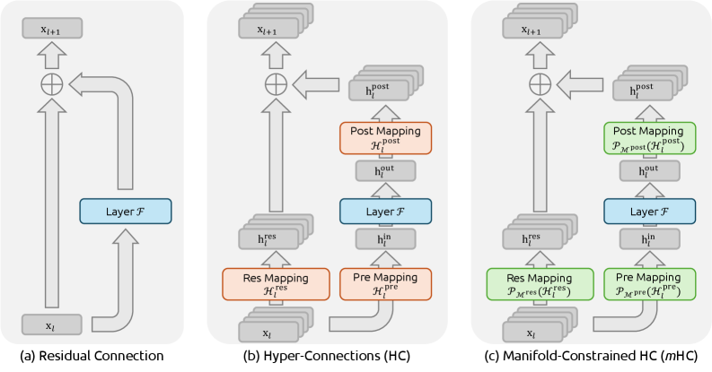

# Residual —— 深度方向的信息通道

这一章要讲清楚的是一件事：信息沿着网络深度怎么走、梯度怎么传回来、主流模型各自选了哪一种接法。2025–2026 出现的两条新路线——ByteDance 的 Hyper-Connections 演化到 DeepSeek 的 mHC，以及 Kimi 的 Attention Residuals——并不是锦上添花式的改动，而是已经分别落进了 DeepSeek-V4 与 Kimi K3 这两个生产模型。

## 前置知识

本章假设读者具备以下背景：

- 知道 decoder-only Transformer 一层里有 attention、MLP、residual add、LayerNorm/RMSNorm 这几个模块就够了；identity mapping、Pre-LN / Post-LN、残差流宽度、depth-wise attention 这些概念，正文会陆续讲清楚。
- attention 算子本身另有专门介绍，见 [Attention 总览](../attention/README.md)。
- 残差 add 在 TP+SP 下是本地的 element-wise 操作，这一点会在 [序列并行如何用 AG+RS 替换 all-reduce](../parallel/02_tp_sp/03_sequence_parallel.md) 里再提到。

---

## 0. 残差聚合算子的两条改进主线

把 Transformer 沿深度展开来看，每一层做的事情都可以写成一个统一的式子：

$$
\mathbf{h}_{l+1} = \mathcal{A}(\mathbf{h}_{\le l},\; f_l(\cdot))
$$

这里 $f_l$ 是 attention 或 MLP（本章不关心它内部的实现），$\mathcal{A}$ 是聚合算子：它决定「这一层新算出来的增量」要怎么和「已经走过的历史」合在一起。标准残差把 $\mathcal{A}$ 固定成了最简单的等权加法：

$$
\mathbf{h}_{l} = \mathbf{h}_{1} + \sum_{i=1}^{l-1} f_i(\mathbf{h}_i)
$$

过去十年里，围绕残差的绝大多数优化，本质上都是在改这个 $\mathcal{A}$。把这些改法梳理一下会发现，它们其实只沿着两条正交的方向展开：

```
                    改「通道本身」                          改「怎么读历史」
                    (stream topology)                       (depth retrieval)
  单流 identity ──► Pre / Post / Peri-LN
                 ──► DeepNorm / LayerScale / ReZero
                 ──► 把残差流加宽成 n 路 + 可学习混合
                     Hyper-Connections → mHC                固定等权 add
                                                            ──► DenseFormer 静态加权
                                                            ──► Value Residual 跨层 V
                                                            ──► softmax 沿深度选层
                                                                AttnRes / Block AttnRes
```

第一条方向是加宽或约束残差流本身（widen / constrain the stream）：残差流仍然只看上一层的状态，但把这一路状态从 1 路扩成 $n$ 路，再用一个矩阵在这 $n$ 路之间做混合。Hyper-Connections（HC）先把流加宽，mHC 再把混合矩阵投影到双随机流形上，把加宽之后丢掉的 identity mapping 找回来。DeepSeek-V4 走的就是这条路。

第二条方向是沿深度做检索（attend over history）：残差流仍然只有 1 路，但每一层不再被迫只吃「已经被加总过的一团历史」，而是对更早每一层的输出做一次（块级）softmax 加权。AttnRes 把序列维上「从 RNN 到 attention」的那一步跳跃，旋转 90 度搬到了深度维上。Kimi K3 走的是这条路。

AttnRes 论文提供了一个统一的视角：把更早的 Highway、标准 residual、(m)HC 都写成深度方向上的线性 attention（混合系数不经过 softmax 竞争），而 AttnRes 自己则把它升级成了 softmax attention。因此这两条方向并不是互斥关系：既可以加宽残差流，又可以沿深度做选择性检索，Dual Attention Residuals 正是在尝试这种组合。

---

## 1. 主流模型的选择

下面先用一张表把主流模型现在的选择摆在一起，后面各篇再逐一展开。表里的「残差形态」只记录层与层之间怎么连接，不涉及 MLA / GQA / MoE 这些更微观的算子。

| 模型 / 系列 | 残差 + Norm | 层间拓扑 | 备注 |
|---|---|---|---|
| 原版 Transformer、BERT、早期 T5 | Post-LN：`LN(x + F(x))` | 单流、等权 add | 必须 warmup；深了易炸 |
| GPT-2 / GPT-3 | Pre-LN：`x + F(LN(x))` | 单流、等权 add | 把 Pre-LN 做成 decoder 默认 |
| **Llama 1/2/3、Qwen 2/2.5/3、Mistral、Mixtral、DeepSeek-V2/V3、Kimi K1/K2** | Pre-**RMSNorm**，串行 attn→MLP | 单流、等权 add | 2023–2025 开源默认盘 |
| GPT-J、GPT-NeoX、PaLM、部分 Cohere | Pre-LN + **parallel residual** | `x + Attn(LN(x)) + MLP(LN(x))` | 系统上好 fuse；表达力有争议，近年少用 |
| Gemma 2 / Gemma 3 | **Peri-LN**：sublayer 前后都 RMSNorm，再加回 residual | 单流 |  interleaved local/global attention |
| OLMo 2 | sublayer **之后** RMSNorm，再加回 residual；另加 **QK-Norm** | 单流 | Raschka 称为 post-norm-inside |
| Grok-1 | post-norm-outside residual | 单流 | 与 Gemma 2 同族思路 |
| DeepNet（微软，MT / BERT / GPT 实验） | **DeepNorm**（放大 skip、缩小残差分支 init） | 单流 Post-LN | 能训到 1000 层；未成 LLM 默认 |
| CaiT 等 ViT | Pre-LN + **LayerScale** | 单流 | $\lambda$ 初始化接近 0 |
| ByteDance Seed：OLMo / OLMoE + DHC 实验 | **Hyper-Connections**（DHC ×4） | $n$ 流、无流形约束 | ICLR 2025；生产是否进 Doubao 未公开 |
| **DeepSeek-V4**（Flash 284B / Pro 1.6T） | Pre-RMSNorm + **mHC**（`hc_mult=4`，Sinkhorn 20 步） | 4 流、双随机混合 | 技术报告 §2.2；HuggingFace `DeepseekV4HyperConnection` |
| Kimi Linear 48B 实验 | Pre-RMSNorm + **Block AttnRes** | 单流、块级 depth attention | AttnRes 论文，1.4T token |
| **Kimi K3**（2.8T / 104B act） | 同上 + **Block AttnRes**（约 8×12 层） | 单流、块级 depth attention | 与 KDA / Stable LatentMoE 并列三大结构 |

读这张表可以看出三件事：

第一，2023 到 2025 年间的默认配置是 Pre-RMSNorm 加单流等权 add：Llama、Qwen、DeepSeek-V3 都属于这一类。

第二，Norm 的放置位置在 2024 年又开始出现分叉：Gemma 2、OLMo 2、Grok 不再严格遵守 Pre-LN，而是回到「sublayer 出口也做一次 Norm」的做法，用来压住 hidden state 的幅值。

第三，2025 到 2026 年出现的新候选默认方案，不再纠结 Norm 放在哪里，而是直接改动聚合算子 $\mathcal{A}$ 本身：DeepSeek 选择加宽并约束残差流（也就是 mHC），Kimi 选择沿深度做 softmax（也就是 AttnRes）。



> 图：标准 residual 是单流 identity + 一层 $F$；HC 把残差流扩成 $n$ 路，用 $\mathcal{H}^{\mathrm{pre}}/\mathcal{H}^{\mathrm{res}}/\mathcal{H}^{\mathrm{post}}$ 读写；mHC 结构相同，但三张映射先投影到指定流形（残差映射 → Birkhoff polytope）。这张图基本画出了第一条方向的全部剧情。（Xie et al. 2025, Fig 1；[arXiv:2512.24880](https://arxiv.org/abs/2512.24880)）

---

## 2. 这组文档怎么读

三篇正文按下面的顺序组织，具体覆盖范围见这张导航表：

| 文件 | 内容 | 锚点 |
|---|---|---|
| `README.md`（本文） | 两条正交方向、主流模型对照表、和并行/attention 章节的接口 | —— |
| [00 · Identity Skip 与 Norm 放置](./00_identity_skip_and_norm.md) | **基础**：为什么需要残差（identity + 增量爆炸）、Pre/Post/Peri-LN、DeepNorm / LayerScale / ReZero、parallel residual、ResiDual；各主流模型的 Norm 选择 | He 2015/2016、Xiong 2020、DeepNorm、Peri-LN、苏剑林 |
| [01 · Hyper-Connections 与 mHC](./01_hyper_connections.md) | **方向一**：HC 的 $n$ 流 + depth/width-connection、DHC、identity 被破坏的机制、mHC 的双随机投影与 Sinkhorn-Knopp、I/O 与 DualPipe、DeepSeek-V4 怎么落地 | [arXiv:2409.19606](https://arxiv.org/abs/2409.19606)、[arXiv:2512.24880](https://arxiv.org/abs/2512.24880)、[arXiv:2606.19348](https://arxiv.org/abs/2606.19348) |
| [02 · Attention Residuals：深度维的 softmax 聚合](./02_attention_residual.md) | **方向二**：PreNorm 稀释、DenseFormer / Value Residual / MUDDFormer、AttnRes 与 Block AttnRes、Kimi K3、和 HC 的 linear-vs-softmax 对偶、PP 缓存与推理两阶段 | [arXiv:2603.15031](https://arxiv.org/abs/2603.15031)、[arXiv:2607.24653](https://arxiv.org/abs/2607.24653)、苏剑林 / 知乎 |

建议的阅读顺序是：先读本文，建立「两条方向 + 一张对照表」的整体框架；再读[00 · Identity Skip 与 Norm 放置](./00_identity_skip_and_norm.md)，把 identity mapping 和 Norm 放置位置讲清楚，后面所有技巧都要挂在这个基础上；然后读[01 · Hyper-Connections 与 mHC](./01_hyper_connections.md)，看残差流是怎么被加宽的；最后读[02 · Attention Residuals：深度维的 softmax 聚合](./02_attention_residual.md)，看沿深度做 attention 是怎么回事。`01` 和 `02` 的顺序可以互换，但两篇都依赖 `00` 里对 PreNorm 稀释和 identity mapping 的定义。

---

## 3. 和并行策略、Attention 的接口

残差本身几乎总是一次 element-wise add（或者在 $n$ 流上做一次小矩阵乘），并不产生 collective 通信。但一旦开始改动 $\mathcal{A}$，激活的 shape 和存活时间都会跟着变化，这才真正碰到 infra 层面的问题：

| 现象 | 落在哪一章 | 说明 |
|---|---|---|
| 无 SP 时 LN / dropout / residual 的激活在 TP 各卡上复制 | [序列并行如何用 AG+RS 替换 all-reduce](../parallel/02_tp_sp/03_sequence_parallel.md) | SP 把它们按 seq 切开，残差 add 仍本地 |
| mHC 把 hidden 从 `[B,S,C]` 扩成 `[B,S,n,C]` | 本文 [`01`](./01_hyper_connections.md) | 激活显存与 PP 通信约 ×$n$；DeepSeek 用 fusion + selective recompute + DualPipe 把墙钟开销压到 6.7% |
| AttnRes 要跨层保留历史 | 本文 [`02`](./02_attention_residual.md) | Full 是 $O(Ld)$，Block 是 $O(Nd)$；PP 用 cross-stage cache，推理用 online softmax 两阶段 |
| 残差 add 的 arithmetic intensity | [Roofline model：性能上界的两道天花板](../hpc/00_roofline_model.md) | 典型 memory-bound；$n$ 流或跨层 gather 会进一步抬 I/O |

全文反复强调的 forward/backward 对称性，落到这里就是：$\mathcal{A}$ 的 Jacobian 必须给梯度留一条不会被压死的路径。identity mapping 保证了 $\partial \mathbf{h}_L / \partial \mathbf{h}_l$ 里始终有一项恒等映射 $I$；mHC 靠「复合映射仍然是双随机矩阵」这条性质，保住了均值和谱范数不发散；AttnRes 则用 softmax 让各层竞争概率质量，避免梯度被早期层独占。

---

## 4. 参考与事实来源

本章的参考与事实来源如下（按「先论文、后博客」）：

- He et al., *Deep Residual Learning*, 2015. [arXiv:1512.03385](https://arxiv.org/abs/1512.03385)
- He et al., *Identity Mappings in Deep Residual Networks*, 2016. [arXiv:1603.05027](https://arxiv.org/abs/1603.05027)
- Xiong et al., *On Layer Normalization in the Transformer Architecture*, 2020. [arXiv:2002.04745](https://arxiv.org/abs/2002.04745)
- Wang et al., *DeepNet: Scaling Transformers to 1,000 Layers*, 2022. [arXiv:2203.00555](https://arxiv.org/abs/2203.00555)
- Zhu et al. (ByteDance Seed), *Hyper-Connections*, ICLR 2025. [arXiv:2409.19606](https://arxiv.org/abs/2409.19606)
- Xie et al. (DeepSeek-AI), *mHC: Manifold-Constrained Hyper-Connections*, 2025. [arXiv:2512.24880](https://arxiv.org/abs/2512.24880)
- DeepSeek-AI, *DeepSeek-V4*, 2026. [arXiv:2606.19348](https://arxiv.org/abs/2606.19348)
- Kimi Team (含苏剑林), *Attention Residuals*, 2026. [arXiv:2603.15031](https://arxiv.org/abs/2603.15031)；官方实现 [MoonshotAI/Attention-Residuals](https://github.com/MoonshotAI/Attention-Residuals)
- Kimi Team, *Kimi K3*, 2026. [arXiv:2607.24653](https://arxiv.org/abs/2607.24653)
- 苏剑林：[为什么需要残差？](https://kexue.fm/archives/8994)、[为什么 Pre Norm 的效果不如 Post Norm？](https://kexue.fm/archives/9009)、[训练 1000 层 Transformer](https://kexue.fm/archives/8978)

---

下一篇：[00 · Identity Skip 与 Norm 放置](./00_identity_skip_and_norm.md)，先讲清楚为什么必须要有残差、Norm 应该放在哪、主流模型各自做了什么选择。
