# 01｜Prefill、Decode 与 Serving 指标

在读这一篇之前，最好已经知道 Transformer block 由 attention 和 MLP 组成，并且理解[《Roofline model：性能上界的两道天花板》](../hpc/00_roofline_model.md)里“算力上限 vs 带宽上限”这个基本判断——下面会直接用到它来分析 prefill 和 decode 各自的瓶颈。本篇会给出 serving 场景下所需的最小 shape、公式和时间戳定义，不假设你已经用过任何具体的 serving engine。

Serving 调优的第一步不是急着去改 batch size，而是先把两件事说清楚：**GPU 在 prefill / decode 阶段各自在做什么**，以及**各项指标的起止时间戳究竟定在哪里**。原因很直接：如果这两件事没弄清楚，“latency 降了”“throughput 高了”这类结论很可能只是测量口径变了，而不是系统真的变快了。

---

## 1. 从 token 到第一条流式响应

设一个 decoder-only 请求有以下这些量：

- batch size $B$；单请求分析时 $B=1$；
- prompt 长度 $S$，输出长度 $O$；
- Transformer 层数 $L$；query head 数 $H_q$，KV head 数 $H_{kv}$；
- head dimension $D_h$，hidden size $D = H_q \times D_h$；
- KV dtype 每元素 $b_{kv}$ bytes。

### 1.1 Prefill：处理 prompt 并生成第一个 token 所需的状态

不考虑 padding/packing 的情况下，一层 attention 涉及的主要张量是：

$$
\begin{aligned}
\text{hidden} &: [B, S, D]\\
Q &: [B, H_q, S, D_h]\\
K, V &: [B, H_{kv}, S, D_h]\\
\text{attention out} &: [B, S, D]
\end{aligned}
$$

prefill 阶段对 $S$ 个位置并行执行以下步骤：

1. embedding 与每层的 Q/K/V/MLP projection，形成一个 `M=B×S` 很大的 GEMM；
2. causal attention 中，位置 `i` 只能看到 `[0, i]` 范围内的内容；
3. 每一层把算出来的 $K, V$ 写入持久的 KV cache；
4. 取最后一个有效 prompt 位置对应的 logits，sample 出第一枚 output token。

attention 的计算量随 $S^2$ 增长，而 dense projection/MLP 的计算量大致随 $S$ 线性增长。在短到中等长度的上下文里，通常由大 GEMM 主导计算，因此容易逼近 compute roof；但上下文足够长时，attention 本身的计算量和 HBM IO 都变得不可忽略。这里需要提醒一句：**“prefill 一定是 compute-bound”只是一种常见的经验画像，并不是一条定律**，模型结构、$S$ 的大小、attention backend、TP/CP 的切分方式，以及 prefix cache 的命中长度，都会改变实际的瓶颈所在。

如果 prefix cache 命中了 $C$ 个 token，系统不会重新计算完整的 $[0, S)$，而是把历史 KV 当作 prefix，只计算剩下的 suffix $[C, S)$；chunked prefill 则进一步把这段 suffix 拆成多轮来计算。不管怎么拆，新的 query 仍然需要 attend 到所有可见的历史 KV，这一点不会因为拆分方式而改变。

### 1.2 Decode：每一步每个请求只产生一个新 token

在第 $j$ 个 decode step，把当前上下文长度记作 $S_j = S + j - 1$，涉及的张量是：

$$
\begin{aligned}
\text{new hidden} &: [B, 1, D]\\
\text{new } Q &: [B, H_q, 1, D_h]\\
\text{historical } K, V &: [B, H_{kv}, S_j, D_h] && \text{read from paged KV}\\
\text{new } K, V &: [B, H_{kv}, 1, D_h] && \text{appended to paged KV}
\end{aligned}
$$

自回归依赖意味着同一个请求的 token $j+1$ 必须等 token $j$ 生成之后才能开始。一个 decode step 仍然要走完全部 $L$ 层，读一遍分片后的模型权重，并扫描与当前 query 相关的历史 KV；由于单个请求每步只贡献很小的矩阵，权重难以被充分复用，所以 decode 通常受 HBM bandwidth 和 kernel launch 开销支配，而不是算力。

对一个包含 $P$ 个参数、权重元素宽度为 $b_w$ 的 dense 模型，如果忽略 activation 和 KV 的开销，$B$ 个 decode token 一起算时，粗略的 arithmetic intensity 是：

$$
I_{decode}\approx\frac{2BP}{P b_w}=\frac{2B}{b_w}\quad\text{FLOP/byte}.
$$

这条近似式揭示了 continuous batching 为什么有价值：权重只需要从 HBM 读一次，就能服务 batch 内更多的 token，$B$ 增大会把权重加载的成本摊薄到更多 token 上。不过 batch 一旦大到一定程度，activation、KV scan、collective 和 GEMM 本身又会重新接管瓶颈的位置，吞吐不会随 batch size 无限线性增长。

### 1.3 KV cache 的容量计算

标准 MHA/GQA 下，每个 token 占用的 KV 容量为：

$$
M_{KV/token}=2\;L\;H_{kv}\;D_h\;b_{kv}.
$$

公式开头的 `2` 对应 K 与 V 两份数据。整体 cache 的大小还要乘以所有存活/可缓存的 token 数，并加上 page padding、quant scale、allocator metadata 等额外开销。举个例子，$L=80,\ H_{kv}=8,\ D_h=128,\ b_{kv}=2$ 时：

$$
M_{KV/token}=327{,}680\;\text{bytes}=320\;\text{KiB},
$$

也就是说单条 128K context 的 KV cache 就已经接近 `40 GiB`。这正是 GQA、MLA、PagedAttention、prefix sharing 与 offload 会成为 serving 核心技术的原因——KV cache 的体积增长得太快了。vLLM 把同一个公式直接写进了 `AttentionSpec.real_page_size_bytes`：[[vllm:vllm/v1/kv_cache_interface.py#L184-L201]]。

---

## 2. 一个请求的时间戳

把一次请求经历的关键时刻依次记为：

- $t_a$：client 发出请求，或 benchmark 记下 arrival 时刻；
- $t_q$：请求进入 engine 的等待队列；
- $t_s$：第一次被 scheduler 选中；
- $t_1$：client 收到第一枚有效的 output token；
- $t_j$：client 收到第 $j$ 枚 token；
- $t_O$：最后一枚 token 或完成帧到达。

```mermaid
gantt
    title 单请求时间分解（示意，不按比例）
    dateFormat X
    axisFormat %L
    section Frontend
    HTTP + tokenize       :0, 2
    section Engine
    queue                 :2, 5
    prefill / KV load     :5, 10
    decode                :10, 18
    section Client view
    TTFT                  :0, 10
    E2E                   :0, 18
```



vLLM 的 server-side 统计把这段时间进一步拆成 queue、prefill、decode 三段：[[vllm:vllm/v1/metrics/stats.py#L428-L472]] 明确用第一次 `QUEUED`→第一次 `SCHEDULED`、第一次 schedule→第一个 token、第一个 token→最后一个 token 来计算这三个区间。而 client 端的 benchmark 则从发出 HTTP 请求之前的 `perf_counter()` 开始计时，见 [[vllm:vllm/benchmarks/lib/endpoint_request_func.py#L200-L257]]。这两种口径算出来的数值不一样是正常现象：client 端的口径里还包含了网络、API、detokenize 和 stream buffering 的时间。

---

## 3. Latency 指标：公式、含义与陷阱

### 3.1 TTFT（Time To First Token）

$$
TTFT=t_1-t_a.
$$

TTFT 不只是 prefill kernel 本身的耗时，而是由下面这些部分加起来的：

$$
\begin{aligned}
\mathrm{TTFT}=\;&\text{frontend}+\text{queue}+\text{cache lookup/load}+\text{encoder (optional)}\\
&+\text{prefill}+\text{first sampling}+\text{first-byte network/stream buffering}
\end{aligned}
$$

因此，如果在低并发下 prefill kernel 明显变快了，但线上观测到的 TTFT 却没有变化，常见的原因是 queue、media fetch 或者 remote cache load 才是真正的 critical path，而不是 prefill 本身。P/D 分离可以独立调节 TTFT，但要注意路由和 KV transfer 同样会加入这条路径，成为新的开销来源。

### 3.2 ITL / TBT（Inter-Token Latency / Time Between Tokens）

对 $j = 2, \dots, O$：

$$
ITL_j=t_j-t_{j-1}.
$$

ITL 描述的是每个 token 间隔的分布，因此最能暴露一次长 prefill、collective stall、GC、preemption 或网络 flush 造成的“卡顿”。TBT 在论文和产品文档里通常和 ITL 同义，但一定要说明是否把首 token 之前的间隔算进去；本文约定 TBT=ITL，且不包含 TTFT。

如果 server 把多个 token 打包成一个 SSE chunk 返回，client 侧只能看到 chunk 到 chunk 的 latency，不能把它当成 token 级别的 ITL 来用。正因为如此，vLLM 的 benchmark 优先使用返回结果里的 completion token count，并在代码里专门注明“一个 stream event 可能包含多个 token”：[[vllm:vllm/benchmarks/serve.py#L586-L605]]。

### 3.3 TPOT（Time Per Output Token）

$$
TPOT=\frac{t_O-t_1}{O-1}=\frac{1}{O-1}\sum_{j=2}^{O}ITL_j,\quad O>1.
$$

TPOT 是单个请求在 decode 阶段的平均值，而 ITL 指的是所有间隔各自的分布。两者不能互换着用，尤其不能拿 p99 ITL 去替代 p99 TPOT：前者回答的是“任意一次最卡的间隔有多卡”，后者回答的是“某条请求整体的生成节奏有多慢”。只生成了一枚 output token 时 TPOT 没有定义，benchmark 通常记为 0，并在聚合 TPOT 的时候把这类请求排除掉，vLLM 里的实现见 [[vllm:vllm/benchmarks/serve.py#L602-L608]]。

### 3.4 E2E latency

$$
T_{E2E}=t_O-t_a=TTFT+(O-1)TPOT.
$$

比较不同实验的 E2E 时必须控制好 $S$ 和 $O$，否则输出更长的请求天然会显得更慢，这不是系统本身的问题。离线 batch 场景常报告 makespan（整批完成的总时间），而在线服务场景则更关心逐请求的 E2E 以及它的尾部分位数。

### 3.5 Percentile 与尾部

“p99 TTFT = 2 s”的含义是 99% 的样本 TTFT 不超过 2 s，而不是“最慢的那个请求是 2 s”。至少应该同时报告：

- p50：反映典型体验；
- p90/p95：反映常规的容量边界；
- p99/p99.9：反映排队、故障、抢占和长尾效应；
- 样本数、窗口长度以及 error/cancel rate，否则极高的 percentile 数值没有统计意义。

另外要注意，不要把不同 prompt/output 长度区间的样本混在一起算一个 percentile 再下结论——长 prompt 占比稍微变化一点，就足以掩盖掉一次真实的性能回归。

---

## 4. Throughput 的口径

在一个测量窗口 $T$ 内，设成功完成的请求集合为 $R$，请求 $i$ 的输入/输出 token 数分别是 $S_i, O_i$，可以定义出好几种 throughput：

$$
\begin{aligned}
\text{request throughput} &= |R|/T &&[\text{req/s}]\\
\text{input throughput} &= \sum_i S_i/T &&[\text{input tok/s}]\\
\text{output throughput} &= \sum_i O_i/T &&[\text{output tok/s}]\\
\text{total token throughput} &= \sum_i(S_i+O_i)/T. &&
\end{aligned}
$$

这几个量之间不能直接互相比较。举例来说，一个 RAG workload 的 input throughput 很高，并不代表用户看到 token 出现得更快；一个短答案 workload 的 req/s 很高，也不代表模型实际执行了更多的计算。vLLM 的 `BenchmarkMetrics` 同时保存这四个量，具体的计算方式见 [[vllm:vllm/benchmarks/serve.py#L721-L729]]。

除了区分分子之外，还要说明清楚归一化的方式：

- 是 tok/s/replica、tok/s/GPU，还是 tok/s/node；
- 是每美元、每瓦能做多少 good tokens；
- 统计的是峰值、steady-state，还是包含了 cold start 的时段；
- 是 online open-loop 场景下的数字，还是“无限并发”下测出来的 offline throughput。

---

## 5. SLO、SLA、Attainment 与 Goodput

### 5.1 SLI 与 SLO 的定义

- **SLI**（Service Level Indicator）：实际测得的 TTFT、TPOT、availability 等数值。
- **SLO**（Objective）：内部设定的目标，例如“p99 TTFT < 2 s，p99 ITL < 100 ms”。
- **SLA**（Agreement）：对外做出的承诺以及违约后的处理方式，不应该和内部的技术 SLO 混在一起写。

单个请求级别的 SLO 可以写成：

$$
good(i)=\mathbf{1}\{TTFT_i\le \tau_f\land TPOT_i\le\tau_p
\land E2E_i\le\tau_e\}.
$$

不需要的约束项可以直接删去。基于这个定义，SLO attainment 就是：

$$
A=\frac{\sum_{i\in R}good(i)}{|R|}.
$$

这里要明确一点：失败、超时、被 overload 拒绝的请求是否要算进分母。从用户视角出发，通常应该算进去，否则系统完全可以靠丢弃请求来“改善”表面上的 latency 数字。

### 5.2 Goodput

在同一个测量窗口内，request goodput 定义为：

$$
G_{req}=\frac{\sum_{i\in R}good(i)}{T}\quad[\text{good req/s}].
$$

vLLM 的 `bench serve --goodput ttft:... tpot:... e2el:...` 就是逐个请求检查是否满足所有阈值，再用 `good_completed / duration` 算出这个值，见 [[vllm:vllm/benchmarks/serve.py#L617-L640,L721-729]]。

DistServe 用了一种更偏向容量规划的定义：在给定 SLO 和 attainment 目标（比如 90%）的前提下，系统能承载的**最大 request rate**，再除以 GPU 数得到 per-GPU goodput（[arXiv:2401.09670](https://arxiv.org/abs/2401.09670)）。这两种定义在扫 request rate 寻找容量边界时是相通的，但报告结果时必须把下面这些信息都写清楚：

```text
workload + SLO thresholds + attainment target + max stable arrival rate + GPU count
```

也可以定义 token goodput（只统计合规请求的 output token），但不管用哪种口径，都不能只写一个“goodput”数字而不带单位。

### 5.3 Throughput 掩盖过载的风险

随着 offered load $\lambda$ 上升，GPU 可能一直保持满载状态，output tok/s 看起来仍然很高；但与此同时 queue 会迅速增长，导致 TTFT 大量违约。这种情况下，throughput 这个数字并没有下降，但 goodput 已经越过了它的峰值，正在往下掉。生产环境的调优应该同时画出下面三条曲线：

```text
x = offered request rate
y1 = request/output throughput
y2 = p50/p99 TTFT, TPOT/ITL
y3 = SLO attainment / goodput
```

真正的容量点是 goodput 曲线可持续的峰值，或者是刚好满足目标 attainment 的最右侧那个点，而不是 GPU 第一次达到 100% utilization 的那个点。

---

## 6. Queueing 与 Little's Law

在一个稳定系统中，成立以下关系：

$$
N=\lambda W,
$$

其中 $N$ 是系统内平均并发请求数（queue 加上 running 的请求），$\lambda$ 是完成/到达率，$W$ 是平均 E2E latency。举例来说，如果系统稳定地完成 `20 req/s`、平均 E2E 是 `4 s`，那么系统内平均大约有 `80` 个请求在处理中。如果实际观测到的数字与这个估计差了一个数量级，应该先检查测量窗口、失败请求的处理方式、client concurrency 或者指标口径是否有问题。

需要注意的是，Little's Law 本身不能告诉你 p99 是多少；而且当 arrival rate 超过 service capacity、queue 持续增长的时候，系统已经不再是 steady-state，这时不能拿它来为无限排队做辩护。系统接近饱和之后，queueing delay 会非线性上升，这正是 admission control 必须在真正 OOM 之前就采取行动的原因。

---

## 7. Workload 与指标的关系

要让上面这些指标真正有意义，至少还需要记录以下几个维度的分布和相关性：

| 维度 | 为什么影响 serving |
|---|---|
| input/output length 分布及二者相关性 | 决定 prefill/decode 比例、KV residency time 与 batch churn |
| arrival process 与 burst | Poisson 只能近似平稳独立到达；真实 agent/tool call、整点流量常成簇 |
| prefix sharing / multi-turn session | 决定 APC/LMCache 的命中率与 cache-aware routing 收益 |
| priority / tenant | 决定公平性、preemption 和 quota 行为 |
| model / quant / LoRA mixture | 决定权重驻留、batch compatibility 与 cache key |
| multimodal item 数、分辨率、时长 | 决定 CPU preprocessing、encoder compute 与 placeholder token |
| streaming client 行为 | 慢 client/backpressure 可能占住请求状态与 socket buffer |

举两个极端的例子来说明这一点为什么重要：一个全随机 token 组成的 synthetic workload 几乎没有 prefix reuse，用它去证明“prefix cache 没有收益”是没有意义的；反过来，把同一个 system prompt 重复用上 100% 的流量，也同样不能代表真实开放域流量的样子。

vLLM 的 open-loop generator 支持 fixed rate、Poisson（`burstiness=1`）以及 gamma inter-arrival 分布，并且提前生成好每个请求的发送时间，避免 client 自身产生漂移：[[vllm:vllm/benchmarks/serve.py#L391-L499]]。这种做法比“每个请求完成后再发下一个”的 closed loop 更适合用来测过载行为，因为 closed loop 会在服务变慢的时候自动降低发送速率，从而掩盖住 queue 崩溃的过程。

---

## 8. 从指标反推技术

拿到一组观测数据之后，可以按照下表的思路反推出问题出在哪一层、该往哪个方向去改：

| 观测 | 先验证 | 典型技术方向 |
|---|---|---|
| 低载 TTFT 高 | prefill kernel、media/tokenize、cache load | 更合适 TP/PP/CP、prefix cache、encoder cache、kernel/compile |
| 高载 TTFT 才高 | queue、admission、prefill token budget | continuous batching、chunk、更多 P replica、load shedding |
| 平均 TPOT 好但 p99 ITL 差 | mixed prefill、collective、preemption、GC | chunked prefill、P/D、overlap、watermark |
| throughput 低且 GPU util 低 | batch 太小、CPU launch gap、网络同步 | continuous batching、async scheduler、CUDA Graph、DP routing |
| GPU util 高但 goodput 低 | 排队/过载、batch 过大 | 降低 token budget、admission、按 SLO autoscale |
| preemption 激增 | KV usage、over-admission、长 output | PagedAttention、reserve full ISL、watermark、offload/迁移 |
| cache hit 高但 TTFT 更差 | load bandwidth、chunk 粒度、lookup wait | cost-aware load-vs-recompute、prefetch/overlap、更近 cache tier |

---

## 9. 最小可复现实验口径

每一次性能结论至少应该附上以下信息，否则很难判断这个结论在别的环境下是否还成立：

1. model commit、weight/KV dtype、max context、backend；
2. GPU/NIC/CPU、TP/PP/DP/EP、replica 数；
3. $S/O$ 分布、arrival rate/burst、prefix reuse 与请求数；
4. warmup、测量窗口、open/closed loop、streaming 与 timeout；
5. TTFT/TPOT/ITL/E2E 的 p50/p90/p99、error/reject；
6. input/output tok/s、req/s 和带阈值单位的 goodput；
7. KV usage/hit、queue/running、preemption 与 GPU/网络利用率。

有了这一整套指标和实验口径，下一篇会转向真正驱动这些数字的调度机制：continuous batching 如何把大量生命周期各不相同的请求组织成每一轮的 token batch，以及 chunked prefill 为什么能够控制住 generation stall。见[02｜Continuous Batching、Chunked Prefill 与调度策略](./02_batching_and_chunked_prefill.md)。

---

## 参考

- Yu et al., *Orca: A Distributed Serving System for Transformer-Based Generative Models*, OSDI 2022（[USENIX PDF](https://www.usenix.org/system/files/osdi22-yu.pdf)）。
- Agrawal et al., *Taming Throughput-Latency Tradeoff in LLM Inference with Sarathi-Serve*, OSDI 2024（[arXiv:2403.02310](https://arxiv.org/abs/2403.02310)）。
- Zhong et al., *DistServe: Disaggregating Prefill and Decoding for Goodput-optimized LLM Serving*（[arXiv:2401.09670](https://arxiv.org/abs/2401.09670)）。
- vLLM benchmark 与 metrics 源码：[[vllm:vllm/benchmarks/serve.py]]、[[vllm:vllm/v1/metrics/]]。
