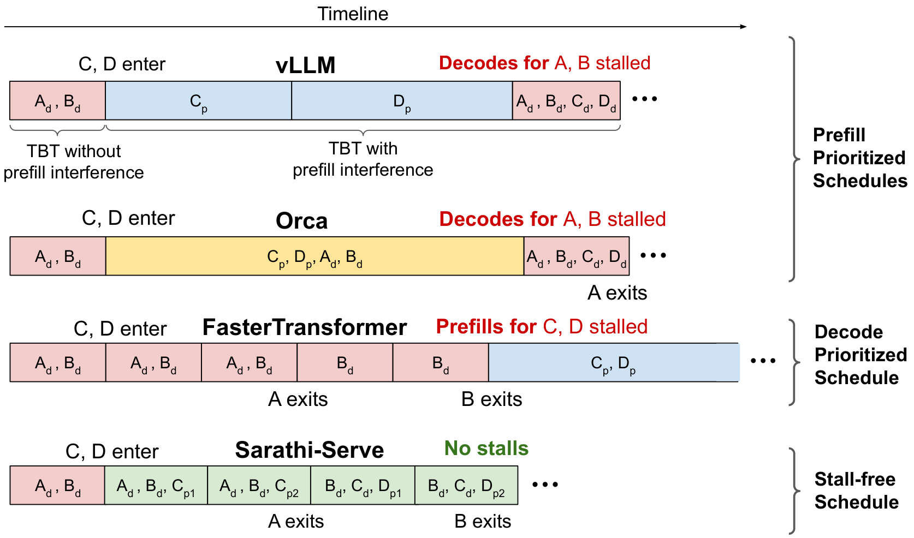

# 02｜Continuous Batching、Chunked Prefill 与调度策略

这一篇建立在[《01｜Prefill、Decode 与 Serving 指标》](./01_inference_and_metrics.md)的基础上：需要已经知道 prefill 通常一次处理多个 token，而 decode 每个请求每轮只推进一个 token，并能区分 TTFT、TPOT 与 ITL 这几个指标——下面会直接用它们来评估各种调度策略的好坏。

线上的 workload 里请求随时到达，prompt 和 output 的长度都是未知的，而且差异可能很大。调度器每一轮都要回答三个问题：哪些请求可以进入下一次 model forward？每个被选中的请求要推进多少 token？当 KV 空间不够用的时候，应该让谁等待、拒绝谁、抢占谁，或者把谁迁移走？

Continuous batching 解决的是“batch 里的成员如何动态变化”这个问题，chunked prefill 解决的是“一个长 prefill 在单轮里应该占多少工作量”这个问题。这两者组合起来，才构成了现代 serving 系统的基本调度循环。

---

## 1. 从 request-level batch 到 iteration-level batch

### 1.1 Static / request-level batching 的浪费

假设请求 A 和 B 同时开始，分别要生成 2 个和 8 个 token。如果 batch 要等到所有请求都完成才释放，情况会是这样：

```text
step        1 2 3 4 5 6 7 8
A           ● ● × × × × × ×   # 已结束但仍占 padding slot
B           ● ● ● ● ● ● ● ●
new C       ─────── waiting ──   # 不能及时加入
```

这里存在两种浪费：一是短请求结束之后，它占用的位置仍然要跑无意义的 padding compute；二是新来的请求必须等到整批全部 drain 完才能进入，带来额外的 queue latency。需要注意的是，仅仅把多个 prompt 一次性塞进 `generate()` 调用里，并不等于实现了 continuous batching，两者是不同的事情。

### 1.2 Continuous batching

Orca 提出的做法是把调度粒度从整条 request 降到 iteration 级别：每次 forward 结束之后，就把已经完成的请求从 batch 里移除，并把新请求填进空出来的 slot。

```text
iteration   1       2       3       4       5
batch       A B C   A B C   B C D   B D E   D E F
phase       可混合 prefill / decode；成员每轮变化
```

这种做法带来了几个好处：平均意义上的 decode batch 更大，权重读取和 kernel launch 的开销被摊薄到更多 token 上；请求一旦结束就能立刻回收它占用的活跃 slot 和 KV 引用；新来的请求不必等最慢的那个请求跑完才能开始。代价是每一轮都要重新调度、更新 page table、compact batch metadata，并处理长度各不相同的序列，管理成本比静态 batch 高不少。

PagedAttention 和 continuous batching 是互补的两项技术：前者让动态变化的 batch 成员对应的 KV 可以按 page 增长或释放，后者则把这部分新增出来的容量转化成更大的有效 batch，两者配合才能把收益真正落地。

---

## 2. 一轮调度的约束方程

设本轮的 token budget 为 $T$，正在跑 decode 的请求数为 $B_d$。普通的 decode 请求每条只需要 1 个 token slot，所以理论上留给 prefill suffix 的上限是：

$$
C_{\mathrm{prefill}} \le T - B_d.
$$

但真实系统还要同时满足下面这些约束：

```text
sum(scheduled_tokens)       <= max_num_batched_tokens
num(scheduled_requests)     <= max_num_seqs
new KV pages                <= free + evictable pages - watermark
encoder embeddings          <= encoder compute/cache budget
sequence position           <  max_model_len
LoRA/model/shape compatibility
```

正因为有这么多约束，batch size 其实有两个不同的口径：**request 数**和**本轮新增的 token 数**。举例来说，一个 128-request 的 decode batch 实际上只有大约 128 个 query token；而一个单请求的长 prefill chunk 却可能达到 4096 个 token。这说明只看 `#requests` 这一个数字，是没办法估计出本轮真实耗时的。

### 2.1 vLLM V1：用 num_computed_tokens 统一 phase

[[vllm:vllm/v1/core/sched/scheduler.py#L388-L408]] 的核心注释特意强调，scheduler 内部并不区分独立的“prefill phase”和“decode phase”：

```python
need = request.num_tokens - request.num_computed_tokens
need = min(need, long_prefill_token_threshold, remaining_token_budget)
blocks = kv_cache_manager.allocate_slots(request, need)
schedule(request, need, blocks)
```

这里给出的是与源码结构对应的简化伪代码。`num_computed_tokens` 用来追赶当前已知的 token 边界：当差值较大时，说明这是一次 prefill 或者恢复计算；当差值通常为 1 时，说明这是一次普通的 decode。这种统一表示天然就能支持 partial prefill、local/external cache hit，以及异步的 KV load，不需要为每种情况单独写分支。

当前 pin 住的版本会先遍历一遍 running queue（[[vllm:vllm/v1/core/sched/scheduler.py#L430-L580]]），再从 waiting queue 里准入新的请求（[[vllm:vllm/v1/core/sched/scheduler.py#L720-L979]]）。当 encoder budget、KV 或 token budget 卡住了队首的请求时，部分分支会选择跳过它，让后面的请求先前进，所以严格来说“FCFS”并不意味着每一个细节都是严格的 head-of-line 顺序。

### 2.2 SGLang：running batch + prefill adder

SGLang 把调度状态显式地保存成三部分：`running_batch`、`waiting_queue`，以及最多一个正在进行中的 `chunked_req`。它的调度逻辑大致是这样组织的：

- `SchedulePolicy.calc_priority` 先对 waiting queue 做一次重排：[[sglang:python/sglang/srt/managers/schedule_policy.py#L170-L227]]；
- `PrefillAdder` 在 token、KV、request 三种 budget 的约束下逐条准入请求：[[sglang:python/sglang/srt/managers/scheduler.py#L2620-L2737]]；
- 如果这一轮有新的 prefill batch，就优先运行它，否则更新 decode 的 running batch：[[sglang:python/sglang/srt/managers/scheduler.py#L2495-L2525]]；
- 当 `enable_mixed_chunk` 打开时，会把正在跑的 running decode 合并进 chunked prefill batch 里一起处理：[[sglang:python/sglang/srt/managers/scheduler.py#L2788-L2806]]。

vLLM 和 SGLang 底层用的数据结构不一样，但两者的调度决策本质上都把**本轮的工作量、KV 的可用量，以及请求的优先级**放在同一次 admission decision 里综合考虑。

---

## 3. Prefill interference

Continuous batching 允许 prefill 和 decode 混在同一个 batch 里，但它本身并没有自动限制一个 prefill 能有多大。如果把一个 32K 的 prompt 整段插入到正在 decode 的 batch 里，这一轮 forward 的耗时可能从几十毫秒骤增到几秒钟；而所有正在 running 的请求，它们的下一枚 token 都要等这一轮结束才能拿到，于是就形成了 generation stall。



> 图：vLLM/Orca 的整段 prefill 会拉长相邻 decode 间隔；Sarathi-Serve 用 chunked prefill 构造近似等时的 mixed batch（Agrawal et al. 2024, Fig. 7；[arXiv:2403.02310](https://arxiv.org/abs/2403.02310)）。该图描述论文评测版本；现代 vLLM/SGLang 的具体优先级已经演进，应以本章代码 pin 为准。

面对这个问题，调度策略可以走向两个极端，也可以选择中间方案，下表列出了几种典型选择及其代价：

| 策略 | 好处 | 代价 |
|---|---|---|
| prefill priority | 新请求尽快进入 decode；未来 batch 更大 | running decode 的 ITL spike |
| decode priority | 已开始请求流畅 | 新请求 queue/TTFT 高，低载 batch 难增长 |
| unrestricted mixed batch | 利用 decode 的计算 slack | 长 prefill 决定整轮 latency |
| chunked mixed batch | 给单轮工作设上界 | prefill 多次 launch，TTFT/效率依赖 chunk size |
| P/D disaggregation | 从资源上隔绝 interference | KV transfer、配比、路由和故障复杂度 |

---

## 4. Chunked prefill 切分的对象

设当前已经算好了 $h$ 个 prefix token 的 KV，下一个 chunk 里包含 $c$ 个新 token，涉及的张量是：

$$
\begin{aligned}
Q_{\mathrm{new}} &: [c,\ H_q,\ D_h], \\
K, V &: [0, h)\ \text{cached prefix} \;+\; [h, h+c)\ \text{new chunk}, \\
&\text{token } h+r \text{ attends keys } [0, h+r],\quad r = 0, 1, \dots, c-1.
\end{aligned}
$$

需要强调的是，chunked prefill **并不是**把 prompt 切成互不相干的独立段——每一个新的 query 仍然能看到全部历史 KV，只是分批把计算这件事完成。这个 chunk 涉及的 attention pair 数大约是：

$$
c\,h+\frac{c(c+1)}2.
$$

把整个 suffix 按 chunk 切开之后，理论上覆盖到的 causal attention pair 数量和整段 prefill 是一样的；额外的成本来自多轮 kernel launch、重复的 metadata/调度开销、更小的 GEMM 尺寸、page alignment 以及 pipeline bubble，而不是因为切分之后少看了一部分上下文。

### 4.1 Stall-free mixed batching

Sarathi-Serve 的思路是先把所有正在跑的 decode 请求放进这一轮，再用剩下的 token budget 去填 prefill chunk：

```python
budget = max_batch_tokens
batch = admit_all_feasible_decodes()       # each usually costs 1 token
budget -= batch.decode_tokens

if partial_prefill:
    add_chunk(partial_prefill, up_to=budget)
else:
    while waiting and budget > 0:
        add_prompt_or_chunk(waiting.pop(), up_to=budget)
```

decode 单独运行的时候通常受 weight/HBM 限制；如果适量的 prefill token 加入进来，这些大 GEMM 恰好可以利用本轮已经加载好的权重，相当于让 decode 搭上了这个计算更密集的 batch 的便车。不过这只是 roofline 意义上的一个机会，并不是没有代价的：KV scan、attention 计算、TP/EP 之间的通信、capture shape 以及具体硬件，都会共同决定这个搭便车效果什么时候达到拐点、什么时候反而变差。

### 4.2 Chunk size 的三角权衡

| chunk 更小 | chunk 更大 |
|---|---|
| 单轮上界小，p99 ITL 更稳 | GEMM/attention 效率高，launch 少 |
| 短请求更容易穿插，HOL 较弱 | 单请求 TTFT 通常更低 |
| prefill 总开销、page/metadata 开销高 | generation stall 与 PP 不均衡风险高 |

Sarathi-Serve 在他们测试的硬件和模型组合上观察到，512-token 的 chunk 大约带来 25% 的 prefill overhead，而 2048 时这部分开销已经接近可以忽略。但这不是一个通用常数，必须在目标 model/backend 上实测；而且最优值还会随着 decode batch 的大小以及 prompt 的历史长度而变化。

### 4.3 vLLM 的几个保护旋钮

[[vllm:vllm/config/scheduler.py#L49-L89,L140-161]] 里定义了一组用来保护调度稳定性的参数：

- `max_num_batched_tokens`：单轮的 token 数上限；
- `max_num_partial_prefills`：允许同时处于部分完成状态的 prompt 数；
- `max_long_partial_prefills`：限制超长 prompt 占满 partial slot 的数量，给短 prompt 留出插队的机会；
- `long_prefill_token_threshold`：单个请求在单轮里能推进的 token 上限；
- `scheduler_reserve_full_isl`：在准入新请求之前，检查它完整的 input 是否能装进 KV，而不是只看第一个 chunk 能不能装下；
- `watermark`：预留一部分 free block，降低反复抢占和重算发生的概率；
- `prefill_schedule_interval`：在 DP 部署里按固定节奏对齐各 rank 的 prefill admission，减少不同 rank 之间 forward 时长的失衡。

当前 pin 住的版本默认打开了 chunked prefill，但生产环境里实际生效的参数是由 engine config、模型和平台三方共同解析出来的，不能只参考 dataclass 里写的测试默认值。

### 4.4 SGLang 的 mixed 与 dynamic chunk

[[sglang:python/sglang/srt/managers/scheduler.py#L919-L955]] 里初始化了 fixed chunk、mixed chunk 和 PP dynamic chunk 三种模式。这里的动态算法并不是简单地固定一个 token 数，而是去拟合累计 prefill runtime 的函数 $F(x)$，然后选择下一个 chunk 大小 $c$，使得：

$$
F(h+c) - F(h) \approx F(c_0) - F(0).
$$

之所以要这样做，是因为历史长度 $h$ 越长，新的 query 需要扫描的 KV 就越多，同样大小的 token chunk 花费的时间并不相等；dynamic chunk 会随着 $h$ 增大而逐渐缩小，同时还要向 page size、硬件友好的粒度上对齐。具体调用 predictor 的代码在 [[sglang:python/sglang/srt/managers/scheduler.py#L2612-L2618]]，设计思路和调参说明见 [[sglang:docs/advanced_features/pipeline_parallelism.md#L19-L49]]。

多模态场景下还有额外的边界要考虑：如果一个 image placeholder 对应的是一整块 encoder embedding，随意把 chunk 切在这个 item 中间，可能会造成 encoder 和 cache 状态不一致。为此，vLLM 的 `disable_chunked_mm_input` 会把本轮的切分点截到 multimodal item 之前（[[vllm:vllm/config/scheduler.py#L117-L123]]）；SGLang 的 transformers backend 对部分多模态组合则直接禁用 chunk（[[sglang:sglang/.../scheduler.py#L919-L935]]）。

---

## 5. Waiting queue 的排序策略

### 5.1 常见策略

| policy | key | 优点 | 风险/适用条件 |
|---|---|---|---|
| FCFS | arrival time | 简单、可解释 | 长 prompt 造成 head-of-line blocking |
| priority + FCFS | tenant priority, arrival | 支持分级 SLO | 低优先级 starvation；必须 aging/quota |
| shortest job / SRPT 近似 | 估计剩余 token/time | 降平均 latency | output length 不可知；长请求不公平 |
| deadline / EDF | deadline slack | 直接面向 SLO | 需可靠 cost model；无望请求应早拒绝 |
| LPM | cached prefix length | 提高 cache hit、少算 prefill | 重排增加等待；queue 大时匹配开销高 |
| DFS-weight | radix subtree affinity | 一组共享 prefix 连续执行 | 在线 arrival 打断 DFS；需公平约束 |
| routing-key affinity | 与 running batch 同 key | 模型/adapter/cache locality | 热 key 可能形成热点 |
| LOF | estimated max output | 可维持大 decode batch | 名称并不代表普适低延迟策略 |

SGLang 里真实的枚举值是 `LPM / DFS_WEIGHT / FCFS / LOF / RANDOM / ROUTING_KEY`，见 [[sglang:python/sglang/srt/managers/schedule_policy.py#L133-L147]]。其中 LPM 会按 `num_matched_prefix_tokens` 从大到小排序；但当 waiting queue 超过 128 时会暂时退化为 FCFS，以避免匹配和排序本身的开销过高（`:194-227,295-306`）。此外它还会构造一棵临时的 radix tree：如果多条 waiting request 之间彼此共享 prefix，就先调度其中一条去生成 KV，其余请求暂缓一下，等它算完之后就能在 batch 内部直接复用这部分 KV（`:247-293`）。

### 5.2 Cache locality 与公平性的冲突

如果调度器持续地选择命中最长的那些请求，就可能导致某个热门的 radix subtree 长期独占服务资源，而其他请求一直排不上号。一套完整的策略至少应该包含下面几项保护机制中的一种：

- 最大 reorder window；
- waiting time aging；
- tenant token bucket / weighted fair queue；
- deadline slack 低于阈值时，覆盖掉 cache affinity 的排序结果；
- 每一轮都给长 prompt 或者低优先级请求保留一个最小的 service quantum。

这里有一点值得强调：“提高 cache hit rate”本身并不是最终目标；如果命中带来的 prefill 节省，比不上因此额外增加的 queue time，那么这么做反而会让 goodput 下降。

---

## 6. KV 不够时的应对：admission、preemption、swap 与 recompute

### 6.1 Chunking 与 over-admission

如果 scheduler 只检查第一个 512-token chunk 能不能装进去，就可能同时接纳大量 32K 的 prompt——它们随后会一起持续扩张，很快耗尽 free page，进而互相抢占，形成下面这种循环：

```text
admit many partial prefills -> KV full -> preempt/recompute
                         ^                    |
                         └──── repeated ──────┘
```

正因为如此，“尽量填满当前 batch”这个看起来合理的目标，实际上可能反而降低长期吞吐。vLLM 的 `scheduler_reserve_full_isl` 会在真正分配之前，用请求完整的 input length 做一次 admission gate，对应的检查逻辑是 `KVCacheManager.allocate_slots(... full_sequence_must_fit=True)`，见 [[vllm:vllm/v1/core/kv_cache_manager.py#L372-L387]]。

### 6.2 Preemption 的实际代价

当前 vLLM V1 的抢占路径会释放这个请求占用的 blocks，把它的 `num_computed_tokens` 重置为 0，再放回 waiting queue，具体见 [[vllm:vllm/v1/core/sched/scheduler.py#L1107-L1128]]。之后如果它原来占用的 prefix blocks 已经被别的请求覆盖，就需要重新计算；而如果这部分内容仍然留在 local 或 external cache 里，则还有机会再次命中。

一般来说，恢复被抢占的请求有两种思路：

- **recompute**：立即释放对应的 GPU KV，等恢复的时候重新走一遍 prefill。当 prefix 比较短、算力比较富余时这样做比较划算，但会增加 GPU 的额外工作量，也会拉长 tail latency。
- **swap/offload**：把 KV 搬到 CPU、SSD 或者远端存储，恢复的时候再加载回来。当 prefix 足够长、值得保留时适合这种方式，但要处理好 PCIe/network IO、buffer 管理和同步这几个复杂点。

具体该怎么选，应该比较下面这两条路径各自的耗时：

$$
T_{\mathrm{recover}} = \min(T_{\mathrm{recompute}},\ T_{\mathrm{load}} + T_{\mathrm{queue/load}}),
$$

而不是固定偏向某一种方案。KV 的生命周期会在下一章详细展开，跨 instance 的迁移则留给第 `05` 篇讨论。

### 6.3 Admission 应早于 OOM

可以落地使用的 admission 信号包括：

- `free + evictable - protected` 这部分 KV block 的数量；
- 正在 running 的请求，根据已知 input 和预估 output 得到的 reserve 估计；
- queue 里积压的工作量（预计 prefill tokens 加上 decode residency）；
- TTFT/TPOT 各自的 deadline slack；
- P/D 架构下游的 slot 状况和 transfer queue；
- tenant quota 以及全局的 overload 状态。

拒绝或者降级应该发生在真正做重 prefill 之前，而不是之后。Mooncake 的做法是把“已经算完 prefill 却没有 decode slot 可用”这种情况本身视为一种资源浪费，因此会用对未来负载的预测来做 early rejection，详见第 `06` 篇。

---

## 7. 调参顺序

面对这么多参数和策略，一个可行的调参顺序大致是：

1. **固定 workload 与 SLO**：input/output length、prefix reuse、arrival/burst 这几个条件如果不固定下来，任何关于 chunk 的结论都无法复现。
2. **扫 token budget**：画出 output tok/s、TTFT/ITL p99、KV usage/preemption 随 token budget 变化的曲线，先大致找到 knee point 在哪里。
3. **扫 chunk size**：从 backend 高效的粒度开始尝试，观察 prefill throughput 与 p99 ITL 的变化，不要只看平均值。
4. **设置 partial/long-prefill 限额**：检查短请求是否能够越过排在它前面的超长请求，也要检查长请求本身是否出现了 starvation。
5. **打开 admission headroom**：如果 preemption/recompute 的次数不为零，并且呈突发状分布，比较一下 reserve-full-input 和单纯用 watermark 这两种做法。
6. **再选择 queue policy**：先把公平性和 SLO 方面的 guardrail 定下来，再用 LPM/affinity 之类的策略去提高 cache locality。
7. **确认是否真的需要 P/D**：如果在合理的 chunk 设置下仍然无法同时满足 TTFT 和 TPOT，或者 P、D 两侧各自最优的并行方式、硬件配置明显不同，这时候再考虑承担 disaggregation 带来的额外成本。

### 必看 dashboard

```text
queue requests/tokens        running requests/tokens
scheduled prefill/decode     batch tokens + batch requests
TTFT/ITL/TPOT p50/p99        prefill/decode step latency
KV free/used/evictable       preemptions + recomputed tokens
prefix hit tokens            GPU util + HBM + collective
```

调度这一层的问题理清楚之后，下一个自然要问的问题是：调度器分配出去的这些 token 和请求，最终要落在什么样的内存系统上才能既快又不浪费？这就要进入 KV cache 本身的内存管理，也就是 block table 如何让 KV 按需增长、共享并快速回收，留给下一篇：[03｜PagedAttention 与 KV Cache 内存系统](./03_paged_attention_and_kv_cache.md)。

---

## 参考

- Yu et al., *Orca*, OSDI 2022（[USENIX PDF](https://www.usenix.org/system/files/osdi22-yu.pdf)）。
- Agrawal et al., *Sarathi-Serve*, OSDI 2024（[arXiv:2403.02310](https://arxiv.org/abs/2403.02310)）。
- vLLM scheduler：[[vllm:vllm/v1/core/sched/scheduler.py]]、[[vllm:vllm/config/scheduler.py]]。
- SGLang scheduler：[[sglang:python/sglang/srt/managers/scheduler.py]]、`schedule_policy.py`。
