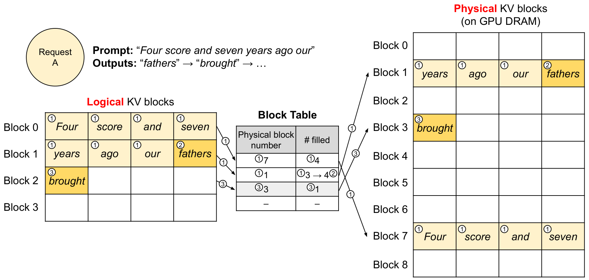
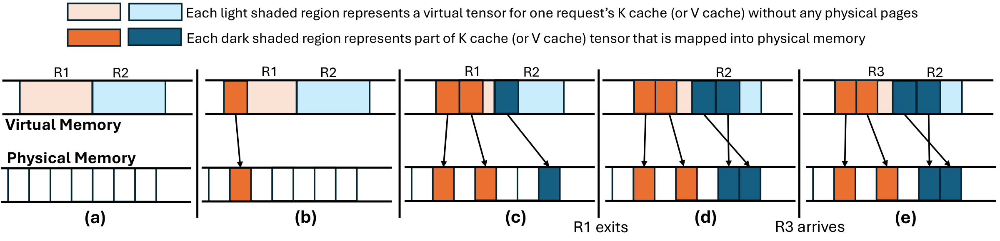

# 03｜PagedAttention 与 KV Cache 内存系统

这一篇需要用到前面两篇打下的基础：[`01`](./01_inference_and_metrics.md)里推导过的 KV 容量公式，以及[`02`](./02_batching_and_chunked_prefill.md)里讲过的 continuous batching。如果想更细地理解 attention 本身的 IO 特征，可以参考[《IO-awareness、online softmax 与 tiling》](../attention/fa/01_io_awareness_online_softmax.md)，下面会用到 online softmax 的合并方式。

KV cache 在 serving 系统里同时扮演两个角色：它是一种**性能状态**，也是一种**调度资源**。decode 之所以快，是因为它不需要重算历史的 K/V；但代价是每多保留一个 token，就要为它永久占用一份跨所有层的状态，直到这条请求结束或者被逐出为止。PagedAttention 真正的贡献并不是改变了 attention 本身的数学计算，而是让这个不断增长的动态状态，可以像操作系统里的虚拟内存 page 一样，按需分配、非连续存放，并在多个请求之间共享。

---

## 1. KV cache 的内容与容量

一层 self-attention 在处理历史 token $x_0, \dots, x_t$ 时，会计算出：

$$
K_i=x_iW_K,\qquad V_i=x_iW_V.
$$

生成下一个 token 的时候，历史的 $K_i, V_i$ 并不会发生变化，所以只要把它们保存下来，就可以避免重新跑一遍历史 token 的全部 Transformer 计算。标准 MHA/GQA 下每个 token 的总容量是：

$$
M_{token}=2L H_{kv}D_hb_{kv}.
$$

$N_{\text{live}}$ 个驻留 token 理论上需要 $N_{\text{live}} \times M_{\text{token}}$ 的容量，但实际占用还要再加上：

- page 尾部没有被填满的那部分位置；
- FP8/INT8 量化用的 scale/zero point；
- block table、slot mapping、hash/ref-count 等元数据；
- CUDA Graph/static workspace，以及 attention backend 用到的临时 buffer；
- hybrid 模型里 Mamba/conv 的 state，或者不同 attention group 各自的开销。

### 1.1 影响 KV 容量的模型结构

不同的注意力结构，会直接改变每个 token 占用 KV 的斜率：

| 结构 | KV head/state | serving 影响 |
|---|---|---|
| MHA | $H_{kv}=H_q$ | KV 最大，decode attention 读流量高 |
| MQA | $H_{kv}=1$ | KV 大幅缩小，但共享 head 可能影响模型质量/并行布局 |
| GQA | $1<H_{kv}<H_q$ | 现代 LLM 常用的质量/容量折中 |
| MLA | 保存低维 latent + RoPE 分量 | 不能直接套标准 $2H_{kv}D_h$，按模型 cache spec 计算 |
| sliding/local attention | 仅保留/使用窗口内 token | 每层容量上界受 window 限制；prefix hit 规则也改变 |
| Mamba/SSM hybrid | recurrent/conv state + 少量 full attention KV | state 的分配粒度与复制语义和 KV page 不同 |

需要区分的是，量化、paging、offload 这些手段都是在既定的模型结构上继续做优化；而 GQA、MLA 这类改动是从源头上改变了每个 token 需要的字节数，两者作用的层次不一样。

---

## 2. 连续分配的三类浪费

早期的系统会为每一条请求按 `max_seq_len` 预留一整块连续的 KV tensor。由于 output 长度事先并不知道，这种做法会产生三类浪费：

```text
request A reserved: [used used used | future future future future]
request B reserved: [used | internal waste after EOS]
global allocator:   [free 4MB][used][free 6MB]  # 总 free 足够却没有大连续块
                     reserved   internal          external fragmentation
```

这三类浪费分别是：

- **reserved**：为将来可能用到的部分预留空间，但这部分空间在请求整个生命周期内都不能给别的请求用；
- **internal fragmentation**：请求提前结束之后，原本预留的尾部空间永远用不上了；
- **external fragmentation**：全局空闲的总量看起来足够，却因为不连续而拼不出所需要的那一块。

PagedAttention 论文在他们测试的 workload 里观察到，这种旧式管理方式的有效内存利用率最低只有 20.4%。具体的比例会随 workload 的不同而变化，但 output 长度不可预测这个根本原因是长期存在的，不会因为换一种 workload 就消失。

---

## 3. Logical block、physical block 与 block table

把 token 序列按固定大小 `block_size`（$B_p$）切成一个个 logical KV block，GPU 侧则预先划分出同样大小的一批 physical block。每条 sequence 都有一张自己的 block table，用来做地址映射：

$$
\text{physical\_id}=\text{block\_table}[\lfloor position/B_p\rfloor],
$$

$$
\text{offset}=position\bmod B_p,\qquad
\text{slot}=\text{physical\_id}\cdot B_p+\text{offset}.
$$



> 图：logical block 0/1/2 分别映射到不连续 physical block 7/1/3；sequence 看到连续 token 空间，allocator 无需提供连续物理地址（Kwon et al. 2023, Fig. 6；[arXiv:2309.06180](https://arxiv.org/abs/2309.06180)）。

这套机制彻底消除了“为最大可能的 output 预留空间”这件事：prefill 阶段按实际的 prompt 长度分配 page，decode 阶段只有当新 token 跨越了 page 边界时，才需要追加一个新的 physical block。纯粹靠 paging 带来的内部浪费上界，接近每条 sequence 最后一个没填满的 page，而不再是 `max_seq_len - actual_len` 这么大的量级。

### 3.1 Block 的粒度与定义

一个逻辑上的“KV block”，概念上覆盖固定数量 token 所需要的全部 K/V。具体实现上可以有不同的组织方式：

- 每一层各自持有独立的 tensor/page，但所有层共用同一套 block id；
- 把 layer、K、V 组织成一个 cross-layer block，方便按更大粒度整块传输；
- 不同的 KV cache group 使用不同的 block size（token 数），但统一用同一种 allocator page 字节数来管理。

正因为存在这些不同的组织方式，文档里说的 `block_size` 通常指的是 token 数，而真正的物理字节数要看 `page_size_bytes`。vLLM 的 `AttentionSpec.real_page_size_bytes` 明确定义了单层 page 的大小：

```python
2 * block_size * num_kv_heads * head_size * dtype_bytes
```

见 [[vllm:vllm/v1/kv_cache_interface.py#L159-L201]]。实际分配的总量还要再乘以属于该 cache group 的层数。

---

## 4. PagedAttention kernel 读取非连续 KV

普通的 contiguous attention 假设历史 KV 存放在一段连续的地址区间里；而 paged kernel 在此之上多了一层地址转换：

```text
for each sequence/query head:
    state = online_softmax_init()
    for logical_block in visible_context:
        physical = block_table[sequence, logical_block]
        K_page, V_page = kv_pool[physical]
        partial = attention(query, K_page, V_page)
        state = online_softmax_merge(state, partial)
    output = state.finalize()
```

online softmax 允许把整个 attention 计算拆成一个个分块分别处理，再用 `(max, exp_sum, weighted_value)` 这三个统计量把各分块的结果合并起来，最终数学结果和一次性处理连续 KV 完全相同。不过这里的 page indirection、非连续的 load 以及更复杂的 metadata 都是有开销的，所以设计良好的 backend 通常会：

- 把 block-table 的 lookup 直接融合进 attention kernel 内部；
- 让 K/V 的内存布局匹配向量化 load、head size 以及 warp 之间的分工；
- decode 阶段用 split-KV/partition 的方式并行扫描很长的 context，再归并各自的 softmax state；
- prefill 阶段尽量复用 FlashAttention 那种 tiled kernel，只是额外传入 paged 的 KV table。

这里有一点值得澄清：**PagedAttention 与 FlashAttention 并不冲突**。Paged 描述的是 KV 的持久布局和寻址方式，Flash 描述的是一次 attention 计算本身的 IO-aware tiling 方式，两者作用在不同的层面上。vLLM 目前的 `FlashAttentionImpl` 就是把 `block_table` 直接传给了 unified attention backend（[[vllm:vllm/v1/attention/backends/flash_attn.py#L900-L924]]），把两者结合在了一起使用。

### 4.1 写路径：`slot_mapping`

本轮新生成 token 的 K/V 通常在 activation 里是连续存放的，但它们最终要写入的目标 cache page 却是分散的。scheduler/model runner 会为每个新 token 生成一份 `slot_mapping`，kernel 再依据它做 scatter 写入：

```python
physical_block = block_table[req, position // block_size]
slot_mapping[token] = physical_block * block_size + position % block_size
reshape_and_cache(K_new, V_new, kv_pool, slot_mapping)
```

vLLM 原始 PagedAttention 的 helper 函数在 [[vllm:vllm/v1/attention/ops/paged_attn.py#L15-L51]]；当前 FlashAttention backend 真正的写路径在 [[vllm:vllm/v1/attention/backends/flash_attn.py#L927-L960]]，可以确认这确实是一次 scatter write，而且用的是 `slot_mapping` 的长度，而不是 CUDA Graph padding 之后 K/V 的长度，来决定实际要写入多少 token。

### 4.2 地址、shape 与 sync 的风险点

这一层设计里有几个特别容易出 bug 的边界，需要格外小心：

- block table 描述的是 logical→physical 的映射；slot mapping 描述的是**本轮 token→物理 slot**的映射，这是两件不同的事，不能混用。
- physical block 一旦被回收，如果旧的 table 或者还在进行中的异步 DMA 仍然引用它，就会造成难以察觉的 silent corruption；所以 free 操作必须等到相关的 consumer 或者 transfer event 都完成之后才能进行。
- TP/CP 会改变每个 rank 上 head 或 sequence 的切分方式，P 侧和 D 侧如果 TP 配置不同，就不能直接复制同一套 layout 过去用。
- CUDA Graph 在 replay 的时候，要求使用稳定不变的 buffer 地址，以及 capture 时兼容的 metadata；动态内容应该写入这些静态 buffer，而不是每一轮都重新分配 tensor。

---

## 5. vLLM block pool 与 free block 复用

[[vllm:vllm/v1/core/block_pool.py#L144-L197]] 会初始化固定数量的 `KVCacheBlock`，以及一条 `FreeKVCacheBlockQueue`。这里说的“free”指的是没有 running request 在引用它，并不代表这个 block 上一定没有有效数据：

```text
ref_cnt > 0                  active/protected block
ref_cnt = 0, hash exists     free list 中的 prefix-cache eviction candidate
ref_cnt = 0, no hash         普通 free block，优先被重新使用
```

正是因为这样设计，同一个内存池才能同时服务 active KV 和 prefix cache 两种用途：负载升高的时候，cache 部分会自动让位给更大的 running batch。几个关键操作是这样运作的：

- `get_new_blocks` 从 free queue 的头部取出 page；如果这个 page 仍然带着 hash，会先把它从 hash map 里驱逐掉再复用（[[vllm:vllm/v1/core/block_pool.py#L542-L595]]）；
- `touch` 在命中 prefix 的时候，把 `ref_cnt=0` 的 block 从 free queue 中间以 O(1) 的代价移除，并增加它的引用计数（`:597-612`）；
- `free_blocks` 会减少引用计数，没有 hash 的 block 会被放到更早被复用的位置，而可缓存的 block 则按照 LRU 或者链尾优先的规则排队（`:614-635`）；
- `KVCacheManager.allocate_slots` 会先释放掉 sliding-window 已经看不到的 block，再检查 free/reserved/watermark 这几个条件，最后才真正分配（[[vllm:vllm/v1/core/kv_cache_manager.py#L394-L420]]）。

相比把“运行内存”和“cache 内存”静态地切成两个池子，这种做法能更好地适应负载变化，但代价是 hash、ref count、free queue 这三份元数据必须始终保持一致，否则很容易出错。

### 5.1 Sharing 与 copy-on-write

当两个请求命中了完全相同的一段 prefix page 时，可以让它们的 block table 都指向同一个 physical block，并增加对应的 ref count。但分叉之后新产生的 token，必须写到各自独立的 page 里：

- 已经写满的共享 page，后续自然会分配新的 page，不会有冲突；
- 如果需要共享一个还没写满的 page，那么后续写入之前必须先做 copy-on-write，或者干脆只共享到一个完整且安全的边界为止；
- beam/fork、多轮会话，以及跨请求的 automatic prefix caching，都可以用同一套原则来处理。

现代 vLLM 的 hash map 允许同一个 hash 值暂时对应多个 physical block，并且明确说明在 cache insert 的时候不会强制去重，这是为了保持每个请求的 block table append-only（只能追加、不能修改历史内容）：[[vllm:vllm/v1/core/block_pool.py#L34-L54]]。所以“内容相同”和“立刻在物理上合并成一份”并不是同一件事，这一点在排查 cache 行为时要留意。

---

## 6. Block size 的权衡

| 小 block | 大 block |
|---|---|
| 尾部碎片小，prefix/eviction 粒度细 | block table 短，hash/transfer metadata 少 |
| page allocation/hash/table 操作多 | kernel 连续 load 与大块 DMA 更友好 |
| scattered transfer fragment 多 | 短 prefix 命中会被向下取整、浪费更多尾部 |

具体该选多大的 block size，需要综合考虑 attention backend 支持的 page size、平均 context 长度、prefix 的边界分布、KV transfer 的 chunk 大小，以及 CUDA Graph 要求的 shape。不要把某个版本框架默认使用的 `16/32/64` 当成放之四海皆准的硬件定律，不同场景下最优值是会变的。

外部 cache 的 chunk 完全可以大于 GPU 侧的 page：比如一个 256-token 的 LMCache chunk，可能对应多个 16-token 的 vLLM block；这时 lookup 和 loading 都必须向两者共同的边界对齐才行。反过来，如果一个 transfer item 小到每个 page 都要单独发一次 RDMA，固定的提交和完成开销就会压垮实际的有效带宽。

---

## 7. Hybrid KV cache 与逐层需求

现代模型可能在不同层之间交替使用 full attention、sliding window、local chunk attention 与 Mamba 这几种机制。如果统一按 full attention 的方式给所有层分配容量，做法虽然简单，但会浪费掉那些使用窗口注意力的层本来不需要的容量。

vLLM 把每一层的需求抽象成一个 `KVCacheSpecKind`：包括 full、MLA、sliding、Mamba、chunked-local、cross-attention 等，见 [[vllm:vllm/v1/kv_cache_interface.py#L82-L92]]；再把彼此相容的 layer 组织成一个个 KV cache group。这里的核心约束是，共享同一个 physical pool 的 group，它们的 page 字节数要能被统一切分，不同的 group 之间通过“每个 page 装多少层、多大的 token block”这两个参数来配平。

Prefix hit 的判定条件也会随着 layer 类型的不同而变化：

- full attention：从左到右所有历史 block 都必须存在才算命中；
- sliding window：只要求当前位置 `p` 对应的窗口 `[p-w+1,p]` 仍然在，更早的 block 可以释放；
- full + sliding 混合：最终可复用的边界，是各个 group 各自能满足的边界取交集；
- recurrent state：分叉/copy-on-write 的语义可能要求按 block 对齐的方式整块克隆，不能简单套用普通 KV 的做法。

对应的协调层代码在 [[vllm:vllm/v1/core/kv_cache_coordinator.py]]，设计图和限制条件写在 [[vllm:docs/design/hybrid_kv_cache_manager.md]]。SGLang 那边也有 `swa_radix_cache.py`、`mamba_radix_cache.py` 以及统一的 cache 组件，这说明 prefix tree 本质上只是一层 key 的组织结构，它对应的 value 完全可以包含好几种不同类型的 state。

---

## 8. KV cache 优化全景

### 8.1 精确、默认更安全的优化

| 层次 | 技术 | 省什么 | 代价 |
|---|---|---|---|
| 模型 | MQA/GQA/MLA | 每 token KV 与 scan bytes | 模型需原生支持；并行布局变化 |
| attention | sliding/local/hybrid | 旧 token page | 不再是全局 attention，属于模型语义 |
| dtype | BF16/FP16→FP8/INT8/NVFP4 | 容量与 bandwidth | scale、量化/dequant kernel、精度校准 |
| allocation | PagedAttention | 预留与碎片 | block indirection/metadata |
| sharing | prefix/fork COW | 重复 KV | hash/tree、隔离与 eviction |
| hierarchy | GPU→CPU→SSD/remote | 扩大 cache capacity | load latency、带宽、staging buffer |
| distribution | TP/DCP/PCP shard | 每 rank KV | collective、layout/transfer 复杂 |

vLLM 当前的 `KVQuantMode` 包括 per-tensor FP8、per-token-head INT8/FP8，以及 NVFP4；这里要注意 per-token-head 的 scale 本身也要占用 FP32 的 metadata 空间，并计入 `page_size_bytes`，见 [[vllm:vllm/v1/kv_cache_interface.py#L33-L79,L169-200]]。量化之后 page 数量翻倍并不等于吞吐也翻倍：如果 attention backend 的 dequant 本身很慢，或者 decode 早已被 weight/collective 限制住，量化带来的收益主要体现在能撑更长的 context 或更高的 concurrency 上，而不是直接的算力提升。

### 8.2 有损 token eviction / compression

StreamingLLM、H2O、SnapKV、PyramidKV 这一类研究，会依据 attention score、sink/recency 或者按层设定的预算，只保留部分 token 的 KV。这类方法和普通的 LRU page eviction 有本质上的区别：

- 普通 eviction 之后，如果这条请求还要继续，只需要重新 load 或者 recompute 一次，数学结果依然是精确的；
- token dropping 会让 attention 永远看不到那些被丢弃的 token，这可能会真正改变模型的输出内容。

因此部署这类方法时，必须做任务层面、长上下文、needle-in-haystack、多语言以及安全性方面的回归测试，不能只报一个 perplexity 数字就了事；还要处理好 RoPE 的位置编码、每层各自保留的 index、prefix cache key，以及 batch kernel 对这种稀疏 layout 的支持问题。

CacheGen、KIVI、KVQuant 这一类方法则是压缩表示或者压缩传输时的 bitstream，这里也需要区分清楚：**是在 HBM 里直接以压缩格式参与 attention 计算，还是只在 CPU/network 这一层做压缩、load 回来之后再还原**。前者节省的是活跃工作集的大小，后者主要节省的是带宽和外部存储容量，两者的收益点不一样。

---

## 9. 另一条路线：vAttention 与 GPU VMM

PagedAttention 是在 user space 里维护一批非连续的 virtual block；vAttention 提出了另一种思路：为每个请求的 KV 保留一段**连续的虚拟地址**，然后用 CUDA 的 Virtual Memory Management 按需把物理 page 映射到这段虚拟地址上。



> 图：R1/R2/R3 各自拥有预留的连续 virtual tensor，只有深色部分映射实际 physical pages；请求退出后物理页可立即给新请求，但 virtual layout 不变（Prabhu et al. 2024, Fig. 5；[arXiv:2405.04437](https://arxiv.org/abs/2405.04437)）。

两种方案的对比：

| | PagedAttention | vAttention / VMM |
|---|---|---|
| virtual layout | 多个非连续 block | 每请求连续 virtual range |
| attention kernel | 需理解 block table | 可复用 contiguous-KV kernel 接口 |
| allocator | framework 管 logical/physical page | CUDA VMM map/unmap physical page |
| 运行时成本 | table/indirection | VMM map/unmap、较大物理 allocation granularity |
| sharing/offload ecosystem | 已广泛围绕 block table 构建 | 需要相应 VMM/COW/transfer 集成 |

这个对比说明了一件事：“按需做物理分配”才是真正的目标，PagedAttention 只是目前生态最成熟的一种实现方式，而不是唯一可能的地址方案。

---

## 10. 容量规划与排障

### 10.1 启动前的容量估算

```text
HBM
├── weights (+ quant scales)
├── runtime/activation/CUDA Graph workspace
├── active + prefix cached KV pages
├── transfer / all-to-all / attention workspace
└── safety headroom
```

可用的 KV token capacity 可以粗略估算为：

$$
C_{tokens}\approx
\frac{M_{HBM}-M_{weights}-M_{runtime}-M_{headroom}}
{M_{KV/token}}.
$$

最大 concurrency 并不是简单地用 $C_{\text{tokens}}$ 除以 `max_model_len` 算出来的那个数，而应该结合 workload 里 live context 的实际分布和请求的 residency time 来估算，再用 open-loop 压测去验证这个估算是否准确。

### 10.2 线上症状

| 症状 | 检查 |
|---|---|
| KV usage 锯齿 + preemption | over-admission、watermark、output tail、cache 抢占 active pages |
| page 很多但 batch 上不去 | weights/workspace 占用、request slot、backend limit、碎片/错误 group 配比 |
| prefix hit 高却重复分配 | hash granularity 与 physical block granularity、full-hit 最后 token 重算 |
| attention 突然变慢 | context 分布、page size、backend fallback、KV dtype/dequant、block table H2D sync |
| P/D 带宽低 | physical pages 太碎、每 transfer 太小、TP layout 不同、未注册/非 GDR memory |
| silent accuracy error | block 过早复用、async transfer 未完成、cache key 漏 model/LoRA/mm/dtype |

容量和排障的思路理清楚之后，自然的下一个问题是：page allocator 只解决了单个请求内部 KV 该怎么放，那跨请求之间怎么复用同一段 KV？这就要看 vLLM 的 hash-chain 和 SGLang 的 radix tree 分别怎么表示 prefix，以及这套机制怎么进一步扩展到 LMCache/HiCache 这样的多级存储，留给下一篇：[04｜Prefix Cache、RadixAttention 与分层 KV Cache](./04_prefix_and_hierarchical_cache.md)。

---

## 参考

- Kwon et al., *Efficient Memory Management for Large Language Model Serving with PagedAttention*, SOSP 2023（[arXiv:2309.06180](https://arxiv.org/abs/2309.06180)）。
- Prabhu et al., *vAttention: Dynamic Memory Management for Serving LLMs without PagedAttention*, ASPLOS 2025（[arXiv:2405.04437](https://arxiv.org/abs/2405.04437)）。
- vLLM KV 实现：[[vllm:vllm/v1/core/kv_cache_manager.py]]、[[vllm:vllm/v1/core/block_pool.py]]、[[vllm:vllm/v1/core/kv_cache_coordinator.py]] 以及 [[vllm:vllm/v1/kv_cache_interface.py]]。
- vLLM PagedAttention 设计文档：[[vllm:docs/design/paged_attention.md]]。
