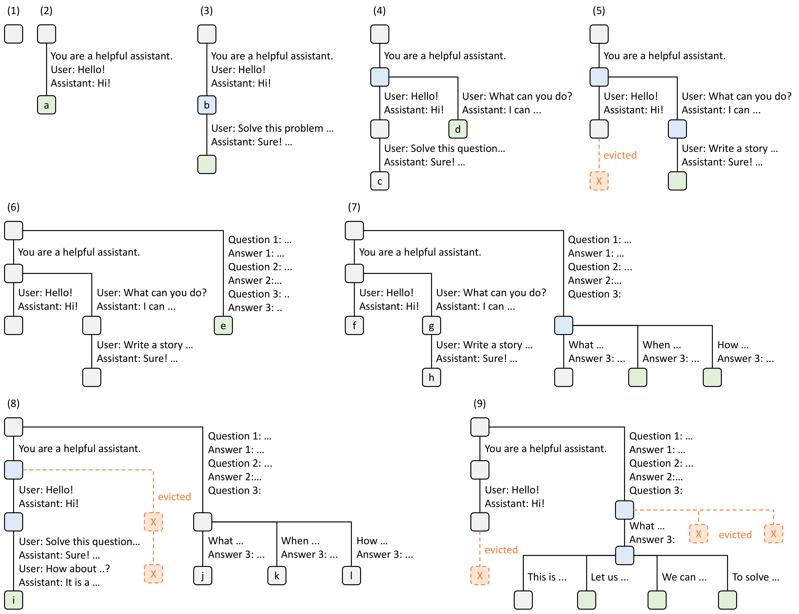
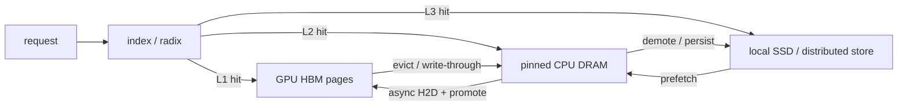
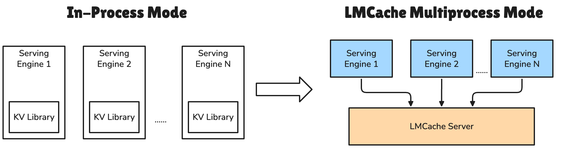
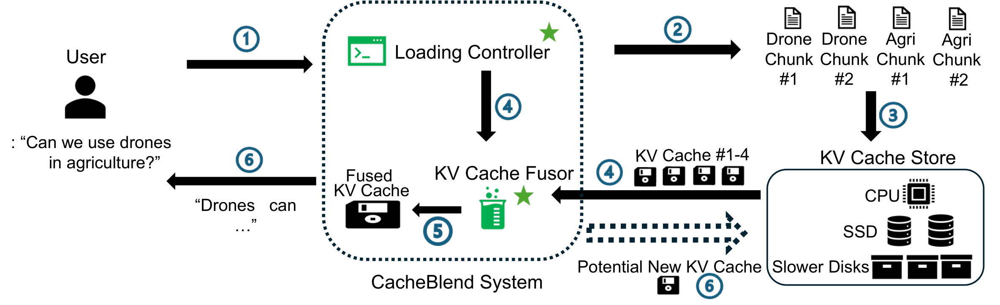

# 04｜Prefix Cache、RadixAttention 与分层 KV Cache

这一篇建立在[《03｜PagedAttention 与 KV Cache 内存系统》](./03_paged_attention_and_kv_cache.md)之上，需要已经清楚 physical KV block、block table、ref count 以及 eviction candidate 这几个概念。如果想了解多模态场景下 hash 的输入来源，可以对照[《多模态 encoder 缓存与去重》](../multimodal/08_caching_redundancy_memory.md)。

上一篇讲的 KV cache 主要解决的是“单请求内不重算历史 token”这一个问题；prefix cache 把这个思路往前推了一步，变成“**不同的请求只要拥有完全相同的 causal prefix，就可以复用同一段 KV**”。这样做能直接减少 prefill 的工作量和 TTFT，但也带来了四个新问题：怎么证明两段 KV 是等价的、怎么索引出最长的可复用 prefix、GPU 放不下的时候该往哪里放、以及分布式场景下路由要如何兼顾 cache affinity 和 queue load 这两个经常互相冲突的目标。这一篇就按照这个顺序逐一展开。

---

## 1. Exact prefix 才能安全复用

第 $i$ 个 token 在第 $l$ 层的 K/V 是这样计算出来的：

$$
(K_i^l,V_i^l)=f_l(x_0,\ldots,x_i;\theta,\text{position},\text{mask}).
$$

从这个式子可以看出，只有当两条请求共享前 `C` 个 token，并且模型、position、mask 等上下文条件完全相同时，前 `C` 个位置的 KV 才会逐层完全一致。这里的关键是**必须从第 0 个 token 开始就完全相同**，不能只是中间某一段内容看起来一样：

```text
safe exact reuse
A: [system][doc X][question A]
B: [system][doc X][question B]
   └──── identical prefix ────┘

not directly safe
A: [system][doc X][doc Y][question]
B: [system][doc Y][doc X][question]
             └ same chunks, different predecessors/positions
```

这也解释了为什么普通的 prefix cache 不能随意拼接 RAG 场景下不同 document chunk 各自缓存的 KV：即便这些文字 chunk 本身完全相同，一旦前驱 token、RoPE position 或者跨 chunk 的 attention 关系发生了变化，缓存下来的 KV 就已经不是当前完整 prompt 里本该得到的那份 KV 了，直接拼接会引入错误。

---

## 2. vLLM Automatic Prefix Caching：hash chain

### 2.1 Key 的构造：绑定完整历史

把 token 按照 hash block size 切成一块一块的 $X_0, X_1, \dots$，vLLM 用的是一种链式 hash：

$$
H_i=Hash(H_{i-1},X_i,E_i),
$$

这里的 $E_i$ 是一些会影响 KV、但没法只从 token id 推出来的额外信息，称为 extra key。因为每个 block 的 hash 都依赖前一个 block 的 hash，所以即便两个中间 block 的 token 内容完全相同，只要它们的前驱不同，算出来的 $H_i$ 也会不同，这就避免了误判两个实际不等价的 KV 段为相同。

真实实现里的 `hash_block_tokens` 在 [[vllm:vllm/v1/core/kv_cache_utils.py#L577-L604]]；`get_request_block_hasher` 只针对完整的 hash block 递增计算，并把上一个 block 的 hash 传递给下一个 block（`:673-730`）。extra key 具体在 `generate_block_hash_extra_keys`（`:539-574`）里组合，包括：

- LoRA adapter 的身份标识；
- 落在该 block 里的 multimodal item hash，以及它在 block 内的相对 offset；
- 第一个 block 会带上的 `cache_salt`；
- prompt embeddings 的内容 hash。

`BlockPool.cached_block_hash_to_block` 再把 `(block_hash, kv_cache_group_id)` 这个组合映射到具体的 physical block：[[vllm:vllm/v1/core/block_pool.py#L34-L141]]。

### 2.2 Lookup、最后 token 与粒度

`KVCacheManager.get_computed_blocks` 从第一个 block 开始查找最长的连续命中，并且只接受满足各个 cache group 各自规则的 prefix（[[vllm:vllm/v1/core/kv_cache_manager.py#L202-L242]]）。这里有个细节：即便完整的 prompt 都命中了缓存，仍然要保留最后一个 token 的计算，用来得到 logits，否则就没法采样出下一个 token；当前实现把 `max_cache_hit_length` 设为 `prompt_length-1`，而且受 block alignment 的影响，有时实际重算的是最后一个完整的 block，而不是恰好一个 token。

普通 APC 的可复用长度，因此经常会向下对齐到 hash 或者 page 的边界。当前的 hybrid allocator 还支持一种“较大 group block 内部、更细的 hash 边界”的 partial alias metadata（[[vllm:vllm/v1/core/block_pool.py#L358-L470]]），但这并不意味着任意一个尚未写满的 GPU page 都可以安全地跨请求追加内容；physical ownership 和 copy-on-write 依然由 allocator 统一控制。

### 2.3 Eviction 与 active block 共池

一条请求完成之后，它占用的 block 的 ref count 会降为 0，但对应的 hash 和数据仍然留在 free queue 里；等新请求命中的时候，`touch` 操作会重新保护这个 block；只有在内存紧张的时候，allocator 才会从队首摘掉 block、删掉它的 hash 后拿去覆盖。这样设计的好处是 cache capacity 能自动随着 active load 的变化而伸缩；风险是 hit rate 和当前能承载的 batch 大小要竞争同一块 HBM，两者之间存在权衡。

vLLM 的 free queue 遵循 LRU 优先的顺序；同一时刻被释放的一条 chain 里，覆盖更深、包含更多 prefix token 的 block 会更早被驱逐，这样可以优先保住那些更通用的短 prefix，具体逻辑见 [[vllm:vllm/v1/core/kv_cache_utils.py#L179-L195]]。

---

## 3. SGLang RadixAttention

Hash table 擅长按固定大小的 block 去查找，而 radix tree（也就是压缩过的 trie）换了一种思路：直接把 token prefix 本身作为树上的路径，每条边上可以携带一段长度不固定的 token。SGLang 里 tree node 的核心字段是这样的：

```text
TreeNode
├── key: edge 上的 token segment
├── value: 对应 physical KV indices
├── children
├── parent
├── lock_ref: running request 正在使用，不能 evict
├── last_access_time / hit_count / priority
└── host_value / hash_value: hierarchical cache metadata
```

具体实现在 [[sglang:python/sglang/srt/mem_cache/radix_cache.py#L201-L292]]。

### 3.1 Match 与 split

`match_prefix` 首先按 `page_size` 把 key 向下对齐，再逐条 edge 比较。如果只命中了一条压缩 edge 的前半段，就会调用 `_split_node` 把这个精确的分叉点暴露出来，并把拼接后的 KV indices 一起返回（[[sglang:python/sglang/srt/mem_cache/radix_cache.py#L337-L395,L622-668]]）。这个结构变化的过程并不会复制 KV 的实际内容，只是把原来 value 的切片重新分配到父子两个 node 的 metadata 上。

### 3.2 Insert 与重复 page 回收

当一条请求完成，或者一个 chunk 暂停执行的时候，`cache_finished_req/cache_unfinished_req` 会把这条 token path 和当前的 KV indices 插入到树里；如果这段 prefix 之前已经存在了，多余的 physical indices 会立刻还给 allocator，同时把 request table 改成指向共享的那份 indices（[[sglang:python/sglang/srt/mem_cache/radix_cache.py#L417-L528]]）。

### 3.3 Leaf-first eviction 与 lock

驱逐时只会驱逐 `lock_ref=0` 的 leaf 节点；删掉一个 leaf 之后，如果它的父节点因此也变成了无锁的 leaf，就会被加入待驱逐的 heap 里继续排队。这样的顺序能优先保留那些被更多分支共享的祖先节点。`inc_lock_ref/dec_lock_ref` 会沿着路径更新 protected 和 evictable 的大小统计，见 [[sglang:python/sglang/srt/mem_cache/radix_cache.py#L537-L607]]。



> 图：九个时间点展示聊天、few-shot 与多分支采样如何共享 radix prefix，并在内存不足时按 LRU leaf eviction 保住公共祖先（Zheng et al. 2023, Fig. 3；[arXiv:2312.07104](https://arxiv.org/abs/2312.07104)）。

### 3.4 Cache-aware scheduling

如果 waiting queue 里的 A、B、C 三条请求属于同一个 subtree，连续地服务它们比在多个互不相关的 subtree 之间来回切换要更省事，也更少发生 thrash。SGLang 的 LPM 策略按已命中的最长 prefix 排序；DFS-weight 策略则把落在同一个终止 node 上的请求聚合起来，按 DFS 的顺序访问整棵树，代码见 [[sglang:python/sglang/srt/managers/schedule_policy.py#L194-L227,L295-328]]。

原论文证明了，在离线的请求集合下，只要 cache 至少能容纳最长的那条 path，DFS 顺序就能让树上每一条 edge 只被计算一次，从而达到最优的 cache hit 效果；但在线场景下随时到达的新请求会打破这个前提，而且单纯用 LPM 有可能造成某些请求长期得不到调度的 starvation，所以生产环境必须在这些策略之上再叠加 waiting-time aging 或者 priority 之类的保护机制。

### 3.5 Hash-block 与 radix tree 对比

| | vLLM block hash chain | SGLang radix tree |
|---|---|---|
| key | parent hash + fixed token block + extras | token segment path + `extra_key` namespace |
| lookup 粒度 | hash block/cache group boundary | page-aligned variable edge |
| sharing metadata | hash→physical block(s) | path node→physical index slice |
| eviction | free-block LRU queue | unlocked LRU/策略 leaf |
| scheduler affinity | connector/router 可用 block hash | tree 原生支持 LPM/DFS |
| 共性 | 都只复用最长连续 exact prefix；active 与 cache 可共用 physical pool |

### 3.6 Cascade Attention：共享 attention IO

Prefix cache 能让多条请求的 block table 指向同一段公共 KV，但普通的 decode kernel 仍然可能对每一个 query 各自重复扫描这段 KV，没有利用到这种共享关系。如果当前 batch 里的所有请求都共享一段较长的 prefix，就可以把 attention 计算拆成两部分：

```text
each query × common-prefix KV   # 共同的一段，可形成更高效的 batched/MQA 计算
each query × private-suffix KV
                 -> merge 两段 online-softmax state
```

这一类 Cascade Attention 优化的对象是**本轮 attention 计算里的重复读取和并行度**，而不是引入新的 cache 命中，两者是不同层面的收益。vLLM 的 scheduler 会在每一轮里求出所有 running request 共同的 prefix block 集合（[[vllm:vllm/v1/core/sched/scheduler.py#L1002-L1010]]）；FlashAttention backend 再根据 prefix 长度、query 数量、tile 并行度以及 DCP 兼容性来决定要不要真正启用这项优化，并不是只要存在公共 prefix 就一定强制使用（[[vllm:vllm/v1/attention/backends/flash_attn.py#L1173-L1247]]）。原因是公共 prefix 太短时，拆分和合并本身的开销可能反而更大；而且启用 cascade 的 batch 还会影响到 CUDA Graph 的 dispatch 方式。

---

## 4. 命中率的计算口径

至少要区分下面这四层，笼统地说“命中率”很容易产生误导：

$$
\text{token lookup hit rate}=\frac{\text{contiguous prefix tokens at lookup}}
{\text{prompt tokens queried}},
$$

```text
lookup hit       key/index 说“存在”
load success     bytes 实际成功到达 GPU page
effective hit    scheduler 真正跳过的 prefill tokens
request hit      请求至少/全部命中（粒度太粗，容易误导）
```

举个例子，一个 100K 长度的 prompt 命中了 90K，和一个只有 10 个 token 的 prompt 命中了 1 个 token，这两种情况按“request hit”这个粒度算都算命中，但它们的实际价值完全不同。生产环境应该优先看 token-weighted 的 effective hit、节省下来的 prefill GPU 时间，以及 load 相对 recompute 的实际胜率。

而且命中也不一定意味着更快：

$$
T_{reuse}=T_{lookup}+T_{queue,IO}+T_{load}+T_{stitch/sync},
$$

只有当 $T_{reuse} < T_{recompute}$，并且不会让 deadline 恶化的时候，才应该选择 load 而不是重算。当远端带宽很低、命中的 prefix 本身很短，或者传输的 fragment 太碎的时候，“cache hit”反而可能增加 TTFT，这一点在设计和调优时容易被忽略。

---

## 5. 从 GPU L1 扩到 CPU L2、SSD/remote L3



不同层级各自有典型的容量、延迟画像，以及需要重点关注的 data path：

| tier | 容量/延迟画像 | data path 重点 |
|---|---|---|
| GPU HBM | 最小、attention 可直接消费 | active/cache 共池、page ref/eviction |
| pinned CPU DRAM | 大一到两级，PCIe/NVLink-C2C | pinned/NUMA、H2D DMA、double buffer |
| local NVMe/GDS | TB 级，固定 IOPS/queue depth 重要 | 大 chunk、async IO、GDS/CPU staging |
| remote DRAM/SSD | cluster 级共享 | RDMA/GDR、replica、metadata、tenant/故障 |

### 5.1 Write policy

- **write-through**：GPU 产生 KV 之后立刻异步写入 L2/L3，命中比较稳定，即便 decode worker 失败之后也仍然可以复用，但代价是每一条请求都会产生额外的写流量。
- **write-back/on-evict**：只在真正逐出的时候才把数据下沉一层，这样能避免写那些不再需要的冷数据，但 eviction 这条 critical path 上的耗时更难隐藏。
- **write-around/selective**：只把 system prompt、长 document、多轮会话里稳定的 prefix 写入外部层，其余内容不写；这种做法需要一个 reuse/cost predictor 来判断该不该写。

### 5.2 Prefetch 与 promotion

lookup 可以在请求还处于 waiting queue 阶段的时候就先启动 L3→L2 的搬运，等真正分配好 GPU page 之后再做 L2→L1；但不能让 scheduler 一旦宣称命中了 external cache，就无限等待这个 IO 完成。常见的策略有：

- wait-complete：优先保证命中，TTFT 就等这次完整的 load 结束；
- best-effort：如果在本轮之前还没搬完，就直接改成重算；
- timeout/cost-aware：在 deadline 或者 load 与 recompute 的成本交叉点之前愿意等待，超过就切换；
- layerwise：让第 $l+1$ 层的 load 和第 $l$ 层的计算重叠进行。

SGLang 的 HiCache 用 GPU/host/storage 三级来扩展 RadixAttention；具体的配置、内存 layout 与 prefetch policy 见 [[sglang:docs/advanced_features/hicache_design.md]]、`hicache_best_practices.md`。其中 `page_first` 让一个 page 内的多层数据更适合做大块 IO，`layer_first` 则更方便按 layer 组织 pipeline；具体选哪种受 attention backend 和 direct IO 支持情况的约束。

---

## 6. LMCache：KV 的独立数据层



> 图：LMCache 可作为 engine 内 connector 或独立 daemon，把 vLLM/SGLang 的 paged KV 接到 CPU、本地/远端存储与 P/D data path（LMCache project, commit `09bc14c0a`；[official repository](https://github.com/LMCache/LMCache)）。

前面讲的 prefix cache 都还是内嵌在具体 serving engine 内部的机制。LMCache 走了另一条路：把 KV 从 engine 的临时运行状态，变成一个可以独立存在、跨 engine 复用的数据层。

### 6.1 核心数据流

`LMCacheEngine` 的 docstring 已经给出了它的基本契约（[[lmcache:lmcache/v1/cache_engine.py#L83-L98]]）：

```text
store:
vLLM/SGLang paged GPU KV
  -> engine-specific GPUConnector
  -> CPU MemoryObj / allocator
  -> StorageManager -> disk/Redis/Mooncake/NIXL/... asynchronously

retrieve:
backend MemoryObj -> GPUConnector + slot_mapping -> paged GPU KV
```

`store()` 接受 token/hash、prefix mask，以及 page/slot 相关的 metadata（[[lmcache:lmcache/v1/cache_engine.py#L386-L469]]）；`retrieve()` 会返回每个 token 是否真正加载成功的 mask（`:778-870`）；`lookup()` 则返回 storage 中最长连续 prefix 的 token 数（`:1129-1195`）。这三个步骤必须分开处理，因为即便 metadata 层面命中了，实际的数据传输仍然可能失败或者超时，不能想当然地认为命中了 metadata 就等于数据已经就位。

### 6.2 Chunk key

`ChunkedTokenDatabase` 默认会把 token 切成固定大小的 chunk，逐个 chunk 做前缀式的 hash chain（[[lmcache:lmcache/v1/token_database.py#L298-L365]]），再生成一个包含模型、world size/worker、KV dtype 以及 request config 的 `CacheEngineKey`（`:234-248`）。

```python
prefix_hash = INIT
for tokens_i in chunks(tokens, chunk_size):
    prefix_hash = hash(prefix_hash, tokens_i, extra)
    yield CacheEngineKey(model, layout, dtype, prefix_hash)
```

用完整的 chunk 做单位，能大幅降低 CPU/network backend 上每个对象的额外开销，但代价是短尾、短 prefix 的部分没法命中；当 GPU block 和 LMCache chunk 大小不一致的时候，vLLM 的 adapter 需要把本地命中的部分向 chunk 边界对齐。

跨进程共享还要求各进程用的 hash seed 和算法完全一致。LMCache 在 remote/PD 场景下，如果没有设置 `PYTHONHASHSEED`，会发出警告甚至直接报错（[[lmcache:lmcache/v1/token_database.py#L310-L325]]）；如果用了现代的 CBOR/SHA digest，还需要两端统一 vLLM 的 hash 版本，否则同样的内容会算出不同的 key。

### 6.3 Engine adapter 与 layerwise pipeline

vLLM 的 scheduler 会先问 LMCache 能给出的最长 external hit，据此分配好目标的 physical block，再把请求的 token/slot mapping 放进 connector 的 metadata 里。worker 侧的 `start_load_kv` 用 mask 跳过那些已经在 vLLM 本地 L1 里存在的 prefix 部分，把外部 KV scatter 写入剩下的 slot（[[lmcache:lmcache/integration/vllm/vllm_v1_adapter.py#L763-L895]]）。

启用 layerwise 模式时，load 和 compute 会按下面这种方式交错进行：

```text
load layer 0 -> compute layer 0
load layer 1 --------^ -> compute layer 1
load layer 2 ----------------^ -> ...
```

`wait_for_layer_load(layer_name)` 只在 attention 即将消费这一层之前才建立依赖关系（adapter `:971-996`），存储侧的 stream 同理可以把第 $l$ 层的 D2H 传输和第 $l+1$ 层的计算重叠起来。这里的同步粒度必须是 CUDA event 或 stream dependency，不能每一层都调用一次 `device.synchronize()`，否则会把本该重叠的时间又串行化回去。

独立的 multiprocess/daemon 模式进一步把 engine 的 crash/restart 和 cache 的生命周期解耦开来，不再共享同一个失败域，同时可以集中做配额管理、观测、eviction 以及跨 engine 的共享；代价是要处理 IPC、GPU memory registration，以及这个独立服务自身的高可用问题。

### 6.4 Backend 的有效带宽

LMCache 支持 CPU RAM、filesystem/GDS、Redis/Valkey、Mooncake、S3 等多种 backend。选哪一种要看的是：

$$
\mathrm{effective\ bandwidth}=
\frac{\text{useful KV bytes}}
{\text{lookup}+\text{transfer}+\text{synchronization}},
$$

而不是这个介质标称的带宽数字。举例来说，256 次 1 MB 的操作和 1 次 256 MB 的操作，实际耗时可能相差一个数量级；NUMA 错配的 pinned memory、按 page 逐个发起的 RDMA、序列化和 checksum 的开销，都会成为实际的瓶颈所在。

---

## 7. Non-prefix reuse 与 CacheBlend

在 RAG 场景里，同一个 document chunk 可能出现在不同请求里、以不同的顺序和位置组合出现。如果直接把各自缓存下来的 chunk KV 拼在一起用，会漏掉新组合里才出现的跨 chunk attention，而且用的还是旧的 position 信息；但如果完全重算，又白白浪费了缓存本来能带来的收益。CacheBlend 给出的解法是：加载各个 chunk 的 KV，修正与位置相关的部分，再逐层挑选一小部分 KV 偏差较大的 token 重新计算，让整体误差逼近完全重算的结果。



> 图：Loading Controller 从 CPU/SSD 选取 document chunk KV，KV Cache Fusor 选择性重算并融合，再把新 KV 可选地写回 store（Yao et al. 2024, Fig. 11；[arXiv:2405.16444](https://arxiv.org/abs/2405.16444)）。

需要强调的是，这已经不再是 exact prefix cache 那种精确复用：如果选择重算的比例太低，会真正改变 attention 计算结果和输出内容，而且模型、任务类型、chunk 的排列顺序、RoPE 与量化方式都会影响最终质量。所以使用这类方法时必须同时报告 TTFT 和任务质量两方面的数据，不能只看速度。LMCache 目前的 MP 模块 `blend_v3.py` 已经是一个 paged-aware 的模块，会注册 RoPE/cache fingerprint，并把结果 scatter 写入到 request 对应的 page 里：[[lmcache:lmcache/v1/multiprocess/modules/blend_v3.py#L1-L79]]。

CacheGen 解决的是另一个维度的问题：它利用 KV 分布本身的统计特性，把用于外部传输的表示编码成更小的 bitstream，从而降低网络和存储层面的字节数；load 回来之后再还原成 attention 需要的格式。它可以和 prefix cache、CacheBlend 正交地组合使用，但要注意压缩和解压本身的耗时也要计入 critical-path 的账本里。

---

## 8. Distributed cache-aware routing

当多个 replica 各自维护自己的本地 L1/L2 cache 时，router 要优化的目标并不是简单地“选命中 prefix 最长的那个”或者“选 queue 最短的那个”，而是要估计出每个候选 replica 上完整的预期延迟：

$$
\widehat{TTFT}_r=
\widehat{queue}_r+
\min(\widehat{load}_{remote\to r},\widehat{recompute}_{miss,r})+
\widehat{prefill}_{suffix,r}.
$$

然后在满足 SLO 和公平性约束的前提下，选出这个估计值最小的那个 replica。可选的策略空间包括：

- cache affinity：把请求路由到已经拥有最长 prefix 的 replica；
- load balance：当拥有热点 prefix 的 replica 太忙时，把请求转去空闲节点，接受重算的代价；
- cache transfer/replication：主动把热点 prefix 复制到空闲节点上，分散压力；
- session stickiness：多轮会话尽量路由回原来的 decode 节点，充分利用它本地的 cache；
- weakly consistent meta-index：router 根据各节点上报的 block 事件维护一份“哪个节点可能持有某个 key”的索引，真正 load 之前再去确认一次。

Mooncake Conductor 论文里给出的算法会同时估算本地/远端的 prefix 命中情况、queue 长度、prefill 耗时和 transfer 耗时；如果算下来远端传输还不如本地重算划算，就不搬运这份 KV，而这种选择本身会自然地让热点 block 在多个节点上都逐渐产生副本（[arXiv:2407.00079](https://arxiv.org/abs/2407.00079) §5）。vLLM/SGLang 的 KV cache events 机制可以给外部的 router 或 manager 提供 block stored/removed 这样的事件流，但消费这些事件的一方必须自己处理好重复、乱序、丢事件，以及定期做 snapshot/reconcile 这几个问题。

---

## 9. Cache key、失效与安全清单

任何在数学上会改变 KV 的因素，都必须被纳入 key/namespace 的组成部分，否则就要禁止对应的共享：

| 因素 | 为什么 |
|---|---|
| model identity + weight revision | 参数更新后相同 token 的 KV 已变 |
| tokenizer + chat template/normalization | 字符相同不保证 token/position 相同 |
| RoPE scaling/position ids/attention mask | K 的旋转与可见历史改变 |
| KV dtype/scales/layout/cache groups | bytes 解释与 page shape 不同 |
| TP/CP/PP rank/layout | 分片数据不同；除非显式 gather/reshard |
| LoRA/adapter | projection 权重不同 |
| multimodal raw content + processor config + placement | placeholder token 相同不代表 image embedding 相同 |
| prompt embeddings | token id 不包含 embedding 内容 |
| tenant/cache salt | 隔离不愿共享的请求，防跨租户 timing/content 泄漏 |

权重热更新时必须先停止接受新的命中，等待或者主动抢占正在运行的请求，然后再原子地切换 namespace 或者重置整个 cache。vLLM 的 GPU encoder/prefix cache 都提供了 weight-update 时的 reset 路径；如果只是简单地清掉 hash，却让 running 的 table 继续读取已经被覆盖的 page，就会得到错误的结果。

跨租户共享还可能形成一种 timing side channel：攻击者可以通过观察 TTFT 来判断某个 prefix 是否已经被别人访问过。安全方面的默认做法应该是使用 tenant-scoped 的 salt、配额限制、加密传输和加密存储、访问控制列表，以及可审计的清空操作；只有在明确属于同一个信任组的情况下，才允许共享同一个 namespace。

---

## 10. 调优与观测

### 10.1 Admission/eviction 的价值估计

一个 block 的期望价值可以粗略估算为：

$$
V(block)=\frac{P(reuse)\cdot(T_{recompute}-T_{load})}
{bytes\cdot residency\_time}.
$$

单纯的 LRU 简单、对局部性友好，但一段很长、算起来很贵的 system/document prefix，可能值得用 pin 或者 soft-pin 的方式特别保留；反过来，一次性的长 prompt 也不应该把高频访问的短 prefix 挤出去。LFU/SIEVE、cost-aware、priority-aware 以及 tenant quota，都是针对不同 workload 特点的补充手段，但都要注意控制好额外的 metadata 和预测开销，不能为了精细化决策反而拖慢系统。

### 10.2 必看指标

```text
query tokens / effective hit tokens / hit prefix histogram
L1/L2/L3 lookup hit, load success, fallback recompute
load/store bytes, bandwidth, queue, p50/p99 latency by tier
GPU protected/evictable/free pages; host/SSD capacity
eviction, promotion, duplicate store, failed/corrupt load
saved prefill time vs cache load time; cache-induced TTFT timeout
hit/usage by tenant/model/adapter (注意标签基数)
```

### 10.3 最常见反模式

实践中容易踩的坑包括：

- 只用第二次发送完全相同的 prompt 来测试，就宣称这代表了线上的 cache 收益；
- 用 request hit rate 代替 token hit rate 来报告效果；
- 只要 metadata 层面查到了就算作 hit，不去验证对应的 bytes 是否真的成功加载；
- remote tier 没有设置 timeout，导致所有“命中”都变成了阻塞 TTFT 的等待；
- cache key 里漏掉了 LoRA、多模态或者 model revision 这些应该纳入的因素；
- cache-aware 的 router 只顾着追求命中率，不做 load balance 或者 aging；
- GPU/CPU 之间的拷贝用了 pageable memory，或者每个 chunk 都做一次全局 synchronize；
- 没命中的长尾请求也把大量一次性的 KV 写入 cache，造成不必要的 write amplification。

Prefix cache 解决的是跨请求复用同一段 KV 这个问题；但对于 P/D 分离的架构来说，还需要为**每一条新请求**把这次 prefill 刚刚产生的 KV，从生成它的 producer 搬到真正消费它的 decode consumer 那里去。这条搬运路径具体怎么走，会在下一篇逐层拆解：[05｜P/D Disaggregation 与 KV Cache Transfer](./05_disaggregation_and_kv_transfer.md)。

---

## 参考

- Zheng et al., *SGLang: Efficient Execution of Structured Language Model Programs*（[arXiv:2312.07104](https://arxiv.org/abs/2312.07104)）。
- Yao et al., *CacheBlend: Fast Large Language Model Serving for RAG with Cached Knowledge Fusion*（[arXiv:2405.16444](https://arxiv.org/abs/2405.16444)）。
- Cheng et al., *LMCache: An Efficient KV Cache Layer for Enterprise-Scale LLM Inference*（[arXiv:2510.09665](https://arxiv.org/abs/2510.09665)）。
- Liu et al., *CacheGen: KV Cache Compression and Streaming for Fast LLM Serving*（[arXiv:2310.07240](https://arxiv.org/abs/2310.07240)）。
- vLLM prefix caching design：[[vllm:docs/design/prefix_caching.md]]；SGLang HiCache：[[sglang:docs/advanced_features/hicache_design.md]]。
