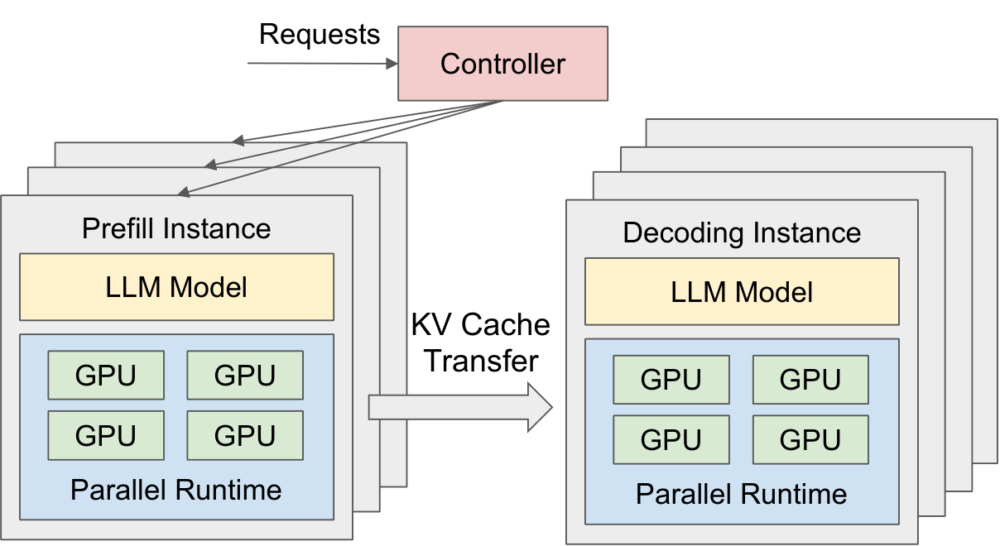
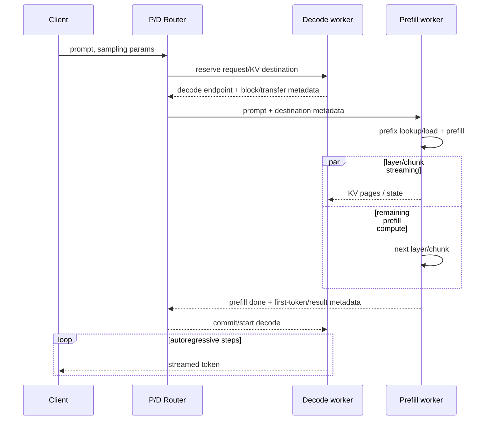
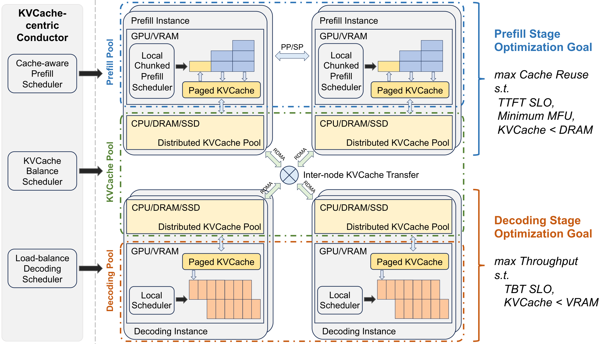
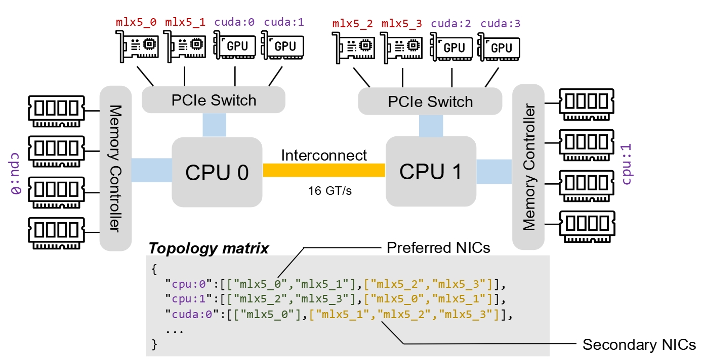
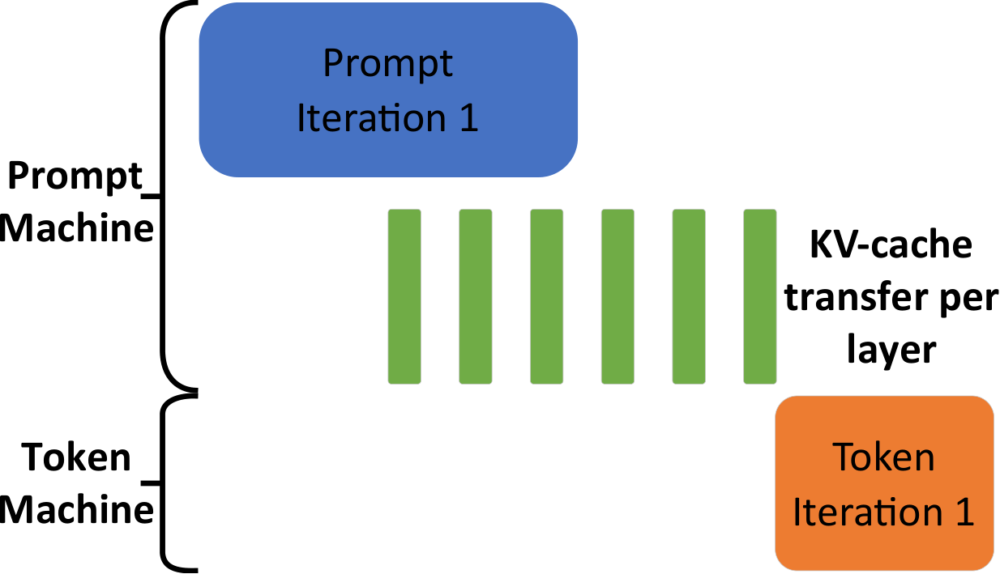

# 05｜P/D Disaggregation 与 KV Cache Transfer

上一篇讨论的 prefix cache 与分层 KV 让不同请求之间能够复用计算结果，这一篇讨论的 P/D disaggregation 则把同一条请求拆到两组各自独立的资源上执行。阅读这一篇前，需要了解 [`01`](./01_inference_and_metrics.md) 里 prefill/decode 各自的资源画像、[`03`](./03_paged_attention_and_kv_cache.md) 里 paged KV 的布局方式，以及 [`04`](./04_prefix_and_hierarchical_cache.md) 里外部 KV 的 lookup/load 流程；网络拓扑的基础概念可以参看 [scale-out fabric：拓扑、收敛比与超平面](../hpc/02_scale_out_topology_planes.md)。

P/D disaggregation 的做法是把一条请求拆到两个独立的 engine pool：Prefill worker 负责处理 prompt 并生成对应的 KV，Decode worker 接收这份 KV 之后持续生成 token。它最重要的价值在于**把 TTFT 与 TPOT 各自的排队、资源配比、并行策略和故障域拆开来独立处理**；付出的代价是，每一条没有命中缓存的请求，都多了一次大状态量的传输开销。

---

## 1. P/D 分离要解决的冲突

如果用同一个统一的 engine 去同时服务 prefill 和 decode 这两种 workload，会发现它们的诉求其实是互相冲突的：

| | Prefill pool 想要 | Decode pool 想要 |
|---|---|---|
| 优化目标 | 低 queue + 高 prefill tok/s，压 TTFT | 稳定 step latency，压 TPOT/ITL tail |
| batch | 大 token batch / 长 prompt | 大 request batch，每条少量 token |
| 主要资源 | compute、长 attention | HBM bandwidth/capacity、launch、collective |
| 并行 | 大 TP/PP/CP 可降低单 prompt latency | 小 TP/DP-attn/EP 常利于容量与吞吐 |
| KV residency | prompt 结束即可移交/释放 | 整个生成期都要驻留并增长 |
| 硬件 | 高 FLOPS 更有价值 | 高 HBM capacity/bandwidth、功耗效率更重要 |

在统一调度里，一次长 prefill 会拉高其他请求的 ITL；如果为了抑制它把 chunk 调得很小，又会反过来损伤 TTFT 和 prefill 效率，这是一个绕不开的矛盾。P/D 分离用物理上的资源隔离，直接消掉这一组相互干扰的关系，并且让两个池子可以独立扩缩容。



> 图：controller 将请求分发到独立 prefill/decoding instances，并在两池间传 KV；两侧可以使用不同 replica 数与 parallel runtime（Zhong et al. 2024, Fig. 6；[arXiv:2401.09670](https://arxiv.org/abs/2401.09670)）。

### 1.1 P/D 不保证 throughput 上升

不过拆分并不是没有代价的，它还会带来一些新问题：

- 在 P、D 两个池子里各自复制一份权重，占用更多显存；
- 增加了 router、handshake 和 KV transfer 的开销；
- P pool 空闲下来的 HBM 不再能直接拿给 D pool 用来装 active KV；
- 当到达比例发生变化时，可能出现一个池子空闲、另一个池子排队的失衡状态；
- 引入了跨节点的 failure、timeout，以及取消请求之后的清理逻辑。

正因为如此，vLLM 官方文档明确说明，disaggregated prefill 主要用来独立调节 TTFT/ITL、控制 tail ITL，**并不会自动提高 throughput**（[[vllm:docs/features/disagg_prefill.md]]）。它更常提高的是在满足 SLO 前提下的 goodput，而不是不设上限的 backlog 下能测出来的原始 tok/s 数字。

---

## 2. 请求与状态穿过两池的路径



具体系统可能用 push，也可能用 pull，甚至可能先选好 P 再去选 D；但**先在 D 侧预留好容量**通常更稳妥，可以避免“一次昂贵的 prefill 算完了，却发现没地方放它生成的 KV”这种尴尬情况。首个 token 可以由 P 采样完之后连同状态一起交给 D，也可以只传最后一层的 hidden/logits，由 D 自己完成采样；无论用哪种协议，都必须保证 token 序列、`num_computed_tokens` 与 KV 的边界完全一致，不能出现最后一个 token 被重复计算或者漏算的情况。

### 2.1 传输量

对于标准的 GQA 请求，需要搬运的聚合 KV bytes 大致是：

$$
M_{xfer}=S_{miss}\cdot2LH_{kv}D_hb_{kv},
$$

其中 $S_{miss}$ 是没有被 D 侧、local cache 或者 global cache 覆盖到的那部分 prompt token 数。如果 TP 只是按 KV head 做切分，那么每个 rank 只需要搬自己那 1/TP 份的 shard，但所有 rank 加起来的总量仍然大致等于上式；如果 P 和 D 两侧的 TP 配置不一样，还需要额外做 gather、split、reshard 这几步。

串行传输的耗时大致是：

$$
T_{xfer}\approx T_{setup}+\frac{M_{xfer}}{BW_{effective}}.
$$

这里的 $BW_{effective}$ 并不是 NIC 标称的 line rate，而是扣除掉 page fragmentation、PCIe/NUMA 开销、内存 registration、协议头开销、并发争用以及 gather/scatter 之后，真正有效可用的字节速率。

---

## 3. 两种 data path：直接 P2P 与共享 Store

### 3.1 Direct P2P connector

```text
P GPU paged KV -- RDMA/NVLink/TCP --> D GPU paged KV
        control: endpoint, rkey/handle, block ids, completion
```

这种方式的优点是只需要一次传输、延迟低，适合 P 和 D 已经成对配置好、之间又是高速互联的场景；缺点是双方必须同时在线，D 的目标地址需要提前知道，一旦涉及重试、迁移或者多个 consumer 的场景就会变得复杂。P 主动 push 或者 D 主动 pull 都可以实现，具体怎么选取决于谁持有 transport agent、什么时候能知道对方的 block table，以及网络安全模型的要求。

### 3.2 Shared/distributed KV Store

```text
P -> store object/chunk namespace <- D
     metadata/placement/replica/lease
```

这种方式把 producer 和 consumer 彼此解耦，可以跨请求做 prefix sharing、多副本、持久化以及故障恢复；但代价是多了一层 lookup 和 placement，通常会变成 put 加 get 两段独立的数据搬运，而且需要专门管理 eviction、一致性和多租户隔离。Store 的数据节点完全可以和 P/D 部署在同一台机器上，利用它本地的 DRAM/SSD，以及 client 到 client 之间的直接传输，来减少多余的一跳。

### 3.3 Control plane 与 data plane 的边界

router 或者 master 这类控制节点，应该只负责转发小体量的 metadata，比如 request id、hash、地址、长度和状态；至于以 GB 计的 KV 本身，应该走 GPU 到 GPU、或者已注册内存之间的直达路径。如果让一个 Python 写的 router 先把 tensor 收下来再转发出去，就会多一次不必要的拷贝，占用 CPU 和触发 GC，还会把这个中心节点变成整个系统的带宽瓶颈。

---

## 4. 经典系统：DistServe、Splitwise、Mooncake

- **DistServe**：以 TTFT/TPOT 的 SLO 和 attainment 为优化目标，搜索 P 和 D 各自最优的 inter-op replica 数与 intra-op parallelism 配置，再按需扩展到目标的 arrival rate。
- **Splitwise**：这篇工作细致刻画了 prefill 和 token 生成两个阶段在算力、显存、功耗上的差异，允许使用异构的 GPU 和功耗配置，并特别强调了 per-layer KV transfer 与计算的 overlap。
- **Mooncake**：把 P/D 分离、分布式 KV pool、cache-aware 的 Conductor，以及过载状态下的 early rejection 组合在一起，构成了一套以 KVCache 为中心的架构。



> 图：Mooncake 的 Conductor 分别做 cache-aware prefill、KV balance 和 decode load balance；P/D 间与 CPU/DRAM/SSD KV pool 通过 RDMA 连接（Qin et al. 2024, Fig. 1；[arXiv:2407.00079](https://arxiv.org/abs/2407.00079)）。

Mooncake 论文里的流程是：尽量先把可复用的 KV 送到选定的 P 上，按 chunk 或者按 layer 完成剩下的 prefill 并持续流向 D，D 收齐了足够可用的状态之后，就把这条请求纳入 continuous batch。它还把 TTFT 的估计写成 queue 时间加上 transfer 时间再加上剩余的 prefill 时间三者之和，这样就能避免盲目地去追求命中最长的 remote prefix，而忽略了传输本身的代价。

---

## 5. Mooncake Transfer Engine：搬运层

Mooncake 上游版本 pin 在 `f90ae691f`。Transfer Engine（TE）有两个核心抽象：

- **Segment**：一个进程里可以被远端引用的逻辑地址空间，实际注册的只是其中的 DRAM/VRAM buffer；也支持 NVMe-oF 类型的 segment。
- **BatchTransfer**：一批 read/write 请求，每一项都包含 local address、remote segment/offset 与长度；提交之后是异步的，需要单独查询 completion 状态。


> 图：TE 将进程的 registered DRAM/VRAM buffers 暴露为 RAM Segment，统一通过 batch read/write 访问远端 DRAM、VRAM 或 NVMe-oF；GPU path 可走 GPUDirect（Mooncake official docs, commit `f90ae691f`；[repository](https://github.com/kvcache-ai/Mooncake)）。

C++ API 对应得很直接：

```text
TransferEngine::init                 transfer_engine.h:102
registerLocalMemory                  transfer_engine.h:127
openSegment                          transfer_engine.h:119
allocateBatchID / submitTransfer     transfer_engine.h:211 / 134
getTransferStatus                    transfer_engine.h:225
```

代码路径见 [[mooncake:mooncake-transfer-engine/include/transfer_engine.h#L70-L288]]。具体的传输 backend 由 `Transport` 接口实现，官方文档列出的选项包括 TCP、RDMA、EFA、NVMe-oF、NVLink、HIP 等，实际能用到哪些取决于编译选项和运行平台。

### 5.1 Topology-aware multi-NIC

如果随便选一张 NIC，可能会让 GPU 的数据跨越 PCIe switch 甚至 CPU interconnect，瓶颈就落在了 UPI/NUMA 这些环节上。TE 的 discovery 机制会为每一类 memory location 生成一张 preferred/secondary 的 NIC 矩阵：



> 图：`cuda:0` 优先走同一 PCIe switch 下的 `mlx5_0`，CPU/GPU 各有 preferred 和 fallback NIC；大请求还可切 slice 聚合多 rail 带宽（Mooncake official docs, topology-aware path selection；[repository](https://github.com/kvcache-ai/Mooncake)）。

源码和文档里几个值得关注的性质：

- 注册 memory 的时候会附带 device/NUMA location 信息；
- 长 transfer 内部会被分片到多条路径上，提高多 NIC 的利用率；
- endpoint 是按需建连并池化复用的；
- 某条 rail 或连接失败时可以切换到备选路径，但如果是永久性的参数或内存错误，就不应该盲目重试；
- registered buffer 的生命周期必须覆盖所有相关的异步操作，提前释放会造成隐患。

详见 [[mooncake:docs/source/design/transfer-engine/index.md#L1-L90]]。

---

## 6. Mooncake Store：KV object/placement 层

TE 只负责“把数据从这些地址搬到那些地址”，而 Store 在它之上提供了一层 `key -> immutable object replicas` 的抽象：

```text
Master Service                         Clients / storage segments
allocation + object metadata    <---- heartbeat / mount
replica / eviction / lease             DRAM / VRAM / SSD capacity
       │ metadata only                         ▲
       └──────── client A <==== data ====> client B
                         Transfer Engine
```

`Master Service` 本身并不在 data path 里；Client 既可以直接发 `Put/Get` 请求，也可以贡献出自己的一部分作为 global segment。设计文档见 [[mooncake:docs/source/design/store/mooncake-store.md#L22-L50]]，C++ API 见 [[mooncake:mooncake-store/include/client_service.h#L72-L260]]。

Put 操作用的是两阶段可见性协议：

1. `PutStart` 向 Master 申请 replica 和 slice 的 placement；
2. Client 通过 TE 把实际数据写进去；
3. `PutEnd` 把这份 replica 标记为完成，其他 reader 这时候才能读到它。

这样设计可以避免 consumer 读到只写了一半的 partial KV。`Get/BatchGet` 会先查询 replica 的 metadata，再挑一份完整的 replica 直接读到预先注册好的 slices 里；Store 还提供多副本复制、pin 住不被驱逐、tenant quota、SSD offload，以及高可用的 master 这些能力。这里要特别区分：**MooncakeConnector（直接 P2P）和 MooncakeStoreConnector（共享 pool）并不是同一种模式**，两者对应的是本篇第 3 节里讲的两条不同 data path。

---

## 7. vLLM KVConnector：scheduler 与 worker 的接口边界

vLLM V1 的抽象定义在 [[vllm:vllm/distributed/kv_transfer/kv_connector/v1/base.py#L171-L550]]，分成两半：

### 7.1 Scheduler side

```text
get_num_new_matched_tokens(request, local_computed)
  -> external prefix length, async_load?

KVCacheManager.allocate_slots(... external_tokens ...)
  -> reserve destination physical blocks

update_state_after_alloc(request, blocks, external_tokens)
build_connector_meta(scheduler_output)
```

如果 lookup 还没有完成，connector 可以直接返回 `None`，scheduler 就在这一轮跳过这条请求，稍后再重新查询；如果走的是异步 load，就先分配好 page、启动跨 step 的加载过程，等它完成之后再调用本地的 suffix 计算。调度代码里接入 external hit 的位置在 [[vllm:vllm/v1/core/sched/scheduler.py#L722-L785]]。

### 7.2 Worker side

```text
register_kv_caches(paged tensors)
start_load_kv(forward_context)       # 尽早发起 async load
wait_for_layer_load(layer_name)      # attention 消费前建立依赖
save_kv_layer(layer_name, kv_layer)  # layer 产出后尽早 async save
wait_for_save()                      # page 可能复用前 fence
```

这组接口把 layerwise pipeline 需要用到的所有 hook，都固定挂在了 attention 计算的边界上。`wait_for_save` 存在的目的并不是让 HTTP 响应去等 store 完成，而是防止对应的 physical page 在 DMA 还没完成之前，就被 allocator 拿去覆盖了。

当前 vLLM 同时包含以下几种实现：

- 直接的 `MooncakeConnector`：[[vllm:vllm/distributed/kv_transfer/kv_connector/v1/mooncake/mooncake_connector.py]]；
- `MooncakeStoreConnector`：[[vllm:vllm/distributed/kv_transfer/kv_connector/v1/mooncake/store/connector.py#L87]]，文件头部明确说明它走的是共享 Store 加 hash dedup 的路线，和直接 P2P 是两回事；
- 以及 LMCache、NIXL、offloading、multi-connector 等其他实现。

direct Mooncake 的 scheduler 部分在 [[vllm:vllm/distributed/kv_transfer/kv_connector/v1/mooncake/mooncake_connector.py#L620-L709]]，会根据 `kv_transfer_params` 把远端的 prompt token 标记为异步的 external load；worker 部分 `:1835-1846` 把 send/recv 任务投递到一个独立的 event loop 里执行。而 Store connector 则是把 get/put 操作放进一个后台的 transfer 线程，`start_load_kv/save_kv_layer` 这两个 hook 可以什么都不做，因为实际的传输是在 step 之间完成、并和计算重叠进行的（[[vllm:vllm/distributed/kv_transfer/kv_connector/v1/mooncake/store/connector.py#L275-L303]]）。

---

## 8. SGLang P/D 与 HiCache

SGLang 用独立的 server role 来区分 P 和 D：

```text
--disaggregation-mode prefill
--disaggregation-mode decode
router --pd-disaggregation --prefill ... --decode ...
```

它支持 Mooncake、NIXL 等多种 backend，文档和可复现的启动命令见 [[sglang:docs/advanced_features/pd_disaggregation.md]]。具体实现的入口包括：

- prefill 端的 event/transfer 逻辑：[[sglang:python/sglang/srt/disaggregation/prefill.py]]；
- decode 端的 reserve/poll 逻辑：[[sglang:python/sglang/srt/disaggregation/decode.py]]；
- Mooncake 的 KVManager/Sender/Receiver：[[sglang:python/sglang/srt/disaggregation/mooncake/conn.py]]；
- 通用的 staging buffer：[[sglang:python/sglang/srt/disaggregation/common/staging_buffer.py]]。

HiCache 和 P/D 分离这两套机制是正交的：P 节点可以从 GPU/host/L3 里复用已有的旧 prefix，只把剩下没算过的 residual KV 传给 D；D 侧则可以异步地把多轮会话里产生的新 KV 写入共享的 L3，下一轮不管落在哪个 P 上都能命中它。如果配置不当，反而会出现同一份 KV 先从 D 写到 L3、再从 L3 读到 P、再从 P 传回 D 这样的绕路，造成严重的 write/read amplification。

---

## 9. LMCache 在 P/D 中的位置

LMCache 既可以当共享的 cache/storage mode 用，也可以当作实时的 transport mode 用：

```text
vLLM P connector -> LMCache chunk/staging -> NIXL/NVLink/RDMA -> D connector
                                  or
                 -> CPU/disk/Mooncake backend <- D
```

它的优势在于同一套 chunk key、storage manager、GPU connector 和 observability，可以同时覆盖跨请求的 cache 复用与跨 engine 的 transfer 这两种场景。[[lmcache:lmcache/integration/vllm/vllm_v1_adapter.py#L453-L596]] 负责初始化 connector、chunk/async/layerwise 相关的状态；`:763-895` 按目标的 `slot_mapping` 去加载；`:999-1122` 则可以逐层 store。

LMCache 的论文指出，逐 page 传输很容易受到每次提交的固定开销限制。它的做法是把多个 vLLM page gather 成一个更大的连续 GPU chunk，做一次批量传输之后，再在 D 侧 scatter 回各自的 paged slot。这样做是否真的更快，取决于 gather/scatter kernel 的效率、chunk size、并发度和网络状况，不能只拿一次大块 memcpy 的峰值带宽来下结论。

独立的 MP cache server 还有一个好处，就是即便 P/D 的 engine 重启了，cache 里的数据依然存在，并且可以集中做 key directory 和 eviction 管理；代价是需要处理 daemon 之间的 IPC，以及这个独立服务自身的高可用问题。当前仓库里的实现和论文描述的版本已经有所演进，具体 API 要以上游 pin 住的版本为准。

---

## 10. Transfer 与 compute 的 overlap

### 10.1 Layerwise streaming

如果按串行方式走，路径是这样的：

```text
prefill all L layers | transfer all L layers | decode
```

而 layerwise pipeline 会让计算和传输交错进行：

```text
P compute:  L0 | L1 | L2 | ... | L(n-1)
network:         K0 | K1 | K2 | ... | K(n-1)
D ready:                                     decode
```

在理想的稳态下，每一层的成本大致是：

$$
T\approx T_{startup}+\sum_l\max(T^l_{compute},T^l_{xfer})+T_{drain},
$$

而不是把计算和传输的时间简单相加。Splitwise 的做法是每一层产生 KV 之后就立刻异步传输出去，同时继续计算下一层：



> 图：prompt machine 的 per-layer KV transfer 与后续 prompt layer compute 重叠，token machine 在所需状态完成后开始生成（Patel et al. 2023, Fig. 11b；[arXiv:2311.18677](https://arxiv.org/abs/2311.18677)）。

不过短 prompt 未必值得用 layerwise：更多的 event、stream 之间的相互干扰，以及一次次很小的 transfer，反而会增加 TTFT。所以 Splitwise 会按 prompt 大小，在完全串行和 layerwise 之间做选择。

### 10.2 Chunkwise streaming

chunked prefill 之后，同样可以按每个 chunk 已经算完的 KV 分别传输，让网络传输和下一个 chunk 的计算重叠起来。但要注意，同一层内部的 chunk layout、D 侧的 page allocation，以及“什么时候才能真正开始 decode”这几个问题，比 layerwise 更复杂：D 的第一个 decode token 需要看到所有 prompt layer 在所有位置上的信息，除非再进一步做 pipeline 式的执行，否则不能因为收到了前几个 prompt chunk 就擅自开始完整的 decode。

### 10.3 Registered memory、zero-copy 与 staging

- RDMA 需要稳定、已注册、权限配置正确的 buffer；不应该把动态的 `cudaMalloc`/free 和还在传输中的 rkey 混用。
- GPUDirect 可以支持 NIC 和 VRAM 之间的直接传输，一旦 fallback 到 TCP，通常就需要经过 host staging；必须监控实际生效的 transport 类型，而不能只看配置里写的是什么。
- 分散的 page 列表可以直接做 scatter/gather RDMA，也可以先在 GPU 上 gather 成连续的 staging buffer，再整块做 bulk RDMA，最后在对端 GPU 上 scatter 回去。
- double/ring buffer 需要用 CUDA event 防止 producer 覆盖掉还没被消费完的 slot；buffer 开得太小则会反过来对 P 侧的计算造成 backpressure。
- NUMA、NIC 和 GPU 之间的 affinity 如果配错，数据就会跨 CPU socket 传输，吞吐会很低，而且会把 CPU interconnect 打满。

---

## 11. 异构 TP 下的 KV 重映射

假设 P 侧 `TP=4`、D 侧 `TP=1`，那么每个 P rank 只持有部分 KV head，而 D rank 却需要全部的 KV head；反过来传输时则需要做 split。一般的映射需要处理：

```text
source rank/head slice -> gather/reorder -> wire chunks -> destination rank/head slice
physical page ids       -> contiguous offsets -> destination slot mapping
```

如果 $H_{kv} <$ TP，有些 TP rank 实际上持有的是复制出来的 KV head，而不是纯粹的 shard；MLA 的 latent cache 又有它自己不同的 layout。不能简单地用 `tensor.numel()` 相不相等来判断两边是否兼容，需要真正理解各自的切分方式。

SGLang 的 heterogeneous TP staging buffer，做法是先在 P 侧把各个 head slice gather 成一段连续的 buffer，再整块做 RDMA，最后在 D 侧 scatter 回去；当前文档说明这套方案只适合非 MLA 的 GQA/MHA，配置方式见 [[sglang:docs/advanced_features/pd_disaggregation.md#L168-L216]]。SGLang 的 NIXL 和 Mooncake 实现里都包含相应的 staging/TP mapping 分支。vLLM connector 的 `KVCacheConfig`/group metadata 也必须在 handshake 阶段就验证清楚，Store connector 目前会直接拒绝部分 cross-attention/Mamba/CP 的组合（[[vllm:vllm/distributed/kv_transfer/kv_connector/v1/mooncake/store/connector.py#L98-L126]]）。

---

## 12. P/D router 与容量配比

### 12.1 两个独立的 queue

router 至少需要同时维护这几种信息：

- P queue work：还没命中缓存的 prompt token 数、预计的 prefill 耗时、cache/load 的局部性；
- D active work：当前的 request 数、存活的 KV token 数、预计剩余的 output 长度、每步的 latency；
- transfer queue：待传输的字节数、目标端的 reservation 情况、rail 拥塞状况；
- tenant priority/deadline 以及各节点的失败状态。

如果简单地让“P 挑 queue 最短的 + D 挑 queue 最短的”各自独立选择，可能会造成任意 P 和任意 D 之间形成全连接，进而产生网络热点；而反过来固定死某一对 P-D 配对，虽然简单，却又无法做到全局的负载均衡。实践中通常在有限的 fanout、拓扑上的亲和性，以及负载评分之间做一个折中。

### 12.2 粗略配比

针对目标 workload，可以先 profile 出平均每条请求在 P 侧消耗的 service work $E[W_P]$，以及在 D 侧消耗的 residency work $E[W_D]$（两者都已经把各自的 batching 曲线考虑在内）。初始的 replica 比例大致可以取：

$$
\frac{n_P}{n_D}\approx\frac{E[W_P]}{E[W_D]},
$$

再用实测的 TTFT/TPOT goodput 曲线去修正这个比例。长 input、短 output 的场景应该增加 P 的比例；短 input、长 output、TPOT SLO 又比较紧的场景应该增加 D 的比例。需要注意的是，prefix hit 率突然升高会一下子降低对 P 的需求，多轮 agent 场景里 output 长度和 think time 的变化也会改变 D 侧的 residency，因此两侧应该分别做 autoscale，同时始终保留 transfer 和 backpressure 方面的保护机制。

### 12.3 Cache-aware + SLO-aware score

一个可以解释清楚的 P 侧评分函数是这样的：

$$
score_P=\widehat T_{queue}+\min(\widehat T_{remote-load},\widehat T_{residual-prefill})
+\widehat T_{xfer-to-D}+penalty_{deadline/topology}.
$$

D 侧的评分则要包含已经预留和存活的 KV 量、预期的 output 长度，以及当前这一步的 tail latency，而不能只看简单的 request count。当 output 长度预测得不准的时候，应该留出保守的余量，并在线上不断做修正，不能把预测值直接当成保证。

---

## 13. 故障与正确性协议

P/D 之间的这条 data path 必须清楚回答每一份状态“谁拥有它、谁负责释放它”这个问题：

| 故障点 | 必要动作 |
|---|---|
| D reserve 后 P 失败 | lease/timeout 回收 D pages 与 transfer buffer |
| P 完成但 transfer 部分失败 | 标记失败 block；整请求 fail 或只重算失败 suffix，绝不能消费半旧数据 |
| D 在 transfer 中失败 | P 停止/取消后续 send，router 重选 D 或 fail；异步 completion 仍需 drain |
| client cancel | 传播到 R/P/D/store，幂等清理 request id/lease |
| duplicate retry | transfer id + generation/epoch 去重，旧 completion 不能 commit 新请求同名 buffer |
| weight/config 不同 | handshake 在搬 bytes 前拒绝 model revision、dtype、KV shape/layout 不匹配 |
| connector load error | `fail` 或显式 invalid block→recompute；不能悄悄当 hit |

vLLM 的 connector contract 允许 worker 返回 load-error 的 block id，scheduler 会把这些 block 从 prefix cache 里标记失效，再按策略处理；`kv_load_failure_policy` 支持 `fail/recompute` 两种模式，见 [[vllm:vllm/config/kv_transfer.py#L69-L72]]。Mooncake Store 依靠 immutable 的 complete replica，以及 `PutStart/PutEnd` 这套两阶段协议来防止 dirty read；如果走的是 direct P2P，就需要上层的 request 协议自己提供同等级别的 commit 语义。

安全方面，RDMA 暴露出来的是可以被远程直接访问的内存：rkey、metadata endpoint 必须部署在受信任的网络环境里，遵循最小权限和最小范围原则，请求完成后要及时撤销授权；Ray、torch distributed 用的 metadata RPC 同样不应该暴露在公网上。多租户共用的 Store 还需要 namespace、ACL、quota、加密，以及 cache salt 这几项安全机制。

---

## 14. 选型参考

| 场景 | 首选起点 |
|---|---|
| 单机/低载，chunk 后已满足 TTFT/ITL | unified engine，少一条 data path |
| 长 prompt 插入导致 p99 ITL 不可控 | 先调 chunk；仍冲突再 P/D |
| P/D 最优 TP/硬件/replica 数明显不同 | P/D，独立 profile/扩缩 |
| 高速固定 P-D pair，重实时延迟 | direct P2P connector |
| 跨 replica prefix、多轮、engine restart 仍复用 | shared Store / LMCache / HiCache |
| P/D TP 不同 | contiguous staging + 显式 reshard |
| 网络慢、prefix 短 | cost-aware recompute，别强制 load |
| 超载且 D 是瓶颈 | D reservation + pre-prefill early rejection |

### 上线前验收

```text
□ P/D 各自单独的 TTFT/TPOT capacity curve
□ useful KV GB/s、transfer p99、setup/fragment/gather/scatter breakdown
□ P/D ratio 对 workload/prefix hit/output length shift 的敏感性
□ D reserve、cancel、timeout、P/D crash、partial transfer fault injection
□ model/dtype/layout/TP handshake mismatch 测试
□ direct/store fallback 与 recompute correctness 对齐 baseline logits
□ queue/transfer/KV lease 泄漏长稳测试
```

P/D 分离本质上是集群层面在空间维度上的一次拆分：把同一份工作分给两组物理隔离的资源。下一篇会把视角进一步打开，把 router、TP/PP/DP/EP、CPU/GPU overlap、CUDA Graph、MoE 的双 batch overlap，以及 request migration，一起放进同一张执行图里来看，也就是[06｜集群调度、Serving 并行与 Overlap](./06_scheduling_parallelism_and_overlap.md)。

---

## 参考

- Zhong et al., *DistServe*（[arXiv:2401.09670](https://arxiv.org/abs/2401.09670)）。
- Patel et al., *Splitwise: Efficient Generative LLM Inference Using Phase Splitting*（[arXiv:2311.18677](https://arxiv.org/abs/2311.18677)）。
- Qin et al., *Mooncake: A KVCache-centric Disaggregated Architecture for LLM Serving*, FAST 2025 Best Paper（[arXiv:2407.00079](https://arxiv.org/abs/2407.00079)；[USENIX PDF](https://www.usenix.org/system/files/fast25-qin.pdf)）。
- Mooncake source：[[mooncake:mooncake-transfer-engine/]]、`mooncake-store/`、[[mooncake:docs/source/design/]]。
- vLLM/SGLang/LMCache integration：本篇所列上游仓库 paths。
