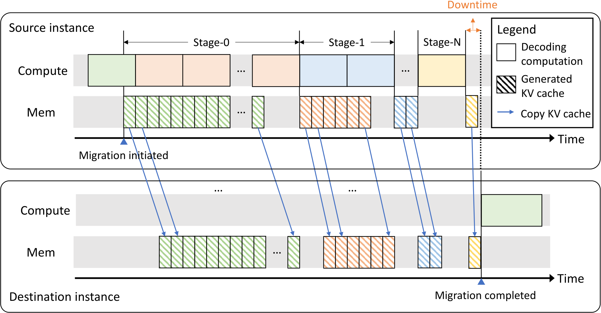

# 06｜集群调度、Serving 并行与 Overlap

上一篇把 prefill 与 decode 拆成了两个独立的资源池，这一篇进一步讨论一条请求在集群层面会经过哪些调度层次，以及 serving 场景下各种并行与 overlap 手段如何组合。阅读这一篇前，需要先了解 [`02`](./02_batching_and_chunked_prefill.md) 里的 engine scheduler 和 [`05`](./05_disaggregation_and_kv_transfer.md) 里的 P/D data path；TP/PP/DP/CP/EP 这些并行方式在训练侧的算子与 collective 细节见[并行策略总览](../parallel/README.md)，这一篇只关注它们在 serving 场景下，张量 shape、状态管理和调度逻辑会发生哪些变化。

一条生产环境的请求，实际上同时被四层调度器共同决定：router 负责选 replica，engine 负责选这一轮要处理哪些请求和 token，distributed runtime 负责选并行方式和 collective，GPU runtime 负责选 stream 和 kernel。局部意义上的“异步”，只有在依赖关系正确、资源真的能并行执行，而且没有隐藏的同步点时，才会真正转化成端到端可见的 overlap 收益。

---

## 1. 四层调度

这四层调度各自的职责边界大致是这样划分的：

```text
global / model gateway
  ├─ model/LoRA/tenant routing, quota, admission
  ├─ replica/P-D/encoder/denoiser pool selection
  └─ autoscaling, drain, failover, cache affinity
        │
engine scheduler
  ├─ waiting/running queues, token budget, chunk/preemption
  ├─ KV/encoder/cache allocation
  └─ build one forward batch
        │
distributed runtime
  ├─ TP/PP/DP/EP/CP process groups
  ├─ collective/P2P launch and microbatch
  └─ dummy/idle rank synchronization
        │
GPU executor
  ├─ H2D / model / sampling / D2H streams
  ├─ CUDA Graph / torch.compile / fused kernels
  └─ kernel-level compute-memory-network overlap
```

举例来说，LPM 是 engine 层面的 cache-aware 策略；“路由到 KV 最多的那个 replica”是 router 层面的策略；DP attention 是 distributed runtime 层面的布局选择；TBO 则是 executor 内部的 microbatch 调度。这些机制彼此可以组合使用，但它们最终共享的是同一份 SLO 目标和同一套资源账本，一层的决策会影响其他层能用到的资源。

---

## 2. Replica router

LLM 请求之间的工作量差异，比普通的 stateless RPC 大得多。一条只有 64 个 token 的简单问答，和一条 128K prompt、8K output 的长请求，如果都只被记成“一个 request”，用最简单的 least-request 路由策略就会严重失衡。

### 2.1 常见 score

| router policy | 看到什么 | 优点 | 盲点 |
|---|---|---|---|
| round robin | worker 数 | 无状态、稳定 | 完全不看 work/KV |
| least requests | waiting + running count | 比 RR 好 | 长度/phase 不同 |
| least tokens | queued prefill + live KV/output estimate | 更接近实际 work | output 预测与 stale metrics |
| cache-aware | matched prefix / session affinity | 少算 prefill | 热点、queue 与 remote load |
| power-of-two choices | 随机两节点中选较轻 | 低 metadata 开销 | score 仍要合理 |
| deadline/cost-aware | queue + service + transfer estimate | 直接优化 SLO | profile/预测复杂 |

对请求 `i` 路由到 replica `r` 这件事，可以用下面这样的近似打分：

$$
score(i,r)=\widehat T_{queue,r}+\widehat T_{prefill/load,i,r}
+\widehat T_{decode,i,r}+penalty_{SLO,tenant,topology}.
$$

output 长度未知时，可以先用同一个 route/model/user bucket 里历史请求的分位数来估计，再用实时观测到的 live token 数和每步耗时去做校正。无论估计得多准，都必须留有 hard capacity 和 admission 这道保底防线，不能让预测误差直接导致 OOM。

### 2.2 Session stickiness 的适用边界

多轮对话如果每次都路由回原来的 replica，可以命中完整的历史 KV；但如果原节点这时候 p99 queue 已经很高，去远端节点做 KV transfer 或者干脆重算，反而可能更快。正确的做法是把这几种选择放在一起比较：

```text
sticky queue + local hit
vs empty replica queue + remote KV transfer
vs empty replica queue + recompute
```

并且要设置一定的 hysteresis，避免同一个 session 在两个节点之间来回跳动，每一轮都换一个目的地。

---

## 3. Serving 下的并行维度

### 3.1 Tensor Parallel（TP）

TP 把每一层的权重和 head 切分到多个 GPU 上，让单个 replica 的模型和 KV 分摊到多张卡；代价是每一层都要做一次 all-reduce、reduce-scatter 或者 all-gather。它比较适合下面这几种情况：

- 模型本身单卡放不下；
- 低负载场景下，单条请求需要更多的 FLOPS 或带宽来压低 TTFT；
- 处于同一个 NVLink/NVSwitch 域内，能支撑高频率的 collective 通信。

TP 切得太大之后，每个 rank 分到的 GEMM 会变得很窄，collective 本身的固定延迟占比会升高，这一点在 decode 阶段小 batch 的情况下尤其明显。跨节点做大规模 TP 往往还不如“机内 TP 配合节点间 PP/DP”的组合。P/D 分离架构下可以让 P 用更大的 TP、D 用更小的 TP 加更多 replica，但这需要用到第 `05` 篇讲过的 KV reshard 机制。

### 3.2 Pipeline Parallel（PP）

PP 按层切成多个 stage，只在 stage 边界传递 activation，适合模型需要跨多个节点部署、而网络条件又不适合每层都做 TP collective 的场景。在 serving 场景下的难点在于，每一轮迭代的工作量都在变化：prefill chunk 的大小、decode batch 的大小，以及某些 stage 空闲无事可做，都会造成 pipeline bubble。

```text
microbatch 0: S0 compute -> S1 compute -> S2 compute
microbatch 1:      S0 compute -> S1 compute -> S2 compute
```

要解决这个问题，需要把 batch 或 chunk 切成多个 microbatch，再配合 nonblocking 的 P2P 通信来填满流水线。SGLang 的 PP event loop 会把 `async_send` 的 wait 操作延后，用 `forward_stream` 和 `copy_stream` 分开管理，同时让 CPU 处理前一个 microbatch 的结果，设计细节见 [[sglang:docs/advanced_features/pipeline_parallelism.md#L9-L18]]。它的 dynamic chunk 机制会让后期历史更长的请求使用更小的 token chunk，从而让各个 stage 花费的时间更均匀。

### 3.3 Data Parallel（DP）

对 dense 模型来说，DP 就是部署多份完整的 replica，各自维护独立的 KV，由 router 分流请求，是最容易水平扩展的方式。代价是权重被复制了多份，以及不同 replica 之间的 cache 变得碎片化；用 cache-aware 的 router 或者共享的 L3 cache 可以缓解这个问题。

在 MoE serving 场景里，多个 DP rank 可能同时组成一个 EP group：即便某个 rank 当前没有请求要处理，也可能必须执行一次 idle 或 dummy 的 forward 来参与 collective，否则会导致其他 rank 死锁。vLLM 为 DP>1 的场景提供了专门的 coordinator；文档里明确说明 MoE 场景下各 rank 需要同步判断是否全局都处于 idle 状态，见 [[vllm:docs/serving/data_parallel_deployment.md#L11-L15]]。

### 3.4 Expert Parallel（EP）与 DP Attention

EP 把不同的 expert 分配到不同的 rank 上，token 按照 router 打分的结果做 all-to-all dispatch，再在本地做 grouped GEMM，最后 combine 回来。attention 和 KV 并不需要按照同样的维度做复制：以 DeepSeek MLA 为例，可以让每个 DP attention rank 独立处理不同的请求和 KV，而 experts 则跨 DP × TP 组成一个更大的 EP group。

这样设计带来的好处是：

- attention 的 KV 不需要在所有 TP rank 上重复存一份，容量和有效 batch 都能提升；
- expert 的权重被分片存放，可以支撑规模非常大的 MoE 模型；
- decode 阶段可以走 DeepEP 的 low-latency path，prefill 阶段则走 high-throughput path。

代价是不同的 DP rank 可能一个在跑长 prefill、另一个在跑 decode 甚至处于 idle 状态，而 MoE 里的 collective 通信要等最慢的那个 rank。SGLang 提供了 prefill delayer、cadence 控制、P/D 分离，以及全局 batch metadata 同步这几种手段来缓解这个问题；DP attention 的整体设计见 [[sglang:docs/basic_usage/deepseek_v3.md#L125-L147]]。

Expert 负载的偏斜会让少数几个 rank 的 GEMM 和通信成为整体的 tail；EPLB 会根据观测到的热度重新放置或者复制 expert 来缓解这个问题。训练侧的原理和代码可以参考[《系统侧负载均衡：EPLB、LPLB、UltraEP 与 MoonEP》](../parallel/05_ep/04_system_load_balancing.md)。Serving 场景下还需要限制 rebalance 过程中权重搬运和 graph 失效的频率，不能为了追逐瞬时的负载噪声而频繁触发。

### 3.5 Context Parallel（CP）

超长的 prefill 可以按 sequence 维度对 attention 做切分，常见的做法是 ring 式的 KV 传递，或者 Ulysses 风格的 all-to-all；这样可以降低每个 rank 需要保存的 activation/KV 量，并且把随 `S²` 增长的 attention 计算并行化。而 decode 阶段每次只有很少的 query token，如果 context 也按 rank 切分，就需要跨 rank 归并各自算出的 partial attention state，这部分固定的通信开销未必划算。

正因为如此，现代系统通常会分别配置 prefill 阶段的 CP（PCP）和 decode 阶段的 CP（DCP），但这样一来，page 或 hash 的粒度，以及 KV transfer 的 layout 也要随之调整。多种 hybrid cache group 和 CP 之间也并不总是兼容的，必须以具体 backend 和 cache spec 的检查结果为准，不能想当然地组合。

### 3.6 选择表

| 约束 | 常见首选 |
|---|---|
| 单卡放得下，追 online throughput | 多 DP replica + 小/无 TP |
| 单卡放不下、单机 NVLink | 机内 TP |
| 跨节点模型太大 | 机内 TP × 节点间 PP |
| 超长 prefill TTFT | TP/PP + PCP，配 dynamic chunk |
| 超大 MoE | DP attention + EP，EPLB/DeepEP |
| P/D workload 差异大 | P/D 分别搜索并行，不强制同 TP |

这张表只是经验起点，并不存在脱离具体 workload 的“最佳 TP”这种通用答案。必须用目标场景的 `S/O` 分布、batch 情况和网络条件，去实测 TTFT/TPOT/goodput，才能确定真正合适的配置。

---

## 4. Overlap 的统一判据

把两个操作 `A,B` 都改成异步执行，并不代表它们就会真正重叠。要让 overlap 真正生效，需要同时满足下面几个条件：

1. **依赖关系允许**：B 不能读取 A 还没算完的数据；需要用 event 在真正的 consumer 之前去 wait，而不是提前假设已经完成。
2. **硬件资源允许**：copy engine、NIC、SM、HBM 这些资源，以及不同的 CUDA stream/queue，要真的能并行工作。
3. **资源类型互补**：compute-bound 的 GEMM 和 network/memory 类的操作更容易重叠出收益；如果两者都在争用同一种资源（比如都占满了 SM 或者 HBM），反而会互相拖慢。
4. **工作粒度足够粗**：异步提交、event、线程切换本身也有固定开销，这部分开销必须小于被隐藏掉的那段时间，否则得不偿失。
5. **没有隐藏的同步点**：`.item()`、默认 stream 上的隐式依赖、pageable memory 的 copy、allocator 的 free 操作、NCCL 的 host wait，这些都可能在不知不觉中把本该并行的操作重新串行化。

理想情况下总耗时应该是 $\max(T_A, T_B)$，但真实耗时其实是：

$$
T_{overlap}=\max(T'_A,T'_B)+T_{launch/sync},
$$

这里的 $T'_A, T'_B$ 已经包含了资源竞争带来的额外减速。NanoFlow 的核心思路也是把 batch 进一步细分之后，只重叠那些在 compute、memory、network 三种资源上瓶颈确实不同的 nano-op，而不是无条件地把所有操作都并发起来（[arXiv:2408.12757](https://arxiv.org/abs/2408.12757)）。

---

## 5. CPU scheduler 与 GPU forward 的 overlap

如果用同步的 event loop，流程是这样的：

```text
CPU schedule N | GPU forward N | CPU process N | CPU schedule N+1 | GPU forward N+1
```

而用双缓冲的方式，可以让 CPU 和 GPU 的工作错开一轮：

```text
GPU:        forward N ---------------- forward N+1 ----------------
CPU:             process N-1 + schedule N+1   process N + schedule N+2
copy/sample:                    D2H/sample N ----------------------
```

SGLang 的 `event_loop_overlap` 实现在 [[sglang:python/sglang/srt/managers/scheduler.py#L1448-L1504]]，大致流程是：

1. 接收新请求，并准备好下一个 batch；
2. 启动当前 batch 的计算，把 `(batch.copy(), future/result)` 放进 `result_queue`；
3. GPU 运行当前 batch 的这段时间里，CPU 处理上一个 batch 的结果；
4. 当前 batch 的 sampling 仍然需要等前一个结果处理完之后才能启动，因为两者存在依赖。

它维护了两份 batch 记录（[[sglang:python/sglang/srt/managers/scheduler.py#L1191-L1205]]），并设置了 WAR barrier，避免 CPU 在下一轮里改写了 GPU 还在读取的共享 metadata。连续两次 prefill 时可以选择关掉 overlap，以优先保证首个 TTFT（`:1506-1537`），这说明为了提升 throughput 而做的 overlap 也可能反过来影响 latency 和公平性，不是纯收益的操作。

vLLM 当前在配置兼容的情况下会自动启用 async scheduling：scheduler 会用一个占位的 in-flight output 让下一轮先发射出去，等真正的 token 结果回来之后再补上完整状态，入口在 [[vllm:vllm/v1/core/sched/async_scheduler.py#L12-L75]]。这要求 preemption、stop、structured output 以及 PP 的 cadence 都能正确处理“CPU 侧看到的状态比 GPU 落后一轮”这个事实；遇到不兼容的 executor 或配置时，会在 [[vllm:vllm/config/vllm.py#L934-L1008]] 里直接禁用或者报错，而不是悄悄出错。

---

## 6. CUDA Graph、compile 与 persistent buffers

Decode 阶段每一层都有大量的小 kernel，CPU 侧的 launch gap 可能占据 TPOT 中相当大的一部分。CUDA Graph 会把固定的一串 kernel 及其依赖关系捕获下来，之后 replay 一次提交即可；torch.compile 则是做 graph 层面的 lowering 和 fusion。这两者的作用都是减少 host 侧的调度开销，并不是直接增加算力。

动态的 serving 场景和这套机制之间存在几处天然的冲突：

- batch、request、token 的 shape 每一轮都在变化；
- block table、slot mapping 的具体内容也在变；
- 不同的 attention backend 对 mixed prefill/decode 的支持程度不同；
- LoRA、EP、multimodal encoder 以及 external KV 都可能引入动态的控制流。

常见的解法是预先捕获若干个 batch bucket，把真实的 batch pad 到最近的一个 bucket 大小，再把 metadata 写进地址稳定不变的 persistent buffer 里。padding 得太多会浪费 GPU 算力，所以 capture 的 size 应该尽量匹配线上实际的请求分布。

vLLM 区分了 `FULL`、`PIECEWISE`、`FULL_DECODE_ONLY`、`FULL_AND_PIECEWISE` 这几种模式，会按 attention backend 支持的最低能力自动降级；设计细节见 [[vllm:docs/design/cuda_graphs.md#L125-L195]]。SGLang 同时有 decode graph 和 piecewise 的 prefill graph；相关的 server 参数见 [[sglang:docs/advanced_features/server_arguments.md#L411-L441]]。

在 graph capture 之前的 warmup、JIT 编译和 allocator 状态都必须先稳定下来；不应该让第一个到达的真实请求去承担编译或者 capture 的开销。用到多个 stream 的 kernel，必须在 capture 的 graph 里显式做好 fork/join，否则 graph replay 的时候可能会读到还没算完的数据。

---

## 7. 通信与计算的 overlap

### 7.1 TP / PP

TP 的 row/column parallel 可以把某些 collective 和后续独立的计算切成 chunk 做流水，但普通 decoder 层内部的依赖是很紧的：attention 或 MLP 的输出往往要先做完 reduce，下一个算子才能用上它。如果切得太碎，反而会降低 GEMM 本身的效率。PP 天然就有跨 microbatch 的并行空间，关键在于用好 nonblocking 的 send/recv，并且让各个 microbatch 的大小尽量均匀。

一种正确性有保证的模式是这样组织 stream 依赖的：

```text
producer stream: compute -> record(event_ready)
comm stream:     wait(event_ready) -> collective/P2P -> record(event_done)
consumer stream: wait(event_done) -> consume
```

`CUDA_DEVICE_MAX_CONNECTIONS=1` 在部分 NCCL/Megatron 的调度里，用来约束硬件队列的发射顺序，但它并不是所有 serving backend 通用的万能开关；TBO/SBO 这类机制往往反而需要多个真正独立的 queue 才能发挥作用。具体该怎么设置，应该参照对应框架的文档，并用 Nsight trace 去验证，而不是直接照搬训练环境下用惯的环境变量。

### 7.2 P/D / cache load

第 `05` 篇讲的 layerwise load/store，本质上是同一种模式：transfer stream 提前去搬第 `l+1` 层的数据，attention 真正要进入这一层之前才去 wait 它完成。如果在所有层开始之前就先统一 `wait_for_save/load`，那么接口虽然形式上是异步的，但 critical path 实际上仍然是串行的，没有真正获得 overlap 的收益。

---

## 8. MoE：TBO、SBO 与 DBO

MoE 层天然分成几个阶段：

```text
attention -> gate -> dispatch(A2A) -> expert GEMM -> combine(A2A) -> shared/down
```

通信和 GEMM 之间存在明显的空洞，现代 serving 系统的做法是把 batch 切成两份，让它们交错执行。

### 8.1 SGLang Two-Batch Overlap（TBO）

SGLang 会尽量按 token 数把两个 microbatch 分得均匀；decode 阶段通常直接按 request 数对半分，而变长的 prefill 则按 `extend_lens` 的总和去找一个平衡点，见 [[sglang:python/sglang/srt/batch_overlap/two_batch_overlap.py#L62-L149]]。

模型的 forward 过程被拆成一系列带 `YieldOperation` 的 stage，executor 先推进 A 的若干个 stage，再让 A、B 轮流调用 `next()`：

```python
for stage in warmup_A:
    A.next()
for stage in overlap_region:
    A.next()   # A compute while B comm, or reverse
    B.next()
for stage in drain_B:
    B.next()
```

真实代码在 [[sglang:python/sglang/srt/batch_overlap/operations.py#L36-L78,L100-183]]；每个 child 都使用各自独立的 attention metadata 和 context。所有 DP rank 必须一致地决定是否要启用 TBO，否则各 rank 的 EP collective 顺序会不一致，进而导致死锁（[[sglang:python/sglang/srt/batch_overlap/two_batch_overlap.py#L372-L447]]）。

### 8.2 Single-Batch Overlap（SBO）

SBO 不把请求拆成两个 batch，而是在同一个 batch 内部，用 dispatcher hook 或者 alternate stream，让 shared expert 或者 down GEMM 的计算和 combine 通信重叠起来。SGLang 会根据 backend、是否是 Blackwell 架构，以及可用的 SM 数量来切分 communication 和 compute 各自能用的资源，`CombineOverlapArgs` 里包含 stream、event、signal、num_sms 这几个字段，见 [[sglang:python/sglang/srt/batch_overlap/single_batch_overlap.py#L28-L143]]。

### 8.3 vLLM Dual Batch Overlap（DBO）

vLLM 的 DBO 针对的是 DP+EP 的组合场景，把 batch 一分为二，分别在两个 worker thread/stream 上运行；`FusedMoEModularKernel` 里设置的 yield 点，让其中一个 microbatch 在等待 dispatch/combine 完成的这段时间里，切换过去让另一个 microbatch 做计算。调度示意图和限制条件见 [[vllm:docs/design/dbo.md#L1-L88]]，核心的 `dbo_yield/recv_hook` 实现在 [[vllm:vllm/v1/worker/ubatching.py#L150-L193]]。

在当前 pin 住的版本下，DBO 需要适配对应的 all-to-all backend、full CUDA Graph，并且要求各 DP rank 保持一致；当 batch 小到低于 decode/prefill 的 token 阈值时，就不再拆分，避免额外的线程切换和小 GEMM 开销反而拖慢整体速度。

### 8.4 Overlap 失败的常见表现

- 两个 microbatch 同时都在跑 GEMM，SM 资源争用反而让总耗时变长；
- A2A 通信本身也大量占用 SM/HBM，和 expert kernel 相互干扰；
- 两个 microbatch 切分得不均匀，一半是长 prefill、一半是短 decode，pipeline 的 drain 阶段占了大部分时间。

排查这些问题必须用完整的 timeline 同时看 kernel duration、SM active、HBM 占用、NIC 流量和 collective 情况，而不能只看到两个 stream 上都画出了彩色的执行条，就以为 overlap 一定成功了。

---

## 9. Request migration：跨 replica 的动态重调度

初始路由的时候没法预测出 output 长度，运行一段时间之后就会出现一台机器 KV 已经满了或者请求被大量抢占，而另一台机器却有空闲容量的情况。把请求迁移到别的 replica 上可以用来做负载均衡、消除碎片、隔离优先级，以及支持 instance 的优雅下线，但代价是要把持续增长中的 KV 一起搬走。

Llumnix 利用了 KV append-only（只会追加、不会修改）这个特性：先在 source 继续做 decode 的同时，把已有的 KV block 拷贝过去，后续的每个 stage 只需要追加新增的部分，最后只需要短暂停顿一下，搬完最后一小段 delta 就可以把 owner 切换过去。



> 图：多 stage 复制已生成 KV，source 计算与 copy 重叠；每轮 dirty set 只是新 append 的 blocks，最终 downtime 近似最后小 delta（Sun et al. 2024, Fig. 6；[arXiv:2406.03243](https://arxiv.org/abs/2406.03243)）。

和虚拟机的 live migration 不同，这里旧的 KV 内容永远不会被修改，因此不需要做 dirty-page 追踪。仍然需要处理的是：目标端要提前预留资源、每个 stage 完成后要有 ack 确认、client 侧看到的 token 流不能因此断序、source 或 destination 任一侧失败时要能 abort、最后 owner 的切换必须是原子的一次性操作。迁移得太频繁会额外消耗网络带宽，也会破坏原本积累起来的 prefix locality，所以 scheduler 应该设置一个收益阈值，并加上 hysteresis 来避免抖动。

---

## 10. Overload、priority 与 admission

当资源不够用的时候，“让所有请求都排队”其实并不是一个中立的选择：那些注定无法在 SLO 内完成的请求，如果还继续占着 GPU 做 prefill，实际上是在消耗本可以用来服务别的请求的资源。

### 10.1 Early rejection

Mooncake 指出，简单地等“D 侧真的满了才拒绝新请求”往往已经太晚：请求在 P 侧排队和计算的这段时间里，D 侧的负载状况还会继续变化。更好的做法是在真正开始 prefill 之前，就先预测出：

```text
P completion time
+ future D available slot / KV capacity
+ expected decode residence
+ deadline slack
```

如果预测出这条请求根本无法按时完成，就应该直接返回 HTTP 429 或者明确的 overload 响应，而不是等做到一半才把它丢弃，浪费掉已经花出去的算力。这个预测本身应该偏保守，并且要考虑预测本身的校准误差；被错误拒绝的请求同样要计入 availability 和 SLO 的统计报表里，不能视而不见。

### 10.2 Priority 字段的语义

给请求设置更高的优先级，实际上可以带来这几种效果：

- 在 waiting queue 里被提前调度；
- 抢占正在运行的低优先级请求；
- 单独保留一部分 KV/token budget，或者干脆用专门的 replica 服务；
- 把可能造成干扰的其他请求主动迁走；
- 使用更严格的 deadline 或者更激进的 autoscale 目标。

但不管用哪种方式，都必须配上 aging 机制、tenant quota、最大抢占次数的限制，以及对低优先级请求的最低服务份额保证，否则高优先级请求就可能长期把低优先级请求完全饿死。vLLM 的 priority queue 按 `(priority, arrival_time)` 排序，内存不够的时候会抢占优先级最低、到达时间最晚的请求：[[vllm:vllm/v1/core/sched/request_queue.py#L131-L198]]、[[vllm:vllm/v1/core/sched/scheduler.py#L535-L565]]。SGLang 则设置了 priority preemption 的阈值，避免因为极其微小的优先级差异就频繁触发抢占，造成不必要的 thrash。

---

## 11. 用 trace 验证 overlap 的收益

建议按下面这样的层次去打 NVTX 标记：

```text
request: frontend / queue / prefill / xfer / decode
iteration: schedule / metadata-H2D / model / sample / result-D2H
layer: attn / TP comm / gate / dispatch / expert / combine
cache: lookup / L3-L2 / L2-L1 / wait / fallback
```

对每一个准备做 overlap 的候选操作，应该依次回答这几个问题：

1. 原本串行执行时留下的这段空隙有多大，占 TTFT 或 TPOT 的比例是多少？
2. 这两个操作各自真正的瓶颈资源是什么？
3. 并行执行之后，各自的减速程度分别是多少，总的 critical path 又变成了多长？
4. p99 是不是因为资源竞争反而变差了？
5. 这样做需要额外多少 buffer 或者 HBM 空间？
6. 请求被取消、抢占或者失败的时候，相关的 event 和 buffer 该怎么正确回收？

### 常见调优顺序

1. 先消除 CPU 侧 launch 和同步造成的空洞（用 persistent buffer、CUDA Graph、scheduler overlap 这几种手段）；
2. 再优化 batch、token、chunk 的大小，让每个 kernel 的工作量足够大；
3. 再去做 TP/PP/EP 通信与计算之间的 overlap；
4. 最后再用 TBO/SBO/DBO 细分资源，注意不要让切出来的小 batch 反而拖慢了主 GEMM 的效率；
5. 全程都用 goodput 和 p99 指标去验证效果，而不是只看设备利用率这一个数字。

多模态场景下会遇到不同形态的 batch 问题：理解任务多出了异构的 encoder 和长度不固定的 media token，而图像、视频生成任务则整个变成了迭代式的 denoiser 计算。这些差异需要不同的 batch 策略、cache 设计、disaggregation 方式和指标体系，留给下一篇：[07｜多模态 Serving：理解、生成与流式 Omni](./07_multimodal_serving.md)。

---

## 参考

- Zhu et al., *NanoFlow: Towards Optimal Large Language Model Serving Throughput*（[arXiv:2408.12757](https://arxiv.org/abs/2408.12757)）。
- Sun et al., *Llumnix: Dynamic Scheduling for Large Language Model Serving*, OSDI 2024（[arXiv:2406.03243](https://arxiv.org/abs/2406.03243)）。
- SGLang EP/PP docs：[[sglang:docs/advanced_features/expert_parallelism.md]]、`pipeline_parallelism.md`。
- vLLM DBO/CUDA Graph docs：[[vllm:docs/design/dbo.md]]、`cuda_graphs.md`。
- 训练侧通信/overlap 底座：[《TP/SP 的通信-计算 overlap 与工程优化》](../parallel/02_tp_sp/04_overlap_and_optimizations.md)、[《Expert Parallelism（EP）：Infra 视角深入》](../parallel/05_ep/README.md)。
