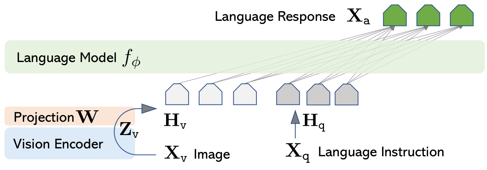
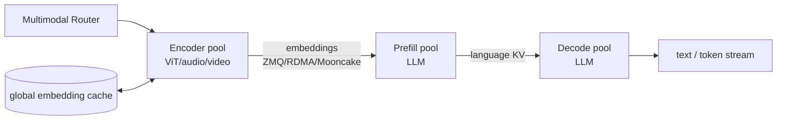
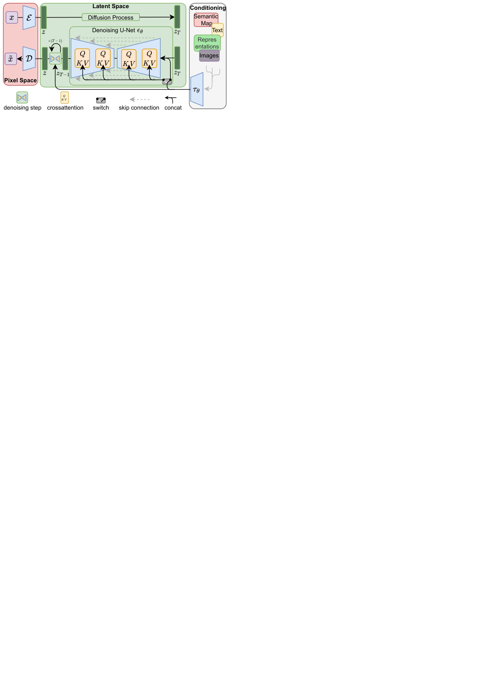
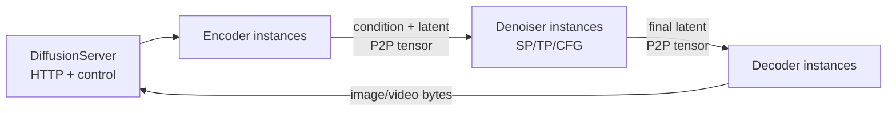

# 07｜多模态 Serving：理解、生成与流式 Omni

前几篇已经把文本 serving 的 prefill/decode、KV 与 P/D 讲完了（见 [`01`](./01_inference_and_metrics.md) 到 [`06`](./06_scheduling_parallelism_and_overlap.md)），这一篇把同一套思路推广到多模态场景。如果对多模态算法本身的基础不熟悉，可以按需查阅[《多模态：架构视角》](../multimodal/README.md)：encoder 和 token 数的关系在第 02 篇，fusion 在第 04 篇，diffusion/DiT 在第 05 篇，异构解耦在第 06 篇；这一篇会假设你已经了解这些概念，重点放在 serving 侧的系统设计上。

“多模态 serving”这个说法其实涵盖了至少三类完全不同的系统：

1. **理解型 VLM/omni LLM**：图像/音频/video encoder 处理输入 → LLM prefill → autoregressive decode；
2. **生成型 image/video/audio model**：text/media encoder 编码条件 → 多步 DiT/U-Net denoiser 迭代去噪 → VAE/vocoder decoder 还原；
3. **实时 any-to-any**：持续接收音视频输入，同时流式产生 text/audio/video，多个 stage 之间形成带 backpressure 的长连接。

第一类系统天然继承了 paged KV 和 continuous batching 这些机制；第二类通常没有可以增量复用的 autoregressive KV。如果把这些完全不同的方案都笼统地叫作“encoder cache”或者“decode”，很容易在架构设计上张冠李戴，把只适用于一类系统的思路错误地套到另一类上去。

---

## 1. 理解型 VLM 的请求关键路径



> 图：LLaVA 先用 CLIP vision encoder 得到视觉 feature，经 projector 对齐 LLM hidden width，再与文本 embedding 拼接送入 Vicuna（Liu et al. 2023, Fig. 1；[arXiv:2304.08485](https://arxiv.org/abs/2304.08485)）。现代 VLM 用的 encoder 和 connector 各不相同，但 serving 阶段的边界是相同的。

```text
HTTP body / URL / base64
  -> download + decode + resize/resample + normalize       CPU / media IO
  -> tokenizer + placeholder plan
  -> ViT / audio / video encoder                           GPU compute
  -> projector/resampler -> modality embeddings
  -> scatter into LLM input embedding sequence
  -> LLM prefill: write language KV                         GPU compute+HBM
  -> LLM decode: stream text/tool/audio-code tokens         HBM/latency
```

用户端观察到的 TTFT 包含了以上所有前置阶段的耗时：

$$
TTFT=T_{media}+T_{queue,E}+T_E+T_{embedding-xfer}
+T_{queue,P}+T_P+T_{first-stream}.
$$

如果只 profile LLM 的 prefill 阶段，会漏掉 URL 下载、JPEG/video decode 以及 ViT 计算这几段耗时；反过来只报告“image/s”这个数字，又完全看不到 LLM 侧的 queue 情况。至少应该分别记录：media fetch/decode 耗时、encoder queue/compute 耗时、embedding transfer 耗时、LLM queue/prefill 耗时，以及文本部分的 TPOT。

---

## 2. 变长 media token 的约束

固定分辨率 ViT 产生的 patch token 数大致是：

$$
N_{img}=\frac{H}{p}\frac{W}{p}\quad(+\text{special/resampler tokens}),
$$

视频再乘以采样帧数或者 temporal tubelet 的数量，音频则随时长和 stride 增长。动态分辨率、tiling、AnyRes 这些技术，会让同样“一张图”对应的 token 数从几十到几千不等；这意味着请求数本身不能作为衡量负载的单位。

这个变长的特性会同时影响到：

- CPU 侧的解码工作量和 host memory 占用；
- encoder 的 FLOPs 以及 padding 造成的浪费；
- projector/embedding 张量占用的字节数；
- LLM prefill 阶段的 sequence 长度 `S=text+media placeholders`；
- language KV 的容量需求和请求能驻留多久；
- CUDA Graph 的 bucket 划分，以及 P/D/EPD 各池的配比。

### 2.1 Encoder batching

如果简单地把不同分辨率的输入都 pad 到 batch 里最大的那个尺寸，一张特别大的图就会拖累 batch 里所有其他图的处理速度。常见的应对策略包括：

- 按 modality、resolution/frame/audio-length 分桶处理；
- patchify 之后组织成 packed sequence，配合 `cu_seqlens` 做支持变长的 vision attention；
- 限制每个 prompt 里 media item 的数量，以及总的 pixels/frames/tokens 上限；
- 用 CPU 线程池提前做好 decode 和 pin memory，GPU 只接收已经标准化好的 tensor；
- 同一个请求里的多张图可以并行 encode，但 LLM 的 prefill 必须等所有需要的 embedding 都准备好；
- 对等待中的 media，优先按**预计的 encoder token 数或 FLOPs**排序，而不是按请求数排序。

具体的 token 数公式、NaViT/Qwen 的动态分辨率方案以及 packed attention 的实现，见[《Encoder：从像素、音频到 token》](../multimodal/02_encoders.md)与[《变长输入与负载均衡》](../multimodal/07_variable_length_load_balancing.md)。

---

## 3. Encoder compute budget 与 embedding cache

VLM 里实际上存在两种不同的 cache：

```text
encoder cache: raw image/audio -> modality embeddings       # 避免重跑ViT
language KV:   [text + modality embeddings] prefix -> KV    # 避免重跑LLM prefill
```

前者的 value shape 通常是 `[N_media_tokens,D_llm]`，后者则要按所有 LLM layer 分别保存 K/V；两者的 key、容量估算方式和失效规则都不一样，不能混为一谈。

### 3.1 vLLM scheduler 的双预算

vLLM 的 `EncoderCacheManager` 按照 multimodal item 的 `identifier/mm_hash` 在不同请求之间共享 encoder 的输出，并维护了这几项状态：

- encoder compute budget：本轮允许执行多少 embedding 计算；
- encoder cache budget：GPU 上能存多少 encoder embeddings；
- `cached[mm_hash] -> referencing request ids`：记录当前谁在引用这份 embedding；
- 一份没有引用的 entry 会进入 FIFO/oldest-first 的回收队列。

具体实现和状态维护见 [[vllm:vllm/v1/core/encoder_cache_manager.py#L17-L79]]；`can_allocate` 会先检查 compute budget，再检查 free/reclaimable 的 slot 是否够用（`:123-182`）。scheduler 只有在本轮的 token window 里真正碰到某个 media item 时才会调用 encoder；命中 cache 就直接跳过计算，如果预算不够，就把 token range 截到这个 item 之前，或者把整条请求暂缓处理：[[vllm:vllm/v1/core/sched/scheduler.py#L1300-L1438]]。

这样设计能防止一个很大的 video encoder input 把本轮的 token/KV batch 全部挤占掉，但也要求 chunk 的边界必须尊重完整的 media item，不能把一个 item 切到两个 chunk 里去。双向的 ViT attention 通常不能像 causal LLM 那样，随意把一张图切成互不相关的独立 prefix chunk；只有当模型或 encoder 原生支持 patch partition 的时候，才可以对它做分片处理。

### 3.2 Worker data path

`EncoderRunner.prepare_mm_inputs` 会按 modality 和 shape 做分组与 batching，`execute_mm_encoder` 调用 `model.embed_multimodal`，算出来的结果按 mm hash 写入 GPU cache：

- 具体实现见 [[vllm:vllm/v1/worker/gpu/mm/encoder_runner.py#L34-L61]]；
- [[sglang:python/sglang/multimodal_gen/runtime/model_states/default.py#L78-L105]] 执行 encoder、缓存结果，并把 embedding scatter 进 input embeddings；
- gather 操作只处理当前 prefill window 与 media placeholder 交叉的那部分 slice（[[vllm:vllm/v1/worker/gpu/mm/encoder_runner.py#L63-L142]]）。

### 3.3 Hash 的覆盖范围

相同的 placeholder token 并不代表是相同的图片内容。vLLM 的 `MultiModalHasher` 会序列化原始的 bytes/PIL mode+pixels/tensor dtype+shape 等信息，用 BLAKE3/SHA 算法生成 identifier（[[vllm:vllm/multimodal/hasher.py#L22-L160]]）；language prefix 的 block hash 还会额外加入 `(mm_hash, block-relative offset)` 这个组合，避免同一张图出现在不同位置时被错误地判定为命中（[[vllm:vllm/v1/core/kv_cache_utils.py#L431-L495]]）。

生产环境里的 key 还应该带上 namespace：模型、vision tower/projector 的版本、processor 的 resize/crop 配置、dtype 以及 tenant。encoder 或 projector 权重一旦更新，就必须清空对应的 embedding cache；vLLM 的 GPU cache reset 说明见 [[vllm:vllm/v1/worker/gpu/mm/encoder_cache.py#L31-L40]]。

### 3.4 Precomputed embedding 的接口与信任边界

client 可以直接上传已经算好的 embedding，跳过 media 下载和 encoder 计算，但 server 必须验证它的 shape、dtype、token count、model revision，以及大小限制。如果把任意上传的 tensor 当作可信数据直接使用，可能造成 OOM、cache poisoning，或者错误的 scatter 写入；跨租户场景下，也不应该仅仅因为用户提供了相同的 hash 就允许共享这份 embedding。

---

## 4. E/P/D 解耦



Encoder、prefill、decode 三者的资源画像并不相同：E 是一次性、计算密集型的工作，主要受 pixel 数量影响；P 受总 token 数和 attention 计算量影响；D 受 KV 大小和输出长度影响。EPD 架构允许这三个池各自独立配置 TP/DP 并单独 autoscale，避免一张很大的图片或视频挤占纯文本请求或者小图请求的资源。

### 4.1 SGLang EPD 实现

SGLang 支持 `--encoder-only`、`--language-only --encoder-urls ...` 这两种角色，再和 P/D 的角色组合使用；文档见 [[sglang:docs/advanced_features/epd_disaggregation.md]]。具体代码入口包括：

- `MMEncoder`：[[sglang:python/sglang/srt/disaggregation/encode_server.py#L220]]；
- encoder 的 scheduler/profile 逻辑：同一文件的 `:2097` 之后；
- Mooncake embedding transfer：`encode_with_mooncake`（`:1791`）；
- Mooncake global embedding cache：`encode_with_global_cache_mooncake`（`:1014`）；
- P 侧的 receiver/预分配逻辑：[[sglang:python/sglang/srt/disaggregation/encode_receiver.py]]。

这里要区分两个正交的开关：`--encoder-transfer-backend mooncake` 只决定**这次的 embedding 怎么从 E 传到 P**；`--enable-mm-global-cache` 决定**是否要跨请求或跨 instance 去查询和存储 embedding**。命中 global cache 之后就不需要再运行 ViT 了，但仍然要把这份 embedding materialize 到 P 侧可以消费的位置。

### 4.2 vLLM ECConnector

vLLM 把 embedding/encoder-cache 的 transfer 从 language 的 KVConnector 里分离出来，`ECConnectorBase` 提供了这样一组接口：

```text
scheduler: has_cache_item -> allocate/update -> build metadata
worker:    start_load_caches / save_caches / get_finished
```

见 [[vllm:vllm/distributed/ec_transfer/ec_connector/base.py#L59-L254]]。如果 scheduler 发现远端的 item 还在传输中，会直接推迟这条请求（[[vllm:vllm/v1/core/sched/scheduler.py#L751-L761]]），而不是先宣称 encoder 已经命中，结果让 LLM 读到一份还是空的 cache。

### 4.3 E/P/D 路由/容量

E 的负载至少应该按 `estimated encoder FLOPs` 估算，P 按剩余需要计算的 language token 数估算，D 按存活的 KV 量和预计剩余 output 长度估算。简单地固定用 `1E:1P:1D` 的配比，一旦 image:text 的比例发生变化，很快就会失衡。还需要注意：

- E 的结果和传输要有 backpressure，P 侧没有空闲 slot 的时候不应该无限制地继续 encode；
- 同一份 media 用多个 E worker 分片处理，只有在模型原生支持的情况下才能用；
- E crash 或 timeout 的时候，要及时释放 P 侧已经预分配好的 embedding buffer；
- P 重试的时候，不能把旧请求算出来的 embedding 错误地交给新的 generation id 使用；
- global cache hit、local E hit、transfer success 这三种情况应该分别计数，不要混在一起统计。

更多关于 EPDServe/ModServe 这类系统的设计和数据，见[《异构与 stage 解耦》](../multimodal/06_heterogeneity_and_disaggregation.md)。

---

## 5. 图像/音频/视频理解的调度差异

| modality | 前处理/encoder 负载 | serving 重点 |
|---|---|---|
| image | decode、resize/tiling、ViT | resolution bucket、重复图 embedding cache、pixel 限额 |
| video | container decode、frame sampling、spatiotemporal encoder | frame/token 爆炸、分段、GPU video decode、长任务 HOL |
| audio | resample、feature extractor、streaming encoder | 实时 chunk、RTF、jitter、部分结果与 state 连续性 |
| mixed/omni | 多 encoder 结果在 LLM 中对齐 | 各 modality queue、timestamp/position alignment、缺失/迟到处理 |

### 5.1 Streaming audio/video

如果离线地把整段音频先 encode 完再做 LLM prefill，TTFT 会随着音频时长线性增长，不适合实时会话场景。流式系统的做法是按固定的 wall-clock 时间切 chunk：

```text
capture chunk n
 -> incremental encoder state
 -> append modality tokens/embeddings
 -> LLM step(s)
 -> text/audio-code output
```

这种场景下应该额外增加下面这几项指标：

- **RTF**：处理时间除以媒体时长，要持续提供服务就必须 `<1`（也有工具报告 inverse RTF，两者务必标注清楚是哪一种）；
- time-to-first-transcript/audio/frame；
- chunk latency/jitter、audio gap/underrun；
- endpointing latency 与 partial-to-final 的修订率；
- input 相对 realtime 的积压程度。

vLLM benchmark 里的 `rtfx=input_audio_duration/benchmark_duration` 是一种 inverse RTF 形式的吞吐量指标，见 [[vllm:vllm/benchmarks/serve.py#L721-L757]]；不要把它和常见的 `processing_time/audio_duration` 定义混在一起用。

实时长连接还必须对慢速的 client 做 backpressure 或者直接 cancel；否则已经断开的 audio stream 会继续占用 encoder 的 state 和 LLM 的 KV，白白浪费资源。

---

## 6. 生成型 Serving 与 decode KV 的差异

Latent diffusion 的典型路径是这样的：



> 图：输入经 encoder 压到 latent，U-Net/DiT 在条件 cross-attention 下多步去噪，最后 VAE decoder 恢复 pixel（Rombach et al. 2022, Fig. 3；[arXiv:2112.10752](https://arxiv.org/abs/2112.10752)）。

```text
text/image encoder -> conditioning embeddings
latent init
for timestep t_N ... t_1:
    eps/velocity = DiT_or_UNet(latent_t, t, condition)
    latent_{t-1} = scheduler.step(...)
VAE decode -> image/video frames -> encode response
```

DiT 对当前的 latent 做的是双向 attention，而且每一步 latent 本身都在变化，没办法像 autoregressive LLM 那样“保留历史 token 的 KV，之后每步只算 1 个新 token”。它的主要成本是 `N_steps × 一次完整的 denoiser forward`；VAE/video decode 和 text encoder 通常只需要跑一次。

### 6.1 指标

```text
queue by stage
text/media encode latency
time per denoising step + step count
VAE decode / video encode latency
time-to-first-preview/frame, E2E
images/s, videos/s, frames/s, pixels/s
quality: FID/CLIP/task-human preference + temporal consistency
```

只报告 images/s 这个数字，却不控制 resolution、frames、steps、CFG 和具体用的模型，这个数字是没有意义的；任何用了缓存或者 step skipping 的加速方案，都必须同时报告质量指标的变化。

---

## 7. Diffusion batching 与 parallelism

### 7.1 Batch compatibility

最容易 batch 在一起的是模型相同、height/width 相同、frame count 相同、scheduler 相同、step count 相同、CFG 模式也相同的请求。不同 shape 的输入如果强行 pad 在一起，DiT 的 attention/conv 计算会按最大的那个 canvas 大小去算；不同 timestep 的请求虽然理论上可以拼进同一个 batch，但 conditioning、kernel 分支和 cache 策略都会因此变得复杂。

在线的 continuous step batching 可以在每个 denoising step 的边界上加入或移除请求，但这样一来，新加入的请求处于早期 timestep、旧请求处于晚期 timestep，两者会同时存在于 batch 里：

- 如果 kernel 支持 per-sample 的 timestep，就可以把它们混在一起处理；
- cache、CFG、shape 不同的请求可能需要拆到不同的 bucket 里；
- 需要很多 step 才能完成的长请求不应该一直占着整个 static batch；
- scheduler 需要为每条请求单独保留 latent 和 scheduler 的 state，显存占用会随 canvas 尺寸乘以 batch size 增长。

### 7.2 CFG

Classifier-Free Guidance 通常需要同时计算 conditional 和 unconditional 两个分支：

$$
\epsilon_{cfg}=\epsilon_{uncond}+s(\epsilon_{cond}-\epsilon_{uncond}).
$$

可以选择把两个分支沿 batch 维度拼接在一起计算（吞吐更高，但显存占用更大），也可以放到两张 GPU 上分别做 CFG parallel，算完之后再合并（单请求延迟更低，但增加了通信开销）。有些经过 distillation 或者自带指导机制的模型不需要跑双分支，benchmark 的时候必须明确标注用的是哪一种方式，否则数字之间没法比较。

### 7.3 Denoiser parallelism

- **SP/CP**：按 image/video 的 token sequence 做切分，用 Ulysses 风格的 all-to-all 或者 ring attention，这对长视频场景最为关键；
- **TP**：把 DiT 的 projection 权重切分开，但需要频繁的 collective 通信；
- **CFG parallel**：把 cond 和 uncond 两个分支分别放到不同的 GPU 上；
- **PP**：按 block 切分，但因为每个 step 都要重复走一遍 pipeline，需要用 microbatch 来填满 bubble；
- **VAE tiling/slicing**：用来控制高分辨率图像 decode 时的显存占用；
- **component offload**：text encoder、VAE 在不活跃的阶段可以下沉到 CPU，节省显存，但代价是 stage 切换时需要额外的 H2D 传输。

DiT 虽然本质上也是一种 Transformer，可以复用 FlashAttention、量化、compile/CUDA Graph 以及 TP/SP 的 kernel；但 KV paging 和 prefix cache 这些机制不能直接套用到每一步都在变化的 latent self-attention 上。

---

## 8. SGLang diffusion：Encoder–Denoiser–Decoder disaggregation

SGLang 的 multimodal generation runtime 给每个 stage 标注了角色亲和性：

```text
RoleType.ENCODER  : validation/text/image encode/latent & timestep prepare
RoleType.DENOISER : iterative DiT + scheduler.step
RoleType.DECODER  : VAE/vocoder decode
RoleType.SERVER   : no-GPU head/router
```

对应的 enum 在 [[sglang:python/sglang/multimodal_gen/runtime/disaggregation/roles.py#L9-L74]]；`DenoisingStage.role_affinity` 在 [[sglang:python/sglang/multimodal_gen/runtime/pipelines_core/stages/denoising.py#L161-L171]]，VAE decode 在 [[sglang:python/sglang/multimodal_gen/runtime/pipelines_core/stages/decoding.py#L90]]。整个 composed pipeline 只会在当前角色对应的 stage 上实例化相关组件，避免每个池都要加载全部模块。



`DiffusionServer` 的实现在 [[sglang:python/sglang/multimodal_gen/runtime/disaggregation/orchestrator.py#L74]]，每个池都可以有多个 instance；dispatch 支持 round-robin 或者 max-free-slots 两种策略（[[sglang:python/sglang/multimodal_gen/runtime/disaggregation/dispatch_policy.py#L11-L165]]）。tensor 本身不经过 head 节点：走的是 sender 先 staging，receiver 分配好地址，再通过 Mooncake RDMA push/pull 传输，完成后进入 ready 状态，只有 control 层面的消息才走 ZMQ；具体协议见 [[sglang:python/sglang/multimodal_gen/runtime/disaggregation/transport/protocol.py]]，Mooncake 的封装在 [[sglang:python/sglang/multimodal_gen/runtime/disaggregation/transport/engine.py#L59]]。

和 LLM 场景下的 P/D 一样，这里也必须先在下游预留好 transfer slot，并处理 timeout、cancel、duplicate id 这几种情况；不同的地方在于，这里搬运的是 conditioning 和 latent，而不是逐层的 language KV。Denoiser 通常占据了绝大部分的时长和 GPU 资源，E 和 V 可以共享或者只配少量 replica，但一个很大的 video VAE 同样可能成为整个流程的 tail。

---

## 9. Diffusion cache 与跨 timestep 复用

相邻两个 denoising step 之间的 activation 或者 transformer residual 可能很相似，TeaCache/Cache-DiT 就是利用这一点跳过部分计算；但这和精确的 prompt KV cache 不一样，它会改变数值计算的轨迹，属于一种近似优化，不是精确等价的复用。

### 9.1 TeaCache

SGLang 的 `TeaCacheMixin` 大致按这个流程工作：

1. 计算当前和上一次 modulated input 之间的相对 L1 距离；
2. 用针对该模型校准过的多项式做 rescale，并累积这个偏差量；
3. 如果累积的偏差还没有超过 threshold，就直接复用缓存下来的 residual；
4. 一旦超过阈值，或者到了强制完整计算的 boundary step，就重新完整计算并清空累积量；
5. 对支持的模型，会为 CFG 的正负两个分支分别维护独立的 cache。

代码见 [[sglang:python/sglang/multimodal_gen/runtime/cache/teacache.py#L59-L257]]。这里的系数和 threshold 都是针对具体模型校准出来的，不能把 Wan 模型的参数直接拿去用在 Qwen 或者 Flux 上；如果还没有针对目标模型做过校准，宁可让这个机制不生效。

### 9.2 Cache-DiT

Cache-DiT 在 block 级别做 DBCache、TaylorSeer、step masking 这几种优化，粒度比 TeaCache 整个 step 一起做残差近似要更细。SGLang 的接入说明见 [[sglang:docs/diffusion/performance/cache/index.md]] 和 `cache_dit.md`。

验收这类方案时必须包括：固定 seed 下的 pixel/latent 误差、CLIP/FID/VBench 等任务指标、覆盖不同 prompt/resolution/steps 和 CFG 设置的测试、时序上的 flicker 情况，以及人工的 side-by-side 对比。speedup 数字不能脱离质量阈值单独讨论。

---

## 10. 实时 any-to-any 的额外系统问题

Omni model 可能需要同时做这么多件事：

```text
mic/camera input -> streaming encoders -> shared LLM
                                   ├-> text tokens
                                   ├-> audio codec tokens -> acoustic decoder/vocoder
                                   └-> image/video latent generator
```

这本质上是一张由多个异构、有界队列组成的网络，而不是单个简单的 batch loop：

- 如果 LLM 生成 audio-code 的速度太快，vocoder 跟不上就会造成积压；
- 如果输入端的 encoder 落后于 realtime，需要决定是丢帧/降采样，还是增加 E 的 replica 数量；
- tool call 会暂停输出，但这期间仍要保留 session 的 KV/state；
- interrupt/barge-in 需要取消掉还没播放的 audio 和未来的 generation，同时保留已经确认过的 conversation state；
- text、audio、video 各自的时钟不同，需要做 timestamp 层面的对齐；
- QoS 要同时约束首次响应时间、持续的 jitter，以及最终输出的语义质量。

推荐的做法是给每个 stage 配置独立的 queue、capacity 和 backpressure，消息里带上 request/session/generation id 和 timestamp；流式输出只 commit 已经安全消费过的状态，属于旧 generation 的迟到 packet 必须直接丢弃，不能带入新一轮状态里。

---

## 11. 多模态生产清单

### 理解型

```text
□ media URL/bytes安全、超时、大小/pixel/frame/duration限制
□ CPU decode/resample线程池与NUMA/pinned memory
□ encoder token/FLOP-aware batching/router，而非request count
□ encoder compute/cache双预算与chunked media边界
□ mm hash覆盖raw content + processor/model revision + tenant
□ encoder/local/global hit、embedding transfer、LLM prefix hit分开统计
□ E/P/D三池backpressure、autoscale、cancel/failure清理
□ TTFT拆成media/E/xfer/P，文本TPOT独立
```

### 生成型

```text
□ resolution/frames/steps/CFG/model形成batch compatibility key
□ latent/conditioning/transfer buffer容量与request state ownership
□ denoiser SP/TP/CFG并行在目标shape下profile
□ encoder/denoiser/VAE各stage queue与max-free-slots
□ cache/step skipping同时有质量回归和per-model校准
□ time-to-preview/frame、E2E、samples/pixels/frames throughput
□ output image/video encode与慢client backpressure
```

多模态引入的这些复杂性最终还是要落到同一个问题上：怎么可信地测出一套 serving 系统真正的性能和容量，并把它安全地推上线。下一篇会用一套可复现的 open-loop 方法，同时覆盖文本、多模态、cache 和 P/D 场景，并把容量规划、监控、autoscale、load shedding 和故障演练，收束成一套完整的上线流程：[08｜Benchmark、容量规划与生产化](./08_benchmarking_and_production.md)。

---

## 参考

- 多模态算法/infra 综述与逐行代码：[《多模态：架构视角》](../multimodal/README.md)。
- SGLang EPD docs：[[sglang:docs/advanced_features/epd_disaggregation.md]]。
- SGLang diffusion disaggregation/cache：[[sglang:docs/diffusion/disaggregation.md]]、`diffusion/performance/cache/`。
- TeaCache（[arXiv:2411.14324](https://arxiv.org/abs/2411.14324)；部署参数以目标模型校准值和实现 pin 为准）。
- vLLM multimodal scheduler/cache：本篇列出的 `encoder_cache_manager.py`、`encoder_runner.py`、`ec_transfer/`。
