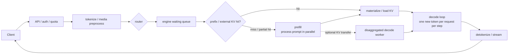

# 推理服务：从单请求推理到 SLO-aware 集群

本章讨论 LLM 推理服务的系统工程，覆盖常规的 autoregressive serving、KV cache、调度、P/D 与 E/P/D disaggregation，以及多模态的理解和生成 serving。

LLM serving 要优化的目标并不是孤立地把“tokens/s”这个数字做大，而是在给定的 workload、硬件与成本条件下，尽量让更多请求满足 TTFT / TPOT / E2E latency 方面的 SLO，也就是最大化 goodput：

> **在给定 workload、硬件与成本条件下，最大化满足 TTFT / TPOT / E2E latency SLO 的 goodput。**

这个目标把本章要讲的技术都串到了一起：continuous batching 提高设备利用率，chunked prefill 控制 decode stall，PagedAttention 提高 KV 容量，prefix cache 消掉重复 prefill，P/D 分离让 TTFT 与 TPOT 可以独立扩缩，overlap 把等待时间隐藏在另一种资源的工作之后；而 admission control、路由和监控则决定这些局部优化能否真正转化为用户能感知到的 tail SLO 改善。

## 前置知识

本章假设读者具备以下背景。正文会从 prefill / decode 和各项指标的定义讲起，不假设你已经接触过任何具体的 serving engine。

- 清楚 decoder-only Transformer 里 attention 和 MLP 的数据流是怎么走的；不熟悉的部分可回查 [Attention 总览](../attention/README.md) 与 [训练全景：从数据到权重更新](../train/00_overview.md)。
- 能区分 FLOPS、HBM bandwidth 和 arithmetic intensity 这几个概念；如果这部分还不熟悉，先读 [Roofline model：性能上界的两道天花板](../hpc/00_roofline_model.md)。
- 多 GPU 并行的细节不用提前背下来，用到的时候随时可以回查 [并行策略总览](../parallel/README.md)。

---

## 0. 请求的关键路径

下面这张图给出一条请求从进入系统到返回结果所经过的关键路径：



一条请求的服务时间并不是单一的“model latency”能概括的，而是由好几段时间拼起来的：

```text
arrival
  │ API / tokenize / media fetch
  ├──────────── queue ────────────┤
  │                               ├──── prefill / KV load ────┤ first token
  │                               │                           ├─ decode step ─ token 2
  │                               │                           ├─ decode step ─ token 3
  │                               │                           └─ ... ───────── finish
  └─────────────────────────────── TTFT ──────────────────────┘
  └──────────────────────────────────── E2E latency ───────────────────────────┘
```

prefill 与 decode 跑的是同一个 Transformer，但张量 shape 和瓶颈完全不同，下表把两者对照放在一起：

| 阶段 | 一次 forward 的新 token | 主要行为 | 常见瓶颈 | 主要用户指标 |
|---|---:|---|---|---|
| **prefill** | 整段 prompt 或一个 chunk | 大 GEMM；为每层写入全部 prompt KV | compute / attention，长上下文也吃 HBM | TTFT |
| **decode** | 每请求通常 1 个 | 反复读权重与历史 KV，追加一个 KV | memory bandwidth、kernel launch、collective | TPOT / ITL |

正因为两个阶段的行为差异这么大，serving 才不只是“调用一次 `model.forward`”那么简单：系统必须同时调度不同长度、不同 phase、随时到达和结束的请求，还要管理随 token 数线性增长的 KV cache。

---

## 1. 文档怎么读

接下来八篇按下表的顺序展开，每一篇解决一个具体问题、引入对应的机制：

| 文件 | 解决的问题 | 关键机制 |
|---|---|---|
| [01｜Prefill、Decode 与 Serving 指标](./01_inference_and_metrics.md) | 单请求究竟做了什么，服务质量如何量化？ | prefill / decode shape、roofline、TTFT、TPOT、ITL、latency、throughput、goodput、SLO、Little's Law |
| [02｜Continuous Batching、Chunked Prefill 与调度策略](./02_batching_and_chunked_prefill.md) | 如何让动态请求组成高效 batch，又不让长 prompt 卡住所有 decode？ | request / static batching、continuous batching、token budget、chunked prefill、mixed batch、preemption、FCFS / priority / LPM / DFS |
| [03｜PagedAttention 与 KV Cache 内存系统](./03_paged_attention_and_kv_cache.md) | KV 为什么成为容量瓶颈，PagedAttention 如何消掉碎片？ | KV 容量公式、logical/physical block、block table、slot mapping、PagedAttention kernel、GQA/MLA、量化、hybrid KV、vAttention |
| [04｜Prefix Cache、RadixAttention 与分层 KV Cache](./04_prefix_and_hierarchical_cache.md) | 怎样跨请求复用 KV，并把 cache 扩展到 CPU / SSD / 远端？ | vLLM hash-chain APC、SGLang RadixAttention、LRU/ref count、HiCache、LMCache、CacheBlend、cache-aware routing |
| [05｜P/D Disaggregation 与 KV Cache Transfer](./05_disaggregation_and_kv_transfer.md) | 为什么以及何时拆分 prefill / decode？大量 KV 怎么搬？ | DistServe / Splitwise / Mooncake、P2P 与共享 store、layer/chunk streaming、vLLM connector、Mooncake Transfer Engine / Store、LMCache、异构 TP |
| [06｜集群调度、Serving 并行与 Overlap](./06_scheduling_parallelism_and_overlap.md) | 单机调度之外，如何组合路由、并行、迁移和多层 overlap？ | TP/PP/DP/EP/CP、DP attention、async scheduler、CUDA Graph、TBO/SBO/DBO、PP overlap、request migration、admission control |
| [07｜多模态 Serving：理解、生成与流式 Omni](./07_multimodal_serving.md) | 图像/音频理解与图像/视频生成怎样改变 serving？ | encoder budget/cache、变长 image token、E/P/D、embedding transfer、diffusion batching、CFG/SP、TeaCache / Cache-DiT、流式音频指标 |
| [08｜Benchmark、容量规划与生产化](./08_benchmarking_and_production.md) | 怎样测得可信、配得合理、上线后看得见？ | open-loop benchmark、workload/prefix 模型、容量规划、Prometheus 指标、autoscaling、load shedding、故障与 cache 正确性 |

建议第一次通读时按编号顺序读下来；如果是带着线上问题来查资料，可以按症状直接跳转：

- TTFT 高：先看 `01` 里对 TTFT 的分解，再查 `02` 的 queue/chunk、`04` 的 cache、`05` 的 P/D 和 `08` 的 admission。
- TPOT / ITL 尾部抖动：先查 `02` 里 prefill interference 的机制，再看 `05` 是否需要分离、`06` 的 collective/overlap。
- OOM / preemption 多：看 `03` 的容量账本、`02` 的 admission watermark、`04` 的分层 cache。
- 多机吞吐扩不上去：看 `06` 的并行选择和同步域，再看 `05` 的传输拓扑。

---

## 2. 技术分层与常见误区

这些技术分别作用在不同的层次上，理清这一点有助于判断某个问题该往哪一层去找答案：

```text
cluster router   cache affinity / queue estimate / priority / admission / autoscale
      │
engine scheduler continuous batching / chunked prefill / token budget / preemption
      │
memory manager   paged KV / prefix share / eviction / offload / external KV
      │
model executor   TP / PP / DP-attn / EP / CUDA Graph / fused kernels
      │
transport        NVLink / RDMA / TCP / SSD, layerwise or chunkwise pipeline
```

因为这些技术处在不同层次，容易被误当成互相替代的方案，实际上它们大多是配合使用的：

- **continuous batching vs P/D 分离**：前者是 iteration 内的 batch 策略，后者是资源池拓扑；P 和 D 各自仍然需要 batching。
- **PagedAttention vs FlashAttention**：前者解决的是持久 KV 的地址与内存管理问题，后者主要优化一次 attention 计算的 IO；现代 backend 经常同时具备 paged KV 接口和 FlashAttention 风格的 kernel。
- **prefix cache vs KV offload**：prefix cache 决定“什么可以复用”，offload 决定“复用的数据放在哪里”。
- **chunked prefill vs P/D 分离**：两者都能降低 prefill 对 ITL 的干扰；chunking 不需要付跨节点传输的成本，但 chunk 切得太小会降低 prefill 效率，P/D 则会增加路由、配比和故障面方面的复杂度。
- **throughput vs goodput**：前者在请求排队到不可接受的程度时仍可能继续升高，后者只计算满足明确 SLO 的完成请求。

---

## 3. 贯穿全章的判断准则

把上面的技术地图记在心里之后，还有几条更底层的判断准则会在后面每一篇里反复用到：

1. **先画出 critical path，再谈优化。** 不在关键路径上的异步任务即使很慢，也未必造成损害；反倒是一次隐式的 stream synchronize，可能就摧毁了整个 overlap 设计。
2. **同时算 compute、memory、network 三本账。** 只看 FLOPS 会误判 decode 阶段的瓶颈，只看 HBM 又会漏掉 TP/EP collective 和跨机 KV 传输带来的开销。
3. **平均值不能代表服务质量。** 所有结论至少应该报告 p50/p90/p99，TTFT 与 TPOT/ITL 要分开统计，并且使用与线上一致的 arrival process。
4. **cache hit 只有在 load 比 recompute 快时才有价值。** 缓存的层级越远、chunk 越碎、命中的内容越短，就越可能出现“命中了反而更慢”的反效果。
5. **调度优化必须说明 starvation、preemption 和 overload 情况下的行为。** 一个只在无限队列上能提高吞吐、却让长请求永远排不上号的策略，算不上一个完整的 serving 策略。

---

## 4. 代码地图

理清了概念之后，下表把论文和文档里的说法对应到真实实现的代码位置，方便逐行核对。以下均为本仓库 pin 住的源码版本，行号会随上游演进而漂移，最终还是要以类/函数名定位。

| 主题 | vLLM / SGLang / cache system 代码 | 本章关注点 |
|---|---|---|
| continuous / unified scheduling | [[vllm:vllm/v1/core/sched/scheduler.py#L388]] | 用 `num_computed_tokens` 与 token budget 统一表示 prefill/decode，先续跑 running request，再准入 waiting request |
| scheduler limits | [[vllm:vllm/config/scheduler.py#L49]] | `max_num_batched_tokens`、`max_num_seqs`、partial prefill、watermark、async scheduling |
| SGLang scheduling policy | [[sglang:python/sglang/srt/managers/schedule_policy.py#L133]] | FCFS、LPM、DFS-weight、LOF、priority 与 in-batch prefix reuse |
| SGLang mixed chunk | [[sglang:python/sglang/srt/managers/scheduler.py#L2547]] | `PrefillAdder`、chunked request、prefill/decode mixed batch |
| vLLM paged allocator | [[vllm:vllm/v1/core/kv_cache_manager.py#L110]]、[[vllm:vllm/v1/core/block_pool.py#L144]] | block allocation、ref count、free/LRU queue、prefix cache 共池 |
| paged KV write/read | [[vllm:vllm/v1/attention/ops/paged_attn.py#L15]]、[[vllm:vllm/v1/attention/backends/flash_attn.py#L927]] | `slot_mapping` scatter 写 KV；attention 通过 `block_table` 读取非连续 page |
| per-page 字节数 | [[vllm:vllm/v1/kv_cache_interface.py#L159]] | `2 × block_size × num_kv_heads × head_size × dtype_bytes` |
| vLLM prefix hash | [[vllm:vllm/v1/core/kv_cache_utils.py#L539]] | parent hash + block tokens + LoRA/mm/cache salt/prompt embeds extra keys |
| SGLang RadixAttention | [[sglang:python/sglang/srt/mem_cache/radix_cache.py#L264]] | radix match/split/insert、leaf eviction、运行中节点 lock |
| hierarchical cache | [[sglang:python/sglang/srt/mem_cache/hiradix_cache.py#L72]] | GPU L1、host L2、storage L3 的 promotion / eviction / prefetch |
| vLLM connector contract | [[vllm:vllm/distributed/kv_transfer/kv_connector/v1/base.py#L171]] | scheduler lookup/allocation metadata 与 worker layerwise load/save 生命周期 |
| Mooncake P2P / Store | [[vllm:vllm/distributed/kv_transfer/kv_connector/v1/mooncake/mooncake_connector.py#L412]]、[[vllm:vllm/distributed/kv_transfer/kv_connector/v1/mooncake/store/connector.py#L87]] | 直接 P↔D 传输与共享 KV pool 是两条不同 data path |
| Mooncake Transfer Engine | [[mooncake:mooncake-transfer-engine/include/transfer_engine.h#L70]] | segment、registered memory、batch transfer、status、topology-aware multi-NIC |
| Mooncake Store | [[mooncake:mooncake-store/include/client_service.h#L72]] | `Put/Get/Batch*`，master 管 metadata，client 间直接搬 data |
| LMCache engine | [[lmcache:lmcache/v1/cache_engine.py#L83]] | serving engine ↔ GPU connector ↔ CPU `MemoryObj` ↔ pluggable backend |
| LMCache chunk key | [[lmcache:lmcache/v1/token_database.py#L298]] | fixed chunk、prefix hash-chain、跨进程稳定 key |
| LMCache-vLLM | [[lmcache:lmcache/integration/vllm/vllm_v1_adapter.py#L453]] | external lookup、paged slot mapping、layerwise load/store、失败回退 |
| CPU/GPU scheduler overlap | [[sglang:python/sglang/srt/managers/scheduler.py#L1448]] | 当前 GPU forward 与上一 batch 结果处理/下一 batch scheduling 重叠 |
| MoE batch overlap | [[sglang:python/sglang/srt/batch_overlap/operations.py#L45]]、[[vllm:docs/design/dbo.md#L1]] | 两 microbatch 在 attention/dispatch/GEMM/combine yield point 交错 |
| multimodal encoder cache | [[vllm:vllm/v1/core/encoder_cache_manager.py#L17]]、[[vllm:vllm/v1/worker/gpu/mm/encoder_runner.py#L34]] | encoder compute/cache 双预算、按 mm hash 复用、embedding scatter |
| SGLang E/P/D | [[sglang:python/sglang/srt/disaggregation/encode_server.py#L220]] | ViT 独立服务、Mooncake embedding transfer、global embedding cache |
| diffusion serving | [[sglang:python/sglang/multimodal_gen/runtime/pipelines_core/stages/denoising.py#L161]] | encoder / iterative denoiser / VAE decoder 拆分与各自并行 |

### Pin 版本

| 上游项目 | commit | 用途 |
|---|---|---|
| vLLM | `156b12667` | scheduler、PagedAttention/KV manager、connector、metrics、多模态 |
| SGLang | `1a5775a9d` | RadixAttention/HiCache、overlap、P/D/EPD、diffusion serving |
| Mooncake | `f90ae691f` | Transfer Engine、Mooncake Store、vLLM/SGLang integration |
| LMCache | `09bc14c0a` | 分层 KV、external connector、layerwise transfer、CacheBlend |

---

全景、文档地图与判断准则都就绪之后，下一步就是从最基础的地方开始：一次 prefill、一次 decode 到底在张量层面做了什么，以及围绕它们定义出的那些指标究竟量的是什么。[01｜Prefill、Decode 与 Serving 指标](./01_inference_and_metrics.md) 从张量 shape 与时间戳开始，严格定义 prefill/decode 和所有核心指标。
