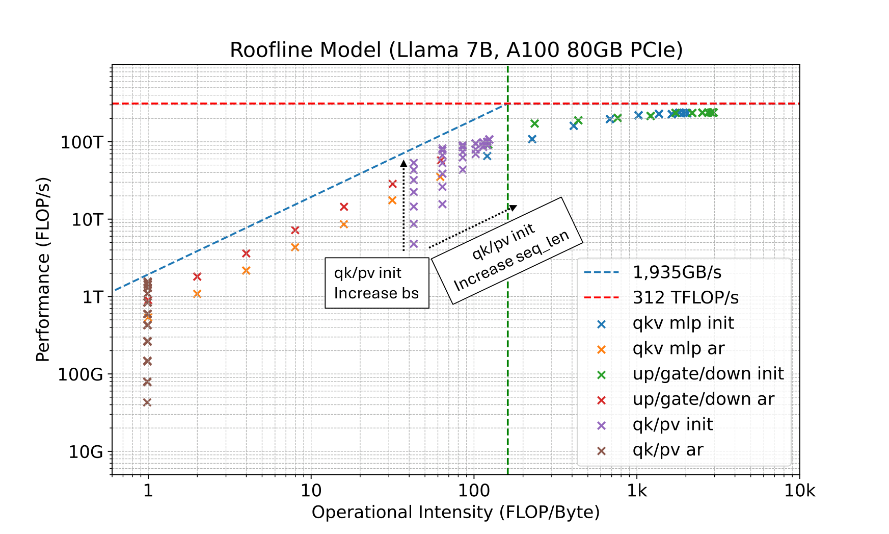

# 00 · Decode 的带宽瓶颈与 verify 的低成本

本篇是整章的硬件基础。speculative decoding 并不是「再发明一种采样」，而是承认一件硬件事实：自回归 decode 的瓶颈在 HBM 带宽上，算术单元大部分时间在空转；一旦能把多个 token 位置放进同一次 forward，权重只需读一遍，原本空转的算力就被利用起来。不先把这件事算清楚，后文的「2× / 6×」都没有可比的意义。

> **前置**：[00 · Roofline model：两道天花板](../hpc/00_roofline_model.md) 中的两道天花板与 arithmetic intensity。本篇只是把同一把尺应用到 decode 上，并引出「verify 相当于一次短 prefill」这一结论。

---

## 1. 一次 decode step 的开销

生成第 $t{+}1$ 个 token 时，target 必须完成以下工作：

```
读  全部权重 W  （从 HBM → SRAM / 寄存器）
读  已有 KV cache 里与本次 Q 相关的页
算  每一层：QKV proj → attention(q, K_cache, V_cache) → FFN
写  本步新的 K/V
写  logits ∈ ℝ^V ，再 sample 一个 token
```

以 70B BF16 模型为例：权重约 70×10⁹×2 B ≈ 140 GB。H100 的 HBM 带宽约 3 TB/s，仅搬运权重就需要 50 ms 量级的时间，实际还要加上 KV cache 的读写。算术量呢？每个权重只参与大约一次乘加——batch=1 时整个前向就是一系列 GEMV。

沿用 [00 · Roofline model：两道天花板](../hpc/00_roofline_model.md) 的 intensity：

$$
I_{\mathrm{decode}} \;\approx\; \frac{2MK}{MK\cdot s} \;=\; \frac{2}{s}
\qquad
\text{BF16: } I\approx 1,\quad \text{FP8: } I\approx 2
\quad \text{FLOP/byte}
$$

H100 BF16 的 ridge point 为 $I^*\approx 330$，decode 的工作点落在最左边，处于深度 memory-bound 状态：Tensor Core 完成那一次乘加之后，只能等待下一片权重从 HBM 送达。

> **关键事实**：一次 decode step 的墙钟时间由「把 $W$ 从 HBM 读完」决定，而不是由「对几个 token 做了几次乘加」决定。

这正是 Leviathan 和 Medusa 两篇论文共同的出发点：LLM 推理是 memory-bandwidth-bound 的，主要延迟来自每步把完整参数从 HBM 搬到片上，而不是算术本身（Leviathan et al. 2023；Cai et al. 2024）。



> 图：Llama-7B 在 A100-80GB 上的算子 roofline。虚线是 HBM 带宽与峰值算力。标了 `ar`（autoregressive decode）的点全部贴着斜线；标了 `init`（prefill）的线性层明显往右、往上走。这张图是「decode 慢不是因为算得多」的实验证据。（Cai et al. 2024, Fig 9；[arXiv:2401.10774](https://arxiv.org/abs/2401.10774)）

---

## 2. Prefill 为什么快

prompt 已知时，所有 prompt token 可以一次进入模型。权重仍然只读一遍，但 GEMV 变成了 GEMM：$N$ 个 token 共享同一份 $W$，

$$
I_{\mathrm{prefill}} \;\approx\; \frac{2N}{s+\cdots}
$$

当 $N$ 达到几百、几千时，工作点越过 ridge point，进入 compute-bound 区域。这就是常说的 prefill / decode 差异：prefill 阶段吃满 Tensor Core，decode 阶段吃满 HBM 带宽。

DeepEP 把同一个观察落实为两套通信路径（[06 · DeepEP：V1 (legacy/NVSHMEM) 与 V2 (elastic/NCCL Gin)](../moe/06_deepep.md)）：prefill 走吞吐型，decode 走 low-latency。根因都是「每步的有效 token 数」。

---

## 3. 一次 forward 可以验证多个位置

把 8 个位置放进同一次 forward，会发生什么：

- HBM 仍然只读一遍 $W$，主要开销几乎不变
- 算术量变为 8 倍，但算术本来就是闲置资源
- 因此 8 个位置的 verify 与 1 个位置的 decode 墙钟时间几乎相同

这就是 speculative decoding 的全部物理依据。Leviathan 原文的表述大意是：大模型推理的瓶颈常常不在算术，而在带宽和通信，因此增加并发是一种互补的加速手段——在近似模型的输出上并行运行 target。

写成对照：

```
标准 decode（γ 个 token）:
  for i in 1..γ:
      读 W一次, 算 1 个位置, sample          # 墙钟 ≈ γ · T_target

speculative verify（γ 个 draft + 1 个 bonus 位）:
  读 W一次, 算 γ+1 个位置, 得到 γ+1 份 logits  # 墙钟 ≈ 1 · T_target
  再从左到右决定接受/拒绝
```

前提条件是：这 $\gamma+1$ 个位置的输入 token 都已经在手里。标准 decode 做不到这一点，因为位置 $t{+}1$ 的输入就是位置 $t$ 的采样结果。speculative decoding 的「投机」正在于此：先假设这些输入已知（由 drafter 猜出），再一次性核对。

CPU 领域有对应的先例，即 speculative execution / 分支预测（Burton 1985；Hennessy & Patterson）：先做可能用得上的计算，再验证结果是否被采纳。Leviathan 把这一思想推广到随机情形——一个候选 token 只是「以某个概率被需要」，因此必须配一套保持分布不变的采样规则（下一篇讨论）。

---

## 4. 延迟公式与三个现实约束

记 $T_{\mathrm{target}}$ 为 target 一次 forward 的墙钟时间（decode 或短 verify 都近似于它），$T_{\mathrm{draft}}$ 为写出 $\gamma$ 个猜测的时间。一轮结束后留下 $\tau$ 个 token，则每个 token 的延迟为

$$
L \;=\; \frac{T_{\mathrm{draft}} + T_{\mathrm{verify}}}{\tau}
\qquad
\eta \;=\; \frac{T_{\mathrm{target}}}{L}
$$

Leviathan 在「$M_q$ 的单步代价 / $M_p$ 的单步代价 $= c$」且「verify 不比单步 decode 更慢」的假设下给出（见 [`01`](./01_draft_verify.md)）：

$$
\eta \;=\; \frac{1-\alpha^{\gamma+1}}{(1-\alpha)\,(\gamma c + 1)}
$$

这里先列出三个会让 $\eta$ 下降的现实因素：

1. **$T_{\mathrm{verify}}$ 并不严格等于 $T_{\mathrm{target}}$。** $\gamma$ 大、或者 tree 很宽时，verify 变成一段短 prefill，可能从 memory-bound 滑向 compute-bound，一次 verify 就会比单步 decode 更贵。这是高 batch、大树时 spec 失效的根因（[`07`](./07_serving.md)）。
2. **$T_{\mathrm{draft}}$ 不是免费的。** 用独立的 7B draft 配 13B target 时 $c$ 太大，$\eta<1$，EAGLE 论文 Fig 1 把这种组合标为 N/A。
3. **$\tau$ 的上界是 $\gamma{+}1$，而期望值被接受率的前缀连乘限制。** 第一个位置出错，整块就作废，因此第 1 个 token 的预测质量远比第 16 个重要（DSpark 对 suffix decay 的分析见 [`06`](./06_dflash_dspark.md)）。

---

## 5. 一组量级估算

下面用一个「单请求、70B 级、BF16、$\gamma=4$」的简化设定建立量级直觉（表中数字只代表量级）：

| 量 | 量级 |
|---|---|
| 一次 target decode | $T_{\mathrm{target}}$（定义成 1） |
| 一次 4+1 位 verify | $\approx 1.0$–$1.2$（仍偏 memory-bound） |
| 独立小模型 4 步 draft，$c=0.05$ | $T_{\mathrm{draft}}\approx 0.2$ |
| EAGLE 1 层 × 树深 5 | $T_{\mathrm{draft}}\approx 0.15$–$0.3$ |
| DFlash 5 层、$\gamma=16$，一次并行 | $T_{\mathrm{draft}}\approx 0.1$–$0.2$（几乎不随 $\gamma$ 涨） |
| 若 $\alpha=0.8,\gamma=4$ | $\mathbb{E}[\tau]=(1-0.8^5)/(1-0.8)=3.28$ |
| 独立小模型粗算 $\eta$ | $3.28 / (0.2+1) \approx 2.7\times$ |

同一组数字也能解释为什么高并发时 spec 反而不划算：serving 已经用 continuous batching 把许多请求的 decode 拼成大 GEMM，工作点右移，此时 verify 再扩大 $\gamma$ 就是在 compute-bound 区域增加 FLOP，$T_{\mathrm{verify}}$ 真实上涨，而分母 $\tau$ 却填不满。第三个方向——少 verify 那些大概率被拒的后缀——在这时才成为必需品。

---

## 6. 与量化、蒸馏的边界

加速 decode 的手段不止 speculative decoding 一种：

| 手段 | 改不改输出分布 | 改不改模型 | 典型收益 |
|---|---|---|---|
| 量化 / 稀疏 | 通常有损 | 权重 | 带宽账单变小 |
| 蒸馏成小模型 | 有损（换模型） | 换一套权重 | 整条 $T_{\mathrm{target}}$ 变小 |
| speculative decoding | **默认无损** | target 不动 | 少调用 target 的次数 |
| Medusa typical accept 等 | 有意放宽 | 视实现 | 再换一点质量换速度 |

本章默认走无损路线：target 权重不动、输出分布与单独采样相同。放宽接受准则的做法（typical acceptance、有损 draft）会单独标注。

---

下一篇：[01 · Draft-then-verify：无损算法核心](./01_draft_verify.md)——把 Leviathan/Chen 的算法、rejection sampling 为什么无损、$\alpha$ 怎么定义、$\gamma$ 怎么选完整讲清楚，这是后面所有方法共用的 accept/reject 核心。
