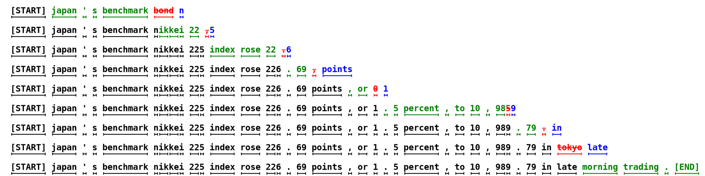
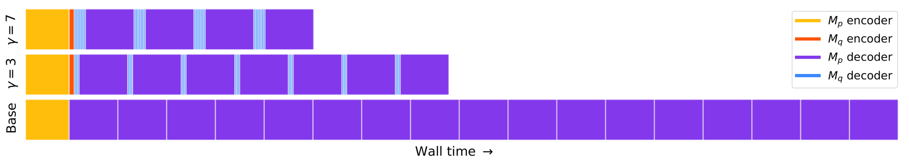
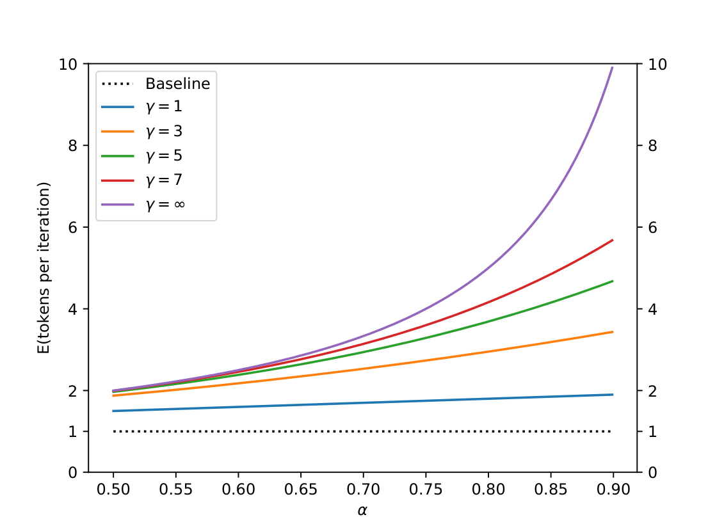
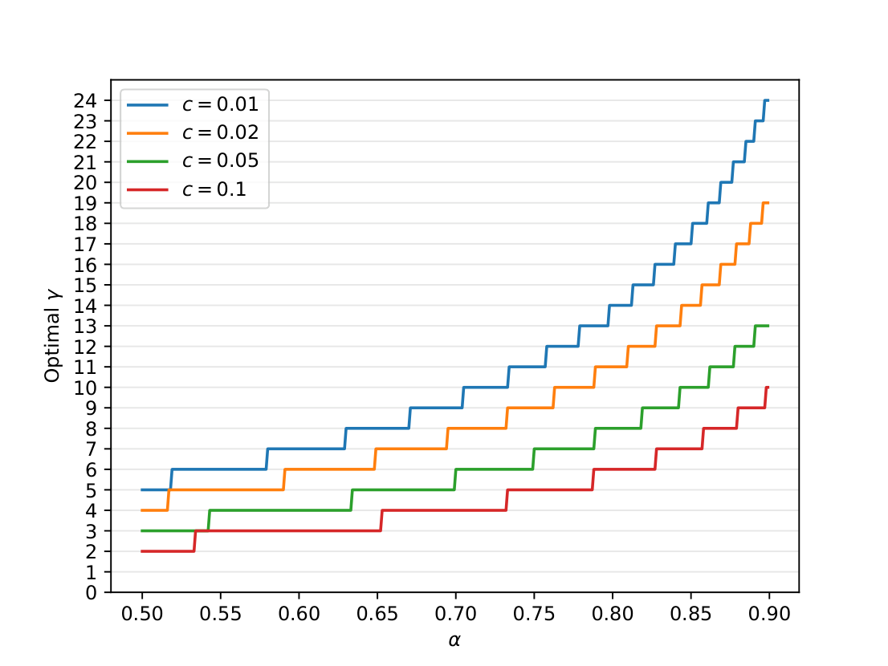

# 01 · Draft-then-verify：无损算法核心

本篇给出 speculative decoding 的算法不变量。后面的 Medusa / EAGLE / MTP / DFlash / DSpark 改变的是「谁来 draft、树长什么样、verify 多长」，而接受规则本身几乎原封不动地来自 Leviathan et al. 2023 与 Chen et al. 2023。读完本篇，任何论文中出现的 $\min(1,p/q)$ 和 residual 分布都不再是黑盒。

> 论文：Leviathan et al., ICML 2023, [arXiv:2211.17192](https://arxiv.org/abs/2211.17192)；Chen et al., [arXiv:2302.01318](https://arxiv.org/abs/2302.01318)。更早的 Draft-then-Verify 骨架见 Stern et al. 2018 Blockwise Parallel Decoding（[arXiv:1811.03115](https://arxiv.org/abs/1811.03115)）与 Xia et al. 2023 SpecDec。

---

## 1. 一轮 speculative decoding 的流程

记号：target $M_p$ 给出 $p(x_t\mid x_{<t})$，draft $M_q$ 给出 $q(x_t\mid x_{<t})$。任意采样方式（greedy / top-k / nucleus / temperature）都可以先归约为「对调整后的分布做标准采样」，所以后面只讨论标准采样。

**Algorithm 1（Leviathan，一轮）**——与论文伪代码同构：

```
输入: Mp, Mq, prefix
1. 用 Mq 自回归采样 γ 个猜测 x1..xγ，同时记下每步的 q_i
2. 一次并行跑 Mp，得到
      p1 = Mp(prefix)
      p2 = Mp(prefix + x1)
      ...
      p_{γ+1} = Mp(prefix + x1..xγ)      # 多算一位，留给 bonus / residual
3. 从左到右：
      抽 r_i ~ U(0,1)
      若 r_i > p_i(x_i) / q_i(x_i)  →  在 i 处拒绝，丢掉 i+1..γ
4. 若在 n 处拒绝:
      从 p' = norm(max(0, p_{n+1} - q_{n+1})) 采样 correction t
   若全部接受:
      从 p_{γ+1} 采样 bonus t
5. 返回 prefix + x1..xn + t          # 至少 1 个、至多 γ+1 个新 token
```

最坏情况下第一个猜测就被拒绝，这一轮仍产出 1 个来自 target 的 token，因此串行步数永远不会比朴素 decode 更多；最好情况下 $\gamma$ 个全部命中，再额外得到 1 个 bonus。



> 图：无条件语言模型上的一轮轮示意。每行是 target 的一次并行 verify。绿 token 是 $M_q$ 猜中且被接受的，红是被拒绝的猜测，蓝是 target 给出的 correction。第一行一次 verify 就留下 5 个 token。整句 38 个 token 只用了 9 次 target forward。（Leviathan et al. 2023, Fig 1；[arXiv:2211.17192](https://arxiv.org/abs/2211.17192)）



> 图：简化 trace。紫块是 $M_p$ 的一次调用，蓝块是它前面的 $\gamma$ 次 $M_q$。$\gamma$ 越大，紫块越稀疏，但蓝块变长——这就是 $c$ 与 $\alpha$ 的权衡。（Leviathan et al. 2023, Fig 5；[arXiv:2211.17192](https://arxiv.org/abs/2211.17192)）

---

## 2. 接受规则与分布不变性

### 2.1 单步 rejection sampling

要采样 $x\sim p$，却先从 $q$ 里抽了一个 $x$，处理规则是：

- 若 $q(x)\le p(x)$：直接留下（draft 没有「多抽」这个 token）
- 若 $q(x)>p(x)$：以概率 $1-p(x)/q(x)$ 拒绝；拒绝后从残差分布再抽

$$
P(\text{accept } x) \;=\; \min\Bigl(1,\;\frac{p(x)}{q(x)}\Bigr)
\qquad
p'(x) \;=\; \mathrm{norm}\bigl(\max(0,\,p(x)-q(x))\bigr)
$$

直觉是：$q$ 相对 $p$ 多出来的质量必须丢掉；$p$ 相对 $q$ 多出来的质量，留给 residual 去补。这是标准 rejection sampling 在离散词表上的形式。

**分布不变性（Leviathan Appendix A.1 的结论，这里把一步推导写开）**：

$$
\begin{aligned}
P_{\mathrm{alg}}(x)
&= q(x)\cdot\min\bigl(1,p(x)/q(x)\bigr)
   \;+\;
   \Bigl(1-\sum_{y}q(y)\min(1,p(y)/q(y))\Bigr)\,p'(x) \\
&= \min(p(x),q(x))
   \;+\;
   \bigl(1-\sum_y\min(p,q)\bigr)\cdot
   \frac{\max(0,p(x)-q(x))}{\sum_z\max(0,p-q)} \\
&= p(x)
\end{aligned}
$$

推导中用到 $\sum\min(p,q)+\sum\max(0,p-q)=1$（因为 $\sum p=1$）。因此对任意 $p,q$（不要求 $q$ 近似 $p$），这一步的边际分布都是 $p$；$q$ 只影响接受率，不影响最终分布。

### 2.2 接受率与分布重叠度

Leviathan 定义对称散度 $D_{LK}(p,q)=1-\sum_x\min(p(x),q(x))$，并证明单步接受率

$$
\beta \;=\; \mathbb{E}_{x\sim q}\bigl[\min(1,p(x)/q(x))\bigr]
     \;=\; \sum_x \min\bigl(p(x),q(x)\bigr)
     \;=\; 1 - D_{LK}(p,q)
     \;=\; 1 - \tfrac12\|p-q\|_1
$$

最后一项是 total variation 距离，drafter 的全部工作就是让 $q$ 在 TV 距离上贴近 $p$。DSpark 后来把 $c_k^*=1-\tfrac12\|p_k^d-p_k^t\|_1$ 直接作为 confidence head 的监督标签（[`06`](./06_dflash_dspark.md)），这个标签并非人为设定，正是这里的 $\beta$。

greedy（temperature=0）是特例：$p,q$ 都是 one-hot，接受 $\iff$ draft token 恰好等于 $\arg\max p$。实现上就是逐位置比对 token id，不必计算 $p/q$。

### 2.3 多步接受的前缀结构

位置 $k$ 的 draft 是以 $x_{<k}$（含已接受的 draft）为条件写出的。一旦 $x_k$ 被拒绝，$x_{k+1},\ldots,x_\gamma$ 的条件就不再成立，必须丢弃。因此：

- 一轮产出的是最长可接受前缀，外加一个来自 $p$ 的 token
- 期望长度对位置是连乘，而不是相加：

$$
\mathbb{E}[\text{accepted draft}]
\;=\;
c_1 + c_1 c_2 + c_1 c_2 c_3 + \cdots
$$

其中 $c_k$ 是「前 $k{-}1$ 个都被接受的条件下，第 $k$ 个也被接受」的条件概率。提高 $c_1$ 远比提高 $c_{16}$ 有价值——这是后文「第 1 个位置要用最强容量」这一结论的数学来源。

---

## 3. α、γ 与期望加速

假设各位置的 $\beta$ 独立同分布，记 $\alpha=\mathbb{E}[\beta]$。一轮产出的 token 数是一个上限为 $\gamma{+}1$ 的几何变量：

$$
\mathbb{E}[\#\text{ tokens}]
\;=\;
\frac{1-\alpha^{\gamma+1}}{1-\alpha}
$$



> 图：横轴 $\alpha$，纵轴一轮期望 token 数。$\alpha\to 1$ 时曲线贴近 $\gamma{+}1$；$\alpha$ 中等时，盲目加大 $\gamma$ 的收益迅速递减。（Leviathan et al. 2023, Fig 2；[arXiv:2211.17192](https://arxiv.org/abs/2211.17192)）

再计入 draft 代价比 $c$（假设 $\gamma+1$ 路 target 并发不增加墙钟时间）：

$$
\eta \;=\; \frac{1-\alpha^{\gamma+1}}{(1-\alpha)\,(\gamma c+1)}
$$

推论：只要 $\alpha>c$，至少存在一个 $\gamma$ 能带来加速，且 $\gamma=1$ 时已有 $\eta\ge(1+\alpha)/(1+c)$。



> 图：$c$ 越小（draft 越便宜），最优 $\gamma$ 越大。独立 7B-draft-13B-target 的 $c$ 太大，最优策略可能是不做 spec。（Leviathan et al. 2023, Fig 3；[arXiv:2211.17192](https://arxiv.org/abs/2211.17192)）

算术总量会上升：被拒绝时 target 在后面位置上做的计算会作废。但访存量下降：权重和 KV 每轮 Algorithm 1 只读一遍，读取次数按 $\mathbb{E}[\#\text{tokens}]$ 缩小，而这正是 memory-bound 的 decode 所需要的。

---

## 4. 实现要点

**Bonus 位不是可选的优化。** target 本来就要在「最后一个接受位置的下一格」输出 logits：拒绝时用它做 residual，全部接受时用它 sample bonus。少算这一位，$\tau$ 中的 $+1$ 就没有了。

**KV cache 与回滚。** verify 会给 $\gamma$ 个 draft 位置写 K/V，拒绝点之后的 KV 必须丢弃（或根本不提交）；tree 路径上未被选中的兄弟节点同样要回收。SGLang 的 EAGLE worker 为此准备了 hidden-state / KV 的 reversion buffer（`multi_layer_eagle_worker_v2.py` 里的 `req_to_hidden_states_pool`）。

**Greedy 与 sampling 走同一套代码路径。** 不要实现两套 accept。temperature=0 时 $p/q\in\{0,1\}$，自然退化成 id 比较。Medusa 的 typical acceptance 是另一套有损规则，不能与这里的无损保证混为一谈。

**标准化采样。** top-k / nucleus 必须先作用在 $p$ 和 $q$ 上，再拿调整后的分布做 $p/q$。如果对未截断的 logits 做接受判定，得到的分布就不再是用户所期望的那个采样器。

伪代码（与 Leviathan Algorithm 1 同构，便于对照工程实现）：

```python
def spec_step(prefix, draft, target, gamma):
    xs, qs = [], []
    ctx = prefix
    for _ in range(gamma):                 # T_draft
        q = draft.probs(ctx)
        x = sample(q)
        xs.append(x); qs.append(q)
        ctx = ctx + [x]
    ps = target.probs_parallel(prefix, xs) # 长度 gamma+1；T_verify
    n = 0
    for i, x in enumerate(xs):
        if random() > min(1.0, ps[i][x] / qs[i][x]):
            break
        n += 1
    if n < gamma:
        resid = relu(ps[n] - qs[n])
        t = sample(resid / resid.sum())
    else:
        t = sample(ps[gamma])              # bonus
    return prefix + xs[:n] + [t]
```

---

## 5. 算法骨架与后续分叉

到这里，算法骨架已经完整：

```
cheap 地得到 (x1..xγ, q1..qγ)
一次 target forward 得到 p1..p_{γ+1}
从左到右 min(1, p/q) 切前缀
residual 或 bonus 补一个 token
```

尚未回答的问题，正好对应 [`README`](./README.md) 的三根轴：

1. $M_q$ 从哪来、输入看什么 → [`03`](./03_draft_families.md) / [`04`](./04_mtp.md) / [`05`](./05_eagle.md) / [`06`](./06_dflash_dspark.md)
2. 候选是一条链还是一棵树 → [`02`](./02_tree_attention.md)
3. $\gamma$ 是固定的还是按负载裁剪的 → [`06`](./06_dflash_dspark.md) 的 scheduler、[`07`](./07_serving.md)

下一篇先回答第 2 个问题：为什么线性 draft 的 $\tau$ 很快触顶，以及 tree attention 怎样用一次 verify 覆盖多条路径。
