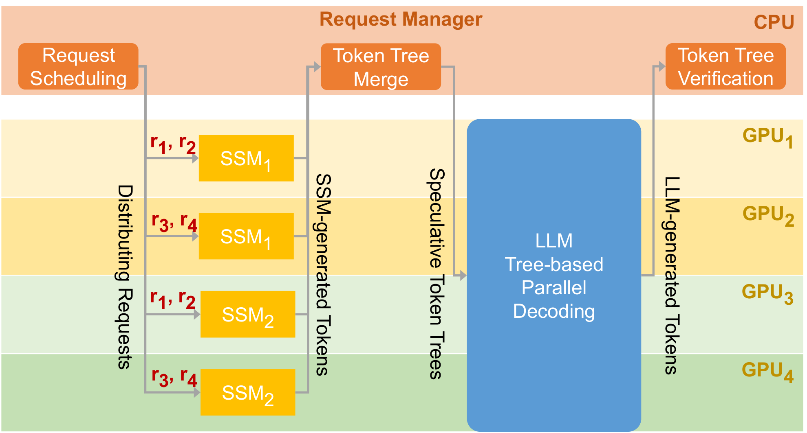
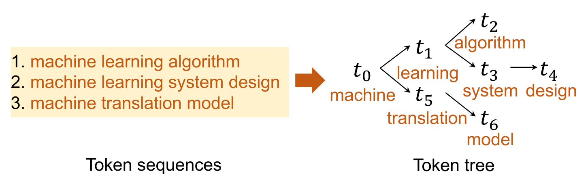
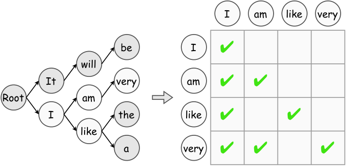
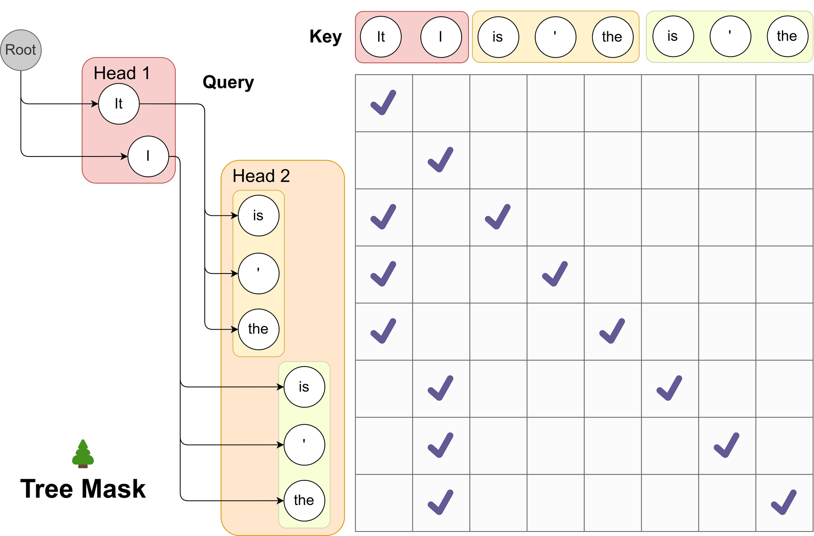
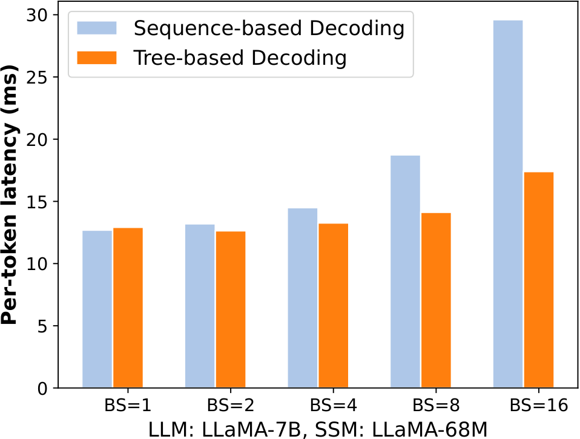
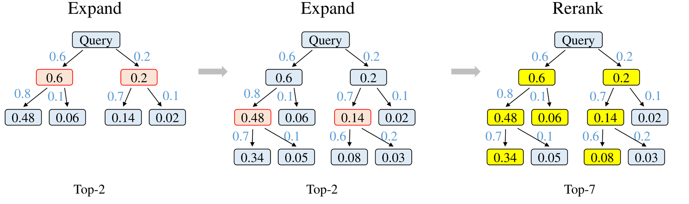

# 02 · Token Tree 与 Tree Attention

线性 draft 一轮只猜一条未来：第一个分歧点被拒绝，后面 $\gamma-1$ 个位置的计算就全部作废。SpecInfer / Medusa / EAGLE-2 把候选组织成树：共享前缀只存一份，一次 target forward 用特殊的 attention mask 同时 verify 所有路径，再挑出最长可接受前缀。本篇说明树的数据布局、mask 的构造方式与 KV 回滚。

> 论文：Miao et al., SpecInfer, [arXiv:2305.09781](https://arxiv.org/abs/2305.09781)；Cai et al., Medusa §2.1.2, [arXiv:2401.10774](https://arxiv.org/abs/2401.10774)；Li et al., EAGLE-2, [arXiv:2406.16858](https://arxiv.org/abs/2406.16858)。
>
> 代码：[[sglang:python/sglang/srt/speculative/eagle_utils.py]] 的 `build_tree_kernel_efficient`。

---

## 1. 线性 draft 的上限

在链式候选上，位置 $k$ 能保留下来的前提是 $1..k{-}1$ 全部命中。即使每步 $\alpha=0.8$，

$$
P(\text{5th survives}) \;=\; 0.8^5 \approx 0.33
$$

继续加大 $\gamma$，多出来的位置几乎注定被丢弃，还白白占用 verify 的 batch 容量。提高 $\tau$ 的正确方向不是无限加长链条，而是在分叉点同时准备几个备选——用树的宽度换取「至少有一条路径能保留下来」的概率。



> 图：SpecInfer 把 LLM serving 拆成「投机引擎 + 树验证器」。target 不再逐步 decode，而是对整棵候选树做一次并行核对。（Miao et al. 2023, workflow；[arXiv:2305.09781](https://arxiv.org/abs/2305.09781)）



> 图：三条候选 `machine learning algorithm` / `machine learning system design` / `machine translation model` 合并后，`machine` 只出现一次。verify 时共享前缀的 KV 也只算一次。（Miao et al. 2023, token tree；[arXiv:2305.09781](https://arxiv.org/abs/2305.09781)）

---

## 2. Token tree 的定义

一棵 draft tree $\mathcal{T}$：

- 每个节点是一个 token，边表示「该 token 作为父节点的续写」
- 根是上一轮留下的 anchor / bonus token（已确认，不必再 verify）
- 根到叶的一条路径就是一条候选 continuation
- 节点数 $N_{\mathrm{tree}}$ 是这一轮要送给 target 的 verify token 数（不含已经在 KV 里的 prompt）

和线性 draft 的对照：

| | 链 | 树 |
|---|---|---|
| 候选条数 | 1 | 多条，共享前缀 |
| verify token 数 | $\gamma$ | $N_{\mathrm{tree}}$（通常 > $\gamma$，但 ≪ 路径数 × 深度） |
| 一次 forward 覆盖的「未来」 | 一条 | 所有路径 |
| 第一个位置猜错 | 整轮只剩 correction | 只要某个兄弟对了，还能往下走 |

$N_{\mathrm{tree}}$ 就是 $T_{\mathrm{verify}}$ 的真实宽度。树不能无限制地扩张，否则 verify 会从 memory-bound 滑向 compute-bound（[`00`](./00_decode_bottleneck.md) §4）。EAGLE-2 / Sequoia 的工作就是在覆盖率与 $N_{\mathrm{tree}}$ 之间寻找平衡点。



> 图：survey 对 tree-based verification 的示意。分叉后各分支在同一张 attention 里并行核对。（Xia et al. 2024, Fig tree；[arXiv:2401.07851](https://arxiv.org/abs/2401.07851)）

---

## 3. Tree attention 的 mask 规则

朴素做法是把每条路径 pad 成独立序列、扩大 batch，KV 和计算都按路径数翻倍。tree attention 的做法是把整棵树摊平成一段长为 $N_{\mathrm{tree}}$ 的序列，再用一张 mask 恢复树上的祖先关系。

具体规则（和普通 causal mask 的差别）：

- 位置 $i$ 可以看到：prompt（已确认上下文）∪ 从根到 $i$ 的祖先
- 位置 $i$ **不能**看到：兄弟、堂表、任何非祖先的 draft token
- RoPE / 位置编码使用**树上的深度**（或「从 prompt 末尾算起的路径长度」），而不是摊平后的下标

Medusa 用 top-down 的笛卡尔积构造树：第 $k$ 个 head 取 top-$s_k$，路径数 $\prod s_i$，节点数 $\sum_k\prod_{i\le k}s_i$。SpecInfer 是 bottom-up：多条独立 draft 按公共前缀 merge。EAGLE 每步对当前叶做 top-k 扩展，树由「层 × topk」逐层长出来。



> 图：两个 Medusa head 的 top 预测铺成树。attention mask 保证每个 token 只看到自己的前驱；positional index 按这条路径上的步数重写，而不是按摊平下标。（Cai et al. 2024, Fig 2；[arXiv:2401.10774](https://arxiv.org/abs/2401.10774)）

SGLang 把这张 mask 的构造收进 CUDA/Triton kernel，避免在 Python 里物化 $O(N_{\mathrm{tree}}^2)$ 的 dense mask：

```
# eagle_utils.py :: build_tree_kernel_efficient
# 输入: bonus_tokens, parent_list, top_scores_index, draft_tokens, seq_lens, topk, spec_steps
# 输出:
#   tree_mask     — 按 TreeMaskMode（FULL_MASK / QLEN_ONLY / bitpacking）
#   positions     — 每个 draft token 在原序列上的 RoPE 位置
#   retrieve_index / retrieve_next_token / retrieve_next_sibling
#                 — 接受后沿树回溯、找最长前缀的索引
```

`positions` 的注释在源码里写得很直白：若各 draft token 的深度是 `[0,1,1,2]`、prompt 长 7，则 `positions = [7,8,8,9]`——两个深度为 1 的兄弟共享同一个 RoPE 位置，因为它们是同一时间步的不同假设。

---

## 4. 树上的 verify 流程

target 一次 forward 给每个树节点一份 logits $p_v$。接受仍然从根往下、对每条边执行 [`01`](./01_draft_verify.md) 的 $\min(1,p/q)$（greedy 则比对 token id）：

```
从根出发:
  对当前节点的每个孩子，按 p/q 决定是否接受
  接受的孩子成为新的「当前节点」，继续往下
  全部孩子都拒 → 在当前节点的 p 上 sample correction，结束
走到底仍全中 → 在最后节点的「下一位置」sample bonus
```

实现上通常先选出一条最优路径（例如按路径对数概率，或像 EAGLE-2 那样按「到该节点的接受率乘积」），再只对这条路径做从左到右的顺序接受，因为最终文本只能保留一条链。SpecInfer 的 stochastic 版本对整棵树做一次保证分布等价的 tree sampling；工程中更常见的是动态树加顺序接受。

接受之后：

- 被选中路径的 KV 提交进 cache，成为下一轮的 prompt
- 未选中兄弟、以及拒绝点之后的节点，KV 作废

这也是树比链更贵的另一面：需要按 $N_{\mathrm{tree}}$ 分配 page，用完还要回收；page size 大于 1 时还要按 topk 做额外的 rounding（见 SGLang 对 `get_alloc_reserve_per_decode` 的注释）。



> 图：target 不再是增量 decoder，而是一棵 token tree 的 verifier；同一层兄弟并行计算，KV 按下标铺开。（Miao et al. 2023, tree-based decoding；[arXiv:2305.09781](https://arxiv.org/abs/2305.09781)）

---

## 5. 静态树与动态树

**静态树**（Medusa 笛卡尔积、EAGLE-1 固定拓扑）：事先规定每层的分支数。隐含假设是「接受率只与深度有关」——第 3 层的 token 无论上下文如何，值不值得占一个节点是固定的。

**动态树**（EAGLE-2）：draft 模型的 softmax 置信度被证明与真实接受率校准得不错，于是每步用「到该节点的前缀存活概率」作为分数，在全局挑出 $N_{\mathrm{tree}}$ 个最有希望的节点进行扩展。上下文简单（模板、代码）时树变深；上下文发散时树变宽。细节见 [`05`](./05_eagle.md)。



> 图：左为固定拓扑，右为按置信度长出来的树。同样的节点预算，动态树能换来更长的期望接受前缀。（Li et al. 2024, EAGLE-2 Fig method；[arXiv:2406.16858](https://arxiv.org/abs/2406.16858)）

Sequoia（Chen et al. 2024）从另一个角度做预算：给定硬件上 $T_{\mathrm{verify}}(N_{\mathrm{tree}})$ 的实测曲线，用动态规划选择树形，优化目标直接是期望 $\tau / T$。它与 EAGLE-2 的差别是「分数来自模型置信」对「分数来自硬件 profile」——DSpark 的 hardware-aware scheduler 则把后者用到了链/块的长度上。

---

## 6. 不适合用树的场景

- **高并发 serving**：$N_{\mathrm{tree}}$ 直接乘进 target 的 token 数。当 batch 已经把 decode 推到 compute-bound 时，一棵 60 节点的树实际上是在挤占其他请求的 batch 位，因此 DFlash / DSpark 更常使用单条长块而不是宽树。
- **Draft 本身已经很准**：DeepSeek MTP-1 第二 token 接受率 85–90%，一条链就够了，树的边际收益很小。
- **实现复杂度**：tree mask、RoPE 重写、KV 回收、CUDA Graph 都要按 $N_{\mathrm{tree}}$ 分桶，链的 graph 更稳定。

对照：

```
链:  draft 序列 x1..xγ          → verify 宽度 γ
树:  draft 拓扑 (parent, token) → verify 宽度 N_tree ≥ 深度
块:  并行填 γ 个位置（DFlash）  → verify 宽度 = 调度后的前缀长 ≤ γ
```

三种拓扑都复用 [`01`](./01_draft_verify.md) 的接受规则，差别只在「一次 forward 覆盖哪几个条件分布」。

---

下一篇：[03 · 早期 Draft 方法](./03_draft_families.md)——回顾在 EAGLE / MTP / DFlash 出现之前，draft 是怎么来的：独立小模型、检索、Lookahead、Medusa。
