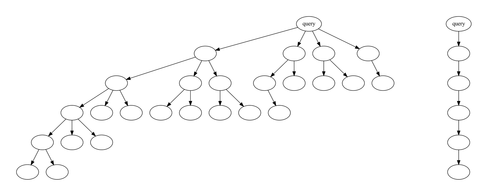
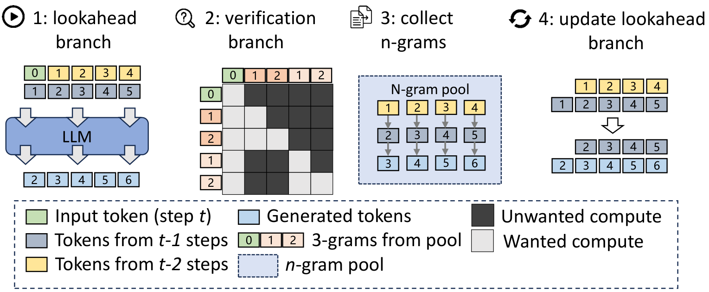
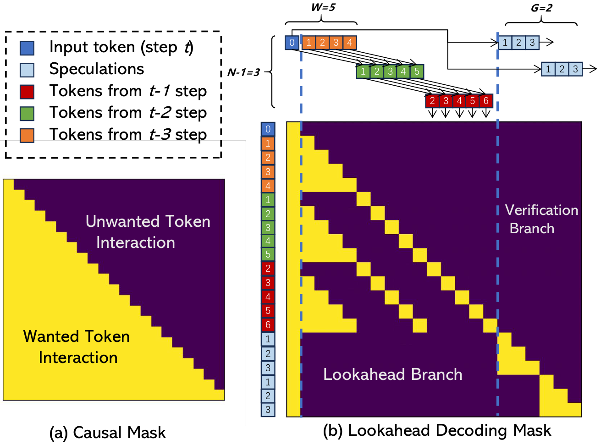
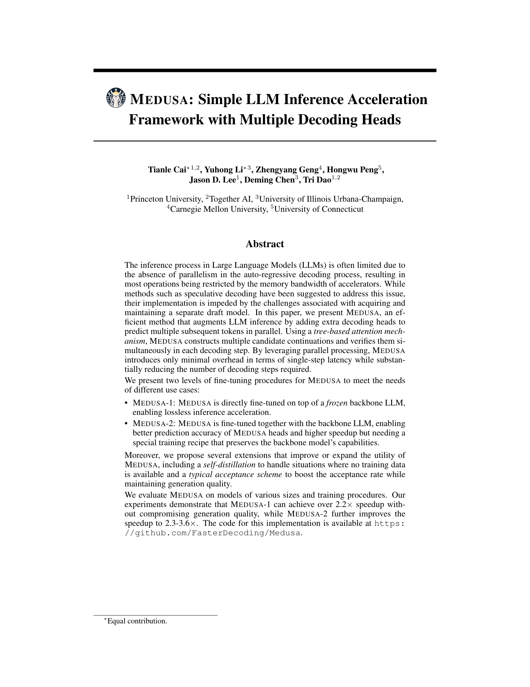
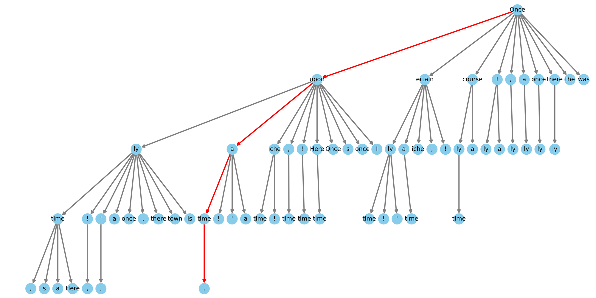

# 03 · 早期 Draft 方法

本篇回顾 EAGLE / MTP / DFlash 出现之前的几类 draft 来源。它们今天未必还是生产默认，但后文的每一项设计都是针对这里暴露出的某个缺陷提出的。本篇对应 [`README`](./README.md) 中的轴 1。

> 论文：Leviathan / Chen（独立小模型）；Saxena PLD；He et al. REST；Fu et al. Lookahead, [arXiv:2402.02057](https://arxiv.org/abs/2402.02057)；Cai et al. Medusa, [arXiv:2401.10774](https://arxiv.org/abs/2401.10774)；Stern et al. 2018 Blockwise。

---

## 0. 四种方法的对比总览

EAGLE 论文 Fig 5 把各家方法在「猜第 4、第 5 个 token」时分别看什么画在了同一张图上，这是理解它们之间差异最直观的入口。

> 图：蓝块是 token，橙块是 feature，红框是 drafter 的预测。独立小模型用 token→token 自回归；Lookahead 用 n-gram + Jacobi，不训练外挂；Medusa 用同一个 $f_2$ 并行预测多个未来位置；EAGLE 用 feature 序列 + 提前一拍的 token 序列做 feature 级自回归。（Li et al. 2024, Fig 5；[arXiv:2401.15077](https://arxiv.org/abs/2401.15077)）

本篇覆盖前三家和检索方法，EAGLE 留给 [`05`](./05_eagle.md)。

---

## 1. 独立小模型

**做法**：找一个和 target 同词表、同 tokenizer、分布尽量接近、但小得多的 LM，按 [`01`](./01_draft_verify.md) 的算法自回归写出 $\gamma$ 个 token。

**优点**：

- 不改 target，不训练新头，有现成小模型就能用
- 无损保证直接成立
- Leviathan 在 T5-XXL 上达到 2–3×，Chen 在 Chinchilla 上是同类量级

**瓶颈**（EAGLE 引言明确列出了三点）：

1. **7B 没有更小的「同族」draft。** LLaMA2-70B 可以用 7B 当 draft；LLaMA2-7B 配 TinyLLaMA 又会遇到指令模板不一致的问题。
2. **$c$ 太大。** 7B draft 配 13B target 时，draft 自己就吃掉了加速收益。
3. **为 spec 单独训练一个小 LM 成本太高。** TinyLLaMA 需要 3T token；EAGLE 只用 2–4B token 训练一个外挂层。

因此这条路只适合「已经有合适小模型」的场景（同系列蒸馏、SpecInfer 的 SSM ensemble），不是通用的加速插件。SGLang 的 `STANDALONE` 算法就是这条路的实现。

改进方向之一是 DistillSpec（Zhou et al. 2023）：用 target 的 logits 蒸馏 draft，提高 $\alpha$ 而不是继续压低 $c$。

---

## 2. 检索型 draft

**做法**：不运行神经网络 draft，而是从 prompt、外部语料或最近生成内容中拷出一段可能的续写。

| 方法 | 候选从哪来 | 何时准 |
|---|---|---|
| Prompt Lookup Decoding (PLD, Saxena 2023) | prompt 里的 n-gram 匹配 | 摘要、改写、文档 QA |
| REST (He et al. 2023) | 检索 datastore（常是微调语料） | 和库重叠高 |
| 运行时 n-gram（SGLang `NGRAM`） | 当前上下文 / 外部 corpus | 代码、重复模板 |

**优点**：$T_{\mathrm{draft}}\approx 0$，$c\approx 0$，只要命中，$\eta$ 就非常高。SGLang 里的 NGRAM 不写 draft KV（`spec_info.py` 的 `has_draft_kv()` 对 NGRAM 返回 false），verify 只是带 mask 的一次 target forward。

**缺点**：开放对话、数学推理几乎没有重复内容，$\alpha$ 会明显下跌。它是一种「免费的特化加速」，不是通用 drafter；生产上常与 EAGLE/MTP 并存——能检索就检索，否则走神经网络 draft。

---

## 3. Lookahead

Fu et al. 2024 的观察是：不引入任何外挂模型，也能构造「未来 token 的猜测」——用 Jacobi 迭代在多个位置同时猜，再用 n-gram 池回收历史中出现过的片段。

> 图：Lookahead 把「需要 draft 模型」这条假设拿掉。每步用 Jacobi 在多个位置同时更新猜测，并用 lookahead 分支收集 n-gram。（Fu et al. 2024, Fig flow；[arXiv:2402.02057](https://arxiv.org/abs/2402.02057)）

> 图：Pad Attention 把若干候选 n-gram 拼进同一次计算，位置之间用 mask 隔开——tree attention 的近亲，只是候选来自检索/Jacobi 而不是神经网络 head。（Fu et al. 2024, Fig PadAttention；[arXiv:2402.02057](https://arxiv.org/abs/2402.02057)）

**优点**：零训练、不维护第二份权重，对分布式 serving 友好。

**缺点**：猜测质量低（EAGLE 论文报告 Lookahead 的准确率明显低于 Medusa 的约 0.6，更低于 EAGLE 的约 0.8），加速通常在 1.5–2×，且原实现偏 greedy。它证明了「并行猜测」是可行的，但精度不够，后续工作必须引入经过训练、能看见 target 内部状态的 drafter。

---

## 4. Medusa

Stern 2018 已经在翻译等任务上用过「骨干上面挂多个 FFN head、并行输出未来 token」的做法，Medusa 把它做成了 LLM 的推理插件。

### 4.1 Head 的定义

给定骨干最后一层 hidden $h_t\in\mathbb{R}^d$（LM head 之前），第 $k$ 个 Medusa head 预测位置 $t{+}k{+}1$（骨干自己的 LM head 预测 $t{+}1$）：

$$
p_t^{(k)}
\;=\;
\mathrm{softmax}\Bigl(W_2^{(k)}\bigl(\mathrm{SiLU}(W_1^{(k)} h_t)+h_t\bigr)\Bigr)
$$

$W_2^{(k)}$ 初始化成原 LM head，$W_1^{(k)}$ 置零——训练起点就是「每个未来位置先复读 next-token」。每个 head 只看 $h_t$，互相看不到对方的采样结果，因此是并行的、无条件依赖的。

> 图：Medusa 一轮的三步。Head 出 top 预测；笛卡尔积（或稀疏树）铺候选；tree attention 并行处理；接受用 rejection sampling 或 typical acceptance。（Cai et al. 2024, Fig 1；[arXiv:2401.10774](https://arxiv.org/abs/2401.10774)）

### 4.2 两种训练

| | Medusa-1 | Medusa-2 |
|---|---|---|
| 骨干 | **冻结**（可量化，单卡就能训） | 一起训，需保 next-token 能力 |
| Loss | $\sum_k \lambda_k\,\mathrm{CE}(p_t^{(k)}, y_{t+k+1})$，$\lambda_k$ 如 $0.8^k$ | $\mathcal{L}_{\mathrm{LM}}+\lambda_0\mathcal{L}_{\mathrm{Medusa{-}1}}$，差分学习率 + heads warmup |
| 无损 | 是（骨干不动） | 骨干变了，严格说分布已变 |
| Speedup | ~2.2× | ~2.3–2.8× |

没有 SFT 数据时可以用 self-distillation：让骨干自己生成回复作为监督。

### 4.3 Typical acceptance

rejection sampling 在高温下接受率下降很快（$p$ 更平，$q$ 稍有偏差就会被拒）。Medusa 为此提出 typical acceptance：以 temperature 为阈值，从 head 的 top 预测中挑出「看起来合理」的最长前缀。这一规则**不再保证输出分布等于原模型**，换来的是更高的接受率；后文默认不采用，除非明确标注「有损」。

### 4.4 Medusa 的贡献与局限

贡献：

1. **Draft 可以是「几层 MLP」，不必是一个完整的小 LM**——训练成本从 T-token 级预训练降到几小时的微调。
2. **Tree attention 把多个 head 的笛卡尔积一次 verify 掉**——见 [`02`](./02_tree_attention.md)。

局限（EAGLE / MTP / DFlash 分别针对这些点做了改进）：

- 各 head 条件独立，$t{+}3$ 不知道 $t{+}2$ 实际采样了什么——这与后文 DFlash 的 multi-modal collision 是同一类问题，只是块更短。
- 只使用 top-layer feature。对 LM head 满秩的模型，$h_t$ 本质上编码的是「下一个 token」的信息，用它预测 next-next 先天困难（EAGLE-3 正是以此为动机改用多层 fusion）。
- 接受率约 0.6，$\tau$ 难以提高，2.x× 基本就是这条路线的上限。

> 图：不是稠密笛卡尔积，而是按 head 准确率剪过的稀疏树——静态树优化的极限，再往前就是 EAGLE-2 的动态树。（Cai et al. 2024, Fig 6；[arXiv:2401.10774](https://arxiv.org/abs/2401.10774)）

---

## 5. 家族对照

| | $T_{\mathrm{draft}}$ | 看 target 内部? | 位置依赖 | 典型 $\alpha$ | 训练成本 |
|---|---|---|---|---|---|
| 独立小 LM | $\propto\gamma\cdot T_{\mathrm{small}}$ | 否 | 有 | 看像不像 | 高（或已有） |
| n-gram / PLD | ≈0 | 否 | 无（拷贝） | 极任务相关 | 无 |
| Lookahead | 几次 Jacobi | 否（只用自身并行） | 迭代里有 | 低 | 无 |
| Medusa | 一次 K 个 MLP | 只 top hidden | **无** | ~0.6 | 低 |
| → EAGLE / MTP | 一层 AR × 深度 | hidden + token | **有** | ~0.8 | 低 |
| → DFlash | 一次深并行 | 多层 KV injection | 块内无（后由 DSpark 补） | 前缀高、后缀掉 | 中 |

下一代方法有两个共同的决定：不让 drafter 从零学习语言，而是让它读 target 已经算好的 feature；不让未来位置互相不可见。这就是 MTP 的因果链和 EAGLE 的 shifted-token。

---

下一篇：[04 · Multi-Token Prediction：从训练目标到推理 drafter](./04_mtp.md)——先把「多 token 预测」作为一种训练目标讲清楚，再看 DeepSeek-V3 的串行 MTP 如何直接充当推理 drafter。
