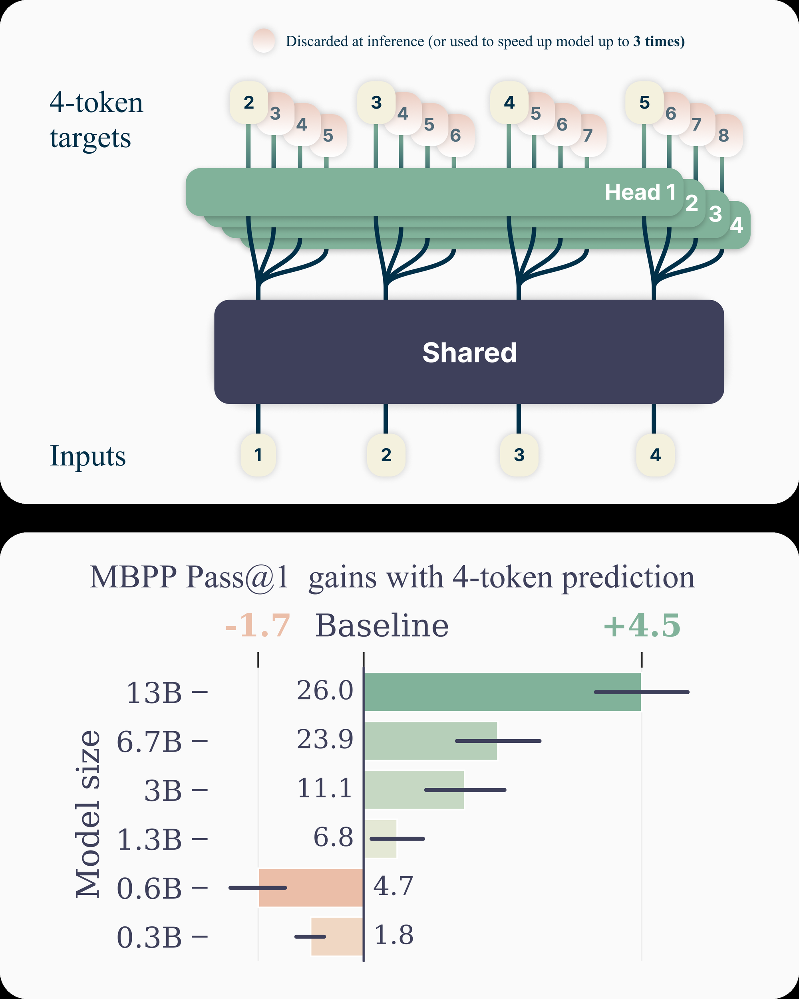
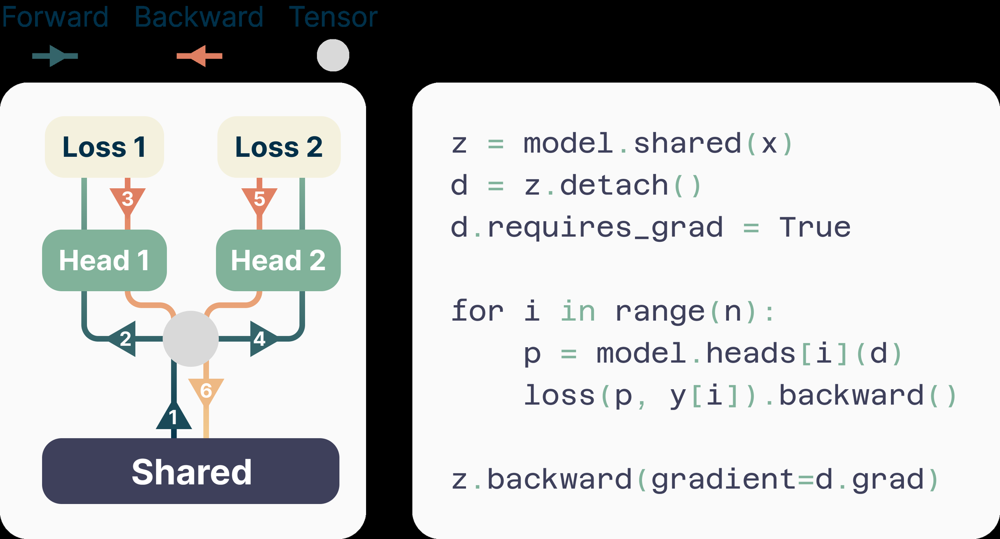
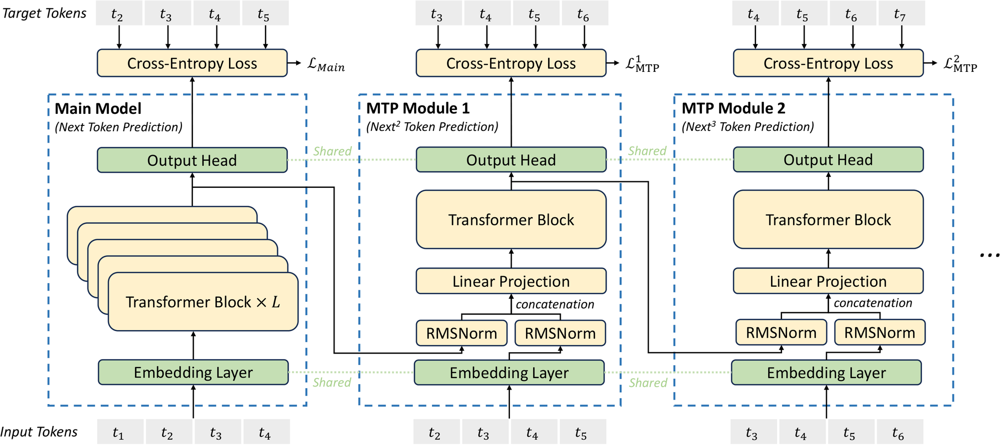

# 04 · Multi-Token Prediction：从训练目标到推理 drafter

MTP 首先是一种训练设计：让每个位置同时（或串行）预测未来 n 个 token，使监督信号更稠密。Gloeckle et al. 2024 用并行独立 head 证明它能提高大模型的样本效率，推理时还可以把多余的 head 拿来做 spec；DeepSeek-V3 则把它改成串行模块、保持完整因果链，训练增益是主目标，推理时既可以丢弃，也可以留下来当 drafter。本篇分别介绍这两条 MTP 路线，并说明它们与 EAGLE 的关系。

> 论文：Gloeckle et al., *Better & Faster LLMs via Multi-token Prediction*, [arXiv:2404.19737](https://arxiv.org/abs/2404.19737)；DeepSeek-AI, *DeepSeek-V3 Technical Report* §2.2, [arXiv:2412.19437](https://arxiv.org/abs/2412.19437)。后续工程：FastMTP [arXiv:2509.18362](https://arxiv.org/abs/2509.18362)。
>
> 代码：SGLang `NEXTN` → EAGLE 家族；`enable_multi_layer_eagle` 走 `multi_layer_eagle_worker_v2.py`（逐步传播 hidden，对应串行 MTP）。

---

## 1. 多 token 预测的训练动机

标准 LM loss 只在位置 $i$ 监督 $t_{i+1}$。Gloeckle 的论点是：很多 token 是「风格性」的，真正决定后文走向的是少数 choice point；只训练 next-token 会把梯度稀释在容易的局部转移上。让模型同时预测 $t_{i+1},\ldots,t_{i+n}$ 有几个好处：

- 监督变稠：同一段文本产生 n 倍的 next-k 信号
- choice point 的后果会出现在多个 head 的 loss 里，**隐式提高关键转移的权重**
- 迫使 trunk 的 hidden $z_t$ 为「后面几步」预留信息——这正是后文「target feature 里已经藏着未来」这一观察的来源（DFlash 引用的 Samragh et al. 2025 是同一个观察）



> 图：上半是架构——共享 transformer trunk，四个独立 output head 并行预测未来 4 个 token；推理默认只用 next-token head，其余可选做 spec。下半是 MBPP 上随模型变大的收益：MTP 在小模型上不一定赢，在 13B 量级明显拉开。（Gloeckle et al. 2024, Fig 1；[arXiv:2404.19737](https://arxiv.org/abs/2404.19737)）

论文给出的经验数字：13B 代码模型 HumanEval +12%、MBPP +17%；用 4-token head 做 self-speculative decoding，在代码任务上可达约 3×，平均接受约 2.5 个 token。收益随规模增大而变大——MTP 是一种「大模型才划算」的训练技巧。

---

## 2. Gloeckle 的并行 MTP

架构（论文 §2）：

```
z_t = f_s(x_{≤t})                 # 共享 trunk，只算一次
对 k = 1..n:
    h_t^{(k)} = f_{h_k}(z_t)      # 独立 transformer layer 当 head
    p(t_{t+k} | x_{≤t}) = softmax(f_u(h_t^{(k)}))   # 共享 unembed
```

Loss 是 n 个位置的 CE 之和，各 head 条件独立——$t_{t+2}$ 的 head 看不到 $t_{t+1}$ 的采样结果。这与 Medusa 同源：Medusa 冻结骨干、事后添加 head；Gloeckle 从预训练起就联合训练 trunk。

显存是一个现实问题：词表 $V\gg d$，n 份 logits 同时物化会超出显存。他们的做法是把 n 个 head 的 forward/backward 串行执行，算完一个就释放 logits，只在 trunk 上累加梯度。



> 图：trunk 先 forward；head1 完整 fwd/bwd 后丢掉 logits；再 head2。峰值显存接近单 head，而不是 ×n。（Gloeckle et al. 2024, Fig 2；[arXiv:2404.19737](https://arxiv.org/abs/2404.19737)）

推理时有两种用法：

1. **丢弃多余的 head**（默认）：推理成本与 next-token 模型相同，训练收益则不受影响
2. **Self-speculative decoding**：用 head 2..n 当 draft，主干当 verify。这里的 draft 仍然是「并行、无条件依赖」的，接受率受 Medusa 同类问题的限制，但因为 head 与 trunk 一起训练过，对齐程度比事后挂接的 Medusa 更好

---

## 3. DeepSeek-V3 的串行 MTP

V3 报告 §2.2 写得很明确：MTP 模块受到 Gloeckle 启发，但不使用独立并行 head，而是使用 $D$ 个串行模块，每一步都看「上一深度的表示 + 下一个真实 token 的 embedding」。这与 EAGLE 的原则一致——保持因果链——但主目标是训练，不是推理加速。

### 3.1 模块定义

第 $k$ 个 MTP 模块包含：共享 $\mathrm{Emb}$、共享 $\mathrm{OutHead}$、一个 Transformer block $\mathrm{TRM}_k$、投影 $M_k\in\mathbb{R}^{d\times 2d}$。对第 $i$ 个输入 token $t_i$，深度 $k$：

$$
\mathbf{h}_i^{\prime k}
\;=\;
M_k\,\bigl[\,\mathrm{RMSNorm}(\mathbf{h}_i^{k-1})\,;\;
\mathrm{RMSNorm}(\mathrm{Emb}(t_{i+k}))\,\bigr]
$$

$$
\mathbf{h}_i^{k}
\;=\;
\mathrm{TRM}_k(\mathbf{h}_i^{\prime k})
\qquad
P_{i+1+k}^{k}
\;=\;
\mathrm{Softmax}\bigl(\mathrm{OutHead}(\mathbf{h}_i^{k})\bigr)
$$

$k=1$ 时 $\mathbf{h}_i^{0}$ 是主模型 hidden。Embedding、LM head 与主模型物理共享（DualPipe 把最浅层和最深层放在同一 PP rank，就是为了让这份共享不必复制一份梯度）。



> 图：主模型吃 $t_1..t_4$ 预测 $t_2..t_5$。MTP-1 把主模型 hidden 与 $t_2..t_5$ 的 embedding 拼接、投影、过一个 TRM，预测 $t_3..t_6$。MTP-2 再吃 MTP-1 的 hidden 与再移位的 embedding，预测 $t_4..t_7$。每个深度都看到「已经发生的 token」，不是对同一个 $h$ 平行猜三个位置。（DeepSeek-AI 2024, Fig 3；[arXiv:2412.19437](https://arxiv.org/abs/2412.19437)）

和 Gloeckle / Medusa 的关键差别：

| | Gloeckle / Medusa | DeepSeek-V3 MTP |
|---|---|---|
| 多个未来位置怎么出 | 并行、独立 head | 串行，$k$ 依赖 $k{-}1$ |
| 输入 | 同一个 $z_t$ / $h_t$ | hidden + **下一个 token 的 embedding** |
| 因果链 | 无（条件独立） | 完整 |
| 主目标 | Gloeckle：训练；Medusa：推理 | **训练**（推理可丢） |

「加上下一个 token 的 embedding」就是 EAGLE 的 shifted-token：没有它，feature 级预测会被采样随机性卡住（[`05`](./05_eagle.md) §2）。V3 报告自己也写明：保因果链的原则与 EAGLE 类似，但 EAGLE 面向 speculative decoding，他们面向训练。

### 3.2 训练目标

深度 $k$ 的 CE（报告式 24）：

$$
\mathcal{L}_{\mathrm{MTP}}^{k}
\;=\;
-\frac1T\sum_{i=2+k}^{T+1}\log P_i^{k}[t_i]
\qquad
\mathcal{L}_{\mathrm{MTP}}
\;=\;
\frac{\lambda}{D}\sum_{k=1}^{D}\mathcal{L}_{\mathrm{MTP}}^{k}
$$

主模型仍有自己的 next-token loss。消融实验（报告 Table 4）：在 15.7B / 228.7B 两个尺度上，加 1-depth MTP 后多数榜单提升；**推理时丢弃 MTP，成本与 baseline 完全相同**——所以这张表测的是纯训练收益。

### 3.3 推理时的两种用法

报告原文：MTP 主要用于提升主模型，推理时可以直接 discard，也可以 repurpose 做 speculative decoding。

生产中的 DeepSeek-V3 / R1 走第二条路。$D=1$ 时就是「主模型出 token 1，MTP 模块出 token 2，target 一次 verify 两个位置」。报告的推理部分给出：

- 第二 token 接受率 **85–90%**（跨话题稳定）
- 结合 speculative decoding，约 **1.8× TPS**

这是一条「短链 + 极高 $\alpha$」的路线：$\gamma=1$，$c$ 为「一个 TRM block 相对整网」的开销，很小，$\alpha$ 又极高，公式 $\eta\approx(1+\alpha)/(1+c)$ 直接给出约 1.8×。不必使用树，也不必把 $\gamma$ 开到 16。

SGLang 部署：`--speculative-algorithm NEXTN`（`spec_registry.py` 里 `NEXTN` 是保留别名，解析到 EAGLE 家族）。多步串行 MTP（Step3.5 那种）走 `MultiLayerEagleWorkerV2`：

```
# multi_layer_eagle_worker_v2.py
# chain-style MTP: each step propagates its own output hidden states
#                  to the next step.
# non-chain: each step uses the target model's hidden states.
self.chain_mtp_hidden_states = draft_arch in ["Step3p5MTP"]
# 各步共享 target 的 embed / lm_head
```

`FROZEN_KV_MTP` 是另一条工程变体：draft 步冻结/复用 KV，少写一份 cache。

---

## 4. MTP 在设计空间里的位置

```
训练轴                          推理轴
Gloeckle 并行 head  ──丢掉──►  普通 next-token
        │
        └──留下──►  self-spec（并行 draft，像 Medusa）

DeepSeek 串行 MTP   ──丢掉──►  普通 next-token（Table 4 的设定）
        │
        └──留下──►  MTP-1/NEXTN（短链、高 α、1.8×）
                 └── 再叠 EAGLE-3 / DFlash / DSpark（更长 τ）
```

DSpark 论文把 DeepSeek-V4 线上的生产基线就称为 MTP-1：它已经在用串行 MTP 做 spec，换成 DSpark 后同吞吐下用户速度 +60–85%。因此 MTP 并不是与 EAGLE/DSpark 互斥的「另一种算法」，而是 target 出厂自带的短链 drafter；更强的外挂 drafter 在它之上替换或加长。

FastMTP 等后续工作的方向是共享跨步权重、提高多步 MTP 的接受率，避免 $D>1$ 时被误差累积拖垮——这一问题设定已经与 EAGLE 的「多层 draft + 误差累积」合流。

---

## 5. 与 EAGLE 的对照

| | DeepSeek MTP | EAGLE-1 |
|---|---|---|
| 模块何时训 | 和主模型一起预训练 / 续训 | 主模型冻结后，用 ShareGPT 级数据另训 |
| 深度 | 常 D=1 个 TRM | 1 个 decoder layer，但会 unroll 成树深 m |
| 输入 | $h^{k-1}$ + $\mathrm{Emb}(t_{i+k})$ | feature 序列 + shifted token 序列 |
| 输出监督 | 真实未来 token 的 CE | SmoothL1(feature) + CE(token) |
| 推理 $\gamma$ | 通常 1（MTP-1） | 树深 4–7，节点数十 |
| 接受率 | 单步 85–90% | 逐步 ~0.8，靠树抬 $\tau$ |

两者的共同点是保因果链、共享 embed/head、使用 hidden；差别在于 **MTP 是模型自身的一部分，EAGLE 是可插拔的加速器**——MTP-1 赢在 $\alpha$，EAGLE 赢在一次能猜更长、更宽。

---

下一篇：[05 · EAGLE 三代：feature 自回归、动态树、Training-Time Test](./05_eagle.md)——按三代展开 feature 级自回归、shifted token、动态树与 EAGLE-3 的 training-time test。
