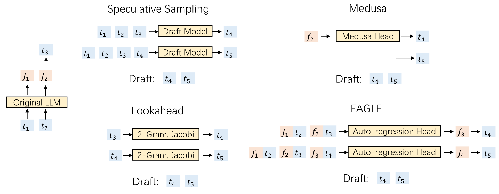
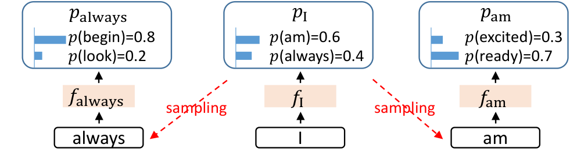
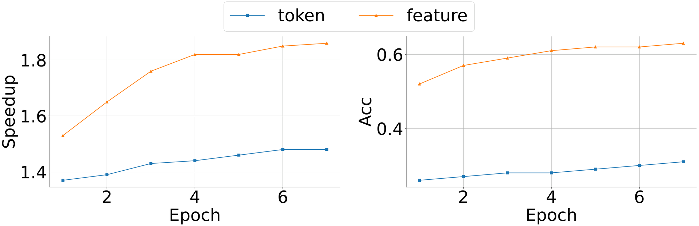
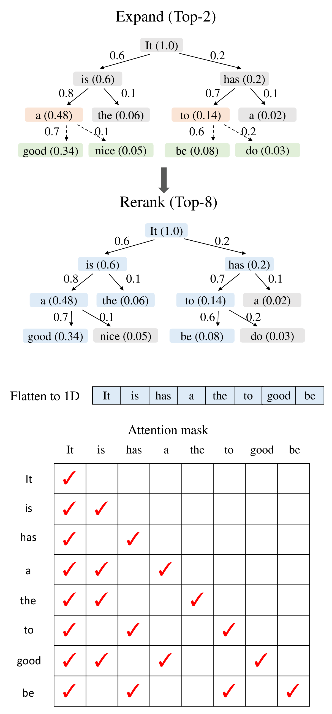
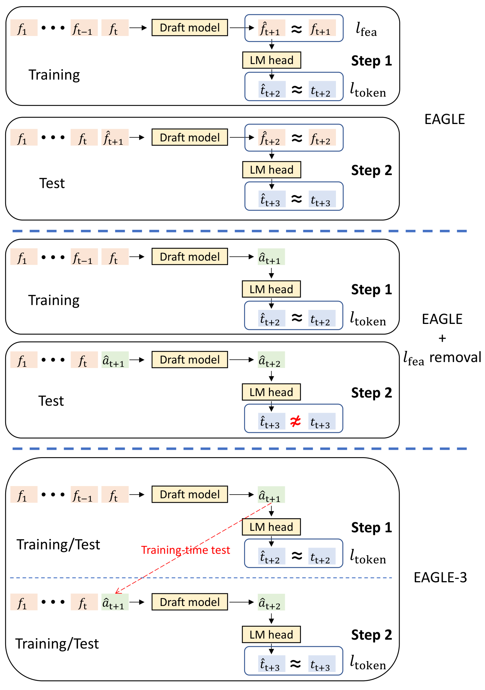
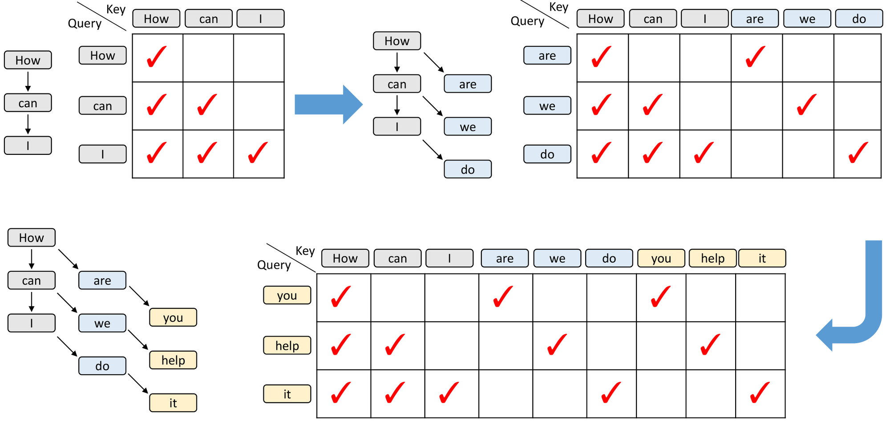
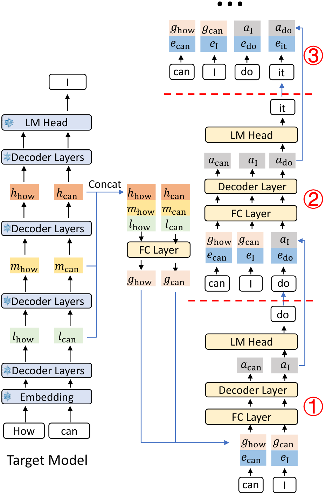
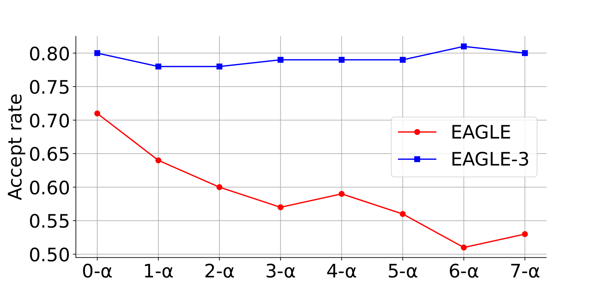
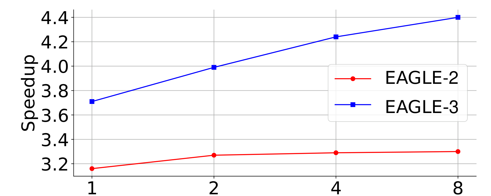
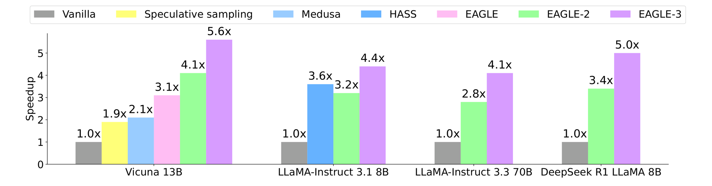

# 05 · EAGLE 三代：feature 自回归、动态树、Training-Time Test

EAGLE（Extrapolation Algorithm for Greater Language-model Efficiency）是 2024–2025 年开源推理加速的代表性方法。三代之间变化的不是 accept 规则（始终是 [`01`](./01_draft_verify.md) 的无损采样），而是 drafter 看什么、预测什么、树怎么长。本篇按一到三代依次说明每一代改掉了哪个约束。

> 论文：EAGLE [arXiv:2401.15077](https://arxiv.org/abs/2401.15077)；EAGLE-2 [arXiv:2406.16858](https://arxiv.org/abs/2406.16858)；EAGLE-3 [arXiv:2503.01840](https://arxiv.org/abs/2503.01840)。代码：<https://github.com/SafeAILab/EAGLE>；SGLang `EAGLE` / `EAGLE3` → `eagle_worker_v2.py`。

---

## 1. 共同骨架

和所有 spec 方法一样：draft 阶段用一个可插拔的小模块写出树，verify 阶段由 target 做一次 tree attention。EAGLE 的模块始终是：

```
共享且冻结:  target 的 Embedding、LM Head
只训:        一个（或一层）Autoregression Head
                = FC(降维) + 一个 Transformer decoder layer
```

在 LLaMA2-70B 上这个 head 不到 1B 参数，用 ShareGPT 约 70k 对话、4 张 A100 训练 1–2 天即可完成。不改动 target 权重，因此无损。



> 图：MT-bench、greedy。独立小模型在 7B 上标 N/A（没有合适 draft）；EAGLE 在 70B 上 2.7–3.5×，且保证分布不变。（Li et al. 2024, Fig 1；[arXiv:2401.15077](https://arxiv.org/abs/2401.15077)）

---

## 2. EAGLE-1

### 2.1 Feature 级自回归

这里的「feature」指 target 倒数第二层、进入 LM head 之前的 hidden $f_t$。token 序列是离散的语言，feature 序列则更平滑、更容易回归。EAGLE 的路线是：

$$
(f_1,\ldots,f_t)\;\xrightarrow{\text{draft}}\;\hat f_{t+1}
\;\xrightarrow{\text{LM Head}}\;\hat p_{t+2}
\;\xrightarrow{\text{sample}}\;\hat t_{t+2}
$$

而不是直接让小模型在词表上自回归。EAGLE 用 Vicuna-7B 做了消融：只预测 token 约 1.5×，预测 feature 约 1.9×。

### 2.2 采样不确定性与 shifted token

feature 是连续量，不能像 token 那样「先输出分布再从中采样一个 feature」。下一个 feature 取决于**采样结果**：在前缀 “I” 之后，抽到 `am` 或 `always`，后续 feature 会走向两条完全不同的轨迹，只看 $f_I$ 无法决定 $\hat f_{\text{next}}$。Medusa 用同一个 $f_I$ 预测相隔多个位置的 token，也存在同样的问题。

解法是把提前一拍的 token 序列一起输入：预测 $f_{\text{always}}$ 时看 $(f_I,\, t_{\text{always}})$，预测 $f_{\text{am}}$ 时看 $(f_I,\, t_{\text{am}})$。消融实验中加速从 1.9× 进一步提升到 2.8×。DeepSeek MTP 的 $\mathrm{Emb}(t_{i+k})$ 是同一个补丁。



> 图：feature 级自回归的不确定性。下一个 feature 不能由 $f_I$ 单独决定，必须条件于已经采样的 token。（Li et al. 2024, Fig 3；[arXiv:2401.15077](https://arxiv.org/abs/2401.15077)）

### 2.3 Draft 的计算流程

输入 shape：

```
features : [B, S, H]          # 到目前为止的 f
tokens   : [B, S]             # 提前一拍的 token id
```

计算过程是：embed(tokens) 与 features 在 hidden 维拼接成 `[B,S,2H]`，经 FC 降回 `H`，过一层 decoder 得到 $\hat f$，再经共享 LM Head 得到分布并采样。新的 $(\hat f,\, t)$ 拼回输入，继续下一步。在树上则对当前叶做多次采样（top-k），每深入一层就执行一次这样的步进。



> 图：三步 draft 长出一棵 10 token 的树。每步复用 target 的 Embedding 与 LM Head，只跑一个 Autoregression Head。（Li et al. 2024, Fig 6；[arXiv:2401.15077](https://arxiv.org/abs/2401.15077)）

### 2.4 Loss

回归 + 分类：

$$
\mathcal{L}_{\mathrm{reg}}
=\mathrm{SmoothL1}\bigl(f_{i+1},\;\mathrm{Draft}(T_{2:i+1},F_{1:i})\bigr)
\qquad
\mathcal{L}_{\mathrm{cls}}
=\mathrm{CE}\bigl(p_{i+2},\,\hat p_{i+2}\bigr)
$$

$\mathcal{L}_{\mathrm{reg}}$ 迫使 draft 的输出贴近 target 的 top feature——这正是 EAGLE-3 要解除的约束。

---

## 3. EAGLE-2：动态树

EAGLE-1 使用固定树形，相当于假设「第 d 层节点的价值只取决于 d」。EAGLE-2 的实测表明，接受率与**上下文**强相关——同一深度上，有的前缀几乎必被接受，有的几乎必被拒绝。

第二个观察是：EAGLE draft 的 softmax 置信度与真实接受率校准得很好，误差很小。于是用

$$
s(v) \;=\; \prod_{u\in\mathrm{path}(v)} q(u)
$$

作为节点分数（前缀存活概率的代理），在节点预算 $N_{\mathrm{tree}}$ 内做全局选取：先扩展一层候选，再按 $s(v)$ 保留 top，无需额外训练。

结果（论文）：2.5–5×，比 EAGLE-1 快 20–40%；MT-bench 上大约 2× Medusa、2.3× Lookahead。



> 图：上半是「置信度可当接受率」的观察，下半是动态扩树。同一套 EAGLE-1 权重，只改推理期的树策略。（Li et al. 2024, EAGLE-2；[arXiv:2406.16858](https://arxiv.org/abs/2406.16858)）

SGLang 一侧：`--speculative-eagle-topk`、`--speculative-num-steps`、`--speculative-num-draft-tokens` 三个参数分别对应每层分支数、树深、$N_{\mathrm{tree}}$；`eagle_utils.build_tree_kernel_efficient` 接收的 `top_scores_index` 就是这套动态挑选的结果。

---

## 4. EAGLE-3

### 4.1 Feature 预测约束的局限

社区把主模型的训练数据从 1T 增加到 15T 后，能力明显提升而推理成本不变；EAGLE 增加训练数据却几乎不涨。论文把原因归结为 **feature 预测约束**：

- draft 输出必须拟合 target 的 top-layer $f$
- top-layer $f$ 对满秩 LM head 来说，信息就是「下一个 token」，用它预测更远的 token 天花板很低
- 推理时从第 2 步起输入的是自己的 $\hat f$ 而不是真实的 $f$，训练中没见过这种输入，于是误差累积，$n$-$\alpha$ 随 n 下降

只去掉 $\mathcal{L}_{\mathrm{fea}}$ 并不够：训练仍是单步 teacher forcing，测试却是多步自回归，两者对不上，token 仍然会错（论文 Fig 3 中排）。

### 4.2 Training-time test

做法是在训练时就把「自己的输出再喂回去」多走几步，每步只对 token 计算 CE；draft 的内部向量改记为 $a$（不再假设它等于 $f$）。于是：

- 输入获得自由：可以不再只喂 top feature
- 训练分布对齐推理：第 2、3 步看到的就是自己的 $a$
- 数据变多时，容量被用在「直接把 token 猜对」上，而不是「把 $a$ 压进 $f$ 的形状」



> 图：上排 EAGLE 同时有 $l_{\mathrm{fea}}$ 和 $l_{\mathrm{token}}$，测试喂 $\hat f$。中排去掉 $l_{\mathrm{fea}}$ 但不做多步训练，第 2 步 token 错。下排 EAGLE-3 用 training-time test 把第 2 步也放进训练，只需 $l_{\mathrm{token}}$。（Li et al. 2025, Fig 3；[arXiv:2503.01840](https://arxiv.org/abs/2503.01840)）



> 图：灰=训练数据，蓝/黄=draft 第 1/2 轮预测。第 2 步的 mask 不再是普通因果——每个预测 token 主要看「自己那条来源」加上原始序列。HASS 也改 mask，但 HASS 仍做 feature 预测；EAGLE-3 改 mask 是为了拿掉约束、换表达能力。（Li et al. 2025, Fig 6；[arXiv:2503.01840](https://arxiv.org/abs/2503.01840)）

### 4.3 多层 feature fusion

输入不再是 top $f$，而是 target 低/中/高三层 $l,m,h$ 拼成 $3H$，经 FC 压回 $H$ 得到融合 feature $g$。理由是：中间层还保留着「更远的未来」的信息，top 层已经被 next-token 目标耗尽。

推理（论文 Fig 5 的 “How can I / do” 例子）：

```
prefill / 上一轮 verify 已经得到 token "I"，并记下各层 l,m,h
g = FC([l; m; h])                          # 融合
step1: 输入 (g_how, g_can) ⊕ emb_I  → a_I → LM Head → 采样 "do"
step2: 没有 g_I（"I" 若尚未作为「已 verify 的上下文」的一部分被缓存好，
       更一般地：新 draft 位置没有 target 的 g）
       用 a_I 顶替 g_I，再 ⊕ emb_do → a_do → 采样下一步
step3: 同样用 a 顶替 g，继续
```

shifted token（`emb`）仍然保留，§2.2 的不确定性补丁没有丢。



> 图：三步 draft。第 1 步吃 target 的 $g$，第 2 步起用自身的 $a$ 替代尚未存在的 $g$。（Li et al. 2025, Fig 5；[arXiv:2503.01840](https://arxiv.org/abs/2503.01840)）

### 4.4 实验结果与 scaling

| 设定 | EAGLE-2 | EAGLE-3 |
|---|---|---|
| Vicuna-13B，temp=0，mean speedup / $\tau$ | 4.22× / 4.83 | **5.51× / 6.62** |
| 同上 HumanEval | 4.96× / 5.41 | **6.47× / 7.54** |
| LLaMA3.1-8B mean | 3.23× / 4.11 | 4.44× / 6.23 |
| LLaMA3.3-70B mean | 2.85× / 3.78 | 4.12× / 5.88 |
| SGLang，bs=64 | — | 吞吐 +1.38×（论文） |

代码生成模板多，效果最好可达 6.5×、$\tau=7.5$。$n$-$\alpha$ 曲线上，EAGLE 随自身估计步数明显下降，EAGLE-3 几乎持平——这是 TTT 有效的直接证据。



> 图：条件「前面估计步都接受」下的接受率。EAGLE 的 $n$-$\alpha$ 随 n 下降（feature 误差累积），EAGLE-3 基本持平。（Li et al. 2025, Fig 7；[arXiv:2503.01840](https://arxiv.org/abs/2503.01840)）



> 图：横轴是相对 ShareGPT 的数据倍数。EAGLE-3 的 speedup 随数据上升，EAGLE 看不到这条曲线。（Li et al. 2025, Fig 1；[arXiv:2503.01840](https://arxiv.org/abs/2503.01840)）



> 图：temp=0。标准 spec sampling 用 Vicuna-68M 当 draft。EAGLE-3 在所示模型/任务上最高。（Li et al. 2025, Fig 2；[arXiv:2503.01840](https://arxiv.org/abs/2503.01840)）

HASS（Zhang et al. 2024）也在训练中模拟多步，动机是减轻 EAGLE 的 feature 误差累积，但它仍预测 feature、仍使用 top feature。EAGLE-3 的动机是解除约束、改用多层输入；两者的 mask 技巧相似，目标函数不同。

---

## 5. 三代对照

| | EAGLE-1 | EAGLE-2 | EAGLE-3 |
|---|---|---|---|
| 预测什么 | feature $\hat f$，再 LM Head | 同左 | 直接 token（内部是自由向量 $a$） |
| 输入 feature | top layer | top layer | 低+中+高融合 $g$ |
| Loss | SmoothL1 + CE | 同左（树是推理策略） | 只 CE，多步 TTT |
| 树 | 静态 | **动态** | 动态（沿用 2） |
| 加数据 | 几乎不涨 | 几乎不涨 | **scaling law** |
| 代表 speedup | 2.5–3.5× | 3–5× | 3–6.5× |

三代都没有改变的一点是：drafter 仍然是自回归的、浅的（一层）。$T_{\mathrm{draft}}\propto$ 树深，所以树不能太深、层数不能太多，这正是 DFlash 要解决的下一个问题。

---

## 6. SGLang 实现

```
SpeculativeAlgorithm.EAGLE / EAGLE3
    → EAGLEWorkerV2
    → 若 enable_multi_layer_eagle: MultiLayerEagleWorkerV2   # DeepSeek 式 MTP

draft CUDA Graph: eagle_draft_cuda_graph_runner.py
                  num_tokens_per_bs = topk
verify CUDA Graph: 与普通 decode 共用 DecodeCudaGraphRunner
                  capture_forward_mode = TARGET_VERIFY
                  num_tokens_per_bs = 每步 verify 的 token 数
```

详见 [`07`](./07_serving.md) 与 [07 · CUDA Graph](../torch/07_cuda_graph.md)。

---

下一篇：[06 · DFlash 与 DSpark：并行 draft 与 verify 调度](./06_dflash_dspark.md)——把 draft 从「浅层自回归」换成「深层一次并行」，再补上半自回归和 serving 调度。
