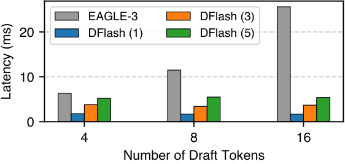
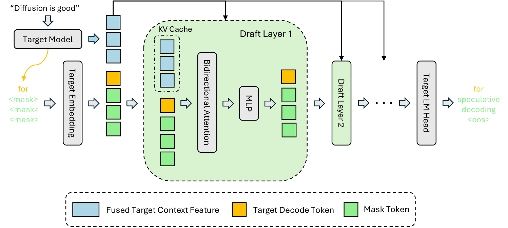
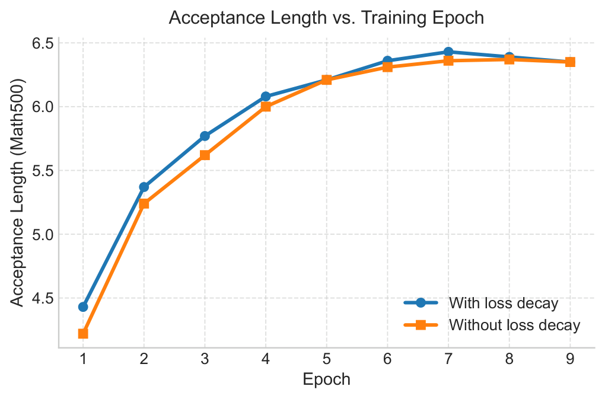
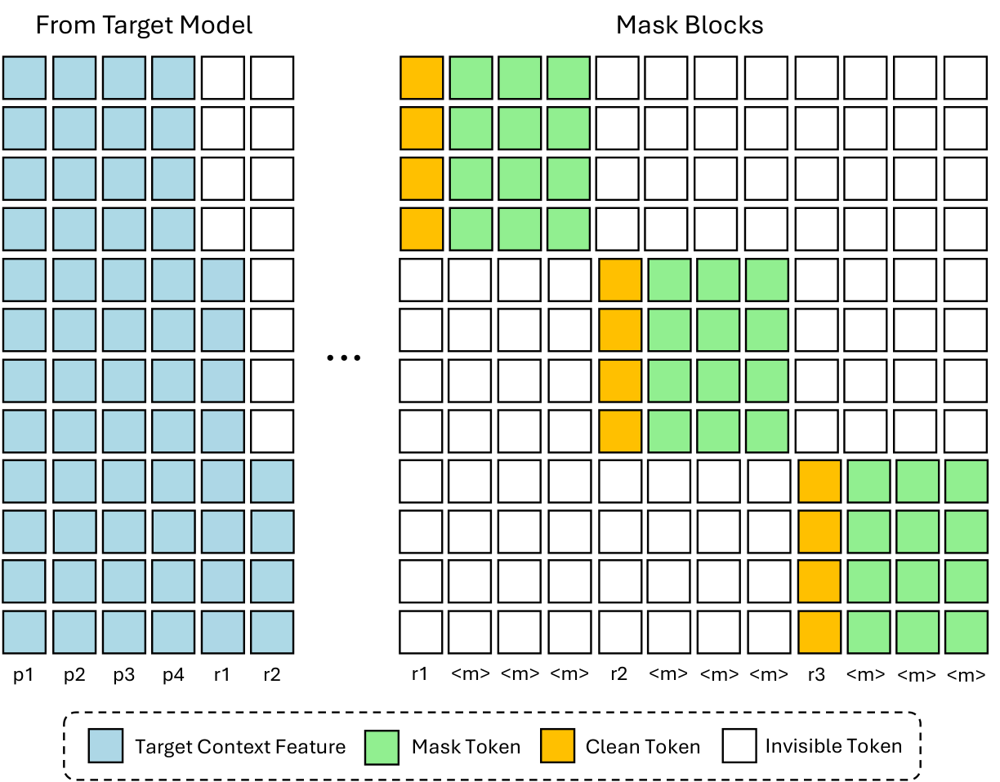
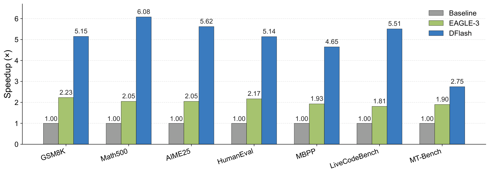
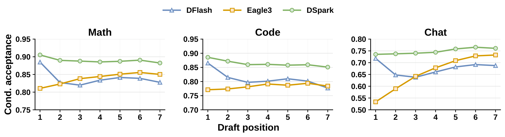
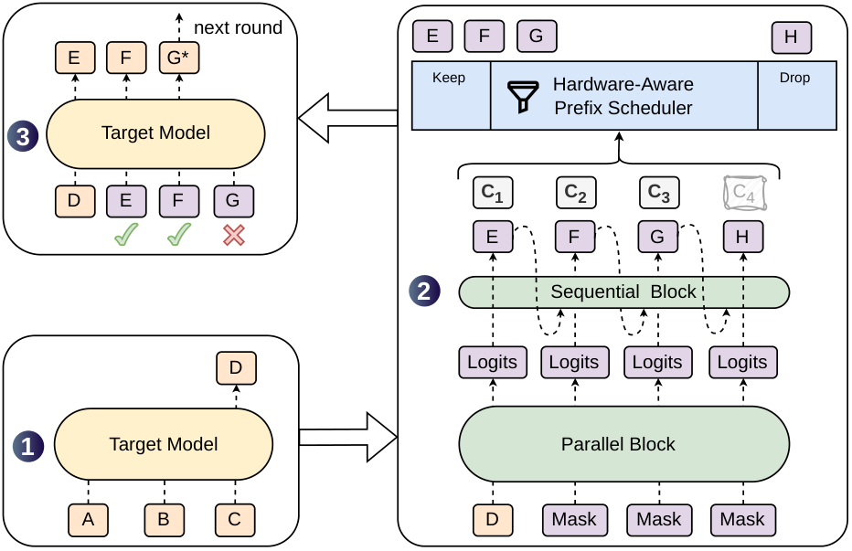
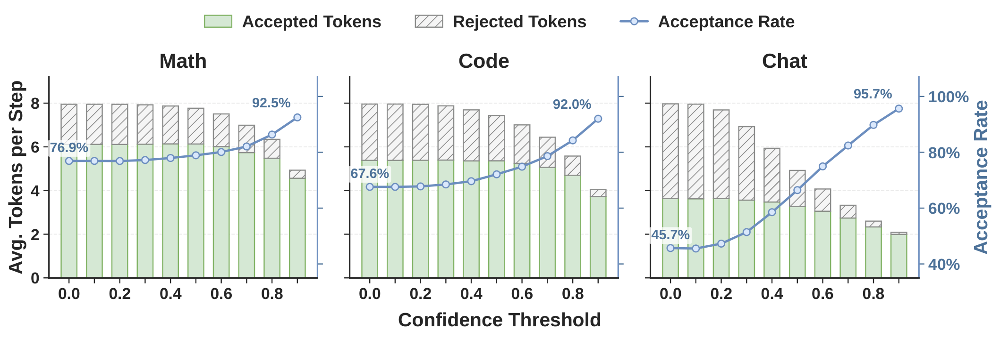
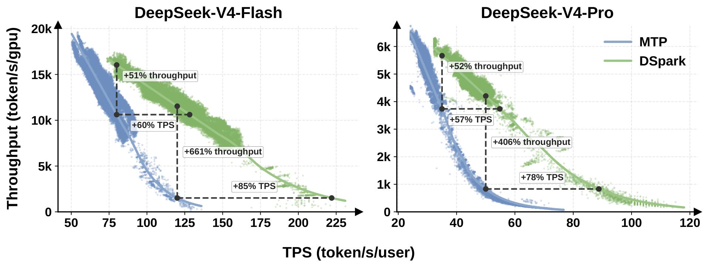
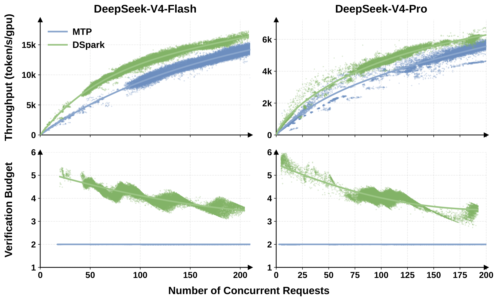

# 06 · DFlash 与 DSpark：并行 draft 与 verify 调度

EAGLE-3 把「浅层自回归 + 动态树」推到了开源 SOTA，但 $T_{\mathrm{draft}}$ 仍随树深线性增长，drafter 只能做浅。DFlash 把 draft 改成 block diffusion：一次 forward 填满 $\gamma$ 个位置，并用 KV injection 把 target 的多层 hidden 注入每一层 draft。DSpark（DeepSeek）在这副骨架上加了两件东西：廉价的半自回归 head 用来修 suffix decay，以及按置信度和硬件吞吐曲线决定「这一轮 verify 多长」的调度器。本篇介绍这两条 2026 年的并行 draft 路线。

> 论文：Chen et al., *DFlash: Block Diffusion for Flash Speculative Decoding*, [arXiv:2602.06036](https://arxiv.org/abs/2602.06036)；Cheng et al., *DSpark: Confidence-Scheduled Speculative Decoding with Semi-Autoregressive Generation*, [arXiv:2607.05147](https://arxiv.org/abs/2607.05147)。项目页：[z-lab.ai/projects/dflash](https://z-lab.ai/projects/dflash/)。
>
> 代码：SGLang `DFLASH` → [[sglang:python/sglang/srt/speculative/dflash_worker_v2.py]]；`DSPARK` → [[sglang:python/sglang/srt/speculative/dspark_components/dspark_worker_v2.py]]。`is_dflash_family()` 把两者收在一起。

---

## 1. 并行 draft 的动机

回到 $L=(T_{\mathrm{draft}}+T_{\mathrm{verify}})/\tau$。EAGLE-3 提高 $\tau$ 的手段是「更深的树 + 更准的逐步预测」，但

$$
T_{\mathrm{draft}}^{\mathrm{AR}} \;=\; \gamma_{\mathrm{eff}}\cdot t_{\mathrm{step}}
$$

为了压低 $T_{\mathrm{draft}}$，AR drafter 只能做 1 层，$\gamma$ 也不能太大；用树宽补覆盖率，又会把开销转移到 $T_{\mathrm{verify}}$ 上。

扩散 / 并行 drafter 一次输出整块：

$$
T_{\mathrm{draft}}^{\mathrm{par}} \;=\; t_{\mathrm{parallel}}
\quad\text{(nearly flat in }\gamma\text{)}
$$

于是可以使用**更深的 drafter 和更大的 $\gamma$**：5 层、$\gamma=16$ 的 DFlash，draft 延迟仍低于走 8 步的 1 层 EAGLE-3。论文 Fig 3 展示的正是这条「深度不再等于延迟」的开销对比。



> 图：并行 draft 的墙钟对层数敏感、对 $\gamma$ 不敏感；AR draft 相反。这是 DFlash 敢用 5 层的全部理由。（Chen et al. 2026, Fig 3；[arXiv:2602.06036](https://arxiv.org/abs/2602.06036)）

如果只把一个小扩散模型当 drafter、不看 target 内部，接受长度上不去（论文 Table 8，约 2–3×）。论文的关键论断是 the target knows best——大模型的 hidden 里已经包含多个未来 token 的信息，drafter 应该充当 adapter，而不是从零学习语言。

---

## 2. DFlash

### 2.1 一轮推理

1. Target 正常 decode / 上一轮 verify，留下 anchor（bonus）token，并抽出若干层 hidden
2. 多层 hidden 拼接、投影、RMSNorm，得到 fused context feature $H_{\mathrm{ctx}}$
3. Drafter 输入：`[Emb(anchor), MASK, MASK, …]`（$\gamma$ 个位置；共享且冻结的 target embedding）
4. 每一层 draft：块内双向 attention；$H_{\mathrm{ctx}}$ 注入到每一层的 K/V（而不是只作为第一层输入）
5. 一次 forward 出全部位置的 logits，共享 target LM Head
6. 单步 denoising（推理常用 1 步）→ 整块 draft
7. Target 按 [`01`](./01_draft_verify.md) 并行 verify



> 图：浅蓝是融合后的 target context feature，橙是 anchor，绿是 mask。它们在每个 draft layer 的双向 attention 里和 KV cache 排在一起；最后走冻结的 target LM Head。（Chen et al. 2026, Fig 2；[arXiv:2602.06036](https://arxiv.org/abs/2602.06036)）

KV injection 与 EAGLE-3「把 $g$ 当输入」的差别在于：EAGLE 把 fusion feature 和 embedding 拼接后从底部喂入，层数越深信号越稀薄；DFlash 把 $H_{\mathrm{ctx}}$ 写进**每一层**的 K/V，深度增加时 conditioning 不会衰减，因此接受长度能随层数增长（论文 §5.4.2）。

DSpark 论文把公式写清楚了：

$$
H_{\mathrm{ctx}}
=\mathrm{RMSNorm}\bigl(W_c[H^{(l_1)};\ldots;H^{(l_m)}]\bigr)
\qquad
K_i=[W_i^K H_{\mathrm{ctx}};\; W_i^K H_d],\;
V_i=[W_i^V H_{\mathrm{ctx}};\; W_i^V H_d]
$$

实现超参（论文默认）：5 层（Coder 8 层），block 16（LLaMA 3.1 用 10），从 target 均匀抽 5 层 hidden。

### 2.2 训练目标与 mask 设计

- **随机 anchor**：在回复里随机抽位置当块首，其余 mask。对应推理时「块总是接在 target 刚确认的 bonus 上」
- **块间不互看**：Flex Attention 稀疏 mask，块内双向 + 看注入的 context，跨块切断
- **位置加权 CE**：错误发生在块首会废掉整块，所以

$$
w_k \;=\; \exp\bigl(-(k-1)/\gamma_{\mathrm{decay}}\bigr)
$$

  块 size 16 时 $\gamma_{\mathrm{decay}}=7$。比均匀权重收敛更快、$\tau$ 更高：



> 图：块首权重大，逼 drafter 先把 $c_1$ 做准——和 $\mathbb{E}[\tau]$ 的连乘结构一致。（Chen et al. 2026, Fig 5；[arXiv:2602.06036](https://arxiv.org/abs/2602.06036)）
- embed / LM head 冻结共享，只训 draft Transformer



> 图：一条序列上同时训多个 draft 块。块与块之间切断，避免泄漏；每块都条件于注入的 target feature 和自己的 anchor。（Chen et al. 2026, Fig 4；[arXiv:2602.06036](https://arxiv.org/abs/2602.06036)）

用大 block 训出的模型，推理时可以缩小 block（16→8 几乎不掉性能），反过来则不行，这给 serving 留下了「负载高就减 $\gamma$」的调节空间。

### 2.3 实验结果

Qwen3-8B、temp=0、block 16：论文平均约 4.9× vs AR，相对 EAGLE-3（树 16）约 2.4×；MATH-500 上到 6.08×、$\tau \approx 7.9$。SGLang + 并发 1–32 仍有加速，Qwen3-8B 最高约 5.1×。thinking 模式同样 ≈4×。



> 图：同一套 Transformers backend。DFlash 在多数任务上是 EAGLE-3 的 ~2.5×。（Chen et al. 2026, Fig 1；[arXiv:2602.06036](https://arxiv.org/abs/2602.06036)）

---

## 3. Suffix decay 与 multi-modal collision

块内位置一次性输出 logits，无法条件于本块中已经采样的 token。当上下文「Sure, 」既可以接 `of course` 也可以接 `no problem` 时，边缘分布可能拼出 `of problem`——这是经典的 NAR 多模态碰撞问题（Gu et al. 2018）。

DSpark 用 **position-wise conditional acceptance** 来度量这件事：只统计「前 $k{-}1$ 个都被接受」的样本中第 $k$ 个仍被接受的比例。它剥离了连乘效应，看到的是各深度位置的「裸」预测能力。



> 图：Qwen3 上 chat 域的条件接受曲线。DFlash 在位置 1 明显高于 EAGLE-3（深层 + KV injection 的容量优势），几步之后被 AR 反超。但 $\mathbb{E}[\tau]=c_1+c_1c_2+\cdots$ 里每个项都含 $c_1$，所以「位置 1 更准」仍然让 DFlash 的接受长度赢面更大。（Cheng et al. 2026, Fig position_cond_accept；[arXiv:2607.05147](https://arxiv.org/abs/2607.05147)）

---

## 4. DSpark



> 图：两段新东西都在 step 2——Sequential Block 给并行 logits 加依赖；Hardware-Aware Prefix Scheduler 在 verify **之前**按 $c_i$ 和当前 SPS 曲线裁前缀。（Cheng et al. 2026, Fig 1；[arXiv:2607.05147](https://arxiv.org/abs/2607.05147)）

### 4.1 半自回归 head

并行骨干（就是 DFlash，有一处小改动：anchor 自己也作为一个预测位，输入 $\gamma$ 个 token 输出 $\gamma$ 份 logits）一次产出 hidden $h_1..h_\gamma$ 和 base logits $U_1..U_\gamma$。

串行阶段给每个位置加一个依赖已采样前缀的 bias $B_k$：

$$
p_k(v\mid x_0,x_{<k})
\;=\;
\mathrm{softmax}\bigl(U_k(v)+B_k(x_0,x_{<k},v)\bigr)
$$

论文给出两种 head：

**Markov head**（默认）：$B=W_1 W_2$，秩 $r{=}256$，$B(x_{k-1},\cdot)=W_1[x_{k-1}]W_2$。抽到 `of` 之后提升 `course`、压低 `problem`。只看前一个 token，足以修复 bigram 碰撞，算力开销极小。

**RNN head**：状态 $s_k$ 积累块内整段前缀，gate 更新后投影成 $B_k$。能看更远，开销稍大。

采样仍从左到右，但每步只是一次 embedding lookup 加一个小矩阵，$T_{\mathrm{sequential}}\ll T_{\mathrm{parallel}}$。

### 4.2 Confidence head

每个位置一个标量 $c_k=\sigma(w^\top[h_k;W_1[x_{k-1}]])$，监督标签就是 [`01`](./01_draft_verify.md) 的解析接受率

$$
c_k^* \;=\; 1-\tfrac12\|p_k^d-p_k^t\|_1
$$

$c_k$ 的语义是**条件**存活：前缀都被接受时，本位置仍被接受的概率。于是前缀 $1..j$ 的存活概率为

$$
a_j \;=\; \prod_{i\le j} c_i
$$

硬件调度需要用 $a_j$ 的绝对值估计 $\mathbb{E}[\tau]$，因此论文做了 Sequential Temperature Scaling：从左到右对累积乘积做一维温度校准，在保持顺序的前提下降低 ECE。

### 4.3 Hardware-aware prefix scheduler

同一组 $a_{r,j}$ 在空载和满载下值不值得 verify，结论完全不同：

- 空载：多 verify 一个 token 几乎不增加墙钟时间（仍在 memory-bound 区域）
- 满载：多出来的 token 占用 target 的 batch 位，可能挤掉其他请求

算法（论文 Algorithm 1，压缩版）：

```
对每个请求 r 算 a_{r,1}..a_{r,γ}
把所有 (r,j) 按 a_{r,j} 降序
B = R, τ* = R, Θ_best = R · SPS(R)     # SPS = 该引擎 profile 的 steps/s(batch)
按分数从高到低尝试「再纳入一个位置」:
    B += 1, τ* += a_{r,j}, Θ = τ* · SPS(B)
    若 Θ 上升: 接受这次纳入
    否则: 停
返回每个请求的前缀长度 ℓ_r
```

`SPS(B)` 是引擎在 batch=B 时的实测步频。优化目标直接是吞吐 $\Theta=\tau\cdot\mathrm{SPS}(B)$，而不是单请求的 $\tau$——这是「verify 更聪明」这个方向第一次成为生产算法。



> 图：confidence 阈值扫描。离线「卡一个阈值」无法同时照顾空载和满载；硬件感知调度按 $a_j$ 和 `SPS(B)` 选前缀。（Cheng et al. 2026, Fig confidence_threshold_sweep；[arXiv:2607.05147](https://arxiv.org/abs/2607.05147)）

SGLang 里 DSpark `supports_ragged_verify()`：各请求 verify 长度可以不同，CUDA Graph 按 token-bucket 而不是固定 $\gamma$ 分桶（`ragged_verify.py`）。

---

## 5. 离线与线上结果

离线：Qwen3-4B/8B/14B 上，DSpark 的宏平均接受长度相对 EAGLE-3 +30.9 / +26.7 / +30.0%，相对 DFlash +16.3 / +18.4 / +18.3%。

线上（DeepSeek-V4 serving，真实流量）：

- 相对生产基线 MTP-1，**同吞吐**下用户生成速度 Flash +60–85%、Pro +57–78%
- 严 SLA（Flash 120 TPS、Pro 50 TPS）下，基线吞吐会悬崖式下跌；DSpark 裁掉低置信后缀，保住容量，把以前达不到的交互档位打开



> 图：同容量下用户更快，或同延迟下容量更高。调度的收益在高并发才完整显现——单请求 benchmark 看不出第三根杠杆。（Cheng et al. 2026, Fig online_service；[arXiv:2607.05147](https://arxiv.org/abs/2607.05147)）



> 图：serving 的目标从来不是单条 speedup，是吞吐–延迟曲线。DSpark 把这条曲线往外推。（Cheng et al. 2026, Fig online_service_tradeoff；[arXiv:2607.05147](https://arxiv.org/abs/2607.05147)）

开源：DSpark checkpoint（V4-Flash / V4-Pro preview）+ DeepSpec 训练库（含 EAGLE-3、DFlash、DSpark）。

---

## 6. 三条路线的对照

| | EAGLE-3 | DFlash | DSpark |
|---|---|---|---|
| Draft 计算 | 浅层 AR × 树深 | 深层 **一次** 并行 | 同左 + 廉价串行 head |
| 位置依赖 | 有（逐步） | 块内无 | 半自回归补上 |
| Target feature | 输入融合 $g$ | **每层 KV injection** | 同 DFlash |
| Verify 拓扑 | 动态树 | 定长块 | **变长前缀**（per-request） |
| 优化的杠杆 | $\tau\uparrow$（准） | $T_{\mathrm{draft}}\downarrow$ + $\tau\uparrow$（前缀准） | 再加 $T_{\mathrm{verify}}$ 浪费 $\downarrow$ |
| 典型战场 | 单卡 / 中小 batch | 单卡长 CoT | **高并发生产** |

DFlash 证明了扩散模型不必与 AR 比拼终局生成质量，当 drafter 就足够；DSpark 证明了并行 draft 要进入生产，必须同时解决「块内依赖」和「verify 预算」两个问题——后者已经是 serving 问题，而不是模型问题。

---

下一篇：[07 · Serving 中的 speculative decoding](./07_serving.md)——把上述算法放进 batch、CUDA Graph、P-D 分离和 SGLang 的算法枚举中讨论，并给出一条选型决策。
