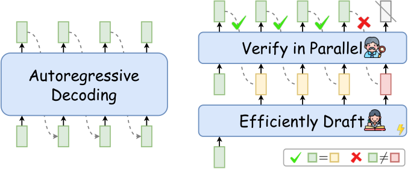
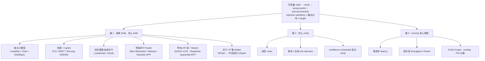
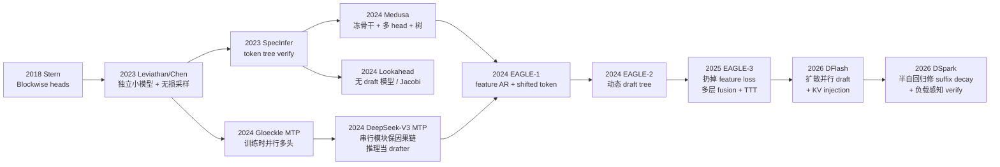
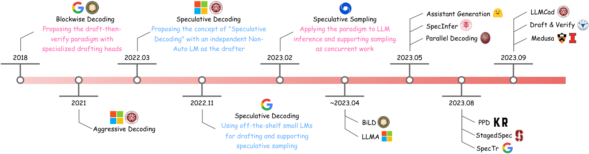

# Speculative Decoding —— 无损加速自回归 decode

本章讨论 speculative decoding：一类在不改变输出分布的前提下加速自回归 decode 的方法。本章先回答两个基础问题——decode 为什么慢、draft-then-verify 为什么能做到无损加速——再把 MTP、EAGLE、DFlash、DSpark 等方法放进同一张设计空间中比较，最后讨论它们在真实 serving 中的落地方式。

## 前置知识

本章假设读者具备以下背景：

- 知道 Transformer decode 的基本过程：每步生成一个 token，下一步依赖上一步的采样结果。
- 知道 GPU 的算力（FLOP/s）与 HBM 带宽两道性能天花板；可对照 [00 · Roofline model：两道天花板](../hpc/00_roofline_model.md)。

---

## 0. 核心思路

Speculative decoding 的出发点是一个不对称的事实：**大模型生成慢、验证快**。decode 每步都要把整份权重从 HBM 读一遍，却只计算一个 token，处于深度 memory-bound 状态；而一旦手里已经有「接下来 $\gamma$ 个 token 的猜测」，target 可以在一次 forward 里把 $\gamma+1$ 个位置的 logits 全部算出来，而这次 forward 的开销和只算 1 个 token 几乎相同。speculative decoding 正是利用这一点：用开销小的 drafter 写出猜测，用开销大的 target 做并行 verify，再用 rejection sampling 保证输出分布与 target 单独采样完全相同。

这个思路可以用一条延迟公式概括（贯穿本章，DFlash / DSpark 论文也使用同一公式）：

$$
L \;=\; \frac{T_{\mathrm{draft}} + T_{\mathrm{verify}}}{\tau}
$$

| 符号 | 语义 |
|---|---|
| $T_{\mathrm{draft}}$ | 写出 $\gamma$ 个候选 token 的墙钟时间 |
| $T_{\mathrm{verify}}$ | target 对整块候选做一次并行 verify 的时间 |
| $\tau$ | 这一轮实际留下的 token 数（接受的 draft + 1 个 bonus / correction） |
| $L$ | **每个最终 token 的平均延迟** |

加速只有三个方向：让 draft 更快（压低 $T_{\mathrm{draft}}$）、让 draft 更准（提高 $\tau$）、让 verify 更聪明（不把 $T_{\mathrm{verify}}$ 浪费在几乎必被拒绝的后缀上）。本章讨论的所有方法，都是在这三个方向上做不同的取舍。

> 图：Xia et al. 2024 survey 中的经典对比。左边每步必须等上一步采样完成；右边先以低成本写出一串猜测，由 target 一次 verify，匹配的部分留下，分叉点之后丢弃。（Xia et al. 2024, Fig 1；[arXiv:2401.07851](https://arxiv.org/abs/2401.07851)）

---

## 1. 设计空间的三根轴

文献中的方法名很多（Medusa / Lookahead / EAGLE / MTP / DFlash / DSpark / n-gram 等），但它们并不是各自独立的发明，而是同一副骨架上三个轴的不同取值。

阅读任何一篇新论文时，可以先问三个问题：

1. **Draft 的输入是什么？** 只看 token，还是复用 target 的 hidden feature？一次出 1 个还是 $\gamma$ 个？位置之间有没有依赖？
2. **Verify 的拓扑是什么？** 一条链，还是一棵树，还是按置信度裁剪过的变长前缀？
3. **优化目标是什么？** 单用户 tokens/s，还是 serving 在固定 SLA 下的吞吐？

回答这三个问题，就能把「看起来很像」的 MTP 与 EAGLE、「都是并行 draft」的 DFlash 与 Medusa、以及 DSpark 相对 DFlash「多了调度」这些容易混淆的差别一次分清，细节在后续各篇展开。

---

## 2. 贯穿符号

| 符号 | 名字 | 语义 |
|---|---|---|
| $M_t$ / $p(\cdot)$ | target | 要加速的大模型及其条件分布 |
| $M_d$ / $q(\cdot)$ | draft / approximation | 廉价猜测模型及其条件分布 |
| $\gamma$ | speculation length / block size | 一轮最多 draft 的 token 数 |
| $\alpha$ / $\beta$ | acceptance rate | 单个 draft token 被接受的期望概率 |
| $\tau$ | accepted length | 一轮实际产出的 token 数（含 bonus） |
| $c$ | cost coefficient | $T(M_d)/T(M_t)$，draft 相对 target 的单步代价 |
| bonus token | — | 整块都接受时，target 在 $\gamma{+}1$ 位置白送的那个 token |
| correction / residual | — | 拒绝点上从 $\mathrm{norm}(\max(0,p-q))$ 重采样的替换 token |
| feature | 倒数第二层 hidden | LM head 之前的连续表示；EAGLE 在这个空间做自回归 |
| tree attention | — | 用一张特殊 mask 让一次 forward 同时 verify 多条候选路径 |

---

## 3. 阅读顺序

| 文件 | 内容 | 对应论文 / 代码 |
|---|---|---|
| `README.md`（本文） | 整体图景、三轴设计空间、阅读顺序、路线关系图 | survey [2401.07851](https://arxiv.org/abs/2401.07851) |
| [00 · Decode 的带宽瓶颈与 verify 的低成本](./00_decode_bottleneck.md) | decode 为什么慢：memory-bound GEMV、prefill/decode 差异、为什么一次前向可以近乎免费地验证多个 token | [00 · Roofline model：两道天花板](../hpc/00_roofline_model.md)、Medusa roofline |
| [01 · Draft-then-verify：无损算法核心](./01_draft_verify.md) | 算法不变量：Leviathan/Chen 的 speculative sampling、rejection sampling 的无损性、$\mathbb{E}[\tau]$、最优 $\gamma$ | [2211.17192](https://arxiv.org/abs/2211.17192) |
| [02 · Token Tree 与 Tree Attention](./02_tree_attention.md) | 线性 draft 的上限；token tree + tree attention；KV 怎么铺、被拒后怎么回滚 | SpecInfer、Medusa Fig 2 |
| [03 · 早期 Draft 方法](./03_draft_families.md) | 独立小模型 / 检索 / Lookahead / Medusa；各自的瓶颈在哪 | Medusa、Lookahead、PLD |
| [04 · Multi-Token Prediction：从训练目标到推理 drafter](./04_mtp.md) | MTP：Gloeckle 并行多头（训练）→ DeepSeek-V3 串行 MTP（训练+推理） | [2404.19737](https://arxiv.org/abs/2404.19737)、[2412.19437](https://arxiv.org/abs/2412.19437) §2.2 |
| [05 · EAGLE 三代：feature 自回归、动态树、Training-Time Test](./05_eagle.md) | EAGLE-1/2/3：feature 自回归、shifted token、动态树、training-time test | [2401.15077](https://arxiv.org/abs/2401.15077) 起 |
| [06 · DFlash 与 DSpark：并行 draft 与 verify 调度](./06_dflash_dspark.md) | 并行/扩散 draft：DFlash 的 block diffusion + KV injection；DSpark 的半自回归 + confidence-scheduled verify | [2602.06036](https://arxiv.org/abs/2602.06036)、[2607.05147](https://arxiv.org/abs/2607.05147) |
| [07 · Serving 中的 speculative decoding](./07_serving.md) | 落到 serving：batch 越大 spec 越不划算、CUDA Graph、SGLang 算法枚举、选型决策 | `spec_info.py`、[07 · CUDA Graph](../torch/07_cuda_graph.md) |

建议按编号顺序阅读：先由本文建立三轴的整体图景，`00` 说明这件事为什么值得做，`01` 给出无损算法（后面所有方法都复用这一套 accept/reject），`02` 把 verify 从链升级到树，`03` 回顾早期 draft 方法，`04` 与 `05` 介绍当前生产主流的 MTP 与 EAGLE，`06` 是 2026 年的并行 draft 前沿，`07` 则把算法放进真实 serving 约束中讨论。

---

## 4. 各路线的演化关系

下面这张图概括了各方法的演化关系。整体趋势是 draft 越来越贴近 target，对 $\gamma$ 变大也越来越不敏感：

有几对关系容易混淆，先在这里说明：

1. **MTP 不是一种 verify 算法，而是一种 draft 来源。** Gloeckle 的并行多头本来是训练目标；DeepSeek-V3 把它改成串行、保完整因果链的辅助模块，推理时可以丢掉（只为训练增益），也可以留下来当 drafter（报告中第二 token 接受率 85–90%，约 1.8× TPS）。SGLang 里 DeepSeek 的 `--speculative-algorithm NEXTN` 就是这条路，实现上挂在 EAGLE worker 家族里。
2. **EAGLE 和 DeepSeek MTP 共享「保因果链」这一原则**，但目标相反：EAGLE 为推理加速训练一个外挂层；V3 MTP 主要为训练提高数据效率，推理加速是副产品。EAGLE 明确复用 target 的 embedding / LM head，只训一个（或一层）autoregression head。
3. **Medusa 是「并行、无条件依赖」的一端，EAGLE 是「串行、有条件依赖」的一端。** Medusa 各 head 同时看同一个 $h_t$ 预测 $t{+}2,t{+}3,\ldots$，位置之间互不可见，接受率随位置快速下降；EAGLE 每步用「已采样 token + 上一步 feature」往前走，接受率高，但 $T_{\mathrm{draft}}\propto\gamma$。
4. **DFlash 把 Medusa 的「一次出一块」和 EAGLE 的「使用 target feature」合到一起**，用 block diffusion + KV injection，让 $T_{\mathrm{draft}}$ 几乎与 $\gamma$ 无关，因此可以使用 5 层 drafter、$\gamma=16$。代价是块内位置互相独立，产生 suffix decay 与 multi-modal collision 问题。
5. **DSpark 在 DFlash 的骨架上加入两件东西：廉价的串行修正和 serving 调度。** 半自回归 head 修复块内依赖；confidence head + hardware-aware prefix scheduler 决定「这一轮到底 verify 多长」——这是「verify 更聪明」这第三个方向第一次成为生产系统的核心设计。DeepSeek-V4 线上相对 MTP-1 基线，同吞吐下单用户速度 +60–85%。

> 图：survey 整理的演进时间线。2023 年 Leviathan/Chen 确立「无损 + 独立 draft 模型」范式之后，2024 年起方法按「谁来 draft」分化。（Xia et al. 2024, Fig 2；[arXiv:2401.07851](https://arxiv.org/abs/2401.07851)）

---

## 5. 方法对照表

表中数字是论文或技术报告中的代表性量级，跨设定不可直接比较，用来建立「各方法分别在优化哪个方向」的直觉。

| 路线 | draft 形态 | 吃 target feature? | $T_{\mathrm{draft}}$ vs $\gamma$ | 典型 $\tau$ / speedup | 无损? | 生产位置 |
|---|---|---|---|---|---|---|
| 独立小模型 | 另训/另选一个小 LM，逐 token | 否 | $\propto\gamma$ | 2–3×（要小且像） | 是 | 有现成小模型时 |
| n-gram / PLD | 检索，无模型 | 否 | ≈0 | 看任务，代码/重复高 | 是 | SGLang `NGRAM` |
| Lookahead | Jacobi + n-gram，无外挂模型 | 否 | 中 | ~1.5–2× | greedy 为主 | 少见 |
| Medusa | K 个 MLP head，并行 | 只用 top feature | 一次 | ~2–2.8× | Medusa-1 是；typical accept 放宽 | 被 EAGLE 替代 |
| Gloeckle MTP | 训练时 n 个独立 head | 共享 trunk | 推理可选用 | 代码上到 ~3× | 用 head 做 spec 时需 verify | 训练技巧 |
| DeepSeek MTP | 串行 1 层 TRM，共享 embed/head | 是，链式 hidden | $\propto D$（常 D=1） | 1.8×，accept 85–90% | 是 | DeepSeek-V3/R1 默认 |
| EAGLE-1 | 1 层 decoder，feature AR | top feature + shifted token | $\propto$ 树深 | ~2.5–3.5× | 是 | 过渡 |
| EAGLE-2 | 同上 + 动态树 | 同上 | $\propto$ 树深 | ~3–5× | 是 | 仍常见 |
| EAGLE-3 | 直接预测 token + 多层 fusion + TTT | 低/中/高三层 | $\propto$ 树深 | ~3–6.5× | 是 | 2025 开源 SOTA |
| DFlash | 5 层 block diffusion | 多层，**KV injection** | ≈ 一次 forward | 论文到 ~6× vs AR | 是 | SGLang `DFLASH` |
| DSpark | DFlash 骨干 + 串行 head | 同上 | ≈ 一次 + 廉价序列 | $\tau$ 再高一截；线上 vs MTP-1 +60–85% 用户速度 | 是 | DeepSeek-V4，SGLang `DSPARK` |

---

## 6. 参考代码与论文主线

参考代码（SGLang，[[sglang:]]）：

- [[sglang:python/sglang/srt/speculative/spec_info.py]] —— `SpeculativeAlgorithm` 枚举：`EAGLE` / `EAGLE3` / `DFLASH` / `DSPARK` / `NGRAM` / `STANDALONE` / `FROZEN_KV_MTP`
- [[sglang:python/sglang/srt/speculative/eagle_worker_v2.py]]、`multi_layer_eagle_worker_v2.py` —— EAGLE / DeepSeek 式 MTP
- [[sglang:python/sglang/srt/speculative/dflash_worker_v2.py]]、`dspark_components/` —— DFlash / DSpark
- [[sglang:python/sglang/srt/speculative/eagle_utils.py]] —— `build_tree_kernel_efficient`（tree attention mask）
- CUDA Graph 侧：[07 · CUDA Graph](../torch/07_cuda_graph.md) 的 `TARGET_VERIFY` 路径

论文主线（按本章阅读顺序）：

- Leviathan et al., *Fast Inference from Transformers via Speculative Decoding*, ICML 2023. [arXiv:2211.17192](https://arxiv.org/abs/2211.17192)
- Chen et al., *Accelerating Large Language Model Decoding with Speculative Sampling*, 2023. [arXiv:2302.01318](https://arxiv.org/abs/2302.01318)
- Miao et al., *SpecInfer*, 2023. [arXiv:2305.09781](https://arxiv.org/abs/2305.09781)
- Xia et al., *Unlocking Efficiency … A Comprehensive Survey of Speculative Decoding*, 2024. [arXiv:2401.07851](https://arxiv.org/abs/2401.07851)
- Cai et al., *Medusa*, 2024. [arXiv:2401.10774](https://arxiv.org/abs/2401.10774)
- Li et al., *EAGLE / EAGLE-2 / EAGLE-3*, 2024–2025. [2401.15077](https://arxiv.org/abs/2401.15077) / [2406.16858](https://arxiv.org/abs/2406.16858) / [2503.01840](https://arxiv.org/abs/2503.01840)
- Gloeckle et al., *Better & Faster LLMs via Multi-token Prediction*, 2024. [arXiv:2404.19737](https://arxiv.org/abs/2404.19737)
- DeepSeek-AI, *DeepSeek-V3 Technical Report* §2.2 MTP. [arXiv:2412.19437](https://arxiv.org/abs/2412.19437)
- Chen et al., *DFlash*, 2026. [arXiv:2602.06036](https://arxiv.org/abs/2602.06036)
- Cheng et al., *DSpark*, 2026. [arXiv:2607.05147](https://arxiv.org/abs/2607.05147)

---

## 7. 与其他章节的关系

- **decode 的带宽墙**：[00 · Roofline model：两道天花板](../hpc/00_roofline_model.md) 已经算过 GEMV 的 $I\approx 2/s$。本章 `00` 把这一结论落到「一次 verify 多个 token 几乎免费」上。
- **CUDA Graph**：spec 的 target-verify 和普通 decode 一样是固定 shape 的短序列，SGLang 走 `ForwardMode.TARGET_VERIFY`，见 [07 · CUDA Graph](../torch/07_cuda_graph.md)。
- **serving 章**（[推理服务：从单请求推理到 SLO-aware 集群](../serving/README.md)）规划 continuous batching / P-D 分离；本章 `07` 只讨论加入 spec 之后多出来的约束（verify 占用 batch 容量、被拒后要回滚 KV、树比链更占显存）。

---

下一篇：[00 · Decode 的带宽瓶颈与 verify 的低成本](./00_decode_bottleneck.md)——用 roofline 模型说明 decode 为什么慢、verify 为什么便宜，本章后面所有的加速公式都建立在这个结论上。
