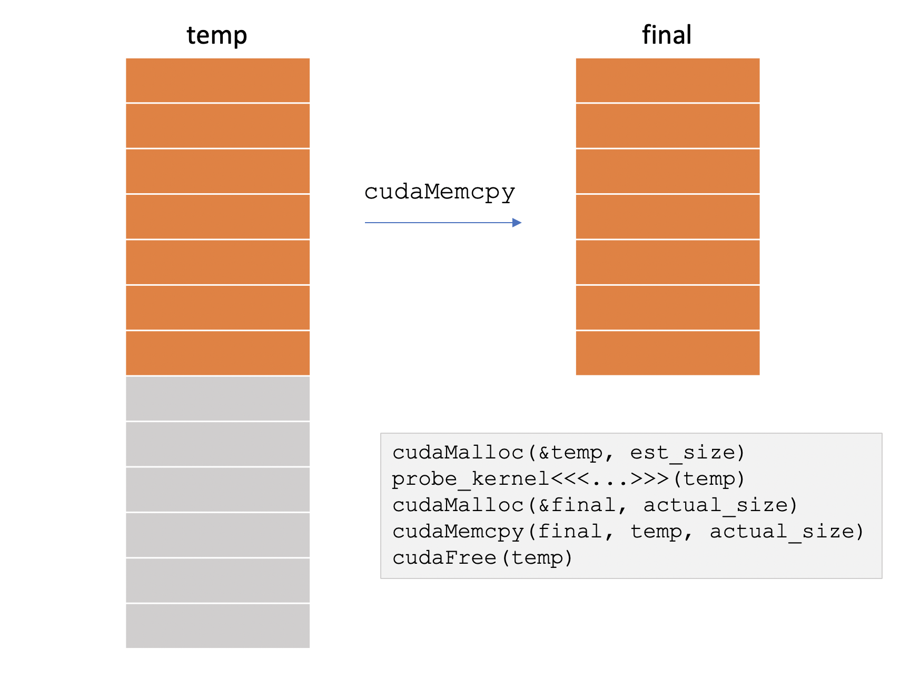

# 06 · Caching Allocator 与 CUDA VMM

> 本篇讲 PyTorch 显存管理的完整机制。阅读之前建议先读过 [01](./01_tensor_memory_layout.md)（`Tensor = (Storage, offset, shape, stride)`，真正占显存的是 Storage）和 [05](./05_cuda_streams_memory_amp.md) §1–§3（CUDA 异步、stream、`record_stream`），并知道 `cudaMalloc` 会向驱动申请一块**同时带虚拟地址和物理页**的连续区域。下一篇 [07 · CUDA Graph](./07_cuda_graph.md) 的「地址必须固定」约束（见其 §1.3），正是落实在本篇讲的 private pool 上。
>
> [05 §4](./05_cuda_streams_memory_amp.md#4-caching-allocator) 给过一句话概括：「不直接 `cudaMalloc`，free 的内存进入缓存池」。本篇把这句话展开：allocator 的三级结构、碎片化的精确定义、CUDA VMM 把 VA 与 PA 解耦之后 `expandable_segments` 为什么能解决变长分配的问题，以及 2.x 之后的一组新配置项（`MemPool` / `cudaMallocAsync` / `graph_capture_record_stream_reuse` / `expandable_segments_reserve` …）。
>
> 观测 API（`memory_stats` / snapshot / memory_viz）仍以 [05 §4](./05_cuda_streams_memory_amp.md#4-caching-allocator) 为准；本篇只在需要明确「数字对应哪一级结构」时引用它们。
>
> 源码锚点：PyTorch [[pytorch:c10/cuda/CUDACachingAllocator.cpp]] 的 `ExpandableSegment` 与文件头注释（实现与 `expandable_segments` 语义）；官方语义见 [CUDA semantics · Memory management](https://docs.pytorch.org/docs/main/notes/cuda.html#memory-management)。Megatron / SGLang 的 graph pool 用法见 [07](./07_cuda_graph.md)；DeepEP 基于 VMM 自行实现 elastic buffer 见 [06 · DeepEP：V1 (legacy/NVSHMEM) 与 V2 (elastic/NCCL Gin)](../moe/06_deepep.md) §4.5。

---

## 1. 两层账本：allocated 与 reserved

用户侧的抽象模型是：

```
可用显存 -= alloc(size)
可用显存 += free(ptr)
```

真实 GPU 上有两层：

| 量 | 谁在记账 | 对应 API | `nvidia-smi` 看得到？ |
|---|---|---|---|
| **allocated** | 当前还活着的 tensor Storage | `torch.cuda.memory_allocated()` | 否（它看不到「池里空闲」） |
| **reserved** | allocator 已经向 CUDA 驱动要走、还没还回去的总量 | `torch.cuda.memory_reserved()` | **是**（进程占用 ≈ reserved + 驱动/NCCL 等绕过 allocator 的部分） |

因此，`del tensor` 之后 `nvidia-smi` 显示的占用不降是正常的：Storage 的字节回到了 **caching allocator 的池**中，并没有还给驱动。`empty_cache()` 才会把整段空闲的 segment 还给驱动（带同步），而且它解决不了「allocated 已经顶满」的真实 OOM。

> **性质标注**：`empty_cache()` 会引入同步、打乱缓存热度，平时不要把它当作「省显存」的手段；只在需要给同卡上的其他进程让出显存、或调试 reserved 虚高问题时使用。

---

## 2. `cudaMalloc` / `cudaFree` 的开销问题

`cudaMalloc` 和 `cudaFree` 在驱动中都是开销很大的操作：

1. **同步**：`cudaFree` 历史上会等当前 context（开启 P2P 时甚至是 peer context）上的 in-flight 工作做完，见 NVIDIA VMM 博客「Avoiding device synchronization on cudaFree」。热路径上每次 free 都同步，等于把 [05](./05_cuda_streams_memory_amp.md) 的异步流水线打断。
2. **慢**：驱动要维护 VA 区间、物理页、peer mapping，复杂度随已有分配数上升。
3. **不能局部伸缩**：一块 `cudaMalloc` 分配的区域，大小固定。要变大只能「新 malloc + memcpy + free」——峰值显存是旧块加新块，超过半张卡就无法再扩。

NVIDIA 用下图描述了「先估大、算完、再拷到刚好大小」的流程。VMM 与 expandable segments 要消除的，正是中间那一次 `cudaMemcpy` 和双倍峰值：



> 图：先按 `est_size` `cudaMalloc` 一块 temp（上半有效、下半浪费），kernel 写出真实长度后再 `cudaMalloc` 一块 final、`cudaMemcpy`、`cudaFree(temp)`。峰值是 `est_size + actual_size`，还多一次拷贝。（Landaverde / Sakharnykh, NVIDIA 2020, Fig 6；[Introducing Low-Level GPU Virtual Memory Management](https://developer.nvidia.com/blog/introducing-low-level-gpu-virtual-memory-management/)）

PyTorch 的应对分两层：

- **caching allocator（本节到 §4）**：少调用 `cudaMalloc`/`cudaFree`，把已要来的段切成 block 复用。
- **CUDA VMM + expandable segments（§5–§6）**：连「段本身」都可以按页涨缩，并且**跨段不可 merge** 这条硬边界被拆掉。

---

## 3. Caching allocator 的三级结构

`aten::empty` / `empty_like` 最终走到 `c10::cuda::CUDACachingAllocator`。它不按 tensor 去 `cudaMalloc`，而是维护：

```
DeviceCachingAllocator          每张卡一个
  └─ Pool                       按 (small|large) × stream × mempool 分开
       └─ Segment               一次向驱动要的连续区（cudaMalloc 或 VMM map）
            └─ Block            一个 Storage 对应一个 allocated block
```

这些常量定义在 `CUDACachingAllocator.cpp` 的文件头注释中（`kSmallSize` / `kSmallBuffer` / `kLargeBuffer` / `kRoundLarge`）：

| 符号 | 值 | 语义 |
|---|---|---|
| `kMinBlockSize` | 512 B | 请求至少 round 到 512 B |
| `kSmallSize` | **1 MiB** | `≤ 1 MiB` 走 `small_blocks`，`> 1 MiB` 走 `large_blocks` |
| `kSmallBuffer` | 2 MiB | small pool 的 segment / 物理页粒度 |
| `kLargeBuffer` | **20 MiB** | large pool 的打包粒度（可用 `large_segment_size_mb` 改） |
| `kMinLargeAlloc` | 10 MiB | 1–10 MiB 的请求，没有合适空闲块时，先拿一块 20 MiB 再 split |
| `kRoundLarge` | 2 MiB | 非 expandable 路径下，≥10 MiB 的 segment 上圆到 2 MiB |

**small 与 large 是两套完全不相通的池**：small 的空闲块永远无法满足 large 的请求，反之亦然。ezyang 称之为 **1 MiB loophole**：把 tensor 从 2 MiB 缩小到 0.5 MiB，反而可能让 reserved 增加，因为第二次分配进入了另一条 pool（[When does fragmentation occur in the CUDA caching allocator?](https://docs.pytorch.org/devlogs/eager/2026-06-01-cuda-caching-allocator/), Yang 2026）。

官方 memory_viz 的 Allocator State History 就是这套结构的现场：


> 图：左侧是 alloc/free 事件流，右侧每一行是一个 segment、彩色是 allocated block、留白是空闲。底部是选中事件的调用栈（`CUDACachingAllocator` → `aten::empty` → …）。「大段里卡着小空洞」在这张图上一眼可见。（PyTorch 文档 *Understanding CUDA Memory Usage*；[torch_cuda_memory](https://docs.pytorch.org/docs/main/torch_cuda_memory.html)）

### 3.1 split / merge / best-fit

一次 `alloc(n)` 的逻辑（文件头注释 + `malloc` 路径）：

1. 把 `n` 按 512 B 以及 `roundup_power2_divisions` 上圆，得到请求尺寸 `s`。
2. 在**当前 stream 对应的那个 pool** 里，找**能装下 `s` 的最小空闲 block**（best-fit）。
3. 若 block 明显更大，**split**：前半给这次请求，后半挂回空闲表。`max_split_size_mb` 禁止切开「太大」的空闲块，避免大块被小请求切碎。
4. 找不到：向驱动要新 segment（`cudaMalloc` 或 expandable 路径的 `cuMemCreate`+`cuMemMap`），再 split。
5. 驱动也失败：先试着还**未切分的整段空闲 segment**（`release_cached_blocks`，**会同步**），再试一次；还失败就 OOM。

`free` 时：把 block 标成空闲，若左右邻居也空闲则 **merge**。merge 的规则只有一条：

> **只有同一 segment 里、地址相邻、且两边都 free 的 block 才能 merge。** 中间夹着一块仍在使用的 block，两边的空洞永远合不起来。不同 `cudaMalloc` 段之间，连「地址看起来挨着」都不算相邻。

### 3.2 分配与 stream 绑定

Block 带着它被分配时的 `cudaStream_t`。**free 之后，这块只能被同一条 stream 再次拿走**——因为别的 stream 可能还没执行到「这块已经没人用」的时间点。这就是 [05 §2](./05_cuda_streams_memory_amp.md#2-stream) `record_stream` 的来历：张量在 stream A 分配、被 stream B 使用时，必须告诉 allocator「B 也在用」，否则 A 上的后续 alloc 可能把同一块内存再发出去，B 读到的是别人的数据。

> **性质标注**：跨 stream 漏掉 `record_stream` 造成的是**静默数据损坏**，而不是立刻 OOM。FSDP 和 Megatron 手写 overlap 时，这是第一条必须遵守的规则。

### 3.3 分配失败后的重试路径

找不到可用块时，allocator 不会立刻报错，而是按下面的路径逐级重试：

```
cache miss
  → cudaMalloc / map 新段
      → 失败：释放未 split 的空闲段，retry
          → 再失败：release_cached_blocks（同步所有相关 stream，尽量归还）
              → 再失败：OutOfMemoryError
```

`garbage_collection_threshold` 的意义在于：**在走到那次昂贵的 sync-and-reclaim-all 之前**，按「较老、最近未被复用的空闲块优先」的策略主动归还一部分。默认 `1.0` 表示不主动回收。对 serving 这类延迟敏感的场景，可以设成 `0.8` 一类的值，用偶发的小回收换取避免偶发的大同步。

---

## 4. 碎片化：三种无法 merge 的情况

「reserved 充足、allocated 不高，却仍然 OOM」并非玄学，它对应三种**无法 merge** 的情况：

```
① 跨 segment（cudaMalloc 段与段之间永远不能拼）
② 段内被 live block 钉住（free | live | free —— 两边合不成大块）
③ 跨 pool（small ↔ large、stream A ↔ stream B、default pool ↔ graph pool）
```

定义式（和 [05](./05_cuda_streams_memory_amp.md) 的字段对齐）：

```
碎片 ≈ reserved - allocated
硬伤 = inactive_split_bytes     # 空闲但卡在「还有别人在用」的 segment 里
```

### 4.1 分配顺序敏感：16 MiB 与 32 MiB 的例子

关闭 expandable 时，大于 1 MiB 的请求各自 `cudaMalloc` 一段。8 次 16 MiB 的分配会留下 **8 个独立的 16 MiB 段**；全部 free 之后，这 8 段仍然合不出一次 32 MiB——allocator 只能再 `cudaMalloc` 4 个 32 MiB 的段，reserved 从 128 MiB 翻倍到 256 MiB。反过来，先分配 4 个 32 MiB、再分配 8 个 16 MiB，32 MiB 的段可以被 split 复用，reserved 停在 128 MiB。

同一组工作量，分配顺序就能决定一倍的显存差距。这就是变长 batch、多张 CUDA Graph 共享 pool 时「必须从大到小 capture」的原因（SGLang 的 `reversed(capture_bs)`，见 [07](./07_cuda_graph.md) §3）。

### 4.2 expandable 无法解决的碎片

段内的情况 ② 在 expandable 打开之后**仍然存在**。四个 16 MiB 中只释放第 0、第 2 个，中间两块仍在使用——总空闲够 32 MiB，最大连续空闲却只有 16 MiB，下一次 32 MiB 只能继续往段尾 map 新页。**只有这一轮相关的分配全部 free 之后，相邻空闲才能并回一整块。** CUDA Graph 共享 pool 之所以有效，是因为图与图不并发、两次 capture 之间可以把上一次的块释放干净（Yang 2026）。

训练 step 中，权重、KV、长寿命 workspace 与短寿命的激活块交错存在，这属于情况 ②；expandable 消除的是 ①，并不能消除所有碎片。

---

## 5. CUDA VMM：VA 与 PA 的解耦

### 5.1 传统 `cudaMalloc` 的局限

一次 `cudaMalloc(size)` 同时做三件事：

```
① 在进程的 GPU 虚拟地址空间里占一段连续 VA
② 从 GPU 物理显存里扣一段 PA（按 GPU page，今天通常 2 MiB）
③ 把 PA map 进这段 VA，并给当前 device 读写权
```

三者绑在一个指针的生命周期上。后果：

- 不能「先占一大段 VA、PA 以后再补」——`cudaMalloc` 会立刻扣掉 `size` 那么多的物理显存。
- 不能把两块已有 PA **接到同一段 VA 后面**而不拷数据。
- 不能把一段 VA 里暂时不用的 PA unmap 还给驱动、指针还留着。
- `cudaFree` 往往同步（§2）。

### 5.2 VMM 的四步原语

CUDA Driver 的 Virtual Memory Management（CUDA 10.2 起可用）把上面三件事拆成可独立调用的 API（概念上等于 host 侧的 `mmap` / `munmap`；官方指南 [CUDA Programming Guide §4.16](https://docs.nvidia.com/cuda/cuda-programming-guide/04-special-topics/virtual-memory-management.html)）：

```
cuMemGetAllocationGranularity   查对齐（MINIMUM / RECOMMENDED）
        │
        ▼
cuMemAddressReserve(va, va_size)     ① 只占 VA，不扣 PA，几乎免费
        │
        ▼
cuMemCreate(&handle, pa_size, prop)  ② 只扣 PA，得到不带地址的 handle
        │                            prop.location = DEVICE / HOST_NUMA / …
        ▼
cuMemMap(va + off, pa_size, handle)  ③ 把 handle 贴到 VA 的某一段
        │
        ▼
cuMemSetAccess(va, size, desc)       ④ 默认 PROT_NONE，必须显式给 device 开 RW
```

释放按反序进行：先 `cuMemUnmap`，再 `cuMemRelease(handle)`，整段 VA 都 unmap 完之后再 `cuMemAddressFree`。

`prop` 决定物理页落在哪：`CU_MEM_LOCATION_TYPE_DEVICE` 是 HBM，`CU_MEM_LOCATION_TYPE_HOST_NUMA` 是某颗 CPU 的 NUMA 节点。**同一段 VA 可以前半 map 显存、后半 map host**——kernel 里仍是普通的指针加法。这就是 DeepEP V2 elastic buffer 的基础（[06 · DeepEP：V1 (legacy/NVSHMEM) 与 V2 (elastic/NCCL Gin)](../moe/06_deepep.md) §4.5，[[deepep:csrc/kernels/backend/symmetric.hpp#L145-L186]]）。

handle 还能 `cuMemExportToShareableHandle` 成 POSIX fd / Windows HANDLE，对端 `cuMemImportFromShareableHandle` 再 map——跨进程共享、NCCL user-buffer registration、graphics interop 都走这条路径，而不是老的 `cudaIpc*`（VMM 分配不支持 legacy IPC）。

### 5.3 与 UVM 的边界

`cudaMallocManaged` 也能「先占 VA、用的时候再迁页」，但：

- 靠 page fault / prefetch 驱动，DL 热路径上的 fault 会造成性能抖动；官方 notes 明确**不推荐**用 UVM 当训练主分配。
- 不能走 `cudaIpc*`，和 graphics interop 也不通。
- Windows / 部分嵌入式平台没有 on-demand migration。

VMM 是**显式**的：你决定何时 `Create`/`Map`/`Unmap`，没有隐式迁页。PyTorch expandable segments 和 DeepEP elastic 都选择了这条路，而不是 UVM。

### 5.4 粒度与代价

`cuMemCreate` 的 size 必须对齐 `cuMemGetAllocationGranularity`。GPU 物理页今天是 **2 MiB**。map/unmap 的开销大致正比于 **handle 个数**（十个 2 MiB handle 比一个 20 MiB handle 大约贵 10 倍），并且常带同步。所以 allocator 不会真的按 2 MiB 去 large pool 里一张张贴——large 用 20 MiB 一个 handle，small 用 2 MiB。

---

## 6. Expandable segments：VMM 与 caching allocator 的结合

打开方式（进程启动、第一次 CUDA 分配之前）：

```bash
# 正式名是 PYTORCH_ALLOC_CONF；PYTORCH_CUDA_ALLOC_CONF 是别名
export PYTORCH_ALLOC_CONF=expandable_segments:True
```

默认**关闭**。官方 notes 仍标注 experimental，但在变长训练和推理中已经是事实标准。

### 6.1 每个 `(pool, stream)` 一条可增长段

`ExpandableSegment`（`CUDACachingAllocator.cpp`，实现紧接在文件头那一大段 Approach 注释之后）为每个 `(pool, stream)` 做这件事：

1. `cuMemAddressReserve` 一段**足够大的 VA**：默认按 `totalGlobalMem × 9/8` 预留（多出的 1/8 留给「中间 unmap、把页挪到段尾」）。VA 不扣显存。
2. 一开始 **0 字节 PA**。
3. 来了请求：在段内找最低能放下的地址；空位不够就 `cuMemCreate` 一页（small 2 MiB / large 20 MiB），`cuMemMap` 到当前末端（或先前 OOM 留下的空洞），`cuMemSetAccess` 给本卡和已 enable 的 peer。
4. 整页都空闲且要还显存时：`cudaStreamSynchronize(stream)` 之后 `cuMemUnmap` + `cuMemRelease`。和 `cudaFree` 不同，这条路径**不会**顺带同步整个 device 上无关的工作——但**会**等自己这条 stream。

```
VA（预留 ≈ 1.125 × 卡容量，几乎不占 HBM）
│████████████░░░░░░░░░░░░░░░░░░░░░░░░░░░░│
     ▲ 已 map 的 PA          ▲ 还没 map，不算 reserved

一次 16 MiB（large pool，20 MiB 页）:
  map 20 → [16 used | 4 free]
再一次 16:
  4 不够 → 再 map 20，与 4 相邻，merge 成 24 → [16|16 used | 8 free]
```

因为所有块都在**同一段连续 VA** 里，free 之后相邻块可以 merge——§4.1 中「8 个 16 MiB 段拼不出 32 MiB」的问题就消失了。同样是先 8 次 16 MiB、再 4 次 32 MiB，只要中间全部 free，就不必再向驱动申请新的物理页。

### 6.2 官方动机：变长 batch 的 sliver

notes 里的叙事和训练现场一致（50+ 层、每层若干激活，batch 从 `N` 漂到 `N+1`）：

- `N` 时按当前 shape `cudaMalloc` 出一批段。
- `N+1` 时多数张量略大，旧段装得下一部分、尾部留下一串 **sliver**（既还不了、也拼不成下一层那个最大的激活）。
- 层数一深，sliver 累积成「`reserved` 很高、下一次大块 `cudaMalloc` 失败」。

expandable 改成「每条 stream 一条往前长的段」，`N+1` 的块接着排，满了就在段尾再 map 一页，不再为每一次略大的请求新开一段。

### 6.3 限制

以下限制来自源码的 Limitations 注释，使用时需要逐条确认：

| 限制 | 含义 |
|---|---|
| 首次 map 比 `cudaMalloc` 慢 | 毫秒级；warmup / 第一次迭代会看到。稳态复用之后不再付。 |
| 不支持 CUDA IPC | 多进程 dataloader 要共享的 tensor，需临时 `expandable_segments:False`，或不要走这条 allocator。 |
| `cudaDeviceEnablePeerAccess` 对 VMM 指针无效 | 必须走 allocator 自己的 `enablePeerAccess`（内部 `cuMemSetAccess`）。 |
| 仍有段内碎片 | §4.2：live block 占住的空洞，unmap 也帮不上，除非整页空闲。 |
| 1 MiB 分界仍在 | small / large 各一条 expandable 段，跨 pool 照样不通。 |
| 单次请求不能跨段 | 一条请求必须落在**一个** ExpandableSegment 里。把 VA reserve 缩得太狠，会出现「单次 alloc 大于该 stream 的 reserve」——新配置项见 §7.2。 |

和 CUDA Graph 加 NCCL 的兼容问题已经写在 [07](./07_cuda_graph.md) 的 Megatron 表里：Blackwell 之前的卡，expandable 打开时要 `NCCL_GRAPH_REGISTER=0`，否则 capture 里注册 NCCL buffer 会非法访存（[[megatron-lm:megatron/core/transformer/cuda_graphs.py#L1503-L1510]]）。NCCL user-buffer / NVLS 本身**更喜欢** VMM 分配（`ncclMemAlloc` 或任何带正确 handle type 的 `cuMem*`）；和 expandable 的互操作仍在演进（PyTorch issue [#165419](https://github.com/pytorch/pytorch/issues/165419)）。

### 6.4 确认 expandable 是否生效

```python
print(torch.cuda.get_allocator_backend())          # 'native'
# 间接：同一地址是否被更大的后续分配复用（youkaichao 的探测脚本）
t = torch.empty(40 << 20, device="cuda")
p = t.data_ptr(); del t
u = torch.empty(60 << 20, device="cuda")
print(p == u.data_ptr())                           # expandable 时常为 True
```

更稳妥的方法是看 snapshot 里是不是「少数很长的 segment」，而不是「每次 alloc 一段」。`CUDACachingAllocator` 还暴露了 `getExpandableSegmentSizes(device)`（C++ API），按 stream 列出每条 expandable 段当前 map 了多少。

---

## 7. `PYTORCH_ALLOC_CONF` 与 2.x 新特性

格式：`key:value,key:value,...`。必须在**第一次 CUDA 分配之前**生效（环境变量，或 `os.environ[...]` 写在 `import torch` / `cuda.init` 前）。`backend:cudaMallocAsync` 下，标了 native-only 的键会被忽略。

### 7.1 常用配置键

| 键 | 默认 | 作用 | 什么时候动 |
|---|---|---|---|
| `expandable_segments` | `False` | §6，VMM 可增长段 | 变长 seq / 变长 batch / MoE / 多张 graph 共享 pool |
| `large_segment_size_mb` | 20 | large pool 的打包 / 页粒度 | 大块很多、20 MiB 余数浪费明显时再调 |
| `max_split_size_mb` | 不限 | 禁止切开大于 N MiB 的空闲块 | **最后手段**：OOM 且 `inactive_split` 很大。可能明显变慢 |
| `max_non_split_rounding_mb` | = large segment | 不 split 时允许用「大多少」的块来满足请求 | 想提高大块复用、少走 `cudaMalloc` |
| `roundup_power2_divisions` | 按 512 B | 把请求上圆到 2 的幂的细分档（如 `[256:1,512:2,1024:4,>:8]`） | 一堆「差不多大」的请求各自进不同档、复用很差时 |
| `garbage_collection_threshold` | `1.0` | 用量超该比例时主动回收旧空闲块 | serving / 周期性顶满；会引入同步 |
| `backend` | `native` | `native` 或 `cudaMallocAsync`（CUDA ≥ 11.4） | 见 §7.3 |
| `release_lock_on_cudamalloc` | — | `cudaMalloc` 期间放开 allocator 锁 | malloc 很慢、别的线程卡在锁上时 |
| `graph_capture_record_stream_reuse` | `False` | capture 期间用 graph 拓扑（不是 CUDA event）判断块能否复用 | 长 capture、多 stream、峰值虚高时（实验） |
| `per_process_memory_fraction` | 1.0 | 进程可用显存上限（0–1） | 共卡、或给 KV cache 留固定余量 |
| `throw_on_cudamalloc_oom` | `False` | 预见到会超 fraction 时直接抛 `OutOfMemoryError`，不打到驱动里变 fatal abort | **推理 serving**：一条请求 OOM 不该弄死进程 |

### 7.2 按 stream 缩小 VA reserve

默认每条 expandable 段预留 `9/8 × totalGlobalMem` 的 VA。多 stream、多 pool 时，VA 空间会被预留撑满（物理显存还没见顶）。2026 增加了（PR `#192269`）：

```bash
# 全局默认 reserve：0.5 表示每条未打 tag 的段只预留半卡 VA；也可用绝对量 40G
PYTORCH_ALLOC_CONF=expandable_segments:True,expandable_segments_reserve:0.5

# 按 class 覆盖；class 由调用方 setExpandableSegmentReserveClassForStream 打上
# expandable_segments_reserve_by_class:[capture:0.25,workspace:40G]
```

`clamp_reserve_bytes` 仍把上限卡在 `9/8 × total`。reserve 设置过小时的失败模式很具体：一次 alloc 大于该 stream 的 per-segment reserve 时，allocator 会抛出带 knobs 名字的 OOM，而不是静默解引用。

### 7.3 `backend:cudaMallocAsync`

CUDA 11.2+ 的 stream-ordered allocator（`cudaMallocAsync` / `cudaFreeAsync` + memory pool）。PyTorch 把它做成可切换 backend，**不再走自己的 segment/block 账本**。结果是：

- `max_split_size_mb` / `roundup_power2_divisions` / `garbage_collection_threshold` / expandable 这一套 **native 统计与配置项失效**，部分 `memory_stats` 恒 0。
- 生命周期跟 stream 更齐，少一类 record_stream 问题，但也失去了 expandable 对「跨 `cudaMalloc` 段」的修复。
- 和 CUDA Graph / 现有 snapshot 工具的配合弱于 native。LLM 训练默认继续使用 `native` + expandable。

### 7.4 `MemPool`：同一进程里多套分配策略

`change_current_allocator()` 换的是**整个进程**的 CUDA allocator，必须在任何 tensor 分配之前；中途再换会报错。2.x 的 `torch.cuda.MemPool` 是更细的单位：一段代码可以临时把分配打进指定 pool。

```python
# 1) CUDA Graph 共享 pool：多张图的地址从同一高水位里分配，见 06
handle = torch.cuda.graph_pool_handle()
with torch.cuda.graph(g, pool=handle):
    ...

# 2) 把 NCCL NVLS / user-buffer 的分配接到 ncclMemAlloc
pool = torch.cuda.MemPool(pg._get_backend(device).mem_allocator)
with torch.cuda.use_mem_pool(pool):
    buf = torch.empty(n, device=device)
pg._get_backend(device).register_mem_pool(pool)   # ncclCommRegister
dist.all_reduce(buf)

# 3) 默认 pool OOM 时，允许最后从该 pool 借（use_on_oom=True）
spare = torch.cuda.MemPool(use_on_oom=True)
```

NVLS all-reduce 要求 buffer 来自 VMM 风格分配（`ncclMemAlloc` 或自研 `cuMem*` 且 handle type / 对齐满足 [NCCL User Buffer Registration](https://docs.nvidia.com/deeplearning/nccl/user-guide/docs/usage/bufferreg.html)）。`MemPool` + `backend.mem_allocator` 是 notes 给出的官方接法。

`CUDAPluggableAllocator(so, malloc_name, free_name)` 用来把一份 C `void* alloc(ssize_t, int, cudaStream_t)` 挂进上述 pool；vLLM 和某些自定义 KV 池走这条路径，而不是改 `CUDACachingAllocator` 本身。

### 7.5 pinned memory 侧的配置

[05 §5](./05_cuda_streams_memory_amp.md#5-pinned-memory-h2d) 的 pinned 也有自己的缓存与配置项：`pinned_use_cuda_host_register`（`malloc` + 预 map 页再 `cudaHostRegister`，减 lock 时间）、`pinned_num_register_threads`（需 2 的幂，benchmark 常用 8）、`pinned_use_background_threads`、`pinned_reserve_segment_size_mb`、`pinned_max_round_threshold_mb` / `pinned_max_cached_size_mb`（大块不 round、不进 cache，压峰值）。当 DataLoader 的瓶颈落在 pin 上时，再调整它们。

---

## 8. 与 CUDA Graph 的契约

[07 §1.3](./07_cuda_graph.md#13) 的「地址必须固定」在 allocator 里落实为：

```
capture 开始 → beginAllocateToPool(private mempool)
                 期间所有 empty/empty_like 从这只池子出
capture 结束 → endAllocateToPool
图还活着     → 这只池子的高水位从 default pool 里划走，不会被 cudaFree
图销毁       → releasePool
```

含义：

- 图的峰值 reserved **在图销毁之前一直占着**，即使你已经不再 replay。多张图必须用 `graph_pool_handle()` **共享一只 pool**，否则每张图各占一份高水位。
- capture 前必须 warmup：让 cuBLAS workspace、lazy buffer、expandable 的首次 map 都发生在图外。
- expandable 打开后，**同一 pool 内**从大到小 capture 不再是硬条件（Yang 2026）；但跨 1 MiB 边界、以及「图仍在使用的块没有 free」的情况仍然会产生碎片。

`graph_capture_record_stream_reuse:True` 解决的是另一件事：capture 期内多 stream free/realloc 时，用 graph DAG 而不是 CUDA event 判断块能否复用，降低长 capture 的显存峰值。这是实验开关，先在目标图上验证数值正确后再用于生产。

---

## 9. 这些机制在 LLM infra 中的落点

| 场景 | 机制怎么用 |
|---|---|
| 训练变长 seq / 动态 micro-batch | `expandable_segments:True` 几乎是标配，消灭 sliver 型 OOM |
| MoE / EP | token 数 data-dependent，激活尺寸抖；同上。通信 buffer 若走 DeepEP V2 elastic，是**框架自己**的 VMM，不进 torch 的 reserved |
| FSDP prefetch | 同时 in-flight 的 unshard 太多会逼出 blocking `cudaMalloc`（见 [03 · FSDP（ZeRO-3）：逐层 all-gather 与 reshard](../parallel/01_dp/03_fsdp.md) 的 rate limiter）——那是 allocator 在 cache miss 之后的同步路径 |
| 推理 KV cache | 水位 = 总显存 − 权重 − graph pool 高水位 − NCCL。graph 必须共享 pool；expandable 让不同 batch 桶的 capture 不再因顺序翻倍 reserved |
| NCCL NVLS / window register | buffer 用 `MemPool(ncclMemAlloc)` 或自研 VMM；legacy `cudaMalloc` 注册默认关 |
| DeepEP elastic / Engram | `cuMemAddressReserve` 一段 VA，前半 DEVICE、后半 HOST_NUMA，容量可以超过 HBM（[`06_deepep`](../moe/06_deepep.md) §4.5） |
| 多任务共卡 | expandable 改变了「段何时还给驱动」的语义，先在测试环境看 `reserved` 会不会长期顶满 |

绕过 allocator 的字节（NCCL 内部、`cudaMalloc` 直调、部分 CUDA context）对 `memory_allocated/reserved` **不可见**。对不上账时，用整卡口径减去 `memory_reserved()`，差值就是「allocator 视野之外」的部分。

---

## 10. 观测：数字对应哪一级结构

[05 §4](./05_cuda_streams_memory_amp.md#4-caching-allocator) 的 API 在本篇结构上的读法：

| 你想知道 | 看 |
|---|---|
| 现在活着的 tensor 占多少 | `memory_allocated()` / `allocated_bytes.all.current` |
| 向驱动要了多少（smi 近似） | `memory_reserved()` |
| 碎片硬伤 | `inactive_split_bytes`；`memory_summary()` 里的 Non-releasable |
| 已经在 OOM 边缘挣扎过 | `num_alloc_retries` / `num_ooms` / `num_sync_all_streams` |
| 峰值是谁 | `_record_memory_history` → `_dump_snapshot` → [memory_viz](https://pytorch.org/memory_viz) 的 Active Memory Timeline |
| 段有没有被切碎 | 同一份 snapshot 的 Allocator State History（§3 配图） |


> 图：ResNet 训练的 Active Memory Timeline。峰值处点选一块 98 MiB，栈从 `resnet.forward` → `batch_norm` → `aten::empty_like` → `CUDACachingAllocator::maybe_split_block`。机制文档到「为什么会 split」，观测文档用这张图回答「是谁在要」。（PyTorch 文档 *Understanding CUDA Memory Usage*；[torch_cuda_memory](https://docs.pytorch.org/docs/main/torch_cuda_memory.html)）

调试 allocator 本身（而不是模型）时：`PYTORCH_NO_CUDA_MEMORY_CACHING=1` 关掉缓存，让每次 alloc 都走驱动——它只用于配合 `cuda-memcheck` 或确认「是不是缓存延长了内存寿命」，不要在训练热路径上打开。

---

## 11. 小结：自检清单

1. **两层账本分清了吗？** smi 高不等于模型大；先看 `allocated` vs `reserved` vs `inactive_split`。
2. **这次 OOM 是 ① 跨段、② 段内被存活块占住、还是 ③ 跨 pool？** ① 优先 `expandable_segments:True`；② 查长寿命 tensor 和短寿命激活有没有交错；③ 查是不是跨了 1 MiB、跨了 stream、或 graph pool 没共享。
3. **变长 / 多 graph 的默认配置**是 `PYTORCH_ALLOC_CONF=expandable_segments:True`，再按需加 `garbage_collection_threshold` 或 `expandable_segments_reserve`。`max_split_size_mb` 留到最后。
4. **跨 stream 必 `record_stream`**；capture 必用私有或共享 mempool，并先 warmup。
5. **NCCL / DeepEP 的 buffer 可能根本不在 torch 账本里**。NVLS 用 `MemPool` + `ncclMemAlloc`；elastic 是另一套 VMM。
6. **不要用 UVM 当训练分配器**；要伸缩、要混合 GPU+CPU VA，走 VMM。

下一篇：[07 · CUDA Graph](./07_cuda_graph.md)，看这些内存池如何在 capture 中被固定为静态地址；再往后是 [08 · torch.compile / profiler](./08_compile_profiler.md)，讲 compile 自动套图与用 profiler 观察时间线。并行侧的通信 buffer 与显存峰值见 [大规模训练的并行策略总览](../parallel/README.md)。
