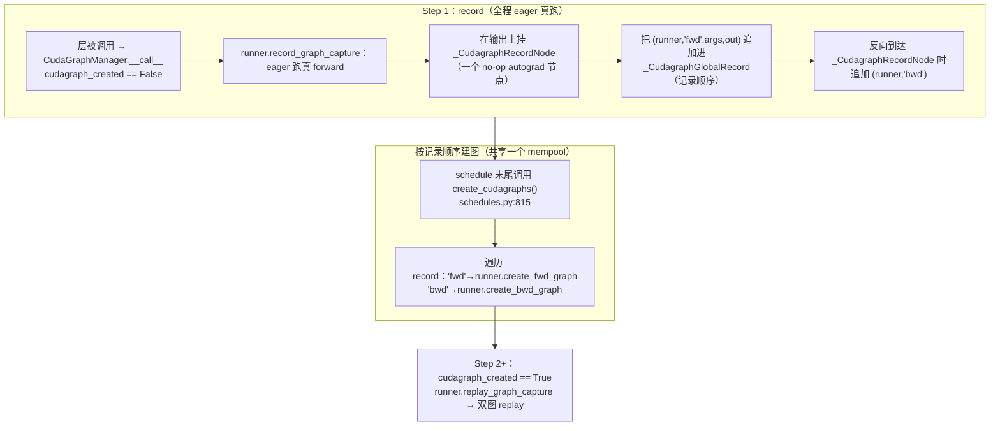

# 07 · CUDA Graph

> [05](./05_cuda_streams_memory_amp.md) 讲清楚了 CUDA 是异步的：每个 kernel 都是由 CPU 发起 launch、塞进 stream 之后才在 GPU 上执行；[06](./06_caching_allocator.md) 则讲了 capture 为什么必须走 private mempool，以及 `expandable_segments` 怎么让多张图共享同一个 pool 时不再对分配顺序那么敏感。这一篇把"异步执行"这条主线继续往前推：当 launch 本身变成瓶颈时，可以把一整段 kernel 序列预先录制成一张静态图，之后每次只需要一次 replay 就能把这段序列重新跑一遍，把原本的 N 次 launch 压缩成 1 次。
>
> 之所以要单独用一整篇来讲，是因为 CUDA Graph 在训练和推理里其实是两套截然不同的工程实践：训练要把反向图也一起录进去，要跨 microbatch 协调，还要处理梯度累加和 RNG 状态（也就是 Megatron 的 full-layer graph）；推理 decode 则要按 batch size 分桶、做 padding，并且要和 attention backend 的 metadata 协同工作（这是 SGLang 的做法）。`torch.compile` 和 profiler 相关的内容放到了 [08](./08_compile_profiler.md) 里。
>
> 下文默认已经 `import torch`。Megatron 代码统一 pin 在 commit `e03878b5f`，引用路径相对 [[megatron-lm:]]；SGLang 的引用路径相对 [[sglang:]]。

---

## 1. 原理与约束

### 1.1 launch-bound 问题

回顾一下 [05 第 1 节](./05_cuda_streams_memory_amp.md#1-cuda)里的时间线：Python 侧调用一个 `op()` 只是把对应的 kernel 塞进 stream 队列就立刻返回了，真正的执行是在 GPU 上异步进行的。而每次 launch 本身是有固定开销的，大致在几微秒量级，这个开销来自 Python dispatch、ATen，再到 CUDA driver 的 `cudaLaunchKernel` 这一整条路径。

当单个 kernel 在 GPU 上的实际执行时间小于这个 launch 开销时，就会出现一种周期性的现象：GPU 算完手头的活儿之后，得停下来等 CPU 喂下一个 kernel。这时候瓶颈已经不再是算力，而是 CPU 发射 kernel 的速度，这种情况通常被称为 launch-bound 或者 CPU-bound。典型场景是这样的：

```
理想（GPU-bound）:   CPU: L1 L2 L3 ...（launch 很快排满队列）
                     GPU: [==K1==][==K2==][==K3==]   ← 背靠背，无空隙

launch-bound:        CPU: L1----L2----L3----        ← launch 才是关键路径
                     GPU: [K1] .. [K2] .. [K3]       ← GPU 在等 CPU（空隙 = 浪费）
```

两类最常见的情形：

- **推理 decode**：batch=B、每步只前进 1 个 token，每个 kernel 都很小；一层里有几十个小 kernel，再乘以几十层，几乎全是 launch 开销。
- **训练**中参数量不大或算子极多的 transformer layer：反向的 element-wise / norm / bias 是一长串小 kernel。

CUDA Graph 把这一串 kernel 的**拓扑 + 参数（含张量地址）**录成一张图。replay 时 driver 直接按图重放全部 kernel，**跳过所有 Python/ATen/dispatch，一次 `cudaGraphLaunch` 搞定**。

### 1.2 capture + replay：底层 API

```python
# 1) 预热：先正常跑几次（让 caching allocator 稳定、cuBLAS/cuDNN autotune 完成、
#    lazy 初始化的 buffer 都分配好）——capture 时不能再有首次分配
static_input = torch.empty(batch, hidden, device='cuda')
s = torch.cuda.Stream()
s.wait_stream(torch.cuda.current_stream())
with torch.cuda.stream(s):
    for _ in range(3):
        y = model(static_input)
torch.cuda.current_stream().wait_stream(s)

# 2) capture：把这一段录进 graph（在专用 stream + 专用 mempool 上）
g = torch.cuda.CUDAGraph()
with torch.cuda.graph(g):          # 期间所有 kernel 只“记录”不“真跑业务”
    static_output = model(static_input)

# 3) replay：之后每步只需把新数据 copy_ 进固定 buffer + replay
static_input.copy_(real_input)     # in-place 更新输入（地址不变）
g.replay()                         # 一次 launch 重放全部 kernel
result = static_output             # 输出也在固定 buffer 里，被就地覆写
```

用到的关键 API 是这几个：

| API | 作用 |
|---|---|
| `torch.cuda.CUDAGraph()` | 图对象 |
| `torch.cuda.graph(g, pool=…, stream=…)` | context manager，捕获期内的 kernel 记录进 `g` |
| `g.replay()` | 重放整张图 |
| `torch.cuda.graph_pool_handle()` | 返回一个 mempool 句柄；**多张图共享一个 pool** 才能省显存 |
| `g.register_generator_state(gen)` | 把 RNG generator 注册进图，dropout 等随机 op 才能 replay-safe |

### 1.3 必须遵守的约束

CUDA Graph 录下来的是一串操作固定在固定地址、固定 shape 上的执行序列，由此带来几条必须遵守的规则：

1. 输入和输出必须是固定的静态 buffer。每次要用 `copy_` 做 in-place 填充新数据，不能换成另一个张量——一旦换了张量，地址就变了，而图里记住的还是老地址，replay 时要么读到旧数据，要么直接访问非法内存。这是最容易踩的一个坑。
2. shape 必须固定。LLM 里序列长度和 batch 大小经常变化，遇到这种变长场景，需要给每一种可能出现的 shape 分别 capture 一张图，运行时再挑选最接近的桶并做 padding（具体做法见第 3 节 SGLang 的例子）。
3. 图内部不能有 CPU 同步，也不能有依赖数据取值的控制流：`.item()`、依赖张量值的 `if`、`.nonzero()`、依赖动态 shape 的 `empty` 等都会破坏 capture（这些操作在 [02 第 7 节](./02_compute_ops.md#7-top-k-sort-argmax-cumsum)和 [05 第 1 节](./05_cuda_streams_memory_amp.md#1-cuda)里都提到过）。
4. RNG 必须是 graph-safe 的：要把 generator state 注册进图（`register_generator_state`），否则 dropout 这类随机 op 每次 replay 都会用同一批随机数，结果完全不随机。
5. capture 期间 allocator 的分配必须走图专属的 mempool，并且 capture 本身要在非默认的 stream 上进行，否则会和图外的分配互相踩踏。

> 这里有一处框架 bug 高发的地方值得标注清楚：`copy_` 是 in-place 的，它本身并不进图，只是你在 replay 之前手动往 buffer 里填数据；而 `g.replay()` 会就地覆写 `static_output` 所在的存储——如果上一步的输出还没用完就发起下一次 replay，之前的结果会被直接冲掉。

### 1.4 `make_graphed_callables`：torch 自带的自动包装

手动 capture 是件麻烦事，尤其是训练场景下还要同时录前向和反向。`torch.cuda.make_graphed_callables` 把这套流程自动化了：

```python
sample = torch.randn(batch, hidden, device='cuda')
graphed = torch.cuda.make_graphed_callables(model, (sample,))  # fwd+bwd 都录
loss = graphed(real_input).sum()
loss.backward()                    # 反向也走 replay
```

它内部做的事情是：录一张 fwd 图和一张 bwd 图，再包一层 `autograd.Function`，让 backward 触发的时候去 replay bwd 图。不过实际的训练框架几乎都不会直接用这个封装，因为还要处理 PP 的多 microbatch 调度、梯度要正确累加进 `main_grad`、部分层走 graph 部分层走 eager、FP8 等一系列细节，torch 自带的封装不够灵活。正因如此，Megatron 自己重写了一整套逻辑（见第 2 节），SGLang 在推理侧更是完全手写了 capture 和 replay（见第 3 节）。理解 `make_graphed_callables` 的基本思路——一张 fwd 图、一张 bwd 图、用 `autograd.Function` 把两者桥接起来——是读懂这两套实现的关键。

---

## 2. 训练里的 CUDA Graph：Megatron 的三种实现

相比推理，训练场景要难上不少，主要难在下面四点，任何一点没处理好，结果就会算错：

1. 反向也要一起录。一个 layer 对应 fwd 图和 bwd 图两张图，还需要借助 autograd 把它们正确地串进整个模型的反向链条里。
2. 要跨 microbatch 协调。PP 的 1F1B 调度里，同一个 layer 会被多个正在飞行中的 microbatch 反复调用，顺序是先做若干次 fwd，再交错着做 bwd。
3. 要处理梯度累加。wgrad 需要累加进 `param.main_grad`（也就是 DDP 或分布式优化器用的梯度 buffer），而且梯度累加融合这个优化（对应 `grad_added_to_main_grad` 标记）产生的副作用，在走 replay 路径时需要手动补回来。
4. 还有 RNG、DDP 参数的 all-gather、FP8 等一系列横切关注点需要照顾到。

Megatron 用 `cuda_graph_impl` 一个开关（[[megatron-lm:megatron/core/transformer/transformer_config.py#L934]]，取值 `'none'|'local'|'transformer_engine'|'full_iteration'`）在**三种实现**间选择：

| `cuda_graph_impl` | 入口类 | 录制粒度 | 反向怎么录 |
|---|---|---|---|
| `"local"` | `CudaGraphManager`（[[megatron-lm:megatron/core/transformer/cuda_graphs.py#L1437]]）| **每个 graphable 层**（或层内子区）| Megatron 自研的 autograd.Function 双图 trick |
| `"transformer_engine"` | `TECudaGraphHelper`（[[megatron-lm:megatron/core/transformer/cuda_graphs.py#L1760]]）| 每层 × 每 microbatch | TE 的 `make_graphed_callables` |
| `"full_iteration"` | `FullCudaGraphWrapper`（[[megatron-lm:megatron/core/full_cuda_graph.py#L138]]）| **整个 `forward_backward_func` 一张图** | fwd+bwd 全在这一张图里 |

> 旧开关 `enable_cuda_graph` / `external_cuda_graph`（[[megatron-lm:megatron/core/transformer/transformer_config.py#L910,L930]]）已废弃，在 `__post_init__` 里迁移到 `cuda_graph_impl="local"` / `"transformer_engine"`。

只有继承了 `GraphableMegatronModule` 的模块才能被图化，目前仅有 `TransformerLayer` 和 `MambaLayer`（[[megatron-lm:megatron/core/transformer/module.py#L157-L159]]）满足这个条件。构造时如果 `cuda_graph_impl=="local"`，就会挂上一个 `cudagraph_manager`（[[megatron-lm:megatron/core/transformer/module.py#L171-L177]]）。

### 2.1 `local`：Megatron 自研的 fwd + bwd 双图

这条路径最能说明训练里的 CUDA Graph 到底是怎么工作的，因为它把 torch `make_graphed_callables` 原本的黑盒完全展开了，值得仔细看一遍。

#### 分发入口

`GraphableMegatronModule.__call__`（[[megatron-lm:megatron/core/transformer/module.py#L341-L352]]）拦截层的调用：

```python
def __call__(self, *args, **kwargs):
    if self._should_call_local_cudagraph(*args, **kwargs):
        return self.cudagraph_manager(self, args, kwargs)   # 走图
    ...
    return super().__call__(*args, **kwargs)                # 否则 eager
```

`CudaGraphManager` 为每个「层 × 在飞 microbatch」维护一个 `_CudaGraphRunner`（[[megatron-lm:megatron/core/transformer/cuda_graphs.py#L695]]），一个 runner 持有**一对** fwd/bwd 图。

#### 两阶段生命周期

CUDA Graph 没办法凭空录制，必须先真的跑一遍，才能知道要录哪些 kernel、buffer 要开多大、执行顺序是怎样的。而且如果想让多张图安全地共享同一个 mempool，就必须严格按照真实的执行顺序依次 capture。Megatron 为此设计了一个全局记录器 `_CudagraphGlobalRecord`（[[megatron-lm:megatron/core/transformer/cuda_graphs.py#L345]]），思路是先把真实的执行顺序记录下来，再按这个顺序统一建图：



Step 1（record，全程 eager）：`CudaGraphManager.__call__` 一旦发现 `_CudagraphGlobalRecord.cudagraph_created == False` 且当前处于训练状态，就会走 `runner.record_graph_capture`（[[megatron-lm:megatron/core/transformer/cuda_graphs.py#L1697]]）。这一步是用 eager 模式真的跑一次 forward，并且在输出张量上挂一个 no-op 的 `_CudagraphRecordNode`（[[megatron-lm:megatron/core/transformer/cuda_graphs.py#L553-L582]]）。这个节点在前向什么都不做，只有当反向传播真正经过它的时候，才会把 `(runner, 'bwd')` 追加进全局记录里。这样一来，"所有 fwd 先执行完，随后 bwd 按逆序执行"这个真实的顺序，就被如实地记录了下来。

建图阶段发生在 schedule 函数的末尾，统一调用 `create_cudagraphs()`（[[megatron-lm:megatron/core/pipeline_parallel/schedules.py#L815-L816]]、`:2050`、`:2456`）。它会遍历 `cudagraph_record`，按照记录下来的顺序，对每条 `'fwd'` 记录调用 `create_fwd_graph`，对每条 `'bwd'` 记录调用 `create_bwd_graph`（[[megatron-lm:megatron/core/transformer/cuda_graphs.py#L447-L453]]）。之所以要严格按执行顺序建图，是因为只有这样，多张图才能安全地共享同一个 mempool，从而把 CUDA Graph 引入的显存开销压到最低。

到了 Step 2 及以后，`cudagraph_created == True`，`__call__` 就会改走 `runner.replay_graph_capture`（[[megatron-lm:megatron/core/transformer/cuda_graphs.py#L1643]]），fwd 和 bwd 都变成纯粹的 replay。

#### fwd 图、bwd 图与 autograd.Function 的桥接

replay 阶段真正干活的是 `_CudagraphReplayNode`（[[megatron-lm:megatron/core/transformer/cuda_graphs.py#L585-L692]]），它本质上是一个 `autograd.Function`：前向时 replay fwd 图，反向时 replay bwd 图，从而把这两张静态图重新接回了 autograd 引擎。下面是和源码结构同构的伪代码：

```python
# cuda_graphs.py:585-692（精简，变量名/维度/控制流对齐真实实现）
class _CudagraphReplayNode(torch.autograd.Function):
    @staticmethod
    def forward(ctx, runner, is_first_microbatch, *inputs):        # :590
        assert runner.status == _GraphStatus.FWD_READY             # 状态机：现在该 fwd
        # 把 live 输入 copy_ 进图的静态输入 buffer（地址不变才有效）
        for user_in, cg_in in zip(inputs, runner.fwd_graph_input_surface):   # :605
            if getattr(cg_in, "can_skip_replay_copy", False):
                pass                    # 上游图的输出 buffer == 本图输入 buffer，指针已别名，免拷
            elif user_in.data_ptr() != cg_in.data_ptr():
                cg_in.copy_(user_in)    # :614  in-place 填数据
        ctx.runner = runner
        runner.fwd_graph.replay()                                  # :639 一次 launch
        return runner.fwd_graph_output_surface                     # 输出在静态 buffer 里

    @staticmethod
    def backward(ctx, *grads):                                     # :642
        runner = ctx.runner
        assert runner.status == _GraphStatus.BWD_READY             # 现在该 bwd
        # 把上游传来的 grad_output copy_ 进 bwd 图的静态输入 buffer
        for g_user, g_cg in zip(grads, runner.static_grad_outputs):        # :666
            if g_cg is not None and g_user.data_ptr() != g_cg.data_ptr():
                g_cg.copy_(g_user)                                 # :670
        runner.bwd_graph.replay()                                  # :672 反向也是 replay
        runner.status = _GraphStatus.FWD_READY
        # 补：grad-accumulation-fusion 在 eager 下会置 param.grad_added_to_main_grad，
        # 但 replay 不触发这个副作用，这里手动补回 :684-685
        for p, added in runner.groundtruth_grad_added_to_main_grad.items():
            p.grad_added_to_main_grad = added
        # dgrad 直接返回；wgrad 必须 clone —— 因为 autograd 可能在 wgrad 被累加进
        # main_grad 之前就 replay 下一张 bwd 图，覆写 static_grad_inputs 存储 :687-690
        dgrads = runner.static_grad_inputs[: runner.num_dgrads]
        wgrads = (g.clone() for g in runner.static_grad_inputs[runner.num_dgrads:])
        return None, None, *dgrads, *wgrads
```

bwd 图本身是怎么录出来的呢？`create_bwd_graph`（[[megatron-lm:megatron/core/transformer/cuda_graphs.py#L1055-L1134]]）的做法是在 `torch.cuda.graph` 的上下文里跑一次 `torch.autograd.grad`，把这次反向传播涉及的所有 kernel 都录进图里：

```python
self.bwd_graph = torch.cuda.CUDAGraph()
for state in get_all_rng_states().values():          # RNG replay-safe
    self.bwd_graph.register_generator_state(state)
# 为每个 requires_grad 的输出分配静态 grad-output buffer
...
with torch.cuda.graph(self.bwd_graph, pool=self.mempool):     # :1099 共享 mempool
    grad_inputs = torch.autograd.grad(
        outputs=[o for o in self.fwd_graph_output_surface if o.requires_grad],
        inputs =[i for i in self.fwd_graph_input_surface  if i.requires_grad],
        grad_outputs=self.static_grad_outputs, only_inputs=True, allow_unused=True)
# grad_inputs 拆成 dgrad（对每个输入）+ wgrad（对每个 connected param）
```

这里有个细节值得注意：`fwd_graph_input_surface` 会把该层参与反向的参数也一并拼进去（[[megatron-lm:megatron/core/transformer/cuda_graphs.py#L1032]]），这样一来，参数的 wgrad 也会走同一张 bwd 图；具体哪些参数算作 connected param，是通过遍历 autograd 图、找出 `AccumulateGrad` 叶子节点来确定的（`get_connected_params`，[[megatron-lm:megatron/core/transformer/cuda_graphs.py#L793]]）。

> 这一段正好呼应了全篇的一条主线：[README 里提到的](./README.md#0-torch)"forward 哪里有 op，backward 就有它的对偶"，在这里被推到了极致。CUDA Graph 把这个对偶关系，从原本 autograd 的动态重放，固化成了两张静态图：fwd 图的 replay 对应 bwd 图的 replay，一一配对。`_CudagraphReplayNode` 的 forward 和 backward，做的正是把这一对静态图重新接回动态 autograd 引擎的工作。

#### 静态 buffer 与 shape 校验

- 静态 buffer 指的就是 capture 时绑定好的 `fwd_graph_input_surface`、`fwd_graph_output_surface`、`static_grad_outputs`、`static_grad_inputs` 这几个 buffer，replay 时通过 `copy_` 往里填数据（见上面的伪代码）。
- 如果上游图的输出 buffer 恰好就是下游图的输入 buffer（也就是指针本身是别名关系），`can_skip_replay_copy` 会跳过这一次本可以省掉的拷贝（[[megatron-lm:megatron/core/transformer/cuda_graphs.py#L900-L914]]）。还有一个 `TensorReusePool`（[[megatron-lm:megatron/core/transformer/cuda_graphs.py#L186]]）负责在各张图之间回收 buffer，让显存峰值保持在可控范围内。
- capture 和 replay 时的 shape、dtype、device、标量值都必须完全一致，`get_mismatch_errors`（[[megatron-lm:megatron/core/transformer/cuda_graphs.py#L1321]]）会在 replay 之前用 `ArgMetadata` 逐项比对，一旦发现不一致就直接报错，从而避免静默算错这种更难排查的问题。

#### 与 PP 1F1B 的配合

- 顺序上的约束由 `_CudagraphGlobalRecord` 来保证：Step 1 如实记录了"若干次 fwd 之后交错做 bwd"这个真实顺序，`create_cudagraphs()` 就严格按这个顺序建图。
- 一个 layer 会对应多个在飞的 microbatch，这一点由 `CudaGraphManager.reuse_cudagraphs = (pp.size()==1)`（[[megatron-lm:megatron/core/transformer/cuda_graphs.py#L1519]]）来处理：当 PP>1 时，同一层会保留一组 `_CudaGraphRunner`，每个在飞的 microbatch 对应一个，轮流使用（`get_cudagraph_runner`，[[megatron-lm:megatron/core/transformer/cuda_graphs.py#L1541-L1606]]）；当 PP==1 时，runner 可以直接复用并共享同一个 mempool。
- DDP 参数的 all-gather 也需要特殊处理：由于层的 forward 是在图里跑的，正常的 `forward_pre_hooks` 不会被触发。`local` 路径的做法是手动触发 Mcore-DDP 的 pre-forward hook（也就是异步参数 all-gather），同时断言不存在用户自定义的 hook（`call_ddp_preforward_hook`，[[megatron-lm:megatron/core/transformer/cuda_graphs.py#L1526-L1539]]，在 replay 之前的 `:1636` 处被调用）。

### 2.2 `full_iteration`：整个训练步录成一张图

如果说 `local` 是"每层一对小图"的做法，`full_iteration` 走的就是另一个极端：把整个 `forward_backward_func`（也就是所有 microbatch 的 fwd 加 bwd，等于整个 pipeline schedule）录成一张 `torch.cuda.CUDAGraph`（[[megatron-lm:megatron/core/full_cuda_graph.py#L138]] 的 `FullCudaGraphWrapper`）。这种做法把 launch 消除得最彻底，但代价是要求整步的执行图完全静态。

与源码同构的伪代码（[[megatron-lm:megatron/core/full_cuda_graph.py#L184-L234]]）：

```python
class FullCudaGraphWrapper:
    def __call__(self, *, model, data_iterator, num_microbatches, forward_only, **kw):
        stage = 'training' if not forward_only else 'validation'
        # 关键：先把每个 microbatch 的 dataloader 输出预加载进“静态 CUDA buffer”
        # （在专用 stream 上 clone），这样图读的永远是固定地址 :203, :151-182
        kw['data_iterator'] = self.data_read(data_iterator, model, ...)

        it = FullCudaGraphWrapper.curr_iteration[stage]
        if it == self.cuda_graph_warmup_steps:                 # 到达预热步 → capture
            torch.distributed.barrier()
            g = torch.cuda.CUDAGraph()
            for s in get_all_rng_states().values():
                g.register_generator_state(s)                  # :213 RNG
            torch.cuda.synchronize()
            with torch.cuda.graph(g,
                    stream=get_shared_capture_stream(),        # 全进程共享一个 capture stream
                    pool=get_graph_pool(self.use_single_mempool),  # 与 optimizer 图共享 pool
                    capture_error_mode="thread_local"):
                self.result[stage] = self.forward_backward_func(model=model, **kw)  # :223
            torch.cuda.synchronize(); torch.distributed.barrier()

        if FullCudaGraphWrapper.cuda_graph[stage] is None:     # 预热阶段：eager :229
            self.result[stage] = self.forward_backward_func(**kw)
        else:                                                  # 稳态：一次 replay 整步 :232
            FullCudaGraphWrapper.cuda_graph[stage].replay()
        FullCudaGraphWrapper.curr_iteration[stage] += 1
        return self.result[stage]        # 每步返回同一批张量 handle（被就地覆写）
```

这里面有几个要点：

- `StaticBufferLoader`（[[megatron-lm:megatron/core/full_cuda_graph.py#L99-L135]]）会为 training 和 validation 分别维护一组按 microbatch 索引的静态输入 buffer，数据是从 dataloader clone 进去的（在专用 stream 上用 `copy_(..., non_blocking=True)`）。这样就解决了"输入必须固定地址"这个要求：数据在变，但 buffer 的地址始终不变。
- capture 只会在第 `cuda_graph_warmup_steps` 步发生一次，之后每一步都只是调用 `replay()`。
- optimizer 的 step 被录成了另外一张独立的图（`OptimizerCudaGraphWrapper`，[[megatron-lm:megatron/core/optimizer/optimizer_cuda_graph.py]]），挂载在 [[megatron-lm:megatron/training/training.py#L3309]] 处，并且和 full-iteration 图共享同一个 mempool（当 `cuda_graph_use_single_mempool=True` 时，具体是 [[megatron-lm:megatron/core/full_cuda_graph.py#L14-L52]] 里那个进程级的单例 pool/stream）。
- 训练循环里的接线代码在 [[megatron-lm:megatron/training/training.py#L3293-L3298]]，也就是包住 `forward_backward_func` 的那部分。

`full_iteration` 要求 `cuda_graph_modules` 必须为空，也就是不能对层内部再做切分（`transformer_config.py` 里有相应的校验）。它和 `local` 之间是一种取舍关系：`local` 更灵活，可以只图化 attention 或 MLP 这样的子区域，也可以和 eager 执行的段落混排；`full_iteration` 则做得更极致，整步只有一张图，launch 次数降到最低，但代价是要求整个 schedule 完全静态，对 MoE 这类会出现动态 shape 的场景不太友好。

### 2.3 `transformer_engine`：借助 TE 的 `make_graphed_callables`

`TECudaGraphHelper`（[[megatron-lm:megatron/core/transformer/cuda_graphs.py#L1760]]）先找出所有可以图化的层（`_discover_layers`，`:1811`），为每一层、每一个 microbatch 构造出对应的可调用样本，然后一次性交给 TE 提供的 `make_graphed_callables`（[[megatron-lm:megatron/core/transformer/cuda_graphs.py#L2389]]）去处理。捕获出来的图会被放进每一层的 `layer.cuda_graphs` 列表里，每个 microbatch 对应一张（`:2395`）。schedule 在每次 forward 之前都会调用 `set_current_microbatch`（[[megatron-lm:megatron/core/pipeline_parallel/schedules.py#L455]] → [[megatron-lm:megatron/core/transformer/cuda_graphs.py#L2592]]），`_te_cuda_graph_replay` 就依据这个信息选出对应的 `cuda_graphs[microbatch % len]`（[[megatron-lm:megatron/core/transformer/module.py#L300-L305]]）。

它和 `local` 最本质的区别在于：反向的捕获工作完全交给了 TE 去做（TE 内部同样是 fwd 图加 bwd 图，再用 autograd.Function 桥接，思路和第 1.4 节讲的一致），Megatron 这边只负责发现哪些层可以图化、安排微批的执行顺序，以及手动补上必要的 hook。这条路径比较适合已经全栈使用 TE（比如用了 FP8、TE 自带的 fused attention/MLP）的场景。

### 2.4 训练场景的注意事项

| 关注点 | 处理方式 | 位置 |
|---|---|---|
| **RNG / dropout** | 所有活跃 generator state 都 `register_generator_state` 注册进 fwd/bwd/full 图；要求 RNG tracker 是 cudagraph-able | [[megatron-lm:megatron/core/transformer/cuda_graphs.py#L872,L1067]]；[[megatron-lm:megatron/core/full_cuda_graph.py#L213]]；断言 `:1496` |
| **梯度累加 main_grad** | warmup 会跑真 forward，可能污染 buffer/`main_grad`，capture 前**备份、capture 后还原**；`grad_added_to_main_grad` 副作用在 replay 下手动补；wgrad 返回前 `clone` | `cuda_graphs.py:834-849, 684-685, 687-690` |
| **MoE 动态 shape（主要限制）** | token dispatch 是 data-dependent shape，**不能整层图化**；只图化 `moe_router`/`moe_preprocess` 等静态子区，expert 的 all-to-all dispatch 保持 eager；推理可用 drop-and-pad 把 expert 补成静态 shape | [[megatron-lm:megatron/core/transformer/transformer_layer.py#L1371-L1425]]；`moe_pad_experts_for_cuda_graph_inference`（[[megatron-lm:megatron/core/transformer/transformer_config.py#L826]]）|
| **expandable_segments** | Blackwell 之前的卡要 `NCCL_GRAPH_REGISTER=0`，否则 capture 里注册 NCCL buffer 会非法访存；机制与限制见 [06](./06_caching_allocator.md) §6 | [[megatron-lm:megatron/core/transformer/cuda_graphs.py#L1503-L1510]] |
| **激活重算** | recompute 在 bwd 里重跑 fwd，丢失 buffer-reuse 元数据，被迫多做拷贝（有额外开销的已知点）| [[megatron-lm:megatron/core/transformer/cuda_graphs.py#L1074-L1090]] |
| **warmup 步数** | `cuda_graph_warmup_steps` 默认 **3**；capture 前 `create_fwd_graph` 内部还会再 warmup 若干次（图捕获模式可能走不同 codepath）| [[megatron-lm:megatron/core/transformer/transformer_config.py#L927]]；[[megatron-lm:megatron/core/transformer/cuda_graphs.py#L942]] |

几个主要的 config 旋钮都在 `transformer_config.py` 里：`cuda_graph_impl` 是主开关（`:934`）、`cuda_graph_modules` 决定图化哪些子区域（`"full"` 表示整层，`:949`）、`cuda_graph_warmup_steps`（`:927`）、`cuda_graph_use_single_mempool` 控制 full-iteration 和 optimizer 是否共享 pool（`:916`）、`cuda_graph_retain_backward_graph`（`:922`）。

---

## 3. 推理 decode 里的 CUDA Graph：SGLang

推理场景对 CUDA Graph 的诉求和训练完全不同：只需要录前向、不涉及反向，但要处理的问题是 batch size 在每一步都可能变化。这正是 SGLang 的 decode graph 全部工程重心所在。

> SGLang 的这套代码近期做过重构：runner 被拆成了一个与 phase 无关的 base、各自的 phase runner，以及可插拔的 backend（[[sglang:python/sglang/srt/model_executor/runner/base_cuda_graph_runner.py]] + [[sglang:python/sglang/srt/model_executor/runner/decode_cuda_graph_runner.py]] + [[sglang:python/sglang/srt/model_executor/runner_backend/]]），静态 buffer 由 `CudaGraphBufferRegistry` 的 `GraphSlot` 统一管理。下面以 decode 加 `full` backend（也就是真正意义上的一图一形状）为主线来讲。

### 3.1 decode 与 prefill 的取舍

简单说，decode 对应的是固定形状，而 prefill 对应的是变长，这个差异决定了两者能不能用 CUDA Graph。

- decode：一批 B 个序列，每一步都只往前推进 1 个 token（`num_tokens_per_bs = 1`），因此只要按 batch size 分桶，形状就是固定的，可以录 `full` 图。而且 decode 每一步要经过几十层，每层又是几十个小 kernel，正是 launch-bound 现象的重灾区。
- prefill：每个请求的 prompt 长度都不一样，拼接在一起之后的 token 数量千变万化，形状根本不固定，如果强行去录 `full` 图，图的数量会直接爆炸。

这个判断在代码里是硬编码的合法性表（[[sglang:python/sglang/srt/model_executor/cuda_graph_config.py#L35-L46]]）：

```python
ALLOWED_BACKENDS_PER_PHASE = {
    Phase.DECODE:  (Backend.FULL, Backend.BREAKABLE, Backend.TC_PIECEWISE, Backend.DISABLED),
    # full is rejected for prefill — full CUDA graph capture only fits fixed-shape
    # and prefill is variable-shape. Use breakable or tc_piecewise for prefill.
    Phase.PREFILL: (Backend.BREAKABLE, Backend.TC_PIECEWISE, Backend.DISABLED),
}
```

默认 decode → `FULL`、prefill → `TC_PIECEWISE`（torch.compile 的分段 kernel，形状无关，不是一张整图）。

一个 batch 走不走图，由 forward mode 决定（[[sglang:python/sglang/srt/model_executor/forward_batch_info.py#L169-L175]]）：

```python
def is_cuda_graph(self):
    return (self == ForwardMode.DECODE or self == ForwardMode.TARGET_VERIFY
            or self == ForwardMode.IDLE or self == ForwardMode.DLLM_EXTEND)
```

`EXTEND`/`MIXED`（prefill）不在其列。真正的分发在 [[sglang:python/sglang/srt/model_executor/model_runner.py#L3489-L3514]]：满足 `is_cuda_graph()` 且 `decode_cuda_graph_runner.can_run(forward_batch)` 就 `replay`，否则 fallback eager。

### 3.2 batch-size 分桶与 padding

既然只能录固定形状，那就退而求其次：为一组离散的 batch size 各录一张图，运行时把真实的 batch 向上 padding 到最接近的那个桶。

默认的桶列表长这样（[[sglang:python/sglang/srt/server_args.py#L1806-L1827]]，不带 spec decode 的情况）：

```python
capture_bs = [1, 2, 4, 8, 12] + list(range(16, 257, 8)) \
           + list(range(272, 512, 16)) + list(range(512, max_bs + 1, 32))
# 小 bs 密、大 bs 稀疏；再裁到 <= max_bs，并确保 max_bs 本身在内
```

`max_bs` 是按显存容量分档决定的（`server_args.py`，比如 A100/H100 显存小于 90GB 时用 256/512，B200 上用 512）。如果传了 `--disable-cuda-graph-padding`，桶列表就退化成 `range(1, max_bs+1)`，也就是一个 bs 对应一张图，不做 padding。

replay 时选桶靠二分查找（[[sglang:python/sglang/srt/model_executor/runner/base_cuda_graph_runner.py#L136-L151]] 的 `_pad_to_bucket`）：`bisect_left(buckets, raw_size)` 会取出不小于真实 bs 的最小那个桶。真实数据填进这个桶的前 `raw_bs` 行，剩下的尾部就是 padding。

### 3.3 静态 buffer 与 attention metadata

decode 的静态 buffer 会一次性按 `max_bs` / `max_num_token` 分配好（[[sglang:python/sglang/srt/model_executor/runner/decode_cuda_graph_runner.py#L199-L205]] 等处）：

```python
input_ids        = torch.zeros((max_num_token,),        dtype=torch.int64)
req_pool_indices = torch.zeros((max_bs,),               dtype=torch.int64)
seq_lens         = torch.full ((max_bs,), fill_value,   dtype=torch.int32)   # 哨兵值
out_cache_loc    = torch.zeros((max_num_token,),        dtype=cache_loc_dtype)
positions        = torch.zeros((max_num_token,),        dtype=torch.int64)
mrope_positions  = torch.zeros((3, max_num_token),      dtype=torch.int64)
```

这里的 per-slot padding 策略（在 `cuda_graph_buffer_registry.py` 里）并不是一刀切地处理，而是每个 buffer 都有自己特定的语义：`input_ids` 只覆写头部，尾部本来就不会被读取；`positions`、`out_cache_loc`、`req_pool_indices` 的尾部则必须清零，否则 flashinfer 的 verify 路径会读到 padding 尾部残留的陈旧值，进而造成非法访存（代码注释里专门提到了这一点）；`seq_lens` 则用一个哨兵值（`FILL_SENTINEL`）填充。这些细节，正是 §1.3 的第 1、2 条约束在一个真实系统里的具体落实。

attention metadata 同样必须是固定形状的。decode attention 需要用到 kv 的 indptr、indices、seq_lens 等一系列元数据，SGLang 把准备这些元数据的过程拆成了两步（`base_attn_backend.py`）：

- `init_cuda_graph_state(max_bs, max_num_tokens)`：一次性按最大可能的形状分配好元数据张量（比如 `page_table (max_bs, max_num_pages)`）。
- `init_forward_metadata_out_graph(fb, in_capture)`：在图外运行，负责那些涉及 host 侧或者动态形状的准备工作，capture 之前和每次 replay 之前都会跑一遍。
- `init_forward_metadata_in_graph(fb)`：在图内录制，只包含纯静态形状的 GPU op，capture 时会被录进图里，之后每次 replay 都会自动重放。这一步里禁止出现 `.item()`、`.cpu()` 这类会触发同步的调用。

换句话说，这是把 §1.3 里"图内不能有同步或动态控制流"这条约束，拆成了 in-graph（可以录进图）和 out-graph（图外先算好）两部分分别处理。

### 3.4 capture 循环与 replay

capture 的过程（[[sglang:python/sglang/srt/model_executor/runner/decode_cuda_graph_runner.py#L763]] 的 `capture` 函数，调用 `:788` 的 `_capture_one_stream`）是从大到小遍历各个桶，这样多张图才能共享同一个 mempool；每个桶在正式进图之前会先做 2 次 warmup（[[sglang:python/sglang/srt/model_executor/runner_backend/full_cuda_graph_backend.py#L63-L97]] 的 `capture_one`）：

```python
# (a) capture-over-buckets（与源码同构）
def capture():
    with freeze_gc(...), graph_capture() as ctx:
        with backend.capture_session(ctx.stream):     # 建一个共享 graph_pool_handle
            for bs in reversed(capture_bs):            # 大 → 小：共享 mempool
                fb, attn_backend = capture_prepare(bs) # 在静态 buffer 上造 dummy DECODE batch
                with forward_context(attn_backend):
                    attn_backend.init_forward_metadata_out_graph(fb, in_capture=True)
                    def run_once():
                        attn_backend.init_forward_metadata_in_graph(fb)  # 可录
                        return forward(fb.input_ids, fb.positions, fb)
                    backend.capture_one(shape_key(bs), run_once,
                                        post_warmup_hook=attn_backend.on_after_cuda_graph_warmup)

# capture_one（full_cuda_graph_backend.py:63-97）
def capture_one(shape_key, forward_fn, post_warmup_hook):
    for _ in range(2):                     # 2 次 warmup：加载 kernel、付一次性初始化
        device.synchronize(); tp_group.barrier(); forward_fn()
        if post_warmup_hook: post_warmup_hook()   # 撤销 warmup 对 attn 状态的改动
    graph = torch.cuda.CUDAGraph()
    with device.graph(cuda_graph=graph, pool=self._pool, stream=self._capture_stream):
        out = forward_fn()
    self._graphs[shape_key]  = graph       # 按形状存字典
    self._outputs[shape_key] = out
```

replay 的过程则在 [[sglang:python/sglang/srt/model_executor/runner/decode_cuda_graph_runner.py#L1049]] 的 `replay` 函数里，调用了 `:948` 的 `replay_prepare`：

```python
# (b) replay-with-padding（与源码同构）
def replay(fb):
    with backend.replay_session():
        replay_prepare(fb):
            if not fb.needs_forward_metadata_init():        # 形状没变的快路径
                buffers.input_ids[:raw_num_token].copy_(fb.input_ids)
                buffers.positions[:raw_num_token].copy_(fb.positions)
                self._replay_graph_key = shape_key(self.bs); return
            raw_bs = fb.batch_size
            bs = pad_to_bucket(raw_bs, capture_bs)          # 二分选桶
            buffer_registry.fill_from(fb, raw_bs, padded_bs=bs, ...)  # 清 padding 尾 + foreach copy 头
            attn_backend.init_forward_metadata_out_graph(build_replay_fb_view(...))
            self.raw_num_token = raw_bs * ntpb
            self._replay_graph_key = shape_key(bs)
        out = backend.replay(self._replay_graph_key, fb)    # self._graphs[key].replay()
    # 把输出切回真实 bs（丢掉 padding 部分）
    return LogitsProcessorOutput(
        next_token_logits = out.next_token_logits[: self.raw_num_token],   # :1075
        hidden_states     = out.hidden_states[: self.raw_num_token], ...)
```

可以看到，这里的三个动作和 1.2 节讲的 capture/replay 模板完全对应：先把静态 buffer 填好（`copy_`），再调用 `graph.replay()`，最后按真实 bs 把输出切片取出来。`fill_from` 用 `torch._foreach_copy_` 把多个 buffer 的头部一次性批量做 D2D 拷贝，借此减少 launch 次数。

### 3.5 与 spec decode / torch.compile / piecewise 的关系

- 投机解码（EAGLE）：target-verify 阶段走的是同一个 `DecodeCudaGraphRunner`，只是把 `capture_forward_mode` 设成了 `TARGET_VERIFY`，`num_tokens_per_bs` 也变成了每步要验证的 token 数（[[sglang:python/sglang/srt/model_executor/runner/decode_cuda_graph_runner.py#L373]]）；draft 侧则有自己独立的一套 runner（[[sglang:python/sglang/srt/speculative/eagle_draft_cuda_graph_runner.py]]），`num_tokens_per_bs = topk`。spec 场景下使用的桶列表也更细。
- torch.compile：只有落在 `compile_bs`（也就是 `<= torch_compile_max_bs`）范围内的桶，才会在 capture 时同时启用 torch.compile（[[sglang:python/sglang/srt/model_executor/runner/decode_cuda_graph_runner.py#L816]]）。这样一来，compile 先生成融合后的 kernel，再被 CUDA Graph 录进去，两种优化叠加在了一起。
- piecewise / breakable backend：prefill 默认用的是 `tc_piecewise`，也就是 torch.compile 按形状缓存的 kernel，本身和具体形状无关；`breakable` 则是在图里保留了一些 eager 执行的断点（见 `runner_backend/`）。传入 `--debug-cuda-graph` 会强制走 breakable，方便定位问题。

---

## 4. 训练与推理的对比

| 维度 | 训练（Megatron `local`/`full_iteration`）| 推理 decode（SGLang）|
|---|---|---|
| 录什么 | fwd **+ bwd** 两张图（autograd.Function 桥接）| 只录 **fwd** |
| 固定形状来源 | micro-batch shape（`[s, mbs, h]`）本就固定 | batch size 分桶 + padding |
| 图的数量 | 每层一对（local）/ 整步一张（full-iter）| 每个 bs 桶一张 |
| 顺序/mempool | 按 1F1B 真实顺序建图、共享 mempool | 桶从大到小建图、共享 mempool |
| 变长逃逸口 | MoE dispatch 保持 eager、只图化静态子区 | prefill 保持 eager / piecewise，只 decode 走 full 图 |
| replay 前 | `copy_` 输入 + 触发 DDP all-gather hook | `copy_` 输入 + 清 padding 尾 + 重建 attn metadata |
| replay 后 | wgrad `clone`、补 `grad_added_to_main_grad` | 按真实 bs 切片输出 |
| RNG | fwd+bwd 都 `register_generator_state` | 通常无 dropout（推理），关注点弱 |

训练和推理背后其实是同一件事：把一段地址固定、形状固定、控制流也固定的 kernel 序列录成一张图，运行时用 `copy_` 把新数据填进去，再用 `replay()` 一次性把它发射出去。训练要应付的动态性是反向传播，推理要应付的动态性是变长的 batch size，两边的所有差异，说到底都是各自想办法把这部分动态性塞进这个固定框架时产生的工程细节。

---

## 5. 小结

- CUDA Graph 要解决的问题是 launch-bound：把原本 N 次的 kernel launch 压缩成 1 次 `replay`。代价是一切都必须是静态的（地址、shape、控制流、RNG 都不能变），要换新数据也只能通过 `copy_` 填进固定的 buffer。
- 训练场景（Megatron）的难点在于要同时录制反向、要跨 microbatch 协调、还要处理梯度累加。`local` 路径用自研的 autograd.Function 双图机制，配合全局顺序记录（按 1F1B 的真实顺序建图、共享 mempool）；`full_iteration` 把整个训练步录成一张图；`transformer_engine` 则借助 TE 自己的能力。MoE 里 token dispatch 的动态 shape 是主要限制，只能对静态的子区域做图化。
- 推理 decode 场景（SGLang）的难点在于 batch size 每一步都可能变化。做法是按 bs 分桶、每个桶各录一张 `full` 图，运行时把真实请求 padding 到最近的桶，再按 per-slot 的策略分别处理 padding 尾部，并且和 attention backend 之间用 in-graph / out-graph 的拆分来协同；prefill 因为形状变长，不走 full 图这条路径。
- 把这一篇和 [05](./05_cuda_streams_memory_amp.md) 讲的 stream 与异步执行、[08](./08_compile_profiler.md) 里 `torch.compile`（`mode="reduce-overhead"` 会自动套一层 CUDA Graph）串起来看，正好构成了"减少 launch 次数、把访存和通信藏起来"这条性能主线的完整图景。

CUDA Graph 讲完之后，下一个自然的话题是 `torch.compile`：它是怎么自动做算子融合和图优化的（并且会自动应用 CUDA Graph），以及怎么用 profiler 和 nsys 先判断一个程序到底是不是 launch-bound，这些留给 [08 · torch.compile / profiler](./08_compile_profiler.md)。
