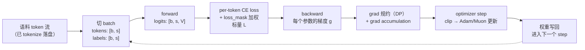

# 00 · 训练全景：从数据到权重更新

> [大规模训练的并行策略总览](../parallel/README.md) 那组文档讲的是空间维：模型和 batch 怎么切到成千上万张卡上。进入本章各篇的实现细节之前，本篇先用纯概念把三件事讲清楚：一个训练 step 从数据到权重更新的完整流程、loss 与各种 mask 是怎么组织的、pretrain / SFT / RL 三种训练模式的异同。全篇不贴代码行号——这里建立的每一个概念，在后面各篇都会有对应的实现对照。
>
> 读这一篇只需要两个前置：知道 GPT 类 decoder-only transformer 的结构（embedding → L 层 transformer layer → lm head），知道 autograd 的语义（forward 建图、backward 沿图反传梯度）。并行相关的直觉只需要「DP 各 rank 吃不同数据、梯度要规约」这一点。

---

## 1. 一个训练 step 的概念流水线

训练的目标函数只有一个：**让模型对自己没见过的 token 给出更高的概率**。把这句话翻译成一条流水线，就是一个 step 里发生的全部事情：



先把这条流水线上每个张量的 shape 和语义钉死，后面所有讨论都建立在它们之上：

| 张量 | shape | 语义 |
|---|---|---|
| `tokens` | $[b, s]$ | 输入 token id，$b$ 条长度 $s$ 的序列 |
| `labels` | $[b, s]$ | 每个位置要预测的「下一个 token」（由 `tokens` 错一位得到，见 §2.1） |
| `logits` | $[b, s, V]$ | 模型对每个位置输出的、词表 $V$ 上的未归一化打分 |
| `loss_mask` | $[b, s]$ | 0/1 掩码，标记哪些位置的预测计入 loss（见 §2.3） |

有了这些记号，一个 micro-batch 的 loss 定义式是：

$$
L = -\frac{\sum_{i,t} m_{i,t} \log p_\theta\!\left(x_{i,t+1} \mid x_{i,\le t}\right)}{\sum_{i,t} m_{i,t}}
$$

其中 $i$ 遍历 batch 内的序列，$t$ 遍历序列位置，$m_{i,t} \in \{0,1\}$ 就是 `loss_mask`，$p_\theta$ 由 logits 沿词表维做 softmax 得到。注意分子分母都带 mask：loss 是**按有效 token 加权的平均**，而不是按序列或按 micro-batch 等权的平均——这一点在多卡汇聚时会变得重要（实现对照见 [01 · 训练主循环](./01_training_loop.md) §5）。

backward 对这条式子求导，得到每个参数的梯度 $g = \partial L / \partial \theta$；optimizer（Adam、Muon 等，算法细节见 [02 · Optimizer](./02_optimizer.md)）消费梯度并更新权重。这就是「数据 → loss → 梯度 → 权重更新」的完整闭环。

剩下一个概念是 **grad accumulation**：一个 optimizer step 想用的总样本数（`global_batch_size`，GBS）往往远大于单卡一次 forward 放得下的量（`micro_batch_size`，$b$）。做法是把这个 step 拆成 $m = \mathrm{GBS} / (b \times \mathrm{DP})$ 个 micro-batch 串行跑，梯度逐步累加，最后统一规约、统一更新一次——用时间换显存，activation 只占一个 micro-batch 的量。三个量的完整关系和 Megatron 里的校验逻辑见 [01 · 训练主循环](./01_training_loop.md) §3。

概念流水线的每一步，在本章都有一篇对应的实现对照：

| 概念步骤 | 实现对照 | 关键工程问题 |
|---|---|---|
| 切 batch | [04 · 数据链路](./04_dataloader.md) | `.bin`/`.idx` mmap、定长采样、blend、sampler 与 resume |
| forward/backward 调度 | [01 · 训练主循环](./01_training_loop.md) | grad accumulation 循环藏在哪里、PP 的 1F1B |
| loss 计算与汇聚 | [01 · 训练主循环](./01_training_loop.md) §5 | 分子分母分离传递、per-token 归一化 |
| 梯度的存放与规约 | [05 · grad/param buffer](./05_grad_param_buffer.md) | 连续 buffer、bucket、通信 overlap |
| optimizer 更新 | [02 · Optimizer](./02_optimizer.md) | 混合精度、loss scaling、ZeRO 分片 step |
| 状态落盘与恢复 | [03 · Checkpoint](./03_checkpoint.md) | sharded 格式、async save、换拓扑 resume |
| 每步要花多少显存 | [07 · 显存模型](./07_memory_model.md) | 常驻 vs 流动、可手算的估算公式 |

## 2. loss 的三要素：shift、attention mask、loss mask

§1 的定义式里有三个细节决定了「模型到底在学什么」：labels 怎么来、attention 能看哪里、哪些位置计入 loss。这三件事经常被混为一谈，这里分开讲清楚。

### 2.1 labels 为什么错一位

自回归模型在位置 $t$ 读到的是 $x_{\le t}$，要预测的是 $x_{t+1}$。所以训练样本不需要单独存一份「答案」：取一条长度 $s+1$ 的 token 流，前 $s$ 个做 `tokens`、后 $s$ 个做 `labels`，天然错开一位：

```
text:   x0  x1  x2  x3  x4   ...  x_s
tokens: x0  x1  x2  x3       ...  x_{s-1}
labels:     x1  x2  x3  x4   ...  x_s      ← 每个位置的预测目标
```

实现上这就是 `tokens, labels = text[:-1], text[1:]`（[04 · 数据链路](./04_dataloader.md) §3.5）。

### 2.2 attention mask 与 loss mask 是两件正交的事

- **attention mask** 决定**每个位置能看见哪些位置**——它作用在 attention 的打分矩阵上（shape $[s, s]$）。causal mask（下三角）保证位置 $t$ 看不到未来；处理变长或 packed 序列时，它还要把不同样本/不同文档之间隔开，防止注意力跨过边界读到别的样本。
- **loss mask** 决定**哪些位置的预测计入 loss**——它作用在 per-token CE 上（shape $[b, s]$，即 §1 定义式里的 $m_{i,t}$），是个逐位置的开关。

一句话区分：**attention mask 管「看哪里」，loss mask 管「学哪里」**。一个位置可以被看见（参与别人的 attention）但不计 loss（自己不产生梯度）——SFT 里的 prompt 正是这种情况，见 §2.4。

### 2.3 pretrain：文档流上的 mask

pretrain 的数据是连续文档流切出的定长 sample，一条 sample 里可能拼着好几篇 document。这里的 mask 围绕两个问题组织：

- **哪些 token 不该学**：sequence 末尾为了凑长度补的 pad 不产生 loss（`loss_mask[labels == pad] = 0`）；可选地，每篇 document 结尾的 eod token 也不计 loss（`--eod-mask-loss`）——eod 的预测目标是下一篇文档的开头，跨文档学这种转移没有意义。
- **注意力要不要跨文档**：默认不开任何 reset 时，一条 sample 对模型就是一条无边界长流，attention 可以看见同一样本里前面所有文档；打开 `--reset-attention-mask` 后，attention mask 在每个 eod 处断开，各文档互相不可见（通常配合 `--reset-position-ids` 让 position 也重新计数）。这是数据侧的一个 recipe 选择：不隔离实现最简单，隔离则避免模型学到跨文档的虚假依赖。

所以 pretrain 的 loss mask 接近全 1（只有 pad/eod 处为 0），attention mask 是标准 causal（或按 eod 分段）。完整的字段构造见 [04 · 数据链路](./04_dataloader.md) §3.5。

### 2.4 SFT：对话数据上的 mask

SFT 的数据是 (prompt, response) 对或多轮对话，学习目标变了：**只模仿 response，不模仿 prompt**。这完全由 loss mask 表达——prompt 段的 labels 被置为 `IGNORE_INDEX`（-100），对应位置的 $m_{i,t} = 0$；attention 侧不受影响，response 里的每个 token 仍然能看见完整 prompt（这正是条件生成需要的）。

工程上 SFT 通常把多条对话 pack 成一条变长序列（THD 格式，用 `cu_seqlens` 记录每条样本的边界）来提高吞吐，这时两张 mask 各司其职：

```
packed 序列:  [prompt A | response A | prompt B | response B ]
attention:    样本 A 内部 causal ─┐  ┌─ 样本 B 内部 causal
              （以 cu_seqlens 为边界互相隔离，causal + 样本间 block-diagonal）
loss_mask:    0 0 0 0 | 1 1 1 1 1 | 0 0 0 | 1 1 1 1
              └ prompt 不学 ┘ └ response 学 ┘
```

数据侧的具体实现（jsonl 读取、packing、`cu_seqlens` 广播）见 [04 · 数据链路](./04_dataloader.md) §7；mask 取法背后的算法考量（多轮对话里历史 response 要不要学、tool 返回的 observation 必须屏蔽）见 [CPT、SFT 与 preference learning](../post_train/algorithms/01_cpt_sft_preference.md)。

### 2.5 teacher forcing：训练时的前缀来自 ground truth

§2.1 的「错一位」喂法还有一个值得单独点明的含义：**训练时每个位置的输入前缀，永远来自数据本身，与模型在前面位置预测得好坏无关**。这个做法叫 teacher forcing——位置 $t$ 的条件是 ground truth 的 $x_{\le t}$，即使模型在位置 $t-1$ 把概率质量全押在了别的 token 上，喂给它的下一个输入仍然是数据里那个正确的 token。

它能成立的前提是 causal mask：既然位置之间互相看不到未来，所有 $s$ 个位置的 loss 就可以在一次 forward 里并行算出来，而不必像推理那样逐 token 串行。这就是训练吞吐的来源——一条长度 $s$ 的序列，训练只花一次 forward，推理却要花 $s$ 次。

代价是训练与推理的输入分布不一致：推理时前缀是模型自己一步步生成的（free-running），一旦前面生成错了，后面就要在训练时从未见过的前缀上继续，误差随轨迹变长而累积——这就是 **exposure bias**。teacher forcing 与 free-running 的这个分野，恰好是 §3 里 pretrain/SFT 与 RL 的一个重要区别：前两者都在 ground truth 前缀上学，RL 的 rollout 则直接让模型在自己采样的轨迹上接受打分，exposure bias 的具体讨论见 [CPT、SFT 与 preference learning](../post_train/algorithms/01_cpt_sft_preference.md) §1.2。

## 3. pretrain / SFT / RL：同一底座，三种学习信号

把 §1 的流水线当作底座，三种训练模式的区别可以收进一张表：

| | pretrain | SFT | RL（GRPO 等） |
|---|---|---|---|
| 数据形态 | 无标注文档流 | (prompt, response) 示范 | prompt + **模型自己采样**的 response |
| 输入前缀（§2.5） | teacher forcing（ground truth） | teacher forcing（ground truth） | free-running（模型自己的 rollout） |
| 学习信号 | 语料本身的下一个 token | 示范中的 response token | reward / advantage（标量打分） |
| loss 定义 | per-token CE | per-token CE（只算 response） | policy gradient 类目标（如带 clip 的 importance-weighted advantage） |
| loss mask | 近全 1（pad/eod 除外） | prompt 段为 0 | prompt 为 0；response 按 token 加权 advantage |
| 数据是否在线 | 离线、静态 | 离线、静态 | **在线 rollout**：每个 step 用当前权重重新生成 |

三种模式复用的底座完全相同：forward/backward、全部并行维度、grad buffer、optimizer、checkpoint。**这套训练系统对三种模式是同一个**——本章后面七篇讲的全部内容，对 pretrain、SFT、RL 一视同仁。三种模式的差异只落在两个注入点上：

1. **batch 从哪来**：pretrain/SFT 从静态 dataset 取；RL 的 batch 来自推理引擎的在线 rollout，外面多了一层「生成 → reward → advantage」的回路，权重每步还要同步回推理引擎。
2. **loss 怎么定义**：CE 换成 policy gradient 目标，loss_mask 的含义从「屏蔽 prompt」扩展为「按 advantage 加权」。

在 Megatron 这类框架里，这两个注入点正好对应用户侧的 `forward_step_func`（里面的 `get_batch` + `loss_func`）；RL 框架（如 slime）则把 rollout–train 回路包在 train loop 外面，训练侧调用的仍是同一套 forward/backward 与 optimizer。RL 的算法谱系（PPO/GRPO/DAPO/GSPO 等）和 rollout–train 系统（async rollout、weight sync、训推一致性）是 [Post-Train](../post_train/README.md) 整章的内容，本篇不再展开。

理解这个边界的实际意义在于：读后面任何一篇时，都不需要问「这是 pretrain 还是 RL 的场景」——它们是共享的基础设施；只有读 [04 · 数据链路](./04_dataloader.md) 和 loss 相关的小节时，才需要区分当前讲的是哪种数据形态。

## 4. 本章地图

概念全景到此为止。接下来建议的路径是：先读 [01 · 训练主循环](./01_training_loop.md) 看这套流程在 Megatron 里的实现对照（一个 iteration 的完整时序），再读 [07 · 显存模型](./07_memory_model.md) 建立显存账目这条主线，之后按需要挑 [02 · Optimizer](./02_optimizer.md) / [03 · Checkpoint](./03_checkpoint.md) / [04 · 数据链路](./04_dataloader.md) / [05 · grad/param buffer](./05_grad_param_buffer.md) / [06 · Activation 省显存](./06_activation_recompute_offload.md)，最后用 [08 · 可靠性与可观测性](./08_other_components.md) 收尾。

---

下一篇：[01 · 训练主循环](./01_training_loop.md) —— 把本篇的概念流水线逐段对照到 Megatron 的 `pretrain()` / `train_step()` / schedule 实现。
